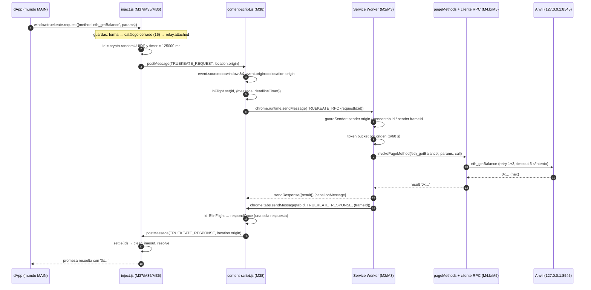

# 03 — Provider inyectado y relay página↔extensión

**Propósito.** Documentar, sobre el código real, cómo `inject.js` publica el provider EIP-1193/EIP-6963 en `window` (mundo MAIN), cómo el content script hace de relay entre ese mundo y el Service Worker, y qué protocolo de mensajes —ocho tipos, cerrados— une las cuatro capas de la cadena.

> **Recuentos de líneas.** Son los medidos leyendo cada fichero, no los del encargo. Difieren: `src/inject/index.ts` **247** (decía 223), `src/inject/provider.ts` **354** (decía 323), `src/inject/eip6963.ts` **116** (decía 105), `src/content-script.ts` **603** (decía 550), `src/inject/icon-data.ts` **16** (decía 14). `src/shared/protocol.ts` sí coincide: **171**.

---

## 1. Por qué hay cuatro saltos

### 1.1 El esquema real

Una dApp que llama a `window.truekeate.request({ method: 'eth_getBalance', params: [...] })` no habla con la extensión: habla con un objeto JavaScript publicado en el mundo MAIN. Ese objeto no puede tocar `chrome.*`, así que su única salida es `window.postMessage` hacia el content script, que vive en el **mundo aislado** del mismo documento. El content script sí puede usar `chrome.runtime` y con él alcanza al **Service Worker** (MV3). Son **cuatro contextos** y **cuatro saltos**:

| # | Contexto | Mundo | API que puede usar | Fichero |
|---|---|---|---|---|
| 0 | Página / dApp | MAIN | DOM, `window.postMessage` | — (`test.html` en local) |
| 1 | Provider inyectado | MAIN | DOM, `window.postMessage` | `src/inject/index.ts` (M37) |
| 2 | Content script (relay) | Aislado | DOM + `chrome.runtime` | `src/content-script.ts` (M38) |
| 3 | Service Worker | Extensión | `chrome.*` completo | `src/background.ts`, `src/background/rpc/router.ts` (M2/M3) |

### 1.2 Salto 1: página (MAIN) → content script (aislado)

#### Por qué la página no puede llamar a `chrome.*`

El provider se inyecta con una etiqueta `<script src="chrome-extension://<id>/inject.js">` creada por el content script (`src/content-script.ts:234-243`). Ese `<script>` se evalúa en el **mundo MAIN** —el mismo de la dApp, y por eso ve `window.truekeate—`, y precisamente por eso **`chrome.*` no existe ahí**: la API de extensiones solo se expone a contextos privilegiados (content scripts y páginas de la extensión). Todo el transporte del provider es, en consecuencia, `window.postMessage`.

La cabecera de M35 lo fija: el bundle de `inject.js` «no importa módulos del Service Worker (ADR-01 y §2.2: `inject.js` no accede a `chrome.*` ni al almacén)» (`src/inject/provider.ts:55-57`). La prueba estructural está en el build: `inject.js` es una entrada IIFE independiente (`vite.config.ts:52-54`) y su formato se justifica porque «el provider se inyecta como `<script>` síncrono en `document_start`» (`vite.config.ts:11-12`).

#### Por qué el content script no puede escribir en el `window` de la página

Los content scripts de MV3 viven en un **mundo aislado**: comparten el DOM con la página pero **no** su objeto `window` global. Un `window.truekeate = provider` ejecutado desde el content script sería invisible para la dApp. La extensión debe por tanto **inyectar código** en el mundo MAIN, y este repositorio lo hace **sin el permiso `scripting`**, retirado a propósito (H-36/D-P): el manifest declara `permissions: ['storage', 'alarms', 'favicon', 'clipboardRead', 'clipboardWrite']` (`src/manifest.ts:62`) y declara `inject.js` como recurso accesible desde la web (`src/manifest.ts:83-89`). El content script crea entonces la etiqueta y la marca:

```ts
// src/content-script.ts:234-243
const script = document.createElement('script');
script.src = runtime.getURL(INJECT_SCRIPT_PATH);
script.async = false;
script.setAttribute(RELAY_INJECT_ATTRIBUTE, '1');
const parent = document.head ?? document.documentElement;
parent.appendChild(script);
```

`runtime.getURL(INJECT_SCRIPT_PATH)` es la llamada real a `chrome.runtime.getURL` en **`src/content-script.ts:235`**, con `INJECT_SCRIPT_PATH = 'inject.js'` (`src/content-script.ts:64`). El punto de inserción es `document.head ?? document.documentElement` (**`src/content-script.ts:239`**) y el nodo se añade con `parent.appendChild(script)` (**`src/content-script.ts:243`**). `script.async = false` (`src/content-script.ts:237`) preserva el orden de ejecución respecto del resto de `<script>` del documento.

### 1.3 Los otros dos saltos

- **Salto 2 — content → SW:** `chrome.runtime.sendMessage` con el sobre `TRUEKEATE_RPC` (`src/content-script.ts:369-371`). El relay **no interpreta** el método ni decide permisos (`src/content-script.ts:22-26`).
- **Salto 3 — SW → content:** el SW responde por el canal asíncrono de `onMessage` (`src/background.ts:614`) y además **empuja** la respuesta con `chrome.tabs.sendMessage` (`src/background.ts:480-502`, mensaje en `:491`, destino por frame en `:493-497`).
- **Salto 4 — content → página:** `window.postMessage` de vuelta al mundo MAIN (`src/content-script.ts:211-218`), donde el listener de `src/inject/index.ts:181-210` resuelve la promesa o emite el evento.

### 1.4 La prueba de inyección

El relay marca la etiqueta con `data-truekeate-inject="1"` (`src/content-script.ts:70` y `:238`) y el provider exige esa marca leyéndola de `document.currentScript`:

```ts
// src/inject/index.ts:112-121
const relayAttached = (): boolean => {
  if (typeof document === 'undefined' || typeof HTMLScriptElement === 'undefined') {
    return false;
  }
  const script: unknown = document.currentScript;
  if (!(script instanceof HTMLScriptElement)) {
    return false;
  }
  return script.getAttribute(RELAY_INJECT_ATTRIBUTE) === '1';
};
```

Es la **prueba de inyección** (`src/inject/index.ts:44-48`): descarta tanto una importación directa en el arnés de pruebas como una copia que la página cargue con el mismo `src` para suplantar al provider. Sin marca, no hay relay, y el provider responde `4200` en lugar de colgar la promesa (`src/inject/index.ts:107-111`). La instalación es idempotente con `__truekeateRelayInstalled__` (`src/content-script.ts:73`, `:599-603`) y `__truekeateProviderInstalled__` (`src/inject/index.ts:52`, `:245-246`).

---

## 2. `src/inject/index.ts` (M37, 247 líneas)

### 2.1 Ejecución SÍNCRONA en `document_start`

El entry se declara «Entrada **SÍNCRONA** de `document_start`» (`src/inject/index.ts:3`). Importa por dos motivos encadenados: (1) el provider debe existir **antes de cualquier script de la página**, o una dApp que consulte EIP-6963 en su arranque vería cero proveedores; (2) el anuncio EIP-6963 debe ser síncrono, así que `installEip6963Announce` se invoca sin `await` y su listener se registra antes del primer anuncio (`src/inject/eip6963.ts:89-95`). El manifest garantiza el momento: `run_at: 'document_start'` y `all_frames: true` (`src/manifest.ts:79-80`), con `js: ['content-script.js']` (`src/manifest.ts:78`).

### 2.2 Publicación del provider y de su ALIAS

#### Las dos claves

`PROVIDER_WINDOW_KEY = 'truekeate'` en **`src/shared/constants.ts:216`** y `PROVIDER_WINDOW_ALIAS = 'codecrypto'` en **`src/shared/constants.ts:217`**, con el comentario «el provider y su alias, el MISMO objeto» (`src/shared/constants.ts:215`).

#### El MISMO objeto, no una copia

El provider se construye **una sola vez** en `installProvider` (`src/inject/index.ts:178`) y el **mismo descriptor** se aplica a las dos claves:

```ts
// src/inject/index.ts:212-220
// Publicación con definición NO configurable: la página no puede suplantar el provider.
const descriptor: PropertyDescriptor = {
  value: provider,
  writable: false,
  configurable: false,
  enumerable: true,
};
Object.defineProperty(window, PROVIDER_WINDOW_KEY, descriptor);
Object.defineProperty(window, PROVIDER_WINDOW_ALIAS, descriptor);
```

Las llamadas reales son `Object.defineProperty(window, PROVIDER_WINDOW_KEY, descriptor)` en **`src/inject/index.ts:219`** y `Object.defineProperty(window, PROVIDER_WINDOW_ALIAS, descriptor)` en **`src/inject/index.ts:220`**. El descriptor (`src/inject/index.ts:213-218`) fija `writable: false` y `configurable: false`: la página **no puede reasignarlos ni borrarlos**. Contrato en cabecera: «apuntan al **MISMO objeto**: no hay copia ni envoltorio» (`src/inject/index.ts:7-11`). Lo comprueban `src/inject/windowContract.spec.ts:107-125` (alias idéntico y descriptor en los dos nombres) y `src/inject/inject.spec.ts:95-106`, incluido `Reflect.deleteProperty(window, clave) === false` (`src/inject/inject.spec.ts:103`).

### 2.3 La escucha de `message` y el filtrado por `source`/`origin`

El puerto de entrada es un único listener registrado en `src/inject/index.ts:181`, cuya primera instrucción es la guarda:

```ts
// src/inject/index.ts:182-186
// Validación obligatoria del canal externo: `event.source === window` y
// `event.origin === location.origin`; cualquier otro mensaje se descarta sin más.
if (event.source !== window || event.origin !== location.origin) {
  return;
}
```

Solo después se mira el `type` (`src/inject/index.ts:187-190`): **`TRUEKEATE_RESPONSE`** exige `id: string` y resuelve con `settle(id, isEip1193Error(error) ? { error } : { result: message.result })` (`:191-199`), donde la comprobación de error es `typeof record?.code === 'number' && typeof record.message === 'string'` (`:102-105`); **`TRUEKEATE_EVENT`** llama a `emit(eventName, message.data)` si `isProviderEvent(eventName)` (`:201-207`). `TRUEKEATE_ANNOUNCE` viaja en sentido contrario y aquí no se atiende (`:209`).

#### Salida: `targetOrigin` siempre cerrado

El **único** punto de escritura hacia el content script usa `location.origin`, nunca `'*'`:

```ts
// src/inject/index.ts:139-142
/** Único punto de escritura hacia el content script: `targetOrigin` SIEMPRE cerrado (H-32). */
const postToRelay = (message: unknown): void => {
  window.postMessage(message, location.origin);
};
```

Regla general del módulo: «**Todo** `postMessage` saliente usa `targetOrigin = location.origin`, **nunca** `'*'` (H-32, RNF-10), y todo mensaje entrante se valida con `event.source === window` **y** `event.origin === location.origin`» (`src/inject/index.ts:17-19`).

### 2.4 Correlación de peticiones y red de seguridad

`installProvider` abre un `Map<string, PendingCall>` (`src/inject/index.ts:126`) y `settle` resuelve **una sola vez** cada `id`, borrando la entrada y cancelando su temporizador (`:129-137`). El `id` lo genera `newRequestId()` en el contexto de la página con `crypto.randomUUID()` y un respaldo `req-<base36>-<aleatorio>` (`:65-68`). Aviso de contrato: ese `id` «No es la identidad del provider: `PROVIDER_UUID` es un literal congelado (ADT-19/D-N) y no se genera nunca en runtime» (`src/inject/index.ts:149-150`).

La red de seguridad (H-07) se calcula así:

```ts
// src/inject/index.ts:54-62
const PAGE_REQUEST_TIMEOUT_MS = SIGN_TIMEOUT_MS + TIMEOUT_SAFETY_MARGIN_MS;
/** Segundos que declara el literal de vencimiento de §4.3 (120 s de firma/aprobación). */
const PAGE_REQUEST_TIMEOUT_SECONDS = Math.round(SIGN_TIMEOUT_MS / 1_000);
```

Con los valores de producción —`SIGN_TIMEOUT_MS = 120_000` (`src/shared/constants.ts:92`) y `TIMEOUT_SAFETY_MARGIN_MS = 5_000` (`src/shared/constants.ts:98`)— la red de la capa inject vence a los **125 000 ms**, 5 s después del plazo del Service Worker, dueño único del reloj. El error es `pageTimeoutError` con `code: 4001` y el literal de §4.3 (`src/inject/provider.ts:73-76`). Precisión medible: el **temporizador** dura 125 000 ms, pero el **texto** del error declara 120 s, porque `PAGE_REQUEST_TIMEOUT_SECONDS` se calcula sobre `SIGN_TIMEOUT_MS` sin el margen (`src/inject/index.ts:62`).

El temporizador se arma antes de publicar el mensaje (`src/inject/index.ts:158-167`) y `params` no clonables no escapan como excepción síncrona: el `try/catch` de `src/inject/index.ts:168-173` convierte el `DataCloneError` en `internalTransportError()` (`code: -32603`, `src/inject/provider.ts:83-86`). Contrato de M35: «`request({ method, params })` devuelve **siempre** una promesa y **nunca lanza de forma síncrona**» (`src/inject/provider.ts:14-15`).

---

## 3. `src/inject/provider.ts` (M35, 354 líneas)

### 3.1 La fábrica y el puente

`createTruekeateProvider(relay?)` es una **fábrica**, no un singleton de módulo, «para que `inject/index.ts` (M37) publique exactamente UNA instancia y su alias apunte a ella» (`src/inject/provider.ts:220-227`). Su `ProviderRelay` tiene dos miembros (`src/inject/provider.ts:160-173`): `attached: readonly boolean` («¿hay content script al otro lado?», `:161-165`) y `send(method, params): Promise<ProviderRelayOutcome>`, que «**Nunca lanza y nunca deja la promesa colgada**» (`:166-172`). `ProviderRelayOutcome` es la unión `{ result: unknown } | { error: Eip1193Error }` (`src/inject/provider.ts:153`): **o** `result`, **o** `error`, nunca los dos.

### 3.2 `request({ method, params })`

El orden de guardas está en el propio método: «forma del argumento → catálogo cerrado local → puente disponible → transporte» (`src/inject/provider.ts:238-240`).

1. **Forma.** `readMethod` lee `method` sin lanzar nunca (`src/inject/provider.ts:201-206`). Si es `null` o no está en el catálogo cerrado, rechaza con `4200` **sin viaje de ida y vuelta** (`:242-246`). `readParams` normaliza a lista, envolviendo un objeto en una lista de uno (`:208-218`).
2. **Puente.** `if (relay === undefined || !relay.attached) return Promise.reject(unsupportedMethodError())` (`src/inject/provider.ts:247-250`): es el caso «sin content script al otro lado».
3. **Transporte.** `relay.send(method, readParams(args)).then(...)` (`src/inject/provider.ts:252-264`): si el desenlace trae `'error' in outcome`, lanza ese error; si no, llama a `observeResponse(method, outcome.result)` y devuelve el resultado (`:257-258`). Un puente que rechazara se traduce a `internalTransportError()` como defensa en profundidad (`:260-263`).

`PAGE_METHODS` enumera los **16** métodos que una página puede invocar (`src/inject/provider.ts:97-114`): las 10 lecturas de `PageReadMethod` y los 6 aprobables de `ApprovalMethod`. `eth_sign` **no** figura a propósito («está retirado del catálogo y responde `4200`», `:93-95`). La exhaustividad se verifica en **tiempo de compilación** con `PageMethodsNotListed` y `pageMethodCatalogIsComplete` (`src/inject/provider.ts:121-123`): si la unión `PageMethod` gana un método y esta lista no lo incorpora, el módulo no compila.

### 3.3 `on` / `removeListener` / `emit`

#### Nombres reales

Los únicos métodos de escucha implementados son **`on`** (`src/inject/provider.ts:267-276`) y **`removeListener`** (`:278-284`), y ambos son **encadenables**: devuelven `provider` (`:275`, `:283`). **No existen** `listenerCount`, `addListener`, `once`, `removeAllListeners`, `send`, `sendAsync` ni `enable`; la búsqueda sobre `src/**` no encuentra `listenerCount` en ningún fichero propio. El registro interno es un `Map<ProviderEventName, Set<ProviderListener>>` (`src/inject/provider.ts:230`), y `on` ignora sin romper cualquier evento fuera del catálogo cerrado o cualquier listener que no sea función (`:268-271`).

#### `emit` (uso interno del puente)

No forma parte de la superficie EIP-1193 publicada: lo devuelve la fábrica junto al provider en `TruekeateProviderHandle` (`src/inject/provider.ts:180-184`) y lo consume `src/inject/index.ts:205`. Su secuencia real (`src/inject/provider.ts:334-351`): descartar un `eventName` fuera de `PROVIDER_EVENTS` (`:335-337`); llamar a `observe(eventName, data)` **antes** de avisar (`:338`); iterar sobre una **copia** de la lista, «porque una escucha puede darse de baja desde dentro de su propio callback» (`:343-344`); y envolver cada `listener(data)` en `try/catch`, porque «una escucha hostil (o con un fallo propio) no puede romper el provider ni al resto» (`:345-349`).

### 3.4 El TIPO de error que se rechaza

Todo error hacia la página es un objeto con `code` **numérico**, nunca una cadena ni un `Error` suelto (RNF-06/ACU-05):

| Constante | `code` | Mensaje | Línea |
|---|---|---|---|
| `UNSUPPORTED_METHOD_ERROR` / `unsupportedMethodError()` | `4200` | `El método solicitado no está soportado por TrueKeate Wallet.` | `src/inject/provider.ts:59-65` |
| `pageTimeoutError(segundos)` | `4001` | `El usuario no respondió en el plazo establecido (<n> s); la solicitud ha caducado.` | `src/inject/provider.ts:73-76` |
| `internalTransportError()` | `-32603` | `Error interno de la cartera.` | `src/inject/provider.ts:83-86` |

El `4200` es **el mismo literal** que responde el Service Worker: `src/inject/inject.spec.ts:124-129` compara `UNSUPPORTED_METHOD_ERROR` con `serviceWorkerUnsupportedMethodError()` para que una divergencia entre capas rompa la suite. La copia entregada es nueva en cada llamada —`({ ...UNSUPPORTED_METHOD_ERROR })` (`src/inject/provider.ts:65`)— «para que la página pueda mutar el objeto que recibe» (`:64`).

### 3.5 `isConnected` y las propiedades estándar: qué existe realmente

**No existe `isConnected`.** `TruekeateProvider` se extiende de `Eip1193Provider` y añade exactamente tres miembros (`src/shared/types.ts:158-163`): `isTrueKeate: true`, `chainId: ChainIdHex | null` y `selectedAddress: Address | null`, correspondidos uno a uno en `src/inject/provider.ts:232-235`.

| Propiedad | ¿Existe? | Evidencia |
|---|---|---|
| `isTrueKeate` | **Sí**, literal `true` | tipo en `src/shared/types.ts:160`; asignación en `src/inject/provider.ts:233`; comprobada en `src/inject/inject.spec.ts:81` y `src/inject/windowContract.spec.ts:111` |
| `isMetaMask` | **No** | sin coincidencias en `src/**` |
| `isConnected` | **No** | ver párrafo anterior |
| `chainId` | **Sí**, caché `ChainIdHex \| null` | `src/inject/provider.ts:234`; refrescada en `:294-295` y `:324-327` |
| `selectedAddress` | **Sí**, caché `Address \| null` | `src/inject/provider.ts:235`; refrescada en `:297-299` y `:328-330` |
| `request` / `on` / `removeListener` | **Sí** | `src/inject/provider.ts:241`, `:267`, `:278` |

Las cachés se refrescan «SIEMPRE, haya o no escuchas registradas: `provider.chainId` y `provider.selectedAddress` son estado del provider, no de las escuchas» (`src/inject/provider.ts:287-291`). `observe` cubre los cinco eventos (`:292-316`) y `observeResponse` cubre `eth_chainId`, `eth_accounts` y `eth_requestAccounts` para que el estado sea coherente antes del primer evento (`:318-331`); `disconnect` limpia **las dos** cachés (`:307-311`). Lo verifica `src/inject/inject.spec.ts:151-203`, incluido «la escucha NO vuelve a invocarse, pero la caché del provider SÍ se actualiza» (`:162-166`).

### 3.6 Specs de esta capa

- **`src/inject/windowContract.spec.ts` (184 líneas)** — `4200` como promesa y jamás como excepción síncrona (`:51-93`), publicación con dos nombres sobre el mismo objeto (`:99-150`), anuncio con identidad congelada (`:156-170`), stub de `chrome.*` (`:176-184`).
- **`src/inject/inject.spec.ts` (259 líneas)** — manifest `all_frames` + `document_start` (`:61-73`), alias idéntico (`:75-82`), superficie encadenable (`:84-93`), no configurabilidad (`:95-106`), `4200` sin lanzar (`:110-122`), sin relay todo responde `4200` (`:131-139`), escuchas y cachés (`:151-203`), icono PNG real de 96×96 leído del IHDR (`:214-243`), UUID congelado estable (`:245-258`).

---

## 4. `src/inject/eip6963.ts` (M36, 116 líneas)

### 4.1 Los dos eventos del protocolo

```ts
// src/inject/eip6963.ts:32-34
export const EIP6963_REQUEST_EVENT = 'eip6963:requestProvider' as const;
export const EIP6963_ANNOUNCE_EVENT = 'eip6963:announceProvider' as const;
```

### 4.2 El `detail` real del anuncio

```ts
// src/inject/eip6963.ts:73-78
const announce = (): void => {
  // `detail` NUEVO en cada anuncio: una dApp que lo mute no puede corromper el siguiente.
  const detail: Eip6963ProviderDetail = {
    info: providerInfo(cachedIcon),
    provider: publishedProvider(provider),
  };
```

El `detail` tiene **exactamente dos campos**: `info` y `provider`. Los cuatro campos de `info` los construye `providerInfo(icon)` (`src/inject/provider.ts:137-143`):

| Campo | Valor real | Fuente |
|---|---|---|
| `uuid` | `'9f2a4c1e-6b7d-4e0a-8c33-4f5b6d7e8a90'` | `PROVIDER_UUID`, `src/shared/constants.ts:213` |
| `name` | `'TrueKeate'` | `PROVIDER_NAME`, `src/shared/constants.ts:204` |
| `icon` | data-URI PNG base64 del isologo de 96 px | `src/inject/icon-data.ts:13-14` |
| `rdns` | `'academy.codecrypto.truekeate'` | `PROVIDER_RDNS`, `src/shared/constants.ts:207` |

El tipo es `Eip6963ProviderInfo` (`src/shared/types.ts:166-171`) y el `detail`, `Eip6963ProviderDetail` = `{ info, provider }` (`src/shared/types.ts:174-177`). Dos contratos que el código hace cumplir: el `uuid` es «**literal y congelado** (`PROVIDER_UUID`, ADT-19/D-N: nunca se regenera, ni en el re-anuncio ni entre versiones)» (`src/inject/eip6963.ts:16-18`), y `src/shared/naming.spec.ts:106-113` comprueba que `constants.ts`, `inject/provider.ts` e `inject/eip6963.ts` **no contienen** `randomUUID`; y `detail.provider` debe ser **el mismo objeto** que `window.truekeate`, así que `publishedProvider` lee la clave publicada y solo cae al argumento si la publicación aún no ocurrió (`src/inject/eip6963.ts:45-60`, comprobación de forma en `:57-59`).

`announce` despacha `new CustomEvent<Eip6963ProviderDetail>(EIP6963_ANNOUNCE_EVENT, { detail })` dentro de un `try/catch` tolerante a entornos sin `CustomEvent` (`src/inject/eip6963.ts:80-85`) y después avisa al puente con `onAnnounce?.(detail)` (`:86`).

### 4.3 Listener síncrono, auto-anuncio y re-anuncio

`installEip6963Announce` —invocado desde `src/inject/index.ts:225-232`, que además saluda al relay con `{ type: 'TRUEKEATE_ANNOUNCE', info: detail.info }` en `:226`— ejecuta, **en este orden**: (1) **listener síncrono** de `eip6963:requestProvider`, registrado dentro del IIFE, antes del primer anuncio y sin ningún `await` previo (`src/inject/eip6963.ts:89-92`; la cabecera avisa de que «si se registra tarde, el anuncio se pierde», `:10-12`); (2) **auto-anuncio** al cargar `inject.js` (`:94-95`); (3) **re-anuncio en `DOMContentLoaded`**, o en el turno siguiente (`queueMicrotask`) si el documento ya no está en `loading` (`:97-108`). Además, cada `eip6963:requestProvider` recibido dispara un anuncio nuevo: «(b) en **cada** `eip6963:requestProvider` recibido» (`src/inject/eip6963.ts:14`).

### 4.4 El icono: `src/inject/icon-data.ts` (16 líneas)

El fichero es **generado**: «ARCHIVO GENERADO — no editar a mano» (`src/inject/icon-data.ts:2`). Contiene **una única constante exportada** más un `export default`:

```ts
// src/inject/icon-data.ts:13-16
export const PROVIDER_ICON_DATA_URI: string =
  'data:image/png;base64,iVBORw0KGgoAAAANSUhEUgAAAGAAAABgCAYAAADimHc4AAAAAXNSR0IArs4c6Q…';

export default PROVIDER_ICON_DATA_URI;
```

Es decir: **un data-URI PNG en base64** y **nada más**. Su cabecera documenta el origen y el formato (`src/inject/icon-data.ts:4-8`): origen `public/brand/truekeate-mark-96.png`, de **15 246 bytes**; generador `scripts/generate-icon-data.mjs`, que se ejecuta en `prebuild`; y motivo (RT-03): «el código propio no puede usar `fetch`, y el anuncio EIP-6963 debe ser síncrono; el icono se incrusta en el bundle en tiempo de compilación». Contiene por tanto **una cadena base64 embebida**, no una ruta ni un SVG. M36 añade que es un «**data-URI PNG** del isologo de 96 px» (`src/inject/eip6963.ts:18`) y que la ruta `brand/truekeate-mark-96.png` es «solo informativa: el icono va incrustado» (`:36-37`). `src/inject/inject.spec.ts:235-242` decodifica el data-URI y mide los 96×96 reales en el IHDR. No hay E/S que esperar: `loadProviderIcon` es `async` pero devuelve la constante cacheada (`src/inject/eip6963.ts:39-43`). Para pruebas y `test.html` se exporta `providerIdentity` = `{ name: 'TrueKeate', rdns: PROVIDER_RDNS, uuid: PROVIDER_UUID }` (`src/inject/eip6963.ts:111-116`).

---

## 5. `src/content-script.ts` (M38, 603 líneas)

### 5.1 La inyección de `inject.js` y `web_accessible_resources`

```ts
// src/manifest.ts:83-89
web_accessible_resources: [
  {
    resources: ['inject.js'],
    matches: ['<all_urls>'],
    use_dynamic_url: true,
  },
],
```

`use_dynamic_url` (**`src/manifest.ts:87`**) hace que Chrome sirva el recurso bajo una **URL dinámica** derivada del ID **de la instalación** (no un UUID por anuncio) en vez de la ruta estable `chrome-extension://<EXTENSION_ID>/inject.js`. Consecuencias verificables aquí: (1) la etiqueta `<script>` se crea **siempre** con `chrome.runtime.getURL('inject.js')` (`src/content-script.ts:235`), nunca con una ruta absoluta escrita a mano, que sería la forma de romperse; (2) la huella del ID se sustituye por un UUID de host, de modo que la página no puede deducir el ID de la extensión leyendo el `src` —el E2E `e2e/07-provider.spec.ts:116-120` compara esa forma y localiza el script por su atributo (`:90`, `:113`), no por su `src`—; y (3) la identificación entre capas no usa esa cadena, sino la marca `data-truekeate-inject="1"` (`src/content-script.ts:238`).

El punto de inserción ya se citó en §1.2: `document.head ?? document.documentElement` (`src/content-script.ts:239`) con `appendChild` (`:243`) y `async = false` (`:237`), todo envuelto en `try/catch` para «Documento sin DOM escribible (marco de sólo lectura): el provider no se puede publicar» (`:244-246`).

#### El orden importa: primero escuchar, después inyectar

`installRelay` registra el canal de entrada **antes** de inyectar: (1) `window.addEventListener('message', …)` (`src/content-script.ts:569`), «ANTES de inyectar el provider, para que el saludo EIP-6963 y la primera petición encuentren siempre al relay escuchando» (`:567-568`); (2) `runtime.onMessage.addListener` para las respuestas empujadas y eventos (`:585-589`); (3) `injectProviderBundle()` (`:593`); y (4) `connectPort()` (`:596`). Si el orden se invirtiera, el saludo y la primera petición podrían emitirse antes de que existiera el listener (`src/content-script.ts:12-17`).

### 5.2 Validación de los mensajes `TRUEKEATE_*` que llegan de la página

```ts
// src/content-script.ts:253-268
const readPageEnvelope = (event: MessageEvent): RawPageEnvelope | null => {
  // Canal externo: se descarta cualquier mensaje que no venga de esta ventana y de este origen.
  if (event.source !== window || event.origin !== location.origin) {
    return null;
  }
  const data = asRecord(event.data);
  if (data === null) {
    return null;
  }
  const type: unknown = data.type;
  if (typeof type !== 'string' || !ACCEPTED_FROM_PAGE.includes(type)) {
    return null;
  }
  return { ...data, type };
};
```

Tres guardas encadenadas: **fuente y origen** (`src/content-script.ts:256`), **forma de objeto** (`:259-262`) y **tipo dentro de la lista cerrada** (`:263-266`). La lista es `ACCEPTED_FROM_PAGE = ['TRUEKEATE_REQUEST', 'TRUEKEATE_ANNOUNCE']` (`src/content-script.ts:76`): **solo dos** tipos pueden entrar desde la página. Un `TRUEKEATE_ANNOUNCE` se acepta y no se procesa (no tiene respuesta) y el resto va a `handlePageRequest` (`src/content-script.ts:574-579`).

### 5.3 Reenvío de `TRUEKEATE_RPC` con `requestId`

```ts
// src/content-script.ts:419-432
const message: RelayRpcMessage = {
  type: 'TRUEKEATE_RPC',
  method: typeof method === 'string' ? method : '',
  params: Array.isArray(params) ? params : [],
  origin: location.origin,
  tabId: null,
  frameId: null,
  requestId: id,
};
```

Cuatro decisiones de contrato: (1) **`id` obligatorio**: sin `id` de tipo `string` no vacío no hay correlación posible y el mensaje se descarta (`src/content-script.ts:412-416`); (2) el **método viaja LITERAL** aunque no exista en el catálogo, «el SW responde `4200` con el literal de §4.3, de modo que el error tiene una sola fuente» (`:421-423`); (3) **`origin` es el origen WEB declarado y es dato no fiable** (`:425-427`) y no debe confundirse con el `event.origin` del `MessageEvent` que valida `readPageEnvelope` (`:23-26`); (4) **`tabId`/`frameId` van a `null`** porque «el content script no conoce su propia pestaña: el SW los sustituye por `sender.tab.id` y `sender.frameId`» (`:144-146`), y **`requestId: id`** transporta el `id` de la página hasta la cola persistida (D-H4-E10): «El SW **no** lo interpreta (§2.2): no decide nada» (`:154-159`). El envío es `runtime.sendMessage(call.message, (response) => onRpcResponse(id, response))` (`src/content-script.ts:369-371`); un `id` repetido cierra la anterior con error antes de registrar la nueva (`:434-438`).

### 5.4 Entrega de `TRUEKEATE_RESPONSE` / `TRUEKEATE_EVENT` a la página

`FORWARDED_TO_PAGE = ['TRUEKEATE_RESPONSE', 'TRUEKEATE_EVENT']` (`src/content-script.ts:83`) es «el MISMO conjunto cerrado en las dos direcciones de salida`. `forwardToPage` (`:464-484`) **no reconstruye** el objeto: comprueba que el `type` esté en la lista (`:467-469`) y, si es una `TRUEKEATE_RESPONSE` cuyo `id` correlaciona con una llamada en vuelo, la entrega **una sola vez** y cierra la llamada (`:470-478`); en cualquier otro caso publica el sobre tal cual (`:483`), de modo que «`eventName`, `data` y cualquier campo extra (p. ej. el `origin` del sobre) viajan idénticos (nota H-39)» (`:454-458`). Los únicos efectos permitidos son de **observación**: si la resolución trae `approvalId: string` no vacío, se recuerda en `state.lastApprovalId` para el `RESUME` (`:479-482`).

`postToPage` usa `targetOrigin = location.origin`, «el único destino permitido; el comodín está prohibido (H-32, RNF-10)» (`src/content-script.ts:210-218`), y tolera que el resultado del SW no sea clonable: «la promesa de la página queda a cargo de la red de H-07» (`:215-217`). `buildResponse(id, response)` traduce el desenlace del SW a `{ type: 'TRUEKEATE_RESPONSE', id, result | error }` y, si no llega nada —`response` no es objeto, o no trae ni `error` ni `result`— responde `internalTransportError()` en lugar de dejar la promesa pendiente (`src/content-script.ts:277-290`).

### 5.5 La cota de transporte y el margen de seguridad

```ts
// src/content-script.ts:97-106
const TRANSPORT_TIMEOUT_MS = SIGN_TIMEOUT_MS + TIMEOUT_SAFETY_MARGIN_MS;
/** Primer retardo del reintento de transporte y tope del backoff (temporizadores LOCALES). */
const TRANSPORT_RETRY_BASE_MS = 250;
const TRANSPORT_RETRY_MAX_MS = 2_000;
```

`TRANSPORT_TIMEOUT_MS` vale **125 000 ms**. La cabecera explica el porqué: «Mientras no se agote NO se responde `-32603`: el SW puede estar suspendido y volver por la alarma de M15, y su resolución llegará empujada hasta aquí» (`src/content-script.ts:97-101`). Al agotarse, `onTransportDeadline` responde el error interno tipado (`:337-347`) como recurso simétrico a la red de H-07 de la capa inject (`:338-341`). `onRpcResponse` (`:382-408`) distingue tres desenlaces:

| Patrón | Expresión | Decisión |
|---|---|---|
| `UNRECEIVED_TRANSPORT_PATTERN` | `/could not establish connection\|receiving end does not exist/i` (`:112`) | el mensaje no llegó a nadie → **reintentar es seguro** y despierta al SW dormido (`:398-404`) |
| `FATAL_TRANSPORT_PATTERN` | `/extension context invalidated/i` (`:122`) | extensión recargada/huérfana → `-32603` de inmediato (`:393-397`) |
| cualquier otro | — | **no** se reescribe (sería efecto duplicado) y se espera la resolución empujada hasta la cota (`:406-407`) |

El caso «`The message port closed before a response was received.`» **no** es fatal a propósito: «D-H4-E10 consistía justo en tratarlo como tal» (`src/content-script.ts:117-120`). El backoff del reintento es local —`250/500/1000/2000 ms` con tope (`:314-316`)— y el `lastError` de `chrome.runtime` se lee **síncronamente** dentro del callback (`:349-353`).

### 5.6 El puerto de larga vida `truekeate_approval`

El nombre canónico es `APPROVAL_PORT_NAME = 'truekeate_approval'` (`src/shared/constants.ts:220`, reexportado en `src/shared/protocol.ts:26-29`). Es un «canal de transporte y correlación, **no** un *keep-alive* del Service Worker» (`src/content-script.ts:32-34`, `:536-538`). La reconexión usa backoff exponencial:

```ts
// src/content-script.ts:511-513
/** Retardo del siguiente intento: 1, 2, 4, 8, 16 s… con tope de 30 s (H-02). */
export const nextBackoffMs = (attempt: number): number =>
  Math.min(PORT_RECONNECT_BASE_MS * 2 ** Math.max(0, attempt), PORT_RECONNECT_MAX_MS);
```

Con `PORT_RECONNECT_BASE_MS = 1_000` (`src/shared/constants.ts:238`) y `PORT_RECONNECT_MAX_MS = 30_000` (`src/shared/constants.ts:239`), los retardos son 1/2/4/8/16 s… hasta 30 s. `connectPort` abre el puerto con `runtime.connect({ name: APPROVAL_PORT_NAME })` (`src/content-script.ts:522`), engancha `port.onMessage` para reenviar respuestas y eventos **literalmente** (`:527-529`) y `port.onDisconnect` para programar la reconexión (`:531-534`); un `connect` que lance también acaba en `scheduleReconnect()` (`:542-545`), que no duplica temporizadores (`:549-559`). El mensaje `RESUME` se envía **solo** si ya se observó un `approvalId`:

```ts
// src/content-script.ts:536-541
// `RESUME` al conectar: se envía solo si ya se OBSERVÓ un `approvalId` (lo publica una
// resolución empujada por el SW), tal y como exige H-02/ADT-15: el puerto es canal de
// transporte y correlación, nunca un *keep-alive*.
if (state.lastApprovalId !== null) {
  port.postMessage({ type: 'RESUME', approvalId: state.lastApprovalId });
}
```

Ese `approvalId` solo lo rellena `forwardToPage` (`src/content-script.ts:479-482`), y `RelayState` documenta el defecto corregido: «Antes estaba declarado y nunca se asignaba (D-H4-E10); ahora lo alimenta `forwardToPage`» (`:495-501`). El receptor en el SW es `registerApprovalPortListener` (`src/background/approvals/ports.ts:552-591`), que descarta puertos de otro nombre (`:558-560`) y atiende `RESUME` con `handleResume` (`:561-573`). El puerto **no** transporta el RPC ordinario: `TRUEKEATE_RPC` viaja por `chrome.runtime.sendMessage`; el puerto sirve a las respuestas empujadas y a la reanudación de aprobaciones.

---

## 6. El protocolo de mensajes

### 6.1 La fuente única: `src/shared/protocol.ts` (171 líneas)

El módulo declara que son **ocho** tipos, «no 6: la tabla heredada de nomenclatura omitía `TRUEKEATE_ANNOUNCE` y `RESUME`» (`src/shared/protocol.ts:7-8`). La unión cerrada está en `src/shared/protocol.ts:35-43`, su espejo en tiempo de ejecución en `:45-55` y el guardián es `isTruekeateMessageType` (`:160-162`); los 8 nombres quedan fijados por `src/shared/naming.spec.ts:58-68`.

### 6.2 Tabla de los ocho tipos

| Tipo | Dirección | Canal | Campos reales (verificados) |
|---|---|---|---|
| `TRUEKEATE_REQUEST` | inject → content | `window.postMessage` | `{ type, id: string, method: string, params?: unknown[] }` — `src/shared/protocol.ts:62-67`; emisor real `src/inject/index.ts:151-156` |
| `TRUEKEATE_RESPONSE` | content → página (salto 1) y SW → content (empuje) | `window.postMessage` / `chrome.tabs.sendMessage` | `{ type, id: string, result?: unknown, error?: Eip1193Error }` — `src/shared/protocol.ts:70-75`; constructor `src/content-script.ts:277-290`; emisor del SW `src/background.ts:491` |
| `TRUEKEATE_EVENT` | SW → content → inject → página | `chrome.tabs.sendMessage` + `window.postMessage` | `{ type, eventName: ProviderEventName, data: unknown }` — `src/shared/protocol.ts:78-82`; sobre del SW `src/background/events.ts:28-33` |
| `TRUEKEATE_ANNOUNCE` | inject → content | `window.postMessage` | **declarado** `{ type, info: Eip6963ProviderDetail }` (`src/shared/protocol.ts:85-88`); **emitido** `{ type, info: Eip6963ProviderInfo }` (`src/inject/index.ts:80-83`, construido en `:226`) |
| `TRUEKEATE_RPC` | content → SW | `chrome.runtime.sendMessage` | `{ type, method, params, origin: string, tabId: null, frameId: null, requestId: string }` — `src/content-script.ts:147-160` y `:419-432`; tipo normativo `src/shared/protocol.ts:105-122` |
| `SIGN_RESPONSE` | `notification.html` → SW | `chrome.runtime.sendMessage` | `{ type, approvalId: Uuid, success: boolean, error?: Eip1193Error }` — `src/shared/protocol.ts:125-130`; atendido en `src/background.ts:572-589` |
| `CONNECT_RESPONSE` | `connect.html` → SW | `chrome.runtime.sendMessage` | `{ type, requestId: Uuid, success: boolean, account?: Address, accountIndex?: number, error?: Eip1193Error }` — `src/shared/protocol.ts:133-140`; atendido en `src/background.ts:590-604` |
| `RESUME` | content → SW (y ventana de decisión) | puerto `truekeate_approval` | `{ type, approvalId: Uuid }` — `src/shared/protocol.ts:143-146`; emisor `src/content-script.ts:539-541`; receptor `src/background/approvals/ports.ts:561-573` |

Las agrupaciones son `PageMessage` (`src/shared/protocol.ts:91-95`, los cuatro de `window.postMessage`), `RuntimeMessage` (`:149-153`, los cuatro de `chrome.runtime` o el puerto) y `TruekeateMessage` (`:156-158`).

#### Desviación declarada en `TRUEKEATE_ANNOUNCE`

`src/shared/protocol.ts:85-88` tipa el campo como `info: Eip6963ProviderDetail`, pero el mensaje que realmente se envía transporta `Eip6963ProviderInfo` (los cuatro campos clonables: `uuid`, `name`, `icon`, `rdns`). El motivo está en `src/inject/index.ts:70-79`: §4.1.1 define el `detail` como `{ info, provider }`, pero `provider` contiene funciones y `window.postMessage` clona con *structured clone*, de modo que enviarlo lanzaría `DataCloneError`. El `detail` **íntegro** se entrega a la página por `CustomEvent`, que no clona nada (M36). Es una **desviación declarada**, no un descuido.

### 6.3 Uniones de métodos y de eventos (`src/shared/types.ts`, M55, 550 líneas)

| Unión | Cardinalidad | Línea |
|---|---|---|
| `PageReadMethod` | **10** lecturas | `src/shared/types.ts:100-110` |
| `ApprovalMethod` | **6** aprobables (`eth_sign` excluido) | `src/shared/types.ts:56-62` |
| `PageMethod` = `PageReadMethod \| ApprovalMethod` | 16 | `src/shared/types.ts:118` |
| `InternalMethod` | **16** métodos `wallet_*` | `src/shared/types.ts:73-97` |
| `WalletMethod` = `PageMethod \| InternalMethod` | 32 | `src/shared/types.ts:121` |
| `ProviderEventName` | **5** eventos | `src/shared/types.ts:124-129` |

Tipos de soporte citados aquí: `Address` (`:22`), `ChainIdHex` (`:31`), `Uuid` (`:43`), `ProviderListener` (`:132`), `RequestArguments` (`:139-142`), `Eip1193Error` (`:145-149`), `Eip1193Provider` (`:152-156`), `TruekeateProvider` (`:159-163`), `Eip6963ProviderInfo` (`:166-171`) y `Eip6963ProviderDetail` (`:174-177`).

### 6.4 Por qué `origin`, `tabId`, `frameId` y `requestId` NO son fiables

Los cuatro los escribe la capa no privilegiada —la página, o el content script por indicación suya—, así que cualquiera podría ser mentira. El diseño los trata como **declaraciones** y recalcula la verdad desde el emisor real que entrega Chrome:

- **El tipo lo dice.** `DeclaredContext` se rotula «Datos que el mensaje declara; son datos NO fiables» (`src/background/security/senderGuard.ts:62-68`) y `TruekeateRpcMessage.origin` lleva «Dato NO fiable: el SW lo recalcula desde `sender.origin`» (`src/shared/protocol.ts:109-110`).
- **`origin`** se deriva **solo** de `sender.origin` con `resolveOrigin` (`src/background/security/senderGuard.ts:159-173`). Regla dura: «Nunca se usa `sender.tab.url` (D-J / ADT-07)» (`:150-152`); el declarado se conserva únicamente para detectar discrepancias (`:279-280`).
- **`tabId`/`frameId`** se sustituyen por los del emisor real: `const frameId = typeof sender.frameId === 'number' ? sender.frameId : 0` y `const tabId = typeof sender.tab?.id === 'number' ? sender.tab.id : null` (`src/background/security/senderGuard.ts:265-267`), con el comentario «El `frameId` declarado se ignora: manda el del emisor real» (`:265`). El destino de la respuesta sale de ahí con `responseTargetFor` (`:322-332`).
- **`requestId`** no decide nada: «NO es identidad ni permiso: solo se persiste con la solicitud aprobable para correlacionar la respuesta empujada» (`src/background/rpc/router.ts:421-425`); el router lo transporta sin interpretarlo (`:602-604`, `:739-742`).

El caso concreto que esto cierra: en un iframe cross-origin, `sender.tab.url` apunta al **top frame** mientras `sender.origin` apunta al iframe, de modo que deducir el origen de la URL dejaría al iframe heredar la sesión del anfitrión. `src/background/originFrame.spec.ts:49-60` construye ese emisor exacto (`origin` del iframe, `url` del top) y comprueba que se resuelve el origen del iframe (`:84`), que la respuesta vuelve solo a ese frame (`:96`) y que sin `sender.origin` una página recibe `4100` en vez de caer a `sender.tab.url` (`:107-121`). El E2E equivalente es `e2e/28-iframe-hostil.spec.ts` (174 líneas): servidor efímero en `127.0.0.1` con puerto 0 (`:66-73`), iframe inyectado desde el top (`:87-97`) y `eth_accounts` del frame devolviendo `[]` (`:113-114`).

---

## 7. Recorrido completo de una llamada

### 7.1 `eth_getBalance` paso a paso

| # | Salto | Fichero:línea | Qué ocurre |
|---|---|---|---|
| 1 | dApp → provider | — | `window.truekeate.request({ method: 'eth_getBalance', params: ['0x…','latest'] })` |
| 2-4 | provider valida y normaliza | `src/inject/provider.ts:242-246`, `:247-250`, `:211-218` | forma → catálogo cerrado (`eth_getBalance` está en `PAGE_METHODS`, `:102`) → `relay.attached` → `readParams` |
| 5-6 | provider arma y publica | `src/inject/index.ts:151-167`, `:140-142` (llamado en `:169`) | `{ type:'TRUEKEATE_REQUEST', id, method, params }`, `PAGE_REQUEST_TIMEOUT_MS` = 125 000 ms, `window.postMessage(message, location.origin)` |
| 7-8 | content script valida y decide | `src/content-script.ts:254-268` (guarda en `:256`, tipo en `:264`), `:574-579` | no es `ANNOUNCE` → `handlePageRequest` |
| 9-10 | content script construye el sobre | `src/content-script.ts:419-432`, `:439-447` | `TRUEKEATE_RPC` con `origin`, `tabId:null`, `frameId:null`, `requestId:id`; `inFlight.set` y `deadlineTimer` (`:443-445`) |
| 11 | salto 2 | `src/content-script.ts:369-371` | `chrome.runtime.sendMessage(call.message, callback)` |
| 12-13 | SW recibe y enruta | `src/background.ts:566-628` (tipo en `:568`), `:605` | `handleRpcMessage(message, toSenderLike(sender))` |
| 14-15 | router despacha | `src/background/rpc/router.ts:709-751`, `:457-464` | `declared` (`:732-736`), `requestId` (`:740-742`), `dispatchRPCRequest` + traza |
| 16-18 | guardas, catálogo y tasa | `src/background/rpc/router.ts:521`, `:529-536`, `:539-547`, `:566-571` | `redactSafely`, `guardSender`, `isCatalogMethod`, *token bucket* 6/60 s (`4001` sin llamar al nodo si excede) |
| 19-20 | despacho de la lectura | `src/background/rpc/router.ts:611-624`, `src/background/rpc/pageMethods.ts:315-329` | `entry.resolve` → `invokePageMethod` → `PAGE_READ_HANDLERS` (`:321`) |
| 21-23 | handler del saldo | `src/background/rpc/pageMethods.ts:185-192`; `src/background/rpc/router.ts:275-278` | dirección validada (`:186-189`), `rpcClient.getBalance` → `getBalanceWei` (M5, reintentos 1+3), y la conversión a hexadecimal del protocolo con `toString(16)` sobre el `bigint` (**`pageMethods.ts:191`**) |
| 24-25 | respuesta y empuje | `src/background/rpc/router.ts:153-154`, `src/background.ts:614-615` | `toRpcResponse` → `{ result }`; `sendResponse` + `deliverToPage` |
| 26 | empuje a la pestaña | `src/background.ts:480-502` | `{ type:'TRUEKEATE_RESPONSE', ...response }` (`:491`); con `frameId !== 0` **solo** a ese frame (`:493-497`) |
| 27-28 | content recibe y correlaciona | `src/content-script.ts:586-588`, `:470-478` | el `id` está en `inFlight` → `respondOnce(id, message)` (`:475`) |
| 29 | o por el canal de `sendMessage` | `src/content-script.ts:382-391` | si llega el callback del paso 11 → `buildResponse` + `respondOnce` |
| 30-32 | publicación y resolución | `src/content-script.ts:211-218` (llamado en `:334`); `src/inject/index.ts:184-199`; `:129-137` → `src/inject/provider.ts:253-258` | `window.postMessage`; guardas, `settle(id, …)`; `observeResponse('eth_getBalance', …)` no cambia cachés (solo lo hacen `eth_chainId`/`eth_accounts`/`eth_requestAccounts`, `src/inject/provider.ts:323-331`) |

### 7.2 Diagrama de secuencia



### 7.3 Notas sobre el recorrido

- **La respuesta puede llegar por dos caminos** (pasos 25 y 26-27). `respondOnce` garantiza que la página reciba **una sola** (`src/content-script.ts:330-335`) y `onRpcResponse` descarta la respuesta tardía si la petición ya se resolvió por la vía empujada (`:384-387`, cierre de X-06).
- **El `requestId` es lo que hace que se resuelva la promesa correcta.** En los aprobables, el SW persiste ese `id` con la solicitud y la resolución empujada vuelve con él, no con el `approvalId`: `responseCorrelationId` (`src/background/approvals/ports.ts:445-448`) y `resolutionEnvelope` (`:457-465`), que añade `approvalId` para el `RESUME` del relay. Sin esa correlación, «responder con `approvalId` la dejaría COLGADA hasta su red de seguridad (D-H4-E10, H-07)» (`:442-443`).
- **`eth_getBalance` no es aprobable:** no pasa por la cola ni por la ventana única; su ruta es la de las 10 lecturas (`src/background/rpc/router.ts:611-624`). Si el nodo está caído, la página recibe `4900` en vez de una respuesta inventada (`src/background/rpc/pageMethods.ts:168-176`), reservado a «no hubo respuesta» (`:198-206`).

---

## 8. Eventos del provider

### 8.1 Los cinco nombres

```ts
// src/shared/constants.ts:228-235
/** Nombres de evento del provider EIP-1193 (catálogo cerrado de 5). */
export const PROVIDER_EVENTS = [
  'accountsChanged',
  'chainChanged',
  'connect',
  'disconnect',
  'message',
] as const;
```

Son **cinco** (**`src/shared/constants.ts:229-235`**) y la unión `ProviderEventName` los repite como tipo (`src/shared/types.ts:124-129`). `isProviderEvent` valida contra esa lista (`src/inject/provider.ts:130-131`) y `on` ignora cualquier otro nombre sin romper la página (`:268-271`).

### 8.2 De `src/background/events.ts` a `provider.emit`

El emisor construye **un** sobre y lo entrega pestaña a pestaña: `const envelope: TruekeateEventEnvelope = { type: 'TRUEKEATE_EVENT', eventName, data }` (**`src/background/events.ts:141`**), dentro de `emitProviderEvent` (`:134-154`). El destinatario lo elige `sendEventToTab` (`:106-127`), **el único punto que llama a `chrome.tabs.sendMessage`**: con `frameId !== 0` acota la entrega a ese frame (`:116-117`) y al top frame responde sin opciones (`:118-119`). Una pestaña sin content script **no rompe la propagación**: el error se captura y el resto sigue (`:122-126`; comprobado en `src/background/originFrame.spec.ts:264-276`, donde 3 pestañas con una caída entregan 2). Los helpers son `emitAccountsChanged` (`:157-158`), `emitConnect` (`:164-165`), `emitDisconnect` (`:168-171`), `emitChainChanged` (`:185-188`) y `emitMessage` (`:194-195`).

El relay lo recibe por `runtime.onMessage` (`src/content-script.ts:586-588`) y `forwardToPage` lo publica **literalmente** (`:464-484`) con `postToPage` → `window.postMessage(message, location.origin)` (`:211-218`). En la página, el listener de `src/inject/index.ts:201-207` valida `isProviderEvent(eventName)` y llama a `emit(eventName, message.data)`, que refresca cachés y avisa a las escuchas (`src/inject/provider.ts:334-351`).

### 8.3 Carga útil de cada evento

| Evento | Carga útil real | Evidencia |
|---|---|---|
| `accountsChanged` | **array de direcciones**; `[]` al revocar | `emitAccountsChanged` publica `[...accounts]` (`src/background/events.ts:157-158`); el provider toma la primera con `firstAccount` (`src/inject/provider.ts:192-199`); E2E `e2e/08-eventos.spec.ts:73` |
| `chainChanged` | **el propio `ChainIdHex`**, hexadecimal y **sin envoltorio** | `emitChainChanged` pasa `chainId` tal cual (`src/background/events.ts:185-188`); el comentario explica que EIP-1193 lo exige así y no como `{ chainId }` (`:173-184`); el provider lo asigna directo a `provider.chainId` (`src/inject/provider.ts:293-296`) |
| `connect` | objeto `{ chainId }` | `emitConnect` (`src/background/events.ts:164-165`); el provider lee `asRecord(data)?.chainId` (`src/inject/provider.ts:300-305`) |
| `disconnect` | objeto de error `{ code, message }` | `emitDisconnect` (`src/background/events.ts:168-171`); el provider **limpia las dos cachés** (`src/inject/provider.ts:307-311`) |
| `message` | carga arbitraria de la dApp | `emitMessage` (`src/background/events.ts:194-195`); **no se emite** en H3, «no hay ningún método que lo produzca» (`:190-193`); el provider no hace nada con él (`src/inject/provider.ts:312-314`) |

### 8.4 Quién emite qué, y a quién

- **`accountsChanged`** sale de la revocación y del cambio de cuenta activa; `e2e/08-eventos.spec.ts` (270 líneas) comprueba que `[]` llega **a las dos pestañas conectadas y a ninguna más** (`:73`) y que el cambio desde el popup emite la cuenta nueva (`:162`).
- **`connect`** se emite al crear la sesión de un origen o al recuperarla tras una recarga: `handleRequestAccounts` lo emite con `chainId` en los dos caminos (`src/background/rpc/pageMethods.ts:261-265`, `:280-284`).
- **`chainChanged`** se emite a **todas** las pestañas abiertas, nazca el cambio en el popup o en una dApp: «ninguna pestaña debe quedarse con la red vieja» (`src/background/events.ts:179-183`).
- **`disconnect`** corresponde a «el nodo dejó de responder (`4900`) o la sesión se perdió» (`src/background/events.ts:167`).
- **La caché actúa como observador:** `emit` llama **siempre** a `observe` antes de notificar (`src/inject/provider.ts:338`), así que `chainId` y `selectedAddress` quedan al día aunque no haya escuchas. Tras `removeListener`, la escucha no vuelve a invocarse pero `selectedAddress` **sí** cambia (`src/inject/inject.spec.ts:162-166`).

---

## 9. Modo de fallo

### 9.1 Si el Service Worker está suspendido

MV3 suspende el SW cuando no tiene trabajo; el diseño lo asume en tres puntos:

1. **El SW no usa temporizadores propios.** El vencimiento lo posee `chrome.alarms` (M15) y la reconciliación de arranque rearma las alarmas desde el `expiresAt` persistido: «Nunca usa `setTimeout` ni `setInterval` (prohibidos en el SW: no sobreviven a la suspensión)» (`src/background.ts:444-445`, con `runApprovalReconciliation` en `:447-465`).
2. **El relay reintenta solo lo reintentable.** Un `sendMessage` que vuelve vacío **no** se traduce en `-32603` inmediato: si el error garantiza que el mensaje no llegó a nadie, se reescribe con backoff 250→2000 ms, «y es lo que despierta a un Service Worker dormido» (`src/content-script.ts:398-404`, `:108-112`).
3. **El resto de fallos espera.** Si el canal se cerró con el SW ya trabajando, **no** se reescribe —sería efecto duplicado— y se aguarda la resolución empujada hasta agotar los 125 000 ms (`src/content-script.ts:406-407`).

Lo mide `e2e/29-sw-suspendido.spec.ts` (180 líneas): suspende el SW a mitad de una aprobación con **CDP** `ServiceWorker.stopWorker` vía `stopServiceWorker` (`:106`, implementado en `e2e/fixtures/extension.ts:292`; no se usa `chrome://serviceworker-internals` ni `chrome.runtime.terminate`), verifica `status() === 'stopped'` (`:107-108`) y `waitUntilRunning(30_000)` (`:112`), e inyecta una alarma de 3 s (`:110`). Aserta `code` **4001** con el mensaje de plazo (`:136-137`), nonce intacto (`:144`), marca de transacción en vuelo vacía (`:145`) y reconstrucción **< 1 s** (`:147`, RNF-08).

### 9.2 Si la pestaña no tiene content script

| Detección | Efecto | Evidencia |
|---|---|---|
| El bundle se evalúa sin la marca `data-truekeate-inject="1"` | `relayAttached()` es `false`; **todo** método del catálogo responde `4200` en cuanto se llama, sin colgar la promesa | `src/inject/index.ts:112-121`, `:110-111`; probado en `src/inject/inject.spec.ts:131-139` |
| `chrome.runtime.sendMessage` sin receptor | vuelve vacío con «Could not establish connection…» → **reintento** con backoff; si el patrón es «extension context invalidated» → `-32603` inmediato | `src/content-script.ts:112`, `:122`, `:393-404` |
| El SW empuja un evento a una pestaña sin content script | `sendEventToTab` captura el fallo y devuelve `false`; **el resto de pestañas sigue recibiendo** | `src/background/events.ts:122-126`; probado en `src/background/originFrame.spec.ts:264-276` |

Además, el content script se inyecta en **todos** los frames (`all_frames: true`, `src/manifest.ts:80`), así que un iframe tiene su propio relay y su propio provider: `e2e/28-iframe-hostil.spec.ts:104-109` comprueba que el provider existe **dentro** del frame.

### 9.3 Si el mensaje no es del protocolo

- **En el content script:** `readPageEnvelope` devuelve `null` y el mensaje se descarta sin más, por fuente/origen distinto (`src/content-script.ts:256`), por no ser objeto plano (`:259-262`) o por `type` fuera de `ACCEPTED_FROM_PAGE` (`:263-266`).
- **En el provider:** `asRecord` nulo, o `type` que no es ni `RESPONSE` ni `EVENT`, y el listener no hace nada (`src/inject/index.ts:187-209`); la guarda de `event.source`/`event.origin` filtra antes que nada (`:184`).
- **En el SW:** `registerRpcMessageListener` comprueba `isTruekeateMessageType(record.type)` y, si no lo es, **no responde ni retiene el canal** (`return undefined`), «así no se deja colgada a ninguna otra superficie» (`src/background.ts:566-571`). El router devuelve `undefined` por lo mismo (`src/background/rpc/router.ts:714-721`); un tipo **del protocolo** que no sea `TRUEKEATE_RPC` recibe `4200` (`:722-728`), fijado para `SIGN_RESPONSE`, `CONNECT_RESPONSE` y `RESUME` en `src/background/messaging.spec.ts:162`.
- **En el puerto de aprobación:** una petición distinta de `RESUME` recibe `4200` por el propio puerto (`src/background/approvals/ports.ts:578-579`, `:535-539`).

### 9.4 Si vence el plazo en la capa inject

La capa inject es **red de seguridad**, no dueña del plazo. La cadena temporal completa:

| Dueño | Plazo | Constante | Efecto que ve la página |
|---|---|---|---|
| Service Worker (M15, `chrome.alarms`) | 120 s | `SIGN_TIMEOUT_MS` = `120_000` (`src/shared/constants.ts:92`) | `4001` con el literal de vencimiento |
| Capa inject (M37) | 125 s | `SIGN_TIMEOUT_MS + TIMEOUT_SAFETY_MARGIN_MS` (`src/inject/index.ts:59`) | promesa rechazada con `pageTimeoutError(120)` → **`code: 4001`** |
| Cota de transporte del relay (M38) | 125 s | `TRANSPORT_TIMEOUT_MS` (`src/content-script.ts:102`) | si nadie respondió en absoluto, `TRUEKEATE_RESPONSE` con `internalTransportError()` → **`code: -32603`** |

El margen existe para que «la red del SW venza siempre ANTES que la de la página y el error que ve la dApp siga siendo el del dueño único del plazo» (`src/inject/index.ts:54-58`). La constante es `TIMEOUT_SAFETY_MARGIN_MS = 5_000` en **`src/shared/constants.ts:98`** (el comentario que la explica ocupa la línea **97**, de ahí el rango `97-98` del encargo). Detalle ya señalado: el temporizador de la capa inject dura 125 000 ms, pero el **texto** del error declara 120 s (`PAGE_REQUEST_TIMEOUT_SECONDS`, `src/inject/index.ts:62`).

#### Cobertura de pruebas de este modo de fallo

- `src/inject/windowContract.spec.ts` (184 líneas): `request` rechaza **como promesa** y nunca lanza de forma síncrona (`:51-63`), el literal `4200` coincide con el del SW (`:65-73`), catálogo de 5 eventos en `on`/`removeListener` (`:75-92`), no configurabilidad y no borrado de las dos claves (`:117-140`).
- `src/inject/inject.spec.ts` (259 líneas): sin relay todo responde `4200` en lugar de colgarse (`:131-139`), `args` malformado no lanza (`:141-148`), una escucha hostil no rompe al resto (`:182-203`), el error cruza `window.postMessage` como objeto clonable (`:205-210`).
- `src/background/originFrame.spec.ts` (293 líneas): origen del frame recalculado (`:82-138`), aislamiento de sesión top/iframe (`:141-229`), destino por frame y reenvío literal de eventos (`:231-292`).
- `test/oracle/ports.spec.ts` (706 líneas): puerto `truekeate_approval`, `RESUME` con la solicitud completa y entrega de la resolución por orden de preferencia (puerto vivo → pestaña/frame → sin destinatario).

### 9.5 E2E que cubren este subsistema

Localizados con `glob` bajo el patrón `e2e/**/*.spec.ts`:

| Fichero | Líneas | Qué cubre |
|---|---|---|
| `e2e/07-provider.spec.ts` | 305 | alias `window.truekeate === window.codecrypto` y superficie completa (`:76`), etiqueta inyectada `script[data-truekeate-inject="1"]` (`:90`, `:113`) y URL dinámica (`:116-120`), ID de extensión estable derivado de la `key` (`:127`), anuncio EIP-6963 con icono PNG de 96 px (`:160`), `4200` sin lanzar de forma síncrona (`:230`, con `code` en `:255-258`) y lecturas reales contra Anvil (`:261`) |
| `e2e/08-eventos.spec.ts` | 270 | `accountsChanged []` a las dos pestañas conectadas y a ninguna más (`:73`), cambio de cuenta desde el popup con la cuenta nueva (`:162`), `selectedAddress` en la dApp (`:126`, `:217`) |
| `e2e/21-eip6963.spec.ts` | 142 | anuncio con identidad vinculante e icono incrustado (`:69`), `detail.provider === window.truekeate` (`:100`), alias congelado (`:101`), UUID v4 estable entre anuncios (`:92-95`, `:113`), re-anuncio al pedirlo la dApp (`:105-111`) |
| `e2e/28-iframe-hostil.spec.ts` | 174 | iframe cross-origin que recibe `[]` y nunca la cuenta del top (`:57`, `:113-114`), provider presente dentro del frame (`:104-109`), `4001` al cancelar la conexión del iframe (`:131`, `:140`) |
| `e2e/29-sw-suspendido.spec.ts` | 180 | SW suspendido por CDP y despertado por alarma: `4001` sin doble difusión, reconstrucción < 1 s (`:67`, `:136-147`) |

Observación transversal verificada: **ninguno** de estos cinco E2E aserta el margen de 5 000 ms ni referencia `TIMEOUT_SAFETY_MARGIN_MS`; ese margen se cubre por lectura de código en `src/shared/constants.ts:98`, `src/inject/index.ts:59` y `src/content-script.ts:102`. Los plazos que los E2E inyectan son otros: `VITE_SIGN_TIMEOUT_MS=3000` y `VITE_CONNECT_TIMEOUT_MS=2000` en `e2e/global-setup.ts:46-47`, que afectan de forma indirecta a `e2e/28-iframe-hostil.spec.ts` (plazo de conexión de 2 s citado en `:139`) y a `e2e/29-sw-suspendido.spec.ts`, sin aserción del margen.

### 9.6 Fugas de seguridad descartadas

- **Ningún secreto cruza el canal.** `inject.js` no accede a `chrome.*` ni al almacén (`src/inject/provider.ts:55-57`), regla repetida en M37 (`src/inject/index.ts:20`) y M38 (`src/content-script.ts:50-51`): solo viajan método, `params` y resultado público.
- **Ningún `postMessage` usa el comodín** (H-32/RNF-10), en los dos extremos del salto 1: `location.origin` en `src/inject/index.ts:141` y `src/content-script.ts:214`.
- **La página no puede suplantar al provider:** `writable: false` y `configurable: false` (`src/inject/index.ts:219-220`), con dos specs que intentan reasignar, redefinir y borrar (`src/inject/windowContract.spec.ts:127-140`, `src/inject/inject.spec.ts:95-106`).
- **El origen real nunca se deduce de datos declarados** (`src/background/security/senderGuard.ts:150-152`, `:159-173`), riesgo bloqueante cubierto por `src/background/originFrame.spec.ts`.
- **El cuerpo de una solicitud de aprobación no se difunde:** el empuje del SW a `notification.html` usa el canal de páginas de la extensión y «un `chrome.runtime.sendMessage` emitido por el SW **no** llega a los content scripts» (`src/background/approvals/ports.ts:330-341`).

### 9.7 Pendiente de confirmar

- El comentario de `e2e/21-eip6963.spec.ts:103` atribuye al clic de `#btn-eip6963` el segundo `eip6963:requestProvider`, pero el `dispatchEvent` de ese evento vive en `test.html`, fuera del alcance de este manual: **pendiente de confirmar** leyendo `test.html`.
- La aserción sobre la forma de la URL dinámica en `e2e/07-provider.spec.ts:116-120` se ha leído como «huella del ID sustituida por un UUID de host»; el detalle literal del algoritmo de Chrome no es verificable desde este repositorio: **pendiente de confirmar** contra la documentación de la plataforma.
- `relayAttached()` depende de `document.currentScript` (`src/inject/index.ts:116`). En jsdom ese valor es `null` y por eso la suite cubre el camino «sin relay»; no se ha localizado un test unitario que ejercite el camino **con** relay dentro de `src/inject/**`, cubierto por el E2E `e2e/07-provider.spec.ts:90`.
