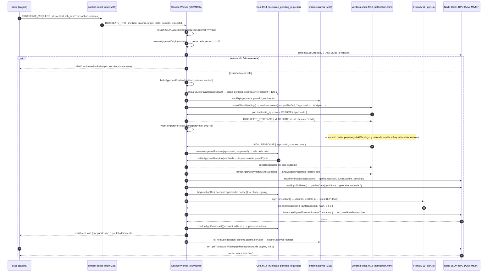

# 04 — Aprobaciones, vista previa y firma

Propósito: documentar, contra el código real de TrueKeate Wallet, cómo una petición de dApp se convierte en **solicitud aprobable**, cómo se encola, cómo vence, cómo se reconcilia al arrancar el Service Worker, cómo se transporta por el puerto de larga vida, cómo se muestra en la **ventana única de decisión**, cómo se construye su **vista previa** con la tabla local cerrada de selectores y cómo se **firma y difunde** hasta el recibo; todas las referencias son `ruta:línea` verificadas contra el fichero leído y lo no verificable se marca «pendiente de confirmar».

## 1. Qué es una solicitud aprobable

### 1.1 La marca `requiresApproval` del catálogo

Cada método del catálogo (M3) se declara con un `CatalogEntry` que incluye el booleano `requiresApproval`, documentado como «`true` cuando el método abre la ventana única de confirmación (P-21)» (`src/background/rpc/catalog.ts:218-219`). Ese booleano es la **única** marca que convierte una llamada en solicitud aprobable: no hay listas paralelas ni comprobaciones por nombre dispersas.

#### 1.1.1 Los seis métodos aprobables

`PAGE_APPROVAL_METHODS` (`src/background/rpc/catalog.ts:159-167`) se proyecta a entradas con `kind: 'approval'`, `requiresApproval: true`, `implemented: true` y `resolve: false` (`src/background/rpc/catalog.ts:398-412`).

| Método | Contexto | `requiresApproval` | `ruta:línea` |
|---|---|---|---|
| `eth_sendTransaction` | `page` | `true` | `src/background/rpc/catalog.ts:406` |
| `eth_signTypedData_v4` | `page` | `true` | `src/background/rpc/catalog.ts:406` |
| `personal_sign` | `page` | `true` | `src/background/rpc/catalog.ts:406` |
| `wallet_switchEthereumChain` | `page` | `true` | `src/background/rpc/catalog.ts:443-450` |
| `wallet_addEthereumChain` | `any` | `true` | `src/background/rpc/catalog.ts:451-458` |
| `wallet_revokePermissions` | `any` | `true` | `src/background/rpc/catalog.ts:419-426` |

La unión cerrada vive en `src/shared/types.ts:56-62` (`ApprovalMethod`), con la nota de que **`eth_sign` no figura**: responde `4200` antes de crear ninguna entrada en la cola (`src/shared/types.ts:52-55`). Se refuerza en el catálogo: `eth_sign` no aparece en `CATALOG_METHODS` (`src/background/rpc/catalog.ts:196-201`) y su ausencia se documenta en `src/background/rpc/catalog.ts:461-469`.

#### 1.1.2 Qué métodos NO abren ventana

Las **10 lecturas de página** (`src/background/rpc/catalog.ts:146-157`) llevan `requiresApproval: false` (`src/background/rpc/catalog.ts:377-391`), y los **16 métodos internos** `wallet_*` (`src/shared/types.ts:73-97`) también, en `INTERNAL_ENTRIES` (`src/background/rpc/catalog.ts:230-364`); el catálogo lo enuncia como regla 6: «Ningún método interno abre la ventana única (P-21)» (`src/background/rpc/catalog.ts:35`). `eth_requestAccounts` tampoco es aprobable en esta cola: abre su propia ventana de conexión y su solicitud vive en `truekeate_connect_request`, con plazo de 60 s (`src/shared/constants.ts:94-95`). Desde el popup, `wallet_switchEthereumChain` **sí** exige aprobación cuando la red destino no es la activa (`src/background/rpc/catalog.ts:183-185`) y `wallet_addEthereumChain` también, pues «**no hay excepción por contexto**» (`src/background/rpc/catalog.ts:186-188`); por eso ambos figuran en `EXTENSION_INVOKABLE_INTERNAL_METHODS` (`src/background/rpc/catalog.ts:190-194`).

#### 1.1.3 La única excepción de contexto

El router aplica tres condiciones (`src/background/rpc/router.ts:591-609`): los dos métodos de red se excluyen de la ruta genérica porque tienen la suya (paso 6.b, `src/background/rpc/router.ts:626-649`), y `wallet_revokePermissions` **desde el popup** se despacha por el manejador interno de la tarea 3.11, porque su confirmación es la UI de «Sitios conectados» (RF-26), no la ventana única (`src/background/rpc/router.ts:593-595`). La condición final es `entry.requiresApproval && !isNetworkMethod && !revocacionDesdeElPopup` (`src/background/rpc/router.ts:596`); el comentario registra el defecto corregido en fase 4: excluir *todo* contexto de extensión hacía que el popup respondiera `4200` y no pudiera enviar nada.

### 1.2 El tipo `PendingRequest` (M55)

`PendingRequest` vive en `src/shared/types.ts:258-296` y su comentario fija la forma persistida: «Entrada de la cola `truekeate_pending_requests` (`Record<approvalId, PendingRequest>`). SIN `windowId`: la ventana única se persiste en `truekeate_approval_window` (P-21)» (`src/shared/types.ts:254-257`).

#### 1.2.1 Campos reales

| Campo | Tipo | Línea | Observación verificada |
|---|---|---|---|
| `approvalId` | `Uuid` | `src/shared/types.ts:259` | Clave del mapa persistido. |
| `method` | `ApprovalMethod` | `src/shared/types.ts:260` | Una de las seis de `src/shared/types.ts:56-62`. |
| `params` | `unknown[]` | `src/shared/types.ts:262` | «Persistidos REDACTADOS (H-42)». |
| `origin` | `string` | `src/shared/types.ts:264` | «Origen normalizado: minúsculas, sin barra final, con puerto». |
| `tabId` / `frameId` | `number \| null` | `src/shared/types.ts:266`, `:268` | `tabId` es `null` si la solicitud nace en el popup; `frameId` `0` = top frame y distinto de 0 exige responder SOLO a ese frame. |
| `account` | `Address` | `src/shared/types.ts:269` | Cuenta que firmará. |
| `chainId` | `ChainIdHex` | `src/shared/types.ts:270` | Red de la solicitud. |
| `createdAt` | `number` | `src/shared/types.ts:277` | Reloj de referencia del plazo. |
| `expiresAt` | `number` | `src/shared/types.ts:278-279` | «`createdAt + SIGN_TIMEOUT_MS`, anclado a `createdAt`». |
| `status` | `ApprovalStatus` | `src/shared/types.ts:280` | `'pending' \| 'approved' \| 'rejected' \| 'expired'` (`src/shared/types.ts:49-50`). |
| `resolvedAt` / `errorCode` | `number` opcionales | `src/shared/types.ts:281-283` | `errorCode` es «Código EIP-1193 emitido al resolver». |
| `requestId` | `string` opcional | `src/shared/types.ts:295` | Correlación del salto 1 (ver §1.2.3). |

#### 1.2.2 Campos de presentación: las tres previews

Los tres campos opcionales son **mutuamente excluyentes por método**: `txPreview?: TxPreview` —«Solo `eth_sendTransaction`»— (`src/shared/types.ts:271-272`), `typedDataPreview?: TypedDataPreview` —«Solo `eth_signTypedData_v4`»— (`src/shared/types.ts:273-274`) y `signMessagePreview?: PersonalSignPreview` —«Solo `personal_sign`»— (`src/shared/types.ts:275-276`). Los tres tipos se detallan en §8.

#### 1.2.3 Ciclo de vida y correlación

`requestId?: string` (`src/shared/types.ts:295`) es el `id` que la capa inject puso al `TRUEKEATE_REQUEST` que originó la aprobación, transportado por el relay en el campo homónimo de su `TRUEKEATE_RPC`. El comentario explica por qué se persiste: es «la ÚNICA forma de que la resolución EMPUJADA por el SW (aprobación, rechazo o vencimiento) llegue a la promesa correcta de la dApp cuando el canal `chrome.runtime.sendMessage` ya no existe (SW suspendido y despertado después por `chrome.alarms`)» (`src/shared/types.ts:284-294`). Los mapas hermanos están tipados en el mismo fichero: `PendingRequestsMap = Record<Uuid, PendingRequest>` (`src/shared/types.ts:538`), `InflightTxByAccount = Record<Address, InflightTx>` (`src/shared/types.ts:541`), `RateWindowsByOrigin = Record<string, RateWindow>` (`src/shared/types.ts:535`) y `ApprovalWindow` (`src/shared/types.ts:336-341`).

### 1.3 De la marca al despacho

El router construye el contexto de emisor, aplica el *token bucket* de todo el catálogo (`src/background/rpc/router.ts:566-571`) y, si `entry.requiresApproval`, llama a `deps.approve({ method, params, context, now, requestId? })` (`src/background/rpc/router.ts:596-609`). `deps.approve` es `dispatchApproval` (`src/background/rpc/router.ts:387`), la ruta de producción de M19.b.

Dos detalles de orden del router conviene retenerlos: el *token bucket* se decide **antes** de saber si el método es aprobable, de modo que una lectura que agota el bucket también recibe `4001` `rateLimitExceeded` (`src/background/rpc/router.ts:566-571`; literal en `src/background/rpc/errors.ts:69-75`); y la defensa en profundidad de `wallet_revealSecret` —`4200` `methodNotAllowedInContext` desde un contexto no confiable (RNF-09)— se evalúa después del bucket y antes del despacho aprobable (`src/background/rpc/router.ts:573-576`; literal en `src/background/rpc/errors.ts:95-100`).

## 2. La cola de aprobaciones (M14)

Módulo `src/background/approvals/queue.ts`; su cabecera declara las seis reglas que hace cumplir (`src/background/approvals/queue.ts:13-27`).

### 2.1 Clave persistida y forma real

- Clave `truekeate_pending_requests` (`src/background/state/schema.ts:55-56`), declarada en `STORAGE_KEYS` junto a las otras 13 claves canónicas (`src/background/state/schema.ts:39-69`); su valor por defecto en el esquema es `{}` (`src/background/state/schema.ts:272`).
- Formato real **`Record<approvalId, PendingRequest>`**, literal en la cabecera del módulo (`src/background/approvals/queue.ts:3-4`) y en `PendingRequestsMap` (`src/shared/types.ts:537-538`).
- Proyección tolerante `asPendingRequest`: no inventa campos y, si `expiresAt` no es numérico, conserva `Number.NaN` con el comentario «una entrada sin plazo utilizable no se declara vencida (nunca se pierde una solicitud por un campo ausente)» (`src/background/approvals/queue.ts:127-168`, cita en `:142-144`); cualquier `status` desconocido se degrada a `'pending'` (`src/background/approvals/queue.ts:145-146`).
- Lecturas: `readPendingRequestsFromSnapshot` (`src/background/approvals/queue.ts:171-184`) y `readPendingRequests` (`:187-190`). El único estado que **ocupa** la cola es `pending` (`isPending`, `src/background/approvals/queue.ts:192-194`).
- Índice derivado `pendingCount` (no persistido; alimenta badge y contador «N en espera») (`src/background/approvals/queue.ts:203-208`) y selección FIFO `oldestPending`, ordenada por `createdAt` y desempatada por `approvalId` ascendente «para que el orden sea determinista» (`src/background/approvals/queue.ts:218-231`).

### 2.2 Read-modify-write con `rmwLock` (M33.b)

El cerrojo FIFO se implementa una sola vez en `src/background/state/serialLock.ts`: `SerialLock` con `run<T>` y `depth()` (`src/background/state/serialLock.ts:20-29`) y `createSerialLock()` encadenando sobre una promesa cola (`:31-51`). La cabecera explica por qué se extrajo de la cola (`sessions.ts` y `connections.ts` hacían su RMW sin cerrojo y podían perder escrituras, `src/background/state/serialLock.ts:6-12`) y fija su naturaleza: cerrojo **volátil y admisible**, nunca fuente de verdad (`:14-15`). La cola lo reexporta sin cambiar nombres (`src/background/approvals/queue.ts:82-88`), instancia `rmwLock` (`:90-94`) y hace pasar toda mutación por `withRmwLock` (`:96-97`). La regla de escritura es explícita: «Nunca se escriben subclaves: se escribe la clave COMPLETA (`get` → mutar copia → `set`)» (`src/background/approvals/queue.ts:14-16`). Un fallo no rompe la cadena: el `run` encadena con `then(ok, ko)` y decrementa `pending` en ambos casos (`src/background/state/serialLock.ts:38-48`).

### 2.3 Alta: orden exacto y ciclo de estados

`enqueueApprovalRequest` documenta el orden exacto (`src/background/approvals/queue.ts:380-392`):

| Paso | Comprobación | Error | Línea |
|---|---|---|---|
| 0 | cota de payload (`params` > `MAX_PAYLOAD_BYTES`) | `-32602` (`payloadTooLarge`) | `src/background/approvals/queue.ts:400-407` |
| 1 | `approvalId` duplicado | `-32603` (`duplicateApprovalId`) | `src/background/approvals/queue.ts:431-434` |
| 2 | cardinalidad global (8) | `4001` (`reason: 'global-limit'`) | `src/background/approvals/queue.ts:441-450` |
| 3 | cardinalidad por origen (1) | `4001` (`reason: 'origin-limit'`) | `src/background/approvals/queue.ts:451-460` |
| 4 | ventana de 6 / 60 s por origen | `4001` (`reason: 'rate-limit'`) | `src/background/approvals/queue.ts:462-474` |
| 5 | escritura de cola **y** tasa en el MISMO `set` | `-32603` (`storageQuotaExceeded`) | `src/background/approvals/queue.ts:509-521` |

El origen canónico se resuelve con `normalizeOrigin` y, si la solicitud nace en la extensión (`tabId` nulo), se usa la clave `extension` (`EXTENSION_ORIGIN`) (`src/background/approvals/queue.ts:409-415`). La entrada se escribe con `status: 'pending'` y `expiresAt = now + timeoutMs` (`:481-494`), donde `timeoutMsForMethod` devuelve **siempre** `SIGN_TIMEOUT_MS` (120 s) y su parámetro está marcado como no usado (`:119-120`).

El ciclo de estados real, confirmado con los literales del tipo (`src/shared/types.ts:50`), es `pending` → `approved` / `rejected` / `expired`. `approved` se resuelve por `SIGN_RESPONSE { success: true }` y **no** lleva `errorCode`, porque la resolución solo lo añade cuando el estado efectivo no es `approved` (`src/background/approvals/queue.ts:583-588`); `rejected` y `expired` llevan `errorCode: 4001`. En los cuatro casos la entrada **desaparece** de la cola persistida: la resolución la borra del mapa en la misma operación (`:589-591`), con el comentario «`CA-RF-41`: la entrada desaparece de la cola persistida» (`:559-561`).

### 2.4 Cardinalidad

Las tres cotas son constantes congeladas en código, no ajustes de `truekeate_settings` que la UI pueda debilitar (`src/shared/constants.ts:8-10`): `pendingRequestsMax = 8` (máximo global, H-18) (`:161-163`), `pendingRequestsMaxPerOrigin = 1` («aplica también a la conexión») (`:165-167`) y `pendingRequestsPerMinute = 6` («rige el más estricto junto al bucket») (`:169-171`). `TruekeateSettings` los expone como campos (`src/shared/types.ts:417-419`), pero los valores por defecto del módulo son los anteriores. El rechazo por cardinalidad es **inmediato y sin persistir**: no se abre ventana y no cuenta para el badge, que se recalcula solo tras una escritura real (`src/background/approvals/queue.ts:524-525`).

### 2.5 Cota de payload de 64 KiB

`MAX_PAYLOAD_BYTES = 65_536` (`src/shared/constants.ts:145`), con alias normativo `PAYLOAD_MAX_BYTES` (`:147-148`). La medición es `measurePayloadBytes`, que serializa con `JSON.stringify` y mide bytes UTF-8; un payload **no serializable** se mide como `Number.POSITIVE_INFINITY` y por tanto se rechaza (`src/background/security/redaction.ts:233-240`). La comprobación es el paso 0: «Cota de payload (ADT-21 / D-L): ANTES de crear la entrada y sin abrir ventana» (`src/background/approvals/queue.ts:400`); el error se construye con la causa `payloadTooLarge` (`:405`), cuyo código es `-32602` y cuyo mensaje es «La carga útil de la solicitud supera el límite de 64 KiB.» (`src/background/rpc/errors.ts:139-144`). Consecuencia verificada: el payload rechazado no consume cardinalidad ni ventana de tasa, porque no se ejecuta ningún paso posterior del alta.

### 2.6 La ventana de tasa persistida `truekeate_rate_windows`

Clave `truekeate_rate_windows` (`src/background/state/schema.ts:63-64`), tipo `Record<origin, RateWindow>` (`src/shared/types.ts:534-535`). Los seis campos reales de `RateWindow` (`src/shared/types.ts:524-532`) son:

- `tokens` — fichas del *token bucket* del origen.
- `lastRefillAt` — instante de la última recarga; un valor en el futuro delata un reloj movido y provoca el reinicio en la reconciliación.
- `approvalWindowStart` — inicio de la ventana de 60 s de solicitudes **aprobables**.
- `approvalsInWindow` — contador de aprobables dentro de esa ventana; es el que el alta compara contra `perMinute` (por defecto `pendingRequestsPerMinute = 6`).
- `deniedCount` — contador **diagnóstico** de llamadas denegadas por el origen: se incrementa cuando el bucket se agota y «no se ejecuta la llamada al nodo» (`src/background/rpc/rateLimit.ts:143`, `:168`).
- `updatedAt` — último uso; la purga por inactividad lo compara con `rateWindowTtlMs`.

El valor por defecto de una ventana sin uso lo aporta `freshRateWindow(now)` (`src/background/rpc/rateLimit.ts:39`). En el alta se lee la instantánea de **dos** claves (cola + tasa) y se normaliza la ventana del origen con `normalizeRateWindow` (`src/background/approvals/queue.ts:424-464`); el contador que gobierna el límite de 6 por minuto es `approvalsInWindow` (`:465-474`), que se reescribe incrementado con `updatedAt: now` (`:475-479`). La escritura de la cola y de la ventana van en el **mismo** `set` (`:510-517`), como exige §2.13. El *token bucket* de **todo** el catálogo deriva del mismo número —`rateLimitWindowRequests = pendingRequestsPerMinute` y `rateLimitWindowMs = RATE_WINDOW_MS`— para no tener dos fuentes divergentes (`src/shared/constants.ts:179-197`). La purga por inactividad es de `rateWindowTtlMs = 600_000` (10 min) (`:173-174`) y la aplica `reconcileRateWindows` (`src/background/rpc/rateLimit.ts:240-264`).

### 2.7 Resolución, purga y marca en vuelo

`resolveApprovalRequest(approvalId, status, { now, storage })` (`src/background/approvals/queue.ts:569-602`) aplica dos reglas duras: una entrada que ya no está `pending` devuelve `null` —«**respuesta duplicada ignorada** (X-06), el SW nunca firma ni difunde dos veces»— (`:562-565`, `:577-580`), y si el plazo ya venció **prevalece `expired`** aunque la decisión fuera aprobar (`:581-582`). `ResolvedStatus = Exclude<ApprovalStatus, 'pending'>` (`:540-541`) y `ResolvedRequest` incluye `request`, `status`, `resolvedAt` y `errorCode?` («`4001` en rechazo y vencimiento; ausente en la aprobación») (`:543-551`). `planQueuePurge` es una función **pura** que separa lo ya resuelto de las `pending` vencidas («huérfanas») y señala si hay que reescribir (`:253-288`); `purgePendingRequests` la aplica bajo el `rmwLock` (`:290-313`) y un fallo de escritura no invalida el plan, que se reintenta en el siguiente arranque (`:308-311`). `dropPendingRequest` retira una entrada **sin** resolverla, para la purga de la reconciliación (`:604-619`). El badge es derivado: `purgeBadge(pending)` escribe `String(pending)` o cadena vacía (`:826-851`).

La marca `truekeate_inflight_tx` (`src/background/state/schema.ts:61-62`) es un `Record<Address, InflightTx>` (`src/shared/types.ts:540-541`) cuyo tipo fija el significado de la fase: «`signing` bloquea la cuenta; `broadcast` no la bloquea» (`src/shared/types.ts:512-522`), con TTL `INFLIGHT_TTL_MS = 180_000` (3 min) (`src/shared/constants.ts:106-107`). `beginInflightTx` escribe `phase: 'signing'` **antes** de firmar («§2.12 regla 1: nunca después de difundir») y devuelve el conflicto si la cuenta ya tenía una marca `signing` vigente (`src/background/approvals/queue.ts:722-767`); ese conflicto es `-32000` `inflightTxInProgress` (`src/background/rpc/errors.ts:636-645`), **no** un exceso de cardinalidad (`:725-728`). `markInflightBroadcast` reescribe la misma entrada con `phase: 'broadcast'` y el hash del nodo, y «la marca deja de bloquear la cuenta porque el nonce ya está consumido» (`:778-804`); `releaseInflightTx` la libera y devuelve si existía (`:806-820`). `accountLockState` resume el estado en `'free' | 'signing' | 'broadcast'` (`:691-705`) e `isInflightVigente` exige `expiresAt` numérico **futuro**: sin él, la marca nunca bloquea para siempre (`:687-689`).

## 3. Plazo y vencimiento (M15)

Módulo `src/background/approvals/timeout.ts`; su cabecera enuncia las cuatro reglas que hace cumplir (`src/background/approvals/timeout.ts:11-23`).

### 3.1 Dueño único del plazo

`expiresAt = createdAt + SIGN_TIMEOUT_MS` (120 000 ms) **anclado a `createdAt`**, o `+ CONNECT_TIMEOUT_MS` (60 000 ms) para la conexión, que no vive en esta cola (`src/background/approvals/timeout.ts:12-15`). `timeoutMsFor(_method)` devuelve `SIGN_TIMEOUT_MS` para los seis, con la nota de que `wallet_switchEthereumChain` y `wallet_addEthereumChain` también son 120 s (`:143-149`); `signExpiresAt(createdAt)` (`:151-152`) y `connectExpiresAt(createdAt)` (`:154-155`) materializan la fórmula. `safetyTimeoutMs()` = `SIGN_TIMEOUT_MS + TIMEOUT_SAFETY_MARGIN_MS` (5 s) es solo la **red de seguridad** de la capa inject/content y «NUNCA es el dueño del plazo» (`:157-161`; margen en `src/shared/constants.ts:97-98`). **Prohibido `setTimeout`/`setInterval` para plazos**: no sobreviven a la suspensión del SW y el plazo nunca dispararía (`:16-18`), y el fichero de M15 no contiene ninguno. Matiz verificado para no generalizar de más: el SW sí usa `setTimeout` como **espera inyectable entre sondeos** del recibo (`src/background/rpc/txContract.ts:97-103`) y en el backoff del cliente RPC (`src/background/rpc/client.ts:66-69`); ninguno es un plazo de aprobación.

### 3.2 Nombres reales de alarma

`EXPIRE_ALARM_PREFIX = 'truekeate_expire:'` (`src/shared/constants.ts:222-223`). El nombre canónico `truekeate_expire:<approvalId>` lo construye `expiryAlarmName` (`src/background/approvals/timeout.ts:117-119`) y lo deshace `approvalIdFromExpiryAlarm` (`:121-123`). La alarma de **liberación** de una marca `inflight` `signing` usa el mismo prefijo más la marca `inflight:` (`INFLIGHT_ALARM_MARK`, `:125-129`), con nombre `truekeate_expire:inflight:<cuenta en minúsculas>` (`inflightReleaseAlarmName`, `:135-137`), cuenta extraíble por `accountFromInflightReleaseAlarm` (`:139-141`) y reconocible por `isInflightReleaseAlarm` (`:131-133`). En total el módulo expone cuatro operaciones sobre alarmas, todas verificables en el fichero:

- **Armar** el vencimiento de una solicitud (`armExpiryAlarm`, `src/background/approvals/timeout.ts:209-214`).
- **Cancelar** ese vencimiento al resolverla o al vencer (`cancelExpiryAlarm`, `:216-220`).
- **Armar y cancelar** la liberación de una marca `inflight` `signing` (`armInflightReleaseAlarm` y `cancelInflightReleaseAlarm`, `:222-233`).
- **Enumerar y cancelar en bloque** todas las alarmas del prefijo (`listExpiryAlarmNames` y `cancelAllExpiryAlarms`, `:235-265`), que es también el paso de limpieza del reset.

### 3.3 Armado, rearme y cancelación

`armAlarm(name, expiresAt, alarms)` llama a `alarms.create(name, { when: expiresAt })`; si el instante ya pasó, Chrome la dispara de inmediato (`src/background/approvals/timeout.ts:174-190`). Sobre él se construyen `armExpiryAlarm` / `cancelExpiryAlarm` (`:209-220`) y `armInflightReleaseAlarm` / `cancelInflightReleaseAlarm` (`:222-233`). `rearmExpiryAlarms(map, { now, alarms })` rearma las `pending` desde su `expiresAt` **persistido** y retira las huérfanas; una entrada sin `expiresAt` numérico se rearma con `now + SIGN_TIMEOUT_MS` para no dejarla sin plazo (`:277-310`), y devuelve `RearmReport { armed, cleared, pending }` (`:267-275`). `reconcileInflightAlarms` rearma la liberación de cada marca `signing` **vigente** y retira las alarmas que ya no corresponden a ninguna marca (`:318-350`). `listExpiryAlarmNames` filtra por prefijo y `cancelAllExpiryAlarms` retira todas, incluido el caso de reset (`:235-265`). La superficie de `chrome.alarms` se modela sin `any` en `AlarmsLike` (`:84-90`), y `getAlarmsApi()` devuelve `null` si la API no está (`:92-111`). El listener `registerExpiryAlarmListener` distingue las dos familias —liberación frente a vencimiento— y se registra de forma **síncrona** al evaluar el SW, porque una alarma puede ser justamente el evento que lo despierte (`:478-513`); su handler **no** se envuelve en el `rmwLock`, porque `expireApprovalRequest` ya toma ese cerrojo donde debe y anidarlo bloquearía la cadena para siempre (`:483-485`).

### 3.4 Inyección por `VITE_*` para el arnés E2E

`SIGN_TIMEOUT_MS` y `CONNECT_TIMEOUT_MS` (y `REVEAL_HIDE_MS`) pueden inyectarse desde variables de build, conservando **siempre** el valor de producción como valor por defecto; es una facilidad «solo para el arnés E2E» (`src/shared/constants.ts:11-13`). El lector es `numericEnvOverride`, que acepta solo cadenas numéricas finitas y mayores que 0 y cae al valor de producción en cualquier otro caso (`:73-80`), leyendo `import.meta.env` de forma defensiva (`:82-89`): `VITE_SIGN_TIMEOUT_MS` → `SIGN_TIMEOUT_MS`, 120 000 ms por defecto (`:91-92`); `VITE_CONNECT_TIMEOUT_MS` → `CONNECT_TIMEOUT_MS`, 60 000 ms (`:94-95`); `VITE_REVEAL_HIDE_MS` → `REVEAL_HIDE_MS`, 30 000 ms (`:100-101`). La E2E `e2e/32-aprobacion-vence-y-cierre.spec.ts:147` usa «3 s inyectados» para provocar el vencimiento sin esperar dos minutos, lo que evidencia el uso real de esta inyección.

### 3.5 Efecto del vencimiento y código de error

`expireApprovalRequest(approvalId, options)` (`src/background/approvals/timeout.ts:390-467`): llama a `resolveApprovalRequest(approvalId, 'expired', …)`, de modo que la entrada queda `expired` con `resolvedAt` y `errorCode: 4001` (`:396-399`). Si ya no estaba `pending`, limpia su alarma y no entrega nada, devolviendo `delivery: 'already-resolved'` (`:400-413`): el efecto es **idempotente** (`:384-388`). Si vence de verdad, entrega el error construido con `timeoutError(timeoutSeconds())` (`:415-417`), re-renderiza la ventana única con `showOldestPending` o la cierra —un fallo del refresco **no** impide el `4001` ni la purga (`:419-430`)—, purga el badge con el índice posterior (`:432-434`) y deja **una** traza `approval_expired` con `errorCode`, método y origen, sin el payload (`:436-456`).

El código de error al vencer es **`4001`**, con el literal único de §4.3: «El usuario no respondió en el plazo establecido (`<segundos>` s); la solicitud ha caducado.» (`src/background/rpc/errors.ts:48-54`), donde `<segundos>` es `Math.round(SIGN_TIMEOUT_MS / 1000)` = 120 (`src/background/approvals/timeout.ts:163-164`).

## 4. Reconciliación al arrancar (M16)

Módulo `src/background/approvals/reconcile.ts`; su cabecera enumera los ocho pasos y la cota de coste («**< 1 s con 50 pendientes** y reloj inyectado», RNF-08) (`src/background/approvals/reconcile.ts:11-27`). `reconcileApprovals(options)` (`:356-518`) ejecuta, en orden: (1) **una sola lectura** de `truekeate_pending_requests`, `truekeate_inflight_tx`, `truekeate_rate_windows` y `truekeate_approval_window` (`:366-375`); (2) **purga** de la cola con `planQueuePurge` (`:377-383`); (3) **`4001` a las huérfanas** (`:385-412`); (4) **rearme de alarmas** desde el `expiresAt` persistido (`:414-415`); (5) **reconstrucción de `truekeate_inflight_tx`** (`:417-425`); (6) **reconstrucción de `truekeate_rate_windows`** reutilizando M3.b, «la lógica no se duplica» (`:427-436`); (7) **ventana única** con `showOldestPending` (`:438-446`); y (8) **UNA** entrada `sw_reconcile` más las trazas de lo descartado, en un solo `set` (`:450-484`). El informe `ReconcileReport` publica `pendingBefore`, `pendingAfter`, `purgedResolved`, `purgedExpired`, `orphansDelivered`, `orphansUndelivered`, `rearm`, `inflight`, `rateWindows`, `window` y `logWritten` (`:105-130`); el coste se mide con un `clock` inyectable y se avisa si supera 1 s (`:490-495`). La operación es **idempotente**: repetirla sin cambios no escribe nada salvo su propia entrada `sw_reconcile` (`:352-355`).

### 4.1 Purga y `4001` a las huérfanas

La purga retira dos clases: entradas con `status !== 'pending'` (ya resueltas) y `pending` con `expiresAt <= now` (`src/background/approvals/reconcile.ts:377-383`, lógica en `src/background/approvals/queue.ts:265-288`). Las vencidas no se descartan en silencio: reciben su `4001` con el literal de vencimiento, construido una sola vez antes del bucle (`:390-392`). Si la entrega devuelve `'none'` (sin destinatario) se cuenta como `orphansUndelivered`; en cualquier otro caso, como `orphansDelivered` (`:391-397`). Cada huérfana deja una traza `approval_expired` con `approvalId`, `errorCode`, `entrega` y `segundos`, más su origen y método (`:398-411`): **la entrada se descarta igual, con traza**.

### 4.2 Rearme de alarmas desde `expiresAt`

Se delega íntegramente en `rearmExpiryAlarms(plan.map, { now, alarms })` (`src/background/approvals/reconcile.ts:414-415`), que rearma cada `pending` en su instante **persistido** y retira las alarmas huérfanas sin dispararlas (cubierto por `approvalReconcile.spec.ts:160` y `:181`).

### 4.3 Reconstrucción de `truekeate_inflight_tx`

`planInflightReconciliation(map, { now, readReceipt })` es una función que **no escribe**: devuelve el mapa resultante, su informe y las trazas, «así la función es comprobable sin almacén» (`src/background/approvals/reconcile.ts:191-203`). La tabla de reconstrucción documentada en el propio fichero (`:196-202`) es:

| Estado leído | Acción real | Línea |
|---|---|---|
| `broadcast` con recibo `0x1` / `0x0` | se elimina la marca y se registra `tx_confirmed` / `tx_failed` | `src/background/approvals/reconcile.ts:252-277` |
| `broadcast` sin recibo, `expiresAt > now` | se conserva y se sigue el recibo | `src/background/approvals/reconcile.ts:280-285` |
| `broadcast` sin recibo, `expiresAt <= now` | se elimina y se registra `rpc_error -32603` con `{ txHash }` | `src/background/approvals/reconcile.ts:287-306` |
| `signing` con `expiresAt <= now` | se libera la cuenta y se registra `rpc_error -32603` con `{ phase, nonce }` | `src/background/approvals/reconcile.ts:230-240` |
| `signing` con `expiresAt > now` | se conserva y se rearma el *alarm* de liberación | `src/background/approvals/reconcile.ts:223-228` |

Dos matices verificados: una `signing` con TTL agotado **nunca** se reintenta sola —se libera la cuenta y se deja traza— (`:230-231`), y un fallo de lectura del recibo se trata como «sin recibo», aplicando la regla del TTL (`:245-251`). El informe `InflightReconcileReport` distingue `released`, `dropped`, `retained`, `confirmed`, `failed`, `alarmsArmed`, `alarmsCleared` y `persisted` (`:76-94`), y el mapa solo se reescribe si cambió de fase o de hash (`persistInflightIfChanged`, `:164-189`). La liberación por vencimiento de la alarma `inflight:` la atiende `releaseInflightOnAlarm(account, options)` (`:316-350`), que resuelve el vínculo por comparación sin distinguir mayúsculas —«la alarma transporta la cuenta en minúsculas; la clave persistida es una dirección EIP-55»— (`:320-325`) y deja traza `rpc_error` con `reason: 'inflight-ttl'` (`:336-348`).

### 4.4 Reconstrucción de `truekeate_rate_windows` y ventana única

La tasa se delega en `reconcileRateWindows({ storage, now })` de M3.b y el resultado se anota con `applied: true` (`src/background/approvals/reconcile.ts:429-436`, tipos en `:96-103`). Esa función purga las ventanas con más de `rateWindowTtlMs` sin uso, **reinicia** las que tienen el reloj en el futuro y conserva el resto, devolviendo `{ purged, reset, retained }` (`src/background/rpc/rateLimit.ts:240-264`). Si la reconstrucción falla, se avisa por consola y `applied` queda en `false`: la reconciliación no se aborta (`:433-435`). La ventana única se restablece con `showOldestPending({ now, storage, windows })` y su resultado se resume en el log como `window.action` (`:438-446`, `:479`); un fallo se avisa sin romper la pasada.

### 4.5 La entrada `sw_reconcile`

El paso 8 empuja la traza `sw_reconcile` al final del array y llama **una vez** a `appendLogEntries(traces, { now, storage })` (`src/background/approvals/reconcile.ts:450-484`). Su nivel es `warn` si hubo vencidas, liberaciones o descartes de marca, e `info` si no (`:456-459`). El `data` incluye `pendingBefore`, `pendingAfter`, `purgedResolved`, `purgedExpired`, `orphansDelivered`, `orphansUndelivered`, `rearm`, el bloque `inflight` con los contadores de alarmas, `rateWindows` y `window` (`:461-480`). `logWritten` se resuelve buscando en el resultado la entrada con `event === 'sw_reconcile'` (`:483`), que es uno de los 24 eventos instrumentados del catálogo (`src/shared/types.ts:377`). El badge se purga con el índice **posterior** a la purga (`:486-488`).

### 4.6 Pruebas de M16

`src/background/approvals/approvalReconcile.spec.ts` cubre: purga + `4001` a la huérfana con **una sola** traza `sw_reconcile` (`:83`), huérfana sin destinatario (`:133`), badge derivado (`:145`), rearme en el `expiresAt` persistido sin entregar ningún `4001` (`:160`), retirada de alarmas huérfanas (`:181`), idempotencia de la segunda pasada (`:192`), la cota RNF-08 con 50 pendientes (`:211`), la tabla de reconstrucción de `inflight` (`:242`), la pureza de `planInflightReconciliation` (`:322`), `releaseInflightOnAlarm` sin distinguir mayúsculas (`:343`), apertura y cierre de la ventana única al arrancar (`:372`, `:400`), reconstrucción de la tasa (`:425`) y el almacén que rechaza la lectura sin abortar (`:480`).

## 5. Puerto de larga vida y `RESUME` (M17)

Módulo `src/background/approvals/ports.ts`; su cabecera enuncia las seis reglas que hace cumplir (`src/background/approvals/ports.ts:11-35`).

### 5.1 `chrome.runtime.onConnect` y el nombre del canal

`APPROVAL_PORT_NAME = 'truekeate_approval'` (`src/shared/constants.ts:219-220`), reexportado por el protocolo como `APPROVAL_PORT` (`src/shared/protocol.ts:26-29`). `registerApprovalPortListener` obtiene `chrome.runtime.onConnect` sin `any`, ignora los puertos cuyo `name` no es el canal de aprobaciones y se registra de forma **síncrona** al evaluar el SW: «un `onConnect` puede ser justamente el evento que lo despierte, así que el listener debe existir antes del primer `await` del arranque» (`src/background/approvals/ports.ts:545-560`). Un mensaje del puerto que no sea `RESUME` recibe `4200` por el propio puerto (`replyUnsupported`, `:532-543` y `:574-580`), o se delega si se inyectó `onUnhandled` (`:574-577`).

### 5.2 `portsByApprovalId`: estado volátil admisible

`const portsByApprovalId = new Map<Uuid, ApprovalPortLike>()` (`src/background/approvals/ports.ts:134-139`) es, por declaración expresa, «estado VOLÁTIL admisible (solo índice de transporte, reconstruible): el SW puede suspenderse y perderlo; el content script se reconecta con backoff y reenvía `RESUME`». Se accede con `bindPort`, `unbindPort`, `clearPorts`, `boundApprovalIds` y `countOpenPorts` (`:147-165`), y al desconectarse un puerto se retira **solo** su vínculo, comparando la instancia (`:581-588`). El puerto es un **canal de transporte y correlación, NO un *keep-alive***: no impide que el navegador suspenda el SW a los ~30 s de inactividad, porque la verdad está en `chrome.storage.local` (`:12-15`).

### 5.3 El mensaje `RESUME`

`ResumeMessage` es `{ type: 'RESUME', approvalId: Uuid }` (`src/shared/protocol.ts:142-146`), uno de los ocho tipos del protocolo cerrado (`:155-158`). `handleResume(approvalId, port, options)` atiende el mensaje «con la ÚNICA fuente de verdad posible: el registro persistido» (`src/background/approvals/ports.ts:397-431`): entrada `pending` **vigente** → vincula el puerto con `bindPort` (`:417`) y responde con la **solicitud completa** (`:420-421`); entrada **vencida** → `4001` con el `timeoutError` calculado a partir de su propio plazo (`:424-427`); entrada **inexistente o ya resuelta** → `4001` de rechazo, porque «nunca se deja al llamante sin respuesta» (`:427`). En los dos casos negativos se llama a `unbindPort` y se publica un sobre `TRUEKEATE_RESPONSE` con `id: 'RESUME'` y el error (`:428-430`); un `RESUME` sin `approvalId` textual responde igual, sin romper el listener (`:564-572`, cubierto por `ports.spec.ts:606`).

La respuesta lleva la vista completa `ResumeResult` (`:64-100`): correlador, estado `'pending'`, método, parámetros **originales**, origen, `tabId`, `frameId`, cuenta, red, las tres previews opcionales, `createdAt`, `expiresAt`, el contador derivado `pendingCount`, la solicitud persistida completa (`request`) y el `favicon` ya saneado. La construye `resumeResultFor` (`:256-281`) y la envuelve `approvalDeliveryMessage`, que reutiliza el **mismo** mensaje `TRUEKEATE_RESPONSE` con `id: 'RESUME'` para no añadir tipos al protocolo cerrado: «la ventana ya consume esa forma (`deliveryFrom`/`normalizeRequest` de `App.tsx`), así que **no** se añade ningún tipo de mensaje» (`:283-310`).

### 5.4 Reconexión con backoff

Las constantes son `PORT_RECONNECT_BASE_MS = 1_000` y `PORT_RECONNECT_MAX_MS = 30_000` (`src/shared/constants.ts:237-239`), con el comentario «backoff 1/2/4/8/16 s con tope de 30 s (H-02)». La **implementación** del reintento vive en la capa content, y el módulo del SW lo declara como invariante (`src/background/approvals/ports.ts:12-15`): `nextBackoffMs(attempt) = Math.min(PORT_RECONNECT_BASE_MS * 2 ** Math.max(0, attempt), PORT_RECONNECT_MAX_MS)`, documentada como «1, 2, 4, 8, 16 s… con tope de 30 s» (`src/content-script.ts:511-513`); `connectPort()` abre el puerto con `runtime.connect({ name: APPROVAL_PORT_NAME })`, reenvía literalmente lo que llega a la página y, en `onDisconnect`, programa la reconexión (`:515-546`); el `RESUME` solo se envía si ya se **observó** un `approvalId` en una resolución empujada por el SW (`:536-541`), tal y como exige H-02/ADT-15; y `scheduleReconnect()` aplica el retardo y lo incrementa (`:548-559`). El estado que sostiene ese vaivén es `RelayState` (`src/content-script.ts:495-509`): `port` (el puerto vivo o `null`), `reconnectAttempt` (intento actual, que alimenta `nextBackoffMs`), `reconnectTimer` (para no programar dos reconexiones a la vez) y `lastApprovalId`, que se alimenta en `forwardToPage` y es lo único que se envía en el `RESUME`; su comentario aclara que la correlación de la **respuesta** con la promesa de la dApp no depende de él, sino del `requestId` persistido en la cola. La ventana de decisión hace el equivalente por su lado: conecta al mismo puerto (`src/notification/App.tsx:373`) y publica su `RESUME` con el `approvalId` del correlador (`src/notification/App.tsx:413`).

### 5.5 Entrega de la resolución: puerto vivo o pestaña/frame

`deliverApprovalResolution(request, response, options)` implementa el orden de preferencia del diccionario §3.4 (`src/background/approvals/ports.ts:467-516`): (1) **puerto vivo** → `port.postMessage(message)` y, en `finally`, `unbindPort` + `port.disconnect()`, porque «la correlación se agota» (`:481-496`), devolviendo `'port'`; (2) **pestaña viva** → `chrome.tabs.sendMessage(tabId, mensaje, { frameId })`, con `frameId` **solo** cuando es distinto de 0 (D-J/ADT-07) (`:498-511`), devolviendo `'tab'`; (3) **sin destinatario** → `'none'`, y el llamador decide: la reconciliación marca y registra (`:498-503`). El tipo de retorno lo fija `ApprovalDelivery = 'port' | 'tab' | 'none'` (`:61-62`). El `id` de correlación del sobre es `responseCorrelationId(request)`: el `requestId` persistido si existe y, si no, el `approvalId`; sin esa distinción la promesa de la dApp quedaría colgada hasta su red de seguridad (D-H4-E10, H-07) (`:437-448`). El sobre incluye además `approvalId` como campo propio porque el relay lo observa para su `RESUME` de reconexión (`:450-465`).

### 5.6 Empuje del cuerpo a la ventana ya abierta

`pushApprovalRequest(request, options)` (`:324-378`) documenta una medición real del repositorio (Chromium 153 / Playwright 1.63): `chrome.runtime.sendMessage` es «**el único canal que alcanza `notification.html`**. La ventana es una PÁGINA DE LA EXTENSIÓN, no un content script» (`:329-332`), mientras que `chrome.tabs.sendMessage(tabId, …)` se conserva como respaldo pero **no** sirve para este caso: la medición responde `Could not establish connection. Receiving end does not exist.` para una página `chrome-extension://`, y su `tabId` no se puede resolver sin el permiso `tabs`, retirado en H-36, porque con `windows.getAll({ populate: true })` el campo `url` de las pestañas llega a `null` (`:333-337`). RNF-09 queda a salvo porque se midió que un `chrome.runtime.sendMessage` emitido por el SW **no** llega a los content scripts, de modo que el cuerpo no se difunde fuera de los contextos confiables de la extensión (`:30-34`, `:339-341`). El `favicon` del origen se resuelve con `originFaviconUrl`, que solo acepta `http(s)` y devuelve siempre un recurso del propio paquete (`chrome-extension://…`), nunca remoto ni `data:` (`:235-254`).

## 6. Ventana única de decisión (M18)

Módulo `src/background/approvals/focus.ts`; su cabecera fija los cinco invariantes que hace cumplir (`src/background/approvals/focus.ts:13-25`).

### 6.1 Apertura con `chrome.windows.create`

Las medidas normativas son `NOTIFICATION_WINDOW_WIDTH = 420` y `NOTIFICATION_WINDOW_HEIGHT = 640` (`:71-73`) y la apertura real usa `windows.create({ url, type: 'popup', width: 420, height: 640, focused: true })` (`:504-515`). Los cuatro parámetros del contrato de apertura son, por tanto, `url` con correlador, `type: 'popup'`, las medidas normativas de P3 y `focused: true`; la superficie mínima de la API modela exactamente esos campos más `update` y `remove` (`WindowsApiLike`, `src/background/approvals/focus.ts:75-89`). La URL es `chrome-extension://<id>/notification.html` con el correlador `?approvalId=<shownApprovalId>` y, cuando se conoce, `&origin=<origen>`, construida por `notificationWindowUrl` (`:137-159`); sin ese correlador «la ventana no tiene nada que pedir y declara el hueco (M50)» (`:140-143`), y la ruta interna es `EXTENSION_ROUTE_NOTIFICATION = 'notification.html'` (`src/shared/protocol.ts:170-171`). Si `windows.create` lanza o no devuelve `id` numérico, la pasada devuelve `action: 'none'` con motivo `'fallo-al-abrir'` o `'ventana-sin-id'` y **la solicitud sigue `pending`** (`:516-535`).

### 6.2 La clave `truekeate_approval_window`

Clave canónica `truekeate_approval_window` (`src/background/state/schema.ts:59-60`); tipo `ApprovalWindow` con `windowId`, `shownApprovalId`, `openedAt` y `updatedAt` (`src/shared/types.ts:335-341`). Su valor inicial exacto es `{ windowId: null, shownApprovalId: null, openedAt: null, updatedAt: 0 }` (`:213-219`), que coincide con el del esquema (`src/background/state/schema.ts:274-279`). `readApprovalWindowFromSnapshot` proyecta sin confiar en la forma almacenada (`:221-233`) y `writeApprovalWindow` escribe el **objeto completo** con `updatedAt` del reloj inyectado, devolviendo `null` si la escritura falla (`:241-253`). El estado es **persistido**, no memoria: sobrevive a la suspensión del SW y la reconciliación lo contrasta con `chrome.windows.getAll` (`:24-25`).

### 6.3 Reutilización de la ventana existente

`resolveNotificationWindow(state, windows)` (`:326-356`) intenta primero `windows.get(windowId, { populate: true })` y, si la ventana sigue viva, la devuelve con `rediscovered: false`; si se perdió (o no había `windowId`), cae a `findNotificationWindow`, que filtra `chrome.windows.getAll({ populate: true })` por la URL de la ventana única y devuelve `rediscovered: true` (`:297-324`). El reconocimiento de la pestaña exige el **origen de ESTA extensión** (`chrome-extension://<runtime.id>`), no solo la ruta: comparar únicamente el `pathname` hacía que una página de la dApp servida en `/notification.html` (`http://localhost:5174/notification.html`) se diera por buena y **no se abriera la ventana de verdad**, dejando la solicitud sin mostrar hasta su vencimiento (D-H4-E5 corregido, `:161-195`). Se pide `{ populate: true }` para conocer la **pestaña** de la ventana, que es el destinatario del empuje del cuerpo (`:326-333`), y `focusWindow` usa `windows.update(windowId, { focused: true })` sin romperse si la API no lo expone (`:358-368`).

### 6.4 `showOldestPending`, FIFO y contador de pendientes

`showOldestPending(options)` es la fachada pública y delega en `runShowOldestPending` bajo el `focusLock` (`:605-613`). Devuelve `FocusOutcome { action, windowId, shownApprovalId, pendingCount, reason }` (`:374-386`), con seis acciones posibles: `'opened' | 're-rendered' | 'focused' | 'closed' | 'unchanged' | 'none'`. Comportamiento por caso: **sin API de ventanas**, `'none'` con motivo `'sin-api-de-ventanas'` (`:445-453`); **sin `pending` que mostrar y sin ventana conocida**, `'none'` con motivo `'sin-pendientes-ni-ventana'` y **sin escribir** el estado (`:456-467`), mientras que con estado persistido se normaliza a `'unchanged'` (`:468-479`) y con ventana viva se marca cerrada, se elimina y se purga el badge (`'closed'`, `:480-498`); **sin ventana viva**, abre la única (`'opened'`, motivo `'primera-apertura'`), escribe `windowId`, `shownApprovalId` y `openedAt` conservando el `openedAt` previo, y purga el badge (`:500-548`); **ventana viva mostrando otra solicitud**, se **re-renderiza la MISMA** —no se crea ni se cierra—, se enfoca y se **empuja** el cuerpo con `pushApprovalRequest` (`'re-rendered'`, motivo `'siguiente-solicitud'`, `:551-568`); **ventana re-descubierta por URL**, se repara el `windowId` persistido, se enfoca y se le re-entrega el cuerpo (`'focused'`, motivo `'re-descubierta-por-url'`, `:570-586`); y **ya mostraba la misma**, `'unchanged'`, salvo que `options.repush === true`, en cuyo caso se vuelve a empujar el cuerpo con motivo `'re-entrega-del-cuerpo'` (`:588-602`). La razón del `repush` está documentada en su propio tipo: la respuesta de `SIGN_RESPONSE` puede llegar a la ventana **después** del empuje de la siguiente solicitud y dejar su vista marcada como resuelta —botón «Aprobar» deshabilitado— aunque el cuerpo sea el correcto (`:394-402`).

El FIFO es `oldestPresentable` (`:419-429`) sobre `oldestPending`. Una entrada que no es **presentable** no abre ventana: `isPresentable` exige `approvalId` no vacío, `origin` no vacío, `account` de más de 2 caracteres, `createdAt` y `expiresAt` numéricos y `params` en array, y el comentario justifica que «abrir una ventana en blanco sería peor que esperar a su purga», aunque la entrada sigue ocupando la cola (`:405-417`). El **contador de pendientes** de la ventana es el índice derivado de la cola: se calcula con `pendingCount(map)` (`:442`) y el módulo lo reexporta al final con el comentario «Contador "N en espera" de la ventana: es el índice DERIVADO de la cola (§2.8)» (`:785-786`); viaja a la ventana dentro del sobre (`pendingCount` en `ResumeResult`, `src/background/approvals/ports.ts:94-95`).

### 6.5 Cierre con la X equivale a rechazo

`registerApprovalWindowListeners` registra `chrome.windows.onRemoved` de forma **síncrona**, porque el cierre de la ventana debe marcar el rechazo aunque el SW estuviera dormido (`:767-783`). `handleApprovalWindowRemoved(windowId, options)` (`:746-759`) delega en `runWindowRemoved`: si el `windowId` cerrado **no** es el persistido, el cierre lo hicimos nosotros (o es ajeno) y **no** hay rechazo que aplicar, con motivo `'cierre-propio-o-ajeno'` (`:678-689`); si es el nuestro, se limpia el estado **antes** de cualquier otra cosa y se busca la entrada mostrada (`:691-698`), y sin solicitud mostrada —o ya resuelta— no hay rechazo, con motivo `'no-habia-solicitud-mostrada'` y paso a la siguiente (`:700-711`). Con solicitud `pending`, el estado aplicado es `'expired'` si el plazo ya venció y `'rejected'` si no (`:713-715`), y el error entregado es `timeoutError(120)` en el primer caso y `approvalWindowClosedError()` en el segundo (`:716-718`), cuyo literal es «La ventana de confirmación se cerró sin respuesta; la solicitud se ha cancelado.» con código `4001` (`src/background/rpc/errors.ts:55-61`). Después se entrega la resolución, se deja **una** traza `approval_resolved` con `status` y `errorCode`, se muestra la siguiente `pending` o se cierra, y se purga el badge (`:719-743`). Para no confundir el cierre propio con el del usuario, la ventana se marca cerrada en `truekeate_approval_window` **antes** de llamar a `windows.remove` (`:21-23`, `:480-484`); `closeApprovalWindow` hace exactamente eso (`:644-646`).

### 6.6 Re-detección tras suspensión y prohibición de dos ventanas

Tras una suspensión del SW, el `windowId` persistido puede apuntar a una ventana inexistente mientras la real sigue viva: el re-descubrimiento enumera las ventanas con `chrome.windows.getAll({ populate: true })` y filtra por URL y pestaña (`:297-324`) y, al encontrarla, **repara** el `windowId`, la enfoca y le re-entrega el cuerpo (`:570-586`).

La prohibición de dos ventanas la garantizan dos mecanismos. Primero, el invariante declarado: «Como máximo UNA `notification.html` en toda la extensión: `windowId !== null` implica exactamente una ventana. Dos solicitudes simultáneas de orígenes distintos producen **una sola** llamada a `chrome.windows.create` (el "leer → decidir → crear" va bajo un cerrojo)» (`:14-16`). Segundo, el cerrojo propio `focusLock` (`:259-267`), **independiente** del `rmwLock` de la cola, con orden obligatorio —se toma SIEMPRE `focusLock` antes que el `rmwLock` y nunca se anida el mismo cerrojo dos veces—, por lo que las funciones públicas con cerrojo delegan en una implementación interna **sin** cerrojo (`:27-29`; `runShowOldestPending` en `:432`, `runCloseApprovalWindow` en `:616` y `runWindowRemoved` en `:667`).

### 6.7 Pruebas de M18

`src/background/approvals/windowQueue.spec.ts` cubre «abre EXACTAMENTE una ventana con la pending más antigua, con sus medidas y sin duplicar» (`:80`), el contador con dos pendientes (`:105`), «la siguiente solicitud se RE-RENDERIZA en la MISMA ventana: nunca se abre una segunda» (`:114`), una pasada que ya mostraba la misma (`:134`), el cierre sin pendientes (`:150`), el enfoque con `windows.update` (`:170`), el cerrojo serializando dos pasadas simultáneas (`:179`), la ausencia de `chrome.windows` sin romper (`:191`), la entrada no presentable (`:200`) y el caso de solo una entrada no presentable (`:213`), además de «cerrar con la X equivale a rechazo `4001`» (`:239`), el vencimiento prevaleciente al cerrar (`:271`) y el cierre de una ventana ajena (`:293`). `src/background/approvals/windowRediscovery.spec.ts` cubre el re-descubrimiento: localización por URL cuando el `windowId` ya no existe (`:112`), preferencia por el `windowId` persistido (`:126`), una pestaña cualquiera que **no** cuenta como ventana única (`:139`), la reparación del estado (`:167`), que una `notification.html` con `?query` **no** provoca una segunda ventana (`:195`) y la proyección/escritura de `truekeate_approval_window` (`:224`, `:256`). `test/oracle/focus-coverage.spec.ts` amplía las ramas: sin API (`:323`), normalización del estado (`:331`, `:344`), cierre real (`:353`), apertura con correlador y medidas (`:371`), fallo al abrir (`:399`), re-render con empuje (`:416`), re-descubierta (`:438`), `repush` (`:457`) y el listener `onRemoved` (`:620`). En extremo a extremo, `e2e/18-concurrencia.spec.ts:48` verifica que dos solicitudes simultáneas de orígenes distintos comparten UNA ventana con contador 2, y `e2e/10-aprobar-tx.spec.ts:46` que la vista previa decodifica el calldata y que la ventana es única y está enfocada.

## 7. Decisiones y respuestas

### 7.1 Espera del desenlace (M14.b)

Módulo `src/background/approvals/decisions.ts`. La cola persistida es la única fuente de verdad, pero la **petición en vuelo** es un `await` de proceso y `chrome.storage` no puede resolver una promesa; este módulo es el punto ÚNICO donde esa promesa se resuelve (`src/background/approvals/decisions.ts:5-19`). `waitForApprovalResolution(approvalId)` devuelve `{ decision, cancel }` y registra la espera en un mapa de conjuntos; se usa una **lista** y no un único resolutor porque una misma solicitud puede ser observada por más de un interesado y todos deben despertar con el mismo desenlace (`:36-41`, `:58-85`), y **no posee ningún plazo**, porque el dueño es M15 (`:54-57`). `settleApprovalDecision(resolution)` notifica el desenlace a todas las esperas y las retira, y es idempotente (`:87-108`); la llama `resolveApprovalRequest` en el mismo instante en que la entrada sale de la cola, de modo que la espera nunca ve un estado intermedio (`src/background/approvals/queue.ts:597-600`). `abandonApprovalDecision(approvalId)` resuelve las esperas **sin** desenlace con `{ ok: false, resolution: null, reason: 'abandoned' }` (`:110-127`), y el tipo es `ApprovalDecision = { ok: true; resolution } | { ok: false; resolution: null; reason: 'abandoned' }` (`:31-34`). El módulo es estado **volátil admisible** que nunca se persiste: «si el SW se suspende, la cola persistida sigue siendo la verdad y la reconciliación del arranque entrega el `4001` de las huérfanas» (`:21-23`). Lo cubre `test/oracle/decisions.spec.ts:50`, `:67` y `:79`.

### 7.2 `handleSignResponse` (M14.c)

Módulo `src/background/approvals/responses.ts`. La cabecera fija la regla de oro: «La ventana única **decide, no firma** (`CA-RF-35`): publica `SIGN_RESPONSE { approvalId, success }` y quien resuelve la cola, firma, difunde y responde a la dApp es el Service Worker» (`src/background/approvals/responses.ts:6-11`). El mensaje es `{ type: 'SIGN_RESPONSE', approvalId, success, error? }` (`src/shared/protocol.ts:124-130`). `handleSignResponse(message, sender, options)` (`:97-205`) ejecuta, en orden: (1) **allowlist de ruta** con `guardResponseRoute('SIGN_RESPONSE', sender)`; fuera de ella devuelve `handled: false`, `delivery: 'unauthorized'` y **nada** se resuelve, porque solo `notification.html` puede decidir (`:13-14`, `:107-118`); (2) sin `approvalId` textual, `handled: false` con motivo `'sin-approvalId'` (`:119-128`); (3) `success` se evalúa de forma estricta (`record.success === true`) y se llama a `resolveApprovalRequest(approvalId, success ? 'approved' : 'rejected')` (`:130-135`); (4) si la resolución devuelve `null`, la respuesta se considera duplicada y se devuelve `delivery: 'already-resolved'`: «NO se firma, NO se difunde, NO se entrega» (`:136-146`); (5) en la aprobación **no** se entrega nada aquí, porque la respuesta la produce el despacho —hash o firma— y solo se registra el desenlace (`:148-150`), mientras que en rechazo o vencimiento se entrega `timeoutError(responseTimeoutSeconds())` si el estado efectivo es `expired` y `rejectionErrorOf(record)` si no (`:151-157`); (6) el `4001` del rechazo usa el error que envía la ventana si trae uno bien formado y, si no, el literal único de §4.3 para «operación cancelada por el usuario» (`:80-85`), cuyo mensaje es «Operación cancelada por el usuario.» (`src/background/rpc/errors.ts:42-47`); (7) se deja **una** traza `approval_resolved` con `status`, `errorCode` (`4001` si no fue aprobada) y el modo de entrega, y un fallo del log se avisa sin romper nada (`:159-183`); y (8) se re-renderiza la ventana única con `showOldestPending`, salvo que el llamador lo desactive (`:185-195`). El resultado tipado `SignResponseOutcome` publica `handled`, `reason`, `approvalId`, `status`, `delivery` (`'port' | 'tab' | 'none' | 'already-resolved' | 'unauthorized'`) y `refresh` (`:40-49`). Se exportan además `isSignResponse` (`:207-211`), `expiredOnArrival` (`:213-218`) y `responseTimeoutSeconds` (`:220-221`).

### 7.3 Respuestas duplicadas se ignoran

La regla vive en tres sitios coherentes: en la cola, `resolveApprovalRequest` devuelve `null` si la entrada ya no está `pending`, con el comentario «**respuesta duplicada ignorada** (X-06), el SW nunca firma ni difunde dos veces» (`src/background/approvals/queue.ts:562-565`); en la respuesta, ese `null` se traduce a `already-resolved` sin firma ni difusión (`src/background/approvals/responses.ts:136-146`); y en el vencimiento, si la entrada ya no estaba `pending` se limpia su alarma y no se entrega nada (`src/background/approvals/timeout.ts:400-413`), lo que también es idempotente (`approvalTimeout.spec.ts:291`). Lo cubre `src/background/approvals/queue.spec.ts:311` («una respuesta duplicada se ignora y no vuelve a resolver (X-06)»).

### 7.4 Orden obligatorio: responder primero, re-renderizar después

El comentario real de `src/background.ts:517-531` documenta el orden y su motivo: «ORDEN OBLIGATORIO (cierre de D-H4-E10): la resolución y la entrega se hacen aquí, pero la pasada de la ventana única se DIFIERE a `refreshApprovalWindowAfterDecision`, que corre **después** de responder al emisor. Motivo: al re-renderizar, M18 empuja el cuerpo de la siguiente solicitud a la ventana; si ese empuje llega antes que la respuesta de su propio `SIGN_RESPONSE`, la ventana marca la vista como resuelta (botón «Aprobar» deshabilitado) aunque muestre la solicitud correcta y la cola se quede atascada. Responder primero y re-empujar después elimina la carrera.» En código: `handleSignResponseMessage` llama a `handleSignResponse(..., { refresh: false })` para desactivar la pasada interna (`src/background.ts:532-536`); el listener de `chrome.runtime.onMessage` responde primero (`sendResponse({ ok: true, outcome })`) y **después** `await refreshApprovalWindowAfterDecision()` (`:572-588`); `refreshApprovalWindowAfterDecision` usa `showOldestPending({ repush: true })` para re-entregar el cuerpo si la ventana ya mostraba la misma solicitud (`:543-549`); y la opción `refresh` está documentada en su tipo con la misma explicación (`src/background/approvals/responses.ts:68-77`).

## 8. Vista previa (M19 y M66)

### 8.1 Los tres tipos de preview

`src/background/approvals/preview.ts` construye las tres vistas previas y sus avisos de riesgo (`src/background/approvals/preview.ts:1-6`). La entrada única por método es `buildApprovalPreview(method, params, context, deps)`, que devuelve `null` para los métodos sin vista previa propia (`wallet_switchEthereumChain`, `wallet_addEthereumChain`, `wallet_revokePermissions`) (`:665-722`) y una unión discriminada `ApprovalPreview` con `kind: 'tx' | 'typedData' | 'personalSign'` (`:659-663`). Los tres tipos confirmados en `src/shared/types.ts` son `TxPreview` (`:184`), `TypedDataPreview` (`:225`) y `PersonalSignPreview` (`:245`). M19 añade para los dos últimos los campos de redacción en reposo: `TypedDataPreviewResult` con `messageHash`, `messageBytes` y `redacted` (`:340-348`) y `PersonalSignPreviewResult` con `payloadHash` y `truncated` (`:503-509`).

El contexto que la cola aporta a la construcción de la preview es `ApprovalPreviewContext` (`:646-657`), cuyos campos reales son `from`, `chainId`, `balanceWei`, `gasLimit`, `maxFeePerGas`, `maxPriorityFeePerGas`, `gasPrice`, `nonceInformativo`, `toLabel` y `estimationFailed`; el despacho lo rellena con el saldo leído de la red, el gas estimado, `getFeeData()` y la etiqueta local del destino, omitiendo las claves que no pudo resolver (`src/background/approvals/dispatch.ts:794-807`).

### 8.2 `TxPreview`

Tipo en `src/shared/types.ts:183-213`; los campos reales y su construcción en `buildTxPreview` (`src/background/approvals/preview.ts:273-334`) son:

| Campo | Origen real | Línea |
|---|---|---|
| `from` / `to` | `input.from`; dirección normalizada o `null` (despliegue) | `src/background/approvals/preview.ts:276`, `:311-312` |
| `toLabel` | etiqueta local, `'Despliegue de contrato'` o `'desconocido'` | `src/background/approvals/preview.ts:277-282`, `:313` |
| `valueWei` / `valueEth` | `valueWei.toString()` y `formatEth(valueWei)` | `src/background/approvals/preview.ts:314-315` |
| `data` / `dataLength` / `isContractCall` | calldata normalizado, sus bytes y `data !== '0x'` | `src/background/approvals/preview.ts:316-318` |
| `selector` / `functionName` / `decodedArgs` / `isUnrecognizedContractCall` | **literales de M66**: M19 no decodifica | `src/background/approvals/preview.ts:319-322` |
| `riskWarnings` | catálogo de §8.7 | `src/background/approvals/preview.ts:323` |
| `gasLimit` | 0 si la estimación falló; `DEFAULT_GAS_LIMIT = 21_000n` si no se aporta | `src/background/approvals/preview.ts:66-67`, `:286-287`, `:324` |
| `estimationFailed` | `{ reason }` o `null` | `src/background/approvals/preview.ts:285`, `:325` |
| `maxFeePerGas` / `maxPriorityFeePerGas` | con el **mismo invariante que la firma de M11**: ambas > 0, con respaldo en `gasPrice` | `src/background/approvals/preview.ts:289-295`, `:326-327` |
| `estimatedFeeEth` | `formatEth(gasLimit × maxFee)` | `src/background/approvals/preview.ts:297`, `:328` |
| `nonceInformativo` | solo informativo: el definitivo se recalcula al aprobar (H-10) | `src/background/approvals/preview.ts:307-308`; `src/shared/types.ts:208-209` |
| `txType` / `chainId` | `TX_TYPE_EIP1559` (2) y la red activa | `src/background/approvals/preview.ts:330-331` |
| `insufficientFunds` | `balance !== null && value + fee > balance` | `src/background/approvals/preview.ts:298-299`, `:332` |

`buildTxPreview` es **pura y síncrona**: la estimación de gas, el `nonce` y `getFeeData()` los aporta el llamador ya resueltos, «de modo que la vista previa es determinista y verificable sin red ni reloj» (`:266-272`). La extracción de parámetros de la dApp es tolerante: `pickTransactionRequest` admite el array canónico y el objeto suelto (`:142-148`).

### 8.3 `TypedDataPreview`

Tipo en `src/shared/types.ts:224-242`, con los campos `domain`, `domainName`, `verifyingContract`, `types` (**sin** `EIP712Domain`), `message` (o `null` si se redactó), `primaryType`, `domainChainMismatch` y `verifyingContractMismatch`. `buildTypedDataPreview` (`:422-482`) aplica cuatro reglas:

- `stripDomainType` elimina siempre `EIP712Domain` de `types` (`:400-412`) y `verifyingContract` se normaliza a checksum o `null` (`:427`).
- **`domainChainMismatch`** compara el `chainId` declarado con el activo mediante `parseChainIdOrNull`: un `chainId` **presente pero ininterpretable** cuenta como discrepancia (falla seguro) y «ausente» no lo es. El comentario registra el defecto medido y corregido en fase 4: comparar con `toChainIdNumber` en ambos lados daba `31337 === 31337` con un `domain.chainId` basura y **no** se emitía el aviso ni la doble confirmación obligatoria (`:429-441`).
- **`verifyingContractMismatch`** es `true` si la dirección es la **cero** o si `eth_getCode` devuelve `0x`; «**Nunca** se compara con nada "declarado" por la propia dApp», comparación retirada por circular e incomputable (ADT-08/D-K) (`:15-18`, `:370-387`, `:443-452`). Sin `getCode` inyectado la comprobación queda en `false` en lugar de inventarse (`:362-368`, `:444-450`).
- Redacción en reposo: el `message` se serializa de forma canónica, se mide en bytes UTF-8 y, por encima de `PREVIEW_INLINE_MAX_BYTES = 4096` (`src/shared/constants.ts:150-151`), se sustituye por `null` conservando `messageHash` y `messageBytes` (`:454-457`, `:474`); el payload íntegro de firma (≤ 64 KiB) sigue en `params` (`src/shared/types.ts:231-236`).

### 8.4 `PersonalSignPreview`

Tipo en `src/shared/types.ts:244-252`: `text` (o `null` si no es legible), `isHexPayload`, `byteLength` y `bytesHex` («Solo para la UI: NUNCA se copia a `truekeate_logs`»). `buildPersonalSignPreview` (`:591-627`) distingue: payload **hexadecimal legible como UTF-8** (`0x686f6c61` → `hola`), con `text` igual al texto e `isHexPayload = false` (`:581-585`); payload **hexadecimal no legible**, con `text = null` e `isHexPayload = true` y aviso «contenido no legible» con `byteLength` (`CA-RF-21`) (`:583-587`, `:606-615`); y payload de **texto plano**, con `text` tal cual (`:617-626`). La decodificación es **UTF-8 estricta** (`TextDecoder` con `fatal: true`) y un texto se considera legible solo si no contiene `U+FFFD` ni caracteres de control fuera de tabulador, salto de línea y retorno (`:511-533`). Por encima de 4096 bytes, `text` es un **extracto** con `truncated: true`, recortado sin partir un carácter multibyte (`:562-579`, `:618-626`). El orden de las comprobaciones de tipo de payload es estricto y está documentado: primero cadena, después bytes con `isBytesLike` (no `instanceof`), porque comprobar `instanceof Uint8Array` primero devolvía la cadena a `hexlify`, que lanzaba `invalid BytesLike value` (`:535-560`). `pickPersonalMessage` acepta los dos órdenes —`[mensaje, dirección]` y `[dirección, mensaje]`— y devuelve el primer parámetro que **no** es una dirección (`:183-199`).

### 8.5 La tabla LOCAL CERRADA de selectores (M66)

`src/background/approvals/calldata.ts` es «la ÚNICA fuente de decodificación del calldata» y el «oráculo anti-firma-ciega de R5» (`src/background/approvals/calldata.ts:1-24`). La tabla real es `SELECTOR_TABLE` (`:127-198`) y tiene **7 entradas**:

| Selector | Firma canónica | Nombre | Argumentos | Línea |
|---|---|---|---|---|
| `0xa9059cbb` | `transfer(address,uint256)` | `transfer` | `to`, `amount` | `src/background/approvals/calldata.ts:132-140` |
| `0x23b872dd` | `transferFrom(address,address,uint256)` | `transferFrom` | `from`, `to`, `amount` | `src/background/approvals/calldata.ts:141-150` |
| `0x095ea7b3` | `approve(address,uint256)` | `approve` | `spender`, `amount` | `src/background/approvals/calldata.ts:151-159` |
| `0x39509351` | `increaseAllowance(address,uint256)` | `increaseAllowance` | `spender`, `addedValue` | `src/background/approvals/calldata.ts:160-168` |
| `0xa22cb465` | `setApprovalForAll(address,bool)` | `setApprovalForAll` | `operator`, `approved` | `src/background/approvals/calldata.ts:169-177` |
| `0xd505accf` | `permit(address,address,uint256,uint256,uint8,bytes32,bytes32)` | `permit` | `owner`, `spender`, `value`, `deadline`, `v`, `r`, `s` | `src/background/approvals/calldata.ts:178-191` |
| `0xac9650d8` | `multicall(bytes[])` | `multicall` | `data` | `src/background/approvals/calldata.ts:192-197` |

Reglas verificadas de la tabla: el conjunto de selectores reconocidos es **exactamente** el del cuadro y **no se amplía en runtime** —ninguna lista remota, ningún ABI descargado, ningún servicio de firmas (RT-03)— (`:8-11`); la única criptografía es `keccak256` de `ethers` v6 para **verificar** que cada selector literal coincide con su firma canónica, y `computeSelector` existe para eso y «el runtime NUNCA amplía la tabla con este cálculo» (`:222-230`); `SELECTOR_TABLE.length` = 7, expuesto como `KNOWN_SELECTORS` y `KNOWN_SIGNATURES` (`:208-216`); los valores decodificados se limitan a escalares y direcciones y son **serializables**, con los `uint*`/`int*` como **cadena decimal** (nunca `bigint`, que no es serializable en `chrome.storage.local`), las direcciones con checksum EIP-55 y los `bytes` largos truncados a `0x1234…abcd` (`:14-18`, `:263-298`); y `multicall(bytes[])` se decodifica **recursivamente por esta misma tabla**, de modo que una sub-llamada desconocida sigue marcándose como no reconocida (`:19-20`, `:366-388`), enriqueciendo los argumentos con `count` y `calls` (`:444-447`). Los avisos estructurales son `CalldataRiskFlag = 'unlimited-allowance' | 'approval-for-all' | 'permit' | 'unrecognized' | 'decode-failed' | 'multicall-with-unrecognized'` (`:62-78`) y se derivan en `riskFlagsFor` (`:341-364`): allowance ilimitada si `approve` o `increaseAllowance` alcanzan `MAX_UINT256 = 2^256-1` (`:40-44`, `:322-335`, `:348-353`); `approval-for-all` si `setApprovalForAll(operator, true)` (`:354-356`); y `permit` siempre que la función sea `permit` (`:357-359`).

### 8.6 Fuera de la tabla: `functionName = null` con aviso bloqueante

El contrato **exacto** de fallo de `decodeCalldata` está documentado en el propio fichero (`:390-400`): `data` vacío (`0x`) → transferencia simple, con `selector`, `functionName` y `decodedArgs` a `null` e `isUnrecognizedContractCall: false` (`:402-417`); selector **fuera** de la tabla → `functionName = null`, `decodedArgs = null`, `isUnrecognizedContractCall: true` y `riskFlags: ['unrecognized']`, y el aviso bloqueante lo compone M19, no M66 (`:418-428`, `:12-14`); y selector **dentro** de la tabla con cuerpo hexadecimal inválido o con argumentos que no encajan → se **conserva** `functionName` (la firma SÍ se reconoce), `decodedArgs = null` y `riskFlags: ['decode-failed']` (`:429-437`, `:457-465`). En M19, `txRiskWarnings` empuja `RISK_WARNINGS.unrecognizedContract` cuando `decoded.isUnrecognizedContractCall` es verdadero (`:234-236`) y `RISK_WARNINGS.undecodableArguments` cuando aparece `'decode-failed'` (`:237-239`); ambos están en la lista de avisos **BLOQUEANTES** (`:106-112`), que la cabecera justifica con «R5: la firma ciega invalida el hito» (`:9-12`).

### 8.7 `riskWarnings[]` y el catálogo real de avisos

El catálogo de literales vive en `RISK_WARNINGS` (`:69-104`) y tiene **12 entradas**; los avisos que **bloquean** la aprobación son cuatro, según `BLOCKING_RISK_WARNINGS` y `hasBlockingRiskWarning` (`:106-116`):

| Aviso | Texto (resumen verificado) | ¿Bloquea? | Línea |
|---|---|---|---|
| `unlimitedAllowance` | «Allowance ILIMITADA: el gastador podrá disponer de todos tus tokens…» | No | `src/background/approvals/preview.ts:71-73` |
| `approvalForAll` | «Aprobación TOTAL de tus NFTs…» | No | `src/background/approvals/preview.ts:74-76` |
| `permit` | «Firma de permiso (EIP-2612): revisa el gastador, el importe y la fecha límite…» | No | `src/background/approvals/preview.ts:77-79` |
| `unrecognizedContract` | «Llamada a contrato NO RECONOCIDA…» | **Sí** | `src/background/approvals/preview.ts:80-82` |
| `undecodableArguments` | «No se han podido decodificar los argumentos…» | **Sí** | `src/background/approvals/preview.ts:83-85` |
| `unknownDestination` | «Destino sin etiqueta…» | No | `src/background/approvals/preview.ts:86-87` |
| `contractDeployment` | «Despliegue de contrato…» | No | `src/background/approvals/preview.ts:88-89` |
| `multicallWithUnrecognized` | «El multicall contiene una sub-llamada NO RECONOCIDA…» | **Sí** | `src/background/approvals/preview.ts:90-92` |
| `unreadableContent` | «Contenido no legible: el payload no es texto UTF-8…» | No | `src/background/approvals/preview.ts:93-95` |
| `longMessage` | «Mensaje demasiado largo: se muestra su hash y su longitud.» | No | `src/background/approvals/preview.ts:96-97` |
| `domainChainMismatch` | «El dominio EIP-712 declara OTRA red… Doble confirmación obligatoria.» | No (exige doble confirmación) | `src/background/approvals/preview.ts:98-100` |
| `verifyingContractMismatch` | «Contrato verificador NO válido…» | **Sí** | `src/background/approvals/preview.ts:101-103` |

Se añaden además dos avisos con el literal único de §4.3: el motivo de una estimación fallida se incorpora como mensaje del error `estimateGasFailed` (`-32000`), «La estimación de gas falló: `<motivo>`. El envío se ha bloqueado.» (`:257-262`; literal en `src/background/rpc/errors.ts:157-162`), y `insufficientFunds` se añade cuando el saldo es conocido y no cubre valor + comisión, «Saldo insuficiente para cubrir el valor y la comisión estimada.» (`:302-305`; literal en `src/background/rpc/errors.ts:145-150`). Hay además dos conjuntos de avisos propios de cada vista: `typedDataRiskWarnings(preview)` añade `domainChainMismatch`, `verifyingContractMismatch` y `longMessage` (`:484-497`), y `personalSignRiskWarnings(preview)` añade `unreadableContent` y `longMessage` (`:629-639`).

En la UI, el panel `src/notification/RiskWarnings.tsx` es **solo presentación**: «los avisos los deriva M50 (`App.tsx`) a partir del `PendingRequest` publicado en `src/shared/types.ts`. Aquí no se lee el almacén de la extensión y no se firma nada (RNF-14)» (`src/notification/RiskWarnings.tsx:18-20`). Sus reglas verificables son: cada aviso lleva `role="alert"` y están siempre visibles antes de decidir (`:10-11`, `:95`); un aviso `blocking` **impide aprobar** hasta marcarlo explícitamente (`:12-15`), con la etiqueta única `RISK_ACKNOWLEDGEMENT_LABEL = 'He revisado estos avisos y quiero aprobar la solicitud igualmente.'` (`:69-71`) y el `checkbox` que desbloquea «Aprobar» (`:101-113`); y un aviso `highlight` se pinta destacado y **no** bloquea (`:16-17`). El tipo de gravedad es `RiskSeverity = 'highlight' | 'blocking'` (`:25-26`) y la insignia resume el peor aviso en «Riesgo alto», «Revisar antes de aprobar» o «Sin avisos de riesgo» (`:50-52`). Esa cabecera nombra como bloqueantes la llamada no reconocida, `verifyingContractMismatch` y el saldo insuficiente (`:12-15`), lo que **añade** el saldo insuficiente a los cuatro del catálogo de M19: son dos clasificaciones con propósitos distintos, porque M19 marca los avisos cuyo texto bloquea la firma ciega y la UI incluye además la imposibilidad material de pagar.

### 8.8 Prohibición de consultar ABIs externas

La prohibición es explícita y verificable: la tabla es **código propio**, no una dependencia, y «no se amplía en runtime: ninguna lista remota, ningún ABI descargado, ningún servicio de firmas (RT-03)» (`src/background/approvals/calldata.ts:8-11`, `:22-23`). El codificador ABI es único y sin red —`AbiCoder.defaultAbiCoder()`, «`ethers` v6, sin estado y sin red (RT-02/RT-03)»— (`:124-125`). La única consulta externa que participa en la vista previa es `eth_getCode` de la **red activa**, inyectada desde el despacho (`src/background/approvals/preview.ts:362-368`; cableado en `src/background/approvals/dispatch.ts:377-379`), y su único uso es decidir `verifyingContractMismatch`.

## 9. Despacho y firma (M19.b y M11)

### 9.1 La ventana decide, el Service Worker firma

`src/background/approvals/dispatch.ts` es «la ORQUESTACIÓN de esa ruta; **no duplica lógica**»: M19 construye las previews, M14 la cola y la marca en vuelo, M15 el plazo, M17 la entrega, M18 la ventana única, M11 la firma y M7 la difusión y el contrato observable (`src/background/approvals/dispatch.ts:12-15`). La separación se formula como regla en dos sitios: la ventana publica `SIGN_RESPONSE` y quien resuelve la cola, firma, difunde y responde es el SW (`src/background/approvals/responses.ts:6-11`), y «La ventana **decide, no firma** (`CA-RF-35`): la firma y la difusión las aplica el despacho de M19.b, que está esperando el desenlace de esa misma entrada» (`src/background.ts:529-530`). El orden exacto del despacho está documentado en la cabecera del módulo (`:17-50`): contexto y red activa → estimación bloqueante antes de abrir la ventana → preview → alta en la cola → plazo → ventana única → espera de la decisión → efecto según el método.

### 9.2 El ciclo común `runApprovalCycle`

`runApprovalCycle(draft, deps, now)` (`:617-660`): (1) `deps.enqueue(draft, { now })`, y si el alta falla —cardinalidad, cota de 64 KiB o cuota— se responde de inmediato **sin abrir ventana** (`:630-634`); (2) `deps.armExpiry(request.approvalId, request.expiresAt)` arma la alarma de M15 (`:636`); (3) `deps.wait(request.approvalId)` **antes** de `deps.show({ now })`, para no perderse un desenlace temprano, y después se espera `waiter.decision` (`:638-643`); (4) se traduce el desenlace: `!decision.ok` → `rejectionError('approval-abandoned')`, `status === 'approved'` → aprobado con la solicitud resuelta, y cualquier otro → `rejectionError('approval-expired')` o `rejectionError('approval-rejected')` (`:644-656`); y (5) `finally { waiter.cancel() }`, para no dejar esperas colgadas (`:657-659`). La entrega del `4001` en el rechazo **no** la hace este ciclo, sino la vía que resuelve la entrada, «de modo que la respuesta viaja una sola vez y por el canal que ya existe (M17)» (`:621-623`).

Antes del ciclo, `dispatchApproval` resuelve el contexto del origen (`resolveApprovalOrigin`, `:232-254`): la dApp solo conoce la cuenta de su sesión vigente, así que `from` es SIEMPRE esa cuenta y sin sesión se responde `4100` sin abrir ventana (`RNF-11`) (`:218-231`); en el popup no hay sesión que consultar y se firma con la cuenta **activa**, validada por `assertWalletAccount` (`:256-281`), mientras que para la dApp `assertSessionAccount` exige que la cuenta pedida sea la de la sesión (`:283-304`). La estimación bloqueante se ejecuta **antes** de construir la vista previa: si falla o revierte se devuelve `-32000` con motivo accionable y no se encola ni se abre nada (`:771-785`, RNF-25).

### 9.3 Firma EIP-1559 (tipo 2), vía única de `eth_sendTransaction`

`src/background/crypto/sign.ts` es «**ÚNICA VÍA DE FIRMA** de TrueKeate Wallet»: ninguna otra parte del sistema firma ni toca la clave privada, y el SW es el único que las maneja y este módulo su instrumento (`src/background/crypto/sign.ts:1-6`). La transacción se construye como **tipo 2**: `buildType2Transaction` fija `type: TX_TYPE_EIP1559` (2), el `chainId` y las dos comisiones (`:374-400`), con `TX_TYPE_EIP1559 = 2` en `src/shared/constants.ts:288-292`. `signTransaction` firma con `wallet.signTransaction(transaction)` (`:435-441`) y después **verifica** el tipo observado en la transacción serializada: si no es 2 lanza `internalError({ reason: 'unexpected-tx-type' })`, como defensa en profundidad de «`eth_sendTransaction` SIEMPRE difunde tipo 2 (`CA-RF-42`)» (`:442-446`). El `chainId` va **dentro** de la firma (EIP-155), de modo que no es replicable en otra red (`:12-14`), y `assertActiveChain` rechaza con `4901` (`chainNotRegistered`) cualquier `chainId` que no sea el activo, **antes** de tocar la clave (`:329-348`). El resultado `SignedTransaction` publica `rawTransaction`, `hash`, `from`, `to`, `txType`, `chainId`, `chainIdHex`, `v`, `yParity`, `r`, `s`, `nonce`, `gasLimit` y las dos comisiones (`:305-327`).

### 9.4 Firma EIP-155 legada

`signLegacyTransaction` existe porque EIP-155 —el `chainId` dentro de la firma, con `v = chainId * 2 + 35/36`— es un requisito verificable por separado (tarea 4.9, `eip155.spec.ts`) y porque una dApp puede pedir `type: 0` (`:455-461`). El `gasPrice` es **obligatorio** y debe ser > 0, y sin él lanza `internalError({ reason: 'missing-gas-price' })` (`:467-471`); el `chainId` también es obligatorio, porque «sin él `ethers` firmaría una transacción PRE-EIP-155, replicable en otra red, y eso está prohibido» (`:460-462`). La fórmula se expone como `eip155V(chainId, yParity) = chainId * 2 + 35 + yParity` para que sea verificable sin ambigüedad: con `chainId = 31337` el `v` solo puede ser `62709` (paridad 0) o `62710` (paridad 1) (`:141-148`), y el `v` devuelto se corrige al esperado si el observado es menor que 35 (`:482-486`). `TX_TYPE_LEGACY = 0` (`src/shared/constants.ts:294-298`). Matiz de alcance: la ruta de producción de `eth_sendTransaction` usa **solo** `signTransaction` (tipo 2) (`src/background/approvals/dispatch.ts:519-533`), y `signLegacyTransaction` no tiene llamador de producción en el árbol `src/` (solo specs): queda **pendiente de confirmar** si se cableará para un `type: 0` explícito.

### 9.5 EIP-712 y `personal_sign`

**EIP-712 (`eth_signTypedData_v4`)** — `signTypedData` (`:577-609`): limpia `EIP712Domain` de `types` con `stripEip712Domain` (`:524-539`), porque «el dominio NO es un tipo firmable y `ethers` lo rechaza si se cuela» (`:524-527`), tomando el nombre del tipo de `EIP712_DOMAIN_TYPE` de M66 (`:52`; `src/background/approvals/calldata.ts:49-50`). Resuelve el `primaryType` con el declarado si existe en `types` y, si no, con la raíz inferida (`resolvePrimaryType`, `:564-575`), donde `inferPrimaryType` define raíz como el tipo que **no** aparece como campo de ningún otro y, si todos aparecen, cae al primero declarado (`:541-562`); sin tipos lanza `internalError({ reason: 'invalid-typed-data' })` (`:570-573`). Calcula `TypedDataEncoder.hash(...)` y firma, y un fallo de hashing bloquea la firma entera con `internalError({ reason: 'unhashable-typed-data' })`, «nunca a medias» (`:590-600`). Devuelve `signature` (`0x` + 130 hex), `digest`, `primaryType`, los `types` ya limpios y el `domain` (`:510-522`, `:601-608`); `recoverTypedDataSigner` y `typedDataDigest` existen para la correspondencia wallet ↔ contrato (`:611-635`), y la longitud de firma normativa es `SIGNATURE_HEX_LENGTH = 132` (`:65-66`). En el despacho, `executeTypedDataSignature` reconstruye `domain`, `types` y `message` desde los `params` persistidos y devuelve `signed.signature`, y si no hay `typedData` válido responde `internalError({ reason: 'invalid-typed-data-params' })` (`src/background/approvals/dispatch.ts:566-595`).

**`personal_sign` (EIP-191)** — `signPersonalMessage` (`:697-716`): aplica el prefijo literal `\x19Ethereum Signed Message:\n<longitud>`, expuesto en `buildPersonalSignPayload` «para poder comprobarlo literalmente» (`:22-24`, `:660-683`); interpreta el parámetro como MetaMask —cadena **hexadecimal** → son los BYTES del mensaje, cadena que no es hexadecimal → se codifica en **UTF-8**, y `Uint8Array` → tal cual— (`:665-676`); y devuelve `signature`, `from`, `messageHash`, el `prefix` aplicado y `byteLength` (`:685-715`). En el despacho, `executePersonalSignature` usa `pickPersonalMessage(request.params)` y devuelve `signed.signature` (`src/background/approvals/dispatch.ts:597-605`).

### 9.6 `nonce` definitivo, `getFeeData` y mínimos de comisión

El `nonce` y las comisiones se **recalculan al aprobar** (H-10); no se confía en el valor informativo de la vista previa. `executeTransaction` lee `const nonce = await deps.readNonce(account)` y `const feeData = await deps.readFees()` **antes** de tomar la marca en vuelo (`src/background/approvals/dispatch.ts:503-512`). `deps.readNonce` es `readPendingNonce`, «`nonce` DEFINITIVO de la cuenta: `getTransactionCount(account, 'pending')` (H-10/§3.1)» (`src/background/rpc/txContract.ts:344-348`), cuyo valor por defecto llama al proveedor único con `getTransactionCount(address, 'pending')` (`:92-95`); `deps.readFees` es `readEip1559Fees`, que envuelve `getFeeData()` del proveedor único y, si el nodo no lo soporta, deja `raw = null` para que M11 derive los mínimos válidos (`:331-342`, `:89-91`). En el despacho, la lectura de comisiones para la **vista previa** captura el error: un fallo devuelve `null` y se avisa por consola, sin impedir la vista (`src/background/approvals/dispatch.ts:789-792`); ambas dependencias están declaradas con su valor real por defecto (`:176-195`).

Los mínimos son `MIN_MAX_PRIORITY_FEE_PER_GAS = 1_000_000_000n` (1 gwei), con el que M11 sustituye un valor nulo o 0 del nodo porque «una transacción con prioridad 0 no es aceptada por la red y la deja inválida» (`src/shared/constants.ts:300-304`), y `MIN_MAX_FEE_PER_GAS = 1_000_000_000n` (1 gwei) cuando el nodo no informa de `gasPrice` ni de comisión (`:306-307`). `resolveEip1559Fees(feeData)` garantiza el invariante **`maxFeePerGas > 0` y `maxPriorityFeePerGas > 0`** con esta derivación (`src/background/crypto/sign.ts:175-205`): `maxPriorityFeePerGas` es el del nodo si es > 0 y, si no, el mínimo del proyecto acotado por el `gasPrice` (nunca por encima de él) y, sin `gasPrice`, el mínimo; `maxFeePerGas` es el del nodo si es > 0 y, si no, `2 × base`, donde `base` es el `gasPrice` del nodo o el mínimo del proyecto, siempre `>= maxPriorityFeePerGas`. La procedencia de cada valor se publica en `source: { maxFeePerGas: 'node' | 'derived', maxPriorityFeePerGas: 'node' | 'derived' }` (`:167-173`, `:197-204`).

### 9.7 Difusión y marca `truekeate_inflight_tx`

Orden real de `executeTransaction` (`:498-564`): normaliza los campos (`transactionFieldsOf`, `:488-489`); recalcula `nonce` y comisiones; llama a `deps.beginInflight({ account, approvalId, nonce })`, y si la cuenta ya tenía una marca `signing` vigente **no se firma nada** y se propaga el error del conflicto (`:508-516`); firma con `deps.signTransaction({ from, to, value, data, gasLimit, nonce, chainId, activeChainId, feeData, gasPrice? })`, donde el `gasLimit` preferido es el de la dApp (`tx.gas`) y, si falta, el estimado (`:519-533`); difunde con `deps.broadcast(signed.rawTransaction)`, que es `eth_sendRawTransaction` y devuelve el hash **al difundir**, sin esperar al recibo (`src/background/rpc/txContract.ts:411-428`), traduciendo un rechazo del nodo a `-32000` `broadcastRejected` con motivo accionable (`:429-450`) y lanzando `internalError({ reason: 'broadcast-without-hash' })` si la respuesta no tiene forma de hash (`:425-427`); pasa la marca a `broadcast` con `deps.markBroadcast({ account, txHash: hash, nonce })`, porque «el nonce ya está consumido y la cuenta se libera» (`src/background/approvals/dispatch.ts:535-536`); deja la traza `tx_sent` con `state: 'pending'`, el hash y el método, **sin** el payload —«La traza NO lleva el payload: solo el hash y el método»— (`:537-553`); y devuelve el hash, que es el `result` que recibe la dApp (`:554`, `:830-832`). Ante **cualquier** fallo en la firma, la difusión o la traza se ejecuta `deps.releaseInflight(account)`, porque «una cuenta bloqueada por un error de firma sería peor que el propio error» (`:555-563`, `:494-497`).

La marca es **1 transacción en vuelo por cuenta** (`:32-36`), con `INFLIGHT_TTL_MS = 180_000` (`src/shared/constants.ts:106-107`) y `phase: 'signing'` que bloquea frente a `'broadcast'` que no (`src/shared/types.ts:516-517`); el conflicto se cubre en `src/background/approvals/dispatch.spec.ts:461` y en `src/background/approvals/queue.spec.ts:468`. El resto de efectos por método (`:829-854`): `eth_signTypedData_v4` y `personal_sign` devuelven la firma, y `wallet_revokePermissions` aplica exactamente la revocación de la tarea 3.11 —borrar la sesión, descartar la conexión pendiente y emitir `accountsChanged []` a las pestañas del origen— sin duplicar ninguna regla (`:839-854`). Los métodos de red se delegan en M24/M25 con el ciclo aprobable inyectado (`:707-758`), y `wallet_addEthereumChain` pide el permiso de host en runtime, cuyo gesto válido es la aprobación del usuario en la ventana única (`ACU-27`/`D-G`): si se deniega, la red no se persiste y la llamada se resuelve con `4001` (`:447-481`).

## 10. Seguimiento del recibo (M7)

Módulo `src/background/rpc/txContract.ts`, el «**contrato observable de la transacción**» (`src/background/rpc/txContract.ts:1-4`).

### 10.1 Estados observables y eventos

El tipo real es `TxLifecycleState = 'pending' | 'confirmed' | 'reverted' | 'failed'` (`:109-116`), con el significado documentado en el propio fichero: `pending` es difundida sin recibo; `confirmed`, recibo con `status === '0x1'`; `reverted`, recibo con `status === '0x0'` (revert on-chain); y `failed`, «no llegó a confirmarse (difusión rechazada, difusión interrumpida o plazo agotado)». `stateFromReceipt(receipt)` devuelve `'pending'` si no hay recibo y, si lo hay, `'reverted'` solo cuando `status === '0x0'` y `'confirmed'` en cualquier otro caso (`:472-478`); el motivo del revert se busca en `revertReason` o `reason` del recibo, «nunca el `data` íntegro» (`:480-492`). La transición observable es `TxTransition` (`:151-163`) y el evento del catálogo de 24 se resuelve con `txLogEventFor`: `confirmed → tx_confirmed`, `reverted → tx_reverted`, `failed → tx_failed`, `pending → tx_sent` (`:134-142`); la categoría es siempre `'tx'` (`:144-145`) y el nivel es `'success'` solo para `confirmed`, `'info'` para `pending` y `'error'` para `reverted`/`failed` (`:147-149`). Los mensajes en español viven en `TX_TRANSITION_MESSAGES` (`:165-171`) y el constructor es `txTransitionFor` / `txLogEntryFor` («una entrada de log por transición») (`:173-198`); el `txStatus` del `LogEntry` solo admite tres valores y se mapea en `txStatusFor` (`:130-132`). La tabla completa de transiciones, verificada contra `txLogEventFor`, `txLogLevelFor` y `TX_TRANSITION_MESSAGES`, es:

| Estado | Evento | Nivel | Mensaje en español |
|---|---|---|---|
| `pending` | `tx_sent` | `info` | «Transacción difundida; pendiente de confirmación.» (`src/background/rpc/txContract.ts:167`) |
| `confirmed` | `tx_confirmed` | `success` | «Transacción confirmada (recibo con status 0x1).» (`src/background/rpc/txContract.ts:168`) |
| `reverted` | `tx_reverted` | `error` | «Transacción revertida en la cadena (recibo con status 0x0).» (`src/background/rpc/txContract.ts:169`) |
| `failed` | `tx_failed` | `error` | «La transacción no se confirmó.» más ` Motivo: <reason>` si lo hay (`src/background/rpc/txContract.ts:170`, `:180-183`) |

### 10.2 Cadencia y plazos

Las tres constantes de sondeo están congeladas en código (`src/shared/constants.ts:309-320`): `TX_RECEIPT_POLL_MS = 1_000`, cadencia de `eth_getTransactionReceipt` tras difundir (`:314`); `TX_RECEIPT_TIMEOUT_MS = 120_000`, plazo máximo de seguimiento antes de cerrar el ciclo como no confirmado (`:317`); y `TX_RECEIPT_MAX_POLLS = 120`, tope duro de sondeos «además del plazo, para no sondear sin fin» (`:320`). El comentario de estas constantes aclara que **no** son un plazo de aprobación: el vencimiento de la ventana es de M15 con `chrome.alarms`, mientras que esto es el sondeo del recibo tras difundir (`:309-313`).

### 10.3 `followTransaction`

`followTransaction(txHash, deps, options)` (`:517-582`): valida la forma del hash con `isTxHash` (`0x` + 64 hex) y, si no, lanza `internalError({ reason: 'invalid-tx-hash' })` (`:407-409`, `:530-532`); resuelve opciones con los valores de producción (`pollMs`, `timeoutMs`, `maxPolls`) (`:534-536`); emite la **primera** transición `pending` justo tras difundir (`:550-551`); sondea en un bucle acotado por `maxPolls`, y si no hay recibo y el reloj ya superó `timeoutMs` sale del bucle, mientras que si no espera `pollMs` (`:553-563`); con recibo, emite la transición del estado (con motivo si fue revert) y devuelve `{ txHash, finalState, receipt, polls, timedOut: false }` (`:564-571`); y si se agota el plazo sin recibo, emite `failed` con motivo `'no se recibió el recibo dentro del plazo de seguimiento'` y devuelve `finalState: 'failed'` con `timedOut: true`, «nunca una transacción en vuelo sin cierre» (`:574-581`). El consumidor se inyecta como `onTransition` y «se invoca **exactamente una vez por transición**»; un fallo del consumidor no rompe el seguimiento, solo se avisa por consola (`:494-504`, `:537-546`). `observeTransaction` ofrece la consulta puntual sin espera (`:584-595`) y la espera entre sondeos es inyectable, con `setTimeout` por defecto (`:97-103`).

### 10.4 Qué evento se emite a la dApp

Hay que distinguir dos planos. La dApp recibe **el HASH al difundir**, no el recibo: «`eth_sendTransaction` devuelve el HASH al difundir (`0x` + 64 hex), **sin esperar al recibo**; el seguimiento se hace después, con `eth_getTransactionReceipt`» (`:6-8`), y es el `result` que devuelve `dispatchApproval` (`src/background/approvals/dispatch.ts:830-832`). El recibo lo consulta la propia dApp por el catálogo de lecturas, pues `eth_getTransactionByHash` y `eth_getTransactionReceipt` están entre las 10 lecturas de página (`src/background/rpc/catalog.ts:146-157`) y su despacho reenvía al nodo sin transformar el resultado (`src/background/rpc/pageMethods.ts:221-227`, registro en `:300-301`). Las transiciones se instrumentan como `LogEntry` en `truekeate_logs` (`tx_sent`, `tx_confirmed`, `tx_reverted`, `tx_failed`), que es lo que alimenta el panel de actividad y `wallet_getLogs` (`src/background/rpc/txContract.ts:134-142`, `:196-198`). No existe un evento EIP-1193 de «transacción confirmada»: el catálogo cerrado de `PROVIDER_EVENTS` es de cinco —`accountsChanged`, `chainChanged`, `connect`, `disconnect` y `message`— (`src/shared/constants.ts:228-235`). En el árbol `src/` **no** hay llamador de producción de `followTransaction` fuera de su spec, de modo que hoy el seguimiento sistemático del recibo está implementado y probado, pero su cableado al despacho —más allá de la traza `tx_sent` de `executeTransaction` (`src/background/approvals/dispatch.ts:537-553`)— queda **pendiente de confirmar**.

## 11. Diagrama de secuencia de una aprobación de transacción

Lectura del diagrama: **la decisión y la firma están separadas por diseño** —el `SIGN_RESPONSE` solo resuelve la entrada y la firma ocurre en el SW al despertar `runApprovalCycle`— (`src/background/approvals/responses.ts:6-11`, `src/background/approvals/dispatch.ts:638-656`); **la estimación precede a la ventana y es bloqueante** (`src/background/approvals/dispatch.ts:771-785`); **el plazo lo arma el SW, no la ventana** (`:636`); **la ventana no se abre dos veces**, sino que se re-renderiza y se le empuja el cuerpo (`src/background/approvals/focus.ts:551-568`); **el hash viaja a la dApp** por el puerto vivo o por `chrome.tabs.sendMessage` con el `frameId` exacto (`src/background/approvals/ports.ts:475-516`); y **el recibo no se empuja**, lo consulta la dApp por el catálogo de lecturas (§10.4).

## 12. Modos de fallo y pruebas

| Escenario | Comportamiento real | `ruta:línea` | Prueba que lo cubre |
|---|---|---|---|
| **Ventana cerrada con la X** | La solicitud mostrada se resuelve `rejected` con `4001` (`approvalWindowClosed`); si el plazo ya venció, prevalece `expired`. Se limpia el estado antes de `windows.remove` para no confundirlo con un cierre propio; se muestra la siguiente `pending` o se cierra; se purga el badge y se deja **una** traza `approval_resolved`. | `src/background/approvals/focus.ts:713-743`, estado previo en `:693-697`; literal `4001` en `src/background/rpc/errors.ts:55-61` | `src/background/approvals/windowQueue.spec.ts:239` y `:271`; `test/oracle/focus-coverage.spec.ts:571` y `:597`; E2E `e2e/32-aprobacion-vence-y-cierre.spec.ts:202` |
| **Plazo vencido** | `chrome.alarms` dispara `expireApprovalRequest`: la entrada se marca `expired` con `resolvedAt` y `errorCode: 4001`, se entrega el `4001` con el literal de vencimiento, se refresca la ventana, se purga el badge y se deja traza `approval_expired`. Es idempotente. | `src/background/approvals/timeout.ts:390-467`; alarma en `:174-190`, nombre en `:117-119`; literal en `src/background/rpc/errors.ts:48-54` | `src/background/approvals/approvalTimeout.spec.ts:208`, `:260`, `:291` y `:331`; E2E `e2e/32-aprobacion-vence-y-cierre.spec.ts:147` |
| **SW suspendido con `pending`** | Al arrancar, la reconciliación purga lo resuelto, entrega `4001` a las `pending` vencidas (huérfanas), rearma las alarmas desde el `expiresAt` persistido, reconstruye `truekeate_inflight_tx` (libera `signing` vencidas, cierra `broadcast` con recibo, descarta `broadcast` sin recibo), reconstruye `truekeate_rate_windows`, restablece la ventana única y escribe **una** entrada `sw_reconcile`. | `src/background/approvals/reconcile.ts:356-518`; pasos 2-8 en `:377-488` | `src/background/approvals/approvalReconcile.spec.ts:83`, `:160`, `:192`, `:211` y `:242`; E2E `e2e/29-sw-suspendido.spec.ts:67` («4001 sin doble difusión y reconstrucción < 1 s») |
| **Respuesta duplicada** | `resolveApprovalRequest` devuelve `null` porque la entrada ya no está `pending`, y `handleSignResponse` responde `handled: false` con `delivery: 'already-resolved'`: **no** se firma, **no** se difunde y **no** se entrega. Un vencimiento posterior solo limpia su alarma. | `src/background/approvals/queue.ts:562-565` y `:577-580`; `src/background/approvals/responses.ts:136-146`; `src/background/approvals/timeout.ts:400-413` | `src/background/approvals/queue.spec.ts:311`; `src/background/approvals/approvalTimeout.spec.ts:291`; `test/oracle/decisions.spec.ts:94` (idempotencia sin esperas) |
| **Cola llena** (8 globales o 1 por origen) | `4001` **inmediato**, sin persistir, sin abrir ventana y sin contar para el badge; el `data` distingue `reason: 'global-limit'` de `reason: 'origin-limit'`. | `src/background/approvals/queue.ts:441-460`; cotas en `src/shared/constants.ts:161-167`; literal en `src/background/rpc/errors.ts:62-68` | `src/background/approvals/queue.spec.ts:145` (global) y `:177` (origen) |
| **Payload > 64 KiB** | `-32602` (`payloadTooLarge`) **sin persistir**, sin abrir ventana y sin consumir cardinalidad, porque la comprobación es el paso 0; un payload no serializable se mide como infinito y también se rechaza. | `src/background/approvals/queue.ts:400-407`; cota en `src/shared/constants.ts:145`; medición en `src/background/security/redaction.ts:233-240`; literal en `src/background/rpc/errors.ts:139-144` | `src/background/approvals/payloadLimit.spec.ts:69`, `:91`, `:118` y `:161` |
| **RPC caído** | La lectura falla tras la política cerrada de 4 intentos y el almacén no cambia (`4900`). En el despacho, un fallo de **transporte** en la estimación propaga el `4900` sin encolar ni abrir ventana, mientras que un fallo de **nodo** (revert) se clasifica como `-32000` con motivo accionable. En la reconciliación, un fallo de lectura del recibo se trata como «sin recibo» y se aplica la regla del TTL. | `src/background/rpc/txContract.ts:304-325` (clasificación) y `:385-400` (estimación); política en `src/shared/constants.ts:118-131`; reconciliación en `src/background/approvals/reconcile.ts:245-251` | E2E `e2e/27-rpc-caido.spec.ts:47` («la lectura responde 4900 tras 4 intentos y el almacén no cambia»); `src/background/rpc/txContract.spec.ts` (estimación y difusión) |
| **Cuenta con otra transacción en vuelo** | `-32000` `inflightTxInProgress` con `data` diagnóstico `{ reason: 'inflight-signing', account, approvalId }`; la solicitud permanece `pending` y **no** se firma ni se difunde. No es un exceso de cardinalidad. | `src/background/approvals/queue.ts:730-767`; literal en `src/background/rpc/errors.ts:636-645`; marca en `src/shared/types.ts:512-522` | `src/background/approvals/queue.spec.ts:468`; `src/background/approvals/dispatch.spec.ts:461` |
| **Estimación de gas fallida** | `-32000` `estimateGasFailed` con motivo accionable y el envío **bloqueado**; no se abre ventana ni se crea entrada, y la vista previa, si llegara a construirse, añadiría el mismo literal a `riskWarnings`. | `src/background/approvals/dispatch.ts:771-785`; clasificación en `src/background/rpc/txContract.ts:363-401`; literal en `src/background/rpc/errors.ts:157-162`; aviso en `src/background/approvals/preview.ts:257-262` | `src/background/approvals/dispatch.spec.ts:363`; `test/oracle/preview.spec.ts:212` |
| **Cuenta u origen no autorizado** | `4100` (`unauthorizedOrigin`) **sin abrir ventana**: en la dApp, si la cuenta pedida no es la de la sesión; en el popup, si no pertenece a la cartera; y sin sesión vigente, `4100` sin tocar la cola. Una respuesta desde una ruta fuera de la allowlist devuelve `delivery: 'unauthorized'` y **nada** se resuelve. | `src/background/approvals/dispatch.ts:248-253`, `:256-281` y `:283-304`; allowlist en `src/background/approvals/responses.ts:107-118`; literal en `src/background/rpc/errors.ts:83-88` | `src/background/approvals/dispatch.spec.ts:385` y `:402`; `test/oracle/ports.spec.ts:606` |
| **Destino no etiquetado o despliegue** | `toLabel` vale `'desconocido'` —con el aviso «destino sin etiqueta»— o `'Despliegue de contrato'` —con su aviso— cuando `to` es `null`. La etiqueta solo puede venir del catálogo local de la cartera. | `src/background/approvals/preview.ts:277-282` y `:252-256`; etiqueta local en `src/background/approvals/dispatch.ts:320-343` | `test/oracle/preview.spec.ts:142` y `:151`; `src/background/approvals/dispatch.spec.ts:310` y `:337` |
| **Selector fuera de la tabla local cerrada** | `functionName = null`, `decodedArgs = null`, `isUnrecognizedContractCall: true` y aviso **bloqueante** en `riskWarnings`; la UI exige marcarlo explícitamente antes de habilitar «Aprobar». | `src/background/approvals/calldata.ts:418-428`; aviso en `src/background/approvals/preview.ts:234-236`; bloqueo en `:106-116` | `test/oracle/calldata.spec.ts:110`; `test/oracle/preview.spec.ts:161` y `:301`; `src/notification/RiskWarnings.tsx:12-15` |

Notas de la tabla. Las specs unitarias de aprobaciones viven en `src/background/approvals/`: `approvalRateWindow.spec.ts`, `approvalReconcile.spec.ts`, `approvalTimeout.spec.ts`, `dispatch.spec.ts`, `payloadLimit.spec.ts`, `productionWiring.spec.ts`, `queue.spec.ts`, `windowQueue.spec.ts` y `windowRediscovery.spec.ts`; las de los módulos de apoyo están en `test/oracle/` (`calldata.spec.ts`, `decisions.spec.ts`, `focus-coverage.spec.ts`, `ports.spec.ts`, `preview.spec.ts`), en `src/background/crypto/` (`sign.spec.ts`, `eip155.spec.ts`, `eip1559.spec.ts`) y en `src/background/rpc/` (`txContract.spec.ts`). La E2E del árbol `e2e/` —34 ficheros `*.spec.ts`, localizados con el patrón `e2e/**/*.spec.ts`— cubre además la aprobación extremo a extremo: `04-enviar.spec.ts:54` (la dApp recibe el hash al aprobar y el recibo es `status 1`), `10-aprobar-tx.spec.ts:46`, `11-firmar-mensaje.spec.ts:39`, `11-firmar-eip712.spec.ts:67`, `18-concurrencia.spec.ts:48`, `32-aprobacion-vence-y-cierre.spec.ts:147`, `:202` y `:270`, `33-envio-desde-el-popup.spec.ts:155`, `:223` y `:278`, y `29-sw-suspendido.spec.ts:67`. El cierre del ciclo de la marca `inflight` también está cubierto en la reconciliación, con `broadcast` con recibo `0x1`/`0x0` y sin recibo dentro y fuera del TTL (`src/background/approvals/approvalReconcile.spec.ts:242`) y con la liberación por alarma (`:343`).

Lo no verificable en este manual. Las cifras de líneas por módulo que aparecen en documentación previa no se reproducen aquí porque los ficheros han evolucionado y no coinciden con el árbol actual —por ejemplo, `src/background/rpc/catalog.ts` tiene 1338 líneas y `src/background/approvals/queue.ts`, 869—, de modo que todas las referencias son `ruta:línea` verificadas contra el fichero leído. No se ha ejecutado ningún build, test ni `npm ls`, así que la versión exacta instalada de `ethers` y el resultado actual de las suites quedan **pendientes de confirmar** con `package-lock.json` y con la ejecución del arnés. El cableado de producción de `followTransaction` y el uso de `signLegacyTransaction` (tipo 0) no tienen llamador en `src/` fuera de sus specs: **pendiente de confirmar** si se conectarán al panel de actividad, a `wallet_getLogs` o a una dApp que declare `type: 0`. Y no se reproducen los textos completos de los 12 avisos de `RISK_WARNINGS`: se citan resumidos y su literal exacto está en `src/background/approvals/preview.ts:69-104`.
