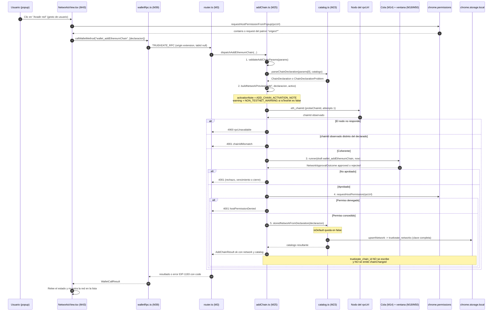

# 05 — Redes, sesiones y observabilidad

Propósito: documentar, a partir del código real, cómo TrueKeate Wallet custodia el **catálogo de redes**, el **cambio y el alta de red**, las **sesiones de dApp por origen**, el **polling de saldos** del popup y el **registro de actividad** con sus métricas de diagnóstico, indicando en cada afirmación la `ruta:línea` que la sostiene.

---

## Catálogo de redes (M23)

Subsistema que custodia `truekeate_networks` en el Service Worker (SW). Su fuente normativa está declarada en la cabecera del módulo (`src/background/networks/catalog.ts:1-30`) y su única red sembrada es Anvil local: «sin Sepolia» (`src/background/networks/catalog.ts:7`, `:11-12`).

### `truekeate_networks`: clave, forma y proyección

#### Campos reales de cada entrada

La clave persistida se declara en el mapa único de claves (`src/background/state/schema.ts:52`: `networks: 'truekeate_networks'`). El tipo persistido `StoredNetwork` declara **nueve** campos, uno de ellos opcional (`src/shared/types.ts:438-452`):

| Campo | Tipo | Notas verificadas |
| --- | --- | --- |
| `chainId` | `ChainIdHex` | Forma `0x` + hex (`src/shared/types.ts:439`) |
| `chainIdDecimal` | `number` | Coherente con el hexadecimal (`src/shared/types.ts:440`) |
| `name` | `string` | `chainName` de EIP-3085, máximo 64 caracteres (`src/background/networks/catalog.ts:498-500`) |
| `rpcUrl` | `string` | URL ya parseada y normalizada (`src/background/networks/catalog.ts:413`) |
| `symbol` | `string` | Por defecto `ETH` (`src/background/networks/catalog.ts:510`) |
| `decimals` | `number` | Por defecto 18 (`src/background/networks/catalog.ts:517`) |
| `isTestnet` | `boolean` | Marca de red de pruebas (RNF-23) |
| `isDefault` | `boolean` | Marca de red por defecto; el alta la escribe `false` (`src/background/networks/catalog.ts:551`) |
| `explorerUrl` | `string?` | **Opcional**: `blockExplorerUrls[0]`; solo se escribe si existe (`src/background/networks/catalog.ts:552`) |

No existen en el código otros campos (`isDefault`, `chainId`, `rpcUrl`, `symbol`, `decimals`, `isTestnet` y `explorerUrl` son los reales, además de `chainIdDecimal` y `name`). El mapa completo se tipa como `Record<string, StoredNetwork>` (`src/background/networks/catalog.ts:55`) y su alias de lectura es `NetworksCatalog` (`src/background/networks/catalog.ts:55`).

#### Proyección defensiva al leer

`readNetworksFromSnapshot` (`src/background/networks/catalog.ts:95-124`) descarta toda entrada que no sea objeto plano o cuyo `chainId` no sea canónico (`:102-108`) y rellena los huecos con valores seguros (`:109-121`): `chainIdDecimal` se deriva del hexadecimal, `name` cae al `chainId`, `rpcUrl` a cadena vacía, `symbol` a `DEFAULT_CHAIN_SYMBOL`, `decimals` a `DEFAULT_CHAIN_DECIMALS`, y `isTestnet`/`isDefault` solo son `true` si lo son estrictamente (`:119-120`). La lectura pública pasa por `readStorage` (`:127-129`), es decir, no se escribe ninguna clave `truekeate_*` a mano (regla de `:16-17`).

#### Orden y resolución de la red activa

`listNetworks` coloca la red por defecto primero y ordena el resto por `chainIdDecimal` (`src/background/networks/catalog.ts:151-154`). `resolveActiveNetwork` devuelve la red del `chainId` activo si está dada de alta y, si no, la red por defecto (`:160-163`), con caída final a `ANVIL_NETWORK` (`:147-148`). `rpcUrlFor` garantiza que nunca se devuelve una dirección vacía: sin red utilizable responde `DEFAULT_RPC_URL` (`:225-228`).

### Siembra de Anvil

#### Constantes normativas

La red por defecto se construye desde `src/shared/constants.ts:23-39`:

- `DEFAULT_CHAIN_ID = '0x7a69'` (`src/shared/constants.ts:23`).
- `DEFAULT_CHAIN_ID_DECIMAL = 31337` (`:26`).
- `DEFAULT_RPC_URL = 'http://127.0.0.1:8545'` (`:29`).
- `DEFAULT_CHAIN_NAME = 'Anvil Local'` (`:32`).
- `DEFAULT_CHAIN_SYMBOL = 'ETH'` y `DEFAULT_CHAIN_DECIMALS = 18` (`:35-36`).
- `DEFAULT_CHAIN_IS_TESTNET = true` (`:39`).

`ANVIL_NETWORK` congela esa entrada con `isDefault: true` (`src/background/networks/catalog.ts:61-70`) y `DEFAULT_NETWORK` es un alias explícito (`:73`).

#### `seedDefaultNetwork`: idempotencia y cerrojo

`seedDefaultNetwork` (`src/background/networks/catalog.ts:197-222`) inserta Anvil **solo si falta** (`:206-208`) y fija `truekeate_chain_id` a Anvil **solo si el `chainId` guardado no apunta a una red registrada** (`:209-213`). Escribe una única vez y solo si hay algo que escribir (`:214-216`), y devuelve la red activa resultante (`:217-221`). La lectura-modificación-escritura va dentro del cerrojo `runSerializedNetworkWrite` (`:176-186`, usado en `:201`), cuyo defecto medido —la siembra de arranque que pisaba un alta concurrente— está documentado en `:166-175` (`D-H5-P`).

### Validación de lo que llega de EIP-3085

#### `chainId`: hexadecimal canónico o decimal coherente

El patrón canónico es `/^0x[0-9a-fA-F]+$/` (`src/background/networks/catalog.ts:80`) y `normalizeChainId` lo pasa a minúsculas (`:87-92`). `parseChainId` (`:260-314`) acepta las dos formas que autoriza EIP-3085:

- hexadecimal canónica, que **manda** sobre el decimal (`:301-313`);
- decimal (`"31338"` o `31338`), convertido a hexadecimal (`:284-299`).

Si llegan las dos y no coinciden, la petición es incoherente y se rechaza con el motivo `mismatch` (`:306-308`); un decimal negativo o fuera del rango seguro de `number` se rechaza como `out-of-range` (`:291-293`, `:303-305`); un hexadecimal malformado **no** se degrada a decimal (`:280-283`). Los motivos posibles son `missing`, `malformed`, `out-of-range` y `mismatch` (`:244`).

#### `rpcUrl`: esquema y host

`parseRpcUrl` (`src/background/networks/catalog.ts:385-414`) aplica la validación **previa** obligatoria de §3.5:

- solo `http` y `https`; `ws:`, `file:` o `chrome-extension:` se rechazan como `unsupported-scheme` (`:397-399`);
- `http` en claro **solo** para los anfitriones locales exentos: `127.0.0.1`, `localhost`, `[::1]`, `::1` (`:348`, `:351`, `:404-411`);
- se rechazan siempre los hosts privados y de enlace local, con `http` y con `https` (`:358-378`): `10/8`, `172.16/12`, `192.168/16`, `169.254/16`, además de `fe80::/10` y `fc00::/7`.

Nota de implementación: el rechazo de `127.0.0.1` como «privado» está **desactivado a propósito** por la lista de exentos (`isLocalHost` se comprueba **antes** que `isPrivateHost`, `:404-408`), que es lo que permite que el RPC local del proyecto (`http://127.0.0.1:8545`) sea aceptable.

#### Símbolo, decimales y `isTestnet`

El símbolo es válido si es texto no vacío de 1 a 8 caracteres imprimibles (`src/background/networks/catalog.ts:317-318`) y se normaliza a mayúsculas (`:321-322`); si falta o llega vacío se usa `ETH` (`:508-511`) y si no es utilizable el alta se rechaza con `symbol-malformed` (`:512-514`). Los decimales son un entero entre 0 y 36 (`:328-329`) con 18 por defecto (`:325`, `:515-520`).

`isTestnetChain` (`:437-443`) da prioridad al catálogo persistido —una red ya dada de alta conserva su marca— y, si no está, consulta la tabla cerrada de redes principales conocidas (`:419-430`: Ethereum, OP Mainnet, BNB, Gnosis, Polygon, Fantom, zkSync Era, Base, Arbitrum One, Avalanche). Por defecto devuelve `true`: una red desconocida **no** dispara la advertencia de red real, porque el aviso exige certeza (`:432-436`).

### Marca de red por defecto

#### `isDefault` y el alta (`P-22`)

`storedNetworkFromDeclaration` proyecta la declaración validada a `StoredNetwork` con `isDefault: false` fijo y el comentario explícito de que «el alta NUNCA activa la red» (`src/background/networks/catalog.ts:542-553`, en particular `:550-551`). `upsertNetwork` (`:563-580`) escribe la clave **completa** `truekeate_networks` (nunca subclaves) dentro del mismo cerrojo (`:567-573`) y, si la escritura falla por cuota, **aborta** con `storageQuotaExceededError()` para no dejar el estado a medias (`:574-578`).

#### Qué hace que Anvil no desaparezca

La documentación debe ser precisa: en el código **no existe** ninguna función de borrado de redes ni una guarda explícita «no borrar `isDefault`». Lo que sostiene la permanencia de Anvil es la combinación de dos hechos verificados:

1. `seedDefaultNetwork` vuelve a sembrarla en cada arranque del SW si falta (`src/background/networks/catalog.ts:206-208`);
2. `defaultNetworkOf` cae a `ANVIL_NETWORK` cuando el catálogo no la contiene (`:147-148`).

Es decir: la marca de red por defecto es **reparable**, no inmutable. Cualquier afirmación de «red por defecto no borrable» como guarda dura queda **pendiente de confirmar**, porque no consta en el módulo.

### Trazabilidad de pruebas

`src/background/networks/networks.spec.ts` (373 líneas) es la especificación de M23/M24/M25 y fija literalmente los siete puntos de `src/background/networks/networks.spec.ts:6-19`, incluida la siembra (`ANVIL_NETWORK`, `seedDefaultNetwork`, `readNetworksFromSnapshot` en `:35`) y la segunda red de pruebas —Anvil secundario en `127.0.0.1:8546`, `isDefault: false`— en `:44-54`.

---

## Cambio de red (M24)

### Contrato de `wallet_switchEthereumChain`

La cabecera de `src/background/networks/switch.ts:10-25` enumera los **cuatro** casos del contrato, que el despacho implementa sin excepción. El resultado de éxito es siempre `null`, con la forma `{ ok: true; result: null; switched; chainId; delivered }` (`src/background/networks/switch.ts:152-154`).

#### Caso 1 — ya activa

Si el `chainId` pedido coincide con `truekeate_chain_id`, `resolveSwitchTarget` devuelve `already-active` (`src/background/networks/switch.ts:88-90`) y el despacho responde de inmediato `{ result: null, switched: false, delivered: 0 }` **sin** crear `PendingRequest`, **sin** abrir `notification.html` y **sin** emitir `chainChanged` (`:189-192`).

#### Caso 2 — registrada y distinta

`resolveSwitchTarget` devuelve `registered` con el catálogo y la red activa (`src/background/networks/switch.ts:94-102`). Se construye la vista previa con `kind: 'switch'` (`:208`), se resuelve la cuenta de la sesión (`:209-213`) y se entrega el borrador al ciclo aprobable (`:215-225`). **Al aprobar**: se persiste el `chainId` y se propaga el evento (`:234-246`).

#### Caso 3 — no registrada

El código de error real es **`4901`**, no `4902`. `resolveSwitchTarget` devuelve `not-registered` cuando el `chainId` no se puede interpretar (`src/background/networks/switch.ts:77-79`) o cuando no está en el catálogo (`:91-93`), y el despacho lanza `chainNotRegisteredError` (`:195-201`). El literal de la tabla es «La red solicitada no está dada de alta.» con `action` «Darla de alta con `wallet_addEthereumChain`» y `cause: 'chainNotRegistered'` (`src/background/rpc/errors.ts:107-112`). La búsqueda de `4902` en todo `src/` **no devuelve ninguna coincidencia**: el supuesto `4902` de otras carteras no se usa aquí. `4901` se usa además para el desajuste de `chainId` con el nodo (`src/background/rpc/errors.ts:306`, `:325`) y para «`chainId` no dado de alta **o distinto del activo**» (`:542`).

#### Caso 4 — rechazo o vencimiento

Si la aprobación no llega, el despacho devuelve el error que cerró el ciclo —`4001`— y la red activa **no** cambia (`src/background/networks/switch.ts:226-232`). Los literales de `4001` son «rechazo explícito del usuario» (`src/background/rpc/errors.ts:496`) y «vencimiento del plazo», con 120 s en firma y aprobación (`:501`), valor coherente con `SIGN_TIMEOUT_MS = 120_000` (`src/shared/constants.ts:92`).

### Decisión `P-19`/`DEC-29`

La decisión **sí aparece** y está en la cabecera del módulo: «REGLA DE SIEMPRE (`P-19`/`DEC-29`): el cambio exige aprobación **siempre que la red destino no sea la activa**, con independencia de quién lo pida (dApp o popup); el único caso SIN aprobación es el 1» (`src/background/networks/switch.ts:23-25`, repetida en `:9` y `:14-15`). El caso 1 se cita además con las siglas `CA-RF-22`/`P-19`/`DEC-29` (`:12-13`).

### Efecto del cambio: `activateChain`

#### Orden: persistir y después propagar

`activateChain` (`src/background/networks/switch.ts:117-131`) **primero** escribe `truekeate_chain_id` y **después** emite `chainChanged`; el orden es deliberado para que `eth_chainId` ya devuelva el id nuevo cuando la dApp reciba el evento (`:113-116`). Si la escritura falla, lanza `internalError({ reason: 'chain-id-write-failed' })` (`:125-127`).

#### Propagación `chainChanged`

`emitChainChanged` (`src/background/events.ts:185-188`) publica el `chainId` **sin envoltorio**, tal y como exige EIP-1193 (`:176-178`), y se emite a **todas** las pestañas (`:180-183`). El número de pestañas alcanzadas se devuelve como `delivered` y se propaga al resultado del cambio (`src/background/networks/switch.ts:129-130`, `:245`).

### Superficie pública y pruebas

`dispatchSwitchEthereumChain` es el punto que consumen el router (M3) y el despacho aprobable (M19.b), de modo que el cambio reutiliza la misma cola y la misma ventana única (`src/background/networks/switch.ts:264-269`). `readActiveChainId` es la lectura pura del `chainId` activo, con `null` si falta o está malformado (`:271-278`). La cobertura de los cuatro casos está en `src/background/networks/networks.spec.ts:7-13`.

---

## Alta de red (M25)

### Orden exacto del alta

La cabecera de `src/background/networks/addChain.ts:13-31` fija el orden de §3.5, y `addEthereumChain` (`:398-470`) lo ejecuta paso a paso:

1. validación **previa**, sin ventana y sin permiso (`:404-406`);
2. coherencia de red contra el nodo (`:408-421`);
3. aprobación explícita en la ventana única (`:423-448`);
4. permiso de host en runtime **siempre** (`:450-455`);
5. persistencia con `isDefault: false` (`:457-460`).

### Validación previa

#### Esquema y host del `rpcUrl`

`validateAddChainParams` (`src/background/networks/addChain.ts:205-226`) lee el catálogo y el `chainId` activo de **una sola instantánea** (`:208`) y delega en `parseChainDeclaration` (`:209`). Un problema en `rpcUrl` se traduce al literal de §4.3 y el motivo viaja en `data`, no en el mensaje (`:124-126`, `:211-213`); el resto de campos usan `invalidNetworkDefinitionError` con `field` y `problem` (`:128-130`, `:214`). La traducción de esquema/host se documenta en el subsistema anterior (`parseRpcUrl`, `src/background/networks/catalog.ts:385-414`).

#### Símbolo y `isTestnet`

El símbolo ausente o vacío cae a `DEFAULT_CHAIN_SYMBOL` y el no utilizable rechaza el alta (`src/background/networks/catalog.ts:506-514`). `isTestnet` se resuelve contra el catálogo y la tabla de redes reales (`:536`), y la vista previa publica `warning: null` cuando la red es de pruebas (`src/background/networks/addChain.ts:185`).

### Coherencia de red contra el nodo

`probeChainId` (`src/background/networks/addChain.ts:240-251`) emite **un solo** `eth_chainId` contra el `rpcUrl` declarado (`:242-246`), con `attempts: 1` y sin backoff, porque es una comprobación de coherencia dentro de la propia solicitud y no una lectura de la red activa (`:236-239`). Un nodo que no responde se clasifica con el literal de RPC no disponible —`4900` (`src/background/rpc/errors.ts:102-106`)— (`src/background/networks/addChain.ts:410-418`) y un `chainId` distinto se rechaza con `chainIdMismatchError` (`:419-421`), cuyo código también es `4901` (`src/background/rpc/errors.ts:306`, `:325`).

### Aprobación propia del alta

El alta **tiene su propia aprobación**, distinta de la del cambio: se crea el borrador con `method: 'wallet_addEthereumChain'` y la vista previa de la red (`src/background/networks/addChain.ts:429-441`). Si la aprobación falta, el propio módulo falla con `internalError({ reason: 'missing-approval-runner' })` —el `runner` solo se omite en pruebas del validador— (`:426-428`), y si el ciclo cierra sin aprobar se devuelve el error que lo cerró (`:442-448`). El borrador declara su forma como subconjunto estricto del `PendingRequestDraft` real para que un cambio en la cola rompa la compilación en vez de divergir (`:75-93`).

#### `ADD_CHAIN_ACTIVATION_NOTE`

El aviso de que el alta **no** activa la red es el literal `ADD_CHAIN_ACTIVATION_NOTE`: «La red se añadirá a la lista, pero seguirás en la red actual: para usarla tendrás que cambiarla con una solicitud aparte.» (`src/shared/constants.ts:55-57`). El SW lo inyecta en la vista previa como `activationNote` (`src/background/networks/addChain.ts:220`), y el contrato lo declara como campo exclusivo del alta (`src/shared/types.ts:475-476`). El módulo de alta lo importa explícitamente (`src/background/networks/addChain.ts:45-48`).

### Permiso de host en runtime

#### `chrome.permissions.request`

`hostPermissionPattern` forma el patrón de `optional_host_permissions` del origen del RPC: `origen/*` (`src/background/networks/addChain.ts:291-297`). `requestHostPermission` (`:322-345`) ejecuta la política real:

1. si la API de permisos no existe, devuelve `true` —no hay nada que conceder en el arnés de pruebas— (`:326-329`);
2. si el patrón no se puede formar, devuelve `false` (`:330-333`);
3. si la concesión **ya está vigente** (`contains`), se acepta **sin** llamar a `request` (`:335-340`);
4. si no lo está, se llama a `permissions.request({ origins: [pattern] })` y se exige `=== true` (`:341`);
5. cualquier excepción se trata como denegación (`:342-344`).

La superficie inyectable mínima de la API se declara sin `any` en `PermissionsLike` (`:263-268`) y se obtiene de `globalThis.chrome.permissions` (`:270-285`).

#### El gesto de usuario: `D-H5-A` y el clic del popup

El defecto medido y corregido está documentado en el propio módulo (`src/background/networks/addChain.ts:305-320`): `chrome.permissions.request` **exige un gesto de usuario en el contexto que llama**, y desde el Service Worker Chrome lo rechaza siempre con «This function must be called during a user gesture», de modo que el alta terminaba **siempre** en `4001` y RF-23 era inalcanzable. La corrección tiene dos partes: aceptar la concesión vigente vía `contains` y, si no lo está, intentar `request` con la denegación como `4001` sin persistir (`:310-314`).

El gesto lo aporta la superficie que **tiene** usuario: la vista de redes del popup. `requestHostPermissionFromPopup` (`src/popup/views/NetworksView.tsx:126-147`) repite la misma secuencia —`contains` y luego `request` (`:137-143`)— y su cabecera explica por qué vive ahí y no solo en el SW (`:113-125`, con la referencia a `D-H5-A` y `DEC-36`). Para un alta nacida en una dApp el gesto tendría que aportarlo la ventana de confirmación, lo que queda reportado como defecto `D-H5-B` con modo de fallo observable `4001` sin persistir (`src/background/networks/addChain.ts:316-320`). Existe además una segunda implementación del permiso en el despacho aprobable (`src/background/approvals/dispatch.ts:452-459`), que considera la aprobación en la ventana única como gesto válido (`:447-451`).

La denegación del permiso resuelve la llamada con `hostPermissionDeniedError` (`src/background/networks/addChain.ts:451-455`), cuyo literal es el `4001` de «permiso de host denegado al dar de alta una red» con la referencia `ACU-27`/`D-G` (`src/background/rpc/errors.ts:521-522`).

### El alta NO activa la red

#### Qué se propaga y qué no

El paso 5 persiste la red con `storedNetworkFromDeclaration` y llama a `upsertNetwork` (`src/background/networks/addChain.ts:457-460`). **No** se escribe `truekeate_chain_id`, **no** se emite `chainChanged` y **no** se encola ningún cambio de red (`:26-28`, `:395-396`). La única escritura que cambia de red es `persistActiveChainId` (`:515-518`), reservada a M24. `persistNetwork` es la fachada de `upsertNetwork` para M24/M25 (`:511-513`).

En el ciclo aprobable, el efecto del cambio sí persiste y propaga (`applyChainSwitch`, `src/background/approvals/dispatch.ts:436-440`), mientras que la proyección del alta mantiene `isDefault: false` (`:404-434`, en concreto `:430-432`).

### `NON_TESTNET_WARNING` y quién lo muestra

El literal es «Atención: no es una red de pruebas. Las operaciones se firman contra una red real y pueden comprometer fondos reales.» (`src/shared/constants.ts:47-49`). El dato que lo dispara lo resuelve M23 (`isTestnet`) y el SW lo publica en `NetworkPreview.warning` (`src/shared/constants.ts:42-46`; campo declarado en `src/shared/types.ts:469-470`), que se construye en `buildNetworkPreview` (`src/background/networks/addChain.ts:171-189`, en concreto `:185`).

Quién lo muestra, verificado:

- la ventana única de confirmación (`notification.html`, M50), destinataria declarada del campo (`src/shared/types.ts:454-457`);
- la vista de redes del popup (M43), que lo pinta en la fila de la red cuando `isTestnet` es `false` (`src/popup/views/NetworksView.tsx:392-393`) y como banda de aviso `role="alert"` en el formulario de alta cuando la marca se desmarca (`:497-499`);
- la marca viaja además como atributo observable `data-testnet` por red (`src/popup/views/NetworksView.tsx:374`).

El texto de RNF-23 también se repite en el «Acerca de» (`src/shared/i18n.ts:72-74`) y en el aviso del primer arranque, con el objetivo de que digan exactamente lo mismo en todas las superficies (`src/shared/i18n.ts:9-11`).

### Pruebas

`src/background/networks/networks.spec.ts` fija la lista completa con el `isDefault: false` y el `chainId` intacto (`:14-16`) y el permiso de host denegado como `4001` sin persistir (`:17`). El contexto de popup usado en esa suite —`isExtensionContext: true`, `route: 'popup.html'`— declara que el alta desde ahí pide el permiso igualmente (`:59-69`).

---

## Sesiones por origen (M26 y M26.b)

### `truekeate_connected_sites`

#### Campos reales de `DappSession`

La clave se declara en `src/background/state/schema.ts:54` (`connectedSites: 'truekeate_connected_sites'`). El tipo persistido declara **ocho** campos (`src/shared/types.ts:480-490`):

| Campo | Tipo | Nota verificada |
| --- | --- | --- |
| `origin` | `string` | Clave canónica normalizada (minúsculas, sin barra final) |
| `account` | `Address` | Cuenta **autorizada** al conectar (`:482`) |
| `chainId` | `ChainIdHex` | Red en el momento de la conexión (`:483`) |
| `tabIds` | `number[]` | Dato interno de propagación; **no** se publica a la UI (`src/background/sessions.ts:231`) |
| `connectedAt` | `number` | Alta de la conexión; se conserva al reconectar (`src/background/sessions.ts:300`) |
| `lastUsedAt` | `number` | Último uso; base del TTL (`:302`) |
| `expiresAt` | `number \| null` | `lastUsedAt + ttlMs`; `null` = sin caducidad (`:487-488`) |
| `connected` | `boolean` | `false` descalifica la sesión (`:489`) |

No existe ningún campo `accounts` en plural dentro de la sesión: la sesión recuerda **una** cuenta autorizada. La lista de cuentas del flujo de conexión vive en la solicitud (`ConnectRequest.accounts`), no en la sesión persistida (`src/background/connections.ts:184-186`).

La proyección defensiva es `asSession` (`src/background/sessions.ts:70-87`): descarta lo que no tenga `account` de texto y normaliza cada campo, con `connected: value.connected !== false` (`:85`). La lectura pasa por `readStorage` (`:106-109`) y toda mutación por el cerrojo `sessionsLock` (`:57`, `:60`), cuyo defecto medido —dos mutaciones solapadas que perdían una renovación o una revocación— está documentado en `:44-56`.

#### Vigencia y TTL de 24 h

`SESSION_TTL_MS = 86_400_000` (`src/shared/constants.ts:104`), descrito como «Caducidad de la sesión de dApp desde `lastUsedAt`: 24 h renovables (RF-25, D-B)». `expiresAtFrom` calcula `lastUsedAt + ttlMs` (`src/background/sessions.ts:126-127`). `isSessionValid` exige que exista, que no esté marcada como desconectada y que no haya vencido, de modo que `expiresAt === null` significa «sin caducidad» y la entrada vale (`:115-123`).

### Renovación por uso y purga perezosa

`touchSession` (`src/background/sessions.ts:144-188`) es la pieza que renueva en cada uso:

- sin entrada, devuelve `{ session: null, persisted: false }` sin tocar el almacén (`:160-162`);
- con entrada **vencida**, la **elimina** del mapa y devuelve `null` con `persisted: true`, sin emitir error: es un cambio de estado silencioso (`:163-169`, y la regla en `:17-19`);
- con entrada vigente, actualiza `lastUsedAt = now`, recalcula `expiresAt`, marca `connected: true` y añade el `tabId` si era nuevo (`:171-186`).

La consulta pura `currentSessionFor` **no** renueva (`:191-204`), y `authorizedAccountFor` devuelve la dirección autorizada sin escribir (`:208-212`).

### Creación de la sesión

`connectSession` (`src/background/sessions.ts:279-308`) es «la ÚNICA vía por la que un origen consigue sesión: `eth_accounts` nunca la crea» (`:277`). Escribe `account`, `chainId`, `connectedAt`, `lastUsedAt` y `expiresAt = lastUsedAt + ttlMs` (`:272-275`), conserva el `connectedAt` previo si la sesión ya era vigente (`:300`) y marca `isNewConnection` cuando el origen no tenía sesión vigente (`:293`).

`listConnectedSites` (`:233-251`) es la lectura que alimenta la UI: origen normalizado, cuenta, red, alta, último uso, caducidad y `current` = sesión vigente (`:240-248`); ordena por origen ascendente (`:250`), **no purga** nada (`:226-228`) y **no publica** `tabIds` ni ningún secreto (`:231`). La forma publicada es `ConnectedSiteView` (`src/shared/types.ts:500-510`).

### Revocación por origen

#### Vista `SitesView`

`src/popup/views/SitesView.tsx` (312 líneas) implementa la pestaña «Sitios»: lista de orígenes conectados con su cuenta compartida, su último uso y su vigencia, y revocación por origen (RF-26 / CU-19, tarea 3.11; `src/popup/views/SitesView.tsx:3-4`). La UI **no** lee el almacén: pide la lista al SW con `wallet_getState.connectedSites` (`:6-11`) y relee el estado al montarse y después de cada revocación (`:112-129`). La revocación se pide con `wallet_revokePermissions` (`:12-16`, `:75-78`), método del catálogo de página que admite el camino «desde el popup», donde la confirmación es la propia UI y **no** se crea entrada en la cola (`:12-14`).

La vigencia se lee como **texto**, nunca solo por color (`:18-21`, `:84-93`), el origen completo viaja en el `title` de la fila (`:206`) y el botón declara su nombre accesible (`:226`). La confirmación se pide con `DialogoDecision` (`:284-307`), que explica que la dApp recibirá `accountsChanged` con lista vacía y que su `eth_accounts` devolverá `[]` (`:297-305`).

#### Efecto observable

`handleRevoke` (`src/popup/views/SitesView.tsx:142-165`) quita la fila de inmediato, relee el estado real y publica el mensaje «Permiso revocado para …: la dApp recibe `accountsChanged` con `[]` y su `eth_accounts` pasa a `[]`» (`:157-164`). En el SW, `revokeSession` (`src/background/sessions.ts:327-351`) **elimina** el origen del mapa, devuelve las pestañas asociadas para que el llamador emita `accountsChanged []` (`:314-317`, `:345-349`), es idempotente —revocar dos veces no falla (`:325`, `:339-341`)— y **no** crea ninguna entrada en la cola de aprobaciones (`:324-325`). `forgetPendingConnectsForOrigin` descarta además las solicitudes vivas del origen, de modo que una elección tardía en `connect.html` ya no puede conceder sesión (`src/background/connections.ts:435-453`, con la razón en `:436-438`).

### Flujo de `eth_requestAccounts`

#### Ventana `connect.html` (M48/M49)

`src/connect/App.tsx` (515 líneas) es la ventana de conexión de **420 × 650** (`src/connect/App.tsx:2-3`), medidas que el SW fija como `CONNECT_WINDOW_WIDTH = 420` y `CONNECT_WINDOW_HEIGHT = 650` (`src/background/connections.ts:113-115`). Muestra el origen que solicita la conexión, todas las cuentas con su saldo real y su selector, con la cuenta activa preseleccionada (`src/connect/App.tsx:6-7`), y se navega por teclado: flechas, `Enter` para conectar y `Esc` para rechazar (`:8-9`, `:324-354`).

La ventana recibe del SW el `requestId` en la URL y con él pide la solicitud **completa** con `wallet_getConnectRequest` (`src/connect/App.tsx:18-27`, `:153-158`); nunca lee el almacén de la extensión (RNF-14). Si falta el `requestId` o el SW ya no tiene la solicitud, la ventana **declara el hueco** con `CONNECT_REQUEST_GAP` y deja «Conectar» deshabilitado en vez de inventar la lista (`:28-30`, `:75-80`, `:476-480`). Las filas de cuenta las pinta `src/connect/ConnectRow.tsx` (81 líneas; M49), que declara el radio accesible, el área táctil ≥ 44 px, la dirección truncada y el saldo real (`src/connect/ConnectRow.tsx:1-16`).

Del lado del SW, `openConnectWindow` (`src/background/connections.ts:460-547`) persiste `truekeate_connect_request[requestId]` **antes** de abrir la ventana (`:455-459`, `:511-514`), con `expiresAt = now + CONNECT_TIMEOUT_MS` (`:488`; `CONNECT_TIMEOUT_MS = 60_000` en `src/shared/constants.ts:95`), y abre la ventana con la URL `connect.html?requestId=…&origin=…` (`:530-538`). La verdad vive en el almacén, no en memoria, porque el SW puede suspenderse con la ventana abierta (`:12-13`).

#### `CONNECT_RESPONSE`

La ventana responde con `CONNECT_RESPONSE` (`src/shared/protocol.ts:42`, `:133-134`) declarando `requestId`, `success`, `account` y `accountIndex` (`src/connect/App.tsx:270-295`); al cancelar envía el mismo mensaje con `success: false` y el error `4001` `USER_REJECTED_ERROR` («Operación cancelada por el usuario.») (`:10-12`, `:66-69`, `:297-322`). El `accountIndex` es la posición de la cuenta elegida en la lista **ofrecida** por el SW, y el SW conserva su respaldo por `indexOf(account)` (`:276-279`; `src/background/connections.ts:647-651`).

`applyConnectResponse` (`src/background/connections.ts:558-680`) resuelve todo bajo el mismo cerrojo y con `settlePendingConnect` **fuera** de él (`:569-573`, `:678`):

- solicitud desconocida o ya purgada → `4001` sin crear sesión (`:600-604`, `:674-677`);
- solicitud ya resuelta o vencida → `4001` con el motivo `connect-expired` o `connect-already-resolved` (`:613-623`);
- `success !== true` → `4001` `connect-cancelled` (`:625-631`);
- cuenta **fuera** de la lista ofrecida → `4100` (`connect-unknown-account`), sin sesión (`:633-645`);
- cuenta válida → `connectSession(...)` y `{ success: true, account, accountIndex }` (`:652-670`).

`settlePendingConnect` es **el único punto** que cierra el ciclo: resuelve la promesa y descarta el registro, porque borrar la entrada sin resolver dejaría colgada la promesa de `eth_requestAccounts` (`src/background/connections.ts:17-19`, `:405-423`). La red de seguridad de proceso resuelve con `4001` `connect-timeout` (`:373-378`).

#### Máximo 1 `pending` por origen y purga

`hasPendingConnectFor` exige que la solicitud esté `pending`, sea del mismo origen y no haya vencido (`src/background/connections.ts:212-224`), y `openConnectWindow` comprueba **y escribe** dentro del mismo tramo crítico, de modo que una segunda alta simultánea responde `4001` sin abrir una segunda ventana (`:492-519`). La purga es perezosa y con **doble motivo**: vencimiento y resolución (`planConnectRequestPurge`, `:252-273`), y su defecto medido —un mapa que nunca se limpiaba y bloqueaba el origen hasta su `expiresAt`— está documentado en `:245-251`.

### Propagación del cambio de cuenta activa

`applyActiveAccountToSessions` (`src/background/sessions.ts:423-452`) actualiza `truekeate_connected_sites[origen].account` en cada sesión **vigente** cuyo titular no sea ya la cuenta nueva (`:435-444`), devuelve los orígenes afectados y la unión de `tabIds` (`:446-450`) y **no** toca `lastUsedAt` ni `expiresAt`, porque cambiar de cuenta no es un uso de la dApp (`:416-417`). Regla dura: nunca se usa «todas las pestañas» con una cuenta dentro, porque publicaría la dirección a orígenes sin sesión (RNF-11) (`:418-421`).

### Pruebas

- `src/background/sessions.spec.ts` (353 líneas) cubre `CA-RF-17`/`CA-RF-25`, el `expiresAt = lastUsedAt + 86 400 000` renovable y la revocación sin crear nada en la cola (`src/background/sessions.spec.ts:1-11`), con reloj inyectado (`:9-10`).
- `src/background/connections.spec.ts` (305 líneas) cubre los dos defectos medidos de `truekeate_connect_request`: RMW sin cerrojo y ausencia de purga (`src/background/connections.spec.ts:2-19`).

---

## Polling de saldos (M47)

### Intervalo, tope y método

- `BALANCE_POLL_MS = 5_000` (`src/shared/constants.ts:110`, «Intervalo de polling de saldos del popup y de `connect.html` (RF-27)»), reexportado como `BALANCE_POLL_INTERVAL_MS` (`src/popup/hooks/useBalancePolling.ts:36`).
- `BALANCE_POLL_MAX_ACCOUNTS = 10` (`src/shared/constants.ts:113`, «Máximo de cuentas polleadas por ciclo (RNF-03, H-21)»), reexportado como `BALANCE_POLL_MAX_VISIBLE` (`src/popup/hooks/useBalancePolling.ts:39`).
- El método real es **`eth_getBalance`**: `BALANCE_METHOD = 'eth_getBalance'` (`src/popup/hooks/useBalancePolling.ts:42`) y la llamada se emite con `[address, 'latest']` (`:144`).
- El presupuesto por intento es `BALANCE_RPC_TIMEOUT_MS = 5_000` (`:49`), el mismo plazo por intento de la política de M5 (`src/shared/constants.ts:131`).

`pollTargets` recorta la lista visible al tope (`src/popup/hooks/useBalancePolling.ts:66-67`), y esa función es la forma verificable de la regla: `pollTargets(x).length` es el número exacto de `eth_getBalance` que emite cada ciclo (`:60-65`).

### Arranque, parada y suspensión

#### Parada

El ciclo arranca con el hook y se detiene cuando `enabled` es `false` —la vista que muestra los saldos está cerrada—, caso en el que el estado vuelve a `idle` y **no** se reprograma nada (`src/popup/hooks/useBalancePolling.ts:196-201`). El desmontaje deja `cancelled = true` y limpia el temporizador pendiente (`:265-271`). La dependencia de `currentAccount` hace que un cambio de cuenta activa **reinicie** el ciclo, tal y como exige `CA-RF-27` (`:84-88`, `:272`). En el popup, `enabled` es `phase === 'ready' && tab === 'accounts'` (`src/popup/App.tsx:187-191`), y en `connect.html` es `phase === 'ready'` (`src/connect/App.tsx:261-266`).

#### Suspensión sin perder datos

Si una lectura falla, el ciclo guarda el error, pasa a `suspended` y **no** se reprograma, conservando los saldos ya leídos (`src/popup/hooks/useBalancePolling.ts:242-247`, `:96-98`). El estado `suspended` se etiqueta «Desconectado: sin respuesta del nodo local» (`:74`) y el agotamiento del plazo de 5 s se clasifica como `rpcUnavailable` (`4900`, §4.3) (`:132-142`). `refresh` reanuda el ciclo a mano tras la suspensión (`:274-276`).

### Contadores observables

`cycleCount` cuenta los ciclos completados con éxito, `requestCount` los `eth_getBalance` emitidos y `skippedCycles` los ciclos descartados por solapamiento, que debe ser **siempre 0** (`src/popup/hooks/useBalancePolling.ts:101-106`). El incremento del contador de RPC se hace **antes** de cada lectura, dentro del bucle en serie (`:224-237`, en concreto `:230`), y el guardia `cycling` es defensa en profundidad contra dos ciclos solapados (`:212-217`). El siguiente ciclo se programa **cuando el anterior ha terminado** (`:258-260`).

En el popup los contadores se publican como atributos de datos del panel —`data-polling-requests` y `data-polling-cycles`— para poder comprobarlos sin instrumentar el canal (`src/popup/App.tsx:319-337`).

### Verificación

`src/background/polling.spec.ts` (227 líneas) mide el contador sobre una instancia **real** del hook (React 19 + jsdom) interceptando `chrome.runtime.sendMessage`, con *fake timers* (`src/background/polling.spec.ts:1-12`). Importa la superficie verificable del propio hook: `BALANCE_METHOD`, `BALANCE_POLL_INTERVAL_MS`, `BALANCE_POLL_MAX_VISIBLE`, `balanceStatusLabel` y `pollTargets` (`:20-29`).

---

## Registro de actividad (M30 / M31 / M32)

Tres módulos con responsabilidades separadas: el **catálogo cerrado** de eventos (M31, `src/background/logging/events.ts`), la **retención FIFO** pura (M32, `src/background/logging/retention.ts`) y la **escritura** con política de cuota (M30, `src/background/logging/logger.ts`).

### `truekeate_logs`: la clave y la entrada

La clave se declara en `src/background/state/schema.ts:66` (`logs: 'truekeate_logs'`) y sobrevive al reset de la cartera (RF-32): las claves que se preservan están declaradas en `src/background/state/schema.ts:514`, y el comentario de `:609-610` lo repite. La única vía por la que el popup la lee es `wallet_getLogs`; el popup **solo lee** (`src/popup/views/LogsView.tsx:14-19`).

#### Forma de `LogEntry`

`LogEntry` declara nueve campos, dos de ellos opcionales (`src/shared/types.ts:381-395`): `id` (uuid), `ts`, `level`, `category`, `event`, `message`, `origin` (`extension` para los contextos de la extensión), `method` (cadena vacía si no aplica), `data` (**payload redactado**, nunca íntegro) y los opcionales `txHash` y `txStatus`. `buildEntry` construye exactamente esa forma y solo añade `txHash`/`txStatus` si llegan (`src/background/logging/logger.ts:357-387`). El módulo garantiza **1 entrada por evento** del catálogo, y la variante por lotes escribe N entradas con **una** lectura y **una** escritura (`:16-18`).

### Catálogo cerrado de eventos

#### Las 5 categorías y los 4 niveles

Las categorías son `call`, `event`, `tx`, `sign` y `system`, en ese orden canónico (`src/background/logging/events.ts:36`), y los niveles `info`, `success`, `warn` y `error`, en orden de severidad creciente (`:39`). El módulo comprueba en compilación que ambas listas son exactamente las uniones de `src/shared/types.ts` —`LogCategory` en `src/shared/types.ts:348` y `LogLevel` en `:351`— (`src/background/logging/events.ts:41-48`). `event` y `category` son campos **independientes**: `system`, `call`, `tx`, `sign` y `event` **no** son valores válidos de `event`, y `isLogEventName` lo impone (`:24-25`, `:277-278`).

#### Los 24 eventos, por categoría y nivel

Extraídos de `LOG_EVENT_SPECS` (`src/background/logging/events.ts:91-242`), que declara el conteo exacto en `LOG_EVENT_COUNT = 24` (`:261`), 5 categorías (`:264`) y 4 niveles (`:267`):

**Categoría `call` (2)**

| Evento | Nivel | Línea |
| --- | --- | --- |
| `rpc_call` | `info` | `src/background/logging/events.ts:92-96` |
| `rpc_error` | `warn` | `:97-116` |

**Categoría `event` (8)**

| Evento | Nivel | Línea |
| --- | --- | --- |
| `event_emit` | `info` | `src/background/logging/events.ts:117-121` |
| `approval_created` | `info` | `:152-156` |
| `approval_resolved` | `info` | `:157-168` |
| `approval_expired` | `warn` | `:169-173` |
| `chain_changed` | `success` | `:174-178` |
| `accounts_changed` | `info` | `:179-183` |
| `network_added` | `success` | `:210-214` |
| `permission_revoked` | `info` | `:215-219` |

**Categoría `tx` (4)**: `tx_sent` `info` (`:122-126`), `tx_confirmed` `success` (`:127-131`), `tx_failed` `error` (`:132-136`) y `tx_reverted` `error` (`:137-141`).

**Categoría `sign` (3)**: `sign_personal` `success` (`:142-146`), `sign_typed_data` `success` (`:147-151`) y `account_imported` `success` (`:194-199`).

**Categoría `system` (7)**: `wallet_created` `success` (`:184-188`), `wallet_imported` `success` (`:189-193`), `account_removed` `warn` (`:200-204`), `reset_wallet` `warn` (`:205-209`), `sw_started` `info` (`:220-224`), `sw_reconcile` `info` (`:225-236`) y `storage_quota_exceeded` `error` (`:237-241`).

El cómputo cerrado y verificado es: 2 + 8 + 4 + 3 + 7 = **24** eventos distintos, con la categoría **primaria** de cada uno.

#### Eventos con variantes

Tres eventos admiten variantes, que son la vía por la que el mismo nombre ocurre en otro contexto sin inventar eventos nuevos:

- `rpc_error` admite `system`/`warn` («traza de plataforma: marca en vuelo liberada, difusión interrumpida o reconciliación», `src/background/logging/events.ts:104-108`) y `quota`/`error` («la escritura de un log se descartó por cuota de almacenamiento», `:109-113`); la clave `''` es la **situación de código inválido** y clasifica `system`/`error` (`:81-85`, `:114-115`);
- `approval_resolved` admite `warn` cuando la resolución **no** es una aprobación: rechazo, vencimiento o cierre de la ventana única (`:161-167`);
- `sw_reconcile` admite `warn` cuando la reconciliación encuentra huérfanas, marcas vencidas o difusiones sin recibo (`:229-235`).

`resolveLogPlacement` garantiza que ninguna entrada escrita pueda llevar una `category` o un `level` inventados: el resultado es siempre una pareja declarada (`:319-340`), y `placementForEntry` aplica las reglas por defecto —nivel del catálogo si no se aporta, variante por nivel si existe, primaria en cualquier otro caso— (`:349-382`).

#### Eventos del catálogo sin emisión verificada

Barrido de emisiones reales en producción (búsqueda de `event: '<nombre>'` y de los puntos de escritura):

- emiten de forma verificable: `sw_started` (`src/background.ts:243`), `event_emit` (`src/background/state/migrations.ts:82`), `tx_sent` (`src/background/approvals/dispatch.ts:540`), `rpc_call` y `rpc_error` (`src/background/rpc/router.ts:491`, `:499`), `rpc_error`/`tx_confirmed`/`tx_failed`/`approval_expired`/`sw_reconcile` (`src/background/approvals/reconcile.ts:233`, `:256`, `:267`, `:291`, `:339`, `:399`, `:454`) y `storage_quota_exceeded` (`src/background/logging/logger.ts:625`);
- están declarados en el catálogo pero **no** consta ningún punto de emisión en el código de producción: `network_added` y `permission_revoked` (solo aparecen en `src/background/logging/events.ts:210-219` y en su suite `src/background/logging/events.spec.ts:58-59`). Su emisión queda **pendiente de confirmar**;
- el puente `logEventForProviderEvent` (`src/background/logging/events.ts:402-403`) mapea `chainChanged → chain_changed` y `accountsChanged → accounts_changed` (`:389-395`) y está cubierto por pruebas (`src/background/logging/events.spec.ts:174-177`), pero **no** tiene consumidor en producción: `src/background/events.ts` no importa nada de `logging` (su única importación es de tipos, `src/background/events.ts:25`). Es decir, el evento `event_emit` de propagación del provider no se instrumenta hoy desde M27: **pendiente de confirmar**.

### Retención FIFO

`RETENTION_LIMITS` congela los dos límites normativos (`src/background/logging/retention.ts:48-51`): `logLimit = 500` global y `logMaxPerOrigin = 200` por origen (`src/shared/constants.ts:153-155`). `effectiveLimits` cae a los valores normativos si el ajuste llega corrupto, para que un ajuste inválido **nunca** deje la retención sin límite (`src/background/logging/retention.ts:57-64`).

`planRetention` (`:85-127`) aplica el orden del corpus: ordena por `ts` ascendente con orden estable (`:90-93`), descarta las más antiguas por el límite **global** (`:95-97`) y después aplica el límite **por origen** sobre lo que sobrevivió (`:99-118`). Es una función **pura**: no muta la lista ni escribe nada (`:83`, `:16-17`). Una entrada sin `ts` numérico se considera la más antigua (`:66-68`) y una entrada sin `origin` cuenta como `extension` (`:70-72`). `mergeWithRetention` une lo almacenado con lo entrante y devuelve el plan (`:144-148`).

### Redacción antes de escribir

La redacción es obligatoria y la aplica M22 (`src/background/security/redaction.ts`), consumida **solo** por el SW (`:17`). Reglas verificadas en la cabecera del módulo (`:6-15`): nunca se persiste el mnemonic, una clave privada ni una firma completa; el calldata se trunca a sus **primeros 10 bytes** más `dataLength`, sin ninguna variante de 4 bytes; `personal_sign` guarda la dirección y el **hash** del mensaje, nunca el texto; `eth_signTypedData_v4` guarda `primaryType`, `domain.name`, `domain.chainId`, `domain.verifyingContract` y el hash del mensaje; por encima de `PREVIEW_INLINE_MAX_BYTES = 4096` solo se persisten hash y longitud.

Piezas reales: `DATA_PREVIEW_BYTES = 10` (`:36`) y `DATA_PREVIEW_CHARS = 2 + 10 * 2` (`:39`); la lista cerrada de claves sensibles por **contención** (`:54-66`, con el defecto medido en `:48-52`: `privKey` o `accountPrivateKey` se persistían íntegras cuando la comparación era de igualdad exacta); los tokens de firma (`:77`) con `isSignatureKey` (`:80-86`); `isSensitiveKey` (`:89-92`); `hashValue` como `sha256:<hex>` (`:105-106`); `previewData` (`:109-116`) y `previewSignature` recortada a `0x1234…abcd` (`:119-120`); y la puerta única `redactLogData` (`:329`), con `redactParams` para los `params` (`:247`).

#### Calldata y payloads

M30 aplica además un saneado de **última instancia** aunque el llamador ya haya redactado (defensa en profundidad, RNF-09) (`src/background/logging/logger.ts:329-341`). `CALLDATA_KEY_PATTERN` reconoce `data`, `input`, `calldata`, `txdata`, `inputdata`, `rawdata`, `hexdata`, `bytedata`, `calldatahex` y `transactiondata` (`:272-273`), y el patrón se aplica a **cualquier** entrada y a cualquier profundidad hasta 6 niveles (`:303-327`), con un defecto medido y corregido documentado en `:266-270`. El truncado es idempotente y respeta un `dataLength` ya declarado (`:281-297`). Un `data` textual por encima de 4096 caracteres se sustituye por `{ payloadHash, payloadBytes, truncated: true }` (`:341-354`, en concreto `:346-352`).

### Comportamiento ante cuota agotada

La política está documentada en la cabecera (`src/background/logging/logger.ts:25-31`) e implementada en dos funciones:

1. `writeOnce` escribe el lote una sola vez y clasifica el fallo como `ok`, `quota`, `error` o `unavailable`, usando `isStorageQuotaError` para distinguir la cuota (`:416-434`).
2. `writeWithQuotaPolicy` (`:436-473`) aplica el modo observable: si el `set` se rechaza por **cuota**, se incrementa `diagnostics.retries`, se reintenta **una** vez con la lista ya retenida —nunca un bucle de escritura— (`:460-467`); si el segundo intento vuelve a fallar por cuota, se incrementa `diagnostics.dropped` y se avisa por consola con «storage quota exceeded» (`:468-471`).

Si el descarte es real, `writeLogEntries` no devuelve las entradas nuevas y encadena `persistQuotaDiagnostic` (`:580-597`), que construye la entrada `storage_quota_exceeded` con `category: 'system'` y `level: 'error'` (`:624-628`), mensaje «No se pudo guardar el registro por falta de espacio» (`:629`) y un `data` que transporta el `rpc_error` con su `code` numérico (`-32603`), la clave afectada, `bytesInUse`, `retried`, el evento y el contador de descartes (`:632-644`). Lo que se reescribe es el **histórico ya persistido** más la entrada de diagnóstico: las entradas descartadas **no** se cuelan en el almacén por esa puerta (`:586-591`, `:604-608`).

#### Contador `dropped` y persistencia diagnóstica

`diagnostics` es la contabilidad en memoria (`{ dropped, retries, attempts }`, `src/background/logging/logger.ts:125-135`); `attempts` cuenta **solo** los intentos de la traza —1, o 2 con reintento— y las escrituras del contador no entran en la cuenta (`:444-446`). El contador se persiste en `truekeate_logs_dropped` (`src/background/state/schema.ts:90`) solo cuando **cambia**, con `-1` como marca de «aún no persistido» (`src/background/logging/logger.ts:137-146`, `:202-225`); el defecto medido que motivó esa condición —toda traza costaba dos operaciones de almacén y llevaba la reconstrucción del SW a ~2 s— está en `:139-145`. `hydrateLogDiagnostics` lo reconstruye al arrancar, de modo que el descarte sigue siendo visible tras una suspensión (`:152-182`). `readLogDiagnostics` devuelve una copia para que nadie la mute desde fuera (`:184-185`).

`readLogsView` es la lectura que publica el panel: entradas retenidas, `truncated` (recorte o descarte por cuota) y `dropped` (`:722-753`, en concreto `:747-752`). La regla de oro es explícita: **nunca un fallo silencioso** (riesgo R13) (`:31`).

### La interfaz «Actividad»

`src/popup/views/LogsView.tsx` (437 líneas; M45) es la pestaña «Actividad»: panel de logs con los 24 eventos del catálogo, los errores en **rojo** con su `code` numérico, las operaciones con su hash o firma y la **exportación JSON** del histórico (`src/popup/views/LogsView.tsx:1-5`). Su contrato es `wallet_getLogs` con `{ entries, truncated, dropped }` (`:39-46`), y su única escritura es la descarga del fichero, que se genera en memoria con un `Blob` y **no** sale del equipo (`:19-20`).

Las etiquetas en español de nivel y categoría están transcritas en la vista (`:49-54` y `:57-63`), porque la UI **no** importa módulos del SW (`:36-37`). El nivel y la categoría se leen como texto, nunca solo por color (RNF-19/RNF-21) (`:22-25`); cada entrada expone `data-level`, `data-category`, `data-event` y `data-origin` (`:402-405`), y el código del error se publica como texto con `data-code` (`:417-421`). El hash de transacción o la firma se buscan primero en el campo de primer nivel `txHash` y después en el `data` ya redactado, entre `txHash`, `hash` y `signature` (`:95-116`).

#### Filtro

Dos selectores, «Nivel» y «Categoría», con los valores «sin filtrar» `todos` y `todas` (`src/popup/views/LogsView.tsx:71-73`, `:324-361`). El resultado se calcula con un `useMemo` que exige coincidencia en ambos ejes (`:226-235`) y alimenta tanto la lista como la exportación (`:236-238`). El panel resume el registro con el número de errores visibles en una insignia (`:285-287`) y con el contador de cuota como aviso no descartable de R13 (`:309-322`): «Entradas retenidas: N · descartadas por falta de espacio: N», más el aviso de que el registro está recortado y conviene exportar (`:317-321`).

#### Exportación JSON

`buildLogsExport` es una función pura que compone el fichero con `exportedAt`, las entradas **filtradas** en pantalla, `totalEntries`, `dropped`, `truncated` y los filtros aplicados, para que el fichero sea interpretable sin la pantalla (`src/popup/views/LogsView.tsx:126-157`). El nombre es `truekeate-logs-<fecha>.json` (`:159-161`). `handleExport` (`:247-273`) serializa con `JSON.stringify(payload, null, 2)`, crea el `Blob` de tipo `application/json`, revoca la URL de objeto anterior, pulsa un ancla `download` con `rel="noopener"` y publica el enlace para volver a descargarlo (`:252-272`). La URL de objeto se revoca también al desmontar, de modo que nunca queda un `Blob` vivo (`:213-222`).

---

## Métricas y diagnóstico

### `wallet_getState`

El método interno está en la lista cerrada `INTERNAL_METHODS` (`src/background/rpc/internalMethods.ts:38`) y su resultado se declara en `InternalWalletResultMap` (`src/background/rpc/catalog.ts:546-559`). El manejador `handleGetState` (`:1003-1025`) reúne, sin duplicar lógica: cartera y cuentas con `visible`/`current` (M28), integridad y presencia de la frase (M13, RNF-22), redes dadas de alta y `chainId` activo (M33) y `connectedSites` (M26, v1.7) (`:994-1002`). Los campos reales publicados son: `hasWallet`, `integrity` (`status`, `label`, `problems`, `mnemonicPresent`, `mnemonicValid`, `canDerive`), `accounts`, `currentAccountRef`, `networks`, `currentChainId`, `settings` y `connectedSites` (`:1008-1024`).

Del lado de la UI, el popup lo consume con `readSnapshot` (`src/popup/walletState.ts:144-173`), que aplana la respuesta al tipo `WalletSnapshot` (`:66-85`) con `damaged` y `damagedReason` derivados de la integridad (`:152`, `:166-170`). La interfaz del popup **no** toca el almacén: el SW es el único custodio (RNF-14) (`:137-139`). El canal único es `callInternal` (`src/popup/walletRpc.ts:144-147`), sobre el sobre `TRUEKEATE_RPC` (`:66-76`).

### `wallet_getLogs`

Declarado en `src/background/rpc/internalMethods.ts:35` y en el mapa de resultados (`src/background/rpc/catalog.ts:541`). `handleGetLogs` (`:928-935`) delega en `readLogsView` para **no** reimplementar ni la retención ni el contador (`:915-927`) y publica exactamente tres campos: `entries`, `truncated` y `dropped` (`:930-934`). En el panel, `dropped` es el «contador de descartes por cuota», el aviso visible de R13 (`src/popup/views/LogsView.tsx:42-45`).

### `wallet_getNetworks`

Declarado en `src/background/rpc/internalMethods.ts:34` y en el mapa (`src/background/rpc/catalog.ts:540`). `handleGetNetworks` (`:906-913`) devuelve `{ networks, activeChainId }` leídos de una sola instantánea del almacén y con la misma normalización defensiva que el catálogo (`:908-912`).

### Dónde se muestran

#### Popup (M39)

`src/popup/App.tsx` (432 líneas) es el contenedor del popup 380×600 (`:2-3`). Publica los contadores del polling como atributos de datos en el panel de la pestaña activa (`:319-337`), y las tres pestañas relevantes para este manual son «Sitios» (M44), «Redes» (M43) y «Actividad» (M45) (`:76-84`, `:363-376`). El encabezado muestra la insignia de red «Anvil Local» (`:226`) y el botón «Acerca de» está siempre presente, también en el estado vacío (`:227-234`). Los estados de carga, error, aviso no descartable del primer arranque (`:407-430`) y «Wallet dañada» (`:266-277`) son parte del diagnóstico visible.

#### «Acerca de» (M39/M50)

`src/popup/components/AboutDialog.tsx` (112 líneas) es la pantalla compartida por el popup y la ventana única de confirmación (`:1-4`). Muestra el logotipo, la tagline exacta (`:81-82`), el aviso de entorno de RNF-23 como texto normal —no como `role="alert"`, para no anunciarlo como incidencia— (`:86-88`), las licencias de los activos empaquetados (`:90-97`) y la versión (`:99`). Los literales vienen todos de `src/shared/i18n.ts` (`:24-32`): `ACERCA_DE_TITULO` (`src/shared/i18n.ts:58`), `ACERCA_DE_AVISO` (`:72-74`), `LICENCIAS_NOTAS` (`:98-104`) y `ACERCA_DE_VERSION` (`:107`).

### Qué publica el arranque: `bytesInUse` y `bootMs`

La entrada `sw_started` (una sola por arranque) transporta en su `data` las métricas de diagnóstico (`src/background.ts:218-229`):

| Dato | Origen verificado |
| --- | --- |
| `bytesInUse` | `getBytesInUse(null)` sobre `chrome.storage.local`; `null` si falla (`src/background.ts:231-239`, `:246`) |
| `bootMs` | `Date.now() - bootStartedAt` (`:657`, `:660`) |
| `schemaVersion` | `SCHEMA_VERSION` del esquema (`:661`) |
| `migrations` | Instantánea de M34 (`:249`) |
| `integrity` | Solo `ok` y `status`, para no publicar material de la cartera (`:250`) |
| `autoLoaded` | Resumen del arranque: cuentas, `chainId`, redes, importadas, etiquetas y sesiones (`:184-195`, `:251`) |
| `pendingProcessed` | Entradas procesadas por la reconciliación (`:253`) |

`BootSnapshot` declara la forma completa en memoria (`:198-206`) y `getBootSnapshot` la expone (`:211-212`). El campo `schemaVersion` vive en `truekeate_settings`, no como clave propia (`src/background/settings.ts:51`, `:221`).

### Campos no verificados

El encargo menciona un campo `integrations`. La búsqueda de `integrations`/`integration` en todo `src/` **no devuelve ninguna coincidencia**: ese campo **no existe** en este repositorio y no debe documentarse como si existiera. Del mismo modo, `bootMs`, `schemaVersion` y `dropped` sí se confirman (`src/background.ts:660-661`; `src/background/rpc/catalog.ts:541`) y `bytesInUse` aparece con ese nombre exacto tanto en el arranque (`src/background.ts:232-246`) como en la entrada de cuota (`src/background/logging/logger.ts:638`). Cualquier otro contador de diagnóstico queda **pendiente de confirmar**.

---

## i18n y textos

### Alcance real: fuente única del literal

`src/shared/i18n.ts` (211 líneas) declara en su cabecera que centraliza los textos de UI en **español** (`CA-RT-10` / RF-34), compartidos por las cuatro superficies del producto: popup, `connect.html`, `notification.html` y la dApp de pruebas (`src/shared/i18n.ts:2-4`). El alcance es **deliberadamente estrecho** y hay que subrayarlo: **NO es un motor de internacionalización** con catálogos por idioma, porque el producto se entrega en español y un segundo idioma no forma parte del alcance de H6; es la **fuente única del literal**, no un sistema de traducción (`:15-17`). Un componente puede conservar sus cadenas locales cuando solo las usa él —`Aprobar`, `Rechazar`— y lo que se garantiza aquí es que **no haya dos literales distintos para el mismo texto** ni ninguna superficie sin cubrir (`:18-20`). El módulo es **hoja**: no importa `ethers`, no habla con el SW y no toca el almacén (RNF-14) (`:25-26`).

### Contenido del módulo

- Identidad de marca: `NOMBRE_MARCA` (`:38`), `NOMBRE_PRODUCTO` (`:41`), `TAGLINE_MARCA` con barras ASCII (`:43-48`), `VERSION_PRODUCTO` (`:51`).
- «Acerca de» (tarea 6.3): título, botón, resumen y el aviso de entorno que repite el del primer arranque (`:57-74`); licencias empaquetadas OFL-1.1 de Poppins, Inter y JetBrains Mono (`:76-81`) y las notas de auditoría, que declaran que no hay dependencia remota en tiempo de ejecución (`:97-104`).
- Aviso «antes de la primera firma» (RNF-23): título, cuerpo, advertencia de entorno, etiqueta y `id` de la casilla de acuse (`:113-131`).
- El oráculo observable del aviso: `EVENTOS_DE_FIRMA` (`:133-137`), `METODOS_QUE_FIRMAN` (`:139-148`) y `yaFirmoAntes` (`:172-201`), que se apoya en dos señales del registro —eventos de firma directa y `approval_resolved` con `status: 'approved'` y un método que firma— porque en este repositorio la firma de `personal_sign` se resuelve por el ciclo de aprobaciones y puede no dejar su evento `sign_*` (`:172-186`). El registro sobrevive al reset (RF-32), así que el aviso no se repite tras reiniciar (`:185-186`).
- Formato de datos: `IMPORTE_EJEMPLO` con 4 decimales y coma española (`:207-208`) y `DIRECCION_EJEMPLO` (`:210-211`).

### Verificación de `CA-RT-10`

La regla de «cero texto visible en inglés» la comprueba `src/popup/i18n.spec.ts` con el AST de TypeScript, y los avisos del módulo quedan dentro de su ámbito porque los consumen los tres directorios de UI (`src/shared/i18n.ts:21-23`). Esa comprobación es también la razón por la que el popup usa identificadores de pestaña con separador (`send-tab`, `networks-tab`, `activity-tab`) en vez de la palabra inglesa suelta (`src/popup/App.tsx:57-66`).

### Divergencia real de identificador de módulo

La cabecera del fichero se autodenomina **M66** (`src/shared/i18n.ts:2`), pero el corpus de este repositorio asigna **M66** a otro módulo: `src/background/approvals/calldata.ts` también se autodenomina M66 en su primera línea (`src/background/approvals/calldata.ts:2`, 484 líneas, tabla local y cerrada de selectores). Es una **colisión de identificador** entre los dos ficheros, verificable en ambos encabezados; resolverla exige decidir cuál conserva la etiqueta, decisión que **no** corresponde a este manual y que queda marcada como incidencia de documentación.

---

## Diagrama de flujo: alta de una red nueva

### Flujo (Mermaid)

### Lectura del diagrama

El orden de la secuencia es el de `src/background/networks/addChain.ts:13-31` y `:398-470`: (1) validación previa, (2) coherencia contra el nodo, (3) aprobación, (4) permiso de host, (5) persistencia. El gesto de usuario que exige `chrome.permissions.request` lo aporta el clic del popup **antes** de invocar el método (`src/popup/views/NetworksView.tsx:113-125`, `:126-147`, y la llamada en `:310-332`), y el SW vuelve a verificar la concesión antes de persistir (`src/background/networks/addChain.ts:322-345`). Las dos llamadas al nodo son de un solo intento: no hay backoff en la sonda de coherencia (`:236-239`).

### Puntos de fallo observables

| Punto | Código | Efecto sobre el almacén |
| --- | --- | --- |
| `rpcUrl` con esquema o host no admitidos | literal de `invalidRpcUrl` con el motivo en `data` | No se persiste nada (`src/background/networks/addChain.ts:211-213`) |
| Red desconocida al cambiar (no al dar de alta) | `4901` | No se persiste y no hay ventana (`src/background/networks/switch.ts:195-201`) |
| Nodo sin respuesta en la sonda | `4900` | No se persiste (`src/background/networks/addChain.ts:410-418`) |
| `chainId` del nodo distinto del declarado | `4901` | No se persiste (`:419-421`) |
| Aprobación rechazada o vencida (120 s) | `4001` | No se persiste (`:442-448`) |
| Permiso de host denegado | `4001` | No se persiste (`:451-455`) |
| Cuota de almacén agotada al escribir el catálogo | `-32603` | La operación se aborta sin dejar el estado a medias (`src/background/networks/catalog.ts:574-578`) |

En todos los casos de fallo, `addEthereumChain` **no** lanza: devuelve `{ ok: false, error }` con el error EIP-1193 del catálogo (`src/background/networks/addChain.ts:461-469`), y `truekeate_chain_id` permanece intacto.

---

### Nota final de verificación

Todos los `ruta:línea` de este documento se comprobaron leyendo el fichero citado. Los recuentos de líneas reales de los módulos de referencia son: `src/background/networks/catalog.ts` 580, `src/background/networks/switch.ts` 278, `src/background/networks/addChain.ts` 518, `src/background/sessions.ts` 452, `src/background/connections.ts` 735, `src/popup/views/SitesView.tsx` 312, `src/popup/hooks/useBalancePolling.ts` 279, `src/background/logging/events.ts` 403, `src/background/logging/logger.ts` 759, `src/background/logging/retention.ts` 148, `src/background/security/redaction.ts` 329, `src/popup/views/LogsView.tsx` 437, `src/shared/i18n.ts` 211, `src/popup/App.tsx` 432 y `src/popup/components/AboutDialog.tsx` 112. Las cifras del encargo que no coinciden con el repositorio —529, 260 y 480 líneas de M23/M24/M25, 423 de M26, 685 de M26.b, 295 de `SitesView.tsx`, 253 de M47, 368 de M31, 399 de M45 y 400 de `src/popup/App.tsx`— se sustituyen aquí por las medidas reales.
