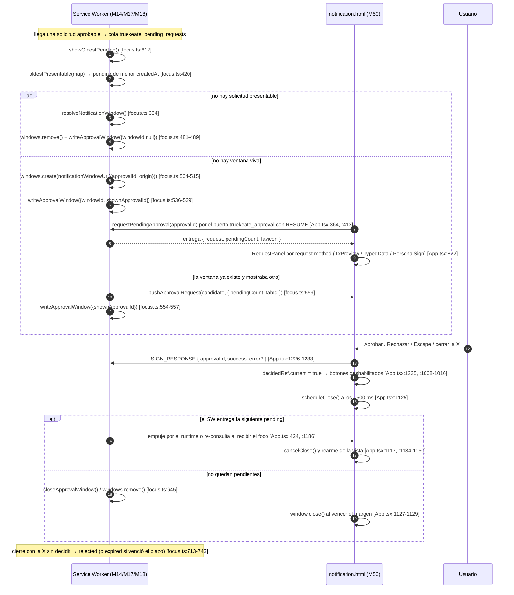

# 06 — Interfaz: popup, conexión y notificación

Propósito: documentar las **tres superficies de UI** de TrueKeate Wallet —el popup (`index.html`), la ventana de conexión (`connect.html`) y la ventana única de decisión (`notification.html`)—, qué pinta cada una y cómo hablan con el Service Worker (en adelante, **SW**) exclusivamente por el canal `chrome.runtime`, con referencias `ruta:línea` verificadas sobre el código real.

> **Nota de conteo de líneas.** Las cifras del encargo no coinciden con el árbol actual en varios ficheros; este manual cita las **reales** medidas con la herramienta de lectura: `walletRpc.ts` 151 (no 138), `walletState.ts` 330 (no 306), `popup/App.tsx` 432 (no 400), `popupErrors.ts` 276 (no 265), `runtimeChannel.ts` 48 (no 45), `AccountsView.tsx` 408 (382), `AccountPicker.tsx` 103 (98), `AccountCard.tsx` 95 (89), `SendView.tsx` 516 (474), `validation.ts` 105 (92), `DialogoDecision.tsx` 86 (81), `ReceiveView.tsx` 89 (79), `QrCode.tsx` 66 (62), `NetworksView.tsx` 526 (490), `SitesView.tsx` 312 (295), `LogsView.tsx` 437 (399), `SecurityView.tsx` 576 (540), `connect/App.tsx` 515 (482), `ConnectRow.tsx` 81 (77), `notification/App.tsx` 1338 (1258), `firstSignature.ts` 74 (69), `FirstSignatureNotice.tsx` 76 (72), `Notification.tsx` 47 (41), `TxPreviewPanel.tsx` 194 (180), `RiskWarnings.tsx` 116 (108), `TypedDataPanel.tsx` 218 (202), `PersonalSignPanel.tsx` 87 (80), `Field.tsx` 108 (104), `StatusMessage.tsx` 41 (38), `AboutDialog.tsx` 112 (100). Coinciden `i18n.ts` 211 y `qr.ts` 641 (el encargo decía 583).

## Regla de oro: la UI no toca el almacén (RNF-14)

### El canal único de mensajería

#### `src/popup/runtimeChannel.ts` — una sola referencia al API real

El popup no habla con el SW por ningún camino propio: `getRuntimeChannel()` es el **único** punto del popup que nombra el API real de MV3, `chrome.runtime.sendMessage` (`src/popup/runtimeChannel.ts:32-45`). Devuelve `null` si `chrome` no existe, si `chrome.runtime` no es objeto o si `sendMessage` no es función (`src/popup/runtimeChannel.ts:33-43`), y devuelve el canal tipado `unknown → Promise<unknown>` (`src/popup/runtimeChannel.ts:44`, tipo declarado en `src/popup/runtimeChannel.ts:23`).

La cabecera del módulo deja constancia del defecto histórico que esta encapsulación cierra: `chrome.runtime.postMessage` **no existe** en MV3 y la comprobación anterior construía el identificador con `Reflect.get(chrome.runtime, 'pos' + 'tMessage')` (`src/popup/runtimeChannel.ts:5-9`). El módulo también expone `hasRuntimeChannel()` (`src/popup/runtimeChannel.ts:48`).

#### `src/popup/walletRpc.ts` — el sobre `TRUEKEATE_RPC`

Toda petición es un sobre con la forma del contrato (§5.1.1): `type: 'TRUEKEATE_RPC'`, `method`, `params`, `origin: 'extension'`, `tabId: null`, `frameId: null`. Está documentada en `src/popup/walletRpc.ts:7-10`, tipada en `WalletRpcMessage` (`src/popup/walletRpc.ts:32-39`) y construida por `buildWalletMessage` (`src/popup/walletRpc.ts:66-76`), que fija `origin: EXTENSION_ORIGIN` (`src/popup/walletRpc.ts:73`; la constante vale `'extension'` en `src/shared/constants.ts:226`).

El resultado de una invocación **nunca lanza**: es un discriminado `{ ok: true; result } | { ok: false; error: PopupError }` (`src/popup/walletRpc.ts:53`). `callWalletMethod` (`src/popup/walletRpc.ts:117-138`) obtiene el canal, y si no lo hay devuelve el error de transporte con el literal «No hay canal con el Service Worker.» (`src/popup/walletRpc.ts:123`); si la respuesta trae un `error` EIP-1193 bien formado lo convierte con `popupError` (`src/popup/walletRpc.ts:127-130`, `errorFromResponse` en `:88-97`); si el transporte falla (SW suspendido o ausente) clasifica el fallo como «error interno» con motivo `transport` (`src/popup/walletRpc.ts:132-136`, `transportError` en `:150-151`).

### Invocación de un método interno `wallet_*`

#### `callInternal` frente a `callWalletMethod`

`callWalletMethod` acepta cualquier método de la unión cerrada `WalletMethod` (lecturas de página, aprobables e internos), mientras que `callInternal` es el atajo tipado restringido a los métodos internos `wallet_*` (`src/popup/walletRpc.ts:144-147`); su comentario de cabecera dice «los 15 internos» (`src/popup/walletRpc.ts:16`), cifra **desactualizada**: `src/shared/types.ts:65` declara **16** métodos internos, el último `wallet_getConnectRequest` (`src/shared/types.ts:97`, añadido en la v1.7 del contrato). Un método fuera de la unión responde `4200` (`src/popup/walletRpc.ts:17`).

#### `src/popup/walletState.ts` — estado y operaciones, siempre por método interno

`walletState.ts` es la capa de operaciones del popup: no lee ni escribe el almacén, no importa `ethers` y no custodia estado (`src/popup/walletState.ts:6-9`). Sus funciones, todas construidas sobre `callInternal`:

- `readSnapshot()` → `wallet_getState`, y normaliza la respuesta a `WalletSnapshot` (`src/popup/walletState.ts:144-173`); la forma literal de la respuesta está tipada en `WalletStateResponse` (`:88-106`), el estado de integridad en `WalletIntegrity` (`:42-51`) y la fila de UI en `AccountRow` (`:29-39`).
- `createWallet()` → `wallet_generateMnemonic` + `wallet_importMnemonic` en un solo paso (`:182-188`).
- `importMnemonic()` (`:191-196`), `deriveNextAccount()` → `wallet_addDerivedAccount` (`:199-215`), `importPrivateKey()` (`:218-227`), `setCurrentAccount()` (`:230-238`), `renameAccount()` (`:241-250`), `setAccountVisibility()` (`:253-262`), `removeImportedAccount()` → `wallet_deleteImportedAccount` (`:268-275`).
- `probeResetGuards()` (`:294-301`) y `resetWallet()` (`:312-315`), ambos sobre `wallet_resetWallet`: el primero con `{ confirm: false }` y el código `4001` como señal de «guardas en verde» (`RESET_PROBE_CANCELLED_CODE`, `:278`), el segundo con `{ confirm: true }`.
- `acceptDevNotice()` → `wallet_acceptDevNotice` (`:318-330`).

Los secretos **no** pasan por aquí: los pide directamente la vista de seguridad con `wallet_revealSecret` (`src/popup/walletState.ts:10`).

### Comprobación real: ausencia de `chrome.storage` y de `ethers`

#### Resultado del grep (ejecutado sobre el árbol actual)

- `chrome.storage` en `src/popup/**` (búsqueda recursiva sobre todos los ficheros): **0 coincidencias**. La regla se cumple literalmente: ningún fichero del popup nombra el almacén de la extensión.
- `ethers` en `src/popup/**`: **0 importaciones**. Las únicas apariciones de la palabra son **comentarios** que declaran la prohibición, en `src/popup/App.tsx:23`, `src/popup/main.tsx:3`, `src/popup/walletRpc.ts:20`, `src/popup/walletState.ts:7`, `src/popup/components/AccountPicker.tsx:11`, `src/popup/hooks/useBalancePolling.ts:21` y `src/popup/views/SendView.tsx:18`. No existe ningún `from 'ethers'` en `src/popup`.
- En las otras dos superficies tampoco hay acceso al almacén: `chrome.storage` solo aparece en comentarios de `src/notification/App.tsx:1090` y `src/notification/firstSignature.ts:8`; `ethers` solo en comentarios de `src/connect/App.tsx:31` y `src/notification/App.tsx:21`.

## Popup (`src/popup/App.tsx`, M39)

### Contenedor y pestañas reales

#### Literales del array de pestañas

El tipo de pestaña es una unión cerrada de siete identificadores (`src/popup/App.tsx:67`):

`type TabId = 'accounts' | 'receive' | 'send-tab' | 'sites' | 'security' | 'networks-tab' | 'activity-tab';`

El array `TABS` (`src/popup/App.tsx:76-84`) declara los literales **reales** que ve el usuario, en este orden:

| `id` | `label` (texto visible) | Línea |
| --- | --- | --- |
| `accounts` | `Cuentas` | `src/popup/App.tsx:77` |
| `receive` | `Recibir` | `src/popup/App.tsx:78` |
| `send-tab` | `Enviar` | `src/popup/App.tsx:79` |
| `sites` | `Sitios` | `src/popup/App.tsx:80` |
| `security` | `Seguridad` | `src/popup/App.tsx:81` |
| `networks-tab` | `Redes` | `src/popup/App.tsx:82` |
| `activity-tab` | `Actividad` | `src/popup/App.tsx:83` |

Los identificadores con separador (`send-tab`, `networks-tab`, `activity-tab`) existen a propósito: `CA-RT-10` revisa los literales de cadena y una palabra inglesa suelta se marcaría como texto visible, mientras que un identificador kebab-case queda exento por su forma (`src/popup/App.tsx:57-65`). La pestaña de logs es «Actividad» (M45), no «Logs»: el literal real es `Actividad` (`src/popup/App.tsx:83`).

#### Enrutado entre vistas

No hay router: el contenedor guarda la pestaña activa en `useState<TabId>('accounts')` (`src/popup/App.tsx:93`) y renderiza condicionalmente **una** vista dentro de un `role="tabpanel"` (`src/popup/App.tsx:330-337`), con los siete casos encadenados: `accounts` → `AccountsView` (`:338-349`), `receive` → `ReceiveView` (`:350`), `send-tab` → `SendView` (`:356-362`), `sites` → `SitesView` (`:363`), `networks-tab` → `NetworksView` (`:368-374`), `activity-tab` → `LogsView` (`:376`), `security` → `SecurityView` (`:377-384`). La fila de pestañas es un `role="tablist"` (`:299`) con `role="tab"`, `aria-selected` y `aria-controls` por botón (`:301-314`), y al cambiar de pestaña la activa se desplaza a la vista con `scrollIntoView` (`revealActiveTab`, `:202-215`).

#### Estados de pantalla

`BootPhase` es `'loading' | 'notice' | 'error' | 'ready'` (`src/popup/App.tsx:87`) y se decide en `refresh()` según si el aviso de desarrollo está aceptado (`:118`). Las cuatro pantallas: carga con `aria-busy` y «Cargando la cartera…» (`:249-256`), error con `StatusMessage` (`:258-262`), aviso modal no descartable (`:264`) y estado listo (`:266-389`). Dentro de «listo» hay dos estados propios: **wallet dañada** con el literal `Wallet dañada` (`:269`) y `damagedReason` (`:271-273`), y **sin cartera** con el literal `Sin cartera` (`:281-285`), en cuyo caso se monta `AccountsView` para crear o importar (`:287-294`).

### Carga del estado con `wallet_getState`

#### Auto-carga y restauración

Al montar, un efecto pide el estado con `readSnapshot()` (que llama a `wallet_getState`, `src/popup/walletState.ts:145`) y, con la respuesta, fija `snapshot` y decide la fase (`src/popup/App.tsx:121-147`); el guardia `active` evita escribir estado si el popup se cierra antes (`:122`, `:126-128`). El refresco reutilizable es `refresh()` (`:110-119`) y `handleChanged` lo entrega a las vistas que mutan estado (`:217-219`). La cuenta activa se resuelve contra el snapshot con reserva a la primera cuenta (`:163-169`).

#### Polling de saldos (M47)

`useBalancePolling` se habilita **solo** con la pestaña de Cuentas abierta y la fase lista (`src/popup/App.tsx:187-191`), recibe las cuentas visibles (`:172-180`) y publica sus contadores como atributos de datos del panel (`data-polling-requests` y `data-polling-cycles`, `:335-336`). El ciclo es de 5 s (`BALANCE_POLL_MS = 5_000`, `src/shared/constants.ts:110`), con tope de 10 cuentas (`src/shared/constants.ts:113`), **1 `eth_getBalance` por cuenta visible y ciclo** (`src/popup/hooks/useBalancePolling.ts:1-17`), suspensión sin perder datos si el nodo no responde (`:9-11`) y etiqueta en español del estado `'Desconectado: sin respuesta del nodo local'` (`src/popup/hooks/useBalancePolling.ts:74`).

### El popup NO se suscribe a eventos

#### Hallazgo verificado

No hay ninguna llamada a `addListener`, `chrome.runtime.onMessage` ni `chrome.runtime.connect` en `src/popup/**` (búsqueda recursiva: **0 coincidencias**). El popup **no** escucha eventos del protocolo: se actualiza por **refresco explícito**, invocando `onChanged`/`refresh()` después de cada operación (p. ej. `src/popup/App.tsx:217-219`, `src/popup/views/SitesView.tsx:164`, `src/popup/views/LogsView.tsx:296`). Las únicas superficies que sí escuchan el canal son la ventana de decisión (`subscribeToApprovalPush`, `src/notification/App.tsx:424-444`) y las vistas que releen al montarse.

### Manejo global de errores (`src/popup/popupErrors.ts`)

#### Mapeo código → mensaje real

El catálogo transcribe literalmente la tabla cerrada «Código | Causa | Mensaje | Acción sugerida» de `diccionario_datos.md` §4.3 (`src/popup/popupErrors.ts:5-14`), en el objeto `POPUP_ERRORS` (`:32-189`). Cada fila se publica como `PopupError { code, message, action, detail? }` (`:20-29`). El mapeo verificado:

| Causa | `code` | Mensaje real | Acción real | Línea |
| --- | --- | --- | --- | --- |
| `userRejected` | `4001` | `El usuario ha anulado la operación.` | `Volver a solicitarla desde la dApp` | `:33-37` |
| `invalidMnemonic` | `-32602` | `La frase de recuperación no es válida: revisa las 12 palabras y su checksum.` | `Revisar la frase` | `:38-42` |
| `invalidPrivateKey` | `-32602` | `La clave privada no es válida: debe ser 0x + 64 caracteres hexadecimales de la curva secp256k1.` | `Revisar la clave` | `:43-48` |
| `invalidAddress` | `-32602` | `La dirección no es válida: revisa el formato 0x + 40 caracteres hexadecimales.` | `Revisar la dirección` | `:49-53` |
| `duplicateAccount` | `-32602` | `Esa cuenta ya está en la cartera.` | `Usar otra cuenta` | `:54-58` |
| `payloadTooLarge` | `-32602` | `La carga útil de la solicitud supera el límite de 64 KiB.` | `Reducir el tamaño del mensaje o del calldata` | `:59-63` |
| `accountInUseByDapp` | `-32000` | `La cuenta está en uso por la dApp <origen>: …` | `Revocar la sesión de esa dApp en «Sitios conectados» y reintentar` | `:64-69` |
| `resetBlocked` | `-32000` | `No se puede resetear la cartera: quedan <n> solicitudes pendientes o una transacción en vuelo. …` | `Resolver la cola (aprobar o rechazar cada solicitud) o esperar al vencimiento del plazo y reintentar` | `:70-76` |
| `unsupportedMethod` | `4200` | `El método solicitado no está soportado por TrueKeate Wallet.` | `Usar personal_sign o eth_signTypedData_v4` | `:77-81` |
| `methodNotAllowedInContext` | `4200` | `El método solicitado no está permitido en este contexto.` | `Invocarlo desde el popup` | `:82-86` |
| `internalError` | `-32603` | `Error interno de la cartera.` | `Exportar los logs en JSON y reportarlo` | `:87-91` |
| `rpcUnavailable` | `4900` | `Sin conexión con la red local (Anvil).` | `Arrancar Anvil en 127.0.0.1:8545` | `:92-96` |
| `invalidAmount` | `-32602` | `El importe no es válido: usa un número decimal positivo con hasta 18 decimales.` | `Revisar el importe` | `:97-101` |
| `invalidLabel` | `-32602` | `La etiqueta no es válida: debe tener entre 1 y 32 caracteres.` | `Acortar o corregir la etiqueta` | `:102-106` |
| `storageQuotaExceeded` | `-32603` | `No hay espacio de almacenamiento en la extensión: la operación no se ha guardado.` | `Exportar y borrar los logs (RF-32)` | `:112-116` |
| `damagedWallet` | `-32603` | `La cartera guardada está dañada y no se puede usar: no se derivan cuentas nuevas desde ella.` | `Restaurar la cartera desde la frase de recuperación o resetearla` | `:118-123` |
| `walletNotCreated` | `-32000` | `Todavía no hay ninguna cartera: no se puede derivar ninguna cuenta.` | `Crear una cartera nueva o importar una frase de recuperación` | `:124-128` |
| `unknownAccount` | `-32602` | `La cuenta indicada no existe en la cartera.` | `Elegir una cuenta de la lista` | `:129-133` |
| `clipboardFailure` | `-32603` | `No se pudo usar el portapapeles: el valor no se ha copiado o no se ha podido borrar.` | `Comprobar el permiso del portapapeles y reintentar; borrar el valor a mano si estaba copiado` | `:134-140` |
| `migrationWriteFailed` | `-32603` | `No se pudo guardar la migración del esquema: los datos se han quedado sin actualizar.` | `Exportar los logs en JSON y reintentar; si persiste, resetear la cartera` | `:141-146` |
| `hostPermissionDenied` | `4001` | `No se concedió el permiso de acceso a <rpcUrl>; la red no se ha añadido.` | `Repetir el alta y aceptar el permiso` | `:153-157` |
| `chainNotRegistered` | `4901` | `La red solicitada no está dada de alta.` | `Darla de alta con wallet_addEthereumChain` | `:159-163` |
| `invalidRpcUrl` | `-32602` | `La dirección del nodo no es válida: usa https o, solo para el RPC local, http en 127.0.0.1/localhost.` | `Revisar el rpcUrl de la red y volver a darla de alta` | `:165-170` |
| `invalidNetworkDefinition` | `-32602` | `Los datos de la red no son válidos: revisa el chainId, el nombre y el símbolo de la moneda nativa.` | `Revisar los datos declarados por la dApp` | `:172-177` |
| `inflightTxInProgress` | `-32000` | `Ya hay una transacción de esta cuenta en vuelo; espera a que se difunda antes de firmar otra.` | `Esperar a que la transacción en vuelo se difunda y reintentar` | `:178-183` |
| `broadcastRejected` | `-32000` | `La red rechazó la transacción: <motivo>.` | `Revisar el motivo indicado y volver a intentarlo` | `:184-188` |

#### Construcción y adaptación

`popupErrorOf(cause, values, detail)` construye el error y rellena los marcadores `<x>` con `fill` (`src/popup/popupErrors.ts:195-225`). `popupError(error)` adapta un error EIP-1193 recibido del SW: busca la acción **primero por la plantilla del mensaje** (varias causas comparten `-32602` y `-32603`) y solo después por `code`; si el `code` no está en el catálogo degrada a «Error interno de la cartera» conservando el código original en `detail` (`:246-259`, `messagePrefix` en `:232-235`). Helpers: `resetBlockedError(n)` (`:271-272`) y `accountInUseError(origen)` (`:275-276`). `isEip1193Error` valida la forma sin `any` (`:262-268`).

#### Pintado único

`StatusMessage` es el **único** componente del popup que pinta errores, para que la regla «todo error lleva `code`» no se relaje (`src/popup/components/StatusMessage.tsx:5-7`): con `error` pinta `role="alert"` con `code`, `message` y `action` (`:24-32`); sin error pinta un `role="status"` con el tono indicado (`:33-40`). El popup lo usa en los estados de fase (`src/popup/App.tsx:247`, `:260`, `:274`) y cada vista lo usa con su estado local.

## Vistas del popup

### Cuentas — `src/popup/views/AccountsView.tsx` (M40)

#### Responsabilidad y estados

Cubre alta, derivación, importación (frase o clave privada), renombrar, ocultar y eliminar (`src/popup/views/AccountsView.tsx:1-19`). El formulario abierto es un `OpenForm = 'none' | 'import-mnemonic' | 'import-key'` (`:43`) y el estado local incluye `mnemonicDraft`, `keyDraft`, `labelDraft`, `showHidden`, `renamingRef`, `renameDraft`, `removing`, `error`, `status` y `busy` (`:70-80`). Las props son `accounts`, `currentAccount`, `onChanged`, `onWalletGone`, `balances` y `balanceStatus` (`:46-59`).

#### Operaciones reales

El envoltorio `run(operation, success)` concentra el manejo de errores y el refresco (`:90-103`). Sobre él: `handleCreate` → `createWallet` (`:105-110`), `handleImportMnemonic` → `importMnemonic` con normalización previa (`:112-125`), `handleImportKey` → `importPrivateKey` (`:127-141`), `handleDerive` → `deriveNextAccount` (`:143-145`), `handleSelect` → `setCurrentAccount` (`:147-149`), `handleRename` → `renameAccount` (`:151-164`), `handleVisibility` → `setAccountVisibility` (`:166-171`) y `handleRemove` → `removeImportedAccount`, que avisa al contenedor si se eliminó la cuenta activa (`:173-186`). La validación de presentación es inline y previa al envío, y el error se pasa al `Field` (`:82-84`, `:234`, `:317`, `:367`).

#### Componentes hijos

`AccountCard.tsx` (95 líneas) pinta una cuenta: etiqueta, tipo (`'importada'`/`'derivada'`, `src/popup/components/AccountCard.tsx:53`), saldo formateado si lo hay (`:67`), dirección truncada con `formatAddress` (`:25`, `:77`) y tres acciones con etiqueta real `Renombrar`, `Ocultar`/`Mostrar` y `Eliminar` (`:81-91`); `onRemove` es `null` en las derivadas, que solo se ocultan. `AccountPicker.tsx` (103 líneas) es el selector de cuenta: un `<select>` **nativo** dentro de la estructura de campo (`src/popup/components/AccountPicker.tsx:62-98`), con texto de opción `etiqueta · tipo · dirección recortada` (`:41-42`) y error inline con `role="alert"` (`:92-98`). El borrado de una importada se confirma con `DialogoDecision` (título `Eliminar cuenta importada`, botones `Eliminar`/`Volver`, `src/popup/views/AccountsView.tsx:382-405`).

### Envío — `src/popup/views/SendView.tsx` (M42)

#### Formulario y modos de destino

La vista transfiere a una dirección externa o entre cuentas propias (`src/popup/views/SendView.tsx:1-24`). `DestinationMode = 'external' | 'own'` (`:76`) con etiquetas reales `Dirección externa` y `Cuenta propia de la cartera` (`:79-82`). El formulario se compone de `AccountPicker` para el origen (`:364-374`), un `role="radiogroup"` para el modo (`:376-401`), `AccountPicker` de destino en modo propio o `Field` de dirección en modo externo (`:403-433`), el `Field` de importe (`:435-448`) y los botones `Calcular comisión` y `Enviar` (`:481-502`).

#### Validación inline

`src/popup/validation.ts` (105 líneas) valida **solo forma y longitud**, sin criptografía: `validateMnemonic` (12 palabras, minúsculas, 3–8 letras; `:47-61`), `validateAddress` (`0x` + 40 hex; `:64-70`), `validatePrivateKey` (`0x` + 64 hex; `:73-79`), `validateAmount` (decimal positivo de hasta 18 decimales; `:87-96`) y `validateLabel` (1–32; `:99-104`), más `normalizeMnemonicInput` (`:43-44`). Las constantes `MNEMONIC_WORD_COUNT = 12` (`:34`) y `LABEL_MAX_LENGTH = 32` (`:37`). En el envío, el importe se convierte con aritmética exacta de `bigint` (`amountToWei`, `src/popup/views/SendView.tsx:129-146`) antes de decidir si el error es de forma o de valor.

#### Estimación de comisión

`estimateSend()` (`:210-297`) valida destino e importe, y después pide **en paralelo** tres lecturas por el canal del SW: `eth_estimateGas`, `eth_gasPrice` y `eth_getBalance` (`:241-245`). Con ellas calcula `feeWei = gasLimit × gasPrice` y `sufficientFunds = valueWei + feeWei <= balance` (`:279-280`), y publica un `SendEstimate` (`:94-110`) que la vista pinta como `Comisión estimada`, `Total`, `Saldo disponible` y `Límite de gas estimado` (`:450-479`), con 8 decimales para comisión y total (`FEE_DISPLAY_DECIMALS`, `:54`) y 4 para el saldo (identidad visual, `:50-53`). Si `estimateGas` falla, se muestra **su motivo** con `estimationFailedError` (`:69-73`, `:250`) y el envío queda **bloqueado**: no se llama a `eth_sendTransaction` y por tanto **no se abre** `notification.html` (`:10-13`). Si el saldo no cubre, se fija `INSUFFICIENT_FUNDS_ERROR` (`:59-63`) y el botón «Enviar» queda deshabilitado (`:495`, `:504-510`).

#### Envío y confirmación humana

`handleSend()` exige una estimación vigente y con saldo suficiente y solo entonces llama a `eth_sendTransaction`, que es **aprobable** (`:299-331`): el SW crea la solicitud persistida, abre la ventana única y responde con el hash al difundir. La vista no firma ni difunde (`:16-18`) y el hash recibido se pinta como evidencia (`:349-351`).

#### Sobre el diálogo de decisión en esta vista

`DialogoDecision.tsx` (86 líneas) es el modal de decisión **previa y explícita** sobre capa modal, con `role="dialog"` + `aria-modal`, foco al primer botón al abrirse y `Escape` que anula (`src/popup/components/DialogoDecision.tsx:1-13`, `:50-62`, `:64-85`). **No lo usa `SendView`**: la confirmación de una transacción ocurre en `notification.html`. Sus consumidores reales son `AccountsView` (borrado de importada, `src/popup/views/AccountsView.tsx:383`), `SecurityView` (revelado y reset, `src/popup/views/SecurityView.tsx:513`, `:539`) y `SitesView` (revocación, `src/popup/views/SitesView.tsx:285`).

### Recibir — `src/popup/views/ReceiveView.tsx` (M41)

#### Dirección, copia y QR

Invariante del requisito: la dirección **mostrada**, la del **portapapeles** y la del **QR** son la MISMA cadena, todas derivadas del único valor `address` de la vista (`src/popup/views/ReceiveView.tsx:5-7`). El texto completo se pinta en mono (`:73`) y el botón alterna `Copiar`/`Copiado` (`:74-76`); la copia usa `navigator.clipboard.writeText` (`:27-34`) y el fallo se pinta con `popupErrorOf('clipboardFailure', …, { reason: 'clipboard-write' })` (`:56`). Sin cuenta activa muestra «Selecciona una cuenta en la pestaña «Cuentas» para recibir.» (`:44`).

#### Codificador QR local y componente de pintado

`src/shared/qr.ts` (M63, 641 líneas) es el codificador **local**: modelo 2, modo byte, Reed-Solomon sobre GF(256), colocación en zigzag y evaluación de las 8 máscaras, con aritmética de enteros (`src/shared/qr.ts:1-20`). Sin red, sin `ethers` y sin literales de color (`:6-11`). Alcance: versiones 1–4 con niveles `L` y `M`, suficiente para la dirección (42 caracteres → 3-M) y para el URI `ethereum:` (`:13-16`); una carga que no quepa **no se dibuja**: devuelve `ok: false` con el motivo (`:15-16`, `QrFailureReason` en `:71`). API pública real: `encodeQr(text, ecc = QR_DEFAULT_ECC)` (`:559`), `encodeAddressQr` (`:592`), `ethereumUri` (`:598`), `qrToText` (`:602`), `qrToPath` (`:609`) y `qrToSvg` (`:625`); constantes `QR_DEFAULT_ECC = 'M'` (`:28`), `QR_SUPPORTED_VERSIONS = [1,2,3,4]` (`:31`) y `QR_QUIET_ZONE = 4` (`:34`).

`QrCode.tsx` (66 líneas) pinta la matriz: si `encodeQr` falla avisa «No se pudo generar el código QR de esta dirección; usa el botón «Copiar» para obtenerla.» (`src/popup/components/QrCode.tsx:31-38`); si no, dibuja la rejilla de módulos con tamaño por defecto 168 px (`:30`, `:49-62`) dentro de una `<figure>` con `aria-label` que incluye la dirección completa y `figcaption` visible (`:48`, `:63`); el div de la rejilla va `aria-hidden` (`:52`).

### Redes — `src/popup/views/NetworksView.tsx` (M43)

#### Listado y cambio de red

La lista llega del estado del contenedor (`networks`, `currentChainId`), no del almacén (`src/popup/views/NetworksView.tsx:14-16`, props en `:262-270`). Cada entrada pinta nombre, insignia `Activa`, etiqueta `Red de pruebas`/`Red real`, `Predeterminada`, `chainId`/`chainIdDecimal`/`rpcUrl` y la moneda nativa (`:366-411`), con `data-chain-id`, `data-active` y `data-testnet` como anclas observables (`:372-374`). El cambio llama a `wallet_switchEthereumChain` (`handleSwitch`, `:292-308`) con el botón `Cambiar a esta red` o, si ya es la activa, deshabilitado y con el texto `Es la red activa` (`:396-407`); el estado de éxito explica que `chainChanged` se propagó a todas las pestañas conectadas (`:304-306`).

#### Alta con permiso de host

El borrador es `NetworkDraft` (`:45-53`) con `EMPTY_NETWORK_DRAFT` (`:56-63`) y la validación es un espejo puro de la de M25: `validateNetworkDraft` (`:206-231`) con `parseChainIdDraft` (hex o decimal, `:149-169`), `rpcUrlProblem` (`:172-200`) e `isNetworkDraftReady` (`:234-235`). `handleAdd()` (`:311-347`) hace **primero** el permiso de host **dentro del gesto del usuario**, porque `chrome.permissions.request` exige gesto del contexto que llama y el SW no lo tiene (defecto `D-H5-A`, `:113-125`): `requestHostPermissionFromPopup` comprueba `contains` y luego `request` sobre el patrón `origen/*` (`:126-147`, `hostPermissionPattern` en `:105-111`). Si se deniega, se pinta `hostPermissionDenied` con el `rpcUrl` y la red no se persiste (`:322-327`). Solo después se llama a `wallet_addEthereumChain` con `buildAddChainParams` (EIP-3085, `:237-256`), y el mensaje de éxito recalca que el alta **no activa** la red (`:343-345`). El aviso de red no testnet es el literal compartido `NON_TESTNET_WARNING` (`src/shared/constants.ts:47`) y el aviso de activación `ADD_CHAIN_ACTIVATION_NOTE` (`src/shared/constants.ts:55`), pintados en `:426` y `:497-501`.

### Sitios — `src/popup/views/SitesView.tsx` (M44)

#### Lista de sitios conectados

La lista la publica el SW en `wallet_getState.connectedSites` y la vista la relee con `readSnapshot()` al montarse y tras cada revocación (`src/popup/views/SitesView.tsx:6-11`, `:112-129`). Cada fila muestra origen (`title` con el valor completo), cuenta compartida con su etiqueta, red, último uso, alta y **vigencia en texto** (`:204-231`); `sessionValidityLabel` produce literales como `Vigente, sin caducidad`, `Vigente hasta el <fecha>` o `Vencida el <fecha>: la dApp tendrá que pedir la conexión otra vez` (`:84-93`). `normalizeOrigin` fija la clave canónica (esquema + host + puerto, minúsculas, sin barra final, `:50-64`). La vista tiene además un campo para revocar **por origen** escrito a mano, con normalización al pulsar (`:236-282`).

#### Revocación

`revokePermission(origin)` llama a `wallet_revokePermissions` con `[{ origin }]` (`:75-78`) y el botón real por fila es `Revocar permiso` (`:217-229`). `handleRevoke()` (`:142-165`) confirma antes con `DialogoDecision` (`:284-307`), quita la fila de inmediato (la operación es idempotente, `:157-159`) y relee el estado para pintar la lista real del SW; el mensaje de éxito recuerda que la dApp recibe `accountsChanged` con `[]` (`:161-163`).

### Actividad — `src/popup/views/LogsView.tsx` (M45)

#### Registro y filtros

La lectura es **siempre** `wallet_getLogs`, que devuelve `{ entries, truncated, dropped }` (`src/popup/views/LogsView.tsx:14-18`, `:39-46`); el popup **solo lee** y no purga nada (`:17-18`). Los catálogos transcritos son `LOG_LEVEL_LABELS` (`Información`, `Correcto`, `Aviso`, `Error`; `:49-54`) y `LOG_CATEGORY_LABELS` (`Llamada`, `Evento`, `Transacción`, `Firma`, `Sistema`; `:57-63`), con filtros «sin filtrar» `todos`/`todas` (`:72-73`) y el cálculo de visibles y de errores (`:227-238`). Cada entrada pinta nivel, evento, hora, mensaje, categoría, origen, método RPC y —si lo hay— el `code` en texto y el hash/firma (`:394-430`), con `data-level`, `data-category`, `data-event` y `data-origin` (`:402-405`). Helpers verificados: `logEntryCode` (`:87-93`), `logEntryHash` (busca `txHash`, `hash` o `signature`; `:96-116`) e `isErrorEntry` (nivel `error`, `:119`). El contador de descartes por cuota se publica en texto y en atributos de datos (`:309-322`).

#### Exportación JSON local

`handleExport()` (`:247-273`) construye el contenido en memoria con `buildLogsExport` (función pura, `:145-157`), lo serializa a JSON con sangrado, crea un `Blob` de tipo `application/json`, genera un `URL.createObjectURL` y lanza un ancla `download` con el nombre `truekeate-logs-<fecha>.json` (`logExportFileName`, `:160-161`). **No hay ninguna petición de red** (`:19-20`) y la URL de objeto se revoca al desmontar o al reexportar (`:213-222`). El enlace queda en pantalla para volver a descargar (`:375-382`) y el estado informa de entradas y bytes (`:270-272`).

### Seguridad — `src/popup/views/SecurityView.tsx` (M46)

#### Revelado oculto por defecto y plazo de 30 s

Es la vista más delicada: implementa las siete reglas de higiene del revelado (`src/popup/views/SecurityView.tsx:1-31`). El valor **no existe** en el popup hasta la aceptación explícita: `reveal()` solo se invoca desde `DialogoDecision.onAfirmar` y envía `confirmed: true` a `wallet_revealSecret` (`:303-345`); sin ese campo el SW responde `4001` y el revelado no ocurre (`:306-309`). El secreto vive en `RevealedSecret` (`:52-62`) y su nodo del DOM no existe cuando está oculto (`:11-12`, `:420-470`).

El plazo único es `REVEAL_HIDE_MS` (30 s; `src/shared/constants.ts:101`), con cuenta atrás de 200 ms que compara `Date.now() - revealedAt` y oculta al alcanzarlo (`:251-272`), más barra de progreso (`progress`, `:404`, `:447-450`) y botón `Ocultar ahora` (`:460-466`). El doble disparador es temporizador **o** pérdida de foco (`window.blur` y `visibilitychange` hacia oculto, `:274-293`); recuperar el foco **no** vuelve a mostrar (`:15-16`).

#### Borrado del portapapeles

`hideSecret(reason)` descarta el valor del estado y del DOM **antes** de tocar el portapapeles salvo para comparar (`:150-205`): si el valor se había copiado, lee el portapapeles y **solo** lo sobrescribe con cadena vacía si coincide (`clearClipboard`, `:89-97`; comparación en `:180-183`). Si el documento no tiene foco, Chrome rechaza leer/escribir (`NotAllowedError: Document is not focused`), así que se guarda **solo la huella SHA-256** (`hashText`, `:107-114`; `pendingClipboardRef`, `:136-142`) y el borrado se resuelve al recuperar el foco comparando de nuevo la huella (`limpiarPortapapelesPendiente`, `:213-231`). Nunca se borra a ciegas y el error de portapapeles se pinta con `clipboardFailure` (`:203`, `:230`, `:360`). El aviso de captura es visible durante el revelado (`:436-440`).

#### Reset destructivo

`requestReset()` (`:374-384`) consulta las guardas con `probeResetGuards()` —el SW evalúa `wallet_resetWallet { confirm: false }` porque el popup no puede leer la cola `pending` ni la transacción en vuelo (RNF-14)— y **solo** abre el diálogo si no hay bloqueo. `ejecutarReset()` (`:386-400`) llama a `resetWallet()`, entrega el aviso al contenedor con `RESET_SUCCESS_MESSAGE` (`:48-49`) **antes** de recargar (la vista se desmonta al quedar la cartera vacía) y después refresca. El diálogo enumera las cuentas importadas que se pierden con su dirección (`importedAccounts`, `:144`, `:553-570`) y recuerda que `truekeate_logs` se conserva (`:571`).

## Ventana de conexión (`src/connect/App.tsx`, M48)

### Obtención de la solicitud

#### Arranque desde la URL y método interno

La ventana mide 420 × 650 (`src/connect/App.tsx:2-3`) y solo recibe de M18 el **correlador** en la URL: `connect.html?requestId=…` (`:18-23`). `readConnectRequest(search)` devuelve `{ requestId, origin }` o `null` si no hay `requestId` (`:94-105`). Con ese identificador pide la solicitud **completa** al SW con el método interno `wallet_getConnectRequest` (§5.1.1 v1.7), tipado como `ConnectRequestView` (`src/shared/types.ts:314-333`), a través de `requestConnectDelivery` → `callInternal` (`src/connect/App.tsx:148-158`). Las **etiquetas** de cuenta se obtienen con `wallet_getState` (`readSnapshot`) y los **saldos** con `eth_getBalance`; ambas lecturas van por el mismo canal y en paralelo (`:210-215`). Si la solicitud ya no está pendiente, el SW responde `4001` y la ventana pinta el error con «Conectar» apagado (`:219-224`).

#### Hueco declarado

Sin `requestId`, o con la solicitud desconocida/resuelta/vencida, la ventana **declara el hueco** con el literal `CONNECT_REQUEST_GAP` (`:71-80`) y deja «Conectar» deshabilitado en lugar de inventar la lista (`:28-30`, `:476-480`).

### Lista de cuentas y preselección

`offerRows(offered, known)` empareja las cuentas **ofrecidas por el SW** (`ConnectRequest.accounts`) con las filas del estado para reutilizar etiqueta y tipo; una cuenta ofrecida que ya no esté en el estado se pinta igualmente con su dirección (`:160-182`). El orden y el espacio de índices son los de la lista ofrecida, no los del estado (`:225-234`). La preselección la fija el SW con `currentAccountIndex` y, si falta, la cuenta activa del estado, y si no, la primera (`:241-247`). Las cuentas ocultas **no** se esconden: se marcan con `· oculta` en la fila (`src/connect/ConnectRow.tsx:45-48`).

### Selección accesible por teclado

#### Roles ARIA reales

El grupo es un `div` con `role="radiogroup"`, `aria-labelledby="tk-connect-cuentas"` y `aria-describedby="tk-connect-ayuda"`, con el manejador `onKeyDown` en el propio grupo (`src/connect/App.tsx:437-443`); dentro hay una `ul role="list"` (`:444`). Cada fila es un `<input type="radio" name="tk-connect-account">` dentro de una `<label>` que envuelve toda la fila, de modo que el nombre accesible es «etiqueta · dirección · saldo» (`src/connect/ConnectRow.tsx:52-76`), con `tabIndex={selected ? 0 : -1}` (roving tabindex, `:62`) y `aria-describedby` apuntando a la dirección (`:63`).

#### Navegación con flechas, Home/End y Enter

`handleGroupKeyDown` (`src/connect/App.tsx:324-354`): `ArrowDown`/`ArrowRight` avanzan con envoltura (`(index + 1) % accounts.length`, `:332-333`), `ArrowUp`/`ArrowLeft` retroceden (`:334-335`), `Home` va a la primera (`:336-337`), `End` a la última (`:338-339`) y `Enter` llama a `handleConfirm()` con `preventDefault` (`:340-343`). Tras mover, se actualiza la selección y se enfoca el radio correspondiente (`:352-353`) usando el mapa de refs `inputs` (`:200`). `Escape` rechaza salvo con «Acerca de» abierto (`:356-369`), y la ayuda visible dice literalmente «Muévete con las flechas, conecta con Intro y rechaza con Escape.» (`:466-468`). Las acciones reales son `Rechazar` y `Conectar` (`:489-501`) y, tras decidir, `Cerrar ventana` (`:503-507`).

### Envío de `CONNECT_RESPONSE` y rechazo

#### Campos del mensaje

`handleConfirm()` calcula `accountIndex` como la **posición** de la cuenta elegida en la lista ofrecida (`request.accounts.indexOf(selected.address)`, `:279`) y entrega el mensaje `{ type: 'CONNECT_RESPONSE', requestId, success: true, account, accountIndex }` (`:280-286`). La forma está confirmada en el protocolo: `ConnectResponseMessage { type: 'CONNECT_RESPONSE'; requestId: Uuid; success: boolean; account?: Address; accountIndex?: number; error?: Eip1193Error }` (`src/shared/protocol.ts:132-140`). El envío usa `deliverConnectResponse`, que llama al canal del runtime y convierte un `error` EIP-1193 de la respuesta en error tipado, y un fallo de transporte en «error interno» con motivo `transport` (`src/connect/App.tsx:117-146`). Con éxito se marca `outcome = 'sent'` y se cierra la ventana (`:293-294`).

#### Rechazo

`handleCancel()` (`:297-322`) envía el MISMO mensaje con `success: false` y el error literal `USER_REJECTED_ERROR = { code: 4001, message: 'Operación cancelada por el usuario.' }` (`:62-69`), de modo que a la dApp le llega la cancelación del catálogo. Sin solicitud pendiente no hay nada que rechazar: cierra la ventana (`:301-305`).

### Plazo de 60 s y polling de saldos

El plazo de la solicitud de conexión es `CONNECT_TIMEOUT_MS = numericEnvOverride(buildEnv.VITE_CONNECT_TIMEOUT_MS, 60_000)` (`src/shared/constants.ts:95`) y es **el SW quien lo aplica**: `ConnectRequest.expiresAt` se define como `createdAt + CONNECT_TIMEOUT_MS` (`src/shared/types.ts:309-310`) y, superado, la solicitud ya no se entrega (`src/shared/types.ts:331-332`). La ventana **no** implementa temporizador propio: solo pinta el error del SW cuando la entrega falla (no hay ninguna referencia a `CONNECT_TIMEOUT_MS` en `src/connect/**`, verificado por búsqueda).

El polling de saldos de esta ventana arranca al quedar lista y para al cerrarla o cambiar de cuenta (`src/connect/App.tsx:255-266`), con el símbolo de la red canónica (`:265`); su etiqueta de estado se pinta siempre (`:471-473`) y, si el polling está `suspended`, se añade el `StatusMessage` con el último error (`:474`).

## Ventana de decisión (`src/notification/App.tsx`, M50)

### Naturaleza y contrato

#### Decide, no firma

La ventana es **global única** (420 × 640, P-21) y solo envía `SIGN_RESPONSE`; la firma, la difusión y la escritura de la cola son del SW (`src/notification/App.tsx:9-21`). No lee ni escribe el almacén, no importa `ethers` y no ejecuta criptografía (`:20-21`). Mantiene siempre visibles el origen y su favicon, la insignia de riesgo, el contador de pendientes y el resumen (`:16-17`).

#### Entrega de la solicitud: puerto `RESUME` y empuje

El correlador llega en la URL (`notification.html?approvalId=…&origin=…`, `:23-25`) y `readApprovalBootstrap` lo parsea sin lanzar (`:127-136`). El **cuerpo** se pide por dos canales que ya existen (`:26-34`):

- el puerto de larga vida `truekeate_approval` (`APPROVAL_PORT_NAME`, `src/shared/constants.ts:220`) con el mensaje `RESUME { approvalId }`: `requestPendingApproval(approvalId)` conecta al puerto, escucha `onMessage`, y cierra con **éxito** si `deliveryFrom` reconoce una solicitud, con error si llega un `error` EIP-1193, y con `gapError` si vence el plazo `DELIVERY_TIMEOUT_MS = 3_000` (`src/notification/App.tsx:356-418`; el mensaje se emite en `:413` y el temporizador en `:395-397`). `approvalId` nulo pide la `pending` más antigua (FIFO, `:362`);
- `chrome.runtime.onMessage`, por si el SW **empuja** la siguiente solicitud a la ventana ya abierta: `subscribeToApprovalPush` (`:420-444`).

Mientras ninguno responda, la ventana declara el hueco con `APPROVAL_GAP` (`:81-91`) y deja «Aprobar» deshabilitado en lugar de inventar datos (`:30-34`).

#### Normalización estricta de la entrega

`isPendingRequest` es un guard estricto: exige `approvalId` no vacío, método aprobable, `origin`, `account`, `chainId` y los dos anclajes `createdAt`/`expiresAt` numéricos (`:208-230`), sobre los 6 métodos aprobables (`:109-117`, `isApprovalMethod` en `:204-206`). `normalizeRequest` completa la vista parcial que responde al `RESUME` con los valores por defecto del contrato (`:264-302`) y `deliveryFrom` admite tanto la solicitud completa como la vista envuelta en `{ result }`, `{ request }`, `{ pendingRequest }` o `{ pending }`, leyendo el `pendingCount` y saneando el favicon (`:310-345`). `sanitizeFavicon` solo acepta recursos del propio paquete (`chrome-extension://…`, sin `data:` ni remotos, `:232-239`) y `faviconForOrigin` cae al servicio `_favicon` del navegador (`:241-262`).

### Secuencia de arranque y contador de pendientes

#### Carga inicial

`App` arranca en fase `loading` (`:1049`) y su efecto de montaje hace dos cosas: suscribirse al empuje (`:1134-1150`) y, en paralelo, pedir `requestPendingApproval(bootstrap.approvalId)` y `readSnapshot()` (`:1151-1169`): el snapshot solo aporta **contexto de presentación** (etiquetas de cuenta, nombre, símbolo y `chainId` de la red activa) mediante `contextOf` (`:743-757`); si el snapshot falla, la ventana sigue operable con `EMPTY_CONTEXT` (`:167-173`). Con el resultado fija `delivery` o el `gap` y pasa a `ready` (`:1162-1168`). El `pendingCount` sale de la entrega y por defecto es 1 (`:1068-1069`), y se pinta con pluralización real: `pluralize(pendingCount, 'solicitud en espera', 'solicitudes en espera')` (`:925-927`).

#### Re-consulta al recibir el foco

`pullPending()` (`:1186-1200`) vuelve a pedir la solicitud pendiente y rearma la vista (limpia `acknowledged`, `outcome` y `error`). Su disparador documentado es el **foco de la ventana**: M18 señala el cambio de solicitud enfocando la ventana y anotando `shownApprovalId` en `truekeate_approval_window`, sin empujar el cuerpo, de modo que la ventana re-consulta al recibir el foco (`:1177-1185`, `:1202-1213`). Esa es la mitad de UI de la corrección de la carrera D-H4-E10 (véase «re-entrega» más abajo).

### Los tres modos de vista y su discriminación real

#### Discriminante: `request.method`

`RequestPanel` decide por el `method` de la `PendingRequest` (`:821-875`): si es `eth_sendTransaction` y hay `txPreview` pinta `TxPreviewPanel` con etiqueta de cuenta, red, símbolo y `expiresAt` (`:829-847`); si es `eth_signTypedData_v4` y hay `typedDataPreview` pinta `TypedDataPanel` con nombre de red y `chainId` activo (`:848-863`); si es `personal_sign` y hay `signMessagePreview` pinta `PersonalSignPanel` (`:864-869`); para los tres métodos de red y permisos (`wallet_switchEthereumChain`, `wallet_addEthereumChain`, `wallet_revokePermissions`) muestra un `tk-notice` que declara que el detalle llega con la ampliación de H5 (`:870-874`). Si falta la vista previa, cada rama declara el hueco con un `tk-notice` propio (`:830-836`, `:849-855`, `:865-867`).

#### Cabecera, origen y favicon

La cabecera pinta el nombre del producto, el contador con clase `tk-header__badge` (ancla estable del arnés E2E, `:920-927`), el botón «Acerca de» (`:928-930`) y el isologo (`:932`). La sección de origen pinta `OriginFavicon` (`:794-819`), el título `METHOD_LABELS[request.method]` o `Solicitud pendiente` (`:941-943`, etiquetas reales en `:100-107`) y la URL en mono con `title` (`:944-946`), más la insignia de riesgo (`:948`). Debajo, la línea de contexto con el identificador recortado a 8 caracteres, la fecha de recepción y el vencimiento (`:951-955`).

### Botones, marca de «decidido» y `SIGN_RESPONSE`

#### Estado de decisión

`decided = outcome === 'approved' || outcome === 'rejected'` (`:911`), `resolved = request !== null && request.status !== 'pending'` (`:912`) y `canDecide = request !== null && !resolved` (`:913`). Los botones reales son `Rechazar` (peligro, `autoFocus`) y `Aprobar` (`:1002-1020`): «Rechazar» se deshabilita con `busy || !canDecide || decided` (`:1008`) y «Aprobar» añade los dos bloqueos, `blocked` (avisos de riesgo bloqueantes sin marcar) y `firstSignatureBlocked` (`:1016`, cálculo en `:904-910`). Si la solicitud ya está resuelta se avisa con `role="status"` de que la ventana pasará a la siguiente o se cerrará (`:977-981`). Hay dos notas de estado que explican por qué «Aprobar» está apagado (`:1027-1037`).

#### Envío de la decisión

`decide(success)` (`:1216-1245`) evita decidir dos veces con `decidedRef` y, si es aprobación, exige que no haya avisos bloqueantes sin marcar (`:1218-1223`). Construye el mensaje: `{ type: 'SIGN_RESPONSE', approvalId, success: true }` o, en rechazo, el mismo con `error: USER_REJECTED_ERROR` (`:1226-1233`), y lo entrega por el canal del runtime (`deliverSignResponse`, `:446-462`). La forma está confirmada en el protocolo: `SignResponseMessage { type: 'SIGN_RESPONSE'; approvalId: Uuid; success: boolean; error?: Eip1193Error }` (`src/shared/protocol.ts:125-130`). Con éxito fija `outcome` y **programa** el cierre con `scheduleClose()` (`NEXT_REQUEST_GRACE_MS = 1_500`, `:96-97`, `:1124-1130`) para dar margen al SW a re-renderizar la ventana; si el SW entrega la siguiente solicitud, `cancelClose()` anula ese cierre (`:1116-1122`, usado en `:1138` y `:1189`). El comentario del código es explícito: la ventana NO se cierra aquí (`:1243`).

#### Marca de «decidido»

`decidedRef.current = true` se fija justo después de entregar el mensaje (`:1235`) y bloquea: una segunda pulsación (`:1218`), el rechazo por cierre de ventana (`:1251-1253`) y la re-consulta por foco (`:1205`). Ese es el estado que **deshabilita el botón** junto con `outcome` (`:911`, `:1008`, `:1016`).

### Escape, cierre con la X y hueco

#### `Escape` = rechazar

El manejador global está en `src/notification/App.tsx:1274-1285`: `if (event.key === 'Escape' && !aboutOpen) { event.preventDefault(); void decide(false); }`. Con la pantalla «Acerca de» abierta **no** se rechaza, porque allí `Escape` cierra la pantalla informativa (`:1268-1273`). La nota visible al usuario lo dice: «Pulse Escape para rechazar. Cerrar esta ventana también equivale a rechazar la solicitud: la dApp recibirá el error 4001.» (`:1022-1025`).

#### Cierre con la X

`pagehide` entrega un rechazo si nadie ha decidido: si hay solicitud y `decidedRef` es `false`, marca decidido y envía `SIGN_RESPONSE` con `success: false` y `USER_REJECTED_ERROR` (`:1247-1266`). El lado SW está en `handleApprovalWindowRemoved`, que resuelve la mostrada como `rejected` o, si el plazo ya venció, como `expired` (`src/background/approvals/focus.ts:713-743`).

#### Estado de carga y hueco

Mientras `phase === 'loading'` y no hay solicitud, la ventana pinta cabecera mínima y «Cargando la solicitud…» (`:1287-1302`). Si la entrega falló, `ApprovalWindow` pinta el literal `APPROVAL_GAP` seguido del `StatusMessage` con el error tipado (`:983-990`) y el resultado de la decisión se anuncia con `OUTCOME_LABELS` (`:175-183`, `:993-1000`).

### Aviso de primera firma

#### `firstSignature.ts`

El oráculo es el **registro de actividad**, no el almacén: la UI tiene prohibido leer `chrome.storage` y `wallet_getLogs` es una lectura interna admitida desde cualquier página de la extensión, incluida `notification.html` (`src/notification/firstSignature.ts:6-12`). `readLogSignatures()` llama a `wallet_getLogs` y devuelve `true`/`false`/`null` (éxito, registro limpio, lectura fallida) (`:41-59`); el predicado real es `yaFirmoAntes` de `src/shared/i18n.ts:188-201`, que acepta los eventos directos `sign_personal`, `sign_typed_data` y `tx_sent` (`src/shared/i18n.ts:137`) o `approval_resolved` con `status: 'approved'` y un método de `METODOS_QUE_FIRMAN` (`src/shared/i18n.ts:144-148`, `:172-201`). `firstSignatureState` solo bloquea cuando el registro **se leyó y estaba vacío**: `firmaPrevia === false ? { visible: true, blocking: true } : { visible: false, blocking: false }` (`src/notification/firstSignature.ts:73-74`); un fallo de lectura **no** bloquea la firma (`:19-24`).

#### `FirstSignatureNotice.tsx`

Es presentacional: recibe `acknowledged` y `onAcknowledge` (`src/notification/FirstSignatureNotice.tsx:36-42`) y pinta una sección con `data-first-signature="true"`, título y dos párrafos de `i18n.ts` (`AVISO_PRIMERA_FIRMA_TITULO`, `AVISO_PRIMERA_FIRMA_CUERPO`, `AVISO_PRIMERA_FIRMA_ENTORNO`; `:52-60`) más la casilla de acuse con identificador `tk-primera-firma-ack` (`:61-71`, literal en `src/shared/i18n.ts:127-131`). En `App`, el aviso se rearma con cada solicitud (`:1143-1145`) y se **reevalúa** contra el registro con `revisarPrimeraFirma()` (`:1097-1100`, `:1091-1096`); su acuse es un bloqueo **independiente** del de los avisos de riesgo (`firstSignatureBlocked`, `:905-910`, `:1016`).

### `src/notification/Notification.tsx` — esqueleto de H1

#### Qué es realmente

`Notification.tsx` (47 líneas) es el **esqueleto de H1**: ventana única 420×640 con encabezado de marca, medidas e insignia «Solicitud pendiente», sin paneles ni lógica (`src/notification/Notification.tsx:1-6`, `:19-45`). Su propio texto declara que queda «Pendiente de implementar (H4)» (`:31-35`) y que la cola persistida y los mensajes `SIGN_RESPONSE`/`CONNECT_RESPONSE` llegan en H4 (`:15-18`). **No es lo que se publica en el paquete**: el entry real monta `App` (M50) y lo deja dicho en su cabecera (`src/notification/main.tsx:1-9`, `:23-27`). Es decir, `Notification.tsx` es documentación histórica del hito H1, no la ventana en uso.

## Paneles de la ventana de decisión

### `TxPreviewPanel.tsx` (M51)

#### Campos exactos que pinta

Fila a fila, el resumen siempre visible (`src/notification/TxPreviewPanel.tsx:64-124`): `Cuenta` con la etiqueta del estado o `Cuenta de la cartera` y `from` recortado con `shortHex` (`:65-73`); `Destino` con `toLabel` y `to` recortado, o bien `Despliegue de contrato` cuando `to === null` (`:75-89`); `Valor` con `formatEthWithSymbol` y reserva ante dato malformado (`:40-47`, `:91-94`); `Red` con el nombre o `Red activa` y el `chainId` (`:96-102`); `Comisión estimada` con `estimatedFeeEth`, o `Sin estimar: el envío está bloqueado` si `estimationFailed !== null` (`:104-111`); `Tipo de transacción` con `2 (EIP-1559) · límite <gasLimit>` (`:113-116`); y `Plazo` con la fecha de vencimiento si el SW la entregó (`:118-123`). Después, dos bandas de peligro con `role="alert"`: el motivo del fallo de estimación (`:126-130`) y el saldo insuficiente (`:132-136`).

#### Calldata decodificado

Si **no** es llamada a contrato, declara «Transferencia simple: la transacción no lleva datos adjuntos que decodificar.» (`:147-150`). Si lo es, pinta `Selector` (`preview.selector ?? 'sin selector'`), `Función` (`preview.functionName ?? 'no reconocida'`) y `Datos` con longitud y `shortHex` del calldata (`:153-170`), y luego **un parámetro por fila** a partir de `preview.decodedArgs` (`:171-182`), con `describeTypedValue` como texto y en el `title`. Si `functionName === null`, añade la nota de que el selector no figura en la tabla local de funciones conocidas (`:183-188`).

### `RiskWarnings.tsx` (M52)

#### Insignia, avisos y acuse

`RiskWarning` tiene `id`, `severity` (`'highlight'` o `'blocking'`), `title` y `detail` (`src/notification/RiskWarnings.tsx:25-38`). `RiskBadge` resume en una palabra el peor aviso con los literales reales `Riesgo alto`, `Revisar antes de aprobar` y `Sin avisos de riesgo` (`:49-58`). `RiskWarnings` no pinta nada si no hay avisos; si los hay, cada uno es un `div` con `role="alert"` y clase por severidad, con título y detalle (`:77-100`), y cuando hay algún `blocking` muestra la casilla de acuse con el literal «He revisado estos avisos y quiero aprobar la solicitud igualmente.» (`:69-71`, `:101-113`).

#### De dónde salen los avisos

Los deriva M50 en `collectRiskWarnings` (`src/notification/App.tsx:544-741`), con **bloqueantes**: llamada a contrato no reconocida (`:575-583`), estimación de gas fallida (`:584-592`), saldo insuficiente (`:593-601`), `domainChainMismatch` (`:661-669`), `verifyingContractMismatch` (`:670-678`) y contenido no legible de `personal_sign` (`:706-715`); **destacados**: allowance ilimitada (`isUnlimitedAllowanceCall`, `:483-494`, aviso en `:602-615`), `setApprovalForAll` (`:496-504`, aviso en `:616-628`), destino sin etiqueta (`toLabel === 'desconocido'`, `:629-641`), mensaje EIP-712 redactado (`:679-692`), contenido truncado (`:716-729`) y los avisos que publica el propio SW, reetiquetados como `Aviso del Service Worker` (`:732-739`). Los huecos de entrega (falta la vista previa) se destacan pero **no** bloquean, porque el bloqueo se reserva al riesgo del selector fuera de la tabla local (`:565-573`, `:652-659`, `:698-705`).

### `TypedDataPanel.tsx` (M53)

#### domain, types y message

Pinta siempre el `domain.name` o `Sin nombre de dominio` (`src/notification/TypedDataPanel.tsx:129-132`), la `Red del dominio` junto al `chainId` del dominio o `sin declarar` y el `chainId` activo si se conoce (`:133-139`), el `Contrato verificador` **en claro y completo** (no recortado, con el mismo valor en `title`) o `Sin contrato verificador` (`:140-153`) y el `Tipo principal` (`:154-157`). Los avisos usan literales exportados: `DOMAIN_CHAIN_MISMATCH_NOTICE` (`:24-25`, pintado en `:160-164`) y `VERIFYING_CONTRACT_MISMATCH_NOTICE` (`:28-29`, pintado con banda de peligro en `:166-170`). Los `types` se aplanan a filas `Tipo.campo → tipo` (`fields`, `:118-120`) bajo el título «Campos que se firman», o bien «El dominio no declara tipos adicionales.» (`:174-188`).

#### Mensaje y redacción

Bajo «Contenido del mensaje»: si `message !== null`, se pinta como `<pre>` con `aria-label="Contenido del mensaje EIP-712"` y una línea `clave: valor` por entrada, serializada con `describeTypedValue` (`:208-214`); si `message === null` (preview persistida **redactada** por superar 4 KiB, ADT-21/D-L), muestra la banda `LONG_MESSAGE_NOTICE` (`:35-36`, `:192-198`) y las filas de redacción `Hash del mensaje` y `Longitud del mensaje`, o `Contenido: no disponible (mensaje redactado)` (`redactionRows`, `:49-65`, `:199-206`). `describeTypedValue` (`:75-99`) es la utilidad compartida con M51: `null` → `'null'`, `undefined` → `'—'`, `bigint` en decimal, hex largos recortados con `shortHex`, arrays unidos por comas y objetos como `clave: valor · …`.

### `PersonalSignPanel.tsx` (M54)

#### Texto UTF-8 y contenido no legible

Si hay texto legible (`text !== null && text.length > 0`), muestra el aviso de que la firma no mueve fondos pero puede autorizar acciones, el aviso de extracto si `truncated === true` (`TRUNCATED_PAYLOAD_NOTICE`, `src/notification/PersonalSignPanel.tsx:28-29`, `:53-57`) y el contenido íntegro en un `<pre className="tk-message" aria-label="Mensaje que se va a firmar">` (`:58-60`). Si no es legible, pinta la banda de peligro con el literal exportado `ILLEGIBLE_PAYLOAD_NOTICE = 'El contenido no es legible como texto UTF-8.'` (`:21-22`, `:64-66`) y un resumen con `Longitud` en bytes y `Contenido` recortado con `shortHex` y el valor completo en `title` (`:67-78`). Cierra siempre con la longitud del mensaje en bytes (`:82-84`). El panel no registra nada: los bytes solo se pintan (`:11-13`).

## Componentes compartidos y estilos

### `Field.tsx` — contrato de errores inline

`Field` (108 líneas) recibe `id`, `label`, `value`, `onChange`, `hint?`, `error?`, `multiline?`, `rows?`, `mono?`, `disabled?` y `action?` (`src/popup/components/Field.tsx:13-36`). La etiqueta es siempre visible y el error se asocia con `aria-describedby` al `id-error` y el campo se marca con `aria-invalid` (`:52`, `:70-71`, `:85-86`). El contrato de pintado es siempre el mismo y con las tres piezas: `<code className="tk-status__code">{error.code}</code>`, `{error.message}` y `{error.action}`, dentro de un `role="alert"` (`:99-105`). Si hay error, el `hint` **no** se pinta (`:94-98`). El control es `<textarea>` si `multiline` (con `rows`) o `<input type="text">`, y en ambos casos lleva `spellCheck={false}` y `autoComplete="off"` (`:61-91`). `AccountPicker` replica esta misma estructura para el `<select>` (`src/popup/components/AccountPicker.tsx:92-98`), incluido el error con `code`, `message` y `action`.

### `StatusMessage.tsx` — mensaje de estado

Es el único punto de pintado de errores del popup y de las ventanas (`src/popup/components/StatusMessage.tsx:5-7`). Con `error` devuelve un `role="alert"` con `code`, `message` y `action` (`:24-32`); sin error y con texto devuelve un `role="status"` con el tono (`info`, `success` o `warning`) (`:33-40`); sin nada, `null` (`:33-35`). Se usa en el popup (`src/popup/App.tsx:247`, `:260`, `:274`), en la ventana de conexión (`src/connect/App.tsx:474`, `:482`) y en la de decisión (`src/notification/App.tsx:988`, `:992`).

### `AboutDialog.tsx` — pantalla «Acerca de»

#### Qué literales muestra

`AboutDialog` (112 líneas) es la pantalla compartida por popup y ventana de decisión (`src/popup/components/AboutDialog.tsx:1-21`). Pinta el logotipo horizontal `brand/truekeate-titulo.png` (`TITULO_SRC`, `:34-35`, pintado en `:81`), la tagline exacta `PRODUCTOS | SERVICIOS | CRIPTOACTIVOS TOKENIZADOS` (`TAGLINE_MARCA`, `src/shared/i18n.ts:48`, pintada en `:82`), el título `Acerca de TrueKeate Wallet` (`ACERCA_DE_TITULO`, `src/shared/i18n.ts:58`, `:78-79`), el resumen `Monedero Ethereum no custodial para la red local de pruebas (Anvil). …` (`ACERCA_DE_RESUMEN`, `src/shared/i18n.ts:64-66`, `:85`), el aviso de entorno (`ACERCA_DE_AVISO`, `src/shared/i18n.ts:72-74`, en banda de aviso, `:88`), la sección `Licencias y avisos legales` con las tres notas reales (`LICENCIAS_TITULO` y `LICENCIAS_NOTAS`, `src/shared/i18n.ts:84`, `:98-104`, pintadas en `:90-97`) y `Versión 1.0.0` (`ACERCA_DE_VERSION`, `src/shared/i18n.ts:107`, `:99`). El botón de cierre dice `Cerrar` (`ACERCA_DE_CERRAR`, `:38`, `:103-105`).

#### Comportamiento

Es modal y **descartable**: se cierra con el botón, con `Escape` y pulsando el fondo, y el foco inicial va al botón de cierre con `autoFocus` (`:17-20`, `:51-63`, `:103`). El fondo solo cierra si la pulsación empieza y termina en él (`event.target === event.currentTarget`, `:66-77`). A diferencia del aviso del primer arranque, **no** bloquea ninguna operación de cartera (`:17-19`).

### Estilos y tokens

Las tres superficies importan los mismos dos ficheros de estilo: `src/styles/tokens.css` y `src/styles/base.css` (`src/popup/App.tsx:44-45`, `src/connect/App.tsx:52-53`, `src/notification/App.tsx:63-64`). Los colores salen **solo** de `tokens.css` (M64/RNF-18): ninguna vista escribe un color literal; las clases nuevas viven en `base.css` (`src/popup/views/NetworksView.tsx:11-12`). El QR, en particular, no emite literales de color (`src/shared/qr.ts:10-11`). El aviso del primer arranque del popup es la única capa **no descartable**: no se cierra con `Escape`, ni pulsando el fondo, ni con botón de cierre; solo con la aceptación explícita, que se registra (`src/popup/App.tsx:400-430`), y su botón dice `He entendido, continuar` (`:424`).

## i18n y accesibilidad

### `src/shared/i18n.ts` — fuente única del literal

#### Alcance real

`i18n.ts` (211 líneas) centraliza en español los textos que **cruzan más de un fichero** o que la suite comprueba literalmente (`src/shared/i18n.ts:1-11`). **No** es un motor de internacionalización con catálogos por idioma: el producto se entrega en español y un segundo idioma no forma parte del alcance (`:13-17`). Un componente puede conservar cadenas locales si solo las usa él (`Aprobar`, `Rechazar`…); lo garantizado es que no haya dos literales distintos para el mismo texto (`:18-20`). Es un módulo **hoja** de la UI: no importa `ethers`, no habla con el SW y no toca el almacén (`:25-26`).

#### Estructura real

Cuatro bloques: identidad de marca (`NOMBRE_MARCA`, `NOMBRE_PRODUCTO`, `TAGLINE_MARCA`, `VERSION_PRODUCTO`; `:33-51`), «Acerca de» (`ACERCA_DE_TITULO`, `ACERCA_DE_BOTON`, `ACERCA_DE_RESUMEN`, `ACERCA_DE_AVISO`, `LICENCIAS_EMPAQUETADAS`, `LICENCIAS_TITULO`, `NOTICE_FICHERO`, `LICENCIA_FICHERO`, `LICENCIAS_NOTAS`, `ACERCA_DE_VERSION`; `:53-107`), aviso de primera firma y su oráculo (`AVISO_PRIMERA_FIRMA_*`, `EVENTOS_DE_FIRMA`, `METODOS_QUE_FIRMAN`, `EntradaDeFirma`, `yaFirmoAntes`; `:109-201`) y formato de datos (`IMPORTE_EJEMPLO`, `DIRECCION_EJEMPLO`; `:203-211`).

### `CA-RT-10` — cero texto visible en inglés

#### Regla y verificación

La regla vigente es: *ninguna cadena VISIBLE para el usuario de `src/popup`, `src/connect` y `src/notification` puede contener las palabras inglesas `send`, `cancel`, `copy`, `confirm` o `settings`* (`src/popup/i18n.spec.ts:19-20`), con límites de palabra para no marcar «Confirmación», «Cancelar» ni «Configuración» (`:32-34`) y con los directorios cubiertos declarados explícitamente (`:59`). "Visible" se decide con el **AST de TypeScript**, no con `grep`: nodos de texto JSX, atributos literales (`aria-label`, `title`, `placeholder`) y plantillas con interpolación, más literales de cadena (`:22-30`). Quedan exentos los identificadores que no son texto: especificadores de import, nombres de propiedad, accesos al API, tipos literales, argumentos de `callInternal` y cualquier literal con prefijo canónico `wallet_`/`eth_`/`TRUEKEATE_`… (`:26-30`, `:67-75`). La cabecera documenta por qué se abandonó el `grep` original: marcaba `chrome.runtime.sendMessage`, `{ confirm: true }` y la palabra española «confirmación», y empujó a ofuscar el API real, que no existe en MV3 (`:5-15`).

Los casos reales del spec: control **positivo** —un texto JSX en inglés se marca con su palabra, línea y columna (`src/popup/i18n.spec.ts:246-260`)—, control de **no regresión** de los identificadores de `D-H2-A` (`:275-291`) y la comprobación efectiva sobre los tres directorios de UI con 0 coincidencias (`:292-318`). En el navegador lo replica el E2E: `e2e/17-i18n.spec.ts` comprueba formato de importes y direcciones y que las cuatro superficies declaran español y no muestran texto de UI en inglés (`e2e/17-i18n.spec.ts:164`).

### Contraste y `axe`

#### Contraste por cálculo

`src/styles/contrast.spec.ts` (275 líneas) lee `tokens.css` —única fuente de color (M64, RNF-18)— y **recalcula** la matriz cerrada de `identidad_visual.md` §2.4 con la fórmula WCAG 2.1 real en los dos modos (`src/styles/contrast.spec.ts:2-29`): falla si un par baja de su umbral (4,5:1 texto normal; 3:1 texto grande, componentes de UI, bordes y foco — WCAG 1.4.3 y 1.4.11, `:40-42`), si el ratio calculado no coincide con el publicado (tolerancia 0,02) o si un token cambia de valor respecto al medido (`:10-19`). Entorno `node`, sin DOM (`:28`).

#### Verificación `axe` y teclado

`e2e/24-accesibilidad.spec.ts` (314 líneas) es el E2E de accesibilidad: `axe-core` con **0 violaciones A/AA** en el popup, `connect.html`, `notification.html` y `test.html`, con análisis WCAG 2.1 A + AA y reglas de contraste (`e2e/24-accesibilidad.spec.ts:5-8`), usando `@axe-core/playwright` (`:28`) y un resumen por superficie que enumera los hallazgos (`:57-94`). El caso «axe-core: 0 violaciones A/AA en las cuatro superficies» recorre las cuatro (`:111-145`) y el resto del fichero comprueba teclado, foco y zoom (`:108`). Las tres superficies de UI cumplen además requisitos propios de teclado: foco visible global `:focus-visible` en `base.css` y textos de vigencia legibles sin depender del color (`src/popup/views/SitesView.tsx:18-21`), nivel y categoría del log como texto (`src/popup/views/LogsView.tsx:22-25`) y roving tabindex en la lista de cuentas de la ventana de conexión (`src/connect/ConnectRow.tsx:8-11`).

## Diagrama Mermaid del ciclo de vida de la ventana de decisión

### Secuencia

### Funciones reales del lado del SW

| Paso del ciclo | Función real (`src/background/approvals/focus.ts`) | Línea |
| --- | --- | --- |
| Leer estado persistido de la ventana | `readApprovalWindow` / `readApprovalWindowFromSnapshot` | `:236`, `:222` |
| Elegir la `pending` de menor `createdAt` | `oldestPresentable` → `oldestPending` | `:420`, `:421` |
| Contador de pendientes y badge | `pendingCount` (`purgeBadge` al abrir/cerrar) | `:786`, `:490`, `:541` |
| Localizar o re-descubrir la ventana | `resolveNotificationWindow` / `findNotificationWindow` | `:334`, `:301` |
| Abrir la ventana única con correlador | `notificationWindowUrl` + `windows.create` | `:145`, `:504-515` |
| Empujar el cuerpo de la siguiente solicitud | `pushApprovalRequest` (`src/background/approvals/ports.ts`) | `:559`, `:578`, `:593` |
| Pasada completa (idempotente, con cerrojo) | `showOldestPending` / `runShowOldestPending` | `:612`, `:432` |
| Cerrar cuando no quedan pendientes | `closeApprovalWindow` / `windows.remove` | `:645`, `:486` |
| Cierre con la X = rechazo `4001` (o `expired`) | `handleApprovalWindowRemoved` / `runWindowRemoved` | `:755`, `:713-714` |
| Registro del desenlace | `resolveApprovalRequest` + `appendLogEntry('approval_resolved', …)` | `:715`, `:722-731` |
| Re-entrega idempotente del cuerpo | opción `repush` de `ShowOldestOptions` | `:394-403`, `:592-594` |
| Listener del cierre (registro síncrono) | `registerApprovalWindowListeners` | `:771-783` |

### Lectura del diagrama

1. La solicitud llega y el SW **reconcilia** la ventana única: como máximo una `notification.html` mostrando la `pending` más antigua, con el contador derivado de la cola (`src/background/approvals/focus.ts:13-25`). El «leer → decidir → crear» va bajo `focusLock`, de modo que dos solicitudes simultáneas no crean dos ventanas (`:259-267`).
2. La ventana **pide** el cuerpo por el puerto con `RESUME` y **escucha** el empuje por el runtime; si ninguna ruta responde, declara el hueco y deja «Aprobar» deshabilitado, sin leer el almacén (`src/notification/App.tsx:26-34`, `:86-91`).
3. La decisión viaja en **un solo mensaje** `SIGN_RESPONSE`; la ventana solo pinta el resultado y espera el margen de 1,5 s para que el SW muestre la siguiente o la cierre (`src/notification/App.tsx:1242-1244`).
4. `shownApprovalId` es siempre la `pending` de menor `createdAt`; cuando deja de estar `pending`, la MISMA ventana pasa a la siguiente y, si no queda ninguna, se cierra y se escribe `windowId: null` (`src/background/approvals/focus.ts:17-20`).
5. Cerrar con la X equivale a **rechazo `4001`**, salvo que el plazo ya haya vencido, en cuyo caso prevalece `expired`; para no confundir ese cierre con los internos, el estado se marca cerrado **antes** de `windows.remove` (`src/background/approvals/focus.ts:21-23`, `:480-484`).

### Pendiente de confirmar

- El empuje de la siguiente solicitud a la ventana ya abierta depende de `pushApprovalRequest` (`src/background/approvals/ports.ts`), que **no se ha leído** en este manual: su forma exacta de mensaje queda **pendiente de confirmar**; lo verificado aquí es que la ventana lo interpreta con `deliveryFrom` (`src/notification/App.tsx:318-345`).
- La ruta `wallet_getConnectRequest` se cita por su declaración en `src/shared/types.ts:97` y por su consumo en `src/connect/App.tsx:156`; su implementación en el SW no se ha leído (fuera del alcance de este documento).
- Los literales de `NON_TESTNET_WARNING` (`src/shared/constants.ts:47`) y `ADD_CHAIN_ACTIVATION_NOTE` (`src/shared/constants.ts:55`) no se transcriben aquí: se citan por su línea de declaración.
