# Modelo de datos y diagrama relacional de TrueKeate Wallet

Propósito: describir en prosa las entidades y relaciones reales del almacén de la extensión, dibujar
el modelo entidad-relación y el diagrama de clases de los tipos del protocolo, tabular la equivalencia
con `RepoTecnico/diccionario_datos.md` y documentar la integridad referencial y el estado volátil
admisible.

> **Regla de veracidad aplicada.** Toda entidad, relación, cardinalidad y `ruta:línea` proceden de un
> fichero leído del repositorio. Los diagramas Mermaid reflejan solo lo declarado en el código. Lo no
> verificable se marca **pendiente de confirmar**. No se ha ejecutado ningún build ni test.

## Descripción textual del modelo

El almacén es **`chrome.storage.local`** y su superficie canónica son **14 claves** con prefijo
`truekeate_` (`src/background/state/schema.ts:40-75`), más **dos claves fuera de esa lista**:
`truekeate_schema_version` (`schema.ts:37`, documental para las pruebas de migración) y
`truekeate_logs_dropped` (`schema.ts:90`, contador de descartes por cuota que sobrevive al reset). El
**único escritor** es el Service Worker; el popup y las ventanas de la extensión solo leen o mensajean
(`schema.ts:1-18`, RNF-14). Los valores iniciales de mapas y listas están en `STORAGE_DEFAULTS`
(`schema.ts:267-283`).

### Cuentas, derivación, etiquetas y visibilidad

La frase BIP-39 (`truekeate_mnemonic`) origina las cuentas **derivadas**: el array
`truekeate_accounts` guarda sus direcciones y **el índice del array ES el índice BIP-44**
`m/44'/60'/0'/0/i` (`schema.ts:43-44`), así que la relación es **1:N** con clave posicional, no un
campo. Las cuentas **importadas** (`truekeate_imported_accounts`) son **1:1** por `address` y llevan
su propia `privateKey` y su `label` (`types.ts:428-435`), **no** una entrada de `accountLabels`.

Las etiquetas de las derivadas son `truekeate_settings.accountLabels: Record<number, string>` con el
índice BIP-44 como clave (`types.ts:404-405`); `labelForDerivedAccount` resuelve
`accountLabels[index] ?? defaultDerivedLabel(index)` (`settings.ts:347-348`) y el renombrado escribe
en uno u otro sitio según el tipo de cuenta (`accounts.ts:627`, `settings.ts:351`). La visibilidad de
las derivadas es `hiddenAccounts: number[]` (`types.ts:411`, `settings.ts:386-402`): ocultar no borra
la dirección, así que cada derivada tiene **como máximo una** marca de ocultación. La cuenta activa es
un escalar `truekeate_current_account: AccountRef` (`idx:<n>` | `imp:<address>`, `types.ts:40`) que
apunta a **una** derivada **o** a **una** importada, nunca a ambas, y cuya existencia se comprueba con
`parseAccountRef`/`addressForRef` (`accounts.ts:104-132`).

| Relación | Cardinalidad | Clave / `Record` | `ruta:línea` |
|---|---|---|---|
| Mnemonic → cuentas derivadas | 1:N | `truekeate_accounts[]` (índice = BIP-44) | `schema.ts:41-44`, `accounts.ts:505` |
| Cuenta derivada ↔ etiqueta | 1:0..1 | `settings.accountLabels` | `types.ts:404-405`, `settings.ts:347-348` |
| Cuenta derivada ↔ ocultación | 1:0..1 | `settings.hiddenAccounts` | `types.ts:411`, `settings.ts:386-402` |
| Cuenta importada ↔ clave y etiqueta | 1:1 | `truekeate_imported_accounts[]` | `types.ts:428-435`, `accounts.ts:557` |
| Cuenta activa → derivada o importada | 0..1 : 1 | `truekeate_current_account` | `types.ts:547-550`, `accounts.ts:104-132` |

### Origen ↔ sesión ↔ cuenta autorizada

`truekeate_connected_sites` es un `Record<origen normalizado, DappSession>` (`schema.ts:54`,
`types.ts:480-490`): **una sesión por origen** (1:1 con su clave) y **una** cuenta compartida por
sesión, derivada o importada. Nace en `connectSession` (`sessions.ts:279-305`) y se renueva en cada
uso con `touchSession`, que elimina la entrada si venció (`sessions.ts:144-188`); la vigencia la
define `isSessionValid` (`expiresAt !== null && expiresAt <= now`, o `connected === false`,
`sessions.ts:115-122`) y la purga es **perezosa**, al consultar (`sessions.ts:163-168`).

Cada sesión guarda `tabIds: number[]` (1:N interno, no publicado a la UI, `types.ts:484`) y el
`chainId` de la conexión, que es una referencia **histórica** a `truekeate_networks`, no una clave
foránea viva. `truekeate_rate_windows` comparte la misma clave canónica de origen: **una ventana por
origen** (1:1), que puede existir sin sesión porque el limitador cubre todo el catálogo
(`types.ts:525-532`, `rateLimit.ts:39-93`). La cuenta autorizada se lee sin renovar con
`authorizedAccountFor`/`currentSessionFor` (`sessions.ts:194-213`), y el cambio de cuenta activa
actualiza `account` en **cada sesión vigente** (`sessions.ts:423-449`).

| Relación | Cardinalidad | Clave / `Record` | `ruta:línea` |
|---|---|---|---|
| Origen ↔ sesión | 1:1 | `truekeate_connected_sites[origen]` | `schema.ts:54`, `types.ts:480-490` |
| Sesión → cuenta autorizada | N:1 | `DappSession.account` | `types.ts:482`, `sessions.ts:279-305` |
| Sesión ↔ pestañas | 1:N | `DappSession.tabIds[]` | `types.ts:484`, `sessions.ts:357-390` |
| Origen ↔ ventana de tasa | 1:1 | `truekeate_rate_windows[origen]` | `types.ts:525-532`, `rateLimit.ts:88-93` |
| Cuenta activa → sesiones vigentes | 1:N | `applyActiveAccountToSessions()` | `sessions.ts:423-449` |

### Solicitud aprobable ↔ cola ↔ ventana única ↔ marca en vuelo

La cola es `Record<approvalId, PendingRequest>` (`schema.ts:55-56`, `types.ts:258-296`): **1:1** entre
clave y entrada, y **1:0..1** entre la entrada y **uno solo** de sus previews según el método —
`txPreview`, `typedDataPreview` o `signMessagePreview` (`types.ts:271-276`)—. La solicitud copia
**una** cuenta y **una** red por valor (`account`, `chainId`), no por puntero: si la cuenta se oculta
o la red se elimina, la solicitud conserva su copia.

La **ventana única** es un escalar persistido, `truekeate_approval_window` (`types.ts:336-341`), que
solo puede apuntar a **una** solicitud `pending` (`shownApprovalId`), y siempre a la de `createdAt`
más antiguo (FIFO, `approvals/focus.ts:411-420`, `:612`): sobre un conjunto de **1:N** solicitudes en
espera, la ventana mantiene **1:0..1** mostrada. La marca de **transacción en vuelo** es
`Record<Address, InflightTx>` (`schema.ts:61-62`, `types.ts:513-522`): **1:1** con la cuenta (clave) y
**N:1** con la solicitud que la originó (`approvalId`). La alarma `truekeate_expire:<approvalId>` es
una entidad **derivada 1:1** de cada `pending` (`timeout.ts:118`, `:126-140`) que vive en
`chrome.alarms`. La conexión usa el mismo patrón: `Record<requestId, ConnectRequest>`
(`schema.ts:57-58`, `types.ts:299-312`), con **N:M** entre solicitud y cuentas ofrecidas, **N:1** con
la red y una ventana propia (`connections.ts:460-556`).

| Relación | Cardinalidad | Clave / `Record` | `ruta:línea` |
|---|---|---|---|
| approvalId ↔ entrada de cola | 1:1 | `truekeate_pending_requests[approvalId]` | `schema.ts:55-56`, `queue.ts:393-530` |
| Solicitud ↔ preview | 1:0..1 (según método) | `txPreview` / `typedDataPreview` / `signMessagePreview` | `types.ts:271-276` |
| Solicitud → cuenta y red | N:1 | Copia de `account` y `chainId` | `types.ts:269-270` |
| Ventana única ↔ solicitud mostrada | 1:0..1 | `ApprovalWindow.shownApprovalId` | `types.ts:338`, `focus.ts:612-644` |
| Cola ↔ ventana única | 1:N solicitudes, 1 ventana | `truekeate_approval_window` (P-21) | `schema.ts:59-60`, `focus.ts:301` |
| Cuenta ↔ marca en vuelo | 1:1 | `truekeate_inflight_tx[address]` | `schema.ts:61-62`, `queue.ts:730-768` |
| Marca → solicitud originadora | N:1 | `InflightTx.approvalId` | `types.ts:515`, `queue.ts:782-806` |
| Solicitud `pending` ↔ alarma | 1:1 | `truekeate_expire:<approvalId>` | `timeout.ts:118`, `:210-217` |
| requestId ↔ solicitud de conexión | 1:1 | `truekeate_connect_request[requestId]` | `schema.ts:57-58`, `connections.ts:363-380` |
| Solicitud de conexión ↔ cuentas ofrecidas | N:M | `ConnectRequest.accounts` | `types.ts:303`, `connections.ts:512` |

### Red por defecto ↔ redes añadidas ↔ permisos de host

`truekeate_networks` es un mapa `chainId → StoredNetwork` (`schema.ts:51-52`, `types.ts:438-452`):
**una entrada por red** (1:1 con la clave) y **exactamente una** con `isDefault: true`, la del primer
arranque —Anvil Local, `constants.ts:23-39`—. La red activa es el escalar `truekeate_chain_id`, que
debe existir en el mapa: `resolveActiveNetwork` cae a la red por defecto si el `chainId` guardado no
está dado de alta (`networks/catalog.ts`, usado en `pageMethods.ts:144-152`), de modo que la relación
es **1:0..1 con resolución al valor por defecto**.

El **permiso de host** no es una entidad aparte: la concesión se registra **por red** y la propia
entrada persistida es la prueba de la red autorizada (diccionario §2.6); el alta pide
`chrome.permissions.request` en runtime y, si se deniega, **no persiste** y responde `4001`
(`networks/addChain.ts`, `errors.ts:77-82`). El alta nunca escribe `truekeate_chain_id`
(ADT-25/P-22): la relación «añadir → activar» no existe por diseño.

| Relación | Cardinalidad | Clave / `Record` | `ruta:línea` |
|---|---|---|---|
| Red activa → red almacenada | 1:0..1 | `truekeate_chain_id` → `truekeate_networks[chainId]` | `schema.ts:49-52`, `pageMethods.ts:144-152` |
| Red ↔ permiso de host | 1:1 | La entrada de `truekeate_networks` da fe de la concesión | `networks/addChain.ts`, `errors.ts:77-82` |
| Red por defecto | 1 de N | `StoredNetwork.isDefault` | `types.ts:446`, `constants.ts:23-39` |
| Alta de red → red activa | Ninguna (a propósito) | El alta no escribe `truekeate_chain_id` | `networks/addChain.ts` |

### Logs ↔ origen y ajustes ↔ avisos aceptados

`truekeate_logs` es una lista ordenada por `ts`; cada entrada lleva `origin` normalizado o `extension`
(`types.ts:389`), así que su relación con las sesiones es **N:1** por la clave de origen y **0..1**
cuando el origen es `extension`, porque no hay sesión. La escritura es exclusiva del SW con retención
FIFO acotada por `logLimit` (global) y `logMaxPerOrigin` (`types.ts:412-413`,
`constants.ts:154-155`, `logging/logger.ts:535-686`, `logging/retention.ts`). Los ajustes fijan además
los límites de la cola y la sesión (`pendingRequestsMax`, `pendingRequestsMaxPerOrigin`,
`pendingRequestsPerMinute`, `sessionTtlMs`), de modo que `truekeate_settings` es **1:1 con la
cartera** y gobierna cola, sesiones y logs. La aceptación del aviso de entorno es un escalar
`devNoticeAcceptedAt` que no puede borrarse ni desplazarse (`types.ts:424`, `settings.ts:259-287`), y
`truekeate_schema_version` es un escalar documental sin relación con el resto (`schema.ts:32-37`).

| Relación | Cardinalidad | Clave / `Record` | `ruta:línea` |
|---|---|---|---|
| Log → origen (sesión) | N:1 (0..1 si `extension`) | `LogEntry.origin` | `types.ts:389`, `logger.ts:535-686` |
| Ajustes ↔ cartera | 1:1 | `truekeate_settings` | `schema.ts:67-68`, `settings.ts:79-98` |
| Ajustes ↔ retención de logs | 1:1 | `logLimit`, `logMaxPerOrigin` | `types.ts:412-413`, `retention.ts` |
| Ajustes ↔ aviso aceptado | 1:0..1 | `devNoticeAcceptedAt` | `types.ts:424`, `settings.ts:284-287` |
| Versión de esquema | Sin relación (documental) | `truekeate_schema_version` | `schema.ts:32-37` |

### Relaciones que NO existen (y por qué)

- **No hay clave foránea entre solicitud y ventana**: la solicitud ya no guarda `windowId`; el vínculo
  se deduce de `ApprovalWindow.shownApprovalId` (`types.ts:254-257`, `:336-341`).
- **No hay clave singular `truekeate_pending_request`**: el mapa la sustituyó
  (`diccionario_datos.md:158-159`).
- **No hay historial de solicitudes resueltas**: la purga elimina `status !== 'pending'` y las vencidas
  (`queue.ts:270-287`).
- **No hay entidad de permiso por host ni por origen**: el de red se prueba con la entrada de
  `truekeate_networks` y el de dApp con la sesión de `truekeate_connected_sites`.

## Diagrama entidad-relación

```mermaid
erDiagram
    WALLET_MNEMONIC {
        string phrase
    }
    DERIVED_ACCOUNT {
        int index PK
        string address
    }
    IMPORTED_ACCOUNT {
        string address PK
        string privateKey
    }
    ACCOUNT_LABEL {
        int index PK
    }
    HIDDEN_ACCOUNT {
        int index PK
    }
    CURRENT_ACCOUNT {
        string ref PK
    }
    SETTINGS {
        int sessionTtlMs
    }
    SCHEMA_VERSION {
        string version
    }
    ACTIVE_CHAIN {
        string chainId PK
    }
    STORED_NETWORK {
        string chainId PK
        string rpcUrl
    }
    DAPP_SESSION {
        string origin PK
        string account
    }
    RATE_WINDOW {
        string origin PK
        int tokens
    }
    PENDING_REQUEST {
        string approvalId PK
        string method
        ApprovalStatus status
    }
    TX_PREVIEW {
        string from
        string valueWei
    }
    TYPED_DATA_DOMAIN {
        string name
        int chainId
    }
    TYPED_DATA_PREVIEW {
        string primaryType
    }
    PERSONAL_SIGN_PREVIEW {
        string text
    }
    CONNECT_REQUEST {
        string requestId PK
        string status
    }
    APPROVAL_WINDOW {
        int windowId
        string shownApprovalId
    }
    INFLIGHT_TX {
        string account PK
        string phase
    }
    EXPIRY_ALARM {
        string name PK
    }
    LOG_ENTRY {
        string id PK
        string event
        string origin
    }
    LOG_DROPPED {
        int dropped
    }
    WALLET_MNEMONIC ||--o{ DERIVED_ACCOUNT : "deriva por indice"
    SETTINGS ||--o{ ACCOUNT_LABEL : "accountLabels"
    SETTINGS ||--o{ HIDDEN_ACCOUNT : "hiddenAccounts"
    DERIVED_ACCOUNT ||--o| ACCOUNT_LABEL : "etiqueta por indice"
    DERIVED_ACCOUNT ||--o| HIDDEN_ACCOUNT : "visibilidad por indice"
    CURRENT_ACCOUNT |o--o| DERIVED_ACCOUNT : "idx n"
    CURRENT_ACCOUNT |o--o| IMPORTED_ACCOUNT : "imp address"
    ACTIVE_CHAIN |o--|| STORED_NETWORK : "red activa"
    DAPP_SESSION }o--o| DERIVED_ACCOUNT : "cuenta compartida"
    DAPP_SESSION }o--o| IMPORTED_ACCOUNT : "cuenta compartida"
    DAPP_SESSION }o--|| STORED_NETWORK : "chainId de la sesion"
    RATE_WINDOW }o--o| DAPP_SESSION : "mismo origen"
    PENDING_REQUEST }o--o| DERIVED_ACCOUNT : "account"
    PENDING_REQUEST }o--o| IMPORTED_ACCOUNT : "account"
    PENDING_REQUEST }o--|| STORED_NETWORK : "chainId"
    PENDING_REQUEST ||--o| TX_PREVIEW : "txPreview"
    PENDING_REQUEST ||--o| TYPED_DATA_PREVIEW : "typedDataPreview"
    PENDING_REQUEST ||--o| PERSONAL_SIGN_PREVIEW : "signMessagePreview"
    TYPED_DATA_PREVIEW ||--|| TYPED_DATA_DOMAIN : "domain"
    INFLIGHT_TX }o--|| PENDING_REQUEST : "approvalId"
    INFLIGHT_TX }o--o| DERIVED_ACCOUNT : "account"
    INFLIGHT_TX }o--o| IMPORTED_ACCOUNT : "account"
    APPROVAL_WINDOW |o--o| PENDING_REQUEST : "shownApprovalId"
    CONNECT_REQUEST }o--|| STORED_NETWORK : "chainId"
    CONNECT_REQUEST ||--o{ DERIVED_ACCOUNT : "ofrece"
    CONNECT_REQUEST ||--o{ IMPORTED_ACCOUNT : "ofrece"
    LOG_ENTRY }o--o| DAPP_SESSION : "origin"
    EXPIRY_ALARM ||--|| PENDING_REQUEST : "approvalId"
```

El diagrama declara **23 entidades** y **28 relaciones**. Correspondencias: `WALLET_MNEMONIC` =
`truekeate_mnemonic`; `DERIVED_ACCOUNT` = `truekeate_accounts[]` con la etiqueta y la ocultación de
`truekeate_settings`; `IMPORTED_ACCOUNT` = `truekeate_imported_accounts[]`; `ACCOUNT_LABEL` y
`HIDDEN_ACCOUNT` = `settings.accountLabels` y `settings.hiddenAccounts`; `SETTINGS` =
`truekeate_settings`; `CURRENT_ACCOUNT` = `truekeate_current_account`; `ACTIVE_CHAIN` =
`truekeate_chain_id`; el resto son claves homónimas de `STORAGE_KEYS` (`schema.ts:40-69`), más
`EXPIRY_ALARM` (alarma de `chrome.alarms`) y `LOG_DROPPED` (`truekeate_logs_dropped`). Las
cardinalidades «0..1» reflejan vínculos por valor copiado o por origen compartido que pueden quedar
huérfanos tras una purga; los lectores degradan a «sin sesión» o «sin red» en vez de fallar
(`sessions.ts:160-168`, `pageMethods.ts:144-152`).

## Diagrama de clases de los tipos del protocolo

Composiciones reales de `src/shared/types.ts` (M55) más `WalletIntegrityView`
(`rpc/catalog.ts:588-597`); las proyecciones de vista se marcan con dependencia (`..>`).

```mermaid
classDiagram
    class PendingRequest {
        +Uuid approvalId
        +ApprovalMethod method
        +ApprovalStatus status
    }
    class TxPreview {
        +Address from
        +string valueWei
    }
    class TypedDataDomain {
        +string name
        +int chainId
    }
    class TypedDataPreview {
        +TypedDataDomain domain
        +string primaryType
    }
    class PersonalSignPreview {
        +string text
    }
    class ConnectRequest {
        +Uuid requestId
        +ApprovalStatus status
    }
    class ConnectRequestView {
        +Uuid requestId
    }
    class ApprovalWindow {
        +int windowId
        +Uuid shownApprovalId
    }
    class InflightTx {
        +Address account
        +string phase
    }
    class RateWindow {
        +int tokens
    }
    class LogEntry {
        +Uuid id
        +LogEventName event
    }
    class TruekeateSettings {
        +unknown accountLabels
        +int devNoticeAcceptedAt
    }
    class ImportedAccount {
        +Address address
        +string label
    }
    class StoredNetwork {
        +ChainIdHex chainId
        +bool isDefault
    }
    class NetworkPreview {
        +string kind
    }
    class DappSession {
        +string origin
        +Address account
    }
    class ConnectedSiteView {
        +bool current
    }
    class StoredWallet {
        +AccountRef truekeate_current_account
    }
    class WalletIntegrityView {
        +string status
    }
    class RequestArguments {
        +string method
    }
    class Eip1193Error {
        +int code
        +string message
    }
    class Eip1193Provider {
        +request(args)
        +on(eventName,listener)
    }
    class TruekeateProvider {
        +bool isTrueKeate
        +Address selectedAddress
    }
    class Eip6963ProviderInfo {
        +string uuid
        +string rdns
    }
    class Eip6963ProviderDetail {
        +Eip6963ProviderInfo info
    }
    class ApprovalStatus {
        <<enumeration>>
        pending
        approved
        rejected
        expired
    }
    class ApprovalMethod {
        <<union>>
        eth_sendTransaction
        personal_sign
    }
    class ProviderEventName {
        <<enumeration>>
        accountsChanged
        chainChanged
        connect
        disconnect
        message
    }
    PendingRequest *-- "0..1" TxPreview : txPreview
    PendingRequest *-- "0..1" TypedDataPreview : typedDataPreview
    PendingRequest *-- "0..1" PersonalSignPreview : signMessagePreview
    TypedDataPreview *-- TypedDataDomain : domain
    ConnectRequestView ..> ConnectRequest : subconjunto
    ConnectedSiteView ..> DappSession : proyeccion
    NetworkPreview ..> StoredNetwork : vista
    StoredWallet ..> TruekeateSettings : proyeccion
    Eip1193Provider <|-- TruekeateProvider
    Eip6963ProviderDetail *-- Eip6963ProviderInfo : info
    Eip6963ProviderDetail *-- TruekeateProvider : provider
    Eip1193Provider ..> RequestArguments : request
    Eip1193Provider ..> ProviderEventName : eventos
    PendingRequest ..> ApprovalStatus : status
    PendingRequest ..> ApprovalMethod : method
    InflightTx ..> PendingRequest : approvalId
    ApprovalWindow ..> PendingRequest : shownApprovalId
    LogEntry ..> TruekeateSettings : limites de retencion
```

`PendingRequest` es la raíz de composición de los tres previews y **solo uno** se rellena por entrada
(`types.ts:271-276`). Los tipos ampliados `TypedDataPreviewResult` y `PersonalSignPreviewResult`
(`approvals/preview.ts:341-348`, `:504-509`) añaden los campos de redacción `messageHash`,
`messageBytes`, `redacted`, `payloadHash` y `truncated`, que **no** están en `types.ts`;
`LogEventName`, `LogCategory` y `LogLevel` son uniones cerradas (`types.ts:348-378`); y
`WalletIntegrityView` se declara en el catálogo, no en los tipos compartidos.

## Equivalencias con el modelo documental

| Entidad del código | Nombre en `diccionario_datos.md` | Clave persistida / canal |
|---|---|---|
| `PendingRequest` | §2.8 «cola persistida de solicitudes» | `truekeate_pending_requests` |
| `ConnectRequest` | §2.9 «solicitudes de conexión» | `truekeate_connect_request` |
| `ConnectRequestView` | **Sin correspondencia** (vista de la UI, v1.7) | retorno de `wallet_getConnectRequest` |
| `ApprovalWindow` | §2.14 «ventana única de confirmación» | `truekeate_approval_window` |
| `TxPreview` | §3.1 | `PendingRequest.txPreview` |
| `TypedDataDomain` | §3.2 (`domain`) | `TypedDataPreview.domain` |
| `TypedDataPreview` | §3.2 | `PendingRequest.typedDataPreview` |
| `PersonalSignPreview` | §3.3 | `PendingRequest.signMessagePreview` |
| `DappSession` | §2.7 / §3.5 «sesión de dApp» | `truekeate_connected_sites` |
| `ConnectedSiteView` | §2.7 (forma canónica para la UI) | retorno de `wallet_getState` |
| `ImportedAccount` | §2.3 | `truekeate_imported_accounts[]` |
| `TruekeateSettings` | §2.10 | `truekeate_settings` |
| `LogEntry` | §2.11 | `truekeate_logs` |
| `InflightTx` | §2.12 «marca de transacción en vuelo» | `truekeate_inflight_tx` |
| `RateWindow` | §2.13 «ventana de tasa persistida» | `truekeate_rate_windows` |
| `StoredNetwork` | §2.6 (el encargo lo llama `NetworkEntry`) | `truekeate_networks` |
| `NetworkPreview` | §2.6 (vista previa, no clave propia) | preview de los métodos de red |
| `StoredWallet` | §2.1 y §2.4 (proyección, no clave propia) | `truekeate_mnemonic` + `truekeate_current_account` |
| `WalletIntegrityView` | RNF-22 (no descrito como entidad) | retorno de `wallet_getState` |
| `Eip1193Error`, `RequestArguments`, `Eip1193Provider`, `TruekeateProvider` | §4.3 y contrato EIP-1193 | canal de mensajes / objeto de página |
| `Eip6963ProviderInfo`, `Eip6963ProviderDetail` | §4.1.1 (contrato EIP-6963) | `TRUEKEATE_ANNOUNCE` / `CustomEvent` |
| `Address`, `Hex`, `WeiString`, `ChainIdHex`, `Uuid`, `AccountRef` | §1 «convenciones» y §2.4 | tipos base |

**Del diccionario sin correspondencia en el código**: `expiryAlarms` y `fifoByAccount` (§3.4) no
existen como estructuras; `windowsByApprovalId` está retirada; `messageHash`, `messageBytes`,
`redacted`, `payloadHash` y `truncated` (§3.2/§3.3) viven en los tipos ampliados de
`approvals/preview.ts`, no en `types.ts`; y §4.3/§4.2 enumeran menos métodos internos que los 16
declarados en `rpc/internalMethods.ts:28-48`.

## Integridad referencial

### El Service Worker como único custodio

La verdad vive en `chrome.storage.local` y la escribe solo el Service Worker (`schema.ts:1-18`);
`readStorage`, `writeStorage` y `removeStorage` son la **única** implementación de acceso
(`schema.ts:338-399`) y aplican un reintento inmediato; si persiste el fallo devuelven `false` para que
el llamador responda `-32603` o `-32603 storageQuotaExceeded` (`schema.ts:355-378`). Las claves no
canónicas se rechazan con `-32603` y `data.reason = 'non-canonical-key'` (`schema.ts:225-264`), y el
popup y las ventanas **no** leen el almacén: reciben vistas (`wallet_getState`,
`wallet_getConnectRequest`), lo que evita leer un mapa a medio escribir (RNF-14).

### Serialización de la lectura-modificación-escritura

`chrome.storage.local` no tiene transacciones, así que cada mapa se protege con un **cerrojo FIFO**
(`SerialLock`, `state/serialLock.ts:21-32`), uno por mapa y no uno global:

| Cerrojo | Mapa que protege | `ruta:línea` |
|---|---|---|
| `rmwLock` + `withRmwLock` | `truekeate_pending_requests` y `truekeate_inflight_tx` | `approvals/queue.ts:94-97` |
| `sessionsLock` + `withSessionsLock` | `truekeate_connected_sites` | `sessions.ts:57-60` |
| `connectRequestsLock` + `withConnectRequestsLock` | `truekeate_connect_request` | `connections.ts:89-92` |
| `focusLock` + `withFocusLock` | `truekeate_approval_window` | `approvals/focus.ts:264-267` |
| `settingsWriteLock` + `runSettingsRmw` | `truekeate_settings` | `settings.ts:112-135` |
| `networkWriteTail` | `truekeate_networks` | `networks/catalog.ts:176` |
| `writeTail` | `truekeate_logs` | `logging/logger.ts:393` |

Todos son **volátiles y reconstruibles**: no son fuente de verdad, solo impiden que dos operaciones
simultáneas partan de la misma instantánea y pierdan una escritura (`serialLock.ts:6-17`).

### Reconciliación al arrancar el Service Worker

`reconcileApprovals` (`approvals/reconcile.ts:356-449`) restablece en una pasada: (1) lectura única de
cola, marca en vuelo, ventanas de tasa y ventana única; (2) purga de `status !== 'pending'` y de las
vencidas; (3) `4001` a las huérfanas por puerto o pestaña/frame; (4) rearme de `chrome.alarms` desde
`expiresAt`; (5) reconstrucción de `truekeate_inflight_tx` (`:204-315`); (6) reconstrucción de
`truekeate_rate_windows` (`:429-449`, `rateLimit.ts:240-266`); (7) restablecimiento de la ventana
única; (8) **una** entrada `sw_reconcile` en `truekeate_logs` (`reconcile.ts:1-30`).

### Purga perezosa y cierres

- **Sesiones caducadas**: `touchSession` elimina la entrada vencida y devuelve `null`
  (`sessions.ts:163-168`); `isSessionValid` es la única definición de vigencia (`:115-122`).
- **Solicitudes de conexión**: `planConnectRequestPurge` y `purgeConnectRequests` (`connections.ts:231-295`).
- **Cola de aprobaciones**: `planQueuePurge` (`queue.ts:270-287`) y `purgePendingRequests` (`:294`).
- **Pestaña cerrada**: `handleApprovalWindowRemoved` y purga del badge (`focus.ts:755-761`,
  `queue.ts:831`).
- **Reset**: orden estricto `cola-vacia → sin-transaccion-en-vuelo → confirmacion-destructiva →
  limpieza`, con cancelación de alarmas y purga del badge (`schema.ts:460-465`, `:552-601`, `:618-662`).
- **Integridad de la cartera**: `checkWalletIntegrity` no deriva nada en silencio y publica
  `absent`/`ok`/`damaged` (`crypto/integrity.ts:237`, `:257-276`).

## Datos efímeros (no persistidos)

| Estructura real | Módulo y línea | Por qué es reconstruible |
|---|---|---|
| `portsByApprovalId: Map<Uuid, ApprovalPortLike>` | `approvals/ports.ts:139` | Índice de **transporte**: el content script reconecta con backoff y envía `RESUME`; la respuesta se relee del registro persistido (`ports.ts:406-444`, `:552-590`) |
| `waitersByApprovalId: Map<Uuid, Set<...>>` | `approvals/decisions.ts:41` | Resolubores de promesas del proceso; el fallo se entrega por puerto o pestaña/frame (`ports.ts:475-521`) |
| `pendingConnects: Map<string, PendingConnect>` | `connections.ts:78` | Solicitudes vivas; la verdad es `truekeate_connect_request` (`connections.ts:280-295`) |
| `rmwLock` (`SerialLock`) | `approvals/queue.ts:94`, `state/serialLock.ts:32` | Cerrojo volátil que se recrea vacío al arrancar (`serialLock.ts:14-17`) |
| `sessionsLock`, `connectRequestsLock`, `focusLock` | `sessions.ts:57`, `connections.ts:89`, `focus.ts:264` | Mismo patrón de cerrojo FIFO, sin estado propio |
| `settingsWriteLock`, `writeTail`, `networkWriteTail` | `settings.ts:112-135`, `logging/logger.ts:393`, `networks/catalog.ts:176` | Colas de promesas de serialización, sin datos |
| Alarmas `truekeate_expire:*` | `approvals/timeout.ts:118-140` | **No hay `Map` en memoria**: viven en `chrome.alarms` y se rearman desde `expiresAt` (`timeout.ts:236-312`) |
| `cachedProvider` y `status: RpcStatus` | `rpc/client.ts:168-171`, `:194-215` | El proveedor se recrea desde la red activa; `status` es solo el indicador «desconectado» de la UI |
| `diagnostics` y `persistedDiagnostics` | `logging/logger.ts:146`, `:157-188` | Se rehidratan con `hydrateLogDiagnostics` desde `truekeate_logs_dropped` |
| `expiryAlarms` del diccionario §3.4 | — | **No existe** ese `Map<string,string>`: la equivalencia real es `chrome.alarms` + `rearmExpiryAlarms` (`timeout.ts:284`) |

**Regla común**: ninguno es fuente de verdad; todos se derivan del almacén (`truekeate_*`) o de la
plataforma (`chrome.alarms`, `chrome.windows`) y su pérdida no cambia ninguna decisión. La única
estructura efímera con semántica de contrato es el par `approvalId`/`requestId`, y **ese sí se
persiste** en `PendingRequest` (`types.ts:284-295`).

### Pendiente de confirmar

- El estado de `chrome.windows` de la ventana única no se persiste más allá de `windowId`; la
  re-detección se hace por URL (`focus.ts:301-334`). No se ha leído `src/manifest.ts` para confirmar
  los permisos declarados (`alarms`, `favicon`) que estas entidades requieren.
