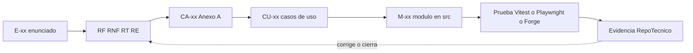

# Manual de trazabilidad de TrueKeate Wallet

Propósito: documentar **cómo se traza un requisito hasta su evidencia** en este repositorio —la cadena `RF/RNF/RT/RE → CA-xx → CU-xx → M-xx (ruta:línea) → prueba → evidencia`—, dónde vive cada eslabón, qué instrumentos automáticos la vigilan y qué huecos quedan abiertos, con las rutas y cifras citadas literalmente de los ficheros del corpus.

> **Método y límites.** Todo procede de **leer** el repositorio: `requerimientos.md`, `casos_uso/casos_uso.md`, `documento_tecnico.md`, `src/docs.spec.ts`, `scripts/check-mermaid.mjs`, `scripts/lint-prohibited.mjs`, `RepoTecnico/evidencia/H6/auditoria-rf-evidencia.mjs` y los logs de `RepoTecnico/evidencia/**`. **No se ha ejecutado ningún test, build ni script**: las cifras de suites y cobertura se presentan **como declaradas en el corpus**. Estado leído: `requerimientos.md` **v1.9** (`requerimientos.md:3`), `casos_uso/casos_uso.md` **v1.5** (`casos_uso/casos_uso.md:3`), `documento_tecnico.md` **v1.7** (`documento_tecnico.md:3`).

## La cadena de trazabilidad

### Los seis eslabones

La trazabilidad de este proyecto es una **cadena de custodia** de seis eslabones; cada salto tiene un fichero dueño y un formato propio.

#### Eslabón 1 — El requisito (`RF`/`RNF`/`RT`/`RE`)

Vive en `RepoTecnico/requerimientos.md`. El corpus declara **50 RF** (40 Must + 10 Should), **25 RNF**, **13 RT** y **4 RE** (`requerimientos.md:1127-1129`). Cada RF tiene una fila en la tabla de §1 con criterio abreviado y evidencia; los no funcionales están en §2 y las restricciones técnicas en §3. Ejemplo: `requerimientos.md:124` — fila de RF-19.

#### Eslabón 2 — El criterio de aceptación (`CA-xx`)

Es el **Anexo A** (`requerimientos.md` §9): `CA-RF-01`..`CA-RF-50` en **Gherkin** (`requerimientos.md:1127`) y `CA-RT-01`..`CA-RT-13` en **EARS** (`requerimientos.md:1128`). Ejemplo: `requerimientos.md:729-739` (`CA-RF-19`), con su evidencia en `:739`.

#### Eslabón 3 — El caso de uso (`CU-xx`)

Vive en `RepoTecnico/casos_uso/casos_uso.md`: **36 CU** con ficha completa (actor, objetivo, precondiciones, postcondiciones, datos implicados, flujo principal, flujos alternativos y de excepción, criterios Gherkin/EARS y **Evidencia**) y tres matrices en §2, §5 y §7. Regla declarada: «la ficha declara, la matriz agrega» (`documento_tecnico.md:1547`).

#### Eslabón 4 — El módulo (`M-xx` con `ruta:línea`)

Vive en `src/**`. El documento técnico fija **66 módulos (M1..M66)** con su responsabilidad única (`documento_tecnico.md:1622` es la última fila de §2.4). La unión módulo→fichero se materializa en la **cabecera JSDoc de contrato**, siempre en la **línea 2**: `src/background/crypto/secrets.ts:2` declara `M12`, `src/popup/views/SecurityView.tsx:2` declara `M46`, `src/background/approvals/calldata.ts:2` declara `M66`.

#### Eslabón 5 — La prueba

Tres frentes con convención de nombre propia: **Vitest** en `src/**/*.spec.ts` y `test/oracle/**/*.spec.ts` (jsdom o node); **Playwright** en `e2e/*.spec.ts` (proyecto `chromium-extension`, headless); **Forge** en `contracts/test/**` (suites `EIP712VerifierTest` y `EIP712VerifierFase4Test`). Los tres se describen con su comando real en `INFORME_PRUEBAS_FASE4.md:89-93`.

#### Eslabón 6 — La evidencia

Vive en `RepoTecnico/evidencia/**` en dos carpetas con propósitos distintos: **por hito** (`H1/`..`H6/`: `ACTA_H*.md`, logs de comando, `*.json` y `*.png` por spec) y **por fase de pruebas** (`Fase4/`, declarada con `TK_EVIDENCE_PHASE=Fase4` en `INFORME_PRUEBAS_FASE4.md:14`).

### La cadena en un diagrama



### Las cuatro reglas que la sostienen

- **Bidireccionalidad por construcción** (`documento_tecnico.md:1549`): §6.1 lista, para cada módulo, **todos** los CU y RF/RNF/RT que toca; §6.2 lista, para cada RF Must, **solo sus módulos principales** —los que lo implementan, no los que lo consumen—. Invariante verificable: cada módulo principal de §6.2 aparece en §6.1 con ese mismo RF, y todo módulo de §2.4 aparece al menos una vez en §6.1 (**ningún huérfano**). Se ejecuta como test documental en `npm run test`.
- **La ficha declara, la matriz agrega** (regla ACU-01, `documento_tecnico.md:1547`): si un CU añade un requisito se edita su ficha y la matriz se **recalcula** desde ella, nunca al revés.
- **Cuatro formas canónicas de evidencia** (`casos_uso/casos_uso.md:13`): `Vitest: <spec> — <aserción>`, `E2E: <spec> — <flujo>`, `Comando: …` e `Inspección: …`. Se prohíben `Revisión:` y `E2E` sin spec. El residual `R-06` nació de 33 evidencias con la forma prohibida (`VEREDICTO_FASE2_V1.md:257`).
- **Ningún salto sin fichero**: cada cabecera de spec declara el módulo que ejercita y los criterios que demuestra, y `src/docs.spec.ts` falla si esa declaración desaparece.

## Dónde vive cada eslabón

### Tabla de localización

| Eslabón | Fichero fuente | Formato | Cómo se localiza |
|---|---|---|---|
| `RF-xx` | `RepoTecnico/requerimientos.md` §1 | Tabla Markdown | `grep -n "RF-19" RepoTecnico/requerimientos.md` |
| `RNF-xx` | `requerimientos.md` §2 | Tabla Markdown | `grep -n "RNF-09" RepoTecnico/requerimientos.md` |
| `RT-xx` / `RE-xx` | `requerimientos.md` §3 | Tabla Markdown | `grep -n "RT-04" RepoTecnico/requerimientos.md` |
| `CA-RF-xx` | `requerimientos.md` §9.2 | Bloque `#### CA-RF-xx · título` (Gherkin) | `grep -n "^#### CA-RF-19" RepoTecnico/requerimientos.md` |
| `CA-RT-xx` | `requerimientos.md` §9.3 | Bloque `#### CA-RT-xx · título` (EARS) | `grep -n "^#### CA-RT-04" RepoTecnico/requerimientos.md` |
| `CU-xx` | `casos_uso/casos_uso.md` §3 | Bloque `### CU-xx · título` | `grep -n "^### CU-13" RepoTecnico/casos_uso/casos_uso.md` |
| Matriz RF → CU | `casos_uso/casos_uso.md` §5 | Tabla Markdown | `grep -n "^## 5\. Matriz" RepoTecnico/casos_uso/casos_uso.md` |
| Módulo `M-xx` | `src/**` línea 2 | Comentario JSDoc | `grep -rn "M12 —" src/` |
| Matriz módulo → CU → RF | `documento_tecnico.md` §6.1 | Tabla Markdown | `grep -n "### 6.1 Matriz" RepoTecnico/documento_tecnico.md` |
| Matriz RF Must → módulo | `documento_tecnico.md` §6.2 | Tabla Markdown | `grep -n "### 6.2 Cobertura" RepoTecnico/documento_tecnico.md` |
| Prueba Vitest | `src/**/*.spec.ts`, `test/oracle/**/*.spec.ts` | `describe(...)` + cabecera JSDoc | `grep -rn "CA-RF-50" src/ test/` |
| Prueba E2E | `e2e/*.spec.ts` | `test.describe(...)` | `grep -rn "CA-RF-19" e2e/` |
| Prueba Forge | `contracts/test/**` | Contrato Solidity de test | `grep -rn "function test" contracts/test/` |
| Evidencia | `RepoTecnico/evidencia/{H1..H6,Fase4}/` | `*.log`, `*.json`, `*.png`, `ACTA_*.md` | `grep -rln "CA-RF-19" RepoTecnico/evidencia/` |

### Citas reales de los eslabones 3 y 4

- Trazabilidad de CU-13: `casos_uso/casos_uso.md:731` — `**Trazabilidad:** RF-19, RF-35, RF-41 · RNF-05, RNF-12, RNF-21 · CA-RF-19, CA-RF-35, CA-RF-41`.
- Trazabilidad de CU-07: `casos_uso/casos_uso.md:399` — `**Trazabilidad:** RF-50 · RNF-09, RNF-22 · CA-RF-50`.
- Fila inversa RF→CU: `casos_uso/casos_uso.md:2203` — `| RF-19 | Must | CU-11, CU-12, CU-13 | sí (3) | CA-RF-19 |`.
- Fila inversa de RF-50: `casos_uso/casos_uso.md:2226` — `| RF-50 | Must | CU-07 | no (1) | CA-RF-50 (P-18; publicado en requerimientos.md v1.9) |`.
- Módulos de RF-19: `documento_tecnico.md:1658` — `M7, M11, M19, M51, M42`.
- Módulos de RF-50: `documento_tecnico.md:1681` — `M12, M46, M3, M22, M57`.

## Trazabilidad directa: un ejemplo completo

### RF-19 — `eth_sendTransaction` con vista previa decodificada

#### Salto 1 — El requisito

`requerimientos.md:124`: solicitar aprobación al usuario y luego **firmar y enviar** la transacción, con la vista previa que **decodifica el calldata** (selector, función y parámetros legibles) y etiqueta el destino (H-11b). Es **Must** (evidencia E-07).

#### Salto 2 — El criterio de aceptación

`CA-RF-19` (`requerimientos.md:729-739`): dado un `approve` ilimitado hacia un contrato no reconocido, la vista previa muestra selector, nombre de función y parámetros legibles, etiqueta el destino como «contrato no reconocido» y muestra un aviso destacado; al aprobar, la dApp recibe el hash y la transacción se difunde. Evidencia declarada en `:739`: `E2E: 10-aprobar-tx.spec.ts` · `Vitest: calldata.spec.ts`. **Cierra H-11b (calldata)**.

#### Salto 3 — Los casos de uso

`casos_uso/casos_uso.md:2203` asigna tres: **CU-11** (enviar ETH a dirección externa, `:598`), **CU-12** (transferir entre cuentas propias, `:680`) y **CU-13** (aprobar con vista previa decodificada, `:722`).

#### Salto 4 — Los módulos

`documento_tecnico.md:1658` da cinco módulos principales, con su `ruta:línea` de cabecera real:

| Módulo | Ruta real | Cabecera | Papel en RF-19 |
|---|---|---|---|
| M7 | `src/background/rpc/txContract.ts` | `:2` | Contrato observable: devuelve el hash; la estimación precede a la ventana |
| M11 | `src/background/crypto/sign.ts` | `:2` | Única vía de firma (EIP-1559 tipo 2 y EIP-155) |
| M19 | `src/background/approvals/preview.ts` | `:2` | Construye `TxPreview` y los avisos; **no** decodifica aquí |
| M51 | `src/notification/TxPreviewPanel.tsx` | `:2` | Pinta el resumen y el calldata decodificado |
| M42 | `src/popup/views/SendView.tsx` | `:2` | Formulario de envío y validación inline |

Además, **M66** (`src/background/approvals/calldata.ts:2`) es la tabla local cerrada de selectores que decodifica de verdad; aparece en §6.1 con RF-19 (`documento_tecnico.md:1622`) como oráculo anti-firma-ciega, aunque §6.2 no lo liste como principal.

#### Salto 5 — Las pruebas

| Tipo | Fichero real | Qué demuestra |
|---|---|---|
| Vitest | `test/oracle/calldata.spec.ts` | Selector fuera de tabla ⇒ `isUnrecognizedContractCall`; argumentos que no encajan ⇒ `decode-failed`; coherencia selectores↔firmas |
| Vitest | `src/background/rpc/txContract.spec.ts` | Contrato de M7: hash al difundir y estimación bloqueante |
| E2E | `e2e/10-aprobar-tx.spec.ts` | `CA-RF-19` y `CA-RF-35` sobre la extensión real |

La cabecera del E2E lo declara literalmente (`e2e/10-aprobar-tx.spec.ts:3`): «Criterios: `CA-RF-19` (vista previa decodificada) y `CA-RF-35` (como máximo UNA `notification.html`, con su contador)»; y fija sus constantes reales: cuenta #0 de Anvil `0xf39F…2266` (`:33`), contrato ficticio (`:36`) y `approve` con allowance máxima `2^256-1` (`:38-39`).

#### Salto 6 — La evidencia

`RepoTecnico/evidencia/H4/10-aprobar-tx-2026-09-12.{json,png}` y `RepoTecnico/evidencia/Fase4/10-aprobar-tx-2026-09-13.png` (declarados en `INFORME_PRUEBAS_FASE4.md:520`); prueba real de extremo a extremo con hash y recibo `status 0x1` en `RepoTecnico/evidencia/H4/extremo-a-extremo-2026-09-12.{json,png}` (`plan_desarrollo.md:526`).

### RF-50 — Revelado y exportación con temporizador

#### Salto 1 — El requisito

`requerimientos.md:112`: revelar y exportar la frase semilla (BIP-39) y las claves privadas **bajo confirmación explícita**, con advertencia de riesgo, valores ocultos por defecto, **revelado temporal de 30 s con ocultado también por pérdida de foco**, política de portapapeles (copiar permitido; borrado al ocultar si aún contiene la semilla) y prohibición de exponerlos por `window.postMessage`. Es **Must**, declarado **NUEVO (diseño, D-13)** y entra en el MVP por **P-18** (`requerimientos.md:403`).

#### Salto 2 — El criterio de aceptación

`CA-RF-50` (`requerimientos.md:1045-1066`): **dos bloques Gherkin** (higiene normal y guarda de sesión de dApp vigente) más un párrafo **EARS**. Evidencia triple en `:1065`; el EARS (`:1066`) cierra D-13, RNF-22, ADT-09/P-20 y R-09a.

#### Salto 3 — El caso de uso

**CU-07** «Revelar/exportar el material de recuperación» (`casos_uso/casos_uso.md:391`). Su postcondición de éxito exige **exactamente 1 entrada** en `truekeate_logs` con `event: approval_resolved` y `origin: extension` **sin el valor** (`:396`), y su delta propio ACU-26 añade cinco condiciones ausentes del texto del requisito (`:400`). Evidencia doble en `:469`, con `revealHygiene.spec.ts`, `revealClipboard.spec.ts`, `secretsExport.spec.ts`, `logRedaction.spec.ts` y `eip1193.spec.ts`.

#### Salto 4 — Los módulos

`documento_tecnico.md:1681` da cinco módulos principales:

| Módulo | Ruta real | Cabecera | Papel en RF-50 |
|---|---|---|---|
| M12 | `src/background/crypto/secrets.ts` | `:2` | Servicio de revelado: confirmación obligatoria, contexto de confianza, 30 s, guarda `-32000` |
| M46 | `src/popup/views/SecurityView.tsx` | `:2` | Diálogo destructivo, nodo inexistente cuando está oculto, descarte del estado |
| M3 | `src/background/rpc/router.ts` | `:2` | Despacho de `wallet_revealSecret` con guarda de `sender` |
| M22 | `src/background/security/redaction.ts` | `:2` | Impide que el valor acabe en `truekeate_logs` |
| M57 | `src/shared/constants.ts` | `:2` | Fuente única de `REVEAL_HIDE_MS` y `CLIPBOARD_CLEAR_ON_HIDE` |

M20 (`src/background/security/senderGuard.ts`) participa en la allowlist de `sender.url`; `wallet_revealSecret` figura como método interno en `documento_tecnico.md:1373`.

#### Salto 5 — Las pruebas

| Tipo | Fichero real | Qué demuestra |
|---|---|---|
| Vitest | `src/background/crypto/secretsExport.spec.ts` | Confirmación, contexto de confianza, 30 s y guarda `-32000` (cabecera en `:4-8`) |
| Vitest | `src/background/crypto/revealHygiene.spec.ts` | El estado de la UI descarta el valor al ocultarse (14 pruebas, `INFORME_PRUEBAS_FASE4.md:138`) |
| Vitest | `src/background/crypto/revealClipboard.spec.ts` | Portapapeles con huella SHA-256 y sin destruir contenido ajeno (14 pruebas, `:139`) |
| Vitest | `src/background/logging/logRedaction.spec.ts` | 0 coincidencias del valor revelado en los logs |
| E2E | `e2e/25-recuperacion.spec.ts` | Confirmación, 30 s, ocultado por pérdida de foco, portapapeles vacío, bloqueo `-32000` |
| E2E | `e2e/34-revelado-plazo-30s.spec.ts` | El revelado se oculta solo a los 30 s (`:165`) |

La cabecera de `e2e/25-recuperacion.spec.ts:1-13` enumera los cinco criterios y remite a la captura `H2/25-recuperacion-<fecha>.png`.

#### Salto 6 — La evidencia

`RepoTecnico/evidencia/H2/ACTA_H2.md`, `RepoTecnico/evidencia/Fase4/34-revelado-plazo-30s-2026-09-13.json` (`INFORME_PRUEBAS_FASE4.md:551`) y `RepoTecnico/evidencia/Fase4/25-recuperacion-2026-09-13.png`.

### Lectura del recorrido

Los dos ejemplos tienen la misma forma: **un** requisito → **un** `CA-xx` → **uno o varios** CU → **una lista corta y nominada** de módulos con `ruta:línea` → **specs con nombre exacto** → **ficheros de evidencia con fecha**. Ningún salto se apoya en «se probó» sin fichero.

## Trazabilidad inversa: de una prueba al requisito

### Desde un spec de `src/background/approvals/`

#### La cabecera del spec

`src/background/approvals/queue.spec.ts` es el spec de la cola persistida. Su cabecera JSDoc (`:1-15`) declara: **módulo** `M14` (`:2`); **tareas** `H4, tareas 4.1, 4.6 y 4.8 de plan_desarrollo.md §3.4.5; §3.4.7 «Vitest»` (`:3-4`); **criterios** `CA-RF-37` (dos solicitudes simultáneas coexisten sin sobrescribirse; el `rmwLock` serializa la lectura-modificación-escritura) y `CA-RF-41` (al resolver, la entrada desaparece y una respuesta duplicada se ignora) — `:7-10`; y **otros oráculos**: cardinalidad 8 globales / 1 por origen / 6 por minuto → `4001` inmediato sin persistir y sin abrir ventana (`:11-12`), y serialización por cuenta con `truekeate_inflight_tx` (`:13-14`).

#### La subida hasta el RF y el CU

| Paso | Dato | Fuente |
|---|---|---|
| Spec | `src/background/approvals/queue.spec.ts:2` | el propio fichero |
| Módulo | M14 `approvals/queue.ts` | `documento_tecnico.md:1568` |
| CU que implementa | CU-11..CU-16, CU-19, CU-24, CU-25, CU-27, CU-28 | `documento_tecnico.md:1568` |
| RF que satisface | RF-22, RF-23, RF-26, RF-37, RF-41 | `documento_tecnico.md:1568` |
| RF principal | `CA-RF-37` y `CA-RF-41` | `requerimientos.md` §9.2 |
| Módulos que implementan RF-37 | M14, M17, M16, M15, M2 | `documento_tecnico.md:1674` |

El CU central es **CU-16** («Atender dos solicitudes simultáneas y serializar por cuenta», `casos_uso/casos_uso.md:930`), y su oráculo evita depender del badge: **P-17** fija «2 entradas `pending` en `truekeate_pending_requests` + 1 transacción en vuelo por cuenta» (`requerimientos.md:402`).

### Desde un spec de `e2e/`

#### La cabecera del spec

`e2e/10-aprobar-tx.spec.ts:1-7` declara el propósito («Aprobación de una transacción con foco, origen y ventana única; H4, tarea 4.18; §3.4.7»), los criterios `CA-RF-19` y `CA-RF-35` (`:3-4`) y la evidencia que produce: `RepoTecnico/evidencia/H4/10-aprobar-tx-<fecha>.png` (`:6`).

#### La subida hasta el RF y el CU

| Paso | Dato | Fuente |
|---|---|---|
| Spec | `e2e/10-aprobar-tx.spec.ts:3` | el propio fichero |
| Criterio | `CA-RF-19` y `CA-RF-35` | `requerimientos.md:729` y §9.2 |
| RF | RF-19 y RF-35 | `documento_tecnico.md:1658` y `:1672` |
| CU | CU-11, CU-12, CU-13 (RF-19); CU-13, CU-14 (RF-35) | `documento_tecnico.md:1658`, `:1672` |
| Matriz inversa RF→CU | `RF-19 | Must | CU-11, CU-12, CU-13 | sí (3) | CA-RF-19` | `casos_uso/casos_uso.md:2203` |
| Ficha del CU | CU-13 «Aprobar una transacción con vista previa decodificada» | `casos_uso/casos_uso.md:722` |

### Por qué las cabeceras son el mecanismo

La trazabilidad inversa **no depende de una tabla externa**: cada spec declara en su cabecera el módulo que ejercita y los criterios que demuestra, y `src/docs.spec.ts` **falla** si esa cabecera desaparece o pierde su referencia de requisito. Eso convierte la trazabilidad en una propiedad del repositorio. La contrapartida —que la referencia sea de la **forma** correcta pero apunte a un requisito inexistente— se trata en «Huecos y límites».

## Cobertura de la matriz

### Cifras declaradas

**Todo lo de esta sección está declarado en el corpus**; el autor de este manual no ha re-ejecutado ninguna comprobación.

| Afirmación | Valor | Dónde se declara |
|---|---|---|
| CU con al menos un módulo asignado | **36/36** | `documento_tecnico.md:1634` |
| RF Must con módulo «principal» · sin módulo | **40/40 · 0** | `documento_tecnico.md:1683` |
| Cobertura de requisitos del MVP | **25/25 RNF · 13/13 RT · 4/4 RE** | `documento_tecnico.md:61` |
| RF totales con módulo y CU | **50/50** | `documento_tecnico.md:1687` |
| RF con `CA-RF-xx` y evidencia declarada | **50/50** | `requerimientos.md:1127` |
| RT y RNF con criterio | **13/13 · 25/25** | `requerimientos.md:1128-1129` |
| RF con al menos un CU · huérfanos | **50/50 · 0** | `casos_uso/casos_uso.md:2181` |
| Criterios del MVP cubiertos en Fase 4 | **50 `CA-RF-*`** | `INFORME_PRUEBAS_FASE4.md:496` |

### Matriz módulo → CU → RF (documento técnico §6.1)

Cabecera real en `documento_tecnico.md:1553`: `| Módulo (§2.4) | CU que implementa | RF que satisface | RNF / RT / RE |`. Cubre desde M1 (`manifest.ts`, `:1555`) hasta M66 (`approvals/calldata.ts`, `:1622`) y continúa con filas que **no son módulos de `src/`**: `test.html` (`:1620`), `contracts/EIP712Verifier.sol` (`:1621`), `vite.config.ts` (`:1623`), `package.json` y `package-lock.json` (`:1624`), `scripts/lint-prohibited.mjs` (`:1625`), `scripts/check-mermaid.mjs` (`:1626`), la suite `e2e/**` (`:1627`) y `RepoTecnico/evidencia/**` (`:1628`). Dos filas más declaran requisitos **sin módulo**: `RE-02` y `RE-03`, restricciones de proceso que se verifican por inspección (`:1629`).

### Matriz RF Must → módulo (documento técnico §6.2)

Cabecera real en `documento_tecnico.md:1640`: `| RF (Must) | Qué se implementa | Módulo(s) principal(es) | CU / \`CA\` |`. Recorre los 40 RF Must uno a uno. La regla de la columna (ADT-10) está en `documento_tecnico.md:1638`: solo los módulos que **implementan**, no los que consumen o renderizan.

### Lo que estas cifras significan y lo que no

- **Significan** que existe una fila para cada CU y cada RF Must, con módulos nominados y relación bidireccional declarada; que existe evidencia declarada para los 50 `CA-RF-*` (`requerimientos.md:1127`) y un mapa criterio → evidencia canónica (`INFORME_PRUEBAS_FASE4.md:500-551`); y que los RNF/RT/RE transversales también están anclados: `documento_tecnico.md:1685` explica que RNF-01 es la propia matriz, RNF-17 se verifica con `npm run test -- --coverage`, RNF-24 sobre las configuraciones de build, RT-01 sobre las superficies React y RE-02/RE-03 por inspección.
- **No significan** exhaustividad en el sentido de que cada línea del corpus esté probada, ni que las cifras sean reproducibles sin ejecutar: los conteos de §6.1/§6.2 se pueden **leer** (son tablas), pero el invariante bidireccional lo comprueba un test documental que este manual no ha ejecutado.

## Instrumentos automáticos de trazabilidad

### `src/docs.spec.ts` — la puerta documental por módulo

**Qué comprueba.** El universo son **todos** los ficheros `.ts` y `.tsx` de `src/` a cualquier profundidad, **incluidos los `*.spec.ts` y el propio fichero** (`src/docs.spec.ts:26-28`, `:50`, `:111`). Para cada uno exige: (1) que **abra con un bloque JSDoc** antes de la primera sentencia o declaración, admitiendo delante BOM, líneas en blanco y comentarios `//` —necesarios para `// @vitest-environment node`— (`:75-88`); (2) que ese bloque declare un **identificador de módulo** con forma `M<numero>` (canónica `M8`/`M14.b`/`M57`, admitida `M-8`) dentro del rango **M1..M66**; un `M99` inventado **no pasa** (`:24-25`, `:41`, `:102-104`); y (3) que referencie **al menos un requisito** con forma `RF-xx`, `RNF-xx` o `RT-xx`, dos dígitos como máximo (`:44`, `:105-107`).

**Cuántos ficheros y comprobaciones.** El log `RepoTecnico/evidencia/H6/docs-spec-2026-09-12.log` declara **1 fichero de test, 148 tests, todos en verde** (673 ms). Como el spec tiene 3 pruebas fijas más una por fichero (`it.each(FILES)` en `:125`), 148 implica **145 ficheros** en esa fecha; `estado_proyecto.md:5` y `plan_desarrollo.md:754` citan el mismo dato (145 ficheros / 148 comprobaciones).

> **Comprobación del autor de este manual (solo lectura):** hoy `src/` contiene **154 ficheros `.ts`/`.tsx`**, de los cuales **60** son specs. La cifra del log es una **foto de H6**, no el estado actual: **pendiente de confirmar** re-ejecutando la puerta.

**Qué se rompería si un requisito quedara sin módulo.** Si un fichero nuevo entra sin cabecera, o si alguien borra de una cabecera el `M-xx` o la referencia `RF/RNF/RT`, el spec **falla nombrando el fichero**: la prueba agregada (`:129-135`) construye un informe con `fichero: problemas` y exige que sea la cadena vacía.

### `RepoTecnico/evidencia/H6/auditoria-rf-evidencia.mjs` — la auditoría RF → evidencia

**Qué audita.** Lee `RepoTecnico/requerimientos.md` (`:6`), extrae los bloques `#### CA-RF-xx · título` (`:15`), se queda con los **40 RF Must** de una lista literal (`:7-12`) y, del texto de la línea `**Evidencia:**` de cada bloque (`:40`), extrae **nombres de fichero plausibles** por extensión (`:50`) y comprueba que **existen de verdad**, buscando en `src/`, `e2e/`, `scripts/`, `contracts/test/`, `test/`, `RepoTecnico/evidencia` y `RepoTecnico` (`:17-35`).

**Cómo se ejecuta.** Es un módulo ESM de Node sin dependencias: `node RepoTecnico/evidencia/H6/auditoria-rf-evidencia.mjs` desde la raíz. **No** hay script npm declarado para él en `package.json:6-16`.

**Qué declaró.** El log `auditoria-rf-evidencia-2026-09-12.log` cierra con «total CA-RF en el anexo: **50** · Must auditados: **40** · con hueco: **2**». Los dos huecos: **RF-08** (cita `tx.spec.ts`; el real es `src/background/rpc/txContract.spec.ts`) y **RF-37** (cita `approvalQueue.spec.ts`; el real es `src/background/approvals/queue.spec.ts`). Ambos están declarados como desviación **D-H6-C** (`plan_desarrollo.md:749`) y clasificados como **deriva documental, no falta de evidencia**: los dos specs existen y están en verde.

### `npm run check:mermaid` — la puerta de los diagramas

`package.json:14` declara `"check:mermaid": "node scripts/check-mermaid.mjs RepoTecnico"`. El script recorre **todos** los `.md` de `RepoTecnico/` saltando `node_modules` y directorios ocultos (`scripts/check-mermaid.mjs:105-114`), extrae los bloques ` ```mermaid ` conservando la línea de apertura y detecta fences sin cerrar (`:120-144`), y tiene **dos modos** (`:7-14`): **MODO A**, `mermaid.parse()` real de mermaid 11 con jsdom como DOM (el exigido por `documento_tecnico.md` §7.5.6 y el bloqueante); **MODO B**, validación estructural de respaldo si mermaid no carga (escape documentado: `TK_MERMAID_STRUCTURAL=1`, `:233`). En **ambos** modos comprueba siempre que no haya `;` dentro del texto de un mensaje de `sequenceDiagram` (`:198-200`); la ambigüedad de etiquetas de `stateDiagram-v2` es error en MODO B y aviso en MODO A (`:18`, `:207-213`).

El log `RepoTecnico/evidencia/H6/check-mermaid-2026-09-12.log` declara «**23 ficheros Markdown y 27 bloques mermaid** en `RepoTecnico/`», MODO A activo, **4 avisos** de `stateDiagram-v2` sobre `documento_tecnico.md:698-702` y cierre «**OK: 27/27 bloques validos**».

### `npm run lint:prohibited` — la puerta de prohibiciones

`package.json:13` declara el script. `scripts/lint-prohibited.mjs:8-19` documenta **siete** comprobaciones: (1) cero dependencias prohibidas en los especificadores de import (`viem`, `@scure/bip39`, `@metamask/*`, `axios`; RT-03, con `ethers` como única librería criptográfica por RT-02); (2) cero llamadas propias a `fetch(`; (3) cero `chrome.storage.sync` (ADT-26); (4) cero prefijo heredado `codecrypto_` (RT-13); (5) cero literales de color (`#rgb`, `rgb()`, `hsl()`, degradados) **fuera de `src/styles/tokens.css`** (RNF-18 / `CA-RT-12`); (6) cero `ethers` importado desde `src/popup/` (RNF-14); y (7) sobre `dist/` si existe, cero recursos remotos y cero hosts de una lista cerrada de once CDN (`:44-56`).

El log `RepoTecnico/evidencia/H6/lint-prohibited-2026-09-12.log` declara «`src/`: **150 ficheros revisados**», «`dist/`: **14 ficheros revisados**» y cierre OK; `INFORME_PRUEBAS_FASE4.md:185` declara `exit 0 · 0 hallazgos`.

### Qué se rompería en cada caso

| Escenario | Instrumento que lo detecta | Efecto |
|---|---|---|
| Módulo nuevo en `src/` sin cabecera con `M-xx` | `src/docs.spec.ts` | Test rojo nombrando el fichero |
| Cabecera con `M-xx` pero sin `RF/RNF/RT` | `src/docs.spec.ts` | «el bloque JSDoc no referencia ningun RF/RNF/RT» |
| `M99` fuera del rango declarado | `src/docs.spec.ts` | «fuera del rango M1..M66» |
| `CA-RF-xx` sin artefacto existente | `auditoria-rf-evidencia.mjs` | Fila `FALTA` contada en «con hueco» |
| Diagrama Mermaid que no parsea | `npm run check:mermaid` | `exit 1` con bloque y línea |
| `;` en un mensaje de secuencia | `npm run check:mermaid` | Error **en ambos modos** |
| Dependencia o color prohibido | `npm run lint:prohibited` | `exit 1` con `ruta:línea` |

Lo que **ningún** instrumento detecta por sí solo es un requisito **sin prueba**: `docs.spec.ts` no exige que exista un `*.spec.ts` por módulo, y la auditoría de RF comprueba que el fichero citado exista, no que la prueba **sea la correcta** ni que **cubra** el criterio.

## Huecos y límites de la trazabilidad

### Lo que no se puede verificar mecánicamente

#### La corrección semántica de la referencia

`src/docs.spec.ts` valida la **forma** de la referencia, no su **existencia**: `/\b(?:RF|RNF|RT)-\d{1,2}\b/` (`:44`) acepta cualquier número de uno o dos dígitos sin contrastarlo con el corpus. Consecuencia **verificada por lectura**: `test/oracle/calldata.spec.ts:4` cita **`RNF-31`**, y el corpus solo declara **RNF-01..RNF-25** (`requerimientos.md:1129`), así que esa referencia está **colgando**. Además ese fichero vive en `test/oracle/**`, **fuera del universo** de `docs.spec.ts` (que solo recorre `src/`), de modo que ni siquiera lo auditaría. **Pendiente de confirmar** si la intención era `RT-03` (prohibición de consultar servicios externos) o `RF-31`.

#### La unicidad del identificador de módulo

`docs.spec.ts` comprueba que el número esté en rango, **no** que sea único. Consecuencia **verificada por lectura**: `src/shared/i18n.ts:2` declara `M66`, el mismo identificador que `src/background/approvals/calldata.ts:2`, mientras `documento_tecnico.md` §2.4 reserva **M66** para `approvals/calldata.ts` (`:1622`, `:2191`). Los pares «módulo + su spec» (M11 en `sign.ts` y sus cinco specs, M7 en `txContract.ts` y su spec) son **legítimos** —el spec declara qué módulo ejercita—, pero la colisión `calldata.ts` / `i18n.ts` **no** lo es. **Pendiente de confirmar** si `i18n.ts` debía recibir un identificador fuera de M1..M66: en tal caso, el rango declarado en `docs.spec.ts:47` (`MAX_MODULE = 66`) lo rechazaría y la puerta tendría que actualizarse a la par.

#### Las fronteras del universo auditado

`docs.spec.ts` audita **solo `src/`** (`:38`, `:57-69`). Quedan **fuera** de la puerta documental `test/oracle/**` (14 specs declarados en `INFORME_PRUEBAS_FASE4.md:135-149`), `e2e/*.spec.ts` (33 specs), `contracts/test/**`, `scripts/*.mjs` y `test.html`. Todos ellos sí están dentro del universo de la **auditoría de RF**, pero esa auditoría solo comprueba existencia de ficheros.

#### La cobertura real de un criterio por una prueba concreta

Nadie comprueba que el `CA-RF-xx` citado en una cabecera esté **realmente** aseverado en el cuerpo del test: un spec podría declarar `CA-RF-19` y no comprobar ninguno de sus pasos Gherkin. Es un límite de diseño, no un defecto del instrumento; cerrarlo exigiría asociar cada paso Gherkin a una aserción, cosa que ningún runner de este proyecto hace hoy. **Pendiente de confirmar** como decisión de alcance.

### Los RF Should fuera del MVP

`requerimientos.md:399` declara el MVP como **40 Must** (`RF-01..RF-05`, `RF-07..RF-11`, `RF-13..RF-31`, `RF-33`, `RF-35..RF-37`, `RF-41..RF-43`, `RF-45`, `RF-46`, `RF-49` y **RF-50**) y `requerimientos.md:400` lista los **10 Should** del ciclo posterior:

| RF Should | Materia | Estado real declarado |
|---|---|---|
| RF-06 | Borrar cuenta importada | **Implementado y verificado** en Fase 4 (`INFORME_PRUEBAS_FASE4.md:672`), unidad **C7** |
| RF-12 | Hint de la frase de Anvil | **No ejecutado** (`:666`) |
| RF-32 | Historial persistente (`logLimit = 500`) | **Parcial**: los logs sobreviven al reset; falta el cierre formal (`:671`) |
| RF-34 | i18n y formato | **No ejecutado**; el formateo ya está probado en `format.spec.ts` (`:667`) |
| RF-38 | Badge | **No promocionado** (`:673`) |
| RF-39 | Notificaciones de Chrome | **No ejecutado** (`:674`) |
| RF-40 | Timeout | **Mecanismo construido y verificado**; cierre formal en **C10** (`:675`) |
| RF-44 | EIP-6963 completo | **Parcial**: se anuncia y se verifica; falta el re-anuncio sincrónico en todos los frames (`:670`) |
| RF-47 | Historial de la dApp | **No ejecutado** como unidad (`:669`) |
| RF-48 | «Acerca de» | **Parcial**: existe por RNF-23, pero RF-48 **sigue Should** (`:668`) |

`P-17` (`requerimientos.md:402`) fija que el MVP **no depende del badge**: el oráculo de CU-16 pasa a «2 entradas `pending` + 1 transacción en vuelo por cuenta». El orden de recorte declarado si se agota el presupuesto es **C3 → C4 → C5** (`INFORME_PRUEBAS_FASE4.md:677`).

**Consecuencia para la trazabilidad:** estos 10 RF **sí** tienen CU, `CA-RF-xx` y módulo (`documento_tecnico.md:1687`) y **sí** aparecen en las matrices; lo que no tienen es **evidencia de cierre en el MVP**. `INFORME_PRUEBAS_FASE4.md:553-557` lo dice explícitamente: tienen «evidencia **parcial** ya medida en esta fase (varios de ellos están implementados de hecho) y su cierre formal corresponde al ciclo posterior C1..C10». En §6.1 del informe, varios figuran como «Ciclo posterior **Cn** (no ejecutado)» (`:513`, `:533`, `:535`, `:539`, `:540`, `:545`, `:548`, `:549`).

### Comprobaciones que arrojan un resultado distinto del declarado

Estas divergencias son **observadas al leer el repositorio** y se marcan como **pendiente de confirmar**, porque pueden ser correcciones ya en curso.

#### Citas de evidencia desactualizadas en `requerimientos.md` §9.2

Declaradas como **D-H6-C** (`plan_desarrollo.md:749`): RF-08 cita `tx.spec.ts` y RF-37 cita `approvalQueue.spec.ts`; los reales son `src/background/rpc/txContract.spec.ts` y `src/background/approvals/queue.spec.ts`. La auditoría mecánica lo registró como **2 huecos de 40 Must**. La desviación se declaró «para la pasada de consistencia de la Fase 4» y el corpus leído sigue en v1.9: **estado actual pendiente de confirmar**.

#### Metadatos del propio corpus divergentes entre la cabecera y la tabla §2

`estado_proyecto.md:6` declara «**Versión de este documento:** ✅ **v2.7**», pero su tabla §2 describe el propio fichero como «✅ **v2.5** (este archivo)» y con «Decisiones **DEC-01..DEC-78**» (`estado_proyecto.md:45`), mientras la tabla de decisiones llega a **DEC-87** (`:321`, `:516-517`). Del mismo modo:

- `diccionario_datos.md:3` declara **v1.10**; `estado_proyecto.md:41` lo describe como «✅ **v1.8**».
- `plan_desarrollo.md:3` declara **v1.7**; `estado_proyecto.md:52` lo describe como «✅ **v1.5** (Fase 3, H1, H2, H3 y H4 cerrados)», y el propio plan ya incluye una fila de historial **1.8** con el cierre de la Fase 4 (`plan_desarrollo.md:940`).

Es la clase de residual que el veredicto de Fase 2 ya cerró dos veces (**R-05** y **R-11**, `VEREDICTO_FASE2_V1.md:256`, `:262`). **Pendiente de confirmar** si se corrige en la Fase 5.

#### Diferencia entre la puerta documental y el árbol actual

Ya señalada: el log de H6 declara **145 ficheros / 148 comprobaciones** y hoy `src/` tiene **154** ficheros `.ts`/`.tsx`. No es un defecto, es una **foto con fecha**; conviene saber que la cifra citada en `estado_proyecto.md:5` y `plan_desarrollo.md:754` corresponde al cierre de H6.

### Afirmaciones del corpus no comprobables desde el código

- **Trazabilidad por inspección.** `documento_tecnico.md:1629` declara que **RE-02** (modo sin cifrado como riesgo aceptado) y **RE-03** (sin `push` sin orden explícita) **no tienen módulo**: se verifican por inspección de la configuración y del historial de comandos. No son trazables a una prueba automática; son trazables a una **revisión**.
- **Evidencias que son capturas.** Varias evidencias son `*.png` (`RepoTecnico/evidencia/Fase4/25-recuperacion-2026-09-13.png`, `10-aprobar-tx-2026-09-13.png`). Un `grep` no valida su contenido: la auditoría comprueba que el **fichero exista** (`auditoria-rf-evidencia.mjs:56`), no lo que muestra. Afirmaciones como «la vista previa muestra el selector y el nombre de función» se apoyan en un test que las asevera, no en la captura.
- **Cifras de suites y cobertura.** El bloque `INFORME_PRUEBAS_FASE4.md:23-28` (**Vitest 1185/1185 en 71 ficheros**, **Playwright 84/84 en 33 specs**, **Forge 30/30 en 2 suites**, total **1299 pruebas**) y el de cobertura (`:44-49`: global **86,11 %**, `crypto/` **86,98 %**, `approvals/` **95,60 %**, `shared/validation/` **93,13 %**) son **declaraciones con su log archivado** (`RepoTecnico/evidencia/Fase4/coverage-fase4-cierre.log`, `vitest-cierre-fase4.log`, `e2e-cierre-fase4.log`, `forge-cierre-fase4.log`). **Este manual no las ha re-ejecutado** y por tanto no las certifica: las reproduce como parte de la cadena de custodia documental.
- **Dos salvedades heredadas, declaradas y no cumplidas.** `INFORME_PRUEBAS_FASE4.md:568-573` mantiene abiertas dos afirmaciones que **no** son comprobables desde el código: **RNF-15** (build limpio en Linux/CI) queda **verificado solo en Windows**, sin WSL2 ni CI en el equipo (`RepoTecnico/evidencia/H6/wsl2-no-disponible-2026-09-12.log`), y el **ensayo del Perfil B** (CU-36 con sujeto externo) queda **no verificado de forma independiente**, con solo el *dry-run* del autor (55 s).
- **Condiciones de validez de la evidencia.** El informe declara dos medidas que **no** son defectos del producto pero afectan a la reproducibilidad de las cifras (`INFORME_PRUEBAS_FASE4.md:614-633`): el fallo intermitente de `09-conectar` por carga de la máquina y los 37 fallos por `ERR_CONNECTION_REFUSED at http://localhost:5174/test.html` cuando el `webServer` de la dApp muere a mitad de suite por escrituras en el árbol vigilado. La regla operativa derivada —**no escribir ficheros del repositorio mientras la suite E2E corre**— es una condición de validez, no un detalle cosmético.
