# Diagramas UML — TrueKeate Wallet

> **Fase:** 2 — Auditoría/especificación · **Versión:** 1.1 · **Estado:** ✅ propuesto para revisión
> **Producto:** **TrueKeate Wallet** (extensión Chrome/Edge Manifest V3) + dApp de pruebas (`test.html`) sobre Foundry Anvil.
> **Fuentes (leídas antes de redactar):** `RepoTecnico/casos_uso/casos_uso.md` v1.2 (36 CU — **fuente principal**), `RepoTecnico/requerimientos.md` v1.6 (§1 RF-01..RF-50, §2 RNF-01..RNF-25, §3 RT-01..RT-13 y RE-01..RE-04, §4 rúbrica y MVP, §9 `CA-RF-xx`/`CA-RT-xx`), `RepoTecnico/diccionario_datos.md` v1.5 (claves `truekeate_*`, entidades, protocolo `TRUEKEATE_*`, catálogo RPC y códigos EIP-1193), `RepoTecnico/entornos_globales.md` v1.7 (permisos, constantes, comandos, nomenclatura) y `RepoTecnico/casos_uso/AUDITORIA_CASOS_USO_V1.md` (auditoría ya remediada: **no se reintroduce ningún hallazgo ACU-01..ACU-30**).
>
> **Convenciones de este documento**
> 1. **Fidelidad al corpus.** Los 36 CU, los actores y sus nombres, los estados de `PendingRequest`, los mensajes del protocolo, las claves de almacenamiento y las constantes (120 s / 60 s, 5 s de polling, backoff 1/2/4/8/16 s máx. 30 s, `pendingRequestsMax = 8`, 4 llamadas RPC 1+3, TTL de sesión 24 h) se transcriben **literalmente** de las fuentes. **No se inventa** ningún CU, actor, estado, mensaje ni constante.
> 2. **Un diagrama por bloque**, cada uno precedido de su título descriptivo. Los bloques son Mermaid puro: ` ```mermaid ` … ` ``` `.
> 3. **Coherencia de numeración CU.** `casos_uso.md` v1.2 (documento auditado) es la **fuente de verdad de los identificadores**: Conexión de dApp = **CU-17**, `eth_accounts` con sesión = **CU-18**, aviso de origen sin sesión = **CU-20**, envío de transacción = **CU-11**/**CU-13**. Las referencias abreviadas del encargo que no coinciden con esa numeración se han alineado al corpus (por ejemplo, «conexión con selección de cuenta» → **CU-17**, no CU-14/CU-15; «`eth_accounts` con sesión vigente/vencida» → **CU-18/A2**, no CU-17/CU-18; «dos transacciones simultáneas» → **CU-16/A2**, no CU-16/A4; «rechazo del usuario» → **CU-14/A1**, no CU-13/A2).
> 4. **Notación de relaciones.** Línea simple `-->` = asociación actor ↔ CU. `-.->|include|` = el CU destino aparece **citado explícitamente** como paso invocado (*«el Usuario decide en CU-13»*, *«continúa en CU-14»*, *«se aplica X-03»*). `-.->|extend|` = el CU origen se declara como **flujo alternativo o de excepción** de la ficha destino (*«A1 — desde el paso 4 … CU-20»*). Si una ficha no cita ninguna relación, **no se dibuja**.

---

## 1. Diagrama de casos de uso

**Figura 1 — Actores, los 36 casos de uso y sus relaciones.** Los actores se dibujan con forma de actor/estadio, los CU con forma de estadio (elipse aplanada) agrupados por área funcional, y las dependencias `include`/`extend` con línea discontinua. Los flujos alternativos consolidados (`X-01`…`X-10`) y las reglas transversales (`RNF-xx`) no son CU y por eso **no** aparecen como nodos.

```mermaid
flowchart LR
    A_Usuario@{ shape: person, label: "Usuario — dueño de la cartera" }
    A_Dapp@{ shape: stadium, label: "dApp de terceros — test.html" }
    A_DappNoAut@{ shape: stadium, label: "dApp no autorizada — adversario" }
    A_DappHostil@{ shape: stadium, label: "dApp hostil — adversario" }
    A_SW@{ shape: stadium, label: "Service Worker — background" }
    A_Anvil@{ shape: stadium, label: "Nodo RPC local — Anvil" }
    A_Navegador@{ shape: stadium, label: "Navegador Chrome/Edge — plataforma" }
    A_Docente@{ shape: person, label: "Docente/evaluador — Perfil B" }

    subgraph G1 [Cartera y cuentas]
        direction TB
        CU01([CU-01 · Crear una cartera nueva con frase semilla BIP-39])
        CU02([CU-02 · Importar una cartera desde frase de recuperación])
        CU03([CU-03 · Importar una cuenta por clave privada])
        CU04([CU-04 · Derivar y añadir cuentas HD])
        CU05([CU-05 · Renombrar una cuenta])
        CU06([CU-06 · Eliminar una cuenta importada])
        CU07([CU-07 · Revelar/exportar el material de recuperación])
        CU08([CU-08 · Reabrir el popup y restaurar el estado persistido])
        CU09([CU-09 · Recibir fondos: dirección, copiar y QR])
        CU10([CU-10 · Consultar el saldo y su actualización cada 5 s])
        CU30([CU-30 · Resetear la cartera])
    end

    subgraph G2 [Conexión y permisos]
        direction TB
        CU17([CU-17 · Conectar una dApp y elegir la cuenta a compartir])
        CU18([CU-18 · Mantener la conexión por origen entre recargas y reinicios])
        CU19([CU-19 · Revocar el permiso de una dApp])
    end

    subgraph G3 [Firma y transacciones]
        direction TB
        CU11([CU-11 · Enviar ETH a una dirección externa])
        CU12([CU-12 · Transferir ETH entre cuentas propias])
        CU13([CU-13 · Aprobar una transacción con vista previa decodificada])
        CU14([CU-14 · Rechazar una solicitud pendiente])
        CU15([CU-15 · Vencer una solicitud por plazo 120 s o 60 s])
        CU16([CU-16 · Atender dos solicitudes simultáneas y serializar por cuenta])
        CU27([CU-27 · Firmar datos tipados EIP-712])
        CU28([CU-28 · Firmar un mensaje de texto plano con personal_sign])
    end

    subgraph G4 [Redes]
        direction TB
        CU24([CU-24 · Cambiar de red y propagar chainChanged])
        CU25([CU-25 · Dar de alta una red nueva])
        CU26([CU-26 · Cambiar la cuenta activa y propagar accountsChanged])
    end

    subgraph G5 [Ciclo de aprobación MV3]
        direction TB
        CU22([CU-22 · Manifestar el provider window.truekeate y alias más EIP-6963])
    end

    subgraph G6 [Observabilidad]
        direction TB
        CU29([CU-29 · Consultar el registro de actividad y su persistencia])
        CU34([CU-34 · Interpretar los estados de error con color y mensaje correctos])
    end

    subgraph G7 [Marca y entrega]
        direction TB
        CU32([CU-32 · Validar entradas de formulario con feedback inline])
        CU33([CU-33 · Ver la bienvenida y Acerca de con la tagline de marca])
        CU35([CU-35 · Recorrer las tres ventanas solo con teclado])
        CU36([CU-36 · Instalar desde dist y verificar el build limpio])
    end

    subgraph G8 [Adversarios]
        direction TB
        CU20([CU-20 · Rechazar a una dApp no autorizada])
        CU21([CU-21 · Resistir a una dApp hostil])
    end

    subgraph G9 [Conexión de punta a punta]
        direction TB
        CU23([CU-23 · Ejecutar la dApp de pruebas de extremo a extremo])
    end

    A_Usuario --> CU01
    A_Usuario --> CU02
    A_Usuario --> CU03
    A_Usuario --> CU04
    A_Usuario --> CU05
    A_Usuario --> CU06
    A_Usuario --> CU07
    A_Usuario --> CU08
    A_Usuario --> CU09
    A_Usuario --> CU10
    A_Usuario --> CU11
    A_Usuario --> CU12
    A_Usuario --> CU13
    A_Usuario --> CU14
    A_Usuario --> CU17
    A_Usuario --> CU19
    A_Usuario --> CU24
    A_Usuario --> CU26
    A_Usuario --> CU30
    A_Usuario --> CU32
    A_Usuario --> CU33
    A_Usuario --> CU34
    A_Usuario --> CU35

    A_Dapp --> CU17
    A_Dapp --> CU18
    A_Dapp --> CU22
    A_Dapp --> CU23
    A_Dapp --> CU25
    A_Dapp --> CU27
    A_Dapp --> CU28

    A_DappNoAut --> CU20
    A_DappHostil --> CU21

    A_SW --> CU15
    A_SW --> CU16
    A_SW --> CU29
    A_SW --> CU31([CU-31 · Operar con el nodo RPC local caído])

    A_Anvil --> CU10
    A_Anvil --> CU11
    A_Anvil --> CU12
    A_Anvil --> CU15
    A_Anvil --> CU16
    A_Anvil --> CU17
    A_Anvil --> CU23
    A_Anvil --> CU24
    A_Anvil --> CU25
    A_Anvil --> CU27
    A_Anvil --> CU31

    A_Navegador --> CU08
    A_Navegador --> CU13
    A_Navegador --> CU14
    A_Navegador --> CU15
    A_Navegador --> CU18
    A_Navegador --> CU19
    A_Navegador --> CU20
    A_Navegador --> CU21
    A_Navegador --> CU22
    A_Navegador --> CU26
    A_Navegador --> CU29
    A_Navegador --> CU35
    A_Navegador --> CU36

    A_Docente --> CU36
    A_Docente --> CU23

    CU11 -.->|include| CU13
    CU12 -.->|include| CU13
    CU24 -.->|include| CU13
    CU25 -.->|include| CU13
    CU27 -.->|include| CU13
    CU28 -.->|include| CU13
    CU11 -.->|include| CU15
    CU12 -.->|include| CU15
    CU13 -.->|include| CU15
    CU17 -.->|include| CU15
    CU25 -.->|include| CU15
    CU24 -.->|include| CU26
    CU25 -.->|include| CU24
    CU23 -.->|include| CU17
    CU23 -.->|include| CU11
    CU23 -.->|include| CU27
    CU23 -.->|include| CU24
    CU23 -.->|include| CU13
    CU01 -.->|include| CU35
    CU02 -.->|include| CU35
    CU03 -.->|include| CU35
    CU05 -.->|include| CU35
    CU06 -.->|include| CU35
    CU13 -.->|include| CU35
    CU14 -.->|include| CU35
    CU18 -.->|include| CU08
    CU13 -.->|include| CU08
    CU15 -.->|include| CU08
    CU16 -.->|include| CU08
    CU27 -.->|include| CU08
    CU18 -.->|include| CU17
    CU32 -.->|extend| CU02
    CU32 -.->|extend| CU03
    CU32 -.->|extend| CU05
    CU32 -.->|extend| CU11
    CU32 -.->|extend| CU12
    CU32 -.->|extend| CU25
    CU34 -.->|extend| CU31
    CU20 -.->|extend| CU18
    CU20 -.->|extend| CU21
    CU28 -.->|extend| CU21
    CU25 -.->|extend| CU21
    CU14 -.->|extend| CU17
    CU19 -.->|extend| CU26
```

---

## 2. Diagramas de secuencia de los flujos principales

### Figura 2 — Conexión de una dApp con selección de cuenta (CU-17)

`eth_requestAccounts` → `connect.html` → `CONNECT_RESPONSE` → persistencia de la sesión por origen. El `origin` lo **recalcula** el SW desde `sender` y se normaliza a minúsculas, sin barra final y con puerto (`http://localhost:5174`).

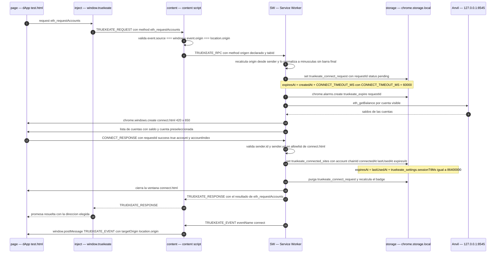

### Figura 3 — `eth_accounts` con sesión vigente y con sesión vencida (CU-18 y CU-18/A2, deslinde con CU-20)

Sin abrir ninguna ventana en ninguno de los dos caminos: la sesión vigente resuelve con la cuenta compartida y refresca `lastUsedAt`; la vencida se elimina y resuelve `[]`, obligando a pasar otra vez por CU-17. Un origen que **nunca** se conectó es el escenario de CU-20.

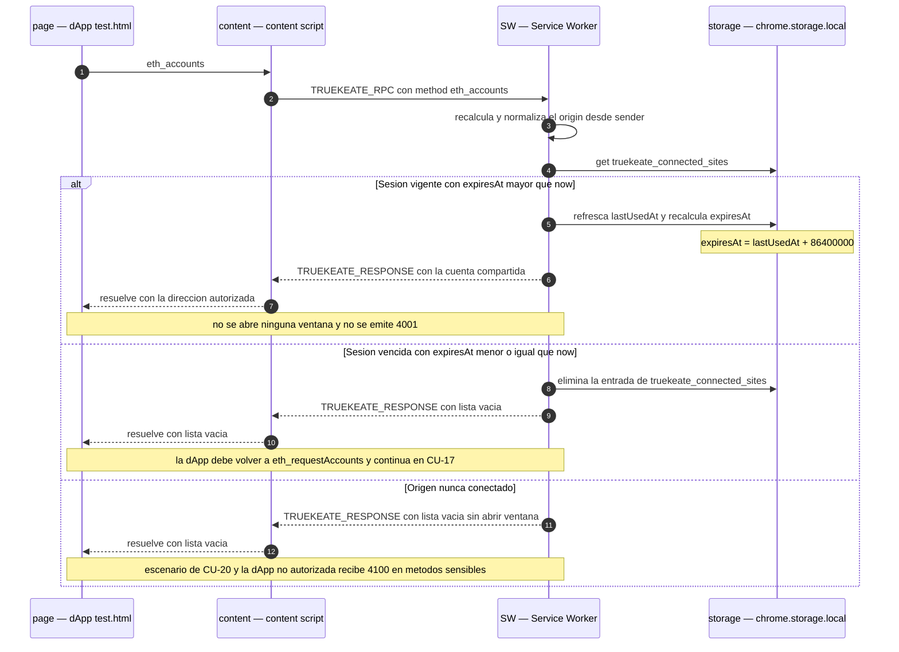

### Figura 4 — Envío de transacción de punta a punta (CU-11 con CU-13 y CU-16)

Solicitud → `PendingRequest` persistido → puerto de larga vida → `notification.html` → aprobación → firma en el SW → `eth_sendTransaction` → hash devuelto. El nonce se recalcula con `getTransactionCount(account, 'pending')` y la transacción es EIP-1559 tipo 2 con el `chainId` activo (EIP-155).

```mermaid
sequenceDiagram
    autonumber
    participant page as page — dApp test.html
    participant content as content — content script
    participant SW as SW — Service Worker
    participant storage as storage — chrome.storage.local
    participant notif as notif — notification.html
    participant Anvil as Anvil — 127.0.0.1:8545

    page->>content: eth_sendTransaction con from to y value
    content->>SW: TRUEKEATE_RPC con method eth_sendTransaction
    SW->>SW: construye TxPreview con destino valor gasLimit y maxFeePerGas
    SW->>Anvil: eth_estimateGas y eth_getBalance y eth_getTransactionCount
    Anvil-->>SW: gas y saldo y nonce informativo
    SW->>SW: genera approvalId uuid v4 y persiste con status pending bajo rmwLock
    SW->>storage: set truekeate_pending_requests approvalId status pending
    Note over storage: expiresAt = createdAt + SIGN_TIMEOUT_MS con SIGN_TIMEOUT_MS = 120000
    content->>SW: connect name truekeate_approval
    Note over content,SW: tras 30 s sin actividad, RESUME con el mismo approvalId responde en < 200 ms (el puerto NO mantiene vivo el SW)
    SW->>SW: encola la firma en fifoByAccount y abre la ventana unica global de confirmacion (cola y contador, P-21)
    SW->>notif: chrome.windows.create focused true y type popup 420 x 640
    SW->>Anvil: eth_getBalance de la cuenta visible
    notif->>SW: SIGN_RESPONSE con approvalId success true
    SW->>SW: valida que la entrada sigue pending y no vencida
    SW->>Anvil: eth_getTransactionCount account pending y eth_gasPrice y eth_getFeeData
    Anvil-->>SW: nonce definitivo y feeData
    SW->>SW: firma EIP-1559 tipo 2 con chainId activo 0x7a69
    SW->>Anvil: eth_sendRawTransaction con la transaccion firmada
    Anvil-->>SW: hash 0x mas 64 hex
    SW->>storage: purga la entrada de truekeate_pending_requests y recalcula el badge
    SW->>notif: cierra notification.html
    SW->>storage: append truekeate_logs event tx_sent con txStatus pending
    SW-->>content: TRUEKEATE_RESPONSE con el hash
    content-->>page: eth_sendTransaction resuelve el hash
    SW->>Anvil: eth_getTransactionReceipt hash
    Anvil-->>SW: recibo con status 0x1
    SW->>storage: append truekeate_logs event tx_confirmed con el mismo hash
```

### Figura 5 — Expiración del plazo (CU-15, con CU-15/E2)

`chrome.alarms` despierta al SW aunque esté dormido, marca la entrada `expired` con `resolvedAt` y `errorCode: 4001`, cierra `notification.html`, purga el badge y entrega `4001` a la página por puerto vivo o por `chrome.tabs.sendMessage`. El reloj está **anclado a `createdAt`** y el SW es su dueño único; la capa inject solo tiene un margen de seguridad de `SIGN_TIMEOUT_MS + 5000`.

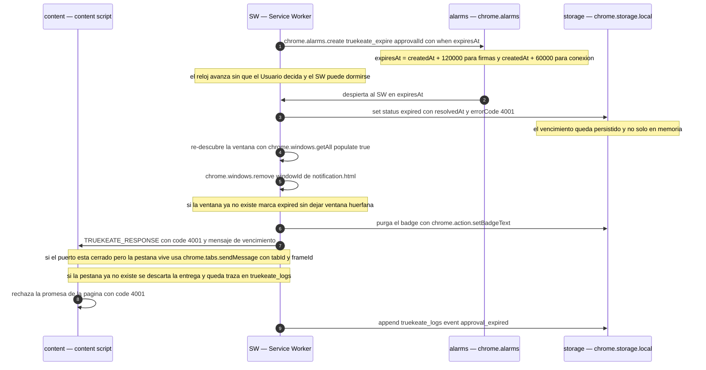

### Figura 6 — Service Worker dormido y reconexión (X-03, CU-16/E3 y CU-08)

Caída del puerto `truekeate_approval` → reconexión con backoff **1 s, 2 s, 4 s, 8 s, 16 s, máx. 30 s** → `RESUME` con el **mismo `approvalId`** → el SW contesta desde la entrada persistida (o `4001` si ya no está `pending`) sin crear entradas nuevas.

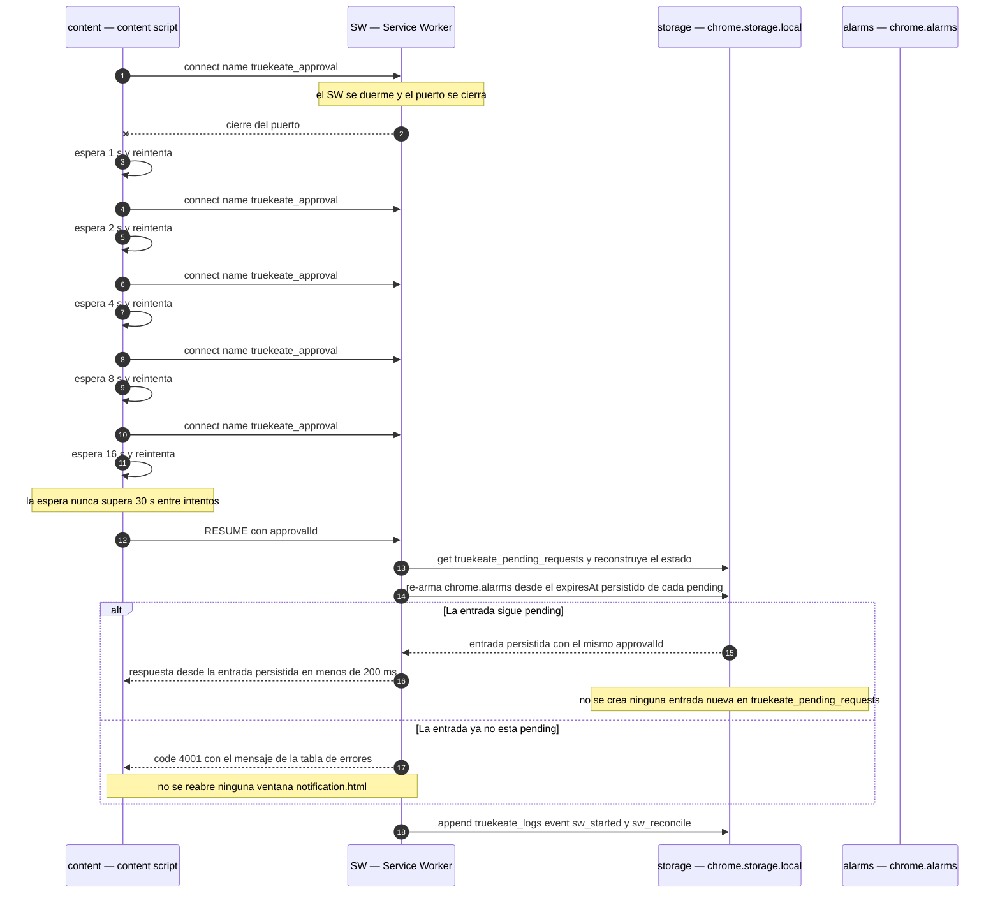

### Figura 7 — Dos transacciones simultáneas de la misma cuenta (CU-16 y CU-16/A2)

Cola **FIFO por cuenta** (`fifoByAccount`) con **como máximo una transacción en vuelo por `from`** y recálculo del `nonce` al aprobar cada una con `getTransactionCount(account, 'pending')`. La segunda solicitud espera; **no** se rechaza (el rechazo por cardinalidad es para el mismo origen: máximo 1 `pending` por origen, 8 globales, 6 por minuto y origen).

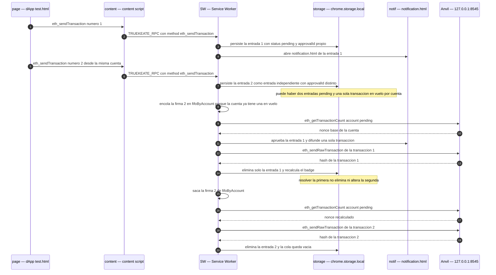

### Figura 8 — Rechazo del usuario, firma EIP-712 y `personal_sign` (CU-14/A1, CU-27 y CU-28)

Tres caminos de la ventana de decisión: rechazo explícito (`4001`), firma de datos tipados con vista de `domain`, `types` y `message`, y firma de texto plano con aviso de «contenido no legible» si el payload hexadecimal no es UTF-8.

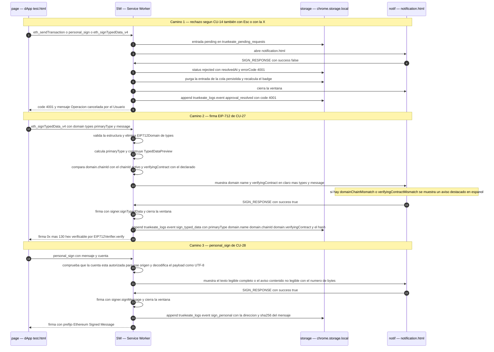

### Figura 9 — dApp hostil (CU-21, con CU-20 y CU-25)

`eth_sign` responde `4200` **sin abrir ventana**, la red con RPC no `https` fuera de local se rechaza con error tipado y sin pedir permiso de host, el `postMessage` saliente usa `targetOrigin = location.origin` (nunca `'*'`) y `setAccessLevel('TRUSTED_CONTEXTS')` impide que un content script —o un iframe hostil— lea `chrome.storage.local`.

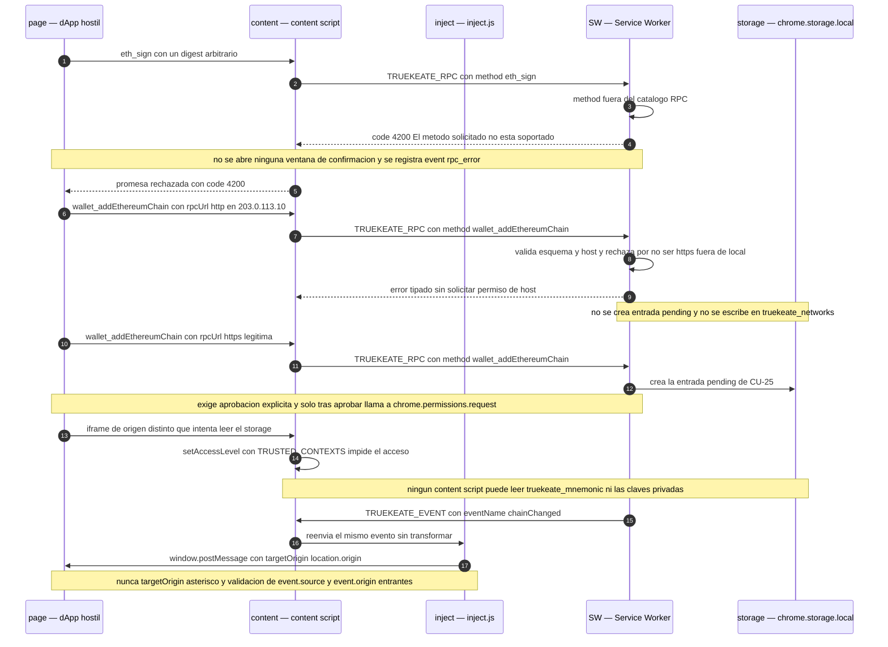

### Figura 10 — Origen sin sesión: `eth_accounts` vacío y `4100` en métodos sensibles (CU-20)

Complementa la Figura 3 con el lado negativo del mismo camino: un origen que nunca pasó por `eth_requestAccounts` recibe `[]` sin abrir ventana y `4100` en cualquier método sensible, sin crear ninguna entrada en la cola.

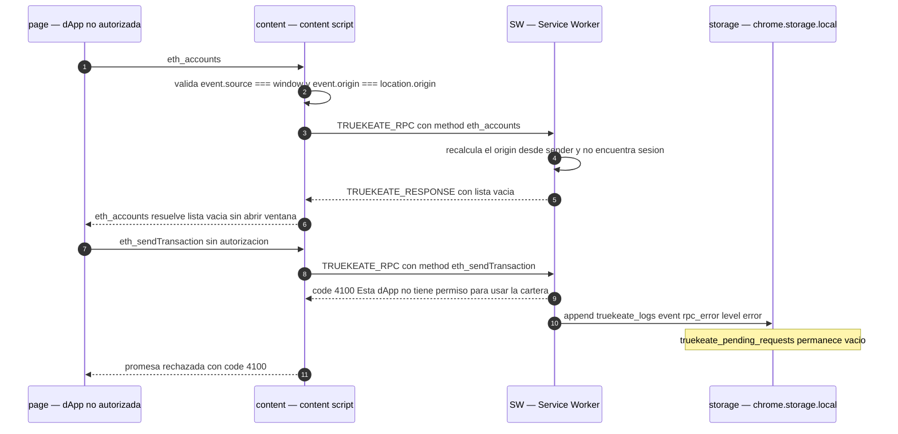

---

## 3. Diagrama de estados del ciclo de aprobación (`PendingRequest`)

**Figura 11 — Ciclo de vida de una entrada de `truekeate_pending_requests`.** Los cuatro estados son los del campo `status` del diccionario: `pending`, `approved`, `rejected` y `expired`. «Solo `pending` bloquea la cola» y solo `pending` cuenta para el badge, que es un índice derivado y no se persiste. Las entradas resueltas se **purgan**: el SW no conserva historial de solicitudes resueltas.

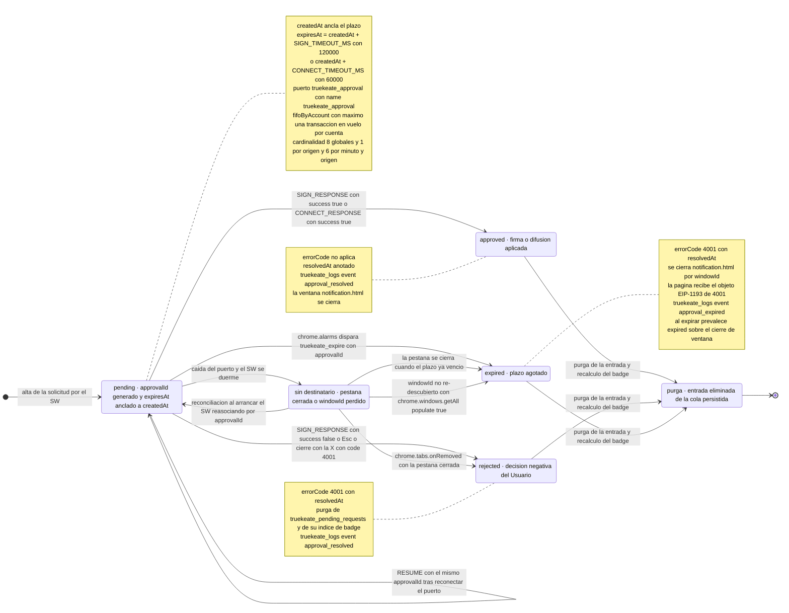

---

## 4. Diagrama de arquitectura de componentes (contexto)

**Figura 12 — Los cuatro contextos, el almacenamiento y los canales de mensajería.** Se distinguen los dos canales (`window.postMessage` página ↔ content script y `chrome.runtime` content o UI ↔ SW), el puerto de larga vida `truekeate_approval`, que **no mantiene vivo** el SW (se suspende a los ~30 s): transporta y correlaciona, y la verdad vive en `chrome.storage.local` y `chrome.alarms` y `chrome.storage.local` como única fuente de verdad, con `setAccessLevel('TRUSTED_CONTEXTS')`.

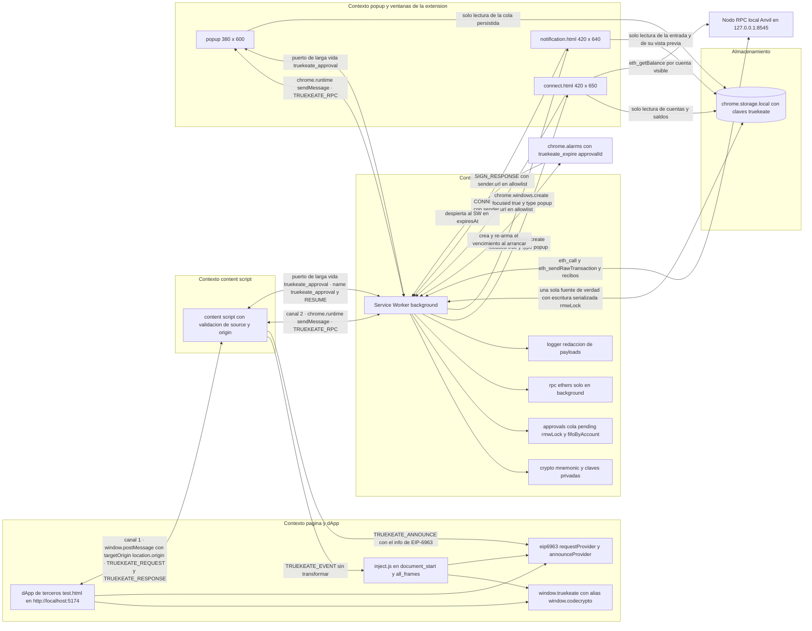

---

## 5. Índice de diagramas y trazabilidad

| # | Diagrama | Tipo Mermaid | CU que ilustra | RF / RNF / RT / RE |
|---|---|---|---|---|
| Figura 1 | Actores, casos de uso y relaciones | `flowchart` | CU-01 … CU-36 (los 36) | RF-01 … RF-50 · RNF-01 · RT-13 |
| Figura 2 | Conexión de una dApp con selección de cuenta | `sequenceDiagram` | CU-17 (con CU-15 y CU-16) | RF-16, RF-36, RF-17, RF-40 · RNF-05, RNF-08, RNF-10 · RT-13 |
| Figura 3 | `eth_accounts` con sesión vigente y vencida | `sequenceDiagram` | CU-18, CU-18/A2, CU-20 (deslinde) | RF-25, RF-17, RF-10 · RNF-08, RNF-11 · RE-04 |
| Figura 4 | Envío de transacción de punta a punta | `sequenceDiagram` | CU-11, CU-13, CU-16 | RF-08, RF-19, RF-35, RF-41, RF-42, RF-43 · RNF-05, RNF-12, RNF-25 |
| Figura 5 | Expiración del plazo de 120 s y de 60 s | `sequenceDiagram` | CU-15, CU-15/E2 | RF-40 · RNF-06, RNF-08 · RT-06 |
| Figura 6 | Service Worker dormido y reconexión con `RESUME` | `sequenceDiagram` | CU-16/E3, CU-08, CU-15/A2 | RF-41, RF-40, RF-09, RF-10, RF-17 · RNF-08 · RE-04 |
| Figura 7 | Dos transacciones simultáneas de la misma cuenta | `sequenceDiagram` | CU-16, CU-16/A2 | RF-37, RF-38, RF-39 · RNF-08 |
| Figura 8 | Rechazo del usuario, firma EIP-712 y `personal_sign` | `sequenceDiagram` | CU-14, CU-27, CU-28 | RF-35, RF-41, RF-14, RF-20, RF-21 · RNF-06, RNF-09, RNF-12, RNF-25 · RT-02, RT-11 |
| Figura 9 | dApp hostil: `eth_sign`, RPC no `https` y `targetOrigin` | `sequenceDiagram` | CU-21, CU-25, CU-20 | RF-14, RF-23 · RNF-09, RNF-10, RNF-12 · RT-03, RT-04, RT-13 |
| Figura 10 | Origen sin sesión: `[]` y `4100` | `sequenceDiagram` | CU-20, CU-20/E2 y CU-20/E3 | RF-17, RF-14 · RNF-10, RNF-11 · RT-13 |
| Figura 11 | Ciclo de vida del `PendingRequest` | `stateDiagram-v2` | CU-13, CU-14, CU-15, CU-16, CU-17 | RF-35, RF-37, RF-40, RF-41 · RNF-06, RNF-08 |
| Figura 12 | Arquitectura de componentes y contextos | `flowchart` | CU-08, CU-11, CU-13, CU-17, CU-18, CU-19, CU-22, CU-29, CU-31 | RF-13, RF-17, RF-25, RF-28, RF-44, RF-45 · RNF-10, RNF-11, RNF-14, RNF-16, RNF-20 · RT-04, RT-13 |

**Totales:** **12 diagramas** · 8 `sequenceDiagram` · 2 `flowchart` · 1 `stateDiagram-v2` · (la Figura 1 es el `flowchart` de casos de uso y la Figura 12 el de arquitectura).

**Mensajes del protocolo representados** (nombres literales del diccionario §4.1 y §4.2): `TRUEKEATE_REQUEST`, `TRUEKEATE_RESPONSE`, `TRUEKEATE_EVENT` y `TRUEKEATE_ANNOUNCE` (Figura 12, como contrato EIP-6963), `TRUEKEATE_RPC`, `SIGN_RESPONSE`, `CONNECT_RESPONSE` y `RESUME`.

**Códigos EIP-1193 dibujados:** `4001` (CU-13/A1, CU-14, CU-15 y CU-16), `4100` (CU-20) y `4200` (CU-21 y CU-28/A2). **Citados en el corpus y fuera de estas figuras:** `4900` (CU-31), `4901` (CU-24/A3), `-32602` (CU-32), `-32000` (CU-11/E1 y CU-11/E2) y `-32603` (CU-16/E4 y CU-30/E1), sin flujo propio en los diagramas críticos seleccionados.

---

## 6. Cómo renderizar estos diagramas

**Visores compatibles**

- **GitLab y GitHub** renderizan Mermaid de forma nativa en los archivos `.md` del repositorio: basta con abrir `RepoTecnico/casos_uso/diagramas.md` en la interfaz web.
- **VS Code** con la extensión de Mermaid (por ejemplo *Markdown Preview Mermaid Support*) o con la vista previa de Markdown integrada, si la extensión está instalada.
- **`mermaid.live`** (Mermaid Live Editor): pegar el contenido de **un solo bloque** (sin las vallas ```` ```mermaid ````) para inspeccionarlo o compartir un enlace.

**Exportación a SVG o PNG (comando opcional, no ejecutado por este documento)**

El corpus **prohíbe instalar paquetes** para generar esta documentación, así que el comando se deja escrito **sin ejecutarlo**; requiere disponer de `@mermaid-js/mermaid-cli` de forma previa y explícita:

```bash
# Requiere @mermaid-js/mermaid-cli ya instalado; NO se ejecuta desde este documento.
npx -p @mermaid-js/mermaid-cli mmdc -i RepoTecnico/casos_uso/diagramas.md -o docs/diagramas/ -e svg
```

> Extraer cada bloque a un archivo `.mmd` independiente antes de exportarlo da un SVG por figura y evita que el CLI tenga que separar los 12 bloques del mismo documento.

**Advertencias de sintaxis respetadas en este documento**

1. Cada bloque empieza con ```` ```mermaid ```` y cierra con ```` ``` ````; **un diagrama por bloque**.
2. En los `sequenceDiagram` **todos** los participantes se declaran con `participant` antes de usarse, y se usan alias cortos y sin espacios (`page`, `inject`, `content`, `SW`, `storage`, `alarms`, `notif`, `Anvil`).
3. En los `flowchart` los identificadores son simples (`CU01`, `A_Usuario`, `G1`) y las etiquetas con texto van entre corchetes, estadio o `person`; **no se usa `end` como etiqueta** y se evitan `()`, `:`, `/` y `«»` dentro de las etiquetas de nodo y de arista.
4. En el `stateDiagram-v2` los estados con espacios se declaran con `state "Nombre" as id`.
5. El diagrama de casos de uso usa `flowchart LR` con figuras básicas (`person`, `stadium`, `([...])`, `[...]`, `[(...)]`) para maximizar la compatibilidad entre versiones de Mermaid.

---

## Historial de cambios

| Versión | Fecha | Cambio |
|---|---|---|
ANCHOR_DIAGRAMAS con los 12 diagramas exigidos: casos de uso (36 CU y 8 actores), 8 secuencias de flujos críticos, estados del ciclo de aprobación, arquitectura de componentes, índice de trazabilidad e instrucciones de renderizado. Sin modificar ningún otro archivo y sin instalar paquetes. |
