# Documento Técnico — TrueKeate Wallet

> **Fase:** 3 — Desarrollo (especificación de Fase 2, corregida al implementar H1) · **Versión:** 1.5 · **Estado:** ✅ auditoría `AUDITORIA_DOCUMENTO_TECNICO_V1.md` (ADT-01..ADT-33) aplicada y **correcciones de H1** incorporadas — ver §10.4 «Historial de cambios»
> **Cambios de la v1.5 (resumen).** Correcciones descubiertas **al implementar H1** (2026-09-11; desviaciones **DEC-47..DEC-51**, `plan_desarrollo.md` §3.1.10): **(1)** §7.3 elimina `chrome-extension://*/*` de `exclude_matches` —**no es un patrón válido**: Chrome rechaza el manifest completo y la extensión no carga; `<all_urls>` no cubre ese esquema— y fija la **regla vinculante de prohibición**; **(2)** §7.5.2/§7.5.3 documentan los **3 builds encadenados** con la API programática `build()` desde `closeBundle` (ES + IIFE de `content-script` + IIFE de `inject`) porque **Vite 7 no admite exportar un array de builds** y el IIFE exige **una entrada por build**; **(3)** §5.2 fija el **tamaño explícito del `body`** de las tres ventanas con los tokens `--tk-popup/connect/notification-width/height` (con `min-height: 100vh` el popup medía **720 px**); **(4)** §7.4 y §7.2 fijan el literal **`forge test --root contracts --match-contract EIP712VerifierTest`** y advierten del **falso verde** del literal sin `--root contracts` (0 pruebas, exit 0); **(5)** §7.4.1.f pasa a **`H1..H6`** (cierre de la brecha **G-01**) y las fuentes se sincronizan con las versiones vigentes.
> **Cambios de la v1.4 (resumen).** Cierre de los **10 defectos residuales `VR-01..VR-10`** de la última pasada de consistencia: **conjunto de permisos unificado** con el diccionario (`favicon`, `clipboardRead` y `clipboardWrite`, cada uno justificado, en §7.3 y en su fragmento de manifest); **catálogo de eventos a 24** (§2.5.2 y el `erDiagram` de §4.2); **tabla de errores de §5.1 sustituida por un índice código → causa** que remite a `diccionario_datos.md` §4.3 **sin repetir literales**; **retirada definitiva** de `windowsByApprovalId` y del campo `windowId` por solicitud (§2.3, §2.5.2 y riesgo R18), sustituidos por la entidad persistida `truekeate_approval_window` (§2.14 del diccionario); **conteo de diagramas Mermaid corregido a 15** en el texto y en la comprobación de CI (ADT-02); y bloques de «Fuentes»/«Documentos del corpus» sincronizados con las versiones vigentes.
> **Cambios de la v1.3 (resumen).** Se añaden la **guarda de sesión de dApp activa** en el revelado/exportación y en el borrado de una cuenta importada (§3.8, regla 9; **R-09a/DEC-45**) y la **nueva §3.9** con las guardas y el **orden de comprobación del reset** (§3.9; **R-09b/DEC-46**): ambas se emiten como error tipado `-32000` y **citan `diccionario_datos.md` §4.3 como fuente única de los literales**. Se sincronizan las fuentes vinculantes a las versiones vigentes del corpus.
> **Cambios de la v1.1 (resumen).** Se especifican el **build/empaquetado MV3** (§7.5) y el **arnés de pruebas E2E** (§7.4), que eran los dos bloqueantes del hito H1; se añade el flujo de **revelado y exportación (RF-50)** con su política de portapapeles (§3.8); se corrigen los **3 diagramas Mermaid** que no parseaban y se añade su comprobación de CI (§7.5); se resuelven las decisiones del usuario **P-20** (portapapeles), **P-21** (una sola ventana de confirmación global) y **P-22** (`wallet_addEthereumChain` no activa la red); y se cierran las decisiones de consolidación **D-H..D-U**.
> **Producto:** **TrueKeate Wallet** — extensión de navegador Chrome/Edge **Manifest V3** (wallet Ethereum no custodial) + **dApp de pruebas** (`test.html`) sobre **Foundry Anvil** local.
> **Autores:** el equipo de proyecto (arquitecto de software senior); el rol humano de **responsable de seguridad** es el autor del proyecto (`requerimientos.md` §4.4).
> **Alcance de este documento:** especificación de **arquitectura, diseño de flujos, modelo de datos, interfaces, trazabilidad, entornos y riesgos** del sistema. **No** define requisitos: los requisitos son de `requerimientos.md` v1.9 y los casos de uso de `casos_uso/casos_uso.md` v1.5. **No** contiene el plan de desarrollo detallado (eso es `/plan_desarrollo`, Fase 3): el §9 es solo una secuencia de hitos de referencia.
> **Fuentes obligatorias leídas (estado actual del disco):**
> `RepoTecnico/requerimientos.md` **v1.9** (50 RF = 40 Must + 10 Should; 25 RNF; 13 RT; 4 RE; §2.1 catálogo de códigos y su significado; `diccionario_datos.md` §4.3 como fuente única de los literales de mensaje; §2.2 catálogo de eventos y redacción; §4.1 rúbrica; §4.5 MVP vs ciclo posterior; §9 Anexo A con `CA-RF-xx`/`CA-RT-xx`) ·
> `RepoTecnico/casos_uso/casos_uso.md` **v1.5** (36 CU, Gherkin/EARS y matriz de trazabilidad; guardas de estado en CU-06, CU-07 y CU-30) ·
> `RepoTecnico/casos_uso/diagramas.md` **v1.2** (figuras UML de los 36 CU) ·
> `RepoTecnico/diccionario_datos.md` **v1.8** (claves `truekeate_*`, entidades, protocolo `TRUEKEATE_*`, catálogo RPC, **§4.3 como fuente única de los literales de error**, guarda del revelado/borrado en §3.10 y guardas del reset en §3.11) ·
> `RepoTecnico/entornos_globales.md` **v2.0** (entorno verificado, comandos, constantes, permisos, nomenclatura y correcciones de H1) ·
> `RepoTecnico/identidad_visual.md` **v1.5** (tokens, tipografía con los ficheros reales, medidas, componentes, matriz de contraste) ·
> `RepoTecnico/estado_proyecto.md` **v2.0** (decisiones **DEC-01..DEC-51**; H1 ✅ completado) ·
> `RepoTecnico/plan_desarrollo.md` **v1.1** (H1 ✅ COMPLETADO y **§3.1.10** con las 5 desviaciones aceptadas) ·
> `RepoTecnico/INFORME_OPTIMIZACION_V1.md` (42 hallazgos **H-01..H-42**, remediados) y `RepoTecnico/casos_uso/AUDITORIA_CASOS_USO_V1.md` (30 hallazgos **ACU-01..ACU-30**, remediados).
> **Regla de no regresión:** ningún defecto ya corregido por `H-01..H-42` ni por `ACU-01..ACU-30` se reintroduce en este documento; los invariantes que los cierran están recogidos en §2.3, §2.5, §3.7, §4.3 y §7.3.
> **Convenciones:** todo en español; identificadores de código, métodos RPC, nombres de archivo y claves de storage en su **forma original**; las claves de `chrome.storage.local` se citan **siempre con el prefijo completo** `truekeate_` (ACU-25).

---

## 1. Visión general y alcance

### 1.1 Objetivo del sistema

Construir una **wallet Ethereum no custodial** distribuida como **extensión de navegador Chrome/Edge (Manifest V3)** que reproduzca las capacidades básicas de MetaMask y las haga verificables de extremo a extremo contra una **red local de Foundry (Anvil)**:

1. **Cartera**: crear/importar por frase BIP-39 (12 palabras), derivar cuentas HD BIP-32/BIP-44 (`m/44'/60'/0'/0/i`), importar cuentas por clave privada, etiquetarlas, revelar/exportar el material de recuperación y resetear el estado.
2. **Provider inyectado**: `window.truekeate` (EIP-1193) **y** el alias `window.codecrypto = window.truekeate` (el **mismo objeto**) en todas las páginas y frames, con descubrimiento EIP-6963.
3. **Operaciones**: leer (`eth_chainId`, `eth_getBalance`, `eth_blockNumber`), enviar (EIP-1559 tipo 2 con `chainId` de EIP-155), firmar (`eth_signTypedData_v4` de EIP-712 y `personal_sign`) y gestionar redes (`wallet_switchEthereumChain`, `wallet_addEthereumChain`).
4. **Aprobación humana**: ninguna operación sensible se firma en silencio; toda solicitud se decide en `notification.html` (firmas) o `connect.html` (conexión) con vista previa decodificada y avisos de riesgo.
5. **Observabilidad**: registro de llamadas, eventos, errores y operaciones con política de redacción, persistente y gestionado por el Service Worker.
6. **dApp de pruebas**: `test.html` ejercita los siete flujos (detectar, conectar, saldo, enviar, EIP-712, cambiar red, eventos).

La criptografía y el RPC viven **exclusivamente en el Service Worker**; React es **solo UI** (DEC-04, RNF-14). No hay backend propio: la comunicación es dApp ↔ extensión ↔ nodo RPC (RE-01) y el despliegue es **100 % local** (DEC-13, RT-09).

### 1.2 Alcance del MVP (40 RF Must) y del ciclo posterior (10 RF Should)

**MVP comprometido — 40 RF Must** (`requerimientos.md` §4.5, DEC-26; **no depende del badge**, DEC-27):

| Bloque | RF Must |
|---|---|
| Core Wallet | RF-01, RF-02, RF-03, RF-04, RF-05, RF-07, RF-08, RF-09, RF-10, RF-11, **RF-50** |
| Provider y operaciones blockchain | RF-13 .. RF-26 (14 RF, todos Must) |
| UX, logging y observabilidad | RF-27, RF-28, RF-29, RF-30, RF-31, RF-33 |
| Páginas y ciclo de aprobación | RF-35, RF-36, RF-37, RF-41 |
| Estándares EIP | RF-42, RF-43, RF-45 |
| dApp de pruebas | RF-46 |
| Identidad visual | RF-49 |

**Ciclo posterior — 10 RF Should**: RF-06, RF-12, RF-32, RF-34, **RF-38**, **RF-39**, RF-40, RF-44, RF-47, RF-48. Se especifican arquitectónicamente desde ahora (sus módulos existen en §2.4 y su diseño está en §3, §5 y §6.3), pero **no** forman parte del compromiso de entrega y son el primer recorte si se agota el presupuesto.

> **Deslinde crítico (P-17/DEC-27):** **RF-40 (timeout)** está en el ciclo posterior, pero el **mecanismo** de vencimiento (`chrome.alarms` + `expiresAt` anclado a `createdAt` + SW dueño único del plazo + cierre de ventana + `4001`) es **estructural**: sin él, RF-37 y RF-41 (Must) no son correctos ante la suspensión del Service Worker. Por eso el diseño de §2.3 y §3.1 lo incluye **completo** desde el MVP, aunque su `CA-RF-40` se valide en el ciclo posterior. Los oráculos del MVP de la cola son RF-37/RF-41 y RNF-08: «**2 entradas `pending` en `truekeate_pending_requests` + máximo 1 transacción en vuelo por cuenta**».

**Cobertura de requisitos del MVP (recontada contra §6.1 y §6.2, ADT-04):** 40/40 RF Must asignados a un módulo «principal» (§6.2) · **25/25 RNF** · **13/13 RT** · **4/4 RE**. Las filas que faltaban —**RNF-01, RNF-17, RNF-24, RT-01, RT-07, RE-02 y RE-03**— están incorporadas en §6.1, de modo que la afirmación queda respaldada por la matriz y no por un conteo declarativo.

> **Dos requisitos no tienen módulo, y es correcto (ADT-04 / ADT-33).** **RE-02** (riesgo aceptado del modo sin cifrado) y **RE-03** (sin `push` sin orden explícita) son **restricciones de proceso no observables en runtime**: se verifican por inspección de la configuración y del historial de comandos, no por código. Se registran en §6.1 con el módulo a `—` y su criterio de verificación explícito.

### 1.3 Fuera de alcance y excepciones

Se declaran **excluidas** (con la justificación ya fijada en `requerimientos.md` §2.5; no hay requisito sustituto):

| Exclusión | Motivo | Referencia |
|---|---|---|
| Cifrado de la semilla con PBKDF2 + contraseña | Modo desarrollo sin contraseña; riesgo **aceptado** y declarado | P-03, RE-02, DEC-08, D-07 |
| Auto-lock por inactividad | Sin contraseña no hay estado que bloquear | P-03 |
| Rate limiting por origen (como control de producción) | Se acota con la cardinalidad de la cola (8 globales / 1 por origen / 6 por minuto) **y con el *token bucket* por origen extendido a todo el catálogo RPC** (§2.3, D-Q/ADT-24) | `TAREA_PARA_ESTUDIANTE.md:2622` |
| Detección de phishing avanzada | Se cubre el mínimo verificable: origen **visible siempre** en `notification.html` (RF-35) + aviso de `domainChainMismatch` (RF-20) + **una sola ventana de confirmación global** (P-21) | H-35, H-40 |
| CSP explícita | MV3 impone por defecto una CSP sin `unsafe-eval` | H-26 |
| Auditoría externa / pentest | **No prevista** en este alcance; se compensa con evidencia reproducible | H-28, `requerimientos.md` §4.4 |
| Publicación en tiendas | Entrega local como carpeta `dist/` + dApp servida en `http://localhost:5174` | RT-09 |
| Sepolia o cualquier red pública | P-02/DEC-07: **Anvil es la única red por defecto**; las demás se dan de alta en runtime | RT-06 |
| Backend / GCP | 100 % local | RE-01, DEC-13 |
| Reutilización del código del remoto `codecrypto` | Reconstrucción desde cero | P-10/DEC-09 |
| `eth_sign` | **Retirado del catálogo**: responde `4200` | DEC-22, H-11a |
| Cifrado del portapapeles o bloqueo de la copia de la semilla | **P-20: la copia se permite**; lo que se garantiza es el **borrado del portapapeles al ocultarse** el valor (temporizador de 30 s o pérdida de foco). Ver §3.8 | P-20, ADT-09 |
| Protección frente a capturas de pantalla o grabación | Fuera de control de la extensión: se declara como amenaza (§3.7) y se mitiga con **aviso in-product** durante el revelado | ADT-26 |

**Avisos in-product obligatorios (RNF-23), que no son exclusiones:** «entorno de desarrollo — no usar con fondos reales» en el primer arranque, en «Acerca de» y antes de la primera firma (aceptación registrada en `truekeate_settings`) + advertencia al dar de alta una red no marcada `isTestnet`.

### 1.4 Supuestos y dependencias

| # | Supuesto / dependencia | Impacto si no se cumple |
|---|---|---|
| A1 | Existe una red **Anvil** en `127.0.0.1:8545`, chainId `31337` (`0x7a69`), con CORS de allowlist (RE-04) | `4900` y UI «desconectado»; la suite E2E **no se ejecuta** (se marca *no verificada*, nunca satisfactoria) |
| A2 | Chrome/Edge **≥ 114** con MV3 y `chrome.alarms` | RNF-04 incumplido; el vencimiento del plazo no es fiable |
| A3 | Foundry (`anvil`/`forge`/`cast`) dentro de `>=1.0.0 <2.0.0` (verificado: `1.7.2-dev`) | `forge test` y los E2E quedan fuera de garantía |
| A4 | Node `v24.16.0` y npm `11.13.0`; `package-lock.json` versionado | «Build limpio» no reproducible |
| A5 | `ethers.js v6` (`~6.15.0`) es la **única** librería criptográfica y se empaqueta localmente (sin CDN) | RT-02/RT-05/RNF-20 incumplidos |
| A6 | El Service Worker **puede dormirse en cualquier momento** | Es el supuesto que gobierna todo el diseño de §2.3 |
| A7 | La dApp de pruebas se sirve en `http://localhost:5174` con `strictPort: true` | La clave de sesión por origen cambiaría y rompería RF-25/RF-26 |
| A8 | El usuario mantiene el modo desarrollo (sin contraseña) y acepta el riesgo P-03 | Riesgo aceptado; `truekeate_vault` **no se crea** |

---

## 2. Arquitectura

### 2.1 Vista de contexto

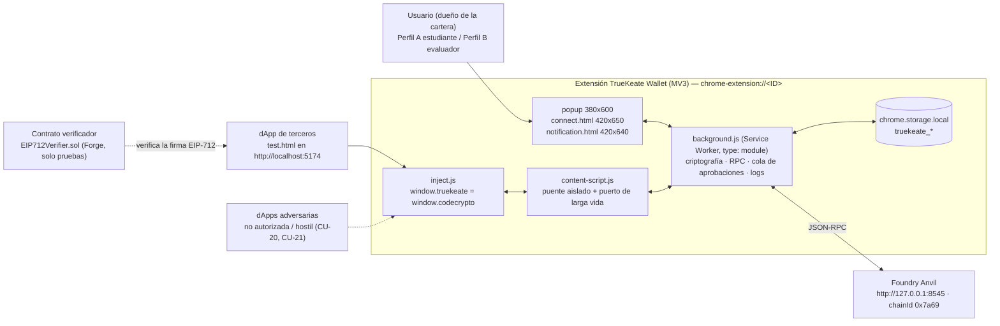

**Lectura del contexto.** El sistema tiene **dos fronteras de confianza**: (a) la frontera **dApp ↔ extensión**, donde la página es **no fiable** y solo se le entregan firmas, hashes y cuentas **autorizadas** (nunca claves ni mnemonic); y (b) la frontera **extensión ↔ nodo RPC**, donde Anvil es un sistema externo que puede estar caído (`4900`). Los accesos adversarios (dApp no autorizada, dApp hostil, iframe de origen distinto) están modelados como actores propios en CU-20 y CU-21 y se tratan en §3.7.

### 2.2 Vista de componentes y responsabilidades

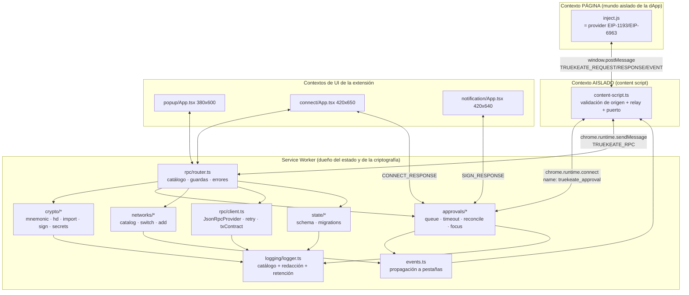

| Componente | Responsabilidad única | No hace nunca |
|---|---|---|
| `inject.js` (provider) | Publicar `window.truekeate` + alias `window.codecrypto`; implementar `request`/`on`/`removeListener`; anunciar EIP-6963 | No accede a `chrome.*`, no lee storage, no firma |
| `content-script.js` | Validar `event.source`/`event.origin`, reenviar a la vez mensajes y eventos, mantener el **puerto de larga vida** | No interpreta parámetros, no decide permisos, no persiste |
| Service Worker | Custodiar el material criptográfico, ejecutar el RPC, **poseer la cola de aprobaciones y el plazo**, reconciliar al arrancar, escribir **siempre** el log | No renderiza UI |
| `notification.html` | **Solo decide**: mostrar origen/favicon, resumen, calldata decodificado y avisos; aprobar o rechazar | No firma, no difunde, no escribe la cola |
| `connect.html` | Elegir la cuenta a compartir, mostrando origen y saldos | No firma, no cambia de red |
| `popup` (380×600) | Cartera, cuentas, envío, recepción, redes, sitios conectados, registro de actividad | No implementa criptografía (cero `ethers` en UI, RNF-14) |

### 2.3 Modelo de ejecución MV3 (ciclo de vida del Service Worker, puerto de larga vida, `chrome.alarms`, reconciliación)

El Service Worker MV3 **se suspende** y pierde todo su estado en memoria: no hay `Map` de promesas en vuelo, no hay `setTimeout` fiable y no hay `localStorage`. El diseño cierra ese problema con **cuatro piezas**: correlación persistida por `approvalId`, un **puerto de larga vida**, `chrome.alarms` como disparador del plazo y **reconciliación al arrancar**.

> **Corrección de una creencia errónea (ADT-15/R16).** El **puerto de larga vida NO mantiene vivo el Service Worker**: en MV3 el SW se termina por inactividad a los **~30 s** y el puerto se cierra con él. El puerto **transporta y correlaciona** (`RESUME { approvalId }`); la **persistencia de la verdad** la garantizan `chrome.storage.local`, `chrome.alarms` y la reconciliación al arrancar. Cualquier diseño que dependa del puerto para «seguir vivo» queda **prohibido**.

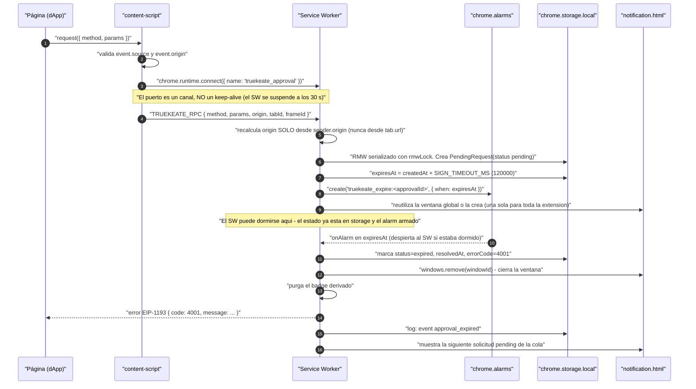

**Invariantes del modelo de ejecución** (cada uno cierra un hallazgo ya remediado; los marcados **ADT/P/D** cierran hallazgos de `AUDITORIA_DOCUMENTO_TECNICO_V1.md`):

| Invariante | Regla exacta | Cierra |
|---|---|---|
| Correlación persistida | La cola es `truekeate_pending_requests` = `Record<approvalId, PendingRequest>`; **no existe** ningún `Map` de promesas en memoria ni la frase «si la promesa original ya no existe, la solicitud se resuelve con `4001`» | H-02 |
| Escritura serializada | Todo read-modify-write de la cola pasa por `rmwLock` (una promesa encadenada); dos solicitudes simultáneas **no** se sobrescriben | H-02, H-08 |
| Dueño único del plazo | **Solo el SW** computa `expiresAt = createdAt + SIGN_TIMEOUT_MS` (120 000 ms) para firmas y `createdAt + CONNECT_TIMEOUT_MS` (60 000 ms) para conexión, **anclado a `createdAt`** y no al instante de abrir la ventana | H-07 |
| Disparador del plazo | `chrome.alarms.create('truekeate_expire:<approvalId>', { when: expiresAt })`. **Prohibido** `setTimeout` (no sobrevive a la suspensión) y **prohibido** `setInterval` en el SW | H-02, H-07, H-21 |
| Capa inject/content sin reloj propio | Es solo **red de seguridad con margen superior** (`SIGN_TIMEOUT_MS + 5000` = 125 000 ms) y **delega siempre en el `approvalId`**; el snippet de 30 s del material heredado **no es normativo** | H-07 |
| Efecto del vencimiento | Al expirar: el SW **cierra** `notification.html` (`chrome.windows.remove(windowId)`, con re-descubrimiento por URL si el `windowId` se perdió), marca `expired` con `resolvedAt` y `errorCode: 4001`, **purga el badge** y entrega a la página un objeto **EIP-1193** `{ code: 4001 }` en español | H-02, H-07 |
| Puerto de larga vida | `chrome.runtime.connect({ name: 'truekeate_approval' })`; ante desconexión, reconexión con backoff **1 s, 2 s, 4 s, 8 s, 16 s, máx. 30 s** y mensaje `RESUME { approvalId }`; el SW contesta desde el registro persistido o con `4001` si la entrada ya no está `pending`. **El puerto es un canal de transporte, no un *keep-alive***: **no** impide que el navegador suspenda el SW a los ~30 s sin actividad | H-02, ACU-08, **ADT-15/R16** |
| Origen solo desde `sender` | El `origin` se deriva **exclusivamente** de `sender.origin` (normalizado). Si `sender.frameId !== 0` **queda prohibido** caer a `sender.tab.url`, porque en un iframe cross-origin `sender.tab.url` es el origen del **top** y un iframe hostil heredaría la sesión del anfitrión (D-J) | **ADT-07/D-J** |
| Reconciliación al arrancar | En cada arranque el SW: aplica `setAccessLevel`, **purga** entradas con `status !== 'pending'` o `expiresAt <= now`, **responde `4001` a las huérfanas**, **rearma** los `alarms` de las que siguen `pending` desde su `expiresAt` persistido y escribe **1 entrada** `sw_reconcile`. Reconstruye además la marca persistida de «tx en vuelo» por cuenta y la ventana de tasa por origen (D-R). Cota: **< 1 s** con 50 pendientes y reloj inyectado (RNF-08) | H-02, ACU-21, **ADT-23/D-R** |
| Estado volátil admisible | Solo índices de transporte **reconstruibles**: `portsByApprovalId`, `expiryAlarms`, `rmwLock`. Ninguno es fuente de verdad; el estado de la **ventana única** no vive en memoria, sino **persistido** en la clave `truekeate_approval_window` (§2.14 del diccionario, ADT-22/P-21), y la reconciliación lo contrasta con `chrome.windows.getAll({ populate: true })`. La cola FIFO por cuenta y la ventana de tasa **dejan de ser volátiles**: su marca se persiste (D-R) | H-02, **ADT-23/D-R** |
| Serialización por cuenta | **Máximo 1 transacción en vuelo por `from`**, garantizado por la marca persistida `truekeate_inflight_tx` (`Record<Address, { approvalId: string; txHash?: Hex; startedAt: number }>`) que la reconciliación reconstruye; el `nonce` definitivo se recalcula al aprobar con `getTransactionCount(account, 'pending')` junto con `getFeeData()`; `nonceInformativo` es solo informativo | H-10, **ADT-23/D-R** |
| Cardinalidad y tasa | `pendingRequestsMax = 8` globales, `pendingRequestsMaxPerOrigin = 1`, `pendingRequestsPerMinute = 6`. Al exceder: `4001` **inmediato**, sin persistir, sin abrir ventana y sin contar para el badge | H-18, X-08 |
| *Token bucket* de todo el catálogo | El limitador de tasa por origen (**6 solicitudes por ventana de 60 s**) se aplica a **todo** el catálogo RPC, no solo a los métodos aprobables: también `eth_getBalance`, `eth_estimateGas`, `eth_blockNumber`, `eth_chainId`, `eth_gasPrice`, `eth_feeHistory`, `eth_getTransactionByHash` y `eth_getTransactionReceipt`. La ventana se persiste en `truekeate_rate_windows` (`Record<origin, number[]>` con las marcas `ts` de la ventana vigente) y **sobrevive a la suspensión**; al exceder, `4001` con el mensaje de tasa y **sin abrir ventana** | **ADT-24/D-Q** |
| Ventana de confirmación global | Existe **una sola** `notification.html` para toda la extensión (P-21). La solicitud «en curso» es la que ocupa la ventana; las demás permanecen `pending` en la cola y el **contador de pendientes es visible**. Al resolverse una, el SW **muestra la siguiente en la misma ventana**; si no queda ninguna, la cierra. Queda **prohibida** la concurrencia de dos `notification.html` | **P-21/ADT-22** |
| Estado de la ventana recargado | Recargar `notification.html` **no** pierde la solicitud: la ventana se re-renderiza desde las entradas persistidas (la `pending` de menor `createdAt` es la «en curso»); si ya no está `pending`, muestra el estado resuelto y se cierra | **P-3.8 (promovida a invariante)** |
| Cierre por ventana o pestaña | Cerrar `notification.html` con la X equivale a **rechazo** (`4001`) de la solicitud en curso, salvo que el plazo ya haya vencido, en cuyo caso prevalece `expired`; a continuación se muestra la siguiente pendiente. `chrome.tabs.onRemoved` marca `rejected`/`expired` y purga el badge | H-02, X-02, X-09, **P-21** |
| Respuesta duplicada | El SW ignora cualquier segunda respuesta sobre una entrada que ya no está `pending` (nunca difunde dos veces) | X-06 |

**Ciclo de vida del Service Worker** (máquina de estados del arranque y la suspensión):

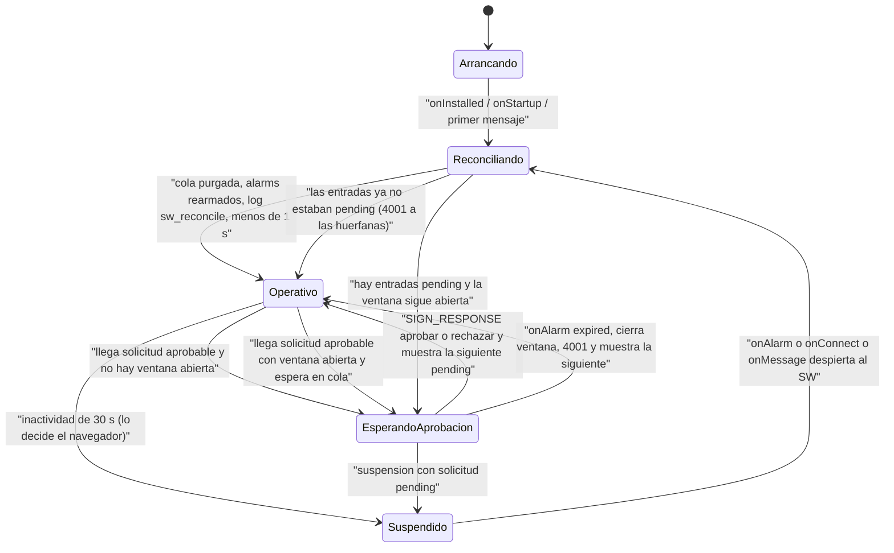

### 2.4 Estructura de carpetas y módulos propuesta (con la responsabilidad de cada archivo)

Árbol de `src/` **propuesto para la Fase 3** (no existe todavía código: `entornos_globales.md` §1 declara `src/` «a crear en Fase 3» y DEC-09 prohíbe reutilizar el del remoto):

```
src/
├── index.html                        # P1  Pagina del popup (380x600): entrada de Vite -> dist/index.html
├── connect.html                      # P2  Pagina de conexion (420x650) -> dist/connect.html
├── notification.html                 # P3  Pagina de decision (420x640) -> dist/notification.html
├── manifest.ts                       # M1  Manifest MV3 generado (RT-05): manifest_version, name, version,
│                                     #     key (ID estable), icons, action.default_popup, minimum_chrome_version,
│                                     #     permissions, optional_permissions, host_permissions, optional_host_permissions,
│                                     #     content_scripts (con exclude_matches) y web_accessible_resources (con use_dynamic_url)
├── background.ts                     # M2  Punto de entrada del SW: onInstalled/onStartup, guardas de mensaje,
│                                     #     cableado de router y aprobaciones, propagación de eventos
├── background/
│   ├── rpc/
│   │   ├── router.ts                 # M3  handleRPCRequest: catálogo RPC, guardas de sender, contexto permitido
│   │   ├── catalog.ts                # M4  Catálogo cerrado de métodos + enum method de la cola + parámetros válidos
│   │   ├── client.ts                 # M5  JsonRpcProvider único, feeData, nonce, estimateGas, recibo con reintentos
│   │   ├── errors.ts                 # M6  Catálogo de códigos de §2.1 + literales de §4.3 de diccionario_datos → objetos EIP-1193 con code
│   │   └── txContract.ts             # M7  Contrato observable de la transacción: pending → confirmed/failed/reverted
│   ├── crypto/
│   │   ├── mnemonic.ts               # M8  BIP-39: generación (fromEntropy 128 bits), normalización, checksum
│   │   ├── hd.ts                     # M9  Derivación BIP-32/44 m/44'/60'/0'/0/i y alta de cuenta nueva
│   │   ├── importAccount.ts          # M10 Importación por clave privada + computeAddress + checksum EIP-55
│   │   ├── sign.ts                   # M11 Firma EIP-1559/EIP-155, EIP-712 y personal_sign (única vía de firma)
│   │   ├── secrets.ts                # M12 Revelado/exportacion de semilla y claves a contextos de la extension:
│   │   │                             #     REVEAL_HIDE_MS = 30000, ocultado por temporizador y por perdida de foco,
│   │   │                             #     borrado del portapapeles al ocultar (P-20/ADT-06, seccion 3.8)
│   │   └── integrity.ts              # M13 Integridad al arrancar: checksum BIP-39 y EIP-55 → «wallet dañada»
│   ├── approvals/
│   │   ├── queue.ts                  # M14 Cola Record<approvalId, PendingRequest>: RMW con rmwLock, cardinalidad, tasa
│   │   ├── timeout.ts                # M15 chrome.alarms: armado, rearme y vencimiento (SW dueno unico del plazo).
│   │   │                             #     ADT-28: ESTE arbol SUSTITUYE la ruta heredada src/background/approvals.ts de
│   │   │                             #     entornos_globales.md seccion 3; las constantes viven en M57 (shared/constants.ts)
│   │   ├── reconcile.ts              # M16 Reconciliación al arrancar: purga, 4001 a huérfanas, < 1 s, sw_reconcile
│   │   ├── ports.ts                  # M17 Puerto de larga vida truekeate_approval, reconexión con backoff, RESUME
│   │   ├── focus.ts                  # M18 Ventana de decision GLOBAL (P-21): abrir o reutilizar, cierre por windowId,
│   │   │                             #     siguiente pendiente y contador de pendientes
│   │   ├── preview.ts                # M19 Construcción del resumen: enruta TxPreview / TypedDataPreview / PersonalSignPreview
│   │   └── calldata.ts               # M66 Tabla LOCAL cerrada de selectores y decodificacion (D-K/ADT-08):
│   │                                 #     fuera de la tabla, functionName = null y aviso bloqueante; sin servicios externos
│   ├── security/
│   │   ├── senderGuard.ts            # M20 Guarda de sender.id, allowlist de rutas y de contextos + origin SOLO desde
│   │   │                             #     sender.origin; con frameId distinto de 0 responde al frame exacto (D-J/ADT-07)
│   │   ├── accessLevel.ts            # M21 setAccessLevel({ accessLevel: 'TRUSTED_CONTEXTS' }) en cada arranque
│   │   └── redaction.ts              # M22 Política de redacción de params (H-42) aplicada antes de escribir el log
│   ├── networks/
│   │   ├── catalog.ts                # M23 truekeate_networks: default Anvil, validación de chainId y de símbolo
│   │   ├── switch.ts                 # M24 wallet_switchEthereumChain: ya activa → null; distinta → aprobación (P-19)
│   │   └── addChain.ts               # M25 wallet_addEthereumChain: esquema/host, aprobación, permiso runtime siempre
│   ├── sessions.ts                   # M26 Sesiones por origen en truekeate_connected_sites + TTL 24 h renovables
│   ├── events.ts                     # M27 Propagación de accountsChanged/chainChanged/connect/disconnect/message
│   ├── accounts.ts                   # M28 Cuentas: alta/baja, visibilidad, etiquetas (accountLabels) y cuenta activa
│   ├── settings.ts                   # M29 truekeate_settings: defaults, lectura/escritura tipada, aceptación de avisos
│   ├── logging/
│   │   ├── logger.ts                 # M30 truekeate_logs: 1 entrada por evento del catálogo, escrito por el SW
│   │   ├── events.ts                 # M31 Catálogo cerrado de 24 eventos + 5 categorías + niveles
│   │   └── retention.ts              # M32 Retención FIFO por ts: logLimit 500 / logMaxPerOrigin 200
│   └── state/
│       ├── schema.ts                 # M33 Esquema y versión de las claves truekeate_* + resetWallet con exclusión de logs
│       └── migrations.ts             # M34 Migración de esquema (v1.2 → v1.4) y rechazo de claves no canónicas
├── inject/
│   ├── provider.ts                   # M35 Objeto EIP-1193 (request/on/removeListener) + PROVIDER_NAME/RDNS/PROVIDER_UUID
│   │                                 #     (UUID literal congelado, D-N/ADT-19); window.truekeate se publica con
│   │                                 #     Object.defineProperty NO configurable (D-S/ADT-26)
│   ├── eip6963.ts                    # M36 Anuncio y re-anuncio de EIP-6963 (requestProvider + DOMContentLoaded)
│   └── index.ts                      # M37 Entrada síncrona de document_start: publica truekeate y su alias codecrypto
├── content-script.ts                 # M38 Relay página ↔ extensión, validación de origen y puerto de larga vida
├── popup/
│   ├── App.tsx                       # M39 Pestañas del popup 380×600: cuentas, enviar, recibir, redes, sitios, logs
│   ├── views/AccountsView.tsx        # M40 Lista de cuentas, añadir/importar/renombrar/ocultar/eliminar
│   ├── views/ReceiveView.tsx         # M41 Recepción: dirección completa, copiar y QR local
│   ├── views/SendView.tsx            # M42 Formulario de envío (propio y entre cuentas propias) con comisión estimada
│   ├── views/NetworksView.tsx        # M43 Selector y alta de redes con permiso de host en runtime
│   ├── views/SitesView.tsx           # M44 Sitios conectados y revocación de permiso por origen
│   ├── views/LogsView.tsx            # M45 Panel del registro de actividad (solo lectura) + exportación JSON
│   ├── views/SecurityView.tsx        # M46 Revelado/exportación del material de recuperación (oculto por defecto)
│   └── hooks/useBalancePolling.ts    # M47 Polling de 5 s: un eth_getBalance por cuenta visible, con parada
├── connect/
│   ├── App.tsx                       # M48 Ventana 420×650: origen, lista de cuentas con saldo y elección
│   └── ConnectRow.tsx                # M49 Fila de cuenta seleccionable accesible por teclado
├── notification/
│   ├── App.tsx                       # M50 Ventana 420×640: decide, nunca firma; Aprobar / Rechazar (Esc = rechazar)
│   ├── TxPreviewPanel.tsx            # M51 Calldata decodificado: selector, función, parámetros y toLabel
│   ├── RiskWarnings.tsx              # M52 riskWarnings[]: allowance ilimitada, contrato no reconocido, etc.
│   ├── TypedDataPanel.tsx            # M53 EIP-712: domain, name, verifyingContract, types y message
│   └── PersonalSignPanel.tsx         # M54 personal_sign: texto UTF-8 y aviso «contenido no legible»
├── shared/
│   ├── types.ts                      # M55 Tipos de dominio compartidos (TxPreview, PendingRequest, EIP1193Provider…)
│   ├── protocol.ts                   # M56 Tipos y nombres de mensajes TRUEKEATE_* + canal y dirección de cada uno
│   ├── constants.ts                  # M57 Constantes de build (DEFAULT_CHAIN_ID, DERIVED_ACCOUNTS, SESSION_TTL_MS…)
│   ├── validation/address.ts         # M58 Validación de dirección 0x+40 hex con checksum EIP-55
│   ├── validation/mnemonic.ts        # M59 Validación BIP-39 (12 palabras y checksum) para UI y SW
│   ├── validation/amount.ts          # M60 Validación de importe (formato ETH, 4 decimales) y de saldo suficiente
│   ├── validation/privateKey.ts      # M61 Validación 0x+64 hex en el rango de secp256k1
│   ├── format.ts                     # M62 Formato: ETH a 4 decimales, 0x1234…abcd, etiquetas y textos en español
│   └── qr.ts                         # M63 Generación local del QR de la dirección (sin red, sin dependencias remotas)
└── styles/
    ├── tokens.css                    # M64 Única fuente de color, tipografía y degradados (RNF-18)
    └── base.css                      # M65 Estilos base de las tres ventanas y de la dApp
```

**Las tres paginas HTML son entradas del build (ADT-01).** `index.html` (popup, referenciada por `action.default_popup`), `connect.html` y `notification.html` viven en la **raiz de `src/`** y Vite las emite como `dist/index.html`, `dist/connect.html` y `dist/notification.html`. Todavia no existen como ficheros (Fase 3), pero su ruta y su nombre de salida quedan **congelados** aqui porque el manifest, la allowlist de rutas de la seccion 3.7, la lista de `sender.url` y la suite E2E dependen de ellos. La configuracion de Vite de la seccion 7.5 las declara como entradas y **su ausencia hace fallar el build**.

**Ficheros fuera de `src/`**: `test.html` (dApp de pruebas, servida también en `http://localhost:5174/test.html`), `vite.config.ts` (`server.port 5174`, `strictPort`; su configuracion completa esta en la seccion 7.5), `package.json` y `package-lock.json`, `tsconfig.json`, `vitest.config.ts`, `playwright.config.ts`, `eslint.config.js`, `scripts/lint-prohibited.mjs`, `scripts/check-mermaid.mjs` y `scripts/generate-icons.ps1`; `contracts/` (proyecto Foundry auxiliar **solo de pruebas**: `src/EIP712Verifier.sol`, `test/EIP712Verifier.t.sol`, `test/fixtures/eip712-signature.json`, `foundry.toml`); `public/icons/`, `public/brand/`, `public/fonts/`; y `dist/` (artefacto que se carga en `chrome://extensions`).

**Artefactos documentales de la rubrica (ADT-18).** Ademas del codigo, el repositorio entrega `README.md`, `INSTRUCCIONES.md`, `LICENSE`, `NOTICE` y `public/fonts/LICENSE-*.txt`. Su estructura, contenido minimo y responsable estan especificados en la seccion 9.2; **CU-36** (instalacion desde `dist/` y build limpio) es el caso de uso que los verifica.

**Nota de alcance del MVP en el árbol.** Los módulos de RF Should se construyen en el ciclo posterior, pero su **contrato** se fija aquí para no romper los Must: M4/M6 con `eth_sign` fuera del catálogo y la tabla de errores completa (RNF-06 es Must) · M15/M16/M17 (plazo y reconciliación: **estructurales**, §1.2) · M32 con `logLimit = 500` (el límite es parte de la observabilidad Must, RF-32 solo añade la persistencia a través del reset) · M36 (EIP-6963) · M45 con la exportación JSON · M12/M46 (RF-50 es Must) · M63 (QR: RF-07 es Must).

### 2.5 Contratos internos

#### 2.5.1 Protocolo de mensajes

Página ↔ content script (canal `window.postMessage`, con `targetOrigin = location.origin`, **nunca `'*'`**):

| Tipo | Dirección | Payload | Respuesta |
|---|---|---|---|
| `TRUEKEATE_REQUEST` | inject → content | `{ type, id, method, params }` | Se responde con `TRUEKEATE_RESPONSE` |
| `TRUEKEATE_RESPONSE` | content → inject → página | `{ type, id, result \| error }` (`error` = objeto EIP-1193 con `code`) | — |
| `TRUEKEATE_EVENT` | SW → content → inject → página (**dos saltos**, reenviado literalmente, sin transformar ni filtrar) | `{ type, eventName, data }` | Sin respuesta |
| `TRUEKEATE_ANNOUNCE` | inject → content | `{ type, info }` (objeto EIP-6963) | Sin respuesta |

Content script / popup ↔ Service Worker (canal `chrome.runtime.sendMessage` y puerto `truekeate_approval`):

| Tipo | Dirección | Payload | Guarda |
|---|---|---|---|
| `TRUEKEATE_RPC` | content / popup → SW | `{ type, method, params, origin, tabId, frameId }` | `sender.id === chrome.runtime.id`; el `origin` **se recalcula** en el SW **solo** desde `sender.origin` (D-J); con `sender.frameId !== 0` esta **prohibido** respaldarse en `sender.tab.url` y la respuesta vuelve **solo a ese frame** |
| `SIGN_RESPONSE` | `notification.html` → SW | `{ type, approvalId, success, error? }` | `sender.id` + `sender.url` en la allowlist (`notification.html`) |
| `CONNECT_RESPONSE` | `connect.html` → SW | `{ type, requestId, success, account?, accountIndex?, error? }` | `sender.id` + `sender.url` en la allowlist (`connect.html`) |
| `RESUME` | content / popup → SW (por puerto) | `{ type: 'RESUME', approvalId }` | Reconexión con backoff 1→30 s; responde desde el registro persistido o con `4001` |

Tipos TypeScript del protocolo (contrato de `src/shared/protocol.ts`, M56):

```ts
export type TruekeateMessageType =
  | 'TRUEKEATE_REQUEST' | 'TRUEKEATE_RESPONSE' | 'TRUEKEATE_EVENT' | 'TRUEKEATE_ANNOUNCE'
  | 'TRUEKEATE_RPC' | 'SIGN_RESPONSE' | 'CONNECT_RESPONSE' | 'RESUME';

// ADT-29: son **8** tipos de mensaje, no 6. La tabla de nomenclatura de entornos_globales.md seccion 10
// solo enumera 6 (los 4 de pagina y 2 internos): le faltan TRUEKEATE_ANNOUNCE y RESUME.
export const APPROVAL_PORT_NAME = 'truekeate_approval' as const;   // chrome.runtime.connect
export const EXPIRE_ALARM_PREFIX = 'truekeate_expire:' as const;   // chrome.alarms.create

export interface TruekeateRequestMessage { type: 'TRUEKEATE_REQUEST'; id: string; method: string; params?: unknown[] }
export interface TruekeateResponseMessage { type: 'TRUEKEATE_RESPONSE'; id: string; result?: unknown; error?: Eip1193Error }
export interface TruekeateEventMessage { type: 'TRUEKEATE_EVENT'; eventName: ProviderEventName; data: unknown }
export interface TruekeateRpcMessage {
  type: 'TRUEKEATE_RPC'; method: string; params?: unknown[];
  origin: string;                 // dato NO fiable: el SW lo recalcula desde sender.origin
  tabId: number | null;           // null si la solicitud nace en el popup
  frameId: number | null;         // 0 = top frame; distinto de 0 exige responder SOLO a ese frame (D-J/ADT-07)
}
export interface SignResponseMessage { type: 'SIGN_RESPONSE'; approvalId: string; success: boolean; error?: Eip1193Error }
export interface ConnectResponseMessage { type: 'CONNECT_RESPONSE'; requestId: string; success: boolean; account?: Address; accountIndex?: number; error?: Eip1193Error }
export interface ResumeMessage { type: 'RESUME'; approvalId: string }

export type ProviderEventName =
  | 'accountsChanged' | 'chainChanged' | 'connect' | 'disconnect' | 'message';
```

#### 2.5.2 Tipos TypeScript clave

> **Regla de frontera (ADT-16).** Toda peticion que cruza el limite popup ↔ SW usa una **union cerrada de metodos**: `ApprovalMethod` (los 6 aprobables) o `InternalMethod` (los 7 internos, seccion 5.1.1). Una cadena suelta `method: string` **no** es contrato valido en esa frontera: `TruekeateRpcMessage.method` se tipa como `ApprovalMethod | InternalMethod | PageMethod`, de modo que el «catalogo cerrado» es verificable **por tipos**, no solo por revision.

```ts
// Alias base (diccionario de datos §1)
export type Address = `0x${string}`;      // 0x + 40 hex (checksum EIP-55 al persistir)
export type Hex = `0x${string}`;
export type WeiString = string;           // BigInt serializado en decimal
export type ChainIdHex = `0x${string}`;
export type AccountRef = `idx:${number}` | `imp:${Address}`;

// Cola de aprobaciones: Record<approvalId, PendingRequest>
export type ApprovalMethod =
  | 'eth_sendTransaction' | 'eth_signTypedData_v4' | 'personal_sign'
  | 'wallet_switchEthereumChain' | 'wallet_addEthereumChain' | 'wallet_revokePermissions';
// NOTA: 'eth_sign' NO figura en el enum (responde 4200 antes de crear entrada) — DEC-22.

export type ApprovalStatus = 'pending' | 'approved' | 'rejected' | 'expired';

export interface PendingRequest {
  approvalId: string;                       // UUID v4; clave del mapa, nunca colisiona con requestId
  method: ApprovalMethod;
  params: unknown[];                        // persistidos REDACTADOS (H-42)
  origin: string;                           // origen normalizado (minúsculas, sin barra final, con puerto)
  tabId: number | null;                     // null si la solicitud nace en el popup
  frameId: number | null;
  account: Address;
  chainId: ChainIdHex;
  txPreview?: TxPreview;                    // solo eth_sendTransaction
  typedDataPreview?: TypedDataPreview;      // solo eth_signTypedData_v4
  signMessagePreview?: PersonalSignPreview; // solo personal_sign
  createdAt: number;                        // epoch ms: ancla del plazo
  expiresAt: number;                        // createdAt + SIGN_TIMEOUT_MS (120000)
  status: ApprovalStatus;                   // solo 'pending' bloquea la cola
  resolvedAt?: number;
  errorCode?: number;                       // código EIP-1193 emitido al resolver
}                                           // sin `windowId`: la ventana única se persiste en `truekeate_approval_window` (§2.14 del diccionario, ADT-22/P-21)

export interface TxPreview {
  from: Address;
  to: Address | null;                       // null = despliegue de contrato
  toLabel: string;                          // nombre del contrato o 'desconocido'
  valueWei: WeiString; valueEth: string;
  data: Hex; dataLength: number; isContractCall: boolean;
  selector: Hex | null;                     // primeros 4 bytes
  functionName: string | null;              // p. ej. 'transfer(address,uint256)'
  decodedArgs: Record<string, unknown> | null;
  isUnrecognizedContractCall: boolean;
  riskWarnings: string[];                   // avisos en español (allowance ilimitada, contrato no reconocido…)
  gasLimit: WeiString;                      // recalculado al aprobar
  estimationFailed: { reason: string } | null;  // bloquea el envío con -32000
  maxFeePerGas: WeiString; maxPriorityFeePerGas: WeiString;  // getFeeData() al firmar
  estimatedFeeEth: string;
  nonceInformativo: number;                 // solo informativo (H-10)
  txType: 2; chainId: ChainIdHex;
  insufficientFunds: boolean;
}

export interface TypedDataPreview {
  domain: { name?: string; version?: string; chainId?: number | string; verifyingContract?: Address; salt?: Hex };
  domainName: string | null;
  verifyingContract: Address | null;
  types: Record<string, Array<{ name: string; type: string }>>;  // SIN EIP712Domain
  message: Record<string, unknown>;
  primaryType: string;
  domainChainMismatch: boolean;             // domain.chainId ≠ chainId activo → aviso destacado
  verifyingContractMismatch: boolean;       // dirección cero, no desplegado o distinto del declarado
}

export interface PersonalSignPreview {
  text: string | null;                      // payload decodificado como UTF-8
  isHexPayload: boolean;                    // hex no legible → aviso «contenido no legible»
  byteLength: number;
  bytesHex: Hex;                            // solo para la UI; NUNCA se copia a truekeate_logs
}

// Entidades de almacenamiento tipadas (ADT-16; claves de diccionario_datos.md seccion 2)
export interface StoredWallet { truekeate_mnemonic?: string; truekeate_current_account: AccountRef }
export interface ImportedAccount { address: Address; privateKey: Hex; label: string; importedAt: number; visible: boolean }
export interface StoredNetwork {
  chainId: ChainIdHex; chainIdDecimal: number; name: string; rpcUrl: string;
  symbol: string; decimals: number; isTestnet: boolean; isDefault: boolean;
}
export interface TruekeateSettings {
  derivedAccountCount: number; accountLabels: Record<number, string>;
  balancePollMs: number; balancePollMaxAccounts: number;
  logLimit: number; logMaxPerOrigin: number; sessionTtlMs: number;
  pendingRequestsMax: number; pendingRequestsMaxPerOrigin: number; pendingRequestsPerMinute: number;
  language: 'es' | 'en'; encryptionEnabled: false; requirePasswordOnOpen: false;
  devNoticeAcceptedAt?: number;
}
export interface InflightTx { approvalId: string; txHash?: Hex; startedAt: number }  // D-R/ADT-23
export interface RateWindow { [origin: string]: number[] }                           // D-Q/ADT-24

export interface DappSession {
  origin: string; account: Address; chainId: ChainIdHex;
  tabIds: number[];
  connectedAt: number; lastUsedAt: number;
  expiresAt: number | null;                 // lastUsedAt + sessionTtlMs (86400000); null = sin caducidad
  connected: boolean;
}

export interface ConnectRequest {
  requestId: string; origin: string; favicon?: string;
  accounts: Address[]; currentAccountIndex: number; chainId: ChainIdHex;
  tabId: number; frameId: number;
  createdAt: number; expiresAt: number;     // createdAt + CONNECT_TIMEOUT_MS (60000)
  status: ApprovalStatus;
}

export type LogCategory = 'call' | 'event' | 'tx' | 'sign' | 'system';
export type LogLevel = 'info' | 'success' | 'warn' | 'error';
export type LogEventName =
  | 'rpc_call' | 'rpc_error' | 'event_emit' | 'tx_sent' | 'tx_confirmed' | 'tx_failed' | 'tx_reverted'
  | 'sign_personal' | 'sign_typed_data' | 'approval_created' | 'approval_resolved' | 'approval_expired'
  | 'chain_changed' | 'accounts_changed' | 'wallet_created' | 'wallet_imported' | 'account_imported'
  | 'account_removed' | 'reset_wallet' | 'network_added' | 'permission_revoked' | 'sw_started' | 'sw_reconcile'
  | 'storage_quota_exceeded';

export interface LogEntry {
  id: string; ts: number; level: LogLevel;
  category: LogCategory;                    // 5 valores, independiente de `event`
  event: LogEventName;                      // catálogo cerrado de 24 valores
  message: string; origin: string;          // origen normalizado o 'extension'
  method: string; data: unknown;            // REDACTADO (M22)
  txHash?: Hex; txStatus?: 'pending' | 'confirmed' | 'failed';
}
```

#### 2.5.3 Interfaz del provider EIP-1193 / EIP-6963

```ts
export interface RequestArguments { method: string; params?: unknown[] | object }
export interface Eip1193Error { code: number; message: string; data?: unknown }

export interface Eip1193Provider {
  request(args: RequestArguments): Promise<unknown>;
  on(eventName: ProviderEventName, listener: (...args: any[]) => void): this;
  removeListener(eventName: ProviderEventName, listener: (...args: any[]) => void): this;
}

// Superficie real de inject.js (M35/M36/M37)
export interface TruekeateProvider extends Eip1193Provider {
  isTrueKeate: true;
  chainId: ChainIdHex | null;               // valor cacheado del último eth_chainId
  selectedAddress: Address | null;          // última cuenta autorizada observada
}

export interface Eip6963ProviderInfo {
  uuid: string;                             // PROVIDER_UUID constante (nunca se regenera por carga)
  name: 'TrueKeate';                        // nombre corto de marca (D-A) — NO es manifest.name
  icon: string;                             // data-URI PNG del isologo de 96 px
  rdns: 'academy.codecrypto.truekeate';
}
export interface Eip6963ProviderDetail { info: Eip6963ProviderInfo; provider: TruekeateProvider }

declare global {
  interface Window {
    truekeate: TruekeateProvider;
    codecrypto: TruekeateProvider;          // el MISMO objeto (DEC-21): window.truekeate === window.codecrypto
    dispatchEvent(event: CustomEvent<Eip6963ProviderDetail>): boolean;
  }
}
```

**Contrato de eventos** (`on`/`removeListener`/`emit`): `accountsChanged` (con `[]` al revocar o al vencer la sesión), `chainChanged` (con el nuevo `chainId`), `connect` (al autorizar un origen), `disconnect` (al revocar o al perder la conexión con el nodo) y `message`. **Regla dura:** cada evento se propaga a **todas las pestañas con provider** (salto SW → content → inject → página) y produce **exactamente 1 entrada** con `event: event_emit` o el evento de negocio correspondiente (`accounts_changed`, `chain_changed`).

### 2.6 Decisiones de arquitectura (ADR) referenciando `DEC-xx`

| ADR | Decisión de arquitectura | Referencia | Consecuencia estructural |
|---|---|---|---|
| ADR-01 | **React = solo UI; Service Worker = criptografía y RPC.** Cero `ethers` fuera de `src/background/**` | DEC-04, RNF-14 | Frontera verificable con `grep -rn "from 'ethers'" src/popup src/connect src/notification src/inject src/content-script.ts` → 0. **Correccion (ADT-01/ADT-33):** la cita anterior mencionaba `src/components`, que **no existe** en el arbol de la seccion 2.4 |
| ADR-02 | **Cola de aprobaciones persistida** `Record<approvalId, PendingRequest>` con RMW serializado | DEC-05, DEC-24, H-02, H-08 | M14/M17/M19; elimina el `Map` de promesas en memoria |
| ADR-03 | **SW dueño único del plazo** con `chrome.alarms`; `setTimeout`/`setInterval` prohibidos en el SW | DEC-24, H-07, H-21 | M15/M16; permiso `alarms` obligatorio en el manifest |
| ADR-04 | **Puerto de larga vida** `chrome.runtime.connect` con reconexión y backoff 1→30 s y `RESUME` por `approvalId` | DEC-24, H-02 | M17/M38; el content script nunca guarda estado propio |
| ADR-05 | **`eth_sign` fuera del catálogo** (`4200`) y `personal_sign` como única firma de texto | DEC-22, H-11a | M4 (catálogo y enum `method`) y M6 |
| ADR-06 | **Vista previa con decodificación y avisos de riesgo** obligatoria antes de firmar | DEC-23, H-11b, H-40 | M19/M51/M52/M53/M54; `TxPreview.riskWarnings` |
| ADR-07 | **Un solo objeto provider con alias**: `window.codecrypto = window.truekeate` | DEC-21, H-15 | M35/M37; test que verifica ambos nombres |
| ADR-08 | **Manifest en minimos privilegios**: `storage`, `alarms`, `favicon`, `clipboardRead` y `clipboardWrite` en `permissions`; **`notifications` pasa a `optional_permissions`** (solo se pide al llegar RF-39, D-P/ADT-30); `host_permissions` solo el RPC local; el resto en runtime | H-36, RT-04, **ADT-30/D-P** | M1/M25; retirados `tabs`, `activeTab`, `scripting`. **Nota de cita (ADT-33):** DEC-36 solo regula el **permiso de host en runtime**, no la regla general de minimos privilegios |
| ADR-09 | **Permiso de host en runtime siempre** al dar de alta una red, también desde el popup | DEC-36 (D-G) | M25; denegación → `4001` y la red **no** se persiste |
| ADR-10 | **Sesión por origen con caducidad de 24 h renovables** (`expiresAt = lastUsedAt + sessionTtlMs`) | DEC-31 (D-B), RF-25 | M26; clave = origen normalizado con puerto |
| ADR-11 | **`truekeate_logs` en `chrome.storage.local`, escrito siempre por el SW** y excluido de `resetWallet` | H-09, RF-32 | M30/M32/M33 |
| ADR-12 | **Redacción obligatoria de `params`** antes de escribir cualquier entrada | H-42, RNF-09 | M22; hash del payload + longitud, nunca el payload íntegro |
| ADR-13 | **`chrome.storage.local.setAccessLevel({ accessLevel: 'TRUSTED_CONTEXTS' })`** en cada arranque del SW | H-32 | M21; un content script no puede leer el storage |
| ADR-14 | **Guarda de `sender` + allowlist de rutas y de métodos internos** + `origin` recalculado | H-32, RNF-10 | M3/M20 |
| ADR-15 | **Migración de esquema v1.2 → v1.4 sin alias**: `truekeate_pending_request` (singular) se retira | H-08 | M34; claves siempre con prefijo completo (ACU-25) |
| ADR-16 | **El cambio de red es el unico acto que cambia la red activa, y exige aprobacion**: `wallet_switchEthereumChain` pide aprobacion cuando la red destino no es la activa | DEC-29 (P-19), **P-22/ADT-25** | M24; si ya es la activa responde `null` sin ventana. **`wallet_addEthereumChain` NO activa la red** (P-22): solo la anade a `truekeate_networks`; para usarla hay que llamar despues a `wallet_switchEthereumChain`, que exige su propia aprobacion |
| ADR-17 | **Un solo `JsonRpcProvider`** con política de 4 llamadas RPC (1 intento + 3 reintentos, backoff ×2, timeout 5 s) | RNF-07, ACU-02 | M5; `4900` agotada la política |
| ADR-18 | **Identidad visual por tokens**: `src/styles/tokens.css` es la única fuente de color y tipografía | DEC-16, RNF-18 | M64/M65; 0 literales fuera de tokens |
| ADR-19 | **Nomenclatura congelada**: provider `window.truekeate`, prefijo `truekeate_`, tipos `TRUEKEATE_*`, EIP-6963 `TrueKeate` / `academy.codecrypto.truekeate` | DEC-18, DEC-30, RT-13 | M56/M57; `grep` de `codecrypto_` debe fallar |
| ADR-20 | **100 % local, sin backend ni GCP**: `dist/` + dApp en `http://localhost:5174` con `strictPort` | DEC-13, RT-09, H-33 | M1; clave de sesión estable |

---

## 3. Diseño de los flujos críticos

### 3.1 Aprobación de transacciones y firmas (cola persistida, puerto, plazos, cierre de ventana)

**Actores**: Usuario, Service Worker (dueño del plazo), `notification.html`, content script (puerto), dApp.

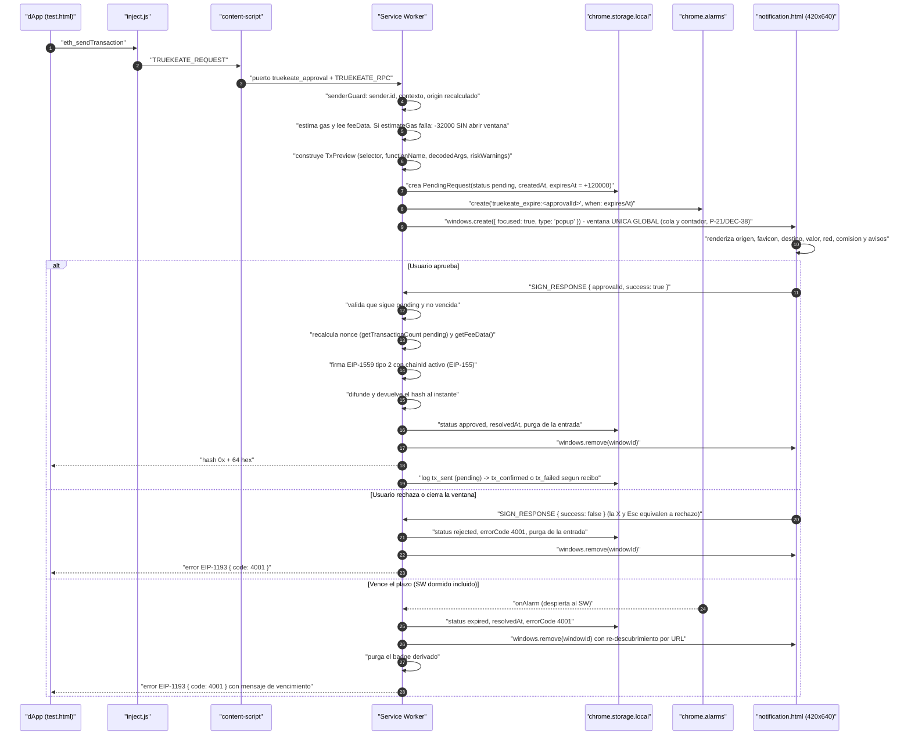

**Reglas precisas del flujo:**

1. **Antes de abrir la ventana** el SW ejecuta `eth_estimateGas` (y lee `getFeeData()`): si la estimación falla o revierte, **no se abre ninguna ventana** y se responde `-32000` con `estimationFailed.reason` (H-22, RNF-25, CU-11/E1).
2. **Un solo clic para decidir** (`≤ 2 clics`, RNF-05): «Aprobar» y «Rechazar» con área ≥ 44 × 44 px y separación ≥ 8 px; `Esc` equivale a rechazar.
3. **La ventana solo decide**: no firma, no difunde y **no escribe la cola** (la escribe el SW).
4. **Una sola ventana de confirmacion global** (P-21): `notification.html` es **unica para toda la extension**. Si llega otra solicitud aprobable mientras hay una en curso, **no se abre una segunda ventana**: la nueva queda `pending` en la cola, se incrementa el **contador de pendientes visible** y se muestra **al resolverse la anterior**. Un **mismo origen** que vuelve a solicitar estando ya pendiente se rechaza con `4001` por `pendingRequestsMaxPerOrigin = 1` (RF-35, CU-16/A1).
5. **La cola nunca se sobrescribe**: `rmwLock` serializa el read-modify-write; resolver la primera entrada no altera la segunda (RF-37, `CA-RF-37`).
6. **Una transaccion en vuelo por cuenta**: la marca **persistida** `truekeate_inflight_tx` garantiza «maximo 1 transaccion en vuelo por `from`» **tambien tras una suspension del SW** (D-R/ADT-23), con recalculo de `nonce` y `getFeeData()` al aprobar (H-10).
7. **Respuestas duplicadas se ignoran**: si la entrada ya no esta `pending`, el SW no firma ni difunde (X-06).
8. **El hash se devuelve al difundir**, sin esperar recibo; despues el SW sigue `eth_getTransactionReceipt` hasta `confirmed` (`status 0x1`) o `failed` (`status 0x0`, con el motivo del revert) (RNF-25, M7).
9. **Ninguna ruta de error puede devolver un `Error` sin `code`**: prohibido `new Error('Request timeout')` (RNF-06, D-E).
10. **Cota de tamano del payload (D-L/ADT-21)**: `params` se limita a **64 KiB** serializados en UTF-8. Al excederlo, la solicitud se rechaza con `-32602` **antes** de crear entrada en la cola y **sin abrir** `notification.html`; el mensaje y la accion sugerida se toman de `diccionario_datos.md` seccion 4.3. En reposo, las previsualizaciones largas (`TypedDataPreview.message`, `PersonalSignPreview.text`) se guardan **redactadas** (hash + resumen), nunca el payload integro.

**Estados de una entrada de la cola:**

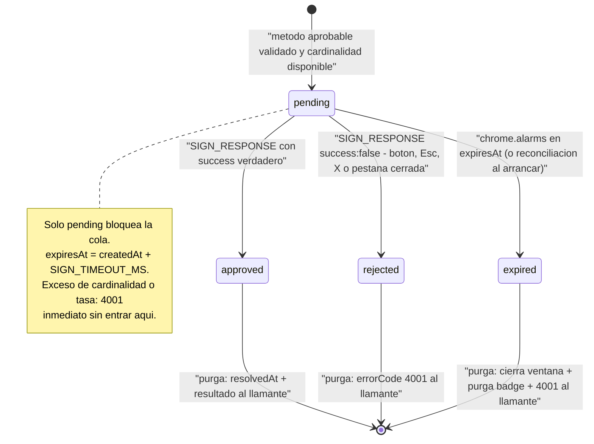

### 3.2 Conexión de dApps y sesiones por origen (con caducidad de 24 h)

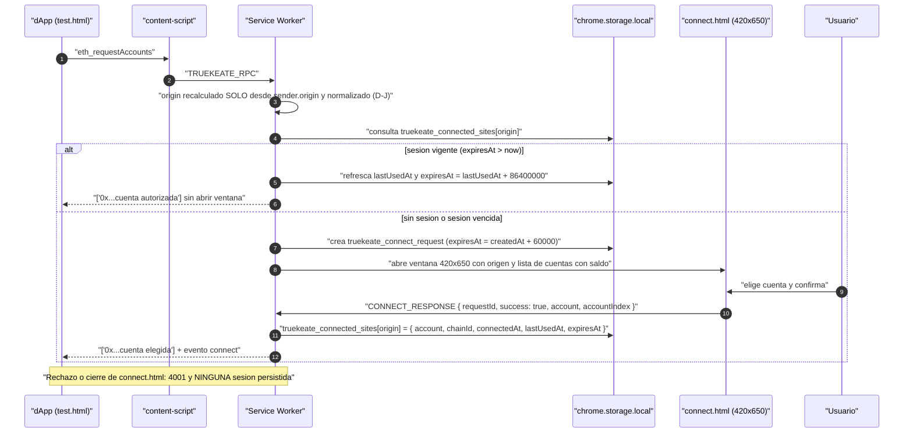

**Reglas de sesión:**

1. **Clave canónica**: origen normalizado (esquema + host + puerto explícitos, **minúsculas, sin barra final**). `HTTP://LOCALHOST:5174/` se normaliza a `http://localhost:5174` (X-07, H-33).
2. **Caducidad**: `expiresAt = lastUsedAt + truekeate_settings.sessionTtlMs`, con `sessionTtlMs = 86400000` (24 h) y **renovación en cada uso**: `lastUsedAt` se refresca en cada `eth_accounts`/`eth_requestAccounts` **atendido** (RF-25, D-B).
3. **Al vencer**: la entrada se **elimina**, `eth_accounts` devuelve `[]`, el origen debe volver a `eth_requestAccounts` y **no se emite error** (es un cambio de estado silencioso, no un error EIP-1193).
4. **Aislamiento**: una dApp no autorizada recibe `[]` en `eth_accounts` y `4100` en métodos sensibles; **solo se comparte la cuenta elegida** (el resto de direcciones nunca viaja a la página) (RNF-11, CU-20).
5. **Revocación** (RF-26): la entrada se elimina por su clave normalizada, se emite `accountsChanged` con `[]` a las pestañas del origen y un `eth_accounts` posterior devuelve `[]`. Si la petición viene de la dApp (`wallet_revokePermissions`), pasa por la cola y se decide en `notification.html`.
6. **Conexión**: ventana única, `connect.html`, con plazo de **60 s** (`CONNECT_TIMEOUT_MS`, `truekeate_connect_request`, **no** `truekeate_pending_requests`, ACU-30); máximo **1 `pending` por origen**.

### 3.3 Derivación HD, importación por clave privada y etiquetado

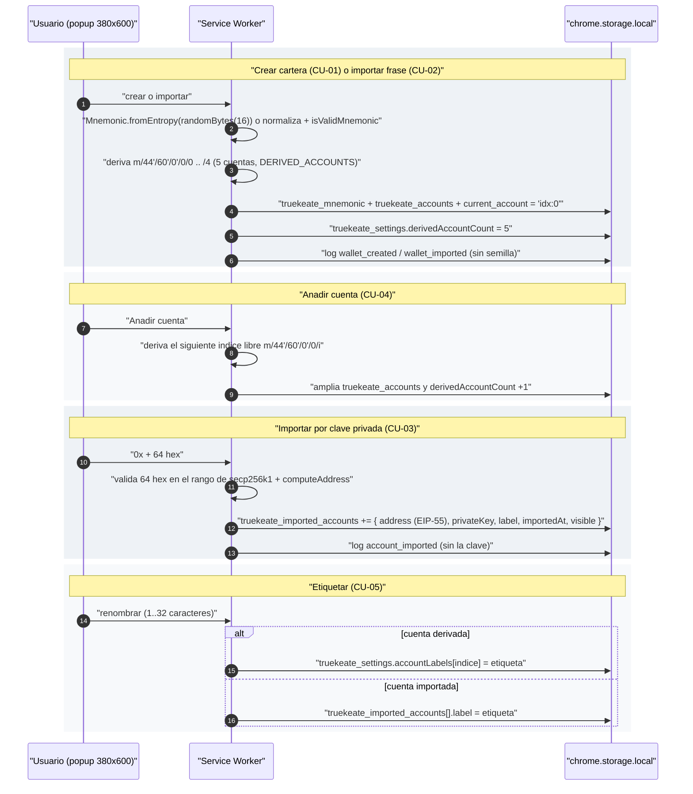

**Reglas:**

- **Ruta única**: `m/44'/60'/0'/0/i`, con el **índice del array** `truekeate_accounts` como índice de derivación. Por defecto 5 cuentas (índices 0..4) y «Añadir cuenta» deriva la siguiente (RF-04, DEC-11).
- **La etiqueta de las derivadas vive en `truekeate_settings.accountLabels: Record<indice, string>`** (D-F/DEC-35); la de las importadas en `truekeate_imported_accounts[].label`. Por defecto `Cuenta N` / `Importada N`; máximo **32 caracteres**.
- **Las cuentas derivadas nunca se eliminan**, solo se ocultan (`visible: false`); las importadas se eliminan solo con confirmación destructiva que enumera lo que se pierde (RF-06 Should, RNF-22).
- **Integridad al arrancar** (M13): se validan el checksum BIP-39 del mnemonic y EIP-55 de las direcciones; ante corrupción se muestra **«wallet dañada»** y no se derivan direcciones distintas en silencio (RNF-22).
- **Material sensible (RNF-09, reescrito en ADT-09)**: el mnemonic y las claves privadas **nunca** salen hacia la pagina ni viajan por `window.postMessage`, y **nunca** se escriben en `truekeate_logs`. La afirmacion absoluta anterior («nunca salen del SW») era **falsa por diseno**: RF-50 (Must) exige revelarlos en el popup, asi que si salen del SW, pero **solo** hacia contextos de la extension (`sender.tab === undefined` y `sender.url` en la allowlist), con confirmacion explicita, ocultacion temporal (`type="password"` + boton «Mostrar»), ocultado por temporizador **y** por perdida de foco, descarte del estado y **politica de portapapeles de P-20**. Flujo completo en la seccion 3.8.

### 3.4 Firma: EIP-1559, EIP-155, EIP-712 y `personal_sign` (vista previa decodificada y avisos de riesgo)

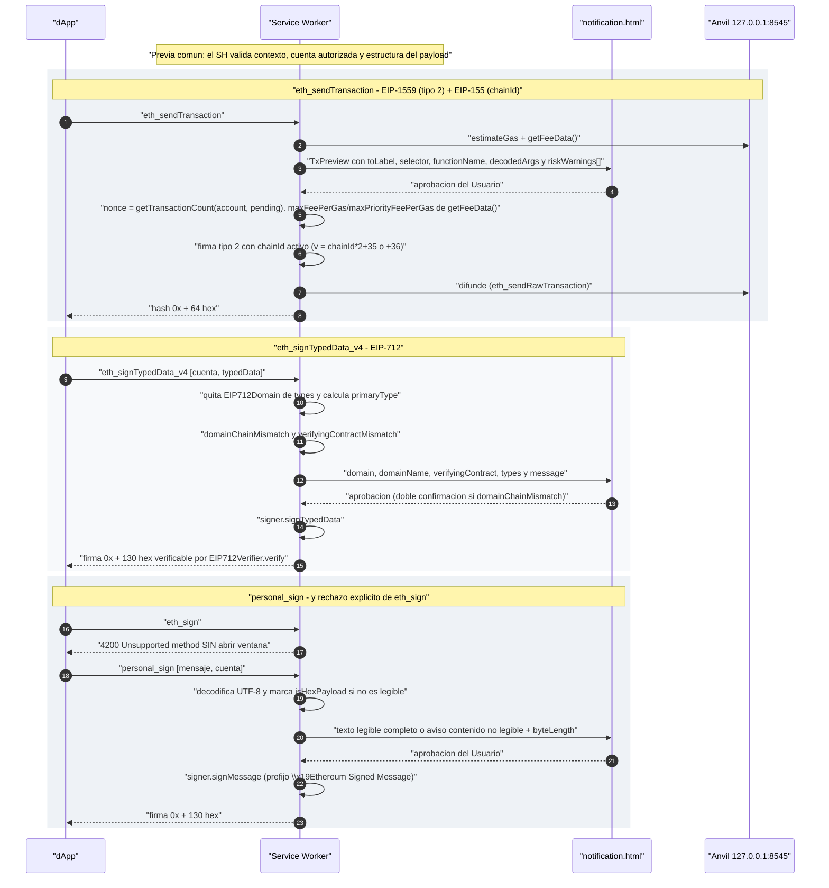

**Avisos de riesgo obligatorios en `notification.html` (DEC-23):**

| Caso | Qué se muestra | Regla |
|---|---|---|
| `eth_sendTransaction` con `data !== '0x'` | `selector`, `functionName`, `decodedArgs` legibles y `toLabel` | Si el selector no se reconoce → `isUnrecognizedContractCall = true` y aviso «llamada a contrato no reconocida» |
| `approve` / `setApprovalForAll` / allowance ilimitada | `riskWarnings[]` con aviso destacado sobre el tramo oscuro del degradado | Nunca se permite aprobar sin ver el aviso |
| Destino sin etiqueta | `toLabel = 'desconocido'` | Aviso de destino no reconocido |
| EIP-712 | `domainName` y `verifyingContract` **en claro**, `types` y `message` | Si `domainChainMismatch` → aviso destacado + **doble confirmacion**. `verifyingContractMismatch` se redefine (D-K/ADT-08) como **«el `verifyingContract` es la direccion cero o el contrato no esta desplegado en la red activa»**: se elimina la comparacion con lo «declarado» por la propia dApp, que era **circular e incomputable**, y el aviso es **bloqueante por defecto** |
| `personal_sign` | Texto UTF-8 completo | Si `isHexPayload` → aviso «contenido no legible» con `byteLength` |

**Reglas de firma:**

1. **Siempre tipo 2 (EIP-1559)** con `maxFeePerGas` y `maxPriorityFeePerGas` de `getFeeData()` y **siempre con `chainId`** en la firma (EIP-155): una transacción con `chainId` distinto del activo se **rechaza** con error tipado (RF-42, RF-43).
2. **Un solo camino de firma** (M11): ninguna otra parte del sistema puede firmar; el SW es el único que toca la clave privada.
3. **`eth_sign` no existe** en el catálogo ni en el enum `method` de la cola: responde `4200` con la acción sugerida «Usar `personal_sign` o `eth_signTypedData_v4`» y **no abre ventana** (DEC-22).
4. **Redaccion en el log**: en `personal_sign` y `eth_signTypedData_v4` se guarda el **hash del payload** y su longitud; en `eth_sendTransaction` se guardan `to`, `value`, `dataLength` y los **primeros 10 bytes de `data`** (D-T/ADT-12: el selector de 4 bytes es el prefijo de esos 10 bytes; **nunca** el `data` completo) (H-42).
5. **Verificacion on-chain**: la firma EIP-712 producida por la wallet debe verificar con `EIP712Verifier.verify` → `true`, y `false` si se altera un byte (RT-11, CU-27). El contrato, su typehash y su fixture estan especificados en la seccion 5.4.
6. **Decodificacion con tabla local cerrada** (D-K/ADT-08): `selector`, `functionName` y `decodedArgs` salen **unicamente** de `src/background/approvals/calldata.ts` (M66). **Fuera de la tabla `functionName = null`** con aviso **bloqueante** «llamada a contrato no reconocida»; **esta prohibido** consultar servicios externos de firmas o de ABIs (RT-03). Detalle en la seccion 3.4.1.
7. **Cota de payload (D-L/ADT-21)**: antes de estimar gas el SW comprueba que los `params` serializados **no superan 64 KiB**; si los superan, responde `-32602` sin abrir ventana y sin crear entrada en la cola (seccion 3.1, regla 10).

#### 3.4.1 Modulo M66 `approvals/calldata.ts` — tabla local cerrada de selectores (D-K/ADT-08)

**Problema que cierra.** DEC-23 exige **decodificar el calldata** antes de firmar, pero el documento definia `functionName`/`decodedArgs` como «decodificados con el ABI disponible» sin declarar **ningun** origen: la garantia anti-firma-ciega quedaba sin fuente verificable.

**Regla normativa.** La decodificacion la realiza una **tabla local y cerrada** implementada en `src/background/approvals/calldata.ts` (M66). El conjunto de selectores reconocidos es **exactamente** el siguiente y **no se amplia en runtime**:

| Selector (4 bytes) | Firma canonica | Que decodifica |
|---|---|---|
| `0xa9059cbb` | `transfer(address,uint256)` | destinatario + importe |
| `0x23b872dd` | `transferFrom(address,address,uint256)` | origen, destinatario + importe |
| `0x095ea7b3` | `approve(address,uint256)` | `spender` + `amount` (aviso de allowance ilimitada con el maximo) |
| `0x39509351` | `increaseAllowance(address,uint256)` | `spender` + incremento |
| `0xa22cb465` | `setApprovalForAll(address,bool)` | operador + `approved` (aviso destacado, H-11b) |
| `0xd505accf` | `permit(address,address,uint256,uint256,uint8,bytes32,bytes32)` | `owner`, `spender`, `value`, `deadline`, `v`, `r`, `s` |
| `0xac9650d8` | `multicall(bytes[])` | numero de sub-llamadas y **recursion** por esta misma tabla |
| *(calldata vacio)* | transferencia simple | no hay funcion que decodificar |

**Modo de fallo (obligatorio).** Fuera de la tabla: `functionName = null`, `decodedArgs = null`, `isUnrecognizedContractCall = true` y **aviso bloqueante** «llamada a contrato no reconocida» que exige **doble confirmacion** para aprobar. **Prohibido** consultar servicios externos de firmas (bases de datos de selectores) o descargar ABIs: violaria RT-03 y filtraria la actividad del usuario.

**Decisiones de implementacion.** (a) La tabla es **codigo propio**, no una dependencia, y se verifica con `calldata.spec.ts` (una asercion por selector del cuadro). (b) `decodedArgs` se limita a escalares y direcciones; los `bytes` largos se muestran truncados a `0x1234...abcd` y **nunca** se copian a `truekeate_logs`. (c) `verifyingContractMismatch` queda **desacoplado** de la dApp: significa «el `verifyingContract` es la **direccion cero** o el contrato **no esta desplegado** en la red activa» y se comprueba con `eth_getCode`; **no** se compara con ningun valor «declarado» en el mismo payload (eso era circular e incomputable).

### 3.5 Redes: cambio con aprobación y alta con permiso de host en runtime

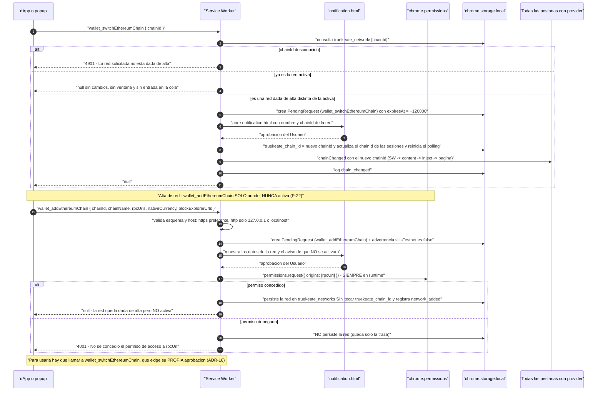

**Reglas de redes:**

- **Separación de casos (P-19/DEC-29)**: el cambio de red **ya activa** es inmediato y sin ventana; el cambio a **otra** red exige aprobación y crea **exactamente 1** entrada en `truekeate_pending_requests`. Si la red no está dada de alta → `4901` **sin** abrir ventana y **sin** crear entrada.
- **Alta y activacion son actos separados (P-22/ADT-25)**: `wallet_addEthereumChain` **solo anade** la red a `truekeate_networks`; **no** escribe `truekeate_chain_id`, **no** emite `chainChanged` y **no** cambia la red activa. La confirmacion de la ventana lo dice explicitamente («la red se anadira, pero seguiras en <red actual>»). Para usarla hay que llamar despues a `wallet_switchEthereumChain` (M24), que crea **su propia** entrada en la cola y exige **su propia** aprobacion (ADR-16). Asi desaparece la elusion de ADR-16 que suponia envolver el cambio de red dentro de un alta.
- **Permiso de host siempre en runtime** (D-G/DEC-36): `chrome.permissions.request` sobre el `rpcUrl`, **tambien cuando el alta nace en el popup** (el clic del usuario es el gesto valido que exige la API). La concesion se registra **por red** en `truekeate_networks`. Si se deniega, la red **no se persiste** y la llamada devuelve `4001`.
- **`host_permissions` no crece**: el manifest declara solo el RPC local (`http://127.0.0.1:8545/*` y `http://localhost:8545/*`); el resto vive en `optional_host_permissions` y se pide en runtime. Nunca comodines nuevos en `host_permissions` (H-36).
- **Validación previa obligatoria**: esquema `https` preferente (`http` solo para `127.0.0.1`/`localhost`) y host que no sea privado ni de enlace local; se rechaza **antes** de abrir ventana y sin pedir permiso (CU-21/CU-25/E1).
- **Coherencia de red**: `eth_chainId` debe coincidir con el `chainId` declarado por el nodo; si no coincide, el alta se rechaza con error tipado y no se persiste.
- **Propagación**: `chainChanged` se emite a **todas** las pestañas con provider y reinicia el polling de saldos (RF-24, RF-27).

### 3.6 Observabilidad: fuente de verdad de los logs, catálogo de eventos, redacción

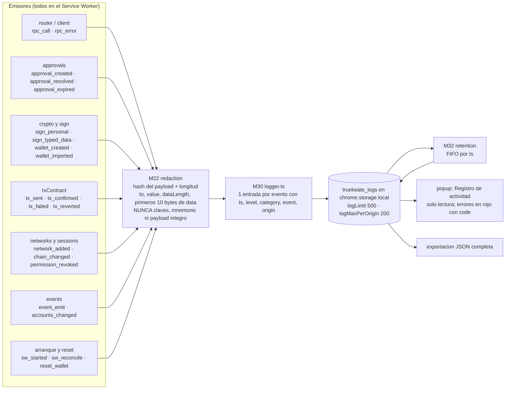

**Reglas de observabilidad:**

1. **Fuente de verdad única**: `truekeate_logs` vive en `chrome.storage.local` y **lo escribe siempre el Service Worker** —nunca el popup, nunca `localStorage`—, de modo que una operación con el popup cerrado deja traza (H-09, CU-29).
2. **Catálogo cerrado de 24 eventos** y **5 categorías independientes** (el enum incluye `storage_quota_exceeded`, ADT-14/D-M):

   `event`: `rpc_call`, `rpc_error`, `event_emit`, `tx_sent`, `tx_confirmed`, `tx_failed`, `tx_reverted`, `sign_personal`, `sign_typed_data`, `approval_created`, `approval_resolved`, `approval_expired`, `chain_changed`, `accounts_changed`, `wallet_created`, `wallet_imported`, `account_imported`, `account_removed`, `reset_wallet`, `network_added`, `permission_revoked`, `sw_started`, `sw_reconcile`, `storage_quota_exceeded`.

   `category` (taxonomía, **no** es el nombre del evento): `call`, `event`, `tx`, `sign`, `system`. Mapeos canónicos: `chain_changed` → `event`; `tx_sent` → `tx`; `sw_started` → `system`. `account_imported` está **reservado** a la importación por clave privada (la derivación HD se instrumenta con `rpc_call` de `wallet_deriveAccounts`).
3. **Exactamente 1 entrada por evento del catálogo**, con `ts`, `level`, `category`, `event`, `origin`, `message` y `data` redactado (RNF-16).
4. **Redaccion obligatoria** (H-42, RNF-09; unificada en D-T/ADT-12): nunca claves privadas, mnemonic ni firmas completas (se truncan a `0x1234...abcd`); en `personal_sign` y `eth_signTypedData_v4`, **hash keccak256** del payload y su longitud; en `eth_sendTransaction`, `to`, `value`, `dataLength` y los **primeros 10 bytes de `data`** —nunca el `data` integro—, que es la redaccion literal que exige `diccionario_datos.md` seccion 2.11.
5. **Retención**: FIFO por `ts`, `logLimit = 500` global y `logMaxPerOrigin = 200`.
6. **Persistencia frente al reset** (RF-32 Should): `resetWallet` **excluye** `truekeate_logs`; el histórico sobrevive y se exporta en JSON.
7. **Errores en rojo con `code`**: toda entrada `level: 'error'` muestra el `code` numerico y el mensaje en espanol de la **tabla cerrada de `diccionario_datos.md` seccion 4.3** (fuente unica de la tabla de errores, D-I/ADT-03); la seccion 5.1 solo reproduce el **delta arquitectonico** (RF-30, D-E).

### 3.7 Seguridad: guarda de `sender`, allowlist de métodos internos, `targetOrigin`, `setAccessLevel`, anti-phishing de la ventana de confirmación

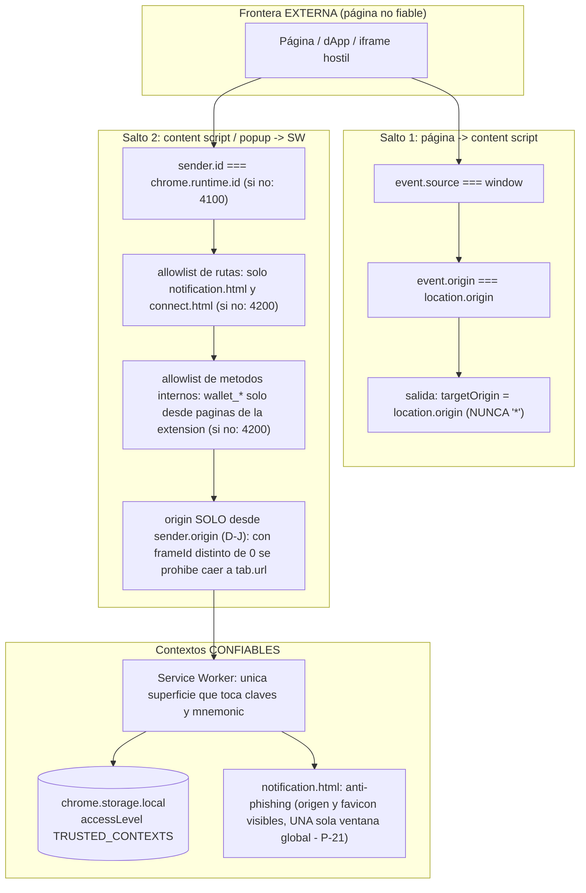

| Control | Implementación | Requisito | No regresión |
|---|---|---|---|
| Guarda de emisor | `sender.id === chrome.runtime.id`; si no, `4100` | RNF-10 | H-32 |
| Allowlist de rutas | `SIGN_RESPONSE` solo desde `chrome-extension://<id>/notification.html`; `CONNECT_RESPONSE` solo desde `.../connect.html`; otra ruta → `4200` | RNF-10, RNF-12 | H-32 |
| Allowlist de métodos internos | Los `wallet_*` internos solo desde páginas de la extensión (`sender.tab === undefined` y `sender.url` en allowlist); desde un content script → `4200 Unsupported method` | RNF-10 | H-32, CU-07/E1, CU-20/E2 |
| `origin` no fiable | El SW **recalcula** y normaliza el origen **solo** desde `sender.origin`; nunca confia en el campo que envia la pagina ni en `sender.tab.url` | RNF-10, RF-25 | H-32, CU-17, **ADT-07/D-J** |
| Origen en iframes | Con `sender.frameId !== 0` se **persiste** el `frameId` en la entrada de la cola y la respuesta se entrega **solo a ese frame** (`chrome.tabs.sendMessage(tabId, msg, { frameId })`). **Prohibido** el respaldo a `sender.tab.url`: en un iframe cross-origin es el origen del **top** y el iframe heredaria la sesion del anfitrion. **Test negativo obligatorio con iframe cross-origin** (seccion 7.4) | RNF-10, RNF-11 | **ADT-07/D-J** |
| Canal externo | `event.source === window` **y** `event.origin === location.origin`; mensaje descartado si no coincide; todo `postMessage` saliente con `targetOrigin = location.origin` | RNF-10 | H-32 |
| Aislamiento del storage | `chrome.storage.local.setAccessLevel({ accessLevel: 'TRUSTED_CONTEXTS' })` **en cada arranque** del SW: un content script no puede leer el storage | RNF-09, RNF-10 | H-32 |
| No exposición de claves | El mnemonic y las claves privadas **nunca** viajan por `window.postMessage` ni se registran; el revelado (RF-50) solo a contextos de la extensión | RNF-09, RF-50 | H-25, H-42 |
| Anti-phishing de la confirmacion | `notification.html` muestra **siempre** el origen solicitante con su favicon y una insignia de riesgo; se abre con `focused: true` y en primer plano; es **unica para toda la extension** (P-21) y muestra el **contador de pendientes**; al aprobar trae la pestana de origen al frente; solo ofrece «Aprobar» y «Rechazar» | RF-35, RNF-05 | H-35, **P-21/ADT-22** |
| Fuente y saneado del favicon | El favicon lo sirve el **propio navegador** mediante la API de favicon del sistema (`chrome://favicon` o `chrome-extension://<id>/_favicon/`), que exige declarar el permiso `favicon` en el manifest. **Prohibido** cargar el favicon desde una URL remota de la dApp o desde `data:`. Si el navegador no lo entrega, se muestra el icono generico de origen desconocido | RF-35, RNF-10 | **ADT-22/S-06** |
| Provider no suplantable | `window.truekeate` y `window.codecrypto` se publican con `Object.defineProperty(window, name, { value, writable: false, configurable: false, enumerable: true })`: la pagina **no** puede reasignarlos ni borrarlos para suplantar el provider | RNF-10 | **ADT-26/D-S** |
| Sin sincronizacion a la nube | `chrome.storage.sync` esta **prohibido**: todos los datos viven en `chrome.storage.local` y nunca salen del equipo. Se verifica con `npm run lint:prohibited` (**0 coincidencias de `storage.sync`** en `src/`) | RNF-09, RE-01, DEC-13 | **ADT-26/D-S** |
| Firma ciega bloqueada | Calldata decodificado, `verifyingContract`/`name` visibles, avisos de riesgo y `eth_sign` fuera del catálogo | RNF-05, RNF-12 | H-11a, H-11b, H-40 |
| CORS del nodo | Anvil con **allowlist concreta** (`chrome-extension://<ID>,http://localhost:5174,http://127.0.0.1:5174`), nunca `*`, y escucha solo en `127.0.0.1` | RE-04 | H-41 |
| Sin dependencias prohibidas | `viem`, `@scure/bip39`, `@metamask/*`, `axios` y `fetch` propio fuera del código: `npm run lint:prohibited` | RT-03 | H-11a (catálogo) |

---

### 3.8 Revelado y exportacion del material de recuperacion (RF-50 - ADT-06, ADT-09, P-20)

**Requisito:** RF-50 (Must) + `CA-RF-50`; caso de uso CU-07. **Constantes:** `REVEAL_HIDE_MS = 30000` (M57, promovida desde `CA-RF-50`) y `CLIPBOARD_CLEAR_ON_HIDE = true` (M57).

**Decision del usuario P-20 (portapapeles).** **Se permite copiar** la frase semilla y las claves privadas. Lo que se garantiza es el **borrado del portapapeles al ocultarse** el valor: si al ocultarse (por temporizador de **30 s** o por **perdida de foco**) el portapapeles **sigue conteniendo el valor revelado**, la extension lo **sobrescribe con una cadena vacia** (`navigator.clipboard.writeText('')`). El borrado se ejecuta **una sola vez por ocultado** y **no** se reintenta si la API falla: en ese caso se registra `code: -32603` en `truekeate_logs` con el aviso «no se pudo limpiar el portapapeles» y se muestra el mismo aviso en el popup. **Nunca** se borra a ciegas el portapapeles del usuario: solo se sobrescribe si su contenido **coincide** con el valor revelado.

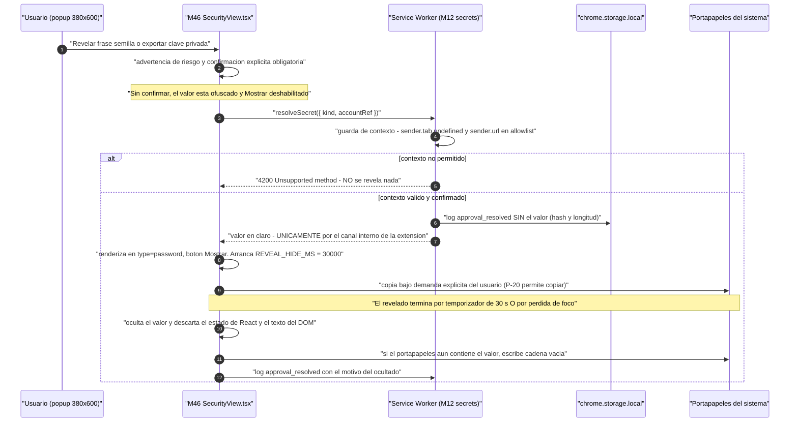

**Reglas del flujo (ADT-06, ADT-09, P-20):**

1. **Confirmacion explicita obligatoria**: sin ella no se revela ni se exporta nada; el valor permanece **oculto por defecto** y ofuscado (`type="password"`), con el boton «Mostrar» deshabilitado mientras no se confirme. La advertencia de riesgo es la de RNF-23 y **no es descartable**.
2. **Plazo unico de 30 s**: `REVEAL_HIDE_MS = 30000`. **Queda prohibido** el valor de 60 s que consta en CU-07 y en su evidencia E2E: la fuente de requisitos (`requerimientos.md` RF-50 y `CA-RF-50`) fija **30 s** y DEC-28 lo confirma. Esta correccion **cierra el pendiente P-3.1**.
3. **Doble disparador del ocultado**: (a) **temporizador de 30 s** desde el revelado y (b) **perdida de foco** de la ventana (`window.blur` y `visibilitychange` hacia `document.hidden`). El primer disparador que ocurra oculta el valor. Recuperar el foco **no** lo vuelve a mostrar: hay que repetir la confirmacion.
4. **Descarte del estado al ocultar**: el valor se borra del **estado de React** (`useState`/`useRef` a `null`) **y del DOM** (el nodo de texto se elimina, no se oculta con CSS); se cancelan el temporizador y los listeners de foco y se descarta cualquier copia intermedia en memoria de la vista.
5. **Politica de portapapeles (P-20)**: copiar esta permitido; al ocultarse, si el portapapeles **sigue conteniendo** el valor revelado, se **sobrescribe con cadena vacia** (`CLIPBOARD_CLEAR_ON_HIDE`). La comprobacion se hace comparando con el valor revelado en memoria **antes** de descartarlo. Si la escritura falla se registra `-32603` con el aviso correspondiente: nunca en silencio.
6. **Nunca hacia la pagina**: el valor **jamas** se entrega por `window.postMessage` ni se escribe en `truekeate_logs`; el canal es **solo** el mensaje interno hacia contextos de la extension (`sender.tab === undefined` y `sender.url` en la allowlist, seccion 3.7). RNF-09 se reescribe en consecuencia (ADT-09).
7. **Aviso de captura**: durante el revelado se muestra el aviso «evita capturas de pantalla o grabaciones» (amenaza declarada en la seccion 3.7, ADT-26); es un aviso, no un control tecnico.
8. **Evidencia E2E obligatoria (P-20)**: debe existir un test E2E (`E2E: 25-recuperacion.spec.ts`) que, tras copiar el valor y provocar el ocultado —**por temporizador** y **por perdida de foco**, ambos casos—, **lea el contenido del portapapeles** y afirme que **ya no contiene la semilla** (cadena vacia o valor distinto). Es la unica forma de verificar la garantia de P-20: inspeccionar el DOM **no basta**. La evidencia se archiva segun la convencion de la seccion 7.4.

9. **Guarda de sesion de dApp activa (R-09a / DEC-45)**: si la cuenta revelada —o, al revelar el **mnemonic**, cualquiera de las cuentas que este deriva— tiene una entrada **vigente** en `truekeate_connected_sites` (seccion 4.1, clave 7), la operacion se **bloquea** con el error tipado **`-32000`** y el literal de la causa «Cuenta en uso por una dApp conectada» de **`diccionario_datos.md` §4.3** (fuente unica de los literales), que nombra el `origen` de la dApp y la accion (revocar su permiso). La comprobacion se hace **en el popup al abrir la accion** y se **revalida en el SW** al resolver el secreto: sin revocar ese permiso (**CU-19**) **no se entrega ningun valor**. La misma guarda bloquea el **borrado de la cuenta importada** (RF-06, seccion 3.3).

**Exportacion (misma politica).** La exportacion de la clave privada de una cuenta importada sigue exactamente las reglas 1 a 9: confirmacion explicita, 30 s, doble disparador, descarte del estado, borrado del portapapeles y guarda de sesion de dApp activa. El `CA-RF-50` y la evidencia `Vitest: secretsExport.spec.ts` se mantienen; lo que anade la v1.1 es la **politica de portapapeles** y su test E2E, y la v1.3 la **guarda de R-09a**.

### 3.9 Reset de la cartera: guardas y orden de comprobacion (RF-11 - R-09b / DEC-46)

**Requisito:** RF-11 (Must) + `CA-RF-11`; caso de uso CU-30; modulo **M33** (`state/schema.ts`, que ya excluye `truekeate_logs` de la limpieza, ADR-11).

**Guardas de estado (DEC-46).** El reset **no se inicia** si `truekeate_pending_requests` (seccion 4.1, clave 8) tiene entradas `pending`, ni si `truekeate_inflight_tx` (clave 12) tiene una transaccion en vuelo **vigente** (TTL de 180 s). El rechazo es un **error de validacion de UI** —no lo devuelve ningun metodo RPC— con error tipado **`-32000`** y el literal de la causa «Reset bloqueado» de **`diccionario_datos.md` §4.3**: la UI lo pinta con el **numero exacto** de solicitudes pendientes. **No se permite continuar.**

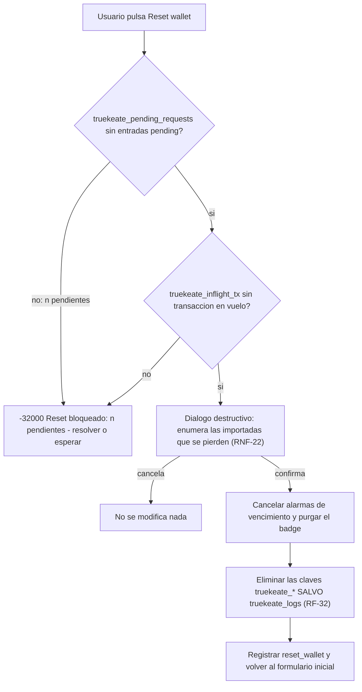

1. **Cola vacia**: `truekeate_pending_requests` sin entradas `pending` (seccion 4.1). Si hay `n > 0`, **bloqueo** con `-32000` y el literal de la causa correspondiente; `n` es el contador que muestra la UI.
2. **Sin transaccion en vuelo**: `truekeate_inflight_tx` sin entradas vigentes (se borran al confirmar o fallar y las purga la reconciliacion al arrancar, seccion 3.4). Si las hay, **bloqueo** con el mismo codigo y literal.
3. **Confirmacion destructiva**: solo con (1) y (2) en verde se abre el dialogo que **enumera** las cuentas importadas que se perderan (RNF-22). Cancelar no modifica nada.
4. **Limpieza**: se cancelan las alarmas de vencimiento, se purga el badge y se eliminan las claves `truekeate_*` **salvo `truekeate_logs`**; se registra `reset_wallet`.

**Salidas que la UI ofrece durante el bloqueo.** (a) **Resolver ahora**: llevar al usuario a la cola —la ventana unica `notification.html`— para **aprobar o rechazar** cada solicitud (CU-13, CU-14, CU-16); (b) **Esperar**: los plazos del SW cierran las solicitudes con `4001` (secciones 2.3 y 3.1), la cola queda vacia y el reset procede. Mientras la guarda este activa **no se elimina ninguna clave**: el estado es identico al previo (`Inspección: chrome.storage.local.get(null)`).

**Que se limpia y que se conserva.**

| Grupo | Claves | Efecto del reset |
|---|---|---|
| Material de la cartera | `truekeate_mnemonic`, `truekeate_accounts`, `truekeate_imported_accounts`, `truekeate_current_account` | **Se eliminan** |
| Red | `truekeate_chain_id`, `truekeate_networks` | **Se eliminan** (se vuelve al default Anvil Local) |
| Sesiones y colas | `truekeate_connected_sites`, `truekeate_pending_requests`, `truekeate_connect_request`, `truekeate_approval_window` | **Se eliminan** (la cola ya esta vacia por la guarda del paso 1) |
| Estado operativo | `truekeate_settings`, `truekeate_inflight_tx`, `truekeate_rate_windows` | **Se eliminan** (`truekeate_inflight_tx` ya esta vacio por la guarda del paso 2) |
| Auditoria | `truekeate_logs` | **Se conserva** (**RF-32**, ADR-11): el historico sobrevive y se exporta en JSON |

**Idempotencia y fallo parcial.** El reset es **idempotente**: repetirlo con el storage ya limpio es un no-op que vuelve a registrar `reset_wallet`. Si una escritura falla, el SW reintenta **una vez** y, si persiste, responde `-32603` con el literal de la causa «Fallo no clasificado del SW» de `diccionario_datos.md` §4.3, informa en la UI y deja la traza del estado parcial en `truekeate_logs`. **Evidencia:** `Vitest: reset.spec.ts — orden de comprobacion y bloqueo (-32000)` · `E2E: 06-reset.spec.ts — reset con la cola vacia y reset bloqueado con 2 pendientes`.

---

## 4. Modelo de datos

### 4.1 Resumen de claves de `chrome.storage.local` y su ciclo de vida

| # | Clave | Tipo raíz | Ciclo de vida | Escribe / lee | ¿Sobrevive a `resetWallet`? |
|---|---|---|---|---|---|
| 1 | `truekeate_mnemonic` | `string` (12 palabras normalizadas) | Se escribe al crear/importar la cartera por frase; **puede no existir** si solo hay cuentas importadas; nunca se registra ni viaja por mensaje | SW y páginas de la extensión (protegida por `TRUSTED_CONTEXTS`) | **No** |
| 2 | `truekeate_accounts` | `string[]` (`Address`) | Crece con «Añadir cuenta» según `derivedAccountCount`; el índice del array **es** el índice BIP-44 | SW y páginas de la extensión | **No** |
| 3 | `truekeate_imported_accounts` | `{ address, privateKey, label, importedAt, visible }[]` | Alta en `wallet_importPrivateKey`; `label` renombrable; baja al eliminar con confirmación | SW escribe; popup lee | **No** |
| 4 | `truekeate_current_account` | `string` (`idx:<n>` \| `imp:<address>`) | Se actualiza al seleccionar cuenta; al eliminar la activa pasa a `idx:0` | SW y páginas de la extensión | **No** |
| 5 | `truekeate_chain_id` | `ChainIdHex` (inicial `0x7a69`) | Lo escribe el SW **solo** al aprobar un cambio de red; no cambia en rechazo ni en vencimiento | SW escribe; popup lee | **No** |
| 6 | `truekeate_networks` | mapa `chainId → red` | Alta con `wallet_addEthereumChain` (siempre con permiso de host en runtime) o desde el popup; default único Anvil Local | SW escribe; popup lee | **No** |
| 7 | `truekeate_connected_sites` | `Record<origen normalizado, sesión>` | Alta en `eth_requestAccounts`; `lastUsedAt` se refresca en cada llamada atendida; vence a las 24 h y se elimina | SW escribe; popup lee | **No** |
| 8 | `truekeate_pending_requests` | `Record<approvalId, PendingRequest>` | Creación por método aprobable; RMW serializado; purga al arrancar y al expirar | **Solo el SW escribe**; los demás contextos leen | **No** |
| 9 | `truekeate_connect_request` | `Record<requestId, ConnectRequest>` | Máximo **1 `pending` por origen**; vence a los 60 s con `chrome.alarms` | **Solo el SW escribe** | **No** |
| 10 | `truekeate_settings` | objeto de ajustes | Defaults en M29; `accountLabels` y registro de aceptación de avisos | SW y páginas de la extensión | **No** |
| 11 | `truekeate_logs` | `LogEntry[]` | Retencion FIFO por `ts`; lo escribe **siempre** el SW; el popup solo lo renderiza | SW escribe; popup lee | **SI** (excluida de la limpieza, RF-32) |
| 12 | `truekeate_inflight_tx` | `Record<Address, { approvalId, txHash?, startedAt }>` | Marca de «transaccion en vuelo» **persistida** (D-R/ADT-23): se escribe al difundir y se borra al confirmar o fallar; la reconciliacion purga las entradas cuyo recibo ya existe | **Solo el SW escribe** | **No** |
| 13 | `truekeate_rate_windows` | `Record<origin, number[]>` (marcas `ts` de la ventana de 60 s) | Ventana de tasa por origen **persistida** (D-Q/ADT-24) para todo el catalogo RPC; sobrevive a la suspension del SW | **Solo el SW escribe** | **No** |

**Claves inexistentes o retiradas (no deben aparecer en el código):** `truekeate_pending_request` (singular, v1.2: **retirada sin alias ni migración**, H-08) · `truekeate_vault` (**no se crea**: P-03, sin cifrado) · cualquier forma `settings.*` o `settings.networks` (**prohibida**: se exige el nombre completo con prefijo, ACU-25) · `codecrypto_*`, `codecrypto_connected_sites` y `window.codecrypto` **como almacén** (el alias solo existe como objeto de runtime, DEC-21) · `localStorage` en cualquier componente (el SW no lo tiene, H-09).

**`truekeate_settings` — campos, defaults y límites:**

| Campo | Tipo | Default | Uso |
|---|---|---|---|
| `derivedAccountCount` | `number` | `5` | Cuentas derivadas al cargar; «Añadir cuenta» lo incrementa (RF-04) |
| `accountLabels` | `Record<indice, string>` | `{}` | Etiqueta de las cuentas **derivadas** (D-F/DEC-35), ≤ 32 caracteres |
| `balancePollMs` | `number` | `5000` | Ciclo de polling de saldos (RF-27) |
| `balancePollMaxAccounts` | `number` | `10` | Máximo de cuentas por ciclo; por encima, solo las visibles |
| `logLimit` | `number` | `500` | Máximo global de entradas de log (RF-32) |
| `logMaxPerOrigin` | `number` | `200` | Máximo de entradas por origen |
| `sessionTtlMs` | `number` | `86400000` | TTL de la sesión de dApp (24 h renovables, RF-25/D-B) |
| `pendingRequestsMax` | `number` | `8` | Máximo global de solicitudes `pending` |
| `pendingRequestsMaxPerOrigin` | `number` | `1` | Máximo por origen (aplica igual a `truekeate_connect_request`) |
| `pendingRequestsPerMinute` | `number` | `6` | Límite de tasa por origen en ventana de 60 s |
| `language` | `'es' \| 'en'` | `'es'` | UI en español (RF-34) |
| `encryptionEnabled` | `boolean` | `false` | Descartado por P-03; flag conservado por compatibilidad |
| `requirePasswordOnOpen` | `boolean` | `false` | Sin bloqueo del popup (P-03) |
| *(aceptación de avisos)* | `boolean` + `number` | ausente | Registro de la aceptación del aviso de entorno de desarrollo (RNF-23) |

### 4.2 Entidades principales y relaciones

```mermaid
erDiagram
    WALLET ||--o| MNEMONIC : "se respalda en 0 o 1 vez (cartera solo con importadas)"
    WALLET ||--o{ ACCOUNT : "contiene 5 o mas"
    WALLET ||--o{ IMPORTED_ACCOUNT : "contiene 0 o mas"
    WALLET ||--|| SETTINGS : "configura"
    WALLET ||--o{ NETWORK : "da de alta"
    WALLET ||--|| CURRENT_NETWORK : "activa"
    WALLET ||--o{ CONNECTED_SITE : "autoriza por origen"
    CONNECTED_SITE ||--|| DAPP_SESSION : "materializa"
    WALLET ||--o{ PENDING_REQUEST : "encola"
    WALLET ||--o{ CONNECT_REQUEST : "encola conexion"
    PENDING_REQUEST ||--o| TX_PREVIEW : "lleva si es tx"
    PENDING_REQUEST ||--o| TYPED_DATA_PREVIEW : "lleva si es EIP-712"
    PENDING_REQUEST ||--o| PERSONAL_SIGN_PREVIEW : "lleva si es personal_sign"
    PENDING_REQUEST ||--o| APPROVAL_RESULT : "resuelve con"
    WALLET ||--o{ LOG_ENTRY : "registra"
    ACCOUNT ||--o{ LOG_ENTRY : "origina"
    NETWORK ||--o{ LOG_ENTRY : "origina"

    WALLET {
        string truekeate_mnemonic "12 palabras BIP-39, minisculas"
        string truekeate_current_account "idx:n o imp:0x..."
    }
    ACCOUNT {
        string address "derivada m/44'/60'/0'/0/i, checksum EIP-55"
        number index "indice BIP-44"
        string label "opcional, en accountLabels"
        boolean visible "ocultar sin eliminar"
    }
    IMPORTED_ACCOUNT {
        string address "checksum EIP-55"
        string privateKey "0x + 64 hex, NUNCA sale del SW"
        string label "1..32 caracteres"
        number importedAt "epoch ms"
        boolean visible "true"
    }
    NETWORK {
        string chainId "0x7a69 por defecto"
        number chainIdDecimal "31337"
        string name "Anvil Local"
        string rpcUrl "http://127.0.0.1:8545"
        string symbol "ETH"
        number decimals "18"
        boolean isTestnet "true"
        boolean isDefault "true"
    }
    CONNECTED_SITE {
        string origin "clave normalizada con puerto"
        string account "direccion compartida"
        string chainId "red al conectar"
        number connectedAt "epoch ms"
        number lastUsedAt "se refresca en cada uso"
        number expiresAt "lastUsedAt + 86400000"
    }
    DAPP_SESSION {
        string origin "origen autorizado"
        string account "cuenta compartida"
        number lastUsedAt "epoch ms"
        number expiresAt "copia de la caducidad persistida"
        boolean connected "estado para connect/disconnect"
    }
    PENDING_REQUEST {
        string approvalId "UUID v4, clave del mapa"
        string method "6 metodos aprobables, sin eth_sign"
        string status "pending approved rejected expired"
        number createdAt "ancla del plazo"
        number expiresAt "createdAt + 120000"
        number errorCode "codigo EIP-1193 emitido"
    }
    TX_PREVIEW {
        string toLabel "contrato o desconocido"
        string selector "primeros 4 bytes"
        string functionName "o null si es desconocido"
        boolean isUnrecognizedContractCall "aviso de riesgo"
        boolean estimationFailed "bloquea el envio"
        number nonceInformativo "solo informativo"
    }
    TYPED_DATA_PREVIEW {
        string domainName "domain.name en claro"
        string verifyingContract "domain.verifyingContract"
        boolean domainChainMismatch "aviso destacado"
        boolean verifyingContractMismatch "aviso o bloqueo"
    }
    PERSONAL_SIGN_PREVIEW {
        string text "UTF-8 legible o null"
        boolean isHexPayload "aviso contenido no legible"
        number byteLength "longitud en bytes"
    }
    CONNECT_REQUEST {
        string requestId "UUID v4"
        string status "pending approved rejected expired"
        number expiresAt "createdAt + 60000"
    }
    APPROVAL_RESULT {
        string status "approved rejected expired"
        number errorCode "4001 o el codigo de la causa"
        number resolvedAt "epoch ms"
    }
    SETTINGS {
        number logLimit "500"
        number logMaxPerOrigin "200"
        number sessionTtlMs "86400000"
        number pendingRequestsMax "8"
        number derivedAccountCount "5"
    }
    LOG_ENTRY {
        number ts "epoch ms"
        string level "info success warn error"
        string category "call event tx sign system"
        string event "24 valores del catalogo"
        string origin "origen o extension"
        string message "sin datos sensibles"
        string data "params REDACTADOS"
    }
```

### 4.3 Migración y versionado del esquema

| Elemento | Estado de migración | Regla |
|---|---|---|
| Versión del esquema de esta especificación | **v1.4** (diccionario de datos) — base v1.2 → v1.3 (H-02, H-07, H-08, H-09, H-10, H-11a, H-11b, H-18, H-21, H-22, H-23, H-24, H-31, H-32, H-33, H-39, H-41, H-42) → v1.4 (ACU-03, ACU-04, ACU-05, ACU-06, ACU-16, ACU-17, ACU-25, ACU-27) | La versión del esquema se declarará en `truekeate_settings`; un cambio de forma exige entrada de migración explícita |
| `truekeate_pending_request` (singular, v1.2) → `truekeate_pending_requests` | **«No hay alias ni migración: no existe código previo»** | No se admite ningún lector del nombre singular (H-08) |
| `PendingApproval` (entidad en memoria, v1.2) | **Ya no existe**: sustituida por el registro persistido + puerto de larga vida | Prohibido reintroducir el `Map` de promesas (H-02) |
| `truekeate_connect_request` | Conserva el **nombre de clave**, cambia la **forma** a `Record<requestId, ConnectRequest>` | «Ninguna decisión autoriza renombrarlo» |
| `truekeate_connected_sites` | Forma canónica = **objeto por origen** (no el `string` de la guía heredada) | `GUIA_RAPIDA_TESTING.md` **no es vinculante** (H-24): no se copian sus esquemas |
| `codecrypto_*` (cualquier variante) | **No válido**: no debe implementarse | `grep -rn "codecrypto_" src/` → **0** coincidencias (RT-13) |
| `truekeate_vault` | **No se crea** (P-03) | Sin cifrado ni contraseña en este alcance |
| Campos añadidos en v1.3/v1.4 | `event` en `truekeate_logs` (D-D) · `accountLabels` en `truekeate_settings` (D-F) · `lastUsedAt`/`expiresAt` respaldados por RF-25 (D-B) · `errorCode` en `PendingRequest` (D-E) | Ninguno puede volver a quedar «sin requisito que lo respalde» (ACU-17) |
| **Reconstrucción desde cero** | El proyecto **no migra** datos del remoto `codecrypto` | DEC-09/P-10: `src/` se escribe nuevo en Fase 3 |

**Versionado del propio producto**: `manifest.version` desde `src/manifest.ts`; política de dependencias con `package-lock.json` versionado y revisión de compatibilidad MV3 en cada actualización mayor de Chrome/Edge (RNF-24, §2.6 de `requerimientos.md`).

### 4.4 Volumetría y límites (cuotas, cardinalidad de la cola, `logLimit`)

| Dimensión | Límite | Magnitud / regla de dimensionado |
|---|---|---|
| Cuentas derivadas | `derivedAccountCount` = **5** por defecto, ampliable | 1 dirección por índice; añadir cuenta deriva la siguiente |
| Cuentas importadas | Sin límite funcional declarado | Cada una guarda `address`, `privateKey`, `label`, `importedAt`, `visible` |
| Solicitudes `pending` (global) | **8** (`pendingRequestsMax`) | Al superarlo: `4001` inmediato, sin persistir, sin ventana y sin contar para el badge |
| Solicitudes `pending` por origen | **1** (`pendingRequestsMaxPerOrigin`) | Aplica también a `truekeate_connect_request` |
| Tasa por origen | **6 solicitudes/minuto** (`pendingRequestsPerMinute`) | Ventana de 60 s |
| Transacciones en vuelo por cuenta | **1** (`fifoByAccount`) | La segunda espera; el `nonce` se recalcula al aprobar |
| Entradas de log (global) | **500** (`logLimit`) | FIFO por `ts` |
| Entradas de log por origen | **200** (`logMaxPerOrigin`) | FIFO por `ts` |
| Sesiones de dApp | 1 por origen normalizado | Vence a las **24 h** sin uso y se elimina |
| Polling de saldos | **1 `eth_getBalance` por cuenta visible por ciclo de 5000 ms**, máximo **10 cuentas** | Se detiene al cerrar la vista, al ocultarse la pestaña, al cambiar de cuenta/red o si el RPC no responde |
| Redes dadas de alta | Sin límite declarado | Default único: Anvil Local (`0x7a69`) |
| **Cuota de `chrome.storage.local` (D-M/ADT-14)** | **10 MB**, la cuota por defecto desde Chrome 114 (version minima que exige RNF-04/A2); **objetivo garantizado >= 5 MB** de ocupacion real con los limites de esta tabla y **sin** `unlimitedStorage` | **Consumo dimensionado**: `truekeate_logs` es la unica clave que crece de forma sostenida (<= 500 entradas x <= 2 KB, aproximadamente 1 MB en el peor caso) y la cola persistida se acota a 8 x (`params` redactados + una previsualizacion). **Modo de fallo observable (obligatorio)**: si `chrome.storage.local.set` rechaza por cuota entonces (1) **un reintento** inmediato tras aplicar la retencion FIFO; si vuelve a fallar, (2) se **descarta la escritura de log** y se emite **1 evento** `rpc_error` con `code: -32603` y mensaje «no se pudo guardar el registro por falta de espacio»; y (3) se muestra un **aviso en el panel** de actividad (RF-30) y en el popup. **Prohibido** el fallo silencioso: el contador de descartes es visible en el panel |
| Tamano de la cola persistida | <= 8 entradas x (`params` redactados + una previsualizacion) | El `data` integro **no** se persiste en `params` (H-42); los payloads mayores de 64 KiB se rechazan con `-32602` (D-L/ADT-21) |
| **Tamano maximo de payload** | **64 KiB** serializados (D-L/ADT-21) | Por encima: `-32602` sin persistir, sin abrir ventana y sin entrar en la cola |

---

## 5. Interfaces

### 5.1 Provider inyectado (métodos y errores)

**Objeto publicado** (`inject.js`, síncrono en `document_start`, todos los frames):

```js
window.truekeate = provider;              // objeto EIP-1193
window.codecrypto = window.truekeate;     // EL MISMO OBJETO (DEC-21) — no copia ni envoltorio
```

Ambos nombres exponen `request`, `on` y `removeListener`; un test verifica que **`window.truekeate === window.codecrypto`** (RF-13, `CA-RF-13`, DEC-21).

**Catalogo RPC del provider** (contexto «pagina»).

> **Referencia normativa (ADT-03/ADT-11).** La **fuente unica** del catalogo de metodos soportados, de su tipo, del contexto permitido y de la obligacion de aprobacion es la **tabla de `diccionario_datos.md` seccion 4.3**. La **fuente unica** de la tabla de errores EIP-1193 (codigo, causa, mensaje en espanol y accion sugerida) es la **tabla cerrada de `diccionario_datos.md` seccion 4.3**. **No se copian aqui**: este documento aporta solo el **delta arquitectonico**.

| Método | ¿Requiere aprobación? | Retorno / efecto | Observación |
|---|---|---|---|
| `eth_requestAccounts` | **Sí** (`connect.html`) | `['0x…']` | Crea la sesión por origen; `4001` si se rechaza |
| `eth_accounts` | No | `['0x…']` o `[]` | `[]` sin abrir ventana si no hay sesión o si venció |
| `eth_chainId` | No | `ChainIdHex` (`0x7a69` con Anvil) | RF-18 |
| `eth_blockNumber` | No | hex | RF-18 |
| `eth_getBalance` | No | `WeiString` | 1 llamada por cuenta visible y ciclo |
| `eth_estimateGas` | No | hex | Se ejecuta **antes** de abrir la ventana; si falla, envío bloqueado con `-32000` |
| `eth_gasPrice`, `eth_feeHistory` | No | hex | Base de `getFeeData()` (EIP-1559) |
| `eth_getTransactionByHash` | No | objeto tx | RF-31 |
| `eth_getTransactionReceipt` | No | objeto recibo | `status 0x1` → confirmada; `0x0` → fallida (H-22) |
| `eth_sendTransaction` | **Sí** (`notification.html`) | hash `0x` + 64 hex | Se devuelve **al difundir**, sin esperar recibo |
| `eth_signTypedData_v4` | **Sí** | firma `0x` + 130 hex | Vista previa con `name`/`verifyingContract` |
| `personal_sign` | **Sí** | firma `0x` + 130 hex | Prefijo `\x19Ethereum Signed Message` |
| `eth_sign` | — | **`4200`** | **Retirado del catálogo** (DEC-22) |
| `wallet_switchEthereumChain` | **Sí, si la red destino no es la activa**; si ya es la activa, `null` sin ventana | `null` | `4901` si no está dada de alta (DEC-29) |
| `wallet_addEthereumChain` | **Sí** + permiso de host en runtime **siempre** | `null` | Denegación → `4001` y red no persistida (DEC-36) |
| `wallet_revokePermissions` | **Si**. Dos caminos: **desde la dApp** entra en `truekeate_pending_requests` y se decide en `notification.html`; **desde el popup** la confirmacion es la propia UI de Revocar y **no** crea entrada en la cola | `null` | RF-26; cierra ADT-31 |

**Metodos internos** (solo contextos de la extension; desde un content script responden `4200`): `wallet_generateMnemonic` (RF-01), `wallet_importMnemonic` (RF-02), `wallet_deriveAccounts` (RF-04), `wallet_importPrivateKey` (RF-05), `wallet_getNetworks` (RF-23), `wallet_getLogs` (RF-28) y `wallet_revealSecret` (RF-50). Su contrato completo, con parametros, retorno y errores, esta en la **seccion 5.1.1** (ADT-16).

**Errores EIP-1193: índice código → causa (VR-04).** `requerimientos.md` §2.1 fija el **catálogo de códigos y su significado**; los **literales** de los mensajes, la causa y la acción sugerida tienen su **fuente única** en `diccionario_datos.md` §4.3 (varios mensajes por código, uno por causa). Esta sección **no reproduce ningún literal**: es un índice que enumera, por código, las **causas** registradas en esa tabla, de modo que no puede divergir de la fuente única. **Todo** error que ve el usuario lleva `code`.

| Código | Causas registradas en `diccionario_datos.md` §4.3 (sin sus literales) | Filas |
|---|---|---|
| `4001` | rechazo explícito del usuario · vencimiento del plazo (120 s firma / 60 s conexión) · cierre de la ventana de confirmación sin decidir · exceso de cardinalidad o de tasa de solicitudes aprobables · *token bucket* agotado en cualquier método del catálogo · permiso de host denegado al dar de alta una red | 6 |
| `4100` | origen sin sesión autorizada o emisor no autorizado | 1 |
| `4200` | método fuera del catálogo (`eth_sign`) · método interno invocado desde un contexto no permitido | 2 |
| `4900` | RPC local caído | 1 |
| `4901` | `chainId` no dado de alta | 1 |
| `-32602` | mnemonic inválido · clave privada inválida · dirección malformada (checksum EIP-55) · cuenta ya existente · payload por encima de 64 KiB | 5 |
| `-32000` | saldo insuficiente · nonce inválido · `estimateGas` fallido o revert previo a firmar · cuenta en uso por una dApp conectada · reset bloqueado | 5 |
| `-32603` | fallo no clasificado del SW · identificador duplicado en la cola · cuota de `chrome.storage.local` agotada · difusión interrumpida por suspensión del SW | 4 |

**Total: 25 filas** — exactamente las 25 causas de `diccionario_datos.md` §4.3. El índice cita la **causa** y el **código**; el mensaje en español y la acción sugerida se leen **solo** en la fuente única (regla de cita ADT-03/ADT-11 y RNF-06).

#### 5.1.1 Contrato de los metodos internos `wallet_*` (ADT-16)

Los metodos internos se enumeraban «solo por nombre». Aqui se cierra su **firma exacta**, su retorno y sus errores; el contrato vive en `src/shared/protocol.ts` (M56) y su implementacion en M8/M9/M10/M28/M29/M43.

```ts
// Contexto: SOLO paginas de la extension (sender.tab === undefined y sender.url en allowlist).
// Desde un content script responden 4200 (RNF-10). Ningun metodo interno abre ventana.
export type InternalMethod =
  | 'wallet_generateMnemonic'   // RF-01
  | 'wallet_importMnemonic'     // RF-02
  | 'wallet_deriveAccounts'     // RF-04
  | 'wallet_importPrivateKey'   // RF-05
  | 'wallet_getNetworks'        // RF-23
  | 'wallet_getLogs'            // RF-28
  | 'wallet_revealSecret';      // RF-50 (seccion 3.8)

export interface InternalWalletRequest {
  type: 'TRUEKEATE_RPC'; method: InternalMethod; params?: unknown[]; origin: 'extension';
  tabId: null; frameId: null;
}
export interface InternalWalletResultMap {
  wallet_generateMnemonic: { mnemonic: string; wordCount: 12 };                 // no persiste
  wallet_importMnemonic: { accounts: Address[]; currentAccount: AccountRef };   // -32602 si checksum
  wallet_deriveAccounts: { accounts: Address[]; derivedAccountCount: number };  // amplia truekeate_accounts
  wallet_importPrivateKey: { account: Address; accountRef: AccountRef };        // -32602 si duplicada
  wallet_getNetworks: { networks: StoredNetwork[]; activeChainId: ChainIdHex };
  wallet_getLogs: { entries: LogEntry[]; truncated: boolean; dropped: number };
  wallet_revealSecret: { kind: 'mnemonic' | 'privateKey'; value: string; hideAfterMs: 30000 };
}
export type InternalWalletResult<M extends InternalMethod> = InternalWalletResultMap[M];
```

**Reglas del contrato interno (ADT-16).** (a) La union `InternalMethod` es **cerrada**: un metodo `wallet_*` que no figure en ella se responde `4200` y **no** se implementa sin editar este contrato. (b) Ningun metodo interno abre ventana ni crea entrada en `truekeate_pending_requests`; la aprobacion, cuando la hay (revelado), es **confirmacion explicita dentro del propio contexto** (seccion 3.8). (c) Todo error usa la tabla de `diccionario_datos.md` seccion 4.3 con `code` numerico obligatorio. (d) `wallet_getLogs` devuelve `dropped` para hacer visible el descarte por cuota (D-M/ADT-14).

### 5.2 Páginas y ventanas de la extensión

| Superficie | Medida | Contenido y responsabilidad | Requisitos |
|---|---|---|---|
| Popup (`index.html`) | **380 × 600 px** | Bienvenida/«Acerca de»; crear/importar cartera; lista de cuentas (añadir, importar por clave, renombrar, ocultar, eliminar); recibir (dirección + copiar + QR); enviar (a dirección externa y entre cuentas propias); selector de redes y alta; sitios conectados y revocación; registro de actividad con exportación JSON; ajustes (reset wallet, revelar material de recuperación) | RF-01..RF-11, RF-27..RF-34, RF-49, RF-50 |
| `connect.html` | **420 × 650 px** | Ventana de **conexión**: origen solicitante, lista de todas las cuentas con su saldo, elección de la cuenta a compartir; cancelar → `4001`. Mantiene su propio polling mientras está abierta | RF-16, RF-17, RF-36 |
| `notification.html` | **420 × 640 px** | Ventana de **decision**, **unica para toda la extension** (P-21): origen y favicon **siempre visibles**, insignia de riesgo y **contador de solicitudes pendientes**; resumen (cuenta, destino etiquetado, valor, red, comision estimada); calldata decodificado o panel EIP-712 o panel `personal_sign`; avisos de riesgo; **solo** «Aprobar» y «Rechazar» (`Esc` = rechazar). Al resolverse, muestra la siguiente pendiente. **No firma** | RF-19, RF-20, RF-21, RF-22, RF-23, RF-35, RF-41 |
| Alta de red (contenido especifico, P-22) | — | La ventana de `wallet_addEthereumChain` muestra los datos de la red **y el aviso explicito de que la red se anadira sin activarse**, indicando cual sigue siendo la red activa. La ventana de `wallet_switchEthereumChain` muestra el cambio de red y su `chainId` destino | RF-22, RF-23, ADR-16 |
| Encabezado común | Franja `--tk-grad-brand` de **72 px** con `truekeate-mark-96.png` al 18 % de opacidad y «TrueKeate» en blanco | connect añade el origen; notification añade la insignia del tipo de solicitud | RF-49, RT-12, RNF-18 |

**Tamaño explícito de la ventana (obligatorio — H1/DEC-49).** Las medidas de la tabla **no** se consiguen con `min-height: 100vh`: con esa regla el `body` medía **720 px** de alto en lugar de 600 y Chrome abría el popup con la **altura por defecto del navegador**. La implementación **obligatoria** es:

1. Cada página declara su clase en el `body`: `tk-popup` (`index.html`), `tk-connect` (`connect.html`) y `tk-notification` (`notification.html`).
2. `body.tk-popup` / `body.tk-connect` / `body.tk-notification` declaran **`width` y `height` explícitos** con los tokens de `identidad_visual.md` §6: `--tk-popup-width/--tk-popup-height` (380/600 px), `--tk-connect-width/--tk-connect-height` (420/650 px) y `--tk-notification-width/--tk-notification-height` (420/640 px); `min-height` queda a `0`.
3. El contenedor interno (`.tk-window`) hereda `height: 100%` para que el contenido ocupe exactamente la ventana y el desplazamiento ocurra **dentro** de ella.
4. `test.html` **no** lleva ninguna de esas clases: la dApp de pruebas es fluida y no fija alto.

**Componentes vinculantes** (`identidad_visual.md`): botón primario (fondo `--tk-grad-mark`), secundario, peligro (`--tk-grad-danger`), fantasma (borde `--tk-gold-500` con texto `--tk-navy-800`), tarjeta de cuenta (seleccionada con borde 2 px `--tk-teal-500`), dirección truncada `0x1234…abcd` en JetBrains Mono, saldo, badge de red (`--tk-grad-gold`), badge del icono (`--tk-danger`), panel de logs (fondo `--tk-night-900`), spinner con `--tk-grad-mark` y estado vacío. **Accesibilidad**: área táctil ≥ 44 × 44 px con separación ≥ 8 px, foco visible de 2 px `--tk-teal-500` con offset 2 px, contraste según la matriz cerrada, navegación completa por teclado, `axe-core` con 0 violaciones A/AA, `prefers-reduced-motion` respetado y sin pérdida de contenido al 200 % de zoom (RNF-19, RNF-21).

### 5.3 dApp de pruebas (`test.html`)

| Aspecto | Definición |
|---|---|
| Servido en | `http://localhost:5174/test.html` (Vite con `server.port: 5174`, `strictPort: true`; también copia en la raíz del repositorio) |
| Detecta el provider por | `window.truekeate`, el alias `window.codecrypto` y EIP-6963 (`eip6963:requestProvider`) |
| Flujos que ejecuta (7) | detectar · conectar · consultar saldo · enviar transacción · firmar EIP-712 · cambiar red · escuchar eventos (`accountsChanged`, `chainChanged`) |
| Dominio EIP-712 de la dApp | **`TrueKeate Test App`** |
| Historial | Una fila por operación y el **JSON de la última respuesta sin recortar** (RF-47, Should) |
| Criterio de tiempo | Cada flujo debe mostrar resultado en **< 5000 ms** medidos con `performance.now()`; un contenedor vacío o sin respuesta es fallo |
| Errores que debe mostrar | `4001` (rechazo), `4901` (red no dada de alta), `4900` (Anvil detenido) con su acción sugerida |
| Requisitos | RF-46 (Must), RF-47 (Should), RT-09, RE-01 |

### 5.4 Contrato verificador EIP-712 (`EIP712Verifier.sol`)

| Aspecto | Definición |
|---|---|
| Ubicación | `contracts/src/EIP712Verifier.sol`, con `contracts/test/EIP712Verifier.t.sol` y `contracts/foundry.toml` |
| Firma y visibilidad exactas | `function verify(address signer, bytes32 digest, bytes calldata signature) external pure returns (bool)`. Sin estado y **sin** `ecrecover` propio: delega en `ECDSA.recover` (OpenZeppelin vendorizado) y devuelve `false` —nunca revierte— ante firma malformada o `v` invalido. Devuelve `true` solo si la direccion recuperada coincide **exactamente** con `signer` |
| `EIP712Domain` y typehash | El contrato **no** fija un dominio: recibe el `digest` ya calculado. El typehash del dominio es el canonico de EIP-712: `keccak256("EIP712Domain(string name,string version,uint256 chainId,address verifyingContract)")` = `0x8b73c3c69bb8fe3d512ecc4cf759cc79239f7b179b0ffacaa9a75d522b39400f`. El test calcula el `digest` con `TypedDataEncoder.hash(domain, types, message)` de `ethers.js v6` (RT-02) |
| Fixture versionado | `contracts/test/fixtures/eip712-signature.json` con `domain` (`name: 'TrueKeate Test App'`, `version: '1'`, `chainId: 31337`, `verifyingContract`), `types` (sin `EIP712Domain`), `message`, `primaryType`, `expectedDigest`, `signer` y `signature`. Se genera **una vez** y se versiona: los tests **no** dependen de claves aleatorias ni de red |
| `solc` fijado | `contracts/foundry.toml`: `solc = "0.8.24"` (version **fijada**, no rango), `evm_version = "cancun"`, `optimizer = false`. Fijarla cierra la reproducibilidad del artefacto (RNF-24) |
| Nombre del contrato de test | `contract EIP712VerifierTest is Test` (Foundry y forge-std), con `setUp()` que carga el fixture con `vm.readFile`/`vm.parseJson` |
| Casos de prueba obligatorios | 1) firma valida devuelve `true`; 2) firmante incorrecto devuelve `false`; 3) dominio distinto (`chainId` o `verifyingContract` alterados) devuelve `false`; 4) firma malformada (longitud distinta de 65 o `v` fuera de 27/28) devuelve `false` sin revert; 5) byte alterado en el mensaje devuelve `false` |
| Uso | Comprobar **on-chain** que la firma EIP-712 producida por la wallet es valida: `true` con la firma correcta y `false` si se altera un byte del mensaje (RT-11, `CA-RT-11`) |
| Naturaleza | **Instrumento de prueba**: no forma parte del producto ni se despliega como funcionalidad de la wallet (P-07) |
| Comando | `forge test --root contracts --match-contract EIP712VerifierTest` |

> **Correspondencia wallet y contrato (ADT-17).** La wallet firma con `signer.signTypedData(domain, types, message)` de `ethers.js v6`; el test del contrato recalcula el `digest` con `TypedDataEncoder.hash(domain, types, message)` sobre el **mismo** fixture y comprueba que `verify(signer, digest, signature)` devuelve `true`. El dominio de pruebas es el de la dApp (`TrueKeate Test App`, seccion 5.3) con `chainId 31337`.

---

## 6. Trazabilidad

> **Regla (ACU-01):** «la ficha declara, la matriz agrega». La seccion 6.1 se construye desde las fichas de CU (seccion 3 de `casos_uso/casos_uso.md` v1.1) y desde la responsabilidad de cada modulo de la seccion 2.4; la seccion 6.2 recorre los 40 RF Must uno a uno.

> **Regla de la relacion bidireccional (ADT-10).** Se declara la semantica para que las dos matrices sean **coherentes por construccion**: la seccion 6.1 lista, para cada modulo, **todos** los CU y RF/RNF/RT que toca; la seccion 6.2 lista, para cada RF Must, **unicamente sus modulos principales** —los que **implementan** el requisito, no los que lo consumen o lo muestran—. Por eso la seccion 6.2 puede asignar a un RF menos modulos que la 6.1: la inclusion de un modulo en la 6.2 implica su presencia en la 6.1 para ese RF, pero **no** al reves. **Invariante verificable**: para todo RF Must de la seccion 6.2, cada modulo principal citado aparece en la seccion 6.1 asociado a ese mismo RF; y todo modulo de la seccion 2.4 aparece al menos una vez en la 6.1 (ningun modulo huerfano). La comprobacion se ejecuta como test documental en `npm run test`.

### 6.1 Matriz componente/módulo → CU → RF/RNF/RT

| Módulo (§2.4) | CU que implementa | RF que satisface | RNF / RT / RE |
|---|---|---|---|
| M1 `manifest.ts` | CU-21, CU-22, CU-25, CU-36 | RF-13 (declaración de inyección), RF-23 (hosts) | RT-04, RT-05, RNF-04, RNF-10, RNF-20, RE-04 |
| M2 `background.ts` | CU-01, CU-08, CU-15, CU-16, CU-20, CU-21, CU-24, CU-26, CU-30, CU-31 | RF-09, RF-10, RF-13, RF-15, RF-24, RF-37, RF-41 | RNF-08, RNF-10, RT-04 |
| M3 `rpc/router.ts` | CU-07, CU-10, CU-11, CU-14, CU-17, CU-18, CU-19, CU-20, CU-21, CU-24, CU-25, CU-27, CU-28, CU-31, CU-32 | RF-13, RF-14, RF-16..RF-23, RF-26, RF-28, RF-45, RF-50 | RNF-06, RNF-09, RNF-10, RNF-11, RNF-12, RT-03 |
| M4 `rpc/catalog.ts` | CU-07, CU-14, CU-20, CU-21, CU-22, CU-28 | RF-14, RF-18, RF-45 | RNF-06, RT-13 |
| M5 `rpc/client.ts` | CU-10, CU-11, CU-12, CU-13, CU-24, CU-25, CU-27, CU-28, CU-31 | RF-18, RF-27, RF-42, RF-43 | RNF-07, RNF-25, RE-04, RT-06 |
| M6 `rpc/errors.ts` | CU-14, CU-20, CU-28, CU-30, CU-31, CU-32, CU-34 | RF-14, RF-30, RF-45 | RNF-06, RNF-25 |
| M7 `rpc/txContract.ts` | CU-11, CU-12, CU-13, CU-23, CU-29 | RF-08, RF-19, RF-31, RF-42, RF-43 | RNF-25 |
| M8 `crypto/mnemonic.ts` | CU-01, CU-02, CU-32 | RF-01, RF-02, RF-12 (hint), RF-33 | RNF-22, RT-02 |
| M9 `crypto/hd.ts` | CU-01, CU-02, CU-04, CU-08 | RF-04, RF-10 | RT-02 |
| M10 `crypto/importAccount.ts` | CU-03, CU-05, CU-32 | RF-05, RF-33 | RNF-09, RNF-22, RT-02 |
| M11 `crypto/sign.ts` | CU-11, CU-12, CU-13, CU-27, CU-28 | RF-19, RF-20, RF-21, RF-42, RF-43 | RNF-09, RT-02, RT-11 |
| M12 `crypto/secrets.ts` | CU-07 | RF-50 | RNF-09, RNF-22 |
| M13 `crypto/integrity.ts` | CU-02, CU-04, CU-08, CU-30 | RF-09, RF-10 | RNF-22 |
| M14 `approvals/queue.ts` | CU-11..CU-16, CU-19, CU-24, CU-25, CU-27, CU-28 | RF-22, RF-23, RF-26, RF-37, RF-41 | RNF-08 |
| M15 `approvals/timeout.ts` | CU-15, CU-16, CU-30 | RF-37, RF-40, RF-41 | RNF-06, RNF-08 |
| M16 `approvals/reconcile.ts` | CU-08, CU-13, CU-15, CU-16, CU-18, CU-30 | RF-10, RF-37, RF-41 | RNF-08 |
| M17 `approvals/ports.ts` | CU-13, CU-14, CU-15, CU-16 | RF-37, RF-41 | RNF-08 |
| M18 `approvals/focus.ts` | CU-13, CU-14, CU-15, CU-17, CU-25 | RF-35, RF-36, RF-41 | RNF-05, RNF-21 |
| M19 `approvals/preview.ts` | CU-13, CU-17, CU-24, CU-25, CU-27, CU-28 | RF-19, RF-20, RF-21, RF-22, RF-23 | RNF-05, RNF-09 |
| M20 `security/senderGuard.ts` | CU-07, CU-20, CU-21 | RF-14, RF-23 | RNF-09, RNF-10, RNF-12 |
| M21 `security/accessLevel.ts` | CU-01, CU-08, CU-21, CU-30 | RF-09, RF-10 | RNF-09, RNF-10 |
| M22 `security/redaction.ts` | CU-03, CU-07, CU-11, CU-13, CU-21, CU-27, CU-28, CU-29 | RF-28, RF-29, RF-31, RF-50 | RNF-09, RNF-16 |
| M23 `networks/catalog.ts` | CU-10, CU-24, CU-25, CU-30, CU-31 | RF-18, RF-22, RF-23 | RT-06, RNF-23 |
| M24 `networks/switch.ts` | CU-24, CU-25 | RF-22, RF-24 | RNF-08, RT-06, RE-04 |
| M25 `networks/addChain.ts` | CU-21, CU-25 | RF-23, RF-22 | RNF-23, RT-04 |
| M26 `sessions.ts` | CU-06, CU-08, CU-17, CU-18, CU-19, CU-24, CU-26, CU-30 | RF-10, RF-16, RF-17, RF-25, RF-26 | RNF-08, RNF-11 |
| M27 `events.ts` | CU-01, CU-19, CU-22, CU-24, CU-26 | RF-15, RF-24, RF-29 | RNF-16 |
| M28 `accounts.ts` | CU-01..CU-10, CU-12, CU-26, CU-30, CU-32 | RF-04, RF-05, RF-06, RF-07, RF-10, RF-11 | RNF-22, RT-02 |
| M29 `settings.ts` | CU-01, CU-02, CU-04, CU-05, CU-10, CU-18, CU-29, CU-33 | RF-04, RF-10, RF-25, RF-27, RF-33 | RNF-22, RNF-23 |
| M30 `logging/logger.ts` | CU-01, CU-02, CU-03, CU-04, CU-06, CU-07, CU-08, CU-10..CU-17, CU-19..CU-24, CU-26..CU-31, CU-34 | RF-28, RF-29, RF-30, RF-31, RF-32 | RNF-09, RNF-16 |
| M31 `logging/events.ts` | CU-22, CU-24, CU-26, CU-29 | RF-29, RF-24 | RNF-16 |
| M32 `logging/retention.ts` | CU-29, CU-30 | RF-32 | RNF-16 |
| M33 `state/schema.ts` | CU-08, CU-30 | RF-09, RF-10, RF-11, RF-32 | RNF-08, RNF-22 |
| M34 `state/migrations.ts` | CU-08, CU-30 | RF-09, RF-10, RF-11 | RNF-22, RT-13 |
| M35 `inject/provider.ts` | CU-13, CU-17, CU-20, CU-22, CU-26, CU-28 | RF-13, RF-14, RF-15, RF-44, RF-45 | RNF-10, RT-13 |
| M36 `inject/eip6963.ts` | CU-22, CU-23 | RF-44 (Should) | RNF-20, RT-13 |
| M37 `inject/index.ts` | CU-01, CU-20, CU-21, CU-22, CU-24, CU-26, CU-28 | RF-13, RF-15, RF-45 | RNF-10, RT-13 |
| M38 `content-script.ts` | CU-13, CU-14, CU-15, CU-16, CU-17, CU-18, CU-19, CU-20, CU-21, CU-22, CU-24, CU-26 | RF-13, RF-15, RF-24, RF-37, RF-41, RF-45 | RNF-10, RNF-11 |
| M39 `popup/App.tsx` | CU-01, CU-02, CU-03, CU-04, CU-05, CU-06, CU-07, CU-08, CU-09, CU-10, CU-11, CU-12, CU-19, CU-24, CU-26, CU-30, CU-32, CU-33, CU-34, CU-35 | RF-01..RF-12, RF-26, RF-27, RF-33, RF-34, RF-48, RF-49, RF-50 | RNF-05, RNF-18, RNF-19, RNF-21, RNF-22, RNF-23 |
| M40 `popup/views/AccountsView.tsx` | CU-01..CU-08, CU-12, CU-26, CU-32 | RF-01..RF-11, RF-33, RF-50 | RNF-21, RNF-22 |
| M41 `popup/views/ReceiveView.tsx` | CU-09 | RF-07, RF-49 | RNF-18, RNF-20 |
| M42 `popup/views/SendView.tsx` | CU-11, CU-12, CU-32 | RF-08, RF-19, RF-33, RF-42, RF-43 | RNF-05, RNF-25 |
| M43 `popup/views/NetworksView.tsx` | CU-24, CU-25 | RF-22, RF-23, RF-24 | RNF-23, RT-04, RT-06 |
| M44 `popup/views/SitesView.tsx` | CU-19 | RF-26, RF-24 | RNF-11 |
| M45 `popup/views/LogsView.tsx` | CU-29, CU-34 | RF-28, RF-29, RF-30, RF-31, RF-32 | RNF-16, RNF-18, RNF-19 |
| M46 `popup/views/SecurityView.tsx` | CU-07, CU-30 | RF-50, RF-11 | RNF-09, RNF-21, RNF-22, RNF-23 |
| M47 `popup/hooks/useBalancePolling.ts` | CU-10, CU-26, CU-31 | RF-27, RF-18, RF-34 | RNF-02, RNF-03, RNF-07 |
| M48 `connect/App.tsx` | CU-03, CU-10 (=A1), CU-14, CU-15, CU-17 | RF-16, RF-17, RF-36 | RNF-05, RNF-21 |
| M49 `connect/ConnectRow.tsx` | CU-17, CU-35 | RF-36 | RNF-05, RNF-21 |
| M50 `notification/App.tsx` | CU-11, CU-12, CU-13, CU-14, CU-15, CU-19, CU-24, CU-25, CU-27, CU-28, CU-35 | RF-19, RF-20, RF-21, RF-22, RF-23, RF-35, RF-41 | RNF-05, RNF-12, RNF-21 |
| M51 `notification/TxPreviewPanel.tsx` | CU-13, CU-23 | RF-19 | RNF-05 |
| M52 `notification/RiskWarnings.tsx` | CU-13, CU-21 | RF-19, RF-20 | RNF-05 |
| M53 `notification/TypedDataPanel.tsx` | CU-27 | RF-20 | RNF-05, RT-11 |
| M54 `notification/PersonalSignPanel.tsx` | CU-28 | RF-21 | RNF-05 |
| M55 `shared/types.ts` | Todos los CU (contrato de tipos) | RF-13..RF-25 (modelo), RF-35, RF-37 | RNF-13, RNF-14, RT-08 |
| M56 `shared/protocol.ts` | CU-13, CU-14, CU-15, CU-16, CU-17, CU-22, CU-24, CU-26, CU-28 | RF-13, RF-15, RF-24, RF-37, RF-45 | RNF-10, RT-13 |
| M57 `shared/constants.ts` | CU-01, CU-02, CU-04, CU-08, CU-10, CU-15, CU-24 | RF-04, RF-12, RF-18, RF-25, RF-27, RF-40 | RT-06, RT-13 |
| M58 `shared/validation/address.ts` | CU-11, CU-12, CU-32 | RF-33 | RNF-06 |
| M59 `shared/validation/mnemonic.ts` | CU-02, CU-32 | RF-02, RF-33 | RNF-22, RT-02 |
| M60 `shared/validation/amount.ts` | CU-11, CU-12, CU-32 | RF-33 | RNF-06 |
| M61 `shared/validation/privateKey.ts` | CU-03, CU-32 | RF-05, RF-33 | RNF-06 |
| M62 `shared/format.ts` | CU-09, CU-10, CU-13, CU-29, CU-34 | RF-30, RF-34, RF-49 | RT-10, RNF-18 |
| M63 `shared/qr.ts` | CU-09 | RF-07 | RNF-20 |
| M64 `styles/tokens.css` | CU-01, CU-09, CU-13, CU-29, CU-33, CU-34, CU-35 | RF-49 | RNF-18, RNF-19, RNF-21, RT-12 |
| M65 `styles/base.css` | CU-01, CU-13, CU-17, CU-33, CU-34, CU-35 | RF-49 | RNF-18, RNF-19, RNF-21 |
| `test.html` (fuera de `src/`) | CU-22, CU-23, CU-24, CU-25, CU-26, CU-27, CU-28, CU-31 | RF-46, RF-47 | RT-09, RE-01, RNF-25 |
| `contracts/EIP712Verifier.sol` | CU-27, CU-36 | RF-20 (verificación) | RT-11 |
| M66 `approvals/calldata.ts` | CU-11, CU-12, CU-13, CU-21 | RF-19, RF-20 | RNF-05, RNF-12 |
| `vite.config.ts` | CU-10, CU-23, CU-36 | RF-25, RF-46 | RT-09, RNF-15, **RT-01**, **RT-05** |
| `package.json` y `package-lock.json` (seccion 7.5) | CU-36 | RF-46 (build de la dApp) | **RT-01**, **RT-05**, **RT-07**, **RNF-15**, **RNF-17**, **RNF-24** |
| `scripts/lint-prohibited.mjs` (seccion 7.5) | CU-36 | RF-14 (catalogo sin `eth_sign`) | **RT-03**, RT-13, RNF-18 |
| `scripts/check-mermaid.mjs` (seccion 7.5, CI) | CU-36 | — | **RNF-01**, RNF-13, RNF-15 |
| Suite E2E `e2e/**` (seccion 7.4) | CU-01..CU-36 (recorrido) | Todos los RF Must | **RNF-01**, **RNF-17**, RNF-21, RNF-22, **RT-07** |
| `RepoTecnico/evidencia/**` (seccion 7.4) | CU-01..CU-36 | — | **RNF-01**, RNF-17 |
| **Sin modulo (restricciones de proceso)** | — | — | **RE-02** (riesgo aceptado del modo sin cifrado) y **RE-03** (sin `push` sin orden explicita): se verifican por inspeccion, no por codigo |
| **RNF-01** (trazabilidad 100 %) | Transversal a todos los CU | Todos los RF Must y Should | **RNF-01**: matriz `E-xx -> RF-xx -> CA/CU -> test` y comprobacion **bidireccional** 6.1 y 6.2 |
| **RNF-17** (cobertura de ramas) | CU-01..CU-36 | — | **RNF-17**: `npm run test -- --coverage` (70 % global, >= 80 % en `crypto/`, `approvals/` y `shared/validation/`) |
| **RNF-24** (ciclo de vida) | CU-36 | — | **RNF-24**: `package-lock.json` versionado, revision de compatibilidad MV3 en cada actualizacion mayor y rango de Foundry verificado antes de los E2E |

**Cobertura de la matriz:** 36/36 CU con al menos un módulo asignado (incluidos los derivados CU-35 y CU-36) · M55/M64/M65 son transversales y aparecen en la mayoría de CU por diseño (tipos, tokens y estilos base) · ningún módulo queda sin CU.

### 6.2 Cobertura: qué módulo implementa cada uno de los 40 RF Must

> **Regla de la columna (ADT-10).** «Módulo(s) principal(es)» son los que **implementan** el requisito; los módulos que solo lo consumen, lo renderizan o lo instrumentan aparecen en la sección 6.1 pero **no** aquí. Esta es la semántica que hace compatibles las dos matrices.

| RF (Must) | Qué se implementa | Módulo(s) principal(es) | CU / `CA` |
|---|---|---|---|
| **RF-01** | Generación de la frase BIP-39 de 12 palabras con `ethers.js v6` | M8, M39, M40 | CU-01 · `CA-RF-01` |
| **RF-02** | Importación de frase con normalización y checksum BIP-39 | M8, M59, M39 | CU-02 · `CA-RF-02` |
| **RF-03** | Carga sin contraseña (operativa inmediata) | M2, M8, M39 | CU-01, CU-02 · `CA-RF-03` |
| **RF-04** | Derivación HD `m/44'/60'/0'/0/i`, 5 cuentas + «Añadir cuenta» | M9, M28, M29 | CU-04 · `CA-RF-04` |
| **RF-05** | Importación por clave privada con etiqueta renombrable | M10, M28, M61, M40 | CU-03, CU-05 · `CA-RF-05` |
| **RF-07** | Recepción: dirección completa, copiar y QR | M41, M63, M62 | CU-09 · `CA-RF-07` |
| **RF-08** | Envío de transferencias con estimación de gas y confirmación | M7, M42, M50 | CU-11, CU-12 · `CA-RF-08` |
| **RF-09** | Auto-carga de la cartera al abrir el popup | M2, M13, M33, M39 | CU-08 · `CA-RF-09` |
| **RF-10** | Restauración de cuenta activa, red, importadas y sesiones | M26, M28, M13, M16, M33 | CU-04, CU-05, CU-08, CU-18, CU-24, CU-26 · `CA-RF-10` |
| **RF-11** | Reset wallet con confirmación destructiva | M33, M34, M46 | CU-30 · `CA-RF-11` |
| **RF-13** | Inyección en `window.truekeate` + alias `window.codecrypto` en todas las páginas y frames | M37, M35, M38, M1 | CU-22 · `CA-RF-13` |
| **RF-14** | `request({method, params})` con errores EIP-1193; sin `eth_sign` (`4200`) | M3, M4, M6, M20 | CU-14, CU-20, CU-21, CU-28 · `CA-RF-14` |
| **RF-15** | `on` / `removeListener` / `emit` de los 5 eventos | M27, M35, M56, M38 | CU-26 · `CA-RF-15` |
| **RF-16** | `eth_requestAccounts` con elección de cuenta en `connect.html` | M3, M26, M48, M18 | CU-17 · `CA-RF-16` |
| **RF-17** | `eth_accounts` sin volver a pedir permiso (`[]` si no hay sesión) | M26, M3, M38 | CU-08, CU-17, CU-18, CU-20 · `CA-RF-17` |
| **RF-18** | `eth_chainId`, `eth_getBalance`, `eth_blockNumber` | M5, M3, M47 | CU-10, CU-31 · `CA-RF-18` |
| **RF-19** | `eth_sendTransaction` con aprobación y calldata decodificado | M7, M11, M19, M51, M42 | CU-11, CU-12, CU-13 · `CA-RF-19` |
| **RF-20** | `eth_signTypedData_v4` con `name`/`verifyingContract` y `domainChainMismatch` | M11, M19, M53 | CU-27 · `CA-RF-20` |
| **RF-21** | `personal_sign` con texto UTF-8 y aviso si es hex ilegible | M11, M19, M54 | CU-28 · `CA-RF-21` |
| **RF-22** | `wallet_switchEthereumChain` con aprobación si la red no es la activa | M24, M14, M43, M50 | CU-24, CU-25 · `CA-RF-22` |
| **RF-23** | `wallet_addEthereumChain` con permiso de host en runtime siempre | M25, M1, M43 | CU-21, CU-25 · `CA-RF-23` |
| **RF-24** | Propagación de `accountsChanged` y `chainChanged` a todas las pestañas | M27, M24, M38, M31 | CU-19, CU-24, CU-26 · `CA-RF-24` |
| **RF-25** | Persistencia de conexión por origen con caducidad de 24 h renovables | M26, M29, M57 | CU-18 · `CA-RF-25` |
| **RF-26** | Revocación de permiso de un origen desde el popup | M44, M26, M14 | CU-19 · `CA-RF-26` |
| **RF-27** | Polling de saldos cada 5 s con parada y suspensión | M47, M5, M48 | CU-10, CU-26, CU-31 · `CA-RF-27` |
| **RF-28** | Log de llamadas al provider (método, params, origen, timestamp) | M30, M22, M3 | CU-29 · `CA-RF-28` |
| **RF-29** | Log de eventos emitidos | M30, M31, M27 | CU-29 · `CA-RF-29` |
| **RF-30** | Log de errores en rojo con código y mensaje | M30, M6, M45, M62, M64 | CU-29, CU-34 · `CA-RF-30` |
| **RF-31** | Log de operaciones con hash/firma resultante | M30, M7, M22 | CU-29 · `CA-RF-31` |
| **RF-33** | Validación de formularios con feedback inline | M58, M59, M60, M61, M62, M39 | CU-02, CU-03, CU-11, CU-32 · `CA-RF-33` |
| **RF-35** | `notification.html` anti-phishing (origen, favicon, foco, **una sola ventana global con contador de pendientes**, P-21) | M50, M18, M19 | CU-13, CU-14 · `CA-RF-35` |
| **RF-36** | `connect.html` con lista de cuentas y saldos | M48, M49, M18 | CU-17 · `CA-RF-36` |
| **RF-37** | Cola persistida `Record<approvalId, PendingRequest>` + puerto de larga vida + reconciliación | M14, M17, M16, M15, M2 | CU-16 · `CA-RF-37` |
| **RF-41** | Cierre automático tras decidir, limpieza de estado y reconciliación por `approvalId` | M18, M16, M14, M17 | CU-13, CU-14 · `CA-RF-41` |
| **RF-42** | EIP-1559 (tipo 2) con `maxFeePerGas`/`maxPriorityFeePerGas` de `getFeeData()` | M11, M5, M7 | CU-11, CU-12 · `CA-RF-42` |
| **RF-43** | EIP-155: `chainId` en la firma y verificación del `chainId` activo | M11, M5, M23 | CU-11, CU-12 · `CA-RF-43` |
| **RF-45** | EIP-1193: interfaz y catálogo de errores estándar | M35, M3, M4, M6, M56 | CU-22 · `CA-RF-45` |
| **RF-46** | `test.html` con los 7 flujos | `test.html`, M37, M38, M48 | CU-23 · `CA-RF-46` |
| **RF-49** | Aplicación de la identidad visual en las tres ventanas y la dApp | M64, M65, M39, M48, M50 | CU-01, CU-09, CU-33, CU-34 · `CA-RF-49` |
| **RF-50** | Revelar/exportar semilla y claves con confirmación explícita, **30 s** (`REVEAL_HIDE_MS`), ocultado por temporizador **y** por pérdida de foco, descarte del estado y **borrado del portapapeles al ocultar** (P-20, sección 3.8); nunca por `postMessage` | M12, M46, M3, M22, M57 | CU-07 · `CA-RF-50` |

**Resultado de cobertura del MVP: 40 / 40 RF Must asignados a un módulo concreto · 0 RF Must sin módulo.**

**Cobertura de los RNF, RT y RE en esta matriz (ADT-04).** Los requisitos transversales no se asocian a un RF Must concreto, así que se declaran aquí con su módulo o su criterio de verificación, para que el conteo «25/25 RNF · 13/13 RT · 4/4 RE» de la sección 1.2 sea **verificable**: **RNF-01** es la propia matriz (verificación bidireccional 6.1 ↔ 6.2, ejecutada como test documental); **RNF-17** se verifica con `npm run test -- --coverage` sobre M8..M17, M22, M30..M34 y M55..M63; **RNF-24** se verifica sobre `package.json`/`package-lock.json`, `contracts/foundry.toml` y `vite.config.ts`; **RT-01** sobre M39, M48, M50, M64 y M65 (React 19, TS 5.9, Vite 7); **RT-07** sobre la suite Vitest, la suite E2E y `forge test`; **RE-02** y **RE-03** son restricciones de proceso **sin módulo** y se verifican por inspección de la configuración y del historial de comandos.

**Verificación de los 10 RF Should** (no comprometidos, pero ya ubicados arquitectónicamente): RF-06 → M28/M33/M40 · RF-12 → M8/M57/M39 · RF-32 → M30/M32/M33/M45 · RF-34 → M62/M47/M39 · RF-38 → M14/M2 (badge derivado) · RF-39 → M2/M14 (`chrome.notifications`) · RF-40 → M15/M16/M17 · RF-44 → M36/M35 · RF-47 → `test.html` · RF-48 → M39/M64. **Total: 50 / 50 RF con módulo asignado y CU que los especifica.**

### 6.3 Requisitos del ciclo posterior y su impacto arquitectónico

| RF (Should) | Diseño ya previsto (no se construye en el MVP) | Impacto arquitectónico | Riesgo si se pospone |
|---|---|---|---|
| **RF-06** Eliminar cuenta importada | M28 elimina la entrada completa (incluida `privateKey`) tras confirmación dialogada; bloquea con `-32602` si hay sesión de dApp que la usa; las derivadas solo se ocultan | Ninguno estructural: la entidad ya tiene `visible` | Bajo: la cuenta queda visible pero no es eliminable; el riesgo «pérdida irrecuperable» ya está cubierto por RF-50 |
| **RF-12** Hint de la frase de Anvil | M8/M57 exponen `DEFAULT_MNEMONIC` como hint de desarrollo que rellena el formulario | Ninguno: constante ya declarada en `src/shared/constants.ts` | Nulo |
| **RF-32** Historial de logs que sobrevive al reset | M30/M32/M33: `truekeate_logs` excluida de la limpieza de `resetWallet` | Bajo: la exclusión debe implementarse en M33 al escribir el reset | Medio: sin ella, el reset borra la evidencia de auditoría; el panel sigue funcionando mientras no se resetee |
| **RF-34** UI en español, 4 decimales, direcciones abreviadas | M62 centraliza formato y literales; RT-10 ya obliga al español | Ninguno: la UI se escribe en español desde el inicio | Bajo |
| **RF-38** Badge contador | M14/M2 calculan el badge como **índice derivado** con conteo **global** tras cada escritura o purga (`chrome.action.setBadgeText`) | Bajo: ya existe la purga del badge en el vencimiento (M15) | Nulo para el MVP (DEC-27): el oráculo de la cola no depende del badge |
| **RF-39** Notificaciones de Chrome | M2/M14 emiten 1 notificacion por solicitud con el origen; descartarla **no** resuelve la solicitud | Bajo: el permiso `notifications` esta en **`optional_permissions`** y **solo se pide al implementar RF-39** (D-P/ADT-30); el MVP no lo necesita | Nulo para el MVP: ninguna ruta del MVP depende de `chrome.notifications` |
| **RF-40** Timeout 120 s / 60 s | **Ya implementado como mecanismo estructural** en M15/M16/M17 (§1.2): el `CA-RF-40` se valida en el ciclo posterior | **Ninguno: es el único Should cuya infraestructura es Must de facto** | Alto si se omitiera: RF-37/RF-41 y RNF-08 quedarían incorrectos |
| **RF-44** EIP-6963 | M35/M36 con `uuid` constante, `icon` data-URI de 96 px y re-anuncio sincrónico + `DOMContentLoaded` | Bajo: el anuncio es aditivo y no altera el provider | Bajo: la dApp de pruebas detecta el provider por `window.truekeate` |
| **RF-47** Historial de la dApp | `test.html` añade fila por operación y muestra el JSON de la última respuesta sin recortar | Ninguno: es UI de la dApp de pruebas | Bajo |
| **RF-48** Pantalla «Acerca de» | M39/M64 con el logotipo horizontal y la tagline exacta | Ninguno: los activos ya están en `public/brand/` | Bajo: el aviso de RNF-23 sigue mostrándose en primer arranque y antes de la primera firma |

---

## 7. Entornos, build y despliegue

### 7.1 Entorno verificado

| Elemento | Valor | Nota |
|---|---|---|
| SO / shell | Windows (PowerShell / `pwsh`) | Comandos documentados también en bash cuando aplica |
| Directorio del proyecto | `C:\Users\lucci\MasterCodeCripto\GitLab\chrome-wallet` | Raíz del workspace |
| Node.js / npm | `v24.16.0` / `11.13.0` | Gestor: **npm** (no pnpm) |
| Foundry (`anvil`/`forge`/`cast`) | `1.7.2-dev`; rango soportado `>=1.0.0 <2.0.0` | Binarios en `C:\Users\lucci\.cargo\bin\` |
| ethers.js | `6.15.x` (*minor* fijada `~6.15.0`) | **Única** librería criptográfica (RT-02) |
| React / TypeScript / Vite | `19.x` / `5.9` (`strict: true`) / `7.x` | RT-01, RNF-13 |
| Chrome / Edge | **≥ 114** (MV3) | No se detectó `chrome` en el `PATH`: la extensión se carga manualmente desde `dist/` |
| RPC local | `127.0.0.1:8545`, chainId `31337` (`0x7a69`) | **Detenido** al inicio; se levanta con `anvil` |
| Git | Repositorio inicializado; rama de trabajo `chrome-wallet-DSH`; remotos `origin`, `gitlab`, `codecrypto` | RE-03: **sin `push`** salvo la orden explícita `/push` |
| GCP | No aplica | DEC-13: 100 % local |
| dApp de pruebas | `http://localhost:5174` con `strictPort: true` | Origen estable y coincidente con la clave de sesión (H-33) |
| Activos | `public/icons/icon-{16,32,48,128}.png`, `public/brand/`, `public/fonts/` (woff2 latin) | Los iconos **se versionan** y no se regeneran en Linux |

### 7.2 Comandos

```powershell
# Red local (allowlist de CORS: NUNCA "*" — RE-04/H-41; <ID> se sustituye al primer build)
anvil --host 127.0.0.1 --port 8545 --chain-id 31337 `
      --http.corsdomain "chrome-extension://<ID>,http://localhost:5174,http://127.0.0.1:5174"

# Segunda red local para probar el cambio de red (RF-22/RF-23)
anvil --port 8546 --chain-id 31338

# Verificación del nodo
anvil --version                                            # debe estar en >=1.0.0 <2.0.0
cast chain-id --rpc-url http://127.0.0.1:8545              # -> 31337
cast block-number --rpc-url http://127.0.0.1:8545
cast balance 0xf39Fd6e51aad88F6F4ce6aB8827279cffFb92266 --rpc-url http://127.0.0.1:8545
cast tx <hash> --rpc-url http://127.0.0.1:8545

# Build limpio (literal ÚNICO del corpus; `npm install` NO es válido — D-C)
npm ci && npm run build        # tsc -b && vite build -> dist/ + dist/manifest.json

# Desarrollo y pruebas
npm run dev                    # Vite (dApp de pruebas / UI)
npm run test                   # Vitest (jsdom) sobre módulos del Service Worker
npm run test -- --coverage     # @vitest/coverage-v8 (RNF-17)
npm run test:e2e               # Playwright con la extensión cargada desde dist/
npm run lint:prohibited        # viem / @scure/bip39 / @metamask/* / axios / fetch propio (RT-03)
forge test --root contracts --match-contract EIP712VerifierTest

# Verificación en Linux (WSL2 o CI ubuntu-latest)
wsl -d Ubuntu -- bash -lc "npm ci && npm run build && npm test"
```

**Carga de la extensión**: `chrome://extensions/` (o `edge://extensions/`) → Modo de desarrollador → **Cargar descomprimida** → carpeta `dist/` → tras cada build, pulsar **Recargar**; la consola del Service Worker se abre desde la tarjeta de la extensión.

**Verificación previa obligatoria de los E2E** (H-29): `anvil --version` dentro del rango soportado y `cast chain-id` = `31337`. Si Anvil no responde o la versión está fuera de rango, la suite E2E **no se ejecuta** y se marca **no verificada** (nunca como satisfactoria).

### 7.3 Permisos del manifest y su justificación

```jsonc
{
  "manifest_version": 3,
  "name": "TrueKeate Wallet",
  "version": "1.0.0",
  "key": "<clave publica base64 CONGELADA en src/manifest.ts (D-N)>",
  "minimum_chrome_version": "114",
  "icons": { "16": "icons/icon-16.png", "32": "icons/icon-32.png", "48": "icons/icon-48.png", "128": "icons/icon-128.png" },
  "action": { "default_popup": "index.html", "default_icon": { "16": "icons/icon-16.png" } },
  "permissions": ["storage", "alarms", "favicon", "clipboardRead", "clipboardWrite"],
  "optional_permissions": ["notifications"],
  "host_permissions": [
    "http://127.0.0.1:8545/*",
    "http://localhost:8545/*"
  ],
  "optional_host_permissions": [
    "http://127.0.0.1/*",
    "http://localhost/*",
    "https://*/*"
  ],
  "content_scripts": [{
    "matches": ["<all_urls>"],
    "exclude_matches": [
      "https://metamask.io/*",
      "https://*.metamask.io/*"
    ],
    "js": ["content-script.js"],
    "run_at": "document_start",
    "all_frames": true
  }],
  "web_accessible_resources": [{
    "resources": ["inject.js"],
    "matches": ["<all_urls>"],
    "use_dynamic_url": true
  }],
  "background": { "service_worker": "background.js", "type": "module" }
}
```

| Permiso | Justificación (por qué el diseño lo usa de verdad) | Requisito |
|---|---|---|
| `storage` | Persistir cartera, sesiones, ajustes y cola de aprobaciones en `chrome.storage.local`. El SW **no tiene** `localStorage` | RNF-08, RF-25, RF-37 |
| `alarms` | **Vencimiento del plazo de aprobación aunque el SW esté dormido**: `setTimeout` no sobrevive a la suspensión | H-02/H-07, RF-37/RF-40/RF-41 |
| `favicon` | **Icono de origen de la dApp en `notification.html`**: el origen solicitante se muestra con el favicon que sirve el **propio navegador** (`chrome-extension://<id>/_favicon/?pageUrl=…&size=32`). Es la única vía de obtenerlo sin descarga de red propia y sin aceptar un `data:` ni una URL remota propuesta por la dApp; si el permiso no estuviera declarado el favicon queda `null` y la UI usa el activo local del paquete (§3.8) | RF-35, **ADT-22/P-21** |
| `clipboardRead` | **Política de portapapeles de R-09/P-20 (RF-50)**: al ocultarse el secreto revelado hay que **leer** el portapapeles (`navigator.clipboard.readText()`) para comparar su `sha256` con `clipboardHash` y borrarlo **solo** si todavía contiene la semilla o la clave; sin este permiso la comparación no puede hacerse y la extensión no destruye contenido ajeno | RF-50, RNF-09, **P-20/ADT-09** |
| `clipboardWrite` | **Borrado del portapapeles al ocultar y borrado incondicional de respaldo**: permite escribir (`writeText('')`) **sin gesto del usuario** en el instante del `blur`/cierre y cuando la lectura falla; es la única vía de que la semilla o la clave no sobrevivan en el portapapeles | RF-50, RNF-09, **P-20/ADT-09** |
| `notifications` (**`optional_permissions`**) | Avisar de cada solicitud pendiente. Es el unico permiso de UI de sistema que el diseno usaria, pero **pertenece a RF-39, que esta en el ciclo posterior**: se declara como **opcional** y solo se solicita con `chrome.permissions.request` al implementar RF-39 (D-P/ADT-30). El MVP **no** lo necesita y no debe pedirlo | RF-39 (ciclo posterior) |
| `key` (no es un permiso, es identidad) | Congela el **ID de la extension** entre equipos: sin ella el ID cambia en cada instalacion y la allowlist CORS de Anvil (RE-04) y la suite E2E dejan de ser reproducibles (D-N/ADT-19) | RE-04, RT-04, RNF-24 |
| `exclude_matches` | Excluye los origenes de **otras wallets** conocidas (`https://metamask.io/*` y `https://*.metamask.io/*`, lista cerrada en `src/manifest.ts`), donde el provider no aporta nada y solo genera ruido o colisiones de alias. **Regla vinculante (H1/DEC-47):** **prohibido** usar el esquema **`chrome-extension://`** en `matches` o `exclude_matches`; no es un patrón válido —Chrome **rechaza el manifest completo** («Invalid value for 'content_scripts[0].exclude_matches[0]'») y la extensión **no carga**, el Service Worker nunca aparece— y es **innecesario**: `<all_urls>` **no** cubre el esquema `chrome-extension://` | RNF-10, **ADT-20/D-O**, **DEC-47** |
| `use_dynamic_url: true` | El recurso web-accesible (`inject.js`) se sirve con una **URL dinamica por sesion**, de modo que una pagina no puede fijar ni cachear la ruta del recurso para detectar o suplantar la extension | RNF-10, **ADT-20/D-O** |
| `host_permissions` (RPC local) | Llamar al JSON-RPC de Anvil. **No** se declara ningún host remoto | RT-04, RE-04 |
| `optional_host_permissions` | Permiso de host **en runtime y por red** al dar de alta redes con `wallet_addEthereumChain`, **también desde el popup**; la concesión se registra por red y la denegación impide persistir la red (`4001`) | RF-23, DEC-36, H-36 |

**Permisos retirados (H-36, D-P) y por qué:** `tabs` (la pestaña destino se identifica con `sender.tab.id`; no se leen `url`/`title`/`favIconUrl`) · `activeTab` (solo aplica tras una acción del usuario y no aporta al flujo por mensaje) · `scripting` (la inyección es declarativa con `content_scripts` y `web_accessible_resources`) · `notifications` en `permissions` (pasa a `optional_permissions`, D-P/ADT-30) · `https://rpc.sepolia.org/*` (P-02/DEC-07). Si en Fase 3 alguna funcionalidad exigiera uno de ellos, se documenta aquí el uso exacto **antes** de volver a declararlo. **`host_permissions` no crece** con las redes nuevas: ningún comodín nuevo.

**Justificación de la superficie amplia (ADT-20/D-O).** `<all_urls>`, `all_frames: true` y `web_accessible_resources` sobre `<all_urls>` se mantienen **porque una wallet debe estar disponible en cualquier dApp** (RF-13 exige inyección «en todas las páginas y frames»), y esa decisión queda ahora **justificada por escrito** en la tabla anterior. Riesgos declarados que la acompañan: (a) **RNF-10 se corrige** —el texto anterior afirmaba que `inject.js` «solo se expone a páginas autorizadas», lo que es **falso** con `<all_urls>`—: el provider se expone a **cualquier** página, y lo que se protege no es la inyección sino **la sesión**, la **cuenta compartida** y el **material de clave**; (b) la inyección en cada frame abre la amenaza de **iframe hostil**, mitigada por D-J/ADT-07; (c) `manifest.spec.ts` debe comprobar que **una página arbitraria no obtiene nada útil de `inject.js`** más allá del provider público (no hay claves, no hay storage, no hay mensajes privilegiados) y que el manifest **no contiene ningún patrón con el esquema `chrome-extension://`** (DEC-47); las páginas de otras extensiones quedan fuera por el **propio esquema** (`<all_urls>` no lo cubre), no por una exclusión explícita.

### 7.4 Estrategia de pruebas (Vitest, Playwright, Forge) y artefactos de evidencia

| Herramienta | Ámbito | Comando | Requisitos |
|---|---|---|---|
| **Vitest** (+ jsdom) | Lógica pura del Service Worker: derivación BIP-44, validación BIP-39/EIP-55 y de clave privada, formateo, cola de aprobaciones, vencimiento con relojes falsos y `chrome.alarms`, reconciliación, mapeo de errores EIP-1193, redacción de logs, polling con contador RPC | `npm run test` | Ninguno (no necesita navegador) |
| **Playwright** (Chromium persistente) | E2E: cargar la extensión desde `dist/`, abrir el popup, conectar `test.html`, aprobar/rechazar firmas, verificar `accountsChanged`/`chainChanged` en 2 pestañas, accesibilidad con `axe-core`, avisos de RNF-23 | `npm run test:e2e` (`--load-extension=dist`) | Chromium de Playwright + **Anvil en marcha** (verificación previa de §7.2) |
| **Forge** | Proyecto Foundry mínimo con `EIP712Verifier.sol`: comprobar que las firmas EIP-712 de la wallet verifican on-chain | `forge test --root contracts --match-contract EIP712VerifierTest` (`npm run forge:test`) | Foundry dentro del rango soportado |

> **Regla vinculante (H1/DEC-51): el literal `forge test` es un falso verde.** Ejecutado desde la **raíz del repositorio** y **sin `--root contracts`**, Foundry responde «Nothing to compile», ejecuta **0 pruebas** y termina con **exit 0**. Por eso el comando normativo del corpus es **`forge test --root contracts --match-contract EIP712VerifierTest`** (el que expone `npm run forge:test`, que en H1 ejecutó **7 passed, 0 failed, 0 skipped**) y **queda prohibido** citar la variante sin `--root contracts` como verificación. `ACTA_H1.md` §4.5 recoge la medición original.

**Convención de nombres de las pruebas (ADT-33, promovida desde P-3.9).** Queda **fijada aquí**, no diferida a la Fase 3: **Vitest** usa `src/<modulo>/<modulo>.spec.ts` (un fichero por módulo, en minúsculas, sin prefijo numérico) —p. ej. `src/background/approvals/queue.spec.ts`, `src/background/approvals/calldata.spec.ts`—; **Playwright** usa `e2e/NN-flujo.spec.ts` con **dos dígitos** y verbo en infinitivo —`01-onboarding`, `10-aprobar-tx`, `25-recuperacion`—; **Forge** usa `contracts/test/<Contrato>.t.sol` con `contract <Contrato>Test`. El patrón de los artefactos de evidencia derivado de esa convención es el de la sección 7.4.1.f: `RepoTecnico/evidencia/<fase>/<NN-flujo>-<YYYY-MM-DD>.{json,png,log}`.

**Objetivos numéricos de calidad:** cobertura de **ramas** ≥ **70 %** global y ≥ **80 %** en `src/background/crypto/`, `src/background/approvals/` y `src/shared/validation/` (RNF-17) · popup en frío **< 800 ms p95** (≥ 10 ejecuciones) y `eth_getBalance` **< 1,5 s**; `notification.html`/`connect.html` **< 500 ms en caliente** (mediana de 10); reconstrucción de la cola **< 1 s** con 50 pendientes; **1 `eth_getBalance` por cuenta visible y ciclo**; 4 llamadas RPC (1 + 3) con backoff 1/2/4 s y timeout de 5 s por intento (RNF-02/RNF-03/RNF-07/RNF-08, procedimiento de §2.3 de `requerimientos.md`).

**Artefactos de evidencia**: `RepoTecnico/perf/popup-<fecha>.json` (marcas `performance.mark('popup-mount')` / `('balance-rendered')`); exportación JSON de `truekeate_logs`; salida de `npm ci && npm run build` en Windows **y** en WSL2/CI; salida de `npm run test -- --coverage`; capturas/logs de la suite E2E; salida de `forge test --root contracts --match-contract EIP712VerifierTest`; `grep` de colores fuera de `tokens.css` y de `codecrypto_` en `src/`; `dist/manifest.json`. Sin el medio Linux, **RNF-15 se marca «verificado solo en Windows; pendiente en Linux»**, nunca como cumplido.


#### 7.4.1 Arnés E2E de Playwright (ADT-05): cómo se carga, se aísla y se suspende

La descripción original («`--load-extension=dist`» como si fuera una opción de Playwright) **no era ejecutable**: `--load-extension` es un *flag de Chrome*, no una API del *runner*. El arnés queda especificado así.

**a) Fixture de `chromium.launchPersistentContext` con ruta absoluta.** El Service Worker y `chrome.storage.local` **solo** existen en un contexto **persistente** (un perfil real en disco), no en un `browser.newContext()` efímero. Se usa `path.resolve` para que la ruta sea absoluta en Windows y en Linux:

```ts
// e2e/fixtures/extension.ts (Playwright Test)
import { test as base, chromium, type BrowserContext } from '@playwright/test';
import path from 'node:path';
import os from 'node:os';
import fs from 'node:fs';

const DIST = path.resolve(__dirname, '..', '..', 'dist');   // SIEMPRE ruta absoluta

export const test = base.extend<{ context: BrowserContext; extensionId: string }>({
  // Perfil NUEVO por prueba: aislamiento total de storage, sesiones y cola.
  context: async ({}, use) => {
    const userDataDir = fs.mkdtempSync(path.join(os.tmpdir(), 'tk-e2e-'));
    const context = await chromium.launchPersistentContext(userDataDir, {
      channel: 'chromium',
      headless: true,                       // E2E_HEADLESS=false para depurar
      args: [
`--disable-extensions-except=${DIST}`,
`--load-extension=${DIST}`,
        '--no-sandbox',
      ],
    });
    await use(context);
    await context.close();
    fs.rmSync(userDataDir, { recursive: true, force: true });
  },

  // Descubrimiento del ID de la extension: NO se escribe a mano.
  extensionId: async ({ context }, use) => {
    let [sw] = context.serviceWorkers();
    if (!sw) sw = await context.waitForEvent('serviceworker', { timeout: 15_000 });
    const id = new URL(sw.url()).host;      // chrome-extension://<id>/background.js
    await use(id);
  },
});
export const expect = test.expect;
```

**b) Aislamiento de estado sin romper los requisitos de persistencia.** El perfil nuevo por prueba (`mkdtemp`) garantiza que **cada** prueba parte de `chrome.storage.local` vacío. La persistencia que exigen RF-25/RF-37/RNF-08 **no** se prueba con el perfil: se prueba **dentro** de una misma prueba (crear, suspender el SW, reanudar) o con *fixtures* que **escriben el estado inicial** con `sw.evaluate(() => chrome.storage.local.set(...))`. Queda **prohibido** reutilizar el perfil entre pruebas «para ir más rápido».

**c) Suspensión del Service Worker vía CDP (RNF-08).** La suspensión se provoca con el protocolo de depuración de Chrome sobre la propia extensión, no esperando 30 s:

```ts
// Suspende el SW de la extension: es la unica forma de probar RNF-08 en E2E.
export async function stopServiceWorker(context: BrowserContext, extensionId: string) {
  const sw = context.serviceWorkers().find(s => new URL(s.url()).host === extensionId)!;
  const cdp = await context.newCDPSession(sw);
  await cdp.send('Runtime.evaluate', { expression: 'self.registration.unregister()' });
  await cdp.detach();
  await context.waitForEvent('serviceworker', { timeout: 15_000 }); // re-arranque al primer mensaje
}
```

El oráculo de RNF-08 es: tras suspender el SW **en mitad de una aprobación**, la cola persistida se reconstruye en **< 1 s** (`performance.now()` alrededor del primer mensaje posterior), **no** hay solicitudes huérfanas y **no** hay doble difusión (`truekeate_inflight_tx`, ADT-23).

**d) Plazos inyectables: `SIGN_TIMEOUT_MS` y `CONNECT_TIMEOUT_MS` sin esperar 120 s reales.** Los `chrome.alarms` **no** los tocan los *fake timers* de Vitest, y esperar 120 s por prueba es inviable. Se inyectan por variables de entorno y se leen en `src/shared/constants.ts` (M57) con el valor de producción como *default*:

```ts
export const SIGN_TIMEOUT_MS    = Number(import.meta.env.VITE_SIGN_TIMEOUT_MS    ?? 120_000);
export const CONNECT_TIMEOUT_MS = Number(import.meta.env.VITE_CONNECT_TIMEOUT_MS ?? 60_000);
export const REVEAL_HIDE_MS     = Number(import.meta.env.VITE_REVEAL_HIDE_MS     ?? 30_000);
```

El `globalSetup` de Playwright **reconstruye `dist/`** con `VITE_SIGN_TIMEOUT_MS=3000` y `VITE_CONNECT_TIMEOUT_MS=2000` para la suite E2E, de modo que el vencimiento se observa en ~3 s. **Regla**: los plazos inyectados son **solo** para pruebas; los valores de producción (120 000 / 60 000 / 30 000) siguen siendo los normativos y se verifican con una aserción sobre las constantes por defecto.

**e) Stub de `chrome.*` para Vitest.** Vitest corre en jsdom, donde `chrome` **no existe**. El stub global (`test/setup/chrome-stub.ts`, declarado en `vitest.config.ts` vía `setupFiles`) implementa en memoria `chrome.storage.local` (`get/set/remove/clear`, `setAccessLevel`), `chrome.alarms` (`create/clear/onAlarm` con reloj inyectable), `chrome.runtime` (`id`, `sendMessage`, `connect`, `onMessage`, `onConnect`), `chrome.windows`, `chrome.tabs`, `chrome.permissions.request` y `chrome.action.setBadgeText`. Cada prueba lo **reinicia** en `beforeEach`, y las de tiempo avanzan el reloj del stub con `vi.useFakeTimers()` más un `advanceAlarms(ms)` propio.

**f) Convención de artefactos de evidencia.** Todo artefacto producido por una prueba se guarda **siempre** en `RepoTecnico/evidencia/<fase>/<test>-<fecha>.{json,png,log}`, donde `<fase>` es el hito (**`H1`..`H6`**, conforme a los **6 hitos** de `plan_desarrollo.md`; brecha **G-01** cerrada), `<test>` el nombre del fichero de prueba **sin extensión** (p. ej. `25-recuperacion`) y `<fecha>` es `YYYY-MM-DD`. El tipo se elige por contenido: `.json` para aserciones y métricas, `.png` para capturas y trazas visuales, `.log` para la salida de consola y del Service Worker. Ejemplo: `RepoTecnico/evidencia/H5/25-recuperacion-2026-03-14.json`. El **patrón de nombres de test** queda fijado en la sección 7.4, lo que cierra el pendiente **P-3.9**. Los artefactos de `RepoTecnico/evidencia/` se versionan; los perfiles temporales de Playwright, no.

**g) Lo que la suite E2E debe cubrir por obligación (nuevos casos de la v1.1).** (1) **portapapeles tras el ocultado** del revelado, por temporizador **y** por pérdida de foco (P-20, sección 3.8); (2) **iframe cross-origin** que no hereda la sesión del top (ADT-07); (3) **una sola ventana** de `notification.html` con dos solicitudes pendientes simultáneas y contador visible (P-21); (4) **alta de red que no activa** y activación posterior con aprobación independiente (P-22); (5) `manifest.spec.ts` sin `notifications` en `permissions` y sin `storage.sync` (ADT-30/ADT-26); (6) **página arbitraria** que no obtiene nada útil de `inject.js` (ADT-20); (7) 100 lecturas seguidas de una misma dApp que disparan el *token bucket* (ADT-24).

---

### 7.5 Build y empaquetado MV3 (ADT-01)

**Problema que cierra.** El pipeline estaba **nombrado pero no especificado**: sin bloque `scripts`, sin configuración de Vite para las 6 entradas, sin formato de salida por entrada, sin mecanismo de generación del manifest y sin el mapeo `src/*.ts -> dist/*.js`, el hito **H1 no podía empezar**.

#### 7.5.1 Bloque literal de `scripts` de `package.json`

```jsonc
{
  "name": "truekeate-wallet",
  "version": "1.0.0",
  "private": true,
  "type": "module",
  "scripts": {
    "dev": "vite",
    "build": "tsc -b && vite build",
    "test": "vitest run",
    "test:watch": "vitest",
    "coverage": "vitest run --coverage",
    "test:e2e": "playwright test",
    "lint:prohibited": "node scripts/lint-prohibited.mjs",
    "check:mermaid": "node scripts/check-mermaid.mjs RepoTecnico",
    "typecheck": "tsc -b --noEmit",
    "forge:test": "forge test --root contracts --match-contract EIP712VerifierTest"
  },
  "dependencies": { "ethers": "~6.15.0", "react": "^19.0.0", "react-dom": "^19.0.0" },
  "devDependencies": {
    "typescript": "~5.9.0", "vite": "^7.0.0", "@vitejs/plugin-react": "^5.0.0",
    "vitest": "^3.0.0", "@vitest/coverage-v8": "^3.0.0", "jsdom": "^26.0.0",
    "@playwright/test": "^1.50.0", "@types/chrome": "^0.1.0", "@types/node": "^24.0.0"
  }
}
```

**Correspondencia con lo ya exigido por el corpus:** `build` es el literal de «build limpio» (`npm ci && npm run build`, D-C); `test` y `coverage` cubren RNF-17 con `@vitest/coverage-v8`; `test:e2e` cubre RT-07; `lint:prohibited` cubre RT-03, la nomenclatura RT-13, el 0 de literales de color (RNF-18) y la **prohibición de `chrome.storage.sync`** (ADT-26); `typecheck` cubre RT-08 y RNF-13; `check:mermaid` es la **comprobación de CI de los diagramas** (ADT-02/D-H). `npm install` **no** es el literal de build limpio.

#### 7.5.2 Configuración de Vite: las 6 entradas

```ts
// vite.config.ts — el fichero de configuracion exporta UN SOLO objeto: el build 1
import { build as viteBuild, defineConfig, type Plugin } from 'vite';
import react from '@vitejs/plugin-react';
import { resolve } from 'node:path';
import { manifest } from './src/manifest';

const rootDir = __dirname;

export default defineConfig({
  root: rootDir,                                    // test.html se sirve en 5174 (H-33/CA-RT-09)
  plugins: [react(), htmlRootOutputPlugin(), contentAndInjectBuildsPlugin()],
  server: { port: 5174, strictPort: true },         // A7/H-33: origen estable
  build: {
    outDir: 'dist',
    emptyOutDir: true,
    target: 'chrome114',                            // RNF-04/A2
    sourcemap: true,
    rollupOptions: {
      // Build 1 (formato `es`): las 3 paginas + el Service Worker
      input: {
        index:        resolve(rootDir, 'src/index.html'),            // 1 popup (action.default_popup)
        connect:      resolve(rootDir, 'src/connect.html'),          // 2 ventana de conexion
        notification: resolve(rootDir, 'src/notification.html'),     // 3 ventana de decision
        background:   resolve(rootDir, 'src/background.ts'),         // 4 Service Worker
      },
      output: {
        entryFileNames: '[name].js',
        chunkFileNames: 'chunks/[name]-[hash].js',
        assetFileNames: 'assets/[name]-[hash][extname]',
        format: 'es',                               // el SW y las paginas; ver 7.5.3
      },
    },
  },
  test: { environment: 'jsdom', setupFiles: ['./test/setup/chrome-stub.ts'], include: ['src/**/*.spec.ts'] },
});

// Builds 2 y 3 (formato `iife`), lanzados desde el hook `closeBundle` del build 1.
// `format: 'iife'` + `inlineDynamicImports: true` exigen UNA entrada por build (7.5.3).
function contentAndInjectBuildsPlugin(): Plugin {
  return {
    name: 'truekeate-content-and-inject-builds',
    apply: 'build',
    async closeBundle() {
      await viteBuild(iifeConfig({ 'content-script': resolve(rootDir, 'src/content-script.ts') }, []));            // 5
      await viteBuild(iifeConfig({ inject: resolve(rootDir, 'src/inject/index.ts') }, [manifestPlugin()]));        // 6 + manifest
    },
  };
}
```

**Desviación aceptada (H1/DEC-48): el fichero de configuración NO exporta un array de builds.** **Vite 7 no admite** que `vite.config.ts` exporte (ni devuelva) un **array** de configuraciones: la cadena se implementa con la **API programática `build()`** invocada desde el hook **`closeBundle`** del build 1 —el mismo hook que el documento ya usaba para generar el manifest— y con **una entrada por build** en los pasos IIFE. El efecto observable exigido **no cambia**: **un solo** `npm run build` produce las **6 entradas** (`dist/index.html`, `dist/connect.html`, `dist/notification.html`, `dist/background.js`, `dist/content-script.js`, `dist/inject.js`) y `dist/manifest.json`. Los nombres de salida siguen siendo **estables** (`entryFileNames: '[name].js'`). Las tres páginas HTML se referencian desde las secciones 2.4 y 5.2, y el plugin `htmlRootOutputPlugin` reubica `dist/src/*.html` a la raíz de `dist/` (Vite las emite relativas a `root`, que es la raíz del repositorio para servir `test.html`).

#### 7.5.3 Formatos de salida obligatorios: ESM en el SW, IIFE en content e inject

| Entrada | Formato | Por qué (obligatorio) |
|---|---|---|
| `background.js` | **ESM** (`format: 'es'`) | El manifest lo declara `background.service_worker` con `type: module`: admite `import` y comparte los *chunks* de `ethers` |
| `content-script.js` | **IIFE** (`format: 'iife'`) | Un content script **no admite** `import` ni módulos ES: debe ser un único fichero autocontenido y ejecutable en el mundo aislado |
| `inject.js` | **IIFE** (`format: 'iife'`) | Igual que el anterior: se inyecta como `<script>` en el mundo de la página y debe ejecutarse de forma **síncrona** en `document_start`, sin cargador de módulos |
| `index`, `connect`, `notification` | ESM (HTML) | Páginas normales: Vite emite el HTML y sus `<script type="module">` |

Como Rollup aplica **un solo** `output.format` por configuración, la configuración se implementa como **3 builds encadenados** (H1/DEC-48), no como un array: el primero con `format: 'es'` para `background` y las tres páginas, y el segundo con `format: 'iife'` y `inlineDynamicImports: true` para `content-script` y `inject`. Los builds 2 y 3 se lanzan con la API programática `build()` desde el hook `closeBundle` del build 1 y llevan `emptyOutDir: false` y `publicDir: false` para no borrar ni recopiar lo ya emitido. **Queda prohibido** emitir `content-script.js` o `inject.js` como ESM: romperían el arranque con `Cannot use import statement outside a module`.

#### 7.5.4 Generación del manifest: script propio desde `src/manifest.ts`

**Decisión (ADT-01).** **No** se usa CRXJS ni ningún plugin de terceros: el manifest lo **genera un script propio** a partir de `src/manifest.ts`, que es la **fuente única** tipada (RT-05). El motivo es doble: (a) el proyecto tiene una regla de **dependencias mínimas** (RT-03) y CRXJS añadiría un plugin con su propia política de versiones; (b) el manifest necesita valores **congelados** (`key`, `PROVIDER_UUID`) que deben vivir en TypeScript, no en JSON suelto.

```ts
// src/manifest.ts - fuente unica del manifest (RT-05)
import pkg from '../package.json';

export const MANIFEST_KEY = '<clave publica base64 CONGELADA>';           // D-N/ADT-19: ID estable

export const manifest = {
  manifest_version: 3,
  name: 'TrueKeate Wallet',
  version: pkg.version,                                                    // 4.2.1, desde package.json
  minimum_chrome_version: '114',
  key: MANIFEST_KEY,
  icons: { 16: 'icons/icon-16.png', 32: 'icons/icon-32.png', 48: 'icons/icon-48.png', 128: 'icons/icon-128.png' },
  action: { default_popup: 'index.html', default_icon: { 16: 'icons/icon-16.png' } },
  background: { service_worker: 'background.js', type: 'module' },
  permissions: ['storage', 'alarms', 'favicon', 'clipboardRead', 'clipboardWrite'],
  optional_permissions: ['notifications'],
  host_permissions: ['http://127.0.0.1:8545/*', 'http://localhost:8545/*'],
  optional_host_permissions: ['http://127.0.0.1/*', 'http://localhost/*', 'https://*/*'],
  content_scripts: [{
    matches: ['<all_urls>'],
    exclude_matches: ['chrome-extension://*/*', 'https://metamask.io/*', 'https://*.metamask.io/*'],
    js: ['content-script.js'], run_at: 'document_start', all_frames: true,
  }],
  web_accessible_resources: [{ resources: ['inject.js'], matches: ['<all_urls>'], use_dynamic_url: true }],
} as const;
```

El paso de generación es un **plugin en línea** de Vite (`closeBundle`) que escribe `dist/manifest.json` con `JSON.stringify(manifest, null, 2)` y **falla el build** si (a) falta alguna de las 6 entradas en `dist/`, (b) falta la `key`, o (c) sigue presente `notifications` en `permissions`. Esa verificación se ejecuta también en `manifest.spec.ts` sobre `dist/manifest.json`.

#### 7.5.5 Mapeo `src/*.ts -> dist/*.js` y estructura del paquete

| Origen (`src/`) | Salida (`dist/`) | Consumidor |
|---|---|---|
| `src/index.html` (y `popup/App.tsx`) | `index.html` y sus assets | `action.default_popup` |
| `src/connect.html` (y `connect/App.tsx`) | `connect.html` y sus assets | `chrome.windows.create` |
| `src/notification.html` (y `notification/App.tsx`) | `notification.html` y sus assets | `chrome.windows.create` |
| `src/background.ts` y `src/background/**` | `background.js` y `chunks/*` | `background.service_worker` |
| `src/content-script.ts` | `content-script.js` (IIFE, autocontenido) | `content_scripts[0].js` |
| `src/inject/index.ts` y `src/inject/**` | `inject.js` (IIFE, autocontenido) | `web_accessible_resources[0].resources` |
| `src/manifest.ts` | `manifest.json` | MV3 |
| `public/icons`, `public/brand`, `public/fonts` | `icons/`, `brand/`, `fonts/` | manifest e identidad visual |

El paquete que se carga en `chrome://extensions` es **la carpeta `dist/` entera**, resultado de `npm ci && npm run build`. **Ninguna** de las 6 entradas puede faltar y **ninguna** ruta puede cambiar sin editar a la vez el manifest, la allowlist de rutas de la sección 3.7 y la suite E2E.

#### 7.5.6 Comprobación de CI de los diagramas Mermaid (ADT-02/D-H)

**Problema que cierra.** 3 de los **15** diagramas Mermaid que hoy contiene este documento (eran 13 en la v1.0) no parseaban por dos causas concretas, ya corregidas en la v1.1: (a) el carácter `;` dentro del **texto de un mensaje** de `sequenceDiagram` (secciones 2.3, 3.1 y 3.5) y (b) la ambigüedad de la etiqueta de transición en `stateDiagram-v2` cuando contiene `:`. La regla de estilo queda **fijada**: en `sequenceDiagram` **no** se usa `;` dentro del texto de un mensaje; en `stateDiagram-v2` las etiquetas usan texto plano sin `:` ni comillas.

**Comprobación obligatoria en CI.** `scripts/check-mermaid.mjs` extrae **todos** los bloques ````mermaid` de los ficheros Markdown de `RepoTecnico/` y ejecuta `mermaid.parse()` (mermaid 11 con jsdom) sobre cada uno; si **alguno** falla, el comando termina con **exit 1** y el hito no se cierra. El script se invoca con `npm run check:mermaid` y forma parte de la puerta de salida de todos los hitos (sección 9).

```powershell
npm run check:mermaid    # mermaid.parse() sobre los 15 bloques: 15/15 y exit 0
```

## 8. Riesgos técnicos y decisiones pendientes

### 8.1 Riesgos con probabilidad, impacto y mitigación

| # | Riesgo | Prob. | Impacto | Mitigacion (arquitectura) | Criterio de verificacion y evidencia |
|---|---|---|---|---|---|
| R1 | **Ciclo de vida del Service Worker MV3**: se duerme y pierde el estado en memoria | Alta | Alto | Cola persistida `Record<approvalId, PendingRequest>` + puerto de larga vida con reconexión/backoff + `chrome.alarms` + reconciliación al arrancar + SW dueño único del plazo (§2.3). Cierra H-02/H-07/H-08 | — |
| R2 | **Mnemonic y claves en claro** en `chrome.storage.local` (modo sin contraseña) | Alta | Alto | **Riesgo aceptado por el usuario** (P-03, RE-02, DEC-08, D-07): documentado como modo desarrollo exclusivo y con aviso in-product no descartable (RNF-23). `truekeate_vault` **no se crea** | — |
| R3 | **Ausencia de auditoría externa / pentest** | Alta (cierta) | Medio | **Decisión aceptada** (H-28): se compensa con evidencia reproducible (inspección de mensajes, test negativo de iframe hostil, `logRedaction.spec.ts`, integridad BIP-39/EIP-55) | — |
| R4 | **Fuga de clave privada hacia la página** por `postMessage` o logs | Baja | Crítico | Nunca se envían claves ni el mnemonic; solo firmas, hashes y la cuenta autorizada; `setAccessLevel('TRUSTED_CONTEXTS')`; redacción de `params` (H-42); guarda de `sender` y allowlist de contextos (§3.7) | — |
| R5 | **Firma ciega**: el usuario aprueba sin entender qué autoriza | Media | Alto | `eth_sign` fuera del catálogo (`4200`); calldata decodificado con avisos de riesgo; `verifyingContract`/`name` visibles; `domainChainMismatch` con doble confirmación (§3.4) | — |
| R6 | **CORS / `host_permissions` bloquean el RPC local** | Media | Medio | `host_permissions` para el RPC local + `--http.corsdomain` con **allowlist concreta** (nunca `*`) y escucha solo en `127.0.0.1` (RE-04/H-41) | — |
| R7 | **Pérdida irrecuperable de cuentas importadas por clave privada** | Media | Alto | RF-50 (Must): revelado/exportación con confirmación explícita; `resetWallet` con diálogo destructivo que **enumera** las importadas que se perderán; integridad BIP-39/EIP-55 al arrancar (H-25/RNF-22) | — |
| R8 | **RPC local caído** durante una operación | Media | Medio | Política cerrada de 4 llamadas RPC (1 + 3) con backoff ×2 y timeout de 5 s; `4900` con acción sugerida; UI «desconectado» y storage intacto; **no se abre** `notification.html` si el fallo es previo (RNF-07, CU-31) | — |
| R9 | **Volumen de trabajo** (Vitest + Playwright + Forge + 40 RF Must) en solitario | Media | Alto | Alcance del MVP recortado por diseño (10 RF Should al ciclo posterior, DEC-26/DEC-27) y tests por ciclo, no al final; el contrato EIP-712 es mínimo (una función `verify`) | — |
| R10 | **Colisión de numeración del enunciado** (D-01) | Alta | Bajo | `requerimientos.md` es fuente única con `RF-01..RF-50` y sufijos `E-20a`/`E-20b`; los conteos se citan siempre por tabla | — |
| R11 | **Inyección en `document_start` compite con la carga de la dApp** | Media | Medio | `inject.js` síncrono + listener de EIP-6963 registrado de forma síncrona + re-anuncio en `DOMContentLoaded` (H-31) | — |
| R12 | **Historia git divergente** frente al remoto `codecrypto` | Alta | Medio | Estrategia de publicación pendiente (P-12) **sin reutilizar código** (DEC-09); RE-03 impide `push` sin orden explícita | — |
| R13 | **Cuota de `chrome.storage.local`** (10 MB desde Chrome 114) | Baja | Medio | Cuota declarada y **sin** `unlimitedStorage` (D-M): retencion acotada (500/200), `params` redactados y payload de hasta 64 KiB; si `set` rechaza por cuota, **1 reintento** tras la retencion FIFO, descarte del log con `rpc_error` (`code: -32603`) y aviso en el panel | **Medicion incluida en la seccion 7.4**: test `storageQuota.spec.ts` que llena el stub hasta el rechazo y afirma (a) un reintento, (b) 1 entrada `rpc_error` con `-32603` y (c) contador de descartes visible. Evidencia: `RepoTecnico/evidencia/<fase>/storageQuota-<fecha>.json` |
| R14 | **`estimateGas`/`getFeeData()` inestables** en el nodo de pruebas | Media | Bajo | El fallo bloquea el envío con error tipado y mensaje accionable; el `nonce` y el `feeData` se recalculan siempre al aprobar (H-10/H-22) | — |
| R15 | **Deriva documental** entre los cinco documentos del corpus | Media | Medio | ADR-19 (nomenclatura congelada) y la regla de que toda edicion refresca conteos, tabla de artefactos e historial en el mismo turno (H-03) | Revision cruzada doc a doc (`grep` de identificadores) ejecutada antes de cerrar cada hito; 0 identificadores inexistentes |
| **R16** | **Vida del puerto y suspension del Service Worker**: se asume que el puerto de larga vida mantiene vivo el SW, pero MV3 lo termina a los **~30 s** sin actividad y el puerto se cierra con el | Alta | Medio | **Corregido** en la seccion 2.3: el puerto es solo canal; la verdad vive en `chrome.storage.local`, los `chrome.alarms` y la reconciliacion al arrancar. El diseno **acepta** la suspension y no depende del puerto | E2E con suspension forzada del SW via CDP en mitad de una aprobacion (seccion 7.4.1.c): la cola se reconstruye en < 1 s y no hay doble difusion. Evidencia: `RepoTecnico/evidencia/<fase>/sw-suspend-<fecha>.json` |
| **R17** | **Alarmas retardadas o perdidas** ante cierre o reinicio del navegador: un `chrome.alarms` puede no dispararse si el navegador estuvo cerrado | Media | Medio | La reconciliacion al arrancar **no depende** del disparo del alarm: compara `expiresAt` con el reloj actual y resuelve con `4001` lo vencido. El alarm es el camino rapido, la reconciliacion es la red de seguridad | `Vitest: approvalReconcile.spec.ts` con entradas cuyo `expiresAt` ya paso y **sin** disparar el alarm: todas quedan resueltas con `4001`; E2E que cierra y reabre el contexto persistente |
| **R18** | **Ventana huerfana o colision de dos ventanas de confirmacion**: dos `notification.html` compitiendo, o una ventana huerfana tras suspenderse el SW | Media | Alto | **P-21**: una **sola** ventana global con contador de pendientes. La ventana se localiza por su estado **persistido** en `truekeate_approval_window` (§2.14 del diccionario) y, si se pierde el `windowId` de `chrome.windows`, por re-descubrimiento de URL; las entradas resueltas no reabren ventana | E2E `18-concurrencia.spec.ts`: dos solicitudes simultaneas producen **exactamente una** ventana, contador = 2, y al aprobar la primera se muestra la segunda en la **misma** ventana. Evidencia: captura `RepoTecnico/evidencia/<fase>/18-concurrencia-<fecha>.png` |
| **R19** | **Bundle de `ethers`, CSP y tamano del paquete**: el bundle de `ethers` es grande, MV3 impone CSP sin `unsafe-eval` y el tamano del paquete afecta a la carga | Media | Medio | `ethers` v6 se empaqueta **localmente** (sin CDN: RT-02, RT-05, RNF-20) y **solo** en `background.js` (ADR-01/RNF-14: cero `ethers` en UI). El SW y las paginas se construyen con `format: 'es'` e import dinamico para compartir *chunks*; la CSP se asume por defecto y **no** se usa evaluacion de cadenas | Medicion del tamano de `dist/` en cada build (presupuesto: `background.js` + chunks < 1,5 MB sin comprimir) y `grep` de `http://`/`https://` remotos en `dist/` = 0; 0 errores de CSP en la consola del SW durante la suite E2E |

### 8.2 Decisiones de diseño pendientes de la Fase 3

Ninguna de estas decisiones está resuelta en el corpus; se declaran aquí **en lugar de inventar** una respuesta.

| # | Decisión pendiente | Por qué no está resuelta | Propuesta de resolución | Impacto si no se resuelve |
|---|---|---|---|---|
| ~~P-3.1~~ | ~~Plazo de ocultacion del material revelado: 30 s o 60 s~~ | **CERRADA en la v1.1 (ADT-06): 30 s.** `requerimientos.md` RF-50 y `CA-RF-50` fijan 30 s; CU-07 debe alinearse. `REVEAL_HIDE_MS = 30000` | Resuelta: seccion 3.8, regla 2 | — |
| ~~P-3.2~~ | ~~Mensaje de error cuando `estimateGas` falla~~ | **CERRADA en la v1.1 (ADT-03/D-I):** la fuente de la tabla de errores es `diccionario_datos.md` seccion 4.3, que tiene fila propia para la estimacion fallida. Corregida la cita de `CU-11/E1` | Resuelta como **correccion de cita** | — |
| ~~P-3.3~~ | ~~Cuota de `chrome.storage.local` y politica de desbordamiento~~ | **CERRADA en la v1.1 (ADT-14/D-M):** cuota **10 MB** (minimo Chrome 114), objetivo >= 5 MB, **sin** `unlimitedStorage` y modo de fallo observable (1 reintento, `-32603` y aviso en el panel) | Resuelta: seccion 4.4 y riesgo R13 | — |
| ~~P-3.4~~ | ~~Valor de `PROVIDER_UUID`~~ | **CERRADA en la v1.1 (ADT-19/D-N):** se congela un **UUID v4 literal** en `src/inject/provider.ts` (`PROVIDER_UUID`) | Resuelta: seccion 2.4 (M35) | — |
| ~~P-3.5~~ | ~~Clave `key` del manifest para un ID estable~~ | **CERRADA en la v1.1 (ADT-19/D-N):** se anade una **`key` fija** al manifest generado desde `src/manifest.ts`, con lo que el ID de la extension es estable entre equipos y la allowlist CORS de Anvil y los E2E son reproducibles | Resuelta: secciones 2.4 (M1), 7.3 y 7.5.4 | — |
| ~~P-3.6~~ | ~~Contrato completo de los metodos `wallet_*` internos~~ | **CERRADA en la v1.1 (ADT-16):** contrato cerrado en la **seccion 5.1.1** (union `InternalMethod`, peticion, retorno por metodo y errores) | Resuelta: seccion 5.1.1 | — |
| P-3.7 | **Estrategia de publicación en los remotos** (P-12) | Sigue abierta en `estado_proyecto.md` | Decidir entre `--force`, `--allow-unrelated-histories` o publicar solo en `origin`/`gitlab` | No bloquea el desarrollo; bloquea `/push` |
| ~~P-3.8~~ (promovida) | `notification.html` al recargar la ventana | **CERRADA en la v1.1 (ADT-33):** promovida a **invariante de la sección 2.3**: la ventana se re-renderiza desde las entradas persistidas; si ya no está `pending`, muestra el estado resuelto y se cierra | Resuelta | — |
| ~~P-3.9~~ (promovida) | Patrón de nombres de los tests y de la evidencia | **CERRADA en la v1.1 (ADT-33):** promovida a **convención de la sección 7.4** (`<modulo>.spec.ts`, `NN-flujo.spec.ts`, `<Contrato>.t.sol`) y al patrón `RepoTecnico/evidencia/<fase>/<test>-<fecha>.{json,png,log}` de la sección 7.4.1.f | Resuelta | — |
| P-3.10 (parcial) | Versiones exactas de Chrome/Edge, Vitest, Playwright y `solc` | **CERRADA en parte en la v1.1:** `solc = "0.8.24"` queda fijado (§5.4), el mínimo de Chrome/Edge queda fijado en `minimum_chrome_version: "114"` (§7.3 y §7.5.4) y los **rangos** de Vitest y Playwright se declaran en §7.5.1 | Las versiones **exactas** de Vitest y Playwright se fijan al iniciar la Fase 3 | Reproducibilidad de la suite aún dependiente del rango |

**Huecos de cobertura declarados (no son decisiones, son hechos):** ningún RF Must queda sin módulo (§6.2) y ningún CU queda sin módulo (§6.1). **RE-03** (no hacer `push` sin orden explícita) es una **restricción de proceso no observable en tiempo de ejecución**: **no tiene caso de uso** ni módulo, y se verifica por inspección del historial de comandos (ACU-11).

---

## 9. Plan de referencia para la Fase 3 (hitos funcionales)

> **Naturaleza de esta sección:** es **solo una propuesta de secuencia**. El plan detallado —tareas, estimaciones y criterios de cierre por hito— se elabora en `/plan_desarrollo` (Fase 3). La estimación «~40 h» está **retirada** del corpus (H-34): la duración se expresa por hitos. El orden mínimo que fija `requerimientos.md` §4.5 es H1 → H2 → H3 → H4 → H5.

| Hito | Objetivo funcional | Servicios que entrega | Requisitos que cierra | Puerta de salida (evidencia) |
|---|---|---|---|---|
| **H1 — Onboarding y persistencia** | Cartera operativa en frío, sin contraseña, con 5 cuentas derivadas y estado restaurable | M1, M8, M9, M10, M13, M28, M29, M33, M34, M57, M58..M61, M62, M64, M39, M40, M41 | RF-01, RF-02, RF-03, RF-04, RF-05, RF-07, RF-09, RF-10, RF-11, RF-33, RF-49, **RF-50** (+ RNF-13, RNF-18, RNF-22, RNF-23) | `Vitest: mnemonic/derivation/importPrivateKey/secretsExport/validation` + `E2E: 01-onboarding, 02-cuentas, 03-recibir, 05-persistencia, 06-reset` |
| **H2 — Provider y lectura** | Provider inyectado con alias, eventos y lecturas contra Anvil | M35, M36, M37, M38, M2, M3, M4, M5, M6, M55, M56, M47 | RF-13, RF-14, RF-15, RF-18, RF-24, RF-27, RF-45 (+ RF-44 Should) | `Vitest: inject/naming/errors/eip1193/polling` + `E2E: 07-provider, 08-eventos, 14-polling` |
| **H3 — Firma, aprobación y tiempo límite** | Toda operación sensible pasa por la cola persistida con vista previa decodificada y plazo con dueño único | M14, M15, M16, M17, M18, M19, M11, M7, M50..M54 | RF-08, RF-19, RF-20, RF-21, RF-35, RF-37, RF-41, RF-42, RF-43 (+ RF-40 Should, **mecanismo estructural**) | `Vitest: approvalQueue/approvalTimeout/approvalReconcile/calldata/typedData/personalSign/eip1559/eip155` + `E2E: 10-aprobar-tx, 11-firmar-eip712, 11-firmar-mensaje, 18-concurrencia` + `Comando: forge test --root contracts --match-contract EIP712VerifierTest` |
| **H4 — Redes, logs y UI** | Conexión de dApps, sesiones con TTL, cambio y alta de redes, observabilidad y dApp de pruebas completa | M26, M23, M24, M25, M30, M31, M32, M22, M20, M21, M42, M43, M44, M45, M46, M48, M49, `test.html` | RF-16, RF-17, RF-22, RF-23, RF-25, RF-26, RF-28, RF-29, RF-30, RF-31, RF-46 (+ RF-32, RF-47 Should) | `Vitest: accounts/sessions/networks/logger/logRedaction/manifest` + `E2E: 09-conectar, 12-redes, 13-revocar, 15-logs, 22-dapp` |
| **H5 — Identidad visual, accesibilidad y suite completa** | Identidad aplicada en las tres ventanas y la dApp, accesibilidad verificada, build limpio en ambas plataformas y ensayo de entrega | M64, M65, M39..M46, `contracts/`, `vite.config.ts`, `README.md`, `INSTRUCCIONES.md`, `LICENSE`, `NOTICE`, `public/fonts/LICENSE-*.txt` | RF-49, RF-11 (=cierre), RNF-15, RNF-17, RNF-19, RNF-21, RNF-23, RNF-24, RT-01..RT-13, RE-01..RE-04 (+ RF-06, RF-12, RF-34, RF-38, RF-39, RF-48 Should) | `E2E: 23-marca, 24-accesibilidad, 25-recuperacion, 26-avisos, 17-i18n` + `npm ci && npm run build` en Windows y WSL2/CI + `npm run test -- --coverage` + `forge test` + `npm run check:mermaid` + `Comando: git ls-files` con LICENSE, NOTICE y `public/fonts/LICENSE-*.txt` (artefactos de la sección 9.2) |

**Regla de cierre de hito (RT-07):** un hito no se cierra hasta que `npm run test`, `npm run test:e2e`, `forge test` y `npm run check:mermaid` terminen con exit 0 y la cobertura de ramas no baje de los umbrales de RNF-17. **Los 10 RF Should** se abordan al final (o en el ciclo posterior) sin bloquear el cierre del MVP; **RF-40** se valida aqui aunque su mecanismo se construya en H3.

### 9.2 Artefactos documentales de la rubrica (ADT-18)

Los **10 puntos de «Documentacion»** de la rubrica no se deducian del documento tecnico. Se fijan aqui su contenido minimo, su responsable y su criterio de verificacion. **CU-36** (instalacion desde `dist/` y build limpio) es el caso de uso que los verifica, y **H5** es el hito que los entrega.

| Artefacto | Ruta | Contenido minimo exigido | Responsable | Criterio de verificacion |
|---|---|---|---|---|
| **README** | `README.md` (raiz) | Que es el proyecto y alcance (desarrollo, sin fondos reales); requisitos previos (Node 24, npm 11, Foundry en rango, Chrome >= 114); **puesta en marcha en 4 pasos**; estructura de carpetas; tabla de scripts de `package.json`; como cargar `dist/` en `chrome://extensions`; comandos de prueba; aviso de seguridad (P-03: sin cifrado); enlaces a `RepoTecnico/` | Autor del proyecto (§4.4 de `requerimientos.md`) | Inspección: el README permite ejecutar `npm ci && npm run build` y cargar la extension **sin leer ningun otro documento**; `E2E: 01-onboarding.spec.ts — carga de dist/ con 0 errores`; CU-36 lo recorre |
| **INSTRUCCIONES** | `INSTRUCCIONES.md` (raiz) | Guia de uso del producto para el usuario final: crear o importar cartera, anadir e importar cuentas, revelar y exportar material (con la politica de portapapeles de P-20), enviar, cambiar y dar de alta redes, conectar y revocar dApps, leer el registro de actividad, resetear; interpretacion de los codigos de error mas frecuentes | Autor del proyecto | Inspección: cada flujo de `test.html` y cada pantalla de las tres ventanas aparece descrito; `E2E: 22-dapp.spec.ts — los 7 flujos` |
| **LICENSE** | `LICENSE` (raiz) | Licencia del **codigo propio** del proyecto (a decidir por el titular en H5; si no se decide, se declara explicitamente «sin licencia de redistribucion» en vez de omitir el fichero) | Titular del proyecto (decision de negocio, no del equipo tecnico) | `Comando: git ls-files` contiene `LICENSE`; RNF-23 lo exige |
| **NOTICE** | `NOTICE` (raiz) | Aviso de **terceros**: `ethers.js v6` (MIT), React 19 (MIT), Vite (MIT), las tipografias Poppins, Inter y JetBrains Mono (**OFL-1.1**) y los activos de marca TrueKeate (DEC-15) | Autor del proyecto | `Comando: git ls-files` contiene `NOTICE` y cada dependencia del bundle figura con su licencia; RNF-23 |
| **Licencias de fuentes** | `public/fonts/LICENSE-poppins.txt`, `LICENSE-inter.txt`, `LICENSE-jetbrains-mono.txt` | Texto OFL-1.1 de cada familia **auto-hospedada**, con el aviso de que se sirven desde el propio paquete (sin CDN: RNF-20) | Autor del proyecto | `Comando: git ls-files public/fonts`: 3 ficheros `LICENSE-*.txt` y sus correspondientes `.woff2`; CA-RT-12 |
| **Avisos in-product** | Pantallas del popup | Aviso no descartable «entorno de desarrollo, no usar con fondos reales» en el primer arranque, en «Acerca de» y **antes de la primera firma**, con la aceptacion registrada en `truekeate_settings` | Autor del proyecto | `E2E: 26-avisos.spec.ts` (asercion sobre el DOM) y `Comando: git ls-files` para los 4 ficheros anteriores; RNF-23 |
| **JSDoc por modulo** | Todo `src/**/**.ts` | Cada modulo de la seccion 2.4 lleva una cabecera con su identificador (**M1..M66**), su responsabilidad unica y el requisito que satisface (RF/RNF/RT) | Autor del proyecto | `Vitest: docs.spec.ts` (comprobacion mecanica: cada fichero de `src/` empieza por un bloque JSDoc con el identificador M y una referencia RF/RNF/RT) |

> **Remision de CU-36.** El caso de uso CU-36 (instalacion desde `dist/` y build limpio) **no** define estos artefactos: los **referencia** por su ruta dentro de su lista de verificacion. Si la rubrica exige un artefacto adicional, se documenta primero en esta tabla y despues en el caso de uso (§3 de `casos_uso/casos_uso.md`), nunca al reves.

---

## 10. Glosario y referencias

### 10.1 Glosario

| Término | Definición |
|---|---|
| **Anvil** | Nodo Ethereum local de Foundry. Única red de este proyecto: `127.0.0.1:8545`, chainId `31337` (`0x7a69`) |
| **`approvalId`** | UUID v4 que identifica una solicitud en `truekeate_pending_requests` y correlaciona la respuesta; nunca colisiona con `requestId` |
| **Cadena de aprobación** | Camino content script → SW (puerto) → `notification.html` → SW → página, con cola persistida y plazo |
| **`chrome.alarms`** | API que dispara un callback aunque el Service Worker esté dormido; es el **único** dueño válido del vencimiento del plazo |
| **`connect.html`** | Ventana de conexión (420 × 650) donde el usuario elige qué cuenta comparte con una dApp |
| **`content script`** | Script en contexto aislado que hace de puente entre la página y la extensión, con validación de origen y puerto de larga vida |
| **Cuenta derivada** | Cuenta re-derivable del mnemonic por BIP-44; nunca se elimina (solo se oculta) |
| **Cuenta importada** | Cuenta añadida por clave privada; no es re-derivable y se elimina solo con confirmación destructiva |
| **`DappSession`** | Sesión por origen: cuenta compartida, `lastUsedAt`, `expiresAt` y estado `connected` |
| **`decodedArgs`** | Argumentos legibles del calldata decodificado que se muestran antes de firmar |
| **EIP-1193** | Interfaz estándar del provider (`request`/`on`/`removeListener`) y catálogo de errores con `code` |
| **EIP-155** | Protección de replay: el `chainId` forma parte de la firma (`v = chainId*2+35` o `+36`) |
| **EIP-1559** | Transacciones tipo 2 con `maxFeePerGas` y `maxPriorityFeePerGas` de `getFeeData()` |
| **EIP-6963** | Descubrimiento multi-provider por eventos `eip6963:requestProvider` / `announceProvider` |
| **EIP-712** | Firma de datos tipados con `domain` (incluido `verifyingContract`), `types` y `message` |
| **`expiresAt`** | En aprobaciones: `createdAt + SIGN_TIMEOUT_MS` (120 s) o `+ CONNECT_TIMEOUT_MS` (60 s). En sesiones: `lastUsedAt + sessionTtlMs` (24 h) |
| `REVEAL_HIDE_MS` | **30000** ms: plazo de revelado del material de recuperacion (RF-50). El ocultado se dispara tambien por perdida de foco (seccion 3.8) |
| `CLIPBOARD_CLEAR_ON_HIDE` | **true**: al ocultarse el valor revelado, si el portapapeles aun lo contiene se sobrescribe con cadena vacia (P-20, seccion 3.8) |
| `truekeate_inflight_tx` | Marca **persistida** de transaccion en vuelo por cuenta (maximo 1 por `from`), reconstruida por la reconciliacion (D-R/ADT-23) |
| `truekeate_rate_windows` | Ventana de tasa **persistida** por origen (6 solicitudes por 60 s) aplicada a todo el catalogo RPC (D-Q/ADT-24) |
| **`fifoByAccount`** | Cola en memoria (reconstruible) que garantiza **máximo 1 transacción en vuelo por `from`** |
| **`gasLimit` / `estimationFailed`** | Estimación de gas y su fallo; si falla, el envío se bloquea con `-32000` |
| **`inject.js`** | Script que publica el provider en la página: `window.truekeate` **y** `window.codecrypto` (el mismo objeto) |
| **`logLimit` / `logMaxPerOrigin`** | Retención del registro: 500 entradas globales y 200 por origen, FIFO por `ts` |
| **`notification.html`** | Ventana de decisión (420 × 640): solo aprueba o rechaza; **no firma** |
| **`PendingRequest`** | Entrada de la cola persistida con método, `origin`, `account`, previsualización, `status`, `expiresAt` y `errorCode` |
| **`personal_sign`** | Firma de mensajes de texto con prefijo `\x19Ethereum Signed Message` |
| **`riskWarnings`** | Avisos de riesgo en español (allowance ilimitada, `setApprovalForAll`, contrato no reconocido, destino sin etiqueta) |
| **`rmwLock`** | Serialización del read-modify-write de la cola persistida |
| `wallet_revokePermissions` | Revocacion del permiso de un origen: aprobable desde la dApp (por la cola y `notification.html`) y desde el popup (su propia UI) |
| `M66` (`approvals/calldata.ts`) | Tabla **local y cerrada** de selectores que decodifica el calldata; fuera de ella `functionName = null` con aviso bloqueante (D-K/ADT-08) |
| **`setAccessLevel`** | `chrome.storage.local.setAccessLevel({ accessLevel: 'TRUSTED_CONTEXTS' })`: impide que un content script lea el storage |
| **`sessionTtlMs`** | TTL de la sesión de dApp: `86400000` ms (24 h) **renovables en cada uso** |
| **`targetOrigin`** | Origen explícito de todo `postMessage` saliente: `location.origin`, **nunca `'*'`** |
| **`test.html`** | dApp de pruebas servida en `http://localhost:5174` |
| **`truekeate_accounts`** | Direcciones derivadas en orden BIP-44; el índice del array es el índice de derivación |
| **`truekeate_pending_requests`** | `Record<approvalId, PendingRequest>`: cola persistida de solicitudes |
| **«Build limpio»** | `npm ci && npm run build` con exit 0, cero errores de tipos y solo los warnings permitidos, en Windows y Linux |
| **Empaquetado MV3** | Las **6 entradas** de Vite (popup, connect, notification, background, content-script e inject) con **ESM** para el Service Worker e **IIFE** para `content-script.js` e `inject.js`; manifest generado desde `src/manifest.ts` (seccion 7.5) |
| **Arnes E2E** | Fixture de `chromium.launchPersistentContext` con perfil nuevo por prueba, descubrimiento del ID, suspension del SW via CDP, plazos inyectables y evidencia en `RepoTecnico/evidencia/<fase>/<test>-<fecha>.{json,png,log}` (seccion 7.4.1) |
| **MVP** | Los **40 RF Must** (`requerimientos.md` §4.5); no depende del badge (DEC-27) |

### 10.2 Referencias normativas

| Estándar | Qué fija para este proyecto |
|---|---|
| **EIP-1193** | Objeto provider con `request`, `on`, `removeListener` y errores con `code`/`message`; catálogo cerrado de §2.1 |
| **EIP-155** | `chainId` dentro de la firma (protección de replay) y rechazo de transacciones con `chainId` ajeno al activo |
| **EIP-1559** | Transacciones tipo 2 con `maxFeePerGas`/`maxPriorityFeePerGas` obtenidos de `getFeeData()` |
| **EIP-712** | Firma de datos tipados: `domain` (`name`, `version`, `chainId`, `verifyingContract`, `salt`), `types` (sin `EIP712Domain`), `message` y `primaryType`; verificación on-chain con `EIP712Verifier.sol` |
| **EIP-6963** | `name: "TrueKeate"`, `rdns: "academy.codecrypto.truekeate"`, `uuid` constante e `icon` como data-URI PNG de 96 px; anuncio al cargar, en cada `requestProvider` y en `DOMContentLoaded` |
| **EIP-55** | Checksum de direcciones; se valida al persistir y al arrancar (integridad) |
| **BIP-39** | Frase de 12 palabras (128 bits de entropía) con checksum; normalización a minúsculas y espacios simples |
| **BIP-32 / BIP-44** | Derivación jerárquica con la ruta `m/44'/60'/0'/0/i` |
| **Manifest V3** | Service Worker de tipo módulo, `content_scripts` declarativos, `web_accessible_resources`, `chrome.alarms`, `chrome.storage.local` sin `localStorage`, CSP sin `unsafe-eval`, permisos de mínimos privilegios con permiso de host en runtime |
| **WCAG 2.1 (AA)** | Contraste 4,5:1 (texto normal) y 3:1 (texto grande, componentes y foco), navegación por teclado, área táctil ≥ 44 × 44 px, `axe-core` sin violaciones, `prefers-reduced-motion`, sin pérdida al 200 % de zoom |
| **ISO/IEC 25010** | Categorías de los 25 RNF (adecuación funcional, eficiencia, compatibilidad, usabilidad, fiabilidad, seguridad, mantenibilidad, portabilidad, accesibilidad, capacidad de recuperación, cumplimiento, mantenimiento) |
| **OFL-1.1** | Licencias de Poppins, Inter y JetBrains Mono auto-hospedadas (`public/fonts/LICENSE-*.txt`) |

### 10.3 Documentos del corpus

`RepoTecnico/requerimientos.md` (v1.9) · `RepoTecnico/casos_uso/casos_uso.md` (v1.5, 36 CU) · `RepoTecnico/casos_uso/diagramas.md` (v1.2) · `RepoTecnico/diccionario_datos.md` (v1.8) · `RepoTecnico/entornos_globales.md` (v1.9) · `RepoTecnico/identidad_visual.md` (v1.4) · `RepoTecnico/estado_proyecto.md` (v1.9, DEC-01..DEC-46) · `RepoTecnico/INFORME_OPTIMIZACION_V1.md` (H-01..H-42) · `RepoTecnico/casos_uso/AUDITORIA_CASOS_USO_V1.md` (ACU-01..ACU-30) · `RepoTecnico/GUIA_RAPIDA_TESTING.md` (**no vinculante**, H-24) · `RepoTecnico/requisitos.md` y `RepoTecnico/TAREA_PARA_ESTUDIANTE.md` (enunciado fuente) · `RepoTecnico/AUDITORIA_DOCUMENTO_TECNICO_V1.md` (auditoria de este documento: **ADT-01..ADT-33**).

> **Regla de citacion (ADT-03).** Toda referencia cruzada a otro documento del corpus se escribe **siempre con el documento por delante** y la seccion detras (`diccionario_datos.md` seccion 4.3, `requerimientos.md` seccion 2.2), nunca con la seccion suelta: la seccion sola es **ambigua** con las secciones de este mismo documento.

---

### 10.4 Historial de cambios

| Version | Fecha | Cambios | Hallazgos cerrados |
|---|---|---|---|
| **1.0** | — | Version auditada: 65 modulos, 20 ADR, 13 diagramas Mermaid (hoy **15**). | — |
| **1.1** | — | Cierre de los 33 hallazgos de `AUDITORIA_DOCUMENTO_TECNICO_V1.md`. **Nuevas secciones:** 3.4.1 (tabla local cerrada de selectores, M66), 3.8 (revelado y exportacion de RF-50 con la politica de portapapeles de P-20), 5.1.1 (contrato de los metodos internos `wallet_*`), 7.4.1 (arness E2E completo), 7.5 (build y empaquetado MV3) y 9.2 (artefactos documentales de la rubrica). **Decisiones del usuario aplicadas:** P-20 (se permite copiar; se borra el portapapeles al ocultar, con test E2E), P-21 (una sola ventana global de `notification.html` con contador de pendientes) y P-22 (`wallet_addEthereumChain` solo anade; activar exige `wallet_switchEthereumChain` con su propia aprobacion). **Decisiones de consolidacion:** D-H..D-U. **Promociones:** P-3.8 a invariante de la seccion 2.3 y P-3.9 a convencion de la seccion 7.4. **Pendientes cerrados:** P-3.1, P-3.2, P-3.3, P-3.4, P-3.5, P-3.6, P-3.8, P-3.9 y P-3.10 (parcial). | **33 de 33** hallazgos de la auditoria (ADT-01..ADT-33) |

**v1.3 — cierre de `R-09` (DEC-45/DEC-46).** Se anade la **regla 9** de la seccion 3.8 (**guarda de sesion de dApp activa**: bloquea el revelado/exportacion con `-32000`, revalidada en el SW, y bloquea tambien el borrado de la cuenta importada) y la **nueva seccion 3.9** (**guardas del reset** y orden de comprobacion estricto: cola vacia → sin transaccion en vuelo → confirmacion destructiva → limpieza, con la tabla de lo que se limpia y lo que se conserva —`truekeate_logs` sobrevive por RF-32— y el diagrama de flujo). Ambas causas citan el literal de **`diccionario_datos.md` §4.3** (fuente unica) y no lo reproducen. Se sincronizan las fuentes vinculantes (`requerimientos.md` v1.8, `casos_uso.md` v1.4, `diccionario_datos.md` v1.7, `estado_proyecto.md` v1.8 con DEC-01..DEC-46) y se unifica la clave `truekeate_rate_windows` (plural, forma canonica del diccionario §2.13) en las secciones 2.x y 5.x. **Residual cerrado:** `R-09` de `VEREDICTO_FASE2_V1.md` v1.2.

**v1.4 — cierre de los 10 residuales de consistencia (`VR-01..VR-10`).** **(1) `VR-01`** `permissions` del manifest **unificado con `diccionario_datos.md`** en la tabla de §7.3, en el fragmento JSON del manifest, en el fragmento de `src/manifest.ts` (§7.5.4) y en **ADR-08**: `storage`, `alarms`, **`favicon`**, **`clipboardRead`** y **`clipboardWrite`**, cada uno con su fila de justificación (icono de origen de la dApp y política de portapapeles de `R-09`/`P-20`); el favicon deja de ser condicional. **(2) `VR-02`** catálogo de eventos citado como **24** en §2.5.2 y en el `erDiagram` de §4.2. **(3) `VR-04`** la tabla de errores de §5.1 (que reproducía y divergía de los literales) se sustituye por un **índice código → causa de 25 filas** que remite a `diccionario_datos.md` §4.3 sin reproducir ningún literal, y la nota de divergencia de la v1.1 se reescribe sin literal. **(4) `VR-05`** retirada definitiva de `windowsByApprovalId` y del campo `windowId` por solicitud (§2.3, §2.5.2 y riesgo R18), sustituidos por la clave persistida `truekeate_approval_window` (§2.14 del diccionario). **(5) `VR-09`** conteo de diagramas Mermaid corregido a **15** en el texto de §7.5.6, en el comentario de la comprobación de CI y en el historial, y bloques de «Fuentes» (encabezado) y «Documentos del corpus» (§10.3) sincronizados con las versiones vigentes (`requerimientos.md` v1.9, `casos_uso.md` v1.5, `diagramas.md` v1.2, `diccionario_datos.md` v1.8, `entornos_globales.md` v1.9, `estado_proyecto.md` v1.9). **Residuales cerrados:** `VR-01`, `VR-02`, `VR-04`, `VR-05` y `VR-09` de `VEREDICTO_FASE2_V1.md` **v1.3**.

**Detalle por hallazgo (ADT-01..ADT-33).**

| ID | Sev. | Como se cerro en la v1.1 | Seccion |
|---|---|---|---|
| **ADT-01** | CRITICA | Nueva **seccion 7.5** «Build y empaquetado MV3»: bloque `scripts` literal, las **6 entradas** de `build.rollupOptions.input`, **ESM** para `background.js` e **IIFE** para `content-script.js` y `inject.js`, generacion del manifest desde `src/manifest.ts` mediante script propio, mapeo `src/*.ts -> dist/*.js` y las **3 paginas HTML** en el arbol de la seccion 2.4. Corregida la cita de ADR-01 a `src/components` | 7.5, 2.4, 2.6 |
| **ADT-02** | ALTA | Los **3 diagramas** que no parseaban quedan corregidos (sin `;` en mensajes de `sequenceDiagram` y sin ambiguedad de `:` en etiquetas de `stateDiagram-v2`) y se anade la **comprobacion de CI** `npm run check:mermaid` con `mermaid.parse()` sobre **todos** los bloques `mermaid` del documento (hoy **15**) | 2.3, 3.1, 3.5, 7.5.6 |
| **ADT-03** | ALTA | La fuente unica de la tabla de errores es `diccionario_datos.md` seccion 4.3; las copias literales se sustituyen por **referencia normativa + delta arquitectonico** y todas las referencias cruzadas se prefijan con el documento. **P-3.2 cerrado** | 5.1, 3.6, 10.3 |
| **ADT-04** | ALTA | Anadidas las filas **RNF-01, RNF-17, RNF-24, RT-01, RT-07, RE-02 y RE-03** a la seccion 6.1 y recontada la cobertura de la seccion 1.2 | 1.2, 6.1, 6.2 |
| **ADT-05** | ALTA | Nueva **seccion 7.4.1**: fixture de `launchPersistentContext` con ruta absoluta, helper de descubrimiento del ID, aislamiento por perfil nuevo, **suspension del SW via CDP**, plazos inyectables, **stub de `chrome.*`** y convencion de evidencia | 7.4, 7.4.1 |
| **ADT-06** | ALTA | Nueva **seccion 3.8** (revelado y exportacion) con `REVEAL_HIDE_MS = 30000`, ocultado por temporizador **y** por perdida de foco, descarte del estado y del DOM, y politica de P-20. Corregido el texto de 60 s. **P-3.1 cerrado** | 3.8, 3.3 |
| **ADT-07** | ALTA | El origen se deriva **solo** de `sender.origin`; con `frameId !== 0` **prohibido** caer a `sender.tab.url`; el `frameId` se persiste y la respuesta vuelve **solo a ese frame**; **test negativo con iframe cross-origin** obligatorio. D-J | 2.3, 2.5.1, 3.2, 3.7, 7.4 |
| **ADT-08** | ALTA | **Tabla local cerrada** de selectores en M66 y modo de fallo bloqueante fuera de ella; prohibido consultar servicios externos (RT-03). `verifyingContractMismatch` redefinido como «direccion cero o contrato no desplegado». D-K | 3.4.1, 3.4, 2.4 |
| **ADT-09** | ALTA | Higiene del revelado integrada en el canal de claves (seccion 3.3) y en el modelo de amenaza (seccion 3.7); RNF-09 reescrito como «nunca hacia la pagina ni por `postMessage`». P-20 | 3.3, 3.7, 3.8 |
| **ADT-10** | MEDIA | Declarada la regla de «modulos principales» y regenerada la bidireccionalidad 6.1 y 6.2 con invariante verificable | 6.1, 6.2 |
| **ADT-11** | MEDIA | Las copias literales (manifest, catalogo RPC y tabla de errores) se sustituyen por **referencia normativa + delta arquitectonico** | 5.1, 7.3 |
| **ADT-12** | MEDIA | Redaccion de logs unificada en los **primeros 10 bytes** de `data` en las tres apariciones. D-T | 3.4, 3.6 |
| **ADT-13** | MEDIA | Cardinalidad del diagrama ER corregida a `WALLET \|\|--o\| MNEMONIC` (0..1) | 4.2 |
| **ADT-14** | MEDIA | Cuota de **10 MB** con objetivo >= 5 MB, **sin** `unlimitedStorage` y modo de fallo observable. D-M. **P-3.3 cerrado** | 4.4, 8.1, 8.2 |
| **ADT-15** | MEDIA | Anadidos los riesgos **R16..R19** y corregida la afirmacion de que el puerto mantiene vivo el SW | 2.3, 8.1 |
| **ADT-16** | MEDIA | Nuevo contrato **5.1.1** de los metodos internos con union cerrada `InternalMethod`, y entidades de storage tipadas en la seccion 2.5.2. **P-3.6 cerrado** | 5.1.1, 2.5.2 |
| **ADT-17** | MEDIA | Contrato Forge completo: firma y visibilidad exactas, typehash, **fixture versionado**, `solc` fijado y 5 casos de prueba obligatorios | 5.4 |
| **ADT-18** | MEDIA | Nueva **seccion 9.2** con `README.md`, `INSTRUCCIONES.md`, `LICENSE`, `NOTICE` y los `LICENSE-*.txt`, con responsable y criterio; CU-36 remitido a ella | 9.2, 2.4 |
| **ADT-19** | MEDIA | `PROVIDER_UUID` literal congelado y **`key` fija** en el manifest, con los campos obligatorios completos. D-N. **P-3.4 y P-3.5 cerrados** | 7.3, 7.5.4, 2.4 |
| **ADT-20** | MEDIA | `exclude_matches` y `use_dynamic_url` con su fila de justificacion, y RNF-10 corregido (el provider se expone a cualquier pagina; lo que se protege es la sesion y las claves). D-O | 7.3 |
| **ADT-21** | MEDIA | Cota de payload de **64 KiB** con `-32602` y previews largas redactadas en reposo. D-L | 3.1, 3.4, 4.4 |
| **ADT-22** | MEDIA | Fuente, permiso y saneado del favicon declarados; **una sola ventana global** de confirmacion con contador de pendientes. P-21 | 3.7, 3.1, 2.3, 5.2 |
| **ADT-23** | MEDIA | Marca persistida de «tx en vuelo» por cuenta y ventana de tasa por origen, reconciliadas al arrancar. D-R | 2.3, 4.1 |
| **ADT-24** | MEDIA | *Token bucket* por origen extendido a **todo** el catalogo RPC, con ventana persistida. D-Q | 2.3, 4.1 |
| **ADT-25** | MEDIA | `wallet_addEthereumChain` **solo anade**; activar exige `wallet_switchEthereumChain` con su propia aprobacion. P-22 | 3.5, 2.6, 5.1, 5.2 |
| **ADT-26** | MEDIA | Cuatro filas nuevas en el modelo de amenaza: capturas de pantalla, extensiones de terceros, prohibicion de `chrome.storage.sync` y provider con `Object.defineProperty` **no configurable**. D-S | 3.7, 2.4 |
| **ADT-27** | MEDIA | Columna «Criterio de verificacion y evidencia» en toda la tabla de riesgos y cierre de **R13** con una medicion en la seccion 7.4 | 8.1, 7.4 |
| **ADT-28** | BAJA | Divergencia de rutas de constantes anotada: el arbol propuesto de la seccion 2.4 (M15 `approvals/timeout.ts` y M57 `shared/constants.ts`) **sustituye** la ruta heredada `src/background/approvals.ts` de `entornos_globales.md` | 2.4, 7.5 |
| **ADT-29** | BAJA | Divergencia del numero de tipos de mensaje anotada: son **8** (los 4 de pagina mas los 4 internos, incluido `RESUME`), no 6; `entornos_globales.md` seccion 10 debe actualizarse en su propio turno | 2.5.1 |
| **ADT-30** | BAJA | `notifications` sale del MVP y pasa a `optional_permissions`, verificado en `manifest.spec.ts` y en la generacion del manifest. D-P | 7.3, 7.5, 6.3, 2.6 |
| **ADT-31** | BAJA | Celda de `wallet_revokePermissions` completada con **ambos caminos** (dApp por la cola y popup por su propia UI) | 5.1 |
| **ADT-32** | BAJA | Color del boton fantasma alineado con `identidad_visual.md` seccion 5: borde `--tk-gold-500` y texto `--tk-navy-800` (variante accesible) | 5.2 |
| **ADT-33** | BAJA | Citas reasignadas (ADR-01 y ADR-08), eliminado el ID de hallazgo `H-33` de la columna de requisitos, **P-3.8** promovida a invariante de la seccion 2.3 y **P-3.9** a convencion de la seccion 7.4 | 2.6, 6.1, 7.4, 2.3, 8.2 |

> **Pendientes que siguen abiertos (seccion 8.2).** **P-3.7** (estrategia de publicacion en los remotos, P-12) y la parte no cerrada de **P-3.10** (versiones exactas de Vitest y Playwright). **No se inventan**: quedan declarados con su propuesta de resolucion.
