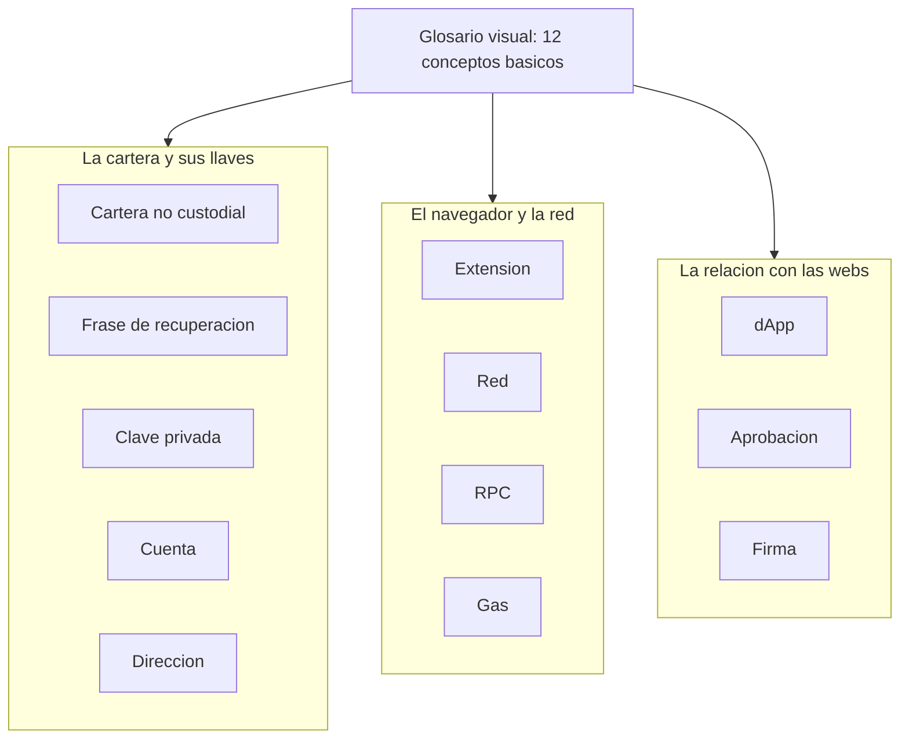

# 01 — Plataforma (Chrome/Edge Manifest V3)

Este manual cuenta, en lenguaje llano, **sobre qué plataforma funciona TrueKeate Wallet** y qué reglas del navegador condicionan la cartera. Está pensado para personas sin perfil técnico: aquí no encontrarás código, sino explicaciones con nombres y números reales.

Tres palabras que aparecerán todo el rato:

- **Extensión**: un pequeño programa que se instala dentro de Chrome o Edge y añade funciones al navegador.
- **Manifest V3**: el conjunto de reglas modernas que Chrome y Edge exigen a las extensiones. Es como el «reglamento del edificio»: dice qué puede hacer la extensión y qué no.
- **Service Worker**: el «motor de fondo» de la extensión. No tiene ventana propia, trabaja en segundo plano y el navegador lo puede dormir cuando no hay nada que hacer.

Todo lo que se afirma aquí sale del manual técnico del proyecto o de datos ya verificados en el repositorio. Cuando algo no está comprobado, lo verás escrito literalmente como «pendiente de confirmar».

## Empezar en 5 minutos

### Qué necesitas

- Un ordenador con **Chrome o Edge versión 114 o superior**. El proyecto lo exige así (`minimum_chrome_version` = 114) y funciona igual en los dos navegadores.
- **Node.js con npm** para compilar el paquete y ejecutar las tareas del proyecto.
- **Foundry con Anvil**: un programa que crea una red Ethereum de mentira en tu propio ordenador. Sirve para probar sin usar dinero real.
- El **paquete del proyecto** descargado en tu equipo.

### Qué vas a conseguir

- Una extensión llamada **TrueKeate Wallet** con un identificador estable: `oiahebaliobknoeeonhgaacapjcpgblo`. Ese identificador es el mismo en cualquier equipo y en cualquier instalación, porque deriva de la clave pública del manifest.
- Tres ventanas distintas: el **popup** (`index.html`, 380 × 600 píxeles), la **ventana de conexión** (`connect.html`, 420 × 650) y la **ventana de decisión** (`notification.html`, 420 × 640).
- Una **red por defecto** llamada «Anvil Local» en `http://127.0.0.1:8545`, con `chainId` 31337 (en hexadecimal `0x7a69`), moneda ETH de 18 decimales y marcada como red de pruebas.
- Una **dApp de pruebas** (una web que habla con la cartera) en `http://localhost:5174/test.html`.

Conviene que sepas desde el principio qué **no** tiene esta cartera: no admite carteras de hardware (Ledger, Trezor), ni WalletConnect, ni el método `eth_sign`, ni cifrado con contraseña.

### Los pasos mínimos

1. Instala las dependencias del proyecto con `npm ci`.
2. Compila con `npm run build`. Ese único comando genera **seis entradas** en la carpeta `dist/`: `index.html`, `connect.html`, `notification.html`, `background.js`, `content-script.js` e `inject.js`, además de `dist/manifest.json`.
3. Carga la carpeta `dist/` en tu navegador. El manual técnico no describe este paso (es un trámite del navegador, no del programa), así que usa el procedimiento habitual de Chrome o Edge para extensiones en modo desarrollador: **pendiente de confirmar** si tu guía de instalación lo detalla con otro nombre.
4. Arranca el nodo local con este comando, tal cual:

   `anvil --host 127.0.0.1 --port 8545 --chain-id 31337 --allow-origin "chrome-extension://oiahebaliobknoeeonhgaacapjcpgblo,http://localhost:5174,http://127.0.0.1:5174"`

   Dos avisos importantes: la bandera `--allow-origin` admite **una sola lista separada por comas** y no se puede repetir; y `--http.corsdomain` **no existe** en la versión usada (1.7.2-dev). La opción `--silent` es frágil, así que no la uses. El comodín `--allow-origin "*"` solo vale para la máquina aislada del arnés de pruebas.
5. Comprueba que el nodo responde. Devuelve el número de bloque: `cast block-number --rpc-url http://127.0.0.1:8545`. Devuelve el identificador de red: `cast chain-id --rpc-url http://127.0.0.1:8545` (tiene que dar 31337). Y mira un saldo de ejemplo: `cast balance 0xf39Fd6e51aad88F6F4ce6aB8827279cffFb92266 --rpc-url http://127.0.0.1:8545`.
6. Abre `http://localhost:5174/test.html` para probar la cartera como si fuera una web cualquiera.

Antes de seguir, aquí tienes los doce términos básicos que necesitas para leer este manual y el resto de los manuales. Los explicamos con palabras de la calle.

<!-- GENERAR_IMAGEN: glosario-visual.svg -->

1. **Cartera no custodial**: nadie guarda tus llaves por ti. Ni el proyecto, ni el navegador, ni un servidor. Las tienes tú.
2. **Extensión**: el programa que se instala en Chrome o Edge y añade funciones al navegador.
3. **Red**: el «mundo» Ethereum al que te conectas. Aquí, una red de pruebas en tu propio ordenador.
4. **RPC**: el «teléfono» por el que la cartera habla con la red. Cada red tiene su dirección.
5. **Gas**: la comisión que se paga para que una operación se ejecute en la red.
6. **Cuenta**: una posición dentro de la cartera, con su dinero y su nombre o etiqueta.
7. **Dirección**: el número público de una cuenta, el que enseñas para recibir. Empieza por `0x`.
8. **Frase de recuperación**: doce palabras que reconstruyen todas tus cuentas. Es el secreto maestro.
9. **Clave privada**: el secreto de una cuenta concreta. Quien la tenga, controla esa cuenta.
10. **dApp**: una aplicación web que pide cosas a la cartera (conectarse, firmar, enviar).
11. **Aprobación**: el momento en que tú dices «sí» a una petición de una dApp.
12. **Firma**: la prueba criptográfica de que tú has autorizado algo. No se puede deshacer.

## Manifest V3 en este proyecto

### Fuente única tipada: `src/manifest.ts`

El manifest (el fichero que describe la extensión al navegador) **no se escribe a mano** en JSON. Su única fuente es un módulo TypeScript, `src/manifest.ts`, de 92 líneas, que exporta el objeto congelado con `as const`. Lo genera el plugin `closeBundle` de `vite.config.ts` a partir de ese módulo, de modo que `dist/manifest.json` y la suite de pruebas `manifest.spec.ts` usan exactamente los mismos valores, sin posibilidad de que se contradigan.

Traducido: hay **un solo sitio** donde se declara la extensión. Si algo cambia, cambia una vez.

#### Campos declarados

| Campo | Valor | Qué significa |
|---|---|---|
| `manifest_version` | `3` | Se usa el reglamento moderno (Manifest V3) |
| `name` | `'TrueKeate Wallet'` | El nombre que verás en el navegador |
| `version` | la del `package.json` (`1.0.0`) | Una sola fuente de versión |
| `description` | monedero no custodial para red local Anvil | La frase que describe la extensión |
| `key` | `MANIFEST_KEY` (RSA-2048, DER/SPKI en base64) | Clave **pública** que fija el identificador |
| `minimum_chrome_version` | `'114'` | Versión mínima del navegador |
| `icons` | 16 / 32 / 48 / 128 px | Los iconos en cuatro tamaños |
| `action.default_popup` | `'index.html'` | El popup que se abre al pulsar el icono |
| `background` | `service_worker: 'background.js'`, `type: 'module'` | El motor de fondo |
| `permissions` | `storage`, `alarms`, `favicon`, `clipboardRead`, `clipboardWrite` | Los cinco permisos normales |
| `optional_permissions` | `['notifications']` | Los avisos se piden solo si hacen falta |
| `host_permissions` | `127.0.0.1:8545/*` y `localhost:8545/*` | Acceso al nodo local |
| `optional_host_permissions` | `http://127.0.0.1/*`, `http://localhost/*`, `https://*/*` | Permiso de red pedido al vuelo |
| `content_scripts` | 1 entrada (`document_start`, `all_frames`) | El mensajero que se cuela en las webs |
| `web_accessible_resources` | `inject.js`, `use_dynamic_url: true` | El fichero que la web puede cargar |

#### La `key` fija el ID; las ausencias son deliberadas

La `version` se toma del `package.json` para que exista una sola fuente de versión. La `key` es la clave **pública** del par de firma del desarrollador (RSA-2048, en formato DER/SPKI y en base64) y está congelada a propósito: fija el identificador de la extensión en cualquier equipo e instalación. De ahí sale `EXTENSION_ID = 'oiahebaliobknoeeonhgaacapjcpgblo'`, calculado como los primeros 16 bytes del SHA-256 de la clave DER, con cada nibble traducido a una letra de la `a` a la `p`. Ese identificador lo usan la lista de orígenes permitidos de Anvil, la ruta `chrome-extension://<ID>/_favicon/` y la propia suite de pruebas, que lo importa en vez de escribirlo a mano.

Las ausencias también son intencionadas:

- **No** hay `tabs`, **no** hay `activeTab` y **no** hay `scripting`: son permisos retirados.
- `notifications` vive **solo** en `optional_permissions`, porque la función de avisos pertenece a un ciclo posterior del proyecto. Se declara opcional desde el principio para no pedir en la instalación un permiso que todavía no se usa.

En una frase: la extensión pide lo mínimo y lo justifica.

### Generación de `dist/manifest.json`: el plugin `manifestPlugin`

El fichero final lo escribe `manifestPlugin()` dentro de `vite.config.ts`, registrado en el **último** build de la cadena, cuando las seis entradas ya están en disco. Hay un guardia llamado `buildFailed` que evita que una comprobación del manifest tape el error real de un build que ya había fallado.

El plugin **aborta el build** (es decir, no te deja generar un paquete roto) en cuatro casos:

1. Falta alguna de las seis entradas obligatorias (`REQUIRED_ENTRIES`).
2. Falta la `key`. Sin ella el identificador de la extensión no es estable.
3. `notifications` aparece en `permissions` en vez de en `optional_permissions`.
4. Aparece alguno de los permisos retirados: `tabs`, `activeTab` o `scripting`.

Si `notifications` no está en `optional_permissions`, solo hay un aviso por consola. La escritura del fichero es literal: el JSON con dos espacios de sangrado y un salto de línea final.

### La cadena de builds

`npm run build` equivale a `tsc -b && vite build`. Vite 7 no admite que el fichero de configuración exporte un array, así que los builds 2 y 3 se lanzan con la API programática `build()` desde el hook `closeBundle` del build 1.

Un solo comando produce las **seis entradas** en `dist/`:

- Build 1, formato `es`: las tres páginas HTML y el Service Worker.
- Build 2, formato `iife`: `content-script.js`.
- Build 3, formato `iife`: `inject.js` y, además, `dist/manifest.json`.

Los nombres de salida son estables (`[name].js`). Las páginas, que Vite emite en `dist/src/*.html`, se mueven a la raíz de `dist/` con `htmlRootOutputPlugin`; el traslado no rompe nada porque los recursos se referencian con rutas absolutas.

## El Service Worker

### `background.service_worker` con `type: 'module'`

El manifest declara el motor de fondo como `background: { service_worker: 'background.js', type: 'module' }`. Eso encaja con el formato `es` del build 1. La fuente es `src/background.ts` y la salida es `background.js`, una de las seis entradas obligatorias.

### Arranque real: `bootstrap`

`bootstrap` está exportada para las pruebas. Es **idempotente** (da igual cuántas veces se ejecute: el resultado es el mismo) y cada invocación es un arranque, así que escribe **su** entrada `sw_started`. El ciclo normal lo disparan tres cosas: `onInstalled` (primera instalación o actualización), `onStartup` (arranque del navegador) y la evaluación inicial del propio Service Worker.

Sus fases, en orden:

1. Aislamiento del almacén con `applyStorageAccessLevel()`, lo antes posible, y puesta a punto del contador de registros descartados (`hydrateLogDiagnostics()`) que sobrevive a las siestas del motor.
2. Migraciones de esquema, antes de leer ningún estado.
3. Red por defecto: se siembra Anvil con `chainId` `0x7a69`.
4. Comprobación de integridad, que puede dejar la cartera marcada como «dañada».
5. Auto-carga del estado: cuenta activa, red, cuentas importadas, etiquetas y sesiones.
6. Reconciliación de plazos: purga, respuesta `4001` a las solicitudes huérfanas, rearme de alarmas, reconstrucción de las marcas en vuelo y de las ventanas de tasa, y restablecer la ventana única.
7. **Una** entrada `sw_started` por arranque.

Todo este trabajo cabe en menos de 1 segundo, según la cabecera del módulo.

### Registro SÍNCRONO de listeners antes del primer `await`

Antes de la primera llamada a `bootstrap`, el módulo registra **cuatro** escuchadores de forma síncrona: el del puerto de aprobaciones, el de la alarma de vencimiento, el del cierre de ventanas de aprobación y el de los mensajes RPC.

El motivo es sencillo de imaginar: el navegador puede despertar el Service Worker justo **porque** ha llegado una conexión, una alarma o un mensaje. Si el escuchador todavía no existiera, ese aviso se perdería. Por eso todos deben estar listos al final del primer ciclo de evaluación, antes de cualquier espera.

Da igual *por qué* se despierta el motor: el estado se reconstruye siempre igual.

### Medición de `bootMs` (RNF-08, cota < 1 s)

El instante de arranque se captura en la primera línea ejecutable (`const bootStartedAt = Date.now();`) para poder medir la cota de menos de 1 segundo. Al cerrar la fase 6 se calcula `bootMs` y se guarda en `bootSnapshot`, el estado de arranque que se rehace en cada despertar. Ese `bootMs` viaja junto con `bytesInUse` (cuánto ocupa el almacén) dentro de la entrada `sw_started`.

La reconciliación también mide lo que tarda y avisa si se pasa: «la reconciliación de aprobaciones superó 1 s». Su cabecera fija la cota en **menos de 1 segundo con 50 solicitudes pendientes**.

## Ciclo de vida y suspensión

### Qué NO se puede usar en un Service Worker

El navegador **duerme** el Service Worker cuando no hay trabajo. Por eso los temporizadores normales de programa no sirven para controlar un plazo: si el motor se duerme, el temporizador se va con él.

El código lo dice en dos puntos y en el módulo del plazo: **nunca** se usa `setTimeout` ni `setInterval`, porque están prohibidos en el Service Worker y no sobreviven a la suspensión. La consecuencia sería que el plazo nunca dispararía.

Además, un fallo de estas tareas nunca debe romper el arranque: se avisa por consola y el motor sigue funcionando.

### `chrome.alarms`: el dueño único del plazo

El permiso `alarms` está declarado y su uso vive en `src/background/approvals/timeout.ts`. La función `armAlarm(name, expiresAt)` llama a `alarms.create(name, { when: expiresAt })`. Un detalle práctico: si el instante ya pasó, Chrome dispara la alarma de inmediato. Si la API falla, devuelve `false` sin lanzar error.

Sobre esa base se construyen `armExpiryAlarm` y `armInflightReleaseAlarm`. El nombre canónico de la alarma es `truekeate_expire:<approvalId>`, construido con el prefijo `truekeate_expire:`. Existe una función inversa para leer el identificador desde el nombre y un filtro para quedarse solo con las alarmas de este módulo. Hay además una familia de alarmas de liberación de la marca en vuelo: `truekeate_expire:inflight:<cuenta>`.

#### Plazo y vencimiento

El vencimiento está **anclado al momento de creación**:

- Firma: `createdAt + SIGN_TIMEOUT_MS`, con `SIGN_TIMEOUT_MS = 120 000` ms (120 segundos).
- Conexión: `createdAt + CONNECT_TIMEOUT_MS`, que son 60 000 ms (60 segundos).
- La capa de contenido (el mensajero que vive en la web) añade un margen de seguridad de 5 segundos.

Cuando vence, `expireApprovalRequest` marca la entrada como `expired` con la hora de resolución y el código de error **4001**, entrega el error de vencimiento con este mensaje («El usuario no respondió en el plazo establecido (<segundos> s); la solicitud ha caducado.»), pasa la ventana única a la siguiente solicitud pendiente o la cierra, limpia la insignia y escribe la entrada `approval_expired`. La operación es **idempotente**: si la entrada ya no estaba pendiente, limpia su alarma y no entrega nada.

#### Rearme al despertar

`rearmExpiryAlarms` vuelve a poner la alarma de **cada** solicitud pendiente usando su `expiresAt` guardado, y retira las alarmas huérfanas. Hay una regla de seguridad clara: una entrada sin `expiresAt` numérico se rearma con `now + SIGN_TIMEOUT_MS`. **Nunca se deja una solicitud sin plazo.** La función devuelve cuántas armó, cuántas limpió y cuántas quedan pendientes.

El escuchador se registra de forma síncrona y atiende **solo** alarmas de su prefijo. No se envuelve en el cerrojo de lectura-modificación-escritura porque anidarlo dos veces bloquearía la cadena para siempre.

### Reconciliación al despertar

El invariante «reconciliación al arrancar» lo implementa `src/background/approvals/reconcile.ts`, llamado desde la fase 6. Nunca rompe el arranque: si falla, avisa por consola y el motor sigue operativo.

`reconcileApprovals` ejecuta, en orden:

1. **Una sola lectura** de `truekeate_pending_requests`, `truekeate_inflight_tx`, `truekeate_rate_windows` y `truekeate_approval_window`.
2. **Purga** de lo ya resuelto y de lo vencido.
3. Respuesta **4001** a las solicitudes huérfanas, por puerto vivo o por su pestaña y frame.
4. **Rearme de alarmas** desde el `expiresAt` guardado.
5. **Reconstrucción de `truekeate_inflight_tx`** con su tabla de estados: una firma vencida libera la cuenta; una difusión con recibo se confirma o falla; una difusión sin recibo dentro del tiempo de vida se conserva.
6. **Reconstrucción de `truekeate_rate_windows`** reutilizando la misma lógica del limitador, sin duplicarla.
7. **Ventana única**: una sola ventana mostrando la solicitud pendiente más antigua.
8. **Una** entrada `sw_reconcile` más las trazas de lo descartado, todo en una sola escritura.

La cota se consigue así: el estado se lee una vez, las escrituras se agrupan y las trazas se guardan en un único `set`.

### Puerto de larga vida: canal y correlación, NO keep-alive

El puerto se llama `truekeate_approval` y está descrito en el propio código como un canal, **no** como un truco para mantener el motor despierto. El Service Worker lo atiende en `registerApprovalPortListener`: filtra por nombre y, si el mensaje es `RESUME`, atiende el `approvalId` correspondiente; cualquier otro mensaje por ese puerto se responde con **4200**. Al desconectarse, se retira el vínculo de esa instancia del índice temporal.

Ese índice (`portsByApprovalId`) es estado **volátil admisible**: es solo un índice de transporte y se puede reconstruir. El motor puede dormirse y perderlo; el mensajero de la web se reconecta con espera creciente y reenvía `RESUME`.

Un dato importante y medido en el repositorio: el puerto **no** impide que el navegador suspenda el Service Worker a los ~30 segundos de inactividad.

Sus dos funciones son transportar la solicitud completa al reanudar y entregar la resolución. La entrega prueba en este orden: puerto vivo (publica y **cierra** el puerto), pestaña viva (`chrome.tabs.sendMessage` con el `frameId` exacto, solo si es distinto de 0) y, si no hay destinatario, `'none'`.

Hay otra medición real del repositorio: el único canal que alcanza `notification.html` es `chrome.runtime.sendMessage`, porque esa ventana es una **página de la extensión**, no un mensajero inyectado en una web. `chrome.tabs.sendMessage` se conserva como respaldo, pero responde «Could not establish connection. Receiving end does not exist.» para una página `chrome-extension://`.

## Content script

### Declaración en el manifest

El manifest declara una única entrada de mensajero con `matches: ['<all_urls>']` (todas las direcciones web), exclusiones para los sitios donde ya está MetaMask, `js: ['content-script.js']`, `run_at: 'document_start'` y `all_frames: true`.

`document_start` es lo que permite publicar `window.truekeate` **antes de cualquier script de la página**. `all_frames: true` instala el mensajero en todos los marcos de la página; cada marco conserva su `frameId` para que la respuesta vuelva al marco exacto.

#### La nota real sobre `chrome-extension://` (`src/manifest.ts:70-77`)

El manifest conserva el comentario de la corrección H1, y merece la pena entenderlo porque es un error clásico:

- `chrome-extension://*/*` **no** es un patrón válido para `content_scripts`.
- Si se escribe, Chrome rechaza el manifest entero con el mensaje «Invalid value for 'content_scripts[0].exclude_matches[0]'» y **la extensión no carga**.
- Además es innecesario: `<all_urls>` no incluye el esquema `chrome-extension://`.

Las exclusiones que sí se conservan son las de MetaMask, para no inyectar el mensajero donde ya hay otro proveedor de cartera.

### El puente por `window.postMessage`

`src/content-script.ts` (603 líneas) es el «relay página ↔ extensión» en los **dos saltos** del protocolo. El protocolo tiene 8 tipos de mensaje cerrados.

Toda entrada desde la página pasa por `readPageEnvelope`, que exige dos condiciones a la vez: `event.source === window` **y** `event.origin === location.origin`. Además, el tipo debe estar en la lista `ACCEPTED_FROM_PAGE = ['TRUEKEATE_REQUEST', 'TRUEKEATE_ANNOUNCE']`. Cualquier otro mensaje se descarta.

La salida usa siempre un destino cerrado: `postToPage` emplea `location.origin` y **nunca** el comodín `'*'`, que está prohibido. Los tipos que se reenvían son el conjunto cerrado `FORWARDED_TO_PAGE = ['TRUEKEATE_RESPONSE', 'TRUEKEATE_EVENT']`.

`forwardToPage` reenvía el sobre **sin reconstruirlo**: `eventName`, `data` y cualquier campo extra (por ejemplo el `origin` del sobre) viajan idénticos. Sus dos únicos efectos son de observación: dar por resuelta una respuesta empujada que encaja con una petición en vuelo, y recordar el `approvalId` para el `RESUME`.

### Su papel de relay

El relay **no interpreta** el método ni los parámetros: el método viaja literal aunque no exista en el catálogo, y ya será el Service Worker quien responda **4200**. El origen, el `tabId` y el `frameId` viajan como `null` porque el Service Worker los sustituye por los datos reales del remitente. El `id` que generó la página viaja como `requestId`, para que el Service Worker lo guarde con la solicitud y la respuesta vuelva con ese mismo `id`.

Un dato tranquilizador: **ningún secreto cruza `window.postMessage` ni este relay**.

#### Transporte con espera acotada y reintento seguro

El relay mantiene las llamadas en curso en `inFlight` y distingue **dos clases de fallo**:

- **Recuperable**: el mensaje no llegó a nadie. El patrón que lo detecta es «could not establish connection» o «receiving end does not exist». Reintentar es seguro y además despierta al Service Worker dormido. La espera creciente local es de 250, 500, 1000 y 2000 ms.
- **Fatal**: el patrón es «extension context invalidated». Significa que la extensión se recargó o quedó huérfana; se responde de inmediato.

Cualquier otro fallo (por ejemplo, el canal se cerró cuando el Service Worker ya estaba trabajando) **no** se reintenta, porque sería un efecto duplicado; se espera la resolución empujada hasta agotar `TRANSPORT_TIMEOUT_MS`, que es `SIGN_TIMEOUT_MS + TIMEOUT_SAFETY_MARGIN_MS`. Esos temporizadores son locales al contexto y admisibles: **no** son plazos de aprobación; el plazo lo posee `chrome.alarms` en el Service Worker.

### Instalación idempotente y orden de los canales

`installRelay` ejecuta cuatro pasos en un orden deliberado:

1. Canal **externo de entrada** (`window.addEventListener('message', …)`) antes de inyectar nada, para que el saludo EIP-6963 y la primera petición encuentren siempre al relay escuchando.
2. Canal **interno de entrada** (`chrome.runtime.onMessage`) para respuestas empujadas y eventos.
3. Inyección **síncrona** del proveedor.
4. Apertura del puerto de larga vida.

Es idempotente por documento y marco gracias a la marca `__truekeateRelayInstalled__`.

El puerto lo abre `connectPort` con `chrome.runtime.connect({ name: APPROVAL_PORT_NAME })`, reenvía lo que llega y, ante una desconexión, programa una reconexión con espera de 1, 2, 4, 8 y 16 segundos, con tope de
30. Al conectar reenvía un `RESUME` **solo si ya ha visto un `approvalId`**. El puerto es canal de
transporte y correlación, nunca un truco para mantener vivo el motor.

## Inyección del provider

### Cómo se construye la etiqueta `<script>`

`injectProviderBundle` crea una etiqueta `<script>` con `script.src = runtime.getURL(INJECT_SCRIPT_PATH)` (donde `INJECT_SCRIPT_PATH = 'inject.js'`), `script.async = false` y el atributo `data-truekeate-inject="1"`, y la inserta en `document.head` o, si no existe, en `document.documentElement`.

¿Por qué así y no con `chrome.scripting`? Porque el manifest de mínimos privilegios retiró el permiso `scripting` y declara `inject.js` como recurso accesible desde la web. El `async = false` garantiza que la ejecución respeta el orden de inserción respecto del resto de scripts.

#### Momento de la inserción y prueba de inyección

La inserción ocurre en el paso 3 de `installRelay`, **después** de registrar el canal de entrada y **durante** `document_start`. Es decir: primero se escucha y acto seguido se inyecta, de modo que `window.truekeate` exista antes de cualquier script de la página.

La etiqueta lleva la marca `data-truekeate-inject="1"`, que es la prueba de inyección que exige el proyecto para creer que hay relay. Del otro lado, `relayAttached()` comprueba en `document.currentScript` que el atributo vale `'1'`. Si el bundle se evalúa de otra forma, no hay mensajero al que preguntar y el proveedor responde **4200** en lugar de dejar la promesa colgada. Ninguna otra ruta de carga (una importación directa en un arnés de pruebas o una copia servida por la propia página) lleva la marca.

Como refuerzo, el proveedor y su alias se definen con `Object.defineProperty(…, { writable: false, configurable: false, enumerable: true })` sobre `window.truekeate` y `window.codecrypto`. La página no puede reasignarlos ni borrarlos.

### Por qué el build de `inject` es `iife`

La configuración lo razona en dos partes:

1. El formato `iife` se usa para `content-script.js` e `inject.js`: un mensajero de contenido no admite `import`, y el proveedor se inyecta como `<script>` síncrono en `document_start`.
2. `format: 'iife'` junto con `inlineDynamicImports: true` obligan a **una sola entrada por build** (Rollup rechaza dividir el código en IIFE). Por eso hay un build IIFE por entrada: build 1 = páginas y Service Worker en `es`, build 2 = content script, build 3 = inject (que además genera y valida `dist/manifest.json`).

La configuración común fija `target: 'chrome114'`, `format: 'iife'`, `inlineDynamicImports: true`, `emptyOutDir: false` y `publicDir: false`. Un bundle IIFE autocontenido es requisito del `<script>` clásico: cualquier `import` sería inválido en ese contexto y el proveedor debe publicarse de una sola vez.

### `web_accessible_resources` con `use_dynamic_url: true`

El manifest declara `resources: ['inject.js']` con `matches: ['<all_urls>']` y `use_dynamic_url: true`. Eso significa que Chrome sirve `inject.js` a través de un **origen dinámico** propio de la instalación, en lugar de la dirección literal `chrome-extension://<ID>/inject.js`.

La consecuencia práctica: el identificador de la extensión **no queda expuesto** en el `src` que la página puede leer, mientras que el mensajero sigue obteniendo una dirección válida porque la resuelve en tiempo de ejecución con `chrome.runtime.getURL('inject.js')` en vez de componerla a mano.

El identificador estable `EXTENSION_ID` sigue siendo el que consumen la lista de orígenes de Anvil y la ruta `chrome-extension://<ID>/_favicon/`: `use_dynamic_url` afecta al recurso declarado, no a la identidad de la extensión. El detalle exacto del origen dinámico (cuándo caduca el identificador) no se puede verificar dentro del repositorio: **pendiente de confirmar** contra la documentación oficial.

## Ventanas de la extensión

### Las 3 páginas HTML y su tamaño declarado

| Página | Clase del `<body>` | Tamaño |
|---|---|---|
| `src/index.html` (popup) | `tk-popup` | 380 × 600 px |
| `src/connect.html` (conexión) | `tk-connect` | 420 × 650 px |
| `src/notification.html` (confirmación) | `tk-notification` | 420 × 640 px |

Cada HTML es mínimo: metadatos, favicon, un `
` y el `main.tsx` de su vista. Los tamaños viven como variables en `src/styles/tokens.css` y se aplican al `body` en `src/styles/base.css`, con `overflow: hidden`.

La altura se fija de forma explícita y **nunca** con `100vh` en estas tres páginas: el contenedor interno hereda el 100 % en lugar de estirarse a la altura de la pestaña. La página de pruebas `test.html` no lleva esas clases porque allí el diseño es fluido.

#### Cómo se abren

Hay dos maneras de abrir una ventana: el navegador abre el popup al pulsar el icono, y las otras dos ventanas las abre el propio motor de la extensión.

#### `notification.html` y `connect.html`: `chrome.windows.create`; `index.html` (popup)

- **Ventana de decisión (`notification.html`)**: se abre desde `showOldestPending` con `windows.create({ url: …, type: 'popup', width: 420, height: 640, focused: true })`. La dirección se compone con `chrome.runtime.getURL` y el correlador `?approvalId=…&origin=…`; sin ese correlador la ventana no tendría nada que pedir. `focusWindow` solo la trae al frente al abrir o al cambiar de solicitud.
- **Ventana de conexión (`connect.html`)**: mismo patrón, con `?requestId=…&origin=…`, `type: 'popup'`, 420 × 650 y `focused: true`. Si la apertura falla, la solicitud se rechaza con **4001** y **no** se guarda ninguna sesión.
- **Popup (`index.html`)**: no se abre con `chrome.windows.create`. Lo declara el manifest como `action.default_popup` y el navegador lo muestra al pulsar el icono, con las dimensiones que fija el CSS de la página.

### La invariante de ventana ÚNICA de `notification.html` y el cierre con la X

`focus.ts` declara cinco invariantes; aquí importan tres:

1. **Como máximo UNA `notification.html` en toda la extensión.** Si `windowId` no es nulo, hay exactamente una ventana. Dos solicitudes simultáneas de orígenes distintos producen **una sola** llamada a `chrome.windows.create`, porque el «leer → decidir → crear» va bajo un cerrojo.
2. `shownApprovalId` es SIEMPRE la solicitud pendiente **más antigua** (orden FIFO). Las demás esperan en la cola, sin ventana ni estado propio.
3. Cuando la solicitud mostrada deja de estar pendiente, la **misma** ventana pasa a la siguiente y, si no queda ninguna, se cierra y se guarda `windowId: null`.

El cerrojo que lo garantiza se toma SIEMPRE antes que el cerrojo general de lectura-modificación-escritura. El estado de la ventana se guarda (`truekeate_approval_window`), así que sobrevive a las siestas del motor; de ahí que se vuelva a descubrir la ventana por su dirección y que se compruebe que esa dirección pertenece al origen de **esta** extensión. Esa comprobación corrige el defecto D-H4-E5: comparar solo el nombre de la página hacía que una web servida en `/notification.html` se diera por buena.

El cierre por parte del usuario se atiende con `chrome.windows.onRemoved`, registrado de forma síncrona. La regla es: **cerrar con la X equivale a RECHAZO (4001)**, salvo que el plazo ya haya vencido, en cuyo caso prevalece «expirada». Para no confundir ese cierre con los que hace la propia extensión, el estado se marca como cerrado **antes** de llamar a `windows.remove`.

## Permisos

### `permissions`: los cinco declarados

Los cinco permisos son `storage`, `alarms`, `favicon`, `clipboardRead` y `clipboardWrite`. Aislar el almacén **no** añade ninguno: el permiso `storage` ya estaba declarado.

| Permiso | Para qué se usa |
|---|---|
| `storage` | Guardar en `chrome.storage.local` (claves `truekeate_*`) y aplicar el nivel de acceso |
| `alarms` | Dueño único del plazo: `truekeate_expire:<approvalId>` |
| `favicon` | Icono del sitio que pide permiso, para la ventana de decisión (`/_favicon/`) |
| `clipboardRead` | Leer el portapapeles al ocultar un valor revelado |
| `clipboardWrite` | Copiar direcciones o valores desde la interfaz |

### `optional_permissions`, hosts y `chrome.permissions.request`

- `optional_permissions: ['notifications']`. El motivo está en el propio manifest: la función de avisos pertenece al ciclo posterior, así que se declara opcional desde el principio.
- `host_permissions: ['http://127.0.0.1:8545/*', 'http://localhost:8545/*']`: los dos orígenes del nodo local, coherentes con una cartera Ethereum no custodial para red local Anvil, de desarrollo y sin fondos reales.
- `optional_host_permissions: ['http://127.0.0.1/*', 'http://localhost/*', 'https://*/*']`: la declaración sobre la que el alta de redes pide el permiso **en tiempo de ejecución**.

Ese uso existe en `src/background/networks/addChain.ts`: `getPermissionsApi()` lee `chrome.permissions`; `hostPermissionPattern(rpcUrl)` compone el patrón `origen/*`; `requestHostPermission(rpcUrl)` consulta primero si ya se concedió y, si no, lo solicita. Se invoca siempre en el paso 4 del alta, también cuando el alta nace en el popup.

Aquí hay un defecto medido y ya corregido que conviene conocer (H5, `D-H5-A`): antes se llamaba a `chrome.permissions.request` sin más, y esa función **exige un gesto del usuario en el contexto que llama**. Desde el Service Worker, Chrome la rechaza siempre con «This function must be called during a user gesture», incluso con el origen ya concedido. De ahí las dos ramas:

- Si la concesión ya está vigente, se acepta sin llamar a `request`.
- Si no, un rechazo se responde como denegación, **4001**, y la red **no** se guarda.

El gesto lo aporta la superficie que tiene usuario, que es el popup. Para un alta nacida en una dApp quedaría la ventana de confirmación; eso está reportado como defecto `D-H5-B`, con un fallo observable: **4001** sin guardar nada. Existe una copia del mismo comportamiento en el despacho de aprobaciones, donde se afirma que la aprobación del usuario en la ventana única **es** el gesto válido.

### El build FALLA con ciertas combinaciones de permisos

Las invariantes duras se comprueban sobre la fuente única del manifest (`DECLARED_PERMISSIONS`). Las tres primeras **abortan el build**:

1. Falta la `key`.
2. `notifications` está en `permissions` en lugar de en `optional_permissions`.
3. Aparece alguno de los permisos retirados: `tabs`, `activeTab` o `scripting`.

La lista esperada está congelada también en la suite de pruebas, con `EXPECTED_PERMISSIONS` y `RETIRED_PERMISSIONS`.

## Límites de la plataforma

### Código remoto prohibido, CSP de MV3 y ausencia de `eval`

Manifest V3 no permite ejecutar código remoto: todo el JavaScript viaja dentro del paquete. Aquí esa regla se convierte en una comprobación automática, `scripts/lint-prohibited.mjs`, que revisa cada fichero de texto de `src/` y, si existe, de `dist/`. Prohíbe:

- Recursos remotos en el artefacto: `<script src="http…">`, `<link href="http…">`, `@import http…`, `url(http…)`, `.src = 'http…'`, y una lista de hosts de CDN.
- Dependencias ajenas a `ethers` en la capa criptográfica (`viem`, `@scure/bip39`, `@metamask/*`, `axios`).
- **Llamadas propias a `fetch()`**: todo el tráfico RPC sale por el proveedor del Service Worker.
- `chrome.storage.sync`: la persistencia es `chrome.storage.local`.

Las fuentes también son locales (el paquete incluye `public/fonts/*.woff2` con sus licencias) y el manifest **no** declara una CSP propia: se usa la CSP por defecto de MV3, la que prohíbe el script remoto y la evaluación dinámica.

En el código del repositorio **no** aparece ningún `eval` ni `new Function`, y la CSP por defecto de MV3 los impediría aunque se intentaran. El mensajero de contenido no usa `chrome.scripting.executeScript` porque ese permiso se retiró; el proveedor se inyecta como fichero declarado, con la marca de inyección como única prueba de legitimidad.

### `chrome.storage.local` con `setAccessLevel('TRUSTED_CONTEXTS')` y cuota

El módulo M21 aplica `chrome.storage.local.setAccessLevel({ accessLevel: 'TRUSTED_CONTEXTS' })` en **cada** arranque del Service Worker. El motivo es de seguridad y se explica solo: con el nivel por defecto, un mensajero inyectado en una web podría leer `truekeate_mnemonic` y las claves privadas del almacén. El nivel TRUSTED_CONTEXTS deja fuera de lectura a esos mensajeros y mantiene el acceso al Service Worker y a las páginas de la extensión (popup, conexión y decisión).

`applyStorageAccessLevel` es idempotente, **no lanza** y devuelve `false` si la API falta o falla, para no interrumpir el arranque. Se invoca como **primera** operación del arranque, antes de cualquier lectura de estado. La comprobación de disponibilidad recuerda que Chrome incorporó esa función en la versión 102, mientras que el proyecto exige la 114: en el navegador siempre existe.

La cuota del almacén es `STORAGE_QUOTA_BYTES = 10 485 760` bytes (10 MB). Es la cuota por defecto desde **Chrome 114**, exactamente la versión mínima que exige el proyecto, y la que Chrome publica en `chrome.storage.local.QUOTA_BYTES`. La política es clara: **no** se declara `unlimitedStorage`, porque se quiere reducir el consumo (retención FIFO) y hacer que el desbordamiento sea **observable**.

El informe de cuota incluye `usedRatio` y un aviso al llegar al **90 %** del total, y alimenta el evento `sw_started` con el dato `bytesInUse`.

#### Modo de fallo observable de la cuota

El módulo de registro aplica esta política: si guardar se rechaza por cuota, hace **1 reintento** tras aplicar la retención FIFO (límite de 500 entradas globales y 200 por origen). Si vuelve a fallar:

- Se **descarta** la entrada.
- Se incrementa el contador que se publica en `wallet_getLogs.dropped`.
- Se avisa por consola.
- Se intenta guardar la entrada `storage_quota_exceeded`, con el error `-32603` y el mensaje «no se pudo guardar el registro por falta de espacio».

La detección tiene fuente única: `isStorageQuotaError` compara nombre y mensaje contra `QuotaExceededError` y `QUOTA_BYTES`. El contador se guarda en `truekeate_logs_dropped` para sobrevivir a las siestas del motor y se reconstruye al arrancar. La regla de cierre es tajante: **nunca un fallo silencioso**.

### El popup no toca el almacén (RNF-14)

**Solo el Service Worker** lee y escribe el almacén. El popup es interfaz pura: no lee ni escribe el estado de la extensión, y tiene prohibido usar `ethers`. Por eso el popup escribe sus propios textos de error en vez de importarlos del Service Worker: la frontera entre módulos lo impide.

La misma regla alcanza a las ventanas. La ventana de decisión recibe la solicitud **completa** en el sobre, de modo que no necesita leer el almacén. La ventana de conexión la recibe por el mismo camino.

El reparto es posible gracias a la plataforma: `setAccessLevel('TRUSTED_CONTEXTS')` deja a los mensajeros fuera de lectura y el canal `chrome.runtime` es el único puente entre la interfaz y el Service Worker.

## Compatibilidad

### Chrome/Edge >= 114 y APIs con versión mínima

El mínimo se declara en el manifest (`minimum_chrome_version: '114'`) y se aplica también al compilado, en los dos puntos donde se fija el destino: build 1 (páginas y Service Worker) y los builds IIFE (mensajero y proveedor), ambos con `target: 'chrome114'`.

La salida no usa sintaxis que Chrome 114 no entienda, así que el paquete se puede cargar tanto en Chrome como en Edge, porque los dos están basados en Chromium.

| API | Dónde se usa | Versión mínima |
|---|---|---|
| `chrome.storage.local.setAccessLevel` | aislamiento del almacén | **102** (según el código) |
| `chrome.storage.local.QUOTA_BYTES` = 10 MB | cuota observable | **114** (según el código) |
| `chrome.storage.local.getBytesInUse` | medición de cuota en `sw_started` | pendiente de confirmar |
| `chrome.alarms.create/clear/getAll/onAlarm` | dueño del plazo | pendiente de confirmar |
| `chrome.runtime.connect` / `onConnect` y `chrome.runtime.getURL` | canal de aprobaciones y favicon | pendiente de confirmar |
| `chrome.windows.create/get/getAll/update/remove/onRemoved` | ventana única y conexión | pendiente de confirmar |
| `chrome.permissions.request` / `contains` | permiso de host al dar de alta una red | pendiente de confirmar |
| `chrome.tabs.sendMessage(tabId, msg, { frameId })` | entrega de respuestas al marco exacto | pendiente de confirmar |
| `use_dynamic_url` en `web_accessible_resources` | origen dinámico de `inject.js` | pendiente de confirmar |

Solo las dos primeras filas tienen cifra documentada por el propio repositorio. Las marcadas como pendientes se usan en el código, pero su versión de introducción no está verificada dentro del repositorio, así que aquí no se afirma ningún número. El mínimo declarado de 114 está por encima de las dos cifras conocidas (102 y 114).

### Nota sobre el ID y la firma

Como el identificador deriva de la `key`, cualquier instalación del paquete, sea de desarrollo o empaquetada, obtiene el **mismo** identificador: `oiahebaliobknoeeonhgaacapjcpgblo`. Eso hace reproducibles la lista de orígenes permitidos de Anvil, la ruta `chrome-extension://<ID>/_favicon/` y la suite de pruebas en cualquier equipo. Además, la clave privada **no** hace falta para que el proyecto funcione.

## Problemas frecuentes

### El navegador dice que el manifest no es válido y la extensión no carga

**Causa.** Alguien ha añadido `chrome-extension://*/*` como exclusión de `content_scripts`. Ese patrón no es válido y Chrome rechaza el manifest completo con un mensaje parecido a «Invalid value for 'content_scripts[0].exclude_matches[0]'».

**Solución.** Quita ese patrón. No hace falta: `<all_urls>` ya no incluye el esquema `chrome-extension://`. Las únicas exclusiones que deben quedarse son las de MetaMask, para no inyectar el proveedor donde ya hay otro.

### El build no termina y no genera `dist/manifest.json`

**Causa.** El plugin del manifest aborta el build a propósito cuando detecta uno de estos cuatro casos: falta alguna de las seis entradas obligatorias, falta la `key`, `notifications` está en `permissions` en vez de en `optional_permissions`, o aparece un permiso retirado (`tabs`, `activeTab`, `scripting`).

**Solución.** Mira el mensaje del build y corrige la causa. No edites `dist/manifest.json` a mano: se genera y se sobrescribe. La fuente única es `src/manifest.ts`.

### Al rato de no tocar nada, una operación se queda sin respuesta o la cartera «pierde» el estado

**Causa.** El navegador suspende el Service Worker a los ~30 segundos de inactividad. Los temporizadores normales (`setTimeout`, `setInterval`) no sobreviven a esa suspensión, así que no pueden custodiar un plazo. El puerto de larga vida tampoco mantiene vivo al motor: es solo un canal.

**Solución.** No hay nada que arreglar por tu parte: el diseño ya lo cubre. El plazo lo posee `chrome.alarms`, el mensajero se reconecta con espera creciente y reenvía `RESUME`, y al despertar se reconcilia todo el estado. Si ves una solicitud caducada, es el comportamiento previsto: devuelve **4001**.

### No me deja dar de alta una red y responde 4001

**Causa.** El permiso de host se pide con `chrome.permissions.request`, que exige un gesto del usuario en el contexto que llama. Desde el Service Worker, Chrome lo rechaza siempre con «This function must be called during a user gesture».

**Solución.** Da de alta la red desde el popup, que es la superficie donde tú estás interactuando. Si el alta nace dentro de una dApp, ese caso está reportado como defecto `D-H5-B`: el resultado es **4001** y la red **no** se guarda. **Pendiente de confirmar** si una versión posterior lo resuelve.

### Aparece un aviso de falta de espacio al guardar la actividad

**Causa.** El almacén tiene 10 MB y el proyecto **no** pide `unlimitedStorage`, a propósito, para que el desbordamiento sea visible. Antes de descartar nada, el programa aplica la retención FIFO: se van las entradas más antiguas, con un límite de 500 globales y 200 por origen.

**Solución.** Sigue el contador `wallet_getLogs.dropped` y exporta el histórico a JSON para vaciar la actividad. Si aparece el aviso «no se pudo guardar el registro por falta de espacio», es el modo de fallo previsto y observable, nunca un fallo silencioso.

### Veo una ventana pidiendo confirmación que no es de la extensión

**Causa.** Es el defecto D-H4-E5, ya corregido: comparar solo el nombre de la página (`/notification.html`) hacía que una web servida exactamente en esa ruta se diera por buena como ventana de decisión.

**Solución.** La comprobación actual exige que la dirección pertenezca al origen de **esta** extensión. Si te encuentras ese caso, actualiza el paquete: es una corrección ya incluida.

### Aparecen los errores 4900 o 4901 al usar la cartera

**Causa.** El **4900** significa que no se pudo hablar con el nodo: Anvil no está levantado o no responde. El **4901** significa que la red no está registrada o no es la que toca.

**Solución.** Arranca Anvil con el comando de este manual (con la lista de `--allow-origin` en una sola bandera, sin repetirla) y verifica con `cast chain-id --rpc-url http://127.0.0.1:8545`, que debe devolver
31337. Comprueba también que la red que quieres usar está dada de alta.

### La firma caduca antes de que me dé tiempo a leerla

**Causa.** Los plazos son fijos: **120 segundos** para aprobar una firma y **60 segundos** para conectar una dApp. Si no respondes, la solicitud expira con el código **4001**. El secreto revelado en pantalla, en cambio, se oculta a los **30 segundos**. La sesión de una dApp dura **24 horas** y se renueva con el uso.

**Solución.** Responde dentro del plazo. Si caducó, la dApp recibirá el error 4001 y tendrá que volver a pedirlo. Recuerda además los límites anti-abuso: 8 solicitudes pendientes en total, 1 por origen y 6 por minuto y origen.
