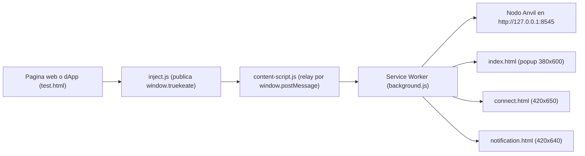

# 02 — Arquitectura por módulos (M1..M66)

Este manual explica **cómo está organizado por dentro TrueKeate Wallet**: qué pieza hace cada cosa, dónde vive y cómo se hablan entre ellas. Está escrito para personas no técnicas, así que cada término raro se explica la primera vez que aparece.

Tres ideas para empezar:

- Un **módulo** es una pieza del programa con una responsabilidad clara (por ejemplo, «firmar» o «guardar ajustes»). El proyecto las numera de M1 a M66.
- El **Service Worker** (el motor de fondo de la extensión) es el único que toca los secretos y la red.
- Las pantallas (popup, ventana de conexión y ventana de decisión) **solo pintan** lo que el motor les cuenta. Nunca leen los secretos.

Todo lo que se afirma sale del manual técnico del proyecto o de datos ya verificados en el repositorio. Cuando algo no se ha comprobado, lo verás escrito como «pendiente de confirmar».

## Empezar en 5 minutos

### Qué necesitas

- Haber leído antes el manual **01 — Plataforma**, porque aquí se dan por sabidas sus palabras (extensión, Manifest V3, Service Worker).
- Saber que los números `M1`, `M2`… son etiquetas internas del diseño, no algo que veas en pantalla.
- Ganas de mirar el árbol del proyecto: cada módulo se cita con su ruta real, por ejemplo `src/background/crypto/sign.ts`.

### Qué vas a conseguir

- Un mapa mental de las **15 capas** en que se agrupan los módulos: desde el manifest hasta los estilos.
- Saber qué módulo abre la ventana de aprobación, cuál firma, cuál habla con la red y cuál guarda las claves, sin entrar en código.
- Entender una regla que lo explica casi todo (RNF-14): **la interfaz nunca usa `ethers`** (la librería que habla con Ethereum) ni lee el almacén. Todo pasa por el Service Worker.
- Conocer las diferencias reales entre lo diseñado y lo construido: 66 módulos de diseño dieron lugar a **94 ficheros de producción** y **154 ficheros** en `src/`, pruebas incluidas.

### Los pasos mínimos

1. Lee la sección «Vista de pájaro» de este mismo manual: ahí están las 15 capas y el sentido en que dependen unas de otras.
2. Mira el mapa de los 15 grupos de módulos que acompaña a esa sección y localiza el grupo que te interesa.
3. Busca en el índice de capas la pieza concreta. Cada pieza se presenta con su ruta real de fichero.
4. Si dudas de si algo funciona, compruébalo con los comandos del proyecto: `npm run typecheck`, `npm run test`, `npm run coverage`, `npm run test:e2e`, `npm run lint:prohibited` y `npm run check:mermaid`. El contrato de pruebas de la red se ejecuta con `npm run forge:test`.
5. Recuerda siempre la frontera: las pantallas piden cosas al motor, y el motor decide y firma.

## Vista de pájaro — capas reales y sentido de las dependencias

El diseño normativo declara **66 módulos, de M1 a M66**. El `src/` real contiene **94 ficheros de producción** y **60 ficheros de pruebas**. Estas son las 15 capas en que se agrupan:

| # | Capa | Módulos |
|---|---|---|
| 1 | Manifest y build | M1 |
| 2 | Service Worker (raíz) | M2 |
| 3 | Núcleo RPC (router, catálogo, cliente, errores, transacciones) | M3, M3.b, M4, M4.a, M4.b, M5, M6, M7 |
| 4 | Criptografía (frase, derivación, firma, revelado, integridad) | M8..M13 |
| 5 | Aprobaciones (cola, plazo, ventana, vistas previas, datos de llamada) | M14, M14.b, M14.c, M15..M19.b, M66 |
| 6 | Seguridad (remitente, nivel de acceso, redacción, hash) | M20, M21, M22, M22.a |
| 7 | Redes, sesiones y eventos | M23..M27 |
| 8 | Cuentas, ajustes, registros y estado | M28..M34 |
| 9 | Inyección en la página | M35..M38 |
| 10 | Interfaz del popup | M39..M47 |
| 11 | Interfaz de conexión (`connect.html`) | M48, M49 |
| 12 | Interfaz de confirmación (`notification.html`) | M50..M54 |
| 13 | Capa compartida | M55..M63 |
| 14 | Estilos | M64, M65 |
| 15 | dApp de pruebas (`test.html` sobre Anvil) | fuera de `src/` |

Así viaja una petición desde que una web pide algo hasta que el nodo local responde:

<!-- GENERAR_IMAGEN: arquitectura.svg -->

Y este es el mapa de los 15 grupos, para orientarte de un vistazo:

```mermaid
flowchart TB
  R["Los 15 grupos de modulos"]
  R --> G1["1. Manifest y build (M1)"]
  R --> G2["2. Service Worker raiz (M2)"]
  R --> G3["3. Nucleo RPC (M3 a M7)"]
  R --> G4["4. Criptografia (M8 a M13)"]
  R --> G5["5. Aprobaciones (M14 a M19.b y M66)"]
  R --> G6["6. Seguridad (M20 a M22.a)"]
  R --> G7["7. Redes y sesiones (M23 a M27)"]
  R --> G8["8. Cuentas y estado (M28 a M34)"]
  R --> G9["9. Inyeccion en la pagina (M35 a M38)"]
  R --> G10["10. Interfaz del popup (M39 a M47)"]
  R --> G11["11. Conexion (M48 y M49)"]
  R --> G12["12. Confirmacion (M50 a M54)"]
  R --> G13["13. Capa compartida (M55 a M63)"]
  R --> G14["14. Estilos (M64 y M65)"]
  R --> G15["15. dApp de pruebas (test.html)"]
```

<!-- GENERAR_IMAGEN: mapa-modulos.svg -->

**Sentido de las dependencias.** La regla RNF-14 manda: el paquete de `ethers` vive SOLO en el Service Worker, así que la interfaz no importa ni `ethers` ni nada de `src/background/**`. Está verificado con una búsqueda de `from 'ethers'` en `src/popup/**`, que no devuelve ninguna coincidencia, y la prohibición se declara por escrito en cinco ficheros de la interfaz.

En palabras llanas:

- El proveedor inyectado y el mensajero hablan con la capa compartida.
- El mensajero habla con el Service Worker por el canal de la extensión.
- El popup habla con la capa compartida: **nunca** con el motor por dentro, **nunca** con `ethers`.
- La ventana de conexión usa la capa compartida y algunos tipos del popup.
- La ventana de decisión usa la capa compartida.
- El motor usa `ethers`, la capa compartida y las funciones del navegador.

Existe una **inversión deliberada**: los módulos de validación compartida (M58..M61) se crearon para que el popup pudiera validar sin `ethers`, y sin embargo importan los constructores de error del Service Worker, porque la tabla de mensajes de error tiene una sola fuente. Es dependencia de constructores puros, no de criptografía.

## Capa 1 — Manifest y build

### M1 `src/manifest.ts`

#### Detalle

Fuente única del manifest de Manifest V3, que **no se escribe a mano**. El fichero final lo genera el plugin de `vite.config.ts`. De la clave pública `MANIFEST_KEY` deriva el identificador estable de la extensión.

## Capa 2 — Service Worker (raíz)

### M2 `src/background.ts`

#### Detalle

Punto de entrada del motor de fondo. Orden de arranque: aislar el almacén (M21) → migraciones (M34) → comprobar integridad (M13) → cargar el estado (M33) → reconciliar plazos (M16) → escribir **una** entrada `sw_started`. Los canales de conexión y de mensajes se registran de forma síncrona antes de la primera espera.

## Capa 3 — Núcleo RPC

### M3 `src/background/rpc/router.ts`

#### Detalle

El despachador: por aquí entran todas las peticiones internas. Orden de controles: redacción (M22) → guarda de remitente (M20) → comprobación contra la lista cerrada de métodos (M56) y el catálogo (M4) → lista de contextos permitidos → limitador de tasa (M3.b) → los 6 métodos que piden aprobación (M19.b) → despacho.

### M3.b `src/background/rpc/rateLimit.ts`

#### Detalle

Limitador de **todo** el catálogo, por origen, guardado en `truekeate_rate_windows`. La ventana es de 6 solicitudes cada 60 segundos y cubre también las lecturas. Al pasarse responde **4001** sin abrir ninguna ventana. El origen «extension» no consume turno. La escritura se retrasa un poco para no escribir de más.

### M4 `src/background/rpc/catalog.ts`

#### Detalle

Catálogo **cerrado** de métodos: los 16 internos `wallet_*` y las 10 lecturas de página. `eth_sign` no está y **nunca se añadirá**. `wallet_revokePermissions` es el único con doble contexto. Ningún método interno abre la ventana única de decisión.

### M4.a `src/background/rpc/internalMethods.ts`

#### Detalle

Lista cerrada de los métodos internos `wallet_*`, en un módulo hoja (sin dependencias). Antes vivía dentro de `catalog.ts` y cerraba un círculo entre catálogo, sesiones y guarda de remitente que hacía responder «error interno» a **cualquier** petición.

### M4.b `src/background/rpc/pageMethods.ts`

#### Detalle

Catálogo cerrado de los métodos de página EIP-1193: las 10 lecturas. `eth_accounts` **nunca** abre ventana y renueva el vencimiento de la sesión a 24 horas desde el último uso. `eth_requestAccounts` abre `connect.html` (420 × 650) solo si no hay sesión vigente, y no guarda estado propio.

### M5 `src/background/rpc/client.ts`

#### Detalle

Un **único** proveedor de `ethers` para todo el tráfico, con política cerrada de reintentos: 1 intento más 3 reintentos (4 llamadas en total), espera creciente de 1, 2 y 4 segundos y 5 segundos de espera por intento. Nada de esto se puede ajustar desde la interfaz. Si se agotan los intentos, lanza siempre el error **4900**.

### M6 `src/background/rpc/errors.ts`

#### Detalle

Catálogo de códigos de error EIP-1193 y construcción de los objetos de error. Regla dura: todo error que el usuario puede ver lleva un `code` numérico. Traduce la tabla de errores del proyecto sobre **8 códigos**.

### M7 `src/background/rpc/txContract.ts`

#### Detalle

Contrato observable de una transacción. `eth_sendTransaction` devuelve el **hash** sin esperar el recibo. La estimación de comisión ocurre **antes** de abrir la ventana; si falla, responde `-32000` y no se abre nada. Estados: `pending` → `confirmed`, `reverted` o `failed`. Cada transición genera exactamente una entrada de actividad.

## Capa 4 — Criptografía (solo Service Worker)

### M8 `src/background/crypto/mnemonic.ts`

#### Detalle

Genera y comprueba la frase de recuperación BIP-39 dentro del motor: 128 bits que producen **12 palabras**, normalización y checksum. El valor nunca se registra en la actividad; para eso existe una huella (`mnemonicFingerprint`).

### M9 `src/background/crypto/hd.ts`

#### Detalle

Deriva las cuentas a partir de la frase con la ruta vinculante `m/44'/60'/0'/0/i`, donde `i` es el índice de la cuenta. Se crean **5 cuentas por defecto**. Las claves no salen del motor salvo por el revelado expreso, y **nunca** acaban en los registros de actividad.

### M10 `src/background/crypto/importAccount.ts`

#### Detalle

Importa una cuenta a partir de su clave privada. Valida el formato `0x` más 64 caracteres hexadecimales y que el valor esté en el rango válido de la curva; calcula la dirección y la guarda con checksum EIP-55 (formato mixto de mayúsculas que detecta erratas). El material sensible nunca se registra.

### M11 `src/background/crypto/sign.ts`

#### Detalle

**Única vía de firma**: ninguna otra parte firma ni toca la clave privada. Firma transacciones modernas (tipo 2, con comisión siempre mayor que cero y el identificador de red dentro de la firma), transacciones antiguas (EIP-155) y mensajes de dos formas (datos tipados EIP-712 y firma personal con su prefijo reglamentario). Una red ajena se **rechaza con 4901 sin firmar**.

### M12 `src/background/crypto/secrets.ts`

#### Detalle

Revelado y exportación del material de recuperación. Exige confirmación explícita, solo funciona en contextos de confianza con ruta permitida y bloquea con `-32000` si hay una sesión de dApp vigente. Higiene de **30 segundos**: el valor se oculta al perder el foco y se borra del portapapeles. El popup no puede importar este módulo porque arrastraría `ethers`; lo consume a través de `wallet_revealSecret`.

### M13 `src/background/crypto/integrity.ts`

#### Detalle

Comprueba la integridad de la cartera al arrancar. Si un checksum BIP-39 o EIP-55 no cuadra, el estado queda marcado como «cartera dañada», con **cero derivaciones silenciosas**: el contador de derivaciones es siempre 0 cuando algo falla.

## Capa 5 — Aprobaciones

### M14 `src/background/approvals/queue.ts`

#### Detalle

Cola persistida `truekeate_pending_requests`. Las escrituras se serializan con un cerrojo y el único que escribe es el Service Worker. Límites: 8 solicitudes globales, 1 por origen y 6 por minuto; máximo 64 KiB por solicitud. Las transacciones se serializan por cuenta y no se usa ningún temporizador.

### M14.b `src/background/approvals/decisions.ts`

#### Detalle

El registro de **espera** de la decisión. El almacén del navegador no puede resolver una promesa, así que este es el punto único donde se resuelve, por cualquiera de las tres vías de cierre: la respuesta de la ventana, el cierre con la X o el vencimiento. El mapa de esperas es temporal y nunca se guarda.

### M14.c `src/background/approvals/responses.ts`

#### Detalle

Decisión del usuario por el canal de respuesta de `notification.html`. Solo esa ventana puede decidir; las respuestas duplicadas se ignoran. Un rechazo o un vencimiento producen **4001**, y la misma ventana pasa a la siguiente solicitud o se cierra.

### M15 `src/background/approvals/timeout.ts`

#### Detalle

Dueño **único** del plazo, con las alarmas del navegador. Firma: 120 000 ms. Conexión: 60 000 ms. La alarma se llama `truekeate_expire:<approvalId>`. `setTimeout` y `setInterval` están prohibidos. Al vencer, se guarda el código **4001**.

### M16 `src/background/approvals/reconcile.ts`

#### Detalle

Reconciliación al arrancar el motor: una sola lectura de cuatro claves, purga de lo resuelto y lo vencido, respuesta **4001** a las solicitudes huérfanas, rearme de alarmas, reconstrucción de las marcas en vuelo y de las ventanas de tasa, ventana única y **una** entrada `sw_reconcile`. Cota declarada: menos de 1 segundo con 50 solicitudes pendientes.

### M17 `src/background/approvals/ports.ts`

#### Detalle

El puerto de larga vida `truekeate_approval`: índice de puertos, mensaje de reanudación `RESUME` con la solicitud **completa** (incluidas sus tres vistas previas) y entrega de la respuesta. La entrega prueba por orden puerto vivo, pestaña viva con el marco exacto y, si no hay nadie, descarte trazado. Es transporte y correlación, **no** un truco para mantener despierto el motor.

### M18 `src/background/approvals/focus.ts`

#### Detalle

La ventana de decisión **global única** (`notification.html`): abrir o reutilizar por identificador de ventana, redescubrirla por su dirección y mostrar siempre la solicitud pendiente más antigua con su contador. Como máximo hay una; cerrar con la X equivale a rechazo **4001** salvo que ya haya vencido. El estado se guarda en `truekeate_approval_window`.

### M19 `src/background/approvals/preview.ts`

#### Detalle

Construye las **tres vistas previas** de la ventana única y sus avisos de riesgo. Aquí no se decodifica nada: el selector, el nombre de la función y los argumentos vienen literalmente de M66. Si no hay etiqueta local, se muestra «desconocido». Hay aviso cuando el contrato verificador es la dirección cero o no tiene código, y el desajuste de red exige doble confirmación. La vista previa se recorta por encima de 4096 bytes.

### M19.b `src/background/approvals/dispatch.ts`

#### Detalle

La ruta de producción de los **6 métodos que piden aprobación**, y el cierre del defecto `D-H4-E1`: hasta que llegó, esos métodos estaban declarados pero nadie los usaba, así que la ventana **nunca se abría** (en las pruebas se veía un tiempo de espera de 20 000 ms). Orquesta sin duplicar: contexto y red activa (sin sesión → **4100**) → estimación de comisión antes de la ventana → vista previa → alta en la cola → plazo → ventana → espera.

### M66 `src/background/approvals/calldata.ts`

#### Detalle

Tabla **local y cerrada** de selectores: la única fuente que decodifica los datos de una llamada a contrato. Es el oráculo contra la «firma ciega». Los selectores reconocidos **no** se amplían en tiempo de ejecución: sin lista remota, sin interfaz de contrato descargada y sin servicio externo de firmas. Fuera de la tabla, el nombre de función es nulo y se marca como llamada a contrato no reconocida. Solo se muestran valores simples y direcciones, con los enteros grandes como texto decimal, y las llamadas múltiples se decodifican de forma recursiva.

## Capa 6 — Seguridad

### M20 `src/background/security/senderGuard.ts`

#### Detalle

Guardas del canal interno entre el mensajero o el popup y el motor. El remitente debe ser la propia extensión; si no, se responde **4100**. Hay listas de rutas permitidas (solo `notification.html` puede decidir una firma y solo `connect.html` puede responder a una conexión) y de métodos internos. El origen se recalcula **solo** desde el remitente, y si el mensaje viene de un marco incrustado queda prohibido fiarse de la dirección de la pestaña.

### M21 `src/background/security/accessLevel.ts`

#### Detalle

Aplica el nivel de acceso `TRUSTED_CONTEXTS` al almacén en **cada** arranque. Sin él, un mensajero inyectado en una web podría leer la frase de recuperación y las claves privadas. Esta llamada no añade ningún permiso nuevo: el permiso de almacenamiento ya estaba declarado.

### M22 `src/background/security/redaction.ts`

#### Detalle

Política de redacción de lo que se guarda. **Nunca** se persiste la frase de recuperación, una clave privada ni una firma completa. Los datos de una llamada se recortan a sus primeros 10 bytes más su longitud; la firma personal guarda dirección y hash, y la firma de datos tipados guarda el hash del mensaje. Solo lo usa el motor, porque depende de `ethers`.

### M22.a `src/background/security/hash.ts`

#### Detalle

Normaliza el `sha256` de `ethers`, un defecto de entorno ya medido: en las pruebas, el valor llega de otro espacio de memoria y la comprobación de tipo falla con «invalid BytesLike value»; en el navegador ya es correcto y se devuelve sin tocar. La corrección es idempotente y sin coste, pero debe importarse **antes** de usar `sha256`.

## Capa 7 — Redes, sesiones y eventos

### M23 `src/background/networks/catalog.ts`

#### Detalle

Catálogo de redes del motor, con la red Anvil local por defecto. **No** hay redes remotas: la única sembrada es `http://127.0.0.1:8545`, y no se incluye Sepolia. Dar de alta una red **nunca** la activa. El identificador de red se valida en forma hexadecimal canónica o decimal coherente, y el servidor de la red se revisa antes de aceptarlo, con rechazo de direcciones privadas y de enlace local. Cada red lleva su marca de red de pruebas.

### M24 `src/background/networks/switch.ts`

#### Detalle

Cambio de red con aprobación del usuario. Hay cuatro casos: si ya está activa, responde `null` sin ventana y sin avisar a nadie; si está dada de alta y es distinta, crea **una** solicitud pendiente y, al aprobar, escribe la red activa, avisa a **todas** las pestañas y responde `null`; si no está dada de alta, responde **4901** sin ventana ni cola; y si se rechaza o vence, responde **4001** y la red **no** cambia.

### M25 `src/background/networks/addChain.ts`

#### Detalle

Alta de red con aprobación explícita y permiso de host pedido en tiempo de ejecución. Orden: validación previa (esquema, servidor, identificador, símbolo y marca de pruebas) → comprobación de coherencia contra el nodo → aprobación del usuario → petición de permiso, **siempre** en tiempo de ejecución, también desde el popup → guardado con `isDefault: false` sin tocar la red activa. Si el permiso se deniega, la red no se guarda y se responde **4001**.

### M26 `src/background/sessions.ts`

#### Detalle

Sesiones de dApp por origen, guardadas en `truekeate_connected_sites`, con 24 horas renovables. Sin sesión devuelve lista vacía y no abre ninguna ventana. Leer una sesión vigente refresca el último uso y recalcula el vencimiento. Tras 24 horas sin usar, la entrada se **elimina** y la consulta de cuentas vuelve a devolver lista vacía, sin error. Revocar no crea ninguna solicitud en la cola.

### M26.b `src/background/connections.ts`

#### Detalle

Solicitudes de conexión: la ventana `connect.html` y su respuesta. La verdad está en `truekeate_connect_request`. El vencimiento se comprueba de forma perezosa contra 60 segundos. Como máximo hay 1 solicitud pendiente por origen, y un único punto cierra el ciclo.

### M27 `src/background/events.ts`

#### Detalle

Propaga los avisos de la cartera a **todas** las pestañas por un canal único, y usa el marco exacto solo si el origen no es el principal. Una pestaña sin mensajero no rompe la propagación. No usa temporizadores ni escribe en la actividad.

## Capa 8 — Cuentas, ajustes, logs y estado

### M28 `src/background/accounts.ts`

#### Detalle

Gobierna las cuentas: alta, etiquetas, visibilidad, cuenta activa y baja. Manda sobre las claves `truekeate_mnemonic`, `truekeate_accounts`, `truekeate_imported_accounts`, `truekeate_current_account` y `truekeate_settings`. Las cuentas derivadas de la frase solo se pueden **ocultar**, y derivar no es lo mismo que importar.

### M29 `src/background/settings.ts`

#### Detalle

Los ajustes (`truekeate_settings`): valores por defecto, lectura y escritura con tipos, etiquetas y aceptación de avisos. Sin contraseña. Los indicadores `encryptionEnabled` y `requirePasswordOnOpen` son **siempre falsos**, y el módulo los fuerza aunque el almacén traiga otro valor. La versión del esquema se declara dentro de estos ajustes.

### M30 `src/background/logging/logger.ts`

#### Detalle

Escribe la actividad, **siempre** desde el motor, con exactamente 1 entrada por evento del catálogo. Un nombre de evento que no esté en el catálogo produce un error. La redacción es obligatoria. Aplica la retención FIFO y el modo de fallo visible de la cuota: 1 reintento y un contador de descartes guardado en `truekeate_logs_dropped`.

### M31 `src/background/logging/events.ts`

#### Detalle

Catálogo **cerrado** de la observabilidad: 24 eventos, 5 categorías y 4 niveles. «Sistema», «llamada», «transacción», «firma» y «evento» no son nombres de evento válidos: es una distinción que suele confundirse. El módulo es puro, sin efectos.

### M32 `src/background/logging/retention.ts`

#### Detalle

Retención FIFO de la actividad: **500 entradas globales** y **200 por origen**. Siempre se descartan las más antiguas. Los límites viven en los ajustes y su valor normativo en las constantes compartidas. El módulo es puro; quien escribe es M30.

### M33 `src/background/state/schema.ts`

#### Detalle

Versión del esquema y claves canónicas del almacén. **Toda** clave guardada lleva el prefijo `truekeate_`, y este módulo es su fuente única. Están prohibidos los nombres cortos, el prefijo heredado de un intento anterior y el almacén sincronizado del navegador. El reinicio de la cartera excluye la actividad.

### M33.b `src/background/state/serialLock.ts`

#### Detalle

Cerrojo FIFO de lectura-modificación-escritura sobre el almacén. La auditoría de la fase de pruebas midió que dos módulos hacían ese ciclo sin cerrojo y que una clave de conexión nunca se purgaba; aquí se extrae el mismo patrón para todos. Es un cerrojo temporal y admisible, nunca una fuente de verdad.

### M34 `src/background/state/migrations.ts`

#### Detalle

Versionado y migración del esquema: de la base v1.2 a v1.3 y a v1.4, con cambios que **no** pierden datos. Se elimina una clave antigua en singular; una sesión guardada como texto se convierte al objeto canónico; el nombre de evento se rellena de forma determinista desde la categoría; se añaden etiquetas vacías si faltan; las claves sin prefijo se renombran; una cuenta con la forma heredada `"0"` se normaliza a `idx:0`. Una clave no declarada o desconocida se **rechaza** y se informa de ella, sin copiarla.

## Capa 9 — Inyección en la página

### M35 `src/inject/provider.ts`

#### Detalle

El objeto que la web ve como cartera: `request`, `on` y `removeListener`, con el identificador de red y la dirección seleccionada en caché, refrescados al llegar un aviso. `request` devuelve **siempre** una promesa y nunca lanza de golpe. Solo los 16 métodos de página cruzan el puente; cualquier otro responde **4200**, y ese es el caso de `eth_sign`, retirado. Si no hay puente con el mensajero, responde 4200 en vez de dejar la promesa colgada.

### M36 `src/inject/eip6963.ts`

#### Detalle

El anuncio (y re-anuncio) del proveedor según el estándar EIP-6963, que permite a una web descubrir qué carteras hay instaladas. El escuchador de «¿quién tiene proveedor?» se registra de forma síncrona antes del primer anuncio; se anuncia al cargar, en cada solicitud y al terminar de cargar la página. El anuncio lleva un identificador literal y congelado, y el icono va incrustado dentro del paquete como imagen de 96 px, porque no se permite descargar nada.

### M37 `src/inject/index.ts`

#### Detalle

Entrada **síncrona** que se ejecuta al empezar la página: publica el proveedor y su alias, instala el anuncio, inyecta el puente con el mensajero y correlaciona respuestas. `window.truekeate` y `window.codecrypto` apuntan al **mismo** objeto y no se pueden reasignar ni borrar. Todo mensaje saliente usa el destino de la propia página, nunca el comodín.

### M38 `src/content-script.ts`

#### Detalle

El relay entre la página y la extensión, en los dos saltos del protocolo. Inyecta `inject.js` al empezar la página con una marca de atributo que sirve de prueba. En el primer salto valida que el mensaje venga de la propia ventana y del propio origen; en el segundo usa el canal interno de la extensión y trata el origen, la pestaña y el marco como datos **no fiables** que el motor recalcula. Los avisos se reenvían literalmente.

## Capa 10 — UI del popup

### M39 `src/popup/App.tsx`

#### Detalle

Contenedor del popup de 380 × 600: encabezado de marca, pestañas, estado general y los estados de carga, vacío, error y «cartera dañada». Las pestañas son Cuentas, Recibir, Sitios y Seguridad. Al abrirse pide el estado con `wallet_getState` y **nunca** lee el almacén.

### M40 `src/popup/views/AccountsView.tsx`

#### Detalle

Pestaña «Cuentas»: lista, cuenta activa, añadir, importar (por frase o por clave privada), renombrar, ocultar y eliminar. Sin contraseña y con cero criptografía: crear, importar y derivar son operaciones del motor. Valida en línea antes de enviar. Los saldos llegan del módulo de sondeo y la vista no llama por su cuenta.

### M41 `src/popup/views/ReceiveView.tsx`

#### Detalle

Pestaña «Recibir»: dirección completa, copia al portapapeles y código QR generado en local. La dirección que se muestra, la que se copia y la que se dibuja en el QR son la **misma** cadena.

### M42 `src/popup/views/SendView.tsx`

#### Detalle

Pestaña «Enviar»: transferencia a una dirección externa o entre cuentas propias. Valida en línea dirección, importe y saldo, y estima la comisión. Una estimación fallida **bloquea** el envío y no abre la ventana de decisión; el saldo insuficiente también bloquea. No firma y no difunde. **Pendiente de confirmar** si la duplicación de los textos de error que arrastraba este fichero se resolvió después.

### M43 `src/popup/views/NetworksView.tsx`

#### Detalle

Pestaña «Redes»: lista con la red activa marcada, cambio de red con aprobación y alta sin activarla, con aviso si la red no es de pruebas. La lista y la red activa las publica el motor; el cambio y el alta se piden con los métodos estándar de Ethereum para cambiar y añadir cadenas.

### M44 `src/popup/views/SitesView.tsx`

#### Detalle

Pestaña «Sitios»: sitios conectados con la cuenta que comparten, último uso, vigencia y revocación por origen. La lista la publica el motor, y revocar desde el popup **no** crea ninguna solicitud pendiente.

### M45 `src/popup/views/LogsView.tsx`

#### Detalle

Pestaña «Actividad»: panel con los 24 eventos, los errores en rojo con su código, las operaciones con su hash o firma y la exportación del histórico a JSON. La lectura es siempre por el método de registros; no toca el almacén ni limpia nada, y su única escritura es la descarga del fichero JSON generado en memoria.

### M46 `src/popup/views/SecurityView.tsx`

#### Detalle

Pestaña «Seguridad»: revelado y exportación del material de recuperación, y reinicio destructivo de la cartera. Exige aceptación previa y explícita. El valor está oculto por defecto y, cuando está oculto, el elemento **no existe** en pantalla (no se esconde con estilos). Plazo único de 30 segundos con barra de progreso, y se oculta por temporizador o al perder el foco; al ocultarse, se sobrescribe el portapapeles solo si aún contiene el valor. Nunca viaja por el canal de la página. El orden estricto de guardas del reinicio lo aplica el motor.

### M47 `src/popup/hooks/useBalancePolling.ts`

#### Detalle

Sondeo de saldos: exactamente 1 consulta por cuenta **visible** y ciclo, con un ciclo de 5 segundos. Arranca al abrir la vista y para al cerrarla o al cambiar de cuenta activa. Si el nodo no responde, se suspende sin perder lo ya leído, y nunca lanza dos ciclos solapados. Lleva contadores de peticiones y de ciclos.

## Capa 11 — UI de la ventana de conexión

### M48 `src/connect/App.tsx`

#### Detalle

Ventana de conexión `connect.html`, de 420 × 650. Muestra el sitio que lo pide, todas las cuentas con su saldo real y un selector con la cuenta activa preseleccionada. Se maneja con el teclado: flechas y `Enter` para aceptar, `Esc` para rechazar. Al confirmar envía la cuenta elegida; al cancelar envía el mismo mensaje con éxito falso y **4001**.

### M49 `src/connect/ConnectRow.tsx`

#### Detalle

Fila de cuenta seleccionable de la ventana de conexión. La tarjeta elegida lleva borde de 2 píxeles del color de acento y fondo teñido; toda la fila es la etiqueta del botón de opción del grupo. El área táctil es de al menos 44 píxeles y la dirección se muestra recortada en tipografía monoespaciada, con el texto completo disponible.

## Capa 12 — UI de la ventana de confirmación

### M50 `src/notification/App.tsx`

#### Detalle

Ventana **global única** de decisión, `notification.html`, de 420 × 640. Decide, **no** firma: solo envía la respuesta con éxito o rechazo. Muestra una solicitud a la vez (la pendiente más antigua) con su contador, y mantiene siempre visibles el origen, el icono, la insignia de riesgo y el resumen. Ofrece solo «Aprobar» y «Rechazar», y tanto `Escape` como la X equivalen a rechazo **4001**. El cuerpo de la solicitud se pide por el puerto de aprobaciones y por el canal interno.

### M51 `src/notification/TxPreviewPanel.tsx`

#### Detalle

Resumen de la transacción, siempre visible: cuenta de origen, destino etiquetado, valor, red y comisión estimada. Si hay datos adjuntos, se muestra la llamada decodificada por la tabla local; fuera de esa tabla, el aviso bloqueante lo pinta el panel de riesgos. Una estimación fallida bloquea el envío. Destino vacío significa que se está desplegando un contrato.

### M52 `src/notification/RiskWarnings.tsx`

#### Detalle

Insignia de riesgo y avisos, siempre visibles antes de decidir y con aviso accesible. Un aviso **bloqueante** (contrato no reconocido, contrato verificador que no cuadra o saldo insuficiente) impide aprobar hasta marcarlo explícitamente: es la «firma ciega» que el proyecto considera invalidante. Un aviso **destacado** (permiso ilimitado, autorización total o destino sin etiqueta) no bloquea. El panel es solo presentación.

### M53 `src/notification/TypedDataPanel.tsx`

#### Detalle

Panel de vista previa de la firma de datos tipados (EIP-712). Se muestran siempre el nombre del dominio y el contrato verificador en claro, además del identificador de red del dominio, el tipo principal, los tipos y el mensaje. Si la red del dominio no coincide con la activa, el aviso es destacado y exige doble confirmación; el desajuste del contrato verificador (dirección cero o contrato no desplegado) es bloqueante por defecto.

### M54 `src/notification/PersonalSignPanel.tsx`

#### Detalle

Panel de vista previa de la firma personal. El contenido se muestra como texto legible y completo, y **nunca** en hexadecimal cuando se puede leer. Si el contenido es hexadecimal no decodificable, se avisa con su número de bytes. Los bytes solo se pintan recortados en pantalla y nunca se copian a la actividad.

## Capa 13 — Capa compartida

### M55 `src/shared/types.ts`

#### Detalle

Tipos de dominio compartidos por el motor, el mensajero, el proveedor inyectado y las tres ventanas. Sin `any`: lo que la especificación tipa como `any` se modela como `unknown`. Este módulo **no importa nada**.

### M56 `src/shared/protocol.ts`

#### Detalle

Tipos y nombres de los mensajes internos: qué tipo viaja por cada canal, en qué dirección y con qué guarda. Son **8** tipos de mensaje, no 6: la tabla heredada se dejaba fuera el anuncio del proveedor y la reanudación.

### M57 `src/shared/constants.ts`

#### Detalle

Fuente **única** de las constantes del proyecto. Ninguna constante de tiempo compartida se declara dos veces. Las constantes del limitador de tasa no son ajustes de usuario, para que la interfaz no pueda debilitarlas. Los tres plazos (firma, conexión y revelado) se pueden inyectar por variables de entorno, pero **solo** para el arnés de pruebas.

### M58 `src/shared/validation/address.ts`

#### Detalle

Validación **estructural** de una dirección, para el popup y el motor. No usa criptografía ni `ethers`, porque si lo hiciera el paquete de la librería viajaría a la interfaz, que es justo lo que RNF-14 prohíbe. Comprueba la forma `0x` más 40 caracteres hexadecimales y el estilo de mayúsculas; la verificación criptográfica del checksum es tarea del motor.

### M59 `src/shared/validation/mnemonic.ts`

#### Detalle

Validación **estructural** de la frase BIP-39 para la interfaz y el motor: 12 palabras, en minúsculas y separadas por espacios simples. No importa `ethers` ni hace criptografía. Es la fuente única de la normalización y del recuento, que M8 reutiliza. Un checksum inválido produce el error de dato inválido `-32602`.

### M60 `src/shared/validation/amount.ts`

#### Detalle

Validación del importe en ETH y contraste con el saldo disponible. El paso a la unidad mínima usa aritmética entera exacta, sin coma flotante, porque un número normal perdería precisión a partir de 2^53. Un importe mal formado da error de dato inválido, y un saldo corto da error de fondos insuficientes.

### M61 `src/shared/validation/privateKey.ts`

#### Detalle

Validación **estructural** de una clave privada para el popup y el motor: forma `0x` más 64 caracteres hexadecimales y rango válido de la curva (`0 < d < n`). Aquí no se usa `ethers`; la comprobación criptográfica es tarea del motor.

### M62 `src/shared/format.ts`

#### Detalle

Da formato a importes, direcciones y fechas para **toda** la interfaz. ETH con 4 decimales y sin separador de millares, con una variante española de coma decimal aparte; direcciones recortadas al estilo `0x1234…abcd` con puntos suspensivos tipográficos, no tres puntos; fechas en `dd/mm/aaaa hh:mm:ss` sin depender del entorno del navegador.

### M63 `src/shared/qr.ts`

#### Detalle

Genera **en local** el código QR de la dirección de recepción: versiones 1 a 4 con corrección de errores L y M, y la tabla de bloques del estándar para esas ocho combinaciones. Si el texto no cabe, **no se dibuja** nada: devuelve un fallo con el motivo, nunca un QR incorrecto.

## Capa 14 — Estilos

### M64 `src/styles/tokens.css`

#### Detalle

Única fuente de color, tipografía y degradados. Es copia literal del bloque de tokens de la identidad visual del proyecto. Fuera de este fichero **no puede existir ningún color literal**, y lo comprueba el linter del proyecto.

### M65 `src/styles/base.css`

#### Detalle

Estilos base de las tres ventanas (popup 380 × 600, conexión 420 × 650 y confirmación 420 × 640) y de la dApp de pruebas. Garantiza foco visible de 2 píxeles, área táctil de al menos 44 píxeles y que **nunca** se quita el contorno de foco. Todo el color sale de los tokens. Las fuentes se alojan en el propio paquete si los ficheros existen, y mientras no existan se usan las del sistema.

## Capa 15 — dApp de pruebas

`test.html` y la carpeta `test/` (servida en `http://localhost:5174/test.html`) **no** son un módulo del código: son el consumidor externo que hace de dApp contra `window.truekeate` y contra Foundry Anvil. Tiene tres responsabilidades como capa:

1. Forzar el recorrido de los 16 métodos de página con un origen web real.
2. Servir de banco de pruebas de los métodos que piden aprobación: envío, firma personal y firma de datos tipados.
3. Validar la firma EIP-712 con el contrato auxiliar `contracts/src/EIP712Verifier.sol`.

Comparte los estilos de M65 y consume la capa compartida (M55..M63) igual que la interfaz. **Pendiente de confirmar**: la lista exacta de ficheros de `test/` y sus cabeceras no se ha leído; el alcance del manual técnico es el árbol M1..M66 de `src/`.

## 3. Divergencias y hallazgos

### 3.1 Colisión real de nomenclatura: dos módulos se llaman M66

El diseño asigna **M66** a `src/background/approvals/calldata.ts`, la tabla de decodificación de llamadas, y el fichero lo confirma en su cabecera. Pero **un segundo fichero se autodenomina también M66**: `src/shared/i18n.ts`, el módulo que centraliza los textos de interfaz en español para las cuatro superficies del producto.

La colisión es de fase: el número ya estaba ocupado por el decodificador cuando una fase posterior añadió el módulo de textos.

**Consecuencia práctica**: decir «M66» es ambiguo en cualquier conversación, incidencia o anotación de cambio. Cita siempre la ruta completa, o usa `i18n` para el segundo. **Pendiente de confirmar** si el documento técnico o el estado del proyecto registran ya esta colisión como decisión formal.

### 3.2 Submódulos `.a/.b/.c`: ampliaciones del árbol original

| Módulo | Ruta | Por qué existe |
|---|---|---|
| M3.b | `src/background/rpc/rateLimit.ts` | Limitador de tasa persistido de todo el catálogo |
| M4.a | `src/background/rpc/internalMethods.ts` | Romper el círculo entre catálogo, sesiones y guarda de remitente |
| M4.b | `src/background/rpc/pageMethods.ts` | Separar el catálogo de página del de métodos internos |
| M14.b | `src/background/approvals/decisions.ts` | El almacén no puede resolver una promesa |
| M14.c | `src/background/approvals/responses.ts` | El camino de la respuesta de la ventana no estaba implementado |
| M19.b | `src/background/approvals/dispatch.ts` | Cerrar `D-H4-E1`: la ventana nunca se abría |
| M22.a | `src/background/security/hash.ts` | Normalizar el `sha256` en el arnés de pruebas |
| M26.b | `src/background/connections.ts` | Ciclo de vida de la conexión sin depender de las ventanas |
| M33.b | `src/background/state/serialLock.ts` | Dos módulos hacían lectura-modificación-escritura sin cerrojo |

M26.b es un caso especial: **no aparece** en el árbol de diseño aunque su fichero declara número propio. Por eso figura aquí y también en el apartado siguiente.

### 3.3 Ficheros de `src/` que no están en el árbol de la sección 2.4

Comparando el árbol normativo con el `src/` real, estos ficheros de producción **no** aparecen listados:

- **Soporte del popup**: `main.tsx` (entrada sin número), `walletRpc.ts` (único punto que habla con el motor), `walletState.ts` (estado y operaciones), `runtimeChannel.ts` (encapsula el mensaje interno), `popupErrors.ts` (copia de la tabla de errores), `validation.ts` (validación de formularios) y `components/AboutDialog.tsx`, `components/AccountCard.tsx`, `components/AccountPicker.tsx`, `components/DialogoDecision.tsx`, `components/Field.tsx`, `components/QrCode.tsx` y `components/StatusMessage.tsx` (único sitio del popup que pinta errores).
- **Entradas y soporte de las ventanas**: `connect/main.tsx` y `notification/main.tsx` (entradas sin número), `notification/Notification.tsx` (esqueleto superado), `notification/firstSignature.ts` (oráculo del aviso antes de la primera firma) y `notification/FirstSignatureNotice.tsx` (ese aviso).
- **Generado y de pruebas**: `inject/icon-data.ts` (imagen incrustada, archivo generado) y `styles/cssTokens.ts` (lector de tokens y aritmética de contraste).
- **Número en colisión y ampliación**: `shared/i18n.ts` (dice M66, ver el apartado anterior) y `background/connections.ts` (M26.b).

Las tres páginas HTML sí están en el árbol, pero como páginas, no como módulos. Y la sección de diseño no menciona ningún fichero de pruebas, de los que hay 60 en `src/`.

### 3.4 Recuento honesto

| Categoría | Ficheros `.ts`/`.tsx` |
|---|---|
| Total en `src/` | **154** |
| Ficheros de pruebas | **60** |
| **Producción (sin pruebas)** | **94** |

Reparto de los 94 de producción, leído fichero a fichero:

- **65** módulos del árbol con número propio (M1..M65).
- **1** módulo M66 de datos de llamada (`src/background/approvals/calldata.ts`).
- **8** submódulos `.a/.b/.c`.
- **16** ficheros de soporte de interfaz.
- **3** entradas de página sin número (los tres `main.tsx`).
- **1** fichero generado en el build (`src/inject/icon-data.ts`).
- **1** de soporte de pruebas (`src/styles/cssTokens.ts`).
- **1** con número en colisión (`src/shared/i18n.ts`).

**Cómo se explica la diferencia frente a los «66 módulos»**: los 66 son los módulos del diseño. El repositorio real contiene ese diseño **más** los submódulos que resolvieron defectos medidos en las fases de construcción **más** el soporte de interfaz que no merecía número propio (canal interno, estado de cartera, errores del popup, componentes reutilizables y las tres entradas de página) **más** un fichero generado al compilar **más** los 60 ficheros de pruebas que verifican todo lo anterior.

En una línea: **66 módulos de diseño → 94 ficheros de producción → 154 ficheros en `src/`**, pruebas incluidas.

Dos matices honestos:

1. `src/shared/i18n.ts` cuenta como módulo con número porque su cabecera dice M66, pero es una segunda asignación del mismo número. Con un identificador propio, el reparto sería 65 del árbol y 29 de soporte.
2. La frontera entre «módulo del árbol» y «soporte» se ha trazado leyendo la cabecera de cada fichero, no una lista externa. Cinco ficheros no tienen una línea de módulo utilizable: los tres `main.tsx`, el fichero de icono y el de tokens de pruebas.

### 3.5 Otros hallazgos verificables

- **La tabla de errores está duplicada a propósito** entre `src/background/rpc/errors.ts` (M6) y `src/popup/popupErrors.ts`. El popup no puede importar del motor por RNF-14, así que la copia literalmente; cualquier cambio de la tabla debe aplicarse en los dos sitios. Es un punto real de fricción de mantenimiento.
- **La validación de presentación podría estar delegando ya en M58..M61**, pero no se ha confirmado: `src/popup/validation.ts` se declara «punto de integración» a la espera de que esos módulos existan, y ya existen. **Pendiente de confirmar** leyendo el fichero completo.
- **`src/notification/Notification.tsx` es código superado**: su cabecera lo llama «esqueleto» y la entrada de la ventana confirma que quedó superado por M50. Sigue en el árbol y cuenta en los 154 ficheros.
- **Los tres `main.tsx` no están en el árbol normativo**, aunque son las entradas reales que producen `dist/index.html`, `dist/connect.html` y `dist/notification.html`.
- **`src/styles/cssTokens.ts` no es dependencia de producción**: se comprueba al compilar, pero ningún componente de la interfaz lo importa.

## Problemas frecuentes

### La ventana de aprobación nunca se abría

**Causa.** Es el defecto `D-H4-E1`: los 6 métodos que piden aprobación estaban declarados, pero nadie los consumía, así que la ventana no llegaba a mostrarse (en las pruebas se veía un tiempo de espera de 20 000 ms).

**Solución.** Ya está corregido con el módulo M19.b (`src/background/approvals/dispatch.ts`), que es la ruta de producción de esos 6 métodos. Si vuelves a ver el tiempo de espera, actualiza el paquete.

### Cualquier petición respondía «error interno»

**Causa.** Un círculo de dependencias: el catálogo llamaba a sesiones, sesiones a la guarda de remitente y la guarda volvía al catálogo. Ese círculo hacía responder `-32603` a **cualquier** petición.

**Solución.** Ya está resuelto con M4.a (`src/background/rpc/internalMethods.ts`), que saca la lista de métodos internos a un módulo hoja sin dependencias.

### El popup no puede validar una dirección o un importe

**Causa.** La interfaz tiene prohibido usar `ethers` (regla RNF-14), porque el paquete de esa librería viajaría al popup.

**Solución.** Usa los módulos de validación compartida (M58..M61). Hacen la comprobación **estructural** sin criptografía; la verificación criptográfica del checksum la hace siempre el motor.

### El mismo error se ve con dos textos distintos según dónde aparezca

**Causa.** La tabla de errores está duplicada a propósito: una copia en el motor (M6) y otra en el popup (`src/popup/popupErrors.ts`), porque la frontera entre módulos impide importarla.

**Solución.** Es una fricción conocida del diseño. Cualquier cambio en la tabla debe aplicarse en los **dos** sitios. Si detectas una diferencia, es un fallo de sincronización, no un comportamiento previsto.

### En las pruebas, el cálculo del hash falla con «invalid BytesLike value»

**Causa.** Es un defecto de entorno ya medido: en el arnés de pruebas, `ethers` recibe un valor binario de otro espacio de memoria y su comprobación de tipo falla. En el navegador el valor ya es correcto.

**Solución.** Ya está cubierto por M22.a (`src/background/security/hash.ts`), que normaliza el valor y es idempotente. El único requisito es que ese módulo se importe **antes** de usar `sha256`.

### Citar «M66» en una incidencia lleva a confusión

**Causa.** Hay dos ficheros que se autodenominan M66: `src/background/approvals/calldata.ts` (datos de llamada) y `src/shared/i18n.ts` (textos de interfaz). El número se asignó dos veces en fases distintas.

**Solución.** No uses solo el número: cita siempre la ruta completa del fichero, o di «i18n» para el módulo de textos. **Pendiente de confirmar** si el proyecto lo registra ya como decisión formal.

### Una vista del popup intenta leer el almacén y falla

**Causa.** Regla RNF-14: el popup es **solo** interfaz. No puede leer ni escribir el almacén de la extensión, ni importar `ethers`, ni alcanzar los módulos de `src/background/**`.

**Solución.** Pide los datos al motor con los métodos internos correspondientes (`wallet_getState`, `wallet_getLogs`, `wallet_getConnectRequest`, etc.). El motor es el único custodio del estado, y esa frontera es la que mantiene los secretos lejos de las pantallas.

### Un saldo se queda «congelado» y no se actualiza

**Causa.** El sondeo de saldos (M47) se suspende a propósito si el nodo no responde, sin perder los datos ya leídos, y nunca lanza dos ciclos solapados. Además, solo consulta las cuentas **visibles**.

**Solución.** Comprueba que el nodo responde (`cast block-number --rpc-url http://127.0.0.1:8545`) y vuelve a abrir la vista. El ciclo normal es de 5 segundos y se detiene al cerrar la vista o al cambiar de cuenta activa.
