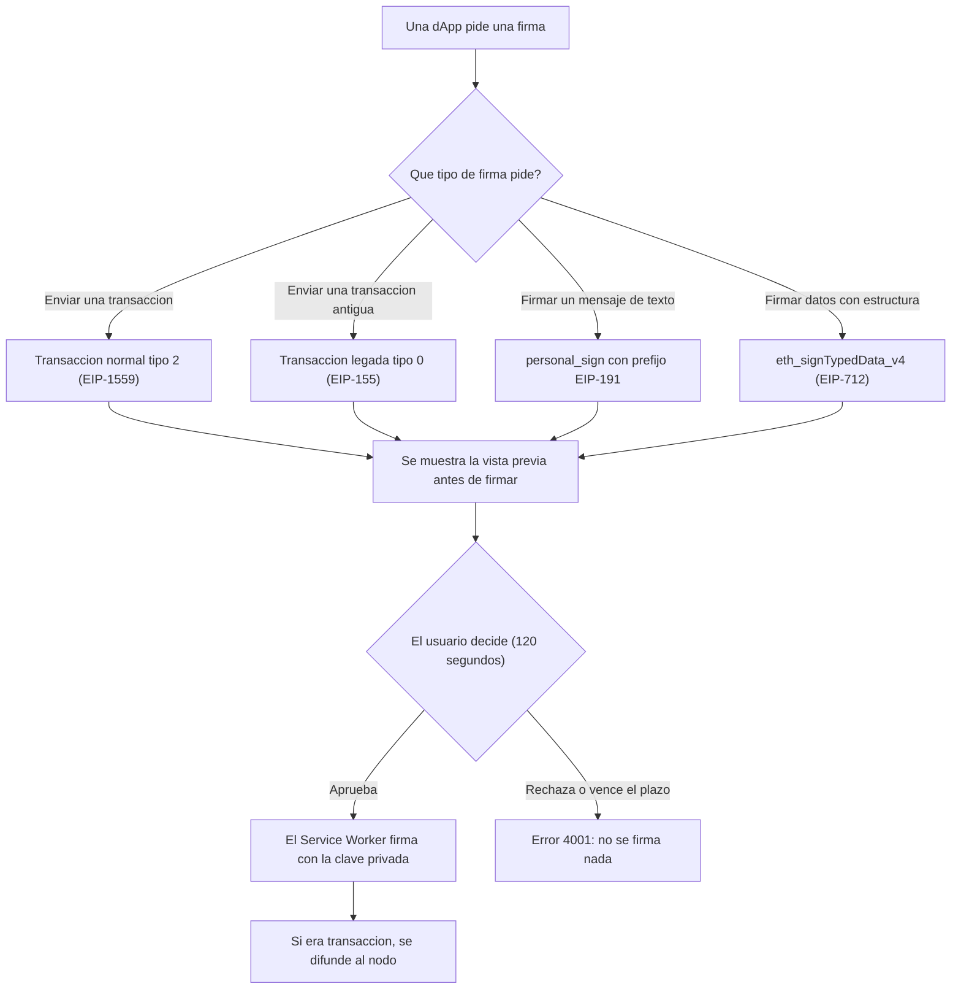

# 03 — Stack Web3

Esta parte del manual explica, en lenguaje de todos los días, **qué estándares de Ethereum usa TrueKeate Wallet**, con qué librería los pone en práctica y qué se ha dejado fuera a propósito. Un «estándar» aquí es un acuerdo común entre programas: si dos aplicaciones lo respetan, se entienden sin hablar antes.

Todo lo que se afirma aquí sale del manual técnico del proyecto o del bloque de datos verificados. Lo que no está confirmado aparece literalmente como «pendiente de confirmar».

## Empezar en 5 minutos

### Qué necesitas

- Un navegador Chrome o Edge, versión 114 o superior.
- La extensión TrueKeate Wallet cargada.
- Un nodo local de pruebas (Anvil) escuchando en `http://127.0.0.1:8545` con `chainId` 31337.
- La dApp de pruebas abierta en `http://localhost:5174/test.html`.
- Ganas de entender por qué la cartera firma de una forma concreta y no de otra.

### Qué vas a conseguir

- Saber qué es una firma y cuántas clases sabe hacer esta cartera.
- Reconocer los nombres raros (BIP-39, EIP-1193, EIP-712, EIP-1559) y saber para qué sirven.
- Comprobar tú mismo que la cartera no hace cosas que no promete: nada de cartera hardware, nada de WalletConnect, nada de `eth_sign`.
- Entender de dónde salen las comisiones y por qué hay dos tipos de transacción.

### Los pasos mínimos

1. Lee el apartado «ethers v6» para saber cuál es la única librería criptográfica del proyecto.
2. Salta a «BIP-39» si lo que te interesa es la frase de 12 palabras.
3. Mira «BIP-32 / BIP-44» para entender de dónde salen las direcciones.
4. Lee «EIP-1193» y «EIP-6963» si vas a conectar una dApp.
5. Repasa «EIP-712», «EIP-1559», «EIP-155» y «personal_sign» para ver las cuatro firmas.
6. Termina con «Estándares presentes pero NO implementados» para conocer los límites.

## ethers v6

`ethers.js` es la caja de herramientas para hablar con Ethereum. En este proyecto es la **única** librería criptográfica permitida.

### Versión y política de uso

#### Versión declarada y rango

- En `package.json` figura `"ethers": "~6.15.0"`.
- El símbolo `~` significa «acepto parches 6.15.x, pero no salto a la versión 7». Así el proyecto recibe arreglos pequeños sin cambios que rompan la API.
- Es una dependencia de producción, no de desarrollo: la usa el Service Worker en tiempo de ejecución.

> La versión exacta instalada en tu ordenador no está verificada en el manual técnico. Queda **pendiente de confirmar** consultando `package-lock.json`.

#### Dónde puede importarse `ethers`

La librería aparece importada en 15 ficheros de `src/`. Hay una regla de arquitectura clara: el paquete de `ethers` vive en el Service Worker y **no** en la capa compartida que usa el popup.

El ejemplo más claro es el validador de la frase: `src/shared/validation/mnemonic.ts` dice expresamente que, como lo consume el popup, no importa `ethers` ni hace criptografía. Por eso la comprobación «de forma» de la frase (que tenga 12 palabras y que las letras sean correctas) se hace sin la librería, y la comprobación «de verdad» (el checksum) se hace con ella en el Service Worker.

#### Ficheros que importan `ethers` (verificado con `grep "from 'ethers'"`)

Ficheros de producción:

- `src/background/crypto/mnemonic.ts` — genera y valida la frase.
- `src/background/crypto/hd.ts` — deriva cuentas.
- `src/background/crypto/importAccount.ts` — calcula la dirección de una clave importada.
- `src/background/crypto/sign.ts` — firma de todo tipo.
- `src/background/crypto/integrity.ts` — comprueba direcciones.
- `src/background/rpc/client.ts` — habla con el nodo.
- `src/background/approvals/preview.ts` — construye la vista previa.
- `src/background/approvals/calldata.ts` — decodifica los datos de una llamada.
- `src/background/security/hash.ts` — calcula `sha256`.
- `src/background/security/redaction.ts` — limpia los registros.

Ficheros de pruebas:

- `eip155.spec.ts`, `eip1559.spec.ts`, `sign.spec.ts`, `personalSign.spec.ts` y `typedData.spec.ts`, todos bajo `src/background/crypto/`.

### Tabla de símbolos de ethers usados y su punto de uso

Un «símbolo» es cada pieza concreta que se importa de la librería (una clase, una función o una constante).

#### Proveedor y red

- `JsonRpcProvider` — es el «teléfono» que usa la cartera para hablar con el nodo. Se crea en `src/background/rpc/client.ts:206`.
- Hay **un único** proveedor cacheado por pareja `(rpcUrl, chainId)` (`src/background/rpc/client.ts:167-209`). Es decir, no se abre un teléfono nuevo en cada consulta.
- `Network` — declara la red como estática (`new Network('truekeate', 31337)`), para que `ethers` no gaste una llamada preguntando el `chainId`.
- Métodos usados del proveedor: `getFeeData()` (comisiones), `getTransactionCount(address, 'pending')` (nonce), `provider.send(...)` (método suelto) y `provider.destroy()` (cerrar).

#### Claves, mnemónicos y direcciones

- `Mnemonic.fromEntropy` — convierte azar puro en 12 palabras.
- `Mnemonic.isValidMnemonic` — comprueba el checksum de la frase.
- `randomBytes` — genera el azar de partida.
- `wordlists` / `LangEn` — la lista inglesa de 2048 palabras.
- `HDNodeWallet.fromPhrase` — convierte la frase en cuentas.
- `computeAddress` — calcula la dirección a partir de una clave privada.
- `Wallet` — el objeto que firma con una clave privada concreta.
- `getAddress` — normaliza y valida una dirección (incluye el checksum EIP-55).

#### Firma, recuperación y hashing

- `Wallet.signTransaction` — firma transacciones (tipo 2 y legada).
- `Wallet.signTypedData` — firma datos tipados (EIP-712).
- `Wallet.signMessage` — firma un mensaje de texto (personal_sign).
- `TypedDataEncoder.hash` — calcula la huella de los datos tipados.
- `recoverAddress` — averigua qué dirección firmó algo.
- `hashMessage` — aplica el prefijo de EIP-191 y calcula la huella.
- `Transaction.from` — lee una transacción serializada.
- `keccak256` — función de huella que usa Ethereum.
- `sha256` — otra función de huella, usada para identificar secretos sin mostrarlos.

#### Bytes, codificación y utilidades

- `getBytes` — convierte texto hexadecimal en bytes.
- `toUtf8Bytes` — convierte texto normal en bytes.
- `hexlify` — convierte bytes en texto hexadecimal.
- `toBeHex` — convierte un número en hexadecimal con el ancho pedido.
- `isHexString` e `isBytesLike` — comprobaciones de forma.
- `isError(error, 'TIMEOUT')` — detecta el error de tiempo agotado.
- `AbiCoder.defaultAbiCoder()` — decodifica datos según los tipos declarados.
- `Signature.from`, `verifyMessage` y `verifyTypedData` se usan solo en las pruebas.

#### Símbolos de ethers que NO se usan

- `formatEther` y `parseEther` **no aparecen** en el proyecto. El formateo de ETH es propio (`formatEth` en `src/shared/format.ts:43`) y el paso de ETH a wei se resuelve con la validación del propio proyecto.
- Tampoco se importa `JsonRpcBatchProvider` ni utilidades de envío por lotes.
- Queda **pendiente de confirmar** si algún ayudante de `ethers` no importado se usa de forma indirecta.

## BIP-39

BIP-39 es el estándar que convierte azar en una lista de palabras fáciles de escribir a mano. Esa lista es la **frase de recuperación**.

### Generación y validación de la frase de recuperación

#### Generación desde entropía de 128 bits

La generación ocurre en el Service Worker, en `src/background/crypto/mnemonic.ts`:

- Se parte de 16 bytes de azar (128 bits). En el código: `MNEMONIC_ENTROPY_BYTES = 16`. Eso produce 12 palabras.
- `generateMnemonic()` pide 16 bytes con `randomBytes` y los convierte en frase con `Mnemonic.fromEntropy(...)`.
- Hay un defecto ya corregido y documentado: `randomBytes` de `ethers` v6 puede devolver un `Buffer` de Node, y `Mnemonic.fromEntropy` lo rechaza con «invalid BytesLike value». Por eso la entropía se normaliza **siempre** con `Uint8Array.from(...)`.
- `Mnemonic.fromEntropy` aplica internamente el **checksum** BIP-39 y usa la lista de 2048 palabras indicada.
- La lista es la inglesa: `const ENGLISH_WORDLIST = wordlists.en ?? LangEn.wordlist()`.

El consumidor de alto nivel es `createWallet()`, que llama a `generateMnemonic()` y guarda la frase. El método interno `wallet_generateMnemonic` genera 12 palabras y **no guarda nada**: sirve para hacer pruebas.

#### Normalización NFKD

Antes de comparar o validar, el texto se limpia siempre igual. Esa limpieza es compartida y vive en `src/shared/validation/mnemonic.ts`, fuera de la capa criptográfica. Los pasos son:

1. Normalizar con NFKD (una forma estándar de descomponer acentos y símbolos).
2. Quitar las marcas de acento sueltas (rango `[\u0300-\u036f]`). La razón escrita en el código: una palabra acentuada nunca es BIP-39, pero el error debe ser siempre el mismo.
3. Pasar todo a minúsculas.
4. Convertir los espacios repetidos en un solo espacio y quitar los de los extremos.

El Service Worker reexporta esta función para no reimplementar la regla.

#### Checksum y validación de 12 palabras

- El número de palabras es 12 (`MNEMONIC_WORD_COUNT = 12`).
- Cada palabra debe tener entre 3 y 8 caracteres y solo letras minúsculas (patrón `^[a-z]+$`).
- `validateMnemonicShape` falla por tres motivos: está vacía (`empty`), no tiene 12 palabras (`wordCount`) o alguna palabra no tiene la forma correcta (`wordFormat`).
- La pertenencia a la lista se comprueba buscando la palabra en el diccionario inglés (`isMnemonicWord`).
- El **checksum** (el dígito de control que llevan las 12 palabras juntas) se valida con `Mnemonic.isValidMnemonic(...)`. Si falla, el motivo es `'checksum'`.
- `checkMnemonic` distingue entre `'unknownWord'` (palabra que no existe en la lista) y `'checksum'` (palabras válidas pero mal combinadas), pero **ambos** llegan al usuario con el mismo error del catálogo: `-32602 invalidMnemonic`.

#### Validación de la UI frente a la del Service Worker

El reparto de trabajo es explícito:

- **UI y capa compartida** (`src/shared/validation/mnemonic.ts`): forma, número de palabras y alfabeto. No usa `ethers` ni hace criptografía.
- **Service Worker** (`src/background/crypto/mnemonic.ts`): pertenencia a la lista de 2048 palabras y checksum BIP-39. Reutiliza la comprobación de forma como primer paso para no duplicar la regla.

En el flujo real: al importar una frase, la cartera llama a `checkMnemonic(input)` y, si no es válida, devuelve el error **sin escribir nada**. El arranque también revalida la frase guardada y clasifica el aviso como `mnemonic-checksum` o `mnemonic-shape`.

#### Trazabilidad sin exponer la frase

Para poder decir «esta frase es la misma que aquella» sin enseñarla, la cartera calcula su huella:

- `mnemonicFingerprint` devuelve el texto `sha256:<hex>` de la frase ya normalizada.
- `mnemonicShortFingerprint` recorta a `sha256:<8 hex>`.

El propio módulo documenta que ese valor nunca se registra en los logs ni viaja por mensaje.

## BIP-32 / BIP-44

BIP-32 explica cómo una sola frase genera un árbol entero de claves. BIP-44 decide qué rama del árbol se usa para Ethereum.

### Derivación jerárquica determinista de cuentas

#### Ruta de derivación real

- La ruta está fijada en el código como literal vinculante: `export const DERIVATION_PREFIX = "m/44'/60'/0'/0" as const;`.
- La ruta completa de cada cuenta añade su índice: `m/44'/60'/0'/0/i`.
- La derivación real la hace `HDNodeWallet.fromPhrase(phrase, undefined, derivationPath(index))`.
- El comentario de cabecera del fichero deja claro que esa es la ruta única y no se cambia.

¿Qué significa cada trozo? Propósito `44'`, moneda `60'` (Ethereum), cuenta `0'`, cambio `0` y, al final, el número de cuenta. El número de cuenta es simplemente la posición en la lista.

#### Cuenta por defecto y número de cuentas derivadas

- Al crear la cartera se derivan **5 cuentas** (`DERIVED_ACCOUNTS = 5`). El botón «Añadir cuenta» incrementa ese número.
- La cuenta activa al crear la cartera es la del índice 0.
- El índice máximo admitido es `0x7fffffff` (2 147 483 647). La comprobación `isValidDerivationIndex` exige un número entero dentro del rango `[0, 2^31-1]`.
- Las funciones que exponen el resultado son `deriveAddress`, `derivePrivateKey` y `deriveAccount` (esta última devuelve `{ index, path, address }`).
- Si la frase no es válida, `deriveAccounts` devuelve una lista vacía. La regla escrita en el código es tajante: «NUNCA se inventan direcciones».

#### Integridad y coherencia de la derivación

- `isDerivationConsistent(mnemonic, index, expectedAddress)` contrasta la dirección guardada con la que se deriva ahora. La usa la verificación de integridad **cuando el operador la pide**, no el arranque.
- El informe de integridad **no deriva nada**: declara `derivations: 0` de forma literal. El motivo está escrito: corregir en silencio es justo lo que la norma RNF-22 prohíbe.
- Si en la lista de cuentas hay un hueco (por ejemplo, un `null` en medio), la cartera se considera **dañada** y no se compacta. La razón es importante: el índice de la lista **es** el índice BIP-44, así que borrar un hueco desplazaría a todas las demás cuentas y podría acabar mostrando la clave privada de otra.

## EIP-1193

EIP-1193 es el estándar que define cómo una página web le pide cosas a una cartera dentro del navegador. La cartera publica un objeto con tres funciones: `request`, `on` y `removeListener`.

### Interfaz `request({ method, params })`

#### Tipos

- `RequestArguments { method: string; params?: unknown[] | Record<string, unknown> }` — lo que la página envía: un nombre de método y sus datos.
- `Eip1193Provider { request; on; removeListener }` — la forma del objeto publicado.
- `TruekeateProvider extends Eip1193Provider`, con los extras `isTrueKeate: true`, `chainId` y `selectedAddress`.
- `Eip1193Error { code: number; message: string; data?: unknown }` — todo error que ve el usuario lleva un número (`code`) y un mensaje.

#### Implementación (`src/inject/provider.ts`)

- La fábrica del objeto es `createTruekeateProvider(relay?)`, que devuelve `{ provider, emit }`.
- `request(args)` sigue este orden de comprobaciones: forma del argumento → catálogo cerrado local → puente disponible → transporte.
- El método se lee sin lanzar nunca (`readMethod`) y los parámetros se normalizan a lista (`readParams`). Si llegan como objeto, se envuelven en una lista de un elemento.
- Hay un **catálogo cerrado** de 16 métodos (`PAGE_METHODS`). Si la página pide algo que no está ahí, responde `4200` sin viajar al Service Worker. `eth_sign` no figura a propósito.
- Si no hay puente, responde `4200` de inmediato en lugar de dejar la promesa colgada para siempre.
- El puente nunca rechaza: si llega un `{ error }`, se traduce a rechazo; si el puente falla de cualquier otra forma, se devuelve el error interno de transporte `-32603`.
- La publicación no se puede manipular: se usa `Object.defineProperty` con `writable: false, configurable: false`. Las dos claves son `window.truekeate` y su alias `window.codecrypto`.
- Hay una red de seguridad de tiempo: si no llega respuesta, la promesa se resuelve con el error `4001`.

### Catálogo de eventos `PROVIDER_EVENTS` (5 nombres) y su propagación

La cartera avisa a la página cuando cambian las cosas. Los cinco eventos son:

- `accountsChanged` — cambió la cuenta seleccionada.
- `chainChanged` — cambió la red.
- `connect` — la página se ha conectado.
- `disconnect` — se ha desconectado.
- `message` — canal genérico (existe, aunque hoy no se emite).

Detalles verificados:

- `isProviderEvent` valida el nombre contra el catálogo. Si la página pide escuchar algo que no está en la lista, se ignora sin romper nada.
- El objeto mantiene dos datos al día: `chainId` y `selectedAddress`. Se refrescan al recibir `chainChanged`/`connect` y `accountsChanged`, y se limpian al recibir `disconnect`.
- Al emitir, primero se refrescan los datos y luego se avisa a cada escucha con una copia de la lista y un `try/catch` individual, para que un fallo de una escucha no rompa a las demás.

### Códigos de error EIP-1193 reales

Estos son los números que puede ver un usuario. Salen de `src/background/rpc/errors.ts`, que es la fuente única de los textos. Son **8 códigos** con **25 filas** en el catálogo base.

| Código | Qué significa | Motivos registrados |
|---|---|---|
| `4001` | El usuario canceló, venció el plazo o se rechazó | rechazo del usuario, tiempo agotado, ventana cerrada, demasiadas solicitudes, límite de tasa, permiso de host denegado |
| `4100` | Origen no autorizado | origen no autorizado |
| `4200` | Método no soportado o no permitido ahí | método no soportado, método no permitido en ese contexto |
| `4900` | No se pudo hablar con el nodo | RPC no disponible |
| `4901` | Red no registrada o distinta | red no registrada, `chainId` que no coincide |
| `-32602` | Dato inválido | frase inválida, clave privada inválida, dirección inválida, cuenta duplicada, carga demasiado grande, cuenta desconocida, importe inválido, etiqueta inválida, URL de RPC inválida, definición de red inválida |
| `-32000` | Problema del lado del nodo o de la operación | fondos insuficientes, nonce inválido, estimación de gas fallida, cuenta en uso por una dApp, reset bloqueado, cartera no creada, transacción en vuelo, difusión rechazada |
| `-32603` | Error interno | error interno, identificador duplicado, cuota de almacenamiento, difusión interrumpida, cartera dañada, fallo del portapapeles, fallo de migración |

Notas útiles:

- `ERROR_CODES` es la lista de códigos únicos en orden de aparición.
- `ERROR_BY_CODE` permite buscar todas las filas de un código.
- `createEip1193Error(...)` construye el objeto y solo añade el campo `data` si se le pasa.
- `isEip1193Error` exige que `code` sea un número y `message` sea texto.
- La capa de inyección copia tres textos a mano porque no puede importar módulos del Service Worker: el `4200`, el `4001` de vencimiento y el `-32603` de transporte.
- El cliente RPC reconoce los rechazos del nodo por rango (códigos de servidor `-32000 … -32099`) y excluye a propósito los códigos propios `4001`, `4100`, `4200`, `4900` y `4901`.

### Propagación de eventos del Service Worker a las pestañas

El Service Worker puede quedarse dormido, así que los eventos viajan por mensajes:

- El mensaje se llama `TRUEKEATE_EVENT` y lleva `{ type, eventName, data }`.
- `emitProviderEvent` recorre todas las pestañas (o solo las indicadas) y devuelve cuántas lo recibieron.
- Hay ayudantes con nombre propio: `emitAccountsChanged`, `emitConnect` (con `{ chainId }`), `emitDisconnect`, `emitChainChanged` (con el `chainId` sin envoltorio) y `emitMessage` (existe pero hoy no se emite).
- `sendEventToTab` usa `sendMessage` con `{ frameId }` solo cuando el marco no es el principal (frame 0).
- En la página, `installProvider` escucha el evento `message` y lo reemite si el nombre pertenece al catálogo.

## EIP-6963

EIP-6963 es el estándar para que varias carteras convivan en la misma página sin pisarse. Se implementa en `src/inject/eip6963.ts`.

### Eventos y forma del `detail`

#### Literales de los dos eventos

- `eip6963:requestProvider` — la página pregunta «¿qué carteras hay?».
- `eip6963:announceProvider` — la cartera responde «aquí estoy, estos son mis datos».

#### Forma del `detail`

- `Eip6963ProviderDetail { info, provider }` — la respuesta completa.
- `Eip6963ProviderInfo { uuid, name, icon, rdns }` — la ficha de identidad.
- El `detail` se construye **nuevo** en cada anuncio. Es importante: si se reutilizara el mismo objeto, algunas páginas podrían confundirse.
- `publishedProvider` exige que el `provider` anunciado sea **el mismo objeto** que `window.truekeate`. Antes de aceptarlo comprueba que tenga `request` y `on`.
- La emisión se hace con `window.dispatchEvent(new CustomEvent(...))` dentro de un `try/catch`, para que un fallo no rompa la página.

#### Literales de identidad

- Nombre: `TrueKeate`. **No** es el mismo texto que `manifest.name`.
- `rdns`: `academy.codecrypto.truekeate` (el identificador de tipo «dominio inverso»).
- `uuid`: `9f2a4c1e-6b7d-4e0a-8c33-4f5b6d7e8a90`. Es un literal congelado que nunca se regenera al recargar la extensión. Esto importa porque algunas dApp guardan la preferencia del usuario por `uuid`.
- `providerIdentity` reexporta `{ name, rdns, uuid }` para las pruebas y para `test.html`.

#### Icono

- El icono se importa desde `src/inject/icon-data.ts` como data-URI.
- `loadProviderIcon()` lo devuelve de forma síncrona y cacheada.
- `PROVIDER_ICON_PATH = 'brand/truekeate-mark-96.png'` es solo informativo.
- El icono va incrustado en el paquete en tiempo de compilación, así que el anuncio funciona sin conexión a la red.

### Ciclo de anuncio: listener síncrono, auto-anuncio y re-anuncio en `DOMContentLoaded`

La función `installEip6963Announce(provider, onAnnounce?)` hace tres cosas:

1. **Listener síncrono** de `eip6963:requestProvider`, registrado dentro de la función y sin `await` previo. Si se registrara tarde, el anuncio se perdería.
2. **Auto-anuncio**: nada más cargar `inject.js`, la cartera se presenta sola.
3. **Re-anuncio en `DOMContentLoaded`**: si la página todavía se está cargando, se añade un listener con `{ once: true }`; si ya cargó, se anuncia con `queueMicrotask(...)`. El motivo escrito es atender a las dApp que registran su listener más tarde.

Aviso opcional al puente: `onAnnounce?.(detail)` envía al content script un mensaje `TRUEKEATE_ANNOUNCE { type, info }`. Existe una desviación declarada y explicada: el `detail` completo no se puede clonar por `postMessage` porque contiene funciones. Por eso por el puente viajan solo los 4 campos clonables de `info`, y el `detail` íntegro se entrega por `CustomEvent`.

## EIP-712

EIP-712 es el estándar para firmar **datos con estructura**, no un simple texto. Por ejemplo, autorizar un permiso indicando el token, la cantidad y el plazo. La firma se implementa en `src/background/crypto/sign.ts`, se previsualiza en `src/notification/TypedDataPanel.tsx` y se verifica dentro de un contrato de prueba, `contracts/src/EIP712Verifier.sol`.

### Firma en la cartera (`src/background/crypto/sign.ts`)

#### Entrada, tipos y resultado

- `TypedDataTypes` — el mapa de tipos que declara la dApp (por ejemplo, `SignMessage` con sus campos).
- `TypedDataSigningInput { from, domain, types, message, primaryType? }` — todo lo que llega para firmar.
- `TypedDataSignature { signature, from, digest, primaryType, types, domain }` — todo lo que se devuelve.

El `digest` es la huella final que se firma. Guardarlo permite comprobar después, sin la clave, que la firma corresponde exactamente a esos datos.

#### Reglas aplicadas

- `stripEip712Domain(types)` quita `EIP712Domain` de la lista de tipos. El motivo está documentado: el dominio no es un tipo firmable y `ethers` lo rechaza si se cuela.
- `inferPrimaryType(types)` averigua cuál es el tipo raíz: el que no aparece como campo de ningún otro. Si todos aparecen, usa el primero declarado; con lista vacía devuelve `null`.
- `resolvePrimaryType(types, requested)` usa el tipo declarado por la dApp si existe y, si no, el inferido. Sin tipos lanza el error interno `invalid-typed-data`.
- `signTypedData(input, deps)` limpia los tipos, resuelve el tipo principal, obtiene la cartera y calcula la huella y la firma. Si `ethers` no puede calcular la huella, el error es `unhashable-typed-data`. La regla escrita es «firma bloqueada, nunca a medias».
- La recuperación del firmante se hace con `recoverAddress` sobre el `digest` canónico, porque `ethers` v6 no expone un `recover` directo para datos tipados.

#### `domain`, `types`, `message` y el `chainId` dentro del domain

- El `domain` llega tal cual de la dApp y se firma dentro de la huella: **no se reescribe**. Se devuelve sin cambios.
- El `chainId` que va dentro del `domain` forma parte de la huella que calcula `ethers`. Su presencia se controla con `parseChainIdOrNull` y `toChainIdNumber`, que distinguen «no declarado» de «declarado pero ilegible».
- La vista previa calcula `domainChainMismatch` comparando el `chainId` declarado con el de la red activa y **falla en seguro** si el valor no se puede leer.
- `verifyingContractMismatch` significa «la dirección es la cero» **o** «`eth_getCode` devuelve `0x`», es decir, no hay contrato en esa dirección. No se compara con nada que la dApp haya declarado.
- Si el `message` supera cierto tamaño, se guarda como `null` conservando su huella y su número de bytes. Así se puede reconstruir la comprobación sin almacenar el contenido entero.

### Panel de confirmación (`src/notification/TypedDataPanel.tsx`)

Qué ve el usuario antes de firmar:

- Siempre el nombre del dominio (`domain.name`).
- El `chainId` del dominio junto al de la red activa, para poder compararlos de un vistazo.
- El `verifyingContract` **en claro**, sin abreviar. Es el contrato que va a comprobar la firma.
- El tipo principal (`primaryType`).
- Un aviso destacado si el `chainId` del dominio no coincide con la red activa.
- Un aviso de peligro si no hay contrato en la dirección del verificador.
- La lista de campos que se van a firmar y el contenido del mensaje. Si el mensaje llegó redactado por tamaño, se pinta su huella y su número de bytes.

### Contrato verificador y correspondencia wallet ↔ contrato

#### `contracts/src/EIP712Verifier.sol`

- Es un contrato **sin estado**, declarado como instrumento de prueba.
- `verify` es `view` (no `pure`) porque `ecrecover` necesita leer el entorno.
- `DOMAIN_TYPEHASH` vale `0x8b73c3c69bb8fe3d512ecc4cf759cc79239f7b179b0ffacaa9a75d522b39400f`.
- `verify(address signer, bytes32 digest, bytes calldata signature)` devuelve verdadero si la dirección recuperada de la firma coincide con el firmante y no es la dirección cero.
- `domainSeparator` se calcula con los cuatro campos del dominio y hay una sobrecarga que acepta el struct `EIP712Domain`.
- `hashTypedData(separator, structHash)` es `keccak256(0x1901 ‖ separator ‖ structHash)`.
- `verifyTypedData(signer, separator, structHash, signature)` hace la comprobación completa.
- `recover` replica las comprobaciones de `ECDSA.recover`: longitud 65 bytes, `s` en la mitad baja, `v` igual a 27 o 28, `r` y `s` distintos de cero y dirección recuperada distinta de cero. **Nunca revierte** ante una firma inválida: devuelve `false`.

#### Correspondencia con la firma de la cartera

- El `digest` que devuelve la cartera es literalmente lo que consume `EIP712Verifier.verify(signer, digest, signature)`.
- El contrato de pruebas `contracts/test/EIP712Verifier.t.sol` comprueba las dos rutas: con el `digest` guardado y con el `digest` recompuesto dentro de la cadena a partir del dominio y del struct. También prueba `verifyTypedData`.
- El `domainSeparator` se recalcula en la cadena y se compara con el fichero de referencia en `setUp`.
- Las pruebas exigen el dominio de la dApp de pruebas `TrueKeate Test App` y `chainId` 31337.
- La firma de **la cartera** se verifica en la cadena en `test_WalletSignatureVerifiesOnChain`, con el firmante `0x70997970C51812dc3A010C7d01b50e0d17dc79C8` (cuenta #1 de Anvil).
- Cambiar un solo byte (contenido, `nonce`, `deadline` o un bit de la huella) hace que la verificación devuelva `false`.
- Usar otro firmante u otro dominio (otro `chainId` u otro `verifyingContract`) también devuelve `false`.

#### Fixtures versionados

Un «fixture» es un fichero con datos de ejemplo congelados, para que las pruebas siempre comparen contra lo mismo.

- `contracts/test/fixtures/eip712-signature.json` existe (51 líneas). Contiene el `domain`, los `types` con `SignMessage`, el `primaryType`, el `message`, los `typeHashes`, los hashes intermedios, el `digest`, el `signer` y la `signature` en formato `r ‖ s ‖ v`, con la clave de prueba anotada.
- `contracts/test/fixtures/eip712-wallet-signature.json` existe y lo produce la propia cartera, no la herramienta `cast`.
- El script que genera ese segundo fichero está en `contracts/scripts/generar-fixture-wallet.mjs`. Su existencia está confirmada; su contenido detallado queda **pendiente de confirmar**.

## EIP-1559

EIP-1559 es el estándar moderno de comisiones. Separa la comisión en dos partes y permite que la red ajuste el precio base.

### Transacción tipo 2 y política de comisiones

#### Tipo 2 como única vía de `eth_sendTransaction`

- `TX_TYPE_EIP1559 = 2`. Es el tipo que produce **siempre** el envío de una transacción desde la cartera.
- La vista previa lo declara como tipo 2 y el contrato interno de datos también fija el literal `2`.
- `signTransaction` añade una defensa extra: si al leer la transacción serializada el tipo no es 2, lanza el error interno `unexpected-tx-type`. Es una comprobación de seguridad: mejor negarse a firmar que firmar algo distinto de lo previsto.

#### `maxFeePerGas` y `maxPriorityFeePerGas`

Estos dos nombres son, en lenguaje llano, «el máximo que estoy dispuesto a pagar por unidad de gas» y «la propina por unidad de gas».

`resolveEip1559Fees(feeData)` garantiza un invariante: **ambos valores siempre mayores que cero**.

1. `maxPriorityFeePerGas`: se usa el del nodo si es mayor que cero. Si no, se usa el mínimo del proyecto, acotado por el `gasPrice` (nunca por encima de él). Si tampoco hay `gasPrice`, se usa el mínimo.
2. `maxFeePerGas`: se usa el del nodo si es mayor que cero. Si no, se calcula el doble del precio base, donde la base es el `gasPrice` del nodo o el mínimo del proyecto. Si el resultado queda por debajo de la propina, se iguala a la propina.

La procedencia de cada valor se guarda para poder auditarla: `source: { maxFeePerGas: 'node' | 'derived', maxPriorityFeePerGas: ... }`, es decir, «vino del nodo» o «lo calculó el programa».

Comportamiento fijado por las pruebas:

- Con `maxFeePerGas: 0`, `maxPriorityFeePerGas: 0` y `gasPrice: 5n`, el resultado es propina 5 y máximo 10.
- Sin ninguna comisión, se usan los mínimos del proyecto y el máximo derivado es `2 × GWEI`.
- `maxFeePerGas` nunca queda por debajo de la prioridad.

#### Mínimos de 1 gwei

- `MIN_MAX_PRIORITY_FEE_PER_GAS = 1_000_000_000n` (1 gwei).
- `MIN_MAX_FEE_PER_GAS = 1_000_000_000n` (1 gwei).
- El motivo está escrito en el código: una transacción con prioridad 0 no es aceptada por la red y la deja inválida.

#### De dónde salen las comisiones: `getFeeData()` y `eth_feeHistory`

- `readEip1559Fees(deps)` pide las comisiones con `feeData()`. Si esa llamada falla, pasa `null` a `resolveEip1559Fees` para que se calculen los mínimos válidos en lugar de fallar.
- El `feeData` real de producción es el del proveedor único.
- `eth_feeHistory` existe como método de página y se reenvía al nodo tal cual. **No** alimenta hoy la firma: la firma usa `getFeeData()`. Queda **pendiente de confirmar** si algún flujo de la interfaz usa `eth_feeHistory` para mostrar comisiones.

#### Nonce definitivo

El «nonce» es el número de orden de una transacción de una cuenta. Si se repite, la transacción se rechaza.

- `readPendingNonce(address, deps)` delega en `transactionCount(address)`.
- La implementación de producción es `getTransactionCount(address, 'pending')`, es decir, contando también las transacciones aún sin confirmar.
- El nonce se **recalcula al aprobar**, no al encolar. Esto es importante: entre que la solicitud se encola y el usuario aprueba puede pasar tiempo, y el nonce podría haber cambiado.
- En la vista previa el nonce es solo informativo.
- Además existe una marca de «transacción en vuelo» (`phase: 'signing'`) que bloquea una segunda firma de la misma cuenta. Si se intenta, el error es `-32000 inflightTxInProgress`.
- Después de difundir, se sigue el recibo de la transacción consultando `eth_getTransactionReceipt` cada 1 000 ms, con un máximo de 120 consultas y un tope de 120 000 ms (2 minutos).

## EIP-155 (legado)

EIP-155 es el estándar antiguo que metió el identificador de red **dentro** de la firma. Así una transacción firmada para una red no vale en otra.

### Firma legada con el `chainId` dentro de la firma

#### Protección de replay con `v = chainId*2 + 35/36`

- La fórmula está escrita y es verificable en el código: `eip155V(chainId, yParity) = chainId * 2 + 35 + (yParity === 1 ? 1 : 0)`.
- Con `chainId = 31337`, el valor `v` solo puede ser `62709` o `62710`.
- `TX_TYPE_LEGACY = 0`.
- `signLegacyTransaction(input, deps)` hace lo siguiente:
  1. Exige que la red activa coincida (`assertActiveChain`).
  2. Exige `gasPrice > 0`. Si falta, lanza el error interno `missing-gas-price`. El motivo escrito: sin `chainId`, `ethers` firmaría una transacción anterior a EIP-155, replicable en otra red, y eso está prohibido.
  3. Firma con `type: 0`, `chainId` y `gasPrice`.
  4. Fija el `v` al valor de EIP-155, con el comentario literal: «El `v` de una transacción EIP-155 es exactamente `chainId * 2 + 35/36`».

#### Confirmación en el spec real

El fichero de pruebas `src/background/crypto/eip155.spec.ts` (146 líneas) comprueba:

- La fórmula con varios `chainId`: `(1,0)=37`, `(1,1)=38`, `(5,0)=45`, `(5,1)=46`, `(31337,0)=62709`, `(31337,1)=62710`. La diferencia entre las dos paridades es siempre 1.
- Que el `v` de EIP-155 nunca cae en el rango antiguo 27/28.
- Que la transacción firmada no empieza por `0x02`, tiene `type === 0`, `chainId === 31337n` y el `v` esperado.
- Que la huella es `keccak256(rawTransaction)`.
- Que la huella de la parte sin firmar **depende del `chainId`** y que la firma solo se recupera con el de su red. Es exactamente la protección que se busca.
- Que el mismo contenido enviado a dos redes produce transacciones y huellas distintas, con una diferencia de `v` igual a `2·ΔchainId + Δparidad`.
- Que un `chainId` ajeno al activo se rechaza con `4901` y el motivo `chain-id-mismatch`.
- Que la transacción legada conserva `gasPrice` y **no inventa** comisiones EIP-1559: `maxFeePerGas` y `maxPriorityFeePerGas` quedan como `null`.

## personal_sign

`personal_sign` es la firma de un mensaje de texto. No mueve fondos, pero puede autorizar cosas, así que se muestra siempre antes de firmar.

### Firma de mensaje con prefijo EIP-191

#### Construcción del payload y prefijo EIP-191

EIP-191 es el estándar que añade un prefijo al texto para que una firma de mensaje **no** pueda confundirse con una firma de transacción.

- `PersonalSignInput { from, message }`.
- `PersonalSignPayload { bytes, prefix, prefixed, hash }`.
- `buildPersonalSignPayload(message)` interpreta la entrada igual que MetaMask:
  - Si es texto hexadecimal, se trata como **bytes**.
  - Si es texto normal, se trata como **UTF-8**.
  - Si es un `Uint8Array`, se usa tal cual.
- El prefijo literal es `` `\x19Ethereum Signed Message:\n${bytes.length}` ``.
- Después se concatenan prefijo y mensaje en un solo `Uint8Array`.
- La huella es `hashMessage(bytes)`, que es `keccak256` del mensaje con el prefijo EIP-191.

El prefijo se devuelve por separado precisamente para poder comprobarlo byte a byte sin la clave.

#### Firma y recuperación

- `signPersonalMessage(input, deps)` construye el contenido, resuelve la cartera de firma y ejecuta `wallet.signMessage(payload.bytes)`. Devuelve `signature`, `from`, `messageHash`, `prefix` y `byteLength`.
- `PersonalSignature` es el tipo del resultado.
- Las pruebas comprueban: que los bytes de «hola» son los esperados, que el prefijo se añade bien, que la huella es `keccak256` del mensaje con prefijo y **distinta** de `keccak256` del mensaje a secas, el caso de un mensaje vacío (longitud 0) y la recuperación del firmante tanto con entrada hexadecimal como con texto.

#### Panel de confirmación (`src/notification/PersonalSignPanel.tsx`)

- El texto se muestra como UTF-8 legible y completo, con el aviso de que la firma no mueve fondos pero puede autorizar acciones.
- Si el texto se guardó truncado por tamaño, aparece el aviso correspondiente.
- Si el contenido hexadecimal **no** es legible como texto, se muestra un aviso distinto con la longitud en bytes y el contenido recortado. Los bytes solo se pintan en la pantalla y **nunca** se copian a los registros.
- La decisión «legible o no» la toma el Service Worker: `buildPersonalSignPreview` usa `decodeUtf8Strict` y `isReadableText`, y marca `isHexPayload: true` cuando la entrada era hexadecimal y no se pudo leer como texto.

## Estándares presentes pero NO implementados

Esta tabla resume lo que la cartera hace y lo que no. «No aparece» significa que se buscó el término en el código y no hubo coincidencias.

| Estándar o capacidad | Estado | Detalle |
|---|---|---|
| EIP-2930 (listas de acceso, tipo 1) | NO implementado | No aparece `accessList`. La única vía de envío es tipo 2; la firma legada usa tipo 0. |
| EIP-4844 (blobs, tipo 3) | NO implementado | No aparece nada de blobs ni `type: 3`. |
| EIP-1271 (firma de contratos) | NO implementado | No aparece `1271`. El único verificador es EIP712Verifier, que recupera con `ecrecover` y compara con una cuenta normal. |
| JSON-RPC por lotes | NO implementado | Cada petición va suelta y recibe una única respuesta. |
| WalletConnect | NO implementado | No aparece el término en el código. |
| Cartera hardware (Ledger/Trezor) | NO implementado | No aparece `Ledger`, `Trezor` ni `hardware`. La firma se hace con claves derivadas de la frase o importadas. |
| `eth_sign` | Retirado a propósito | No está en el catálogo: responde `4200`. |
| EIP-1102 (`eth_requestAccounts`) | Presente | Figura entre los métodos de lectura de página. |
| EIP-3085 (`wallet_addEthereumChain`) | Presente | Está entre los métodos que piden aprobación, con validación propia. |
| EIP-6963 | Presente | Módulo completo, ver su sección. |
| EIP-191 (`personal_sign`) | Presente | Implementado en la firma de mensajes. |
| EIP-55 (checksum de direcciones) | Presente | Se aplica con `getAddress`. |
| EIP-2612 (`permit`) como firma propia | Parcial: solo decodificación | `permit` está en la tabla de selectores y dispara aviso, pero no hay un flujo de firma EIP-2612 propio; la firma se haría por `eth_signTypedData_v4`. |
| `formatEther` / `parseEther` de ethers | No usados | El formateo de ETH es propio. |
| Otros nodos o redes remotas | Fuera de alcance por diseño | La URL por defecto es `http://127.0.0.1:8545` y el catálogo dice que solo existe Anvil. |

### Lo que queda pendiente de confirmar

- Si hay dependencias adicionales con contenido Web3 dentro de `node_modules` que no se importen.
- Si algún fichero de `e2e/` o de `test/` ejercita estándares que este manual no cubre.
- La versión exacta de `ethers` instalada (solo está verificado el rango de `package.json`).
- El contenido detallado de `contracts/scripts/generar-fixture-wallet.mjs` y del fixture `contracts/test/fixtures/eip712-wallet-signature.json`.

## Las cuatro firmas que sabe hacer la cartera

Todo lo anterior se resume en cuatro situaciones. Esta sección es la que puedes leer si solo quieres saber qué pasa cuando la cartera te pide firmar algo.

<!-- GENERAR_IMAGEN: flujo-firma.svg -->

Resumen de cada tipo:

1. **Transacción normal (tipo 2, EIP-1559).** Es la que se usa siempre al enviar una transacción. Lleva `maxFeePerGas` y `maxPriorityFeePerGas`, ninguno de los dos por debajo de 1 gwei.
2. **Transacción antigua (tipo 0, EIP-155).** Es la forma heredada. Lleva el identificador de red dentro de la firma, así que no se puede reutilizar en otra red. Con la red de pruebas, el `v` sale 62709 o 62710.
3. **Mensaje personal (`personal_sign`, EIP-191).** Se firma texto. La cartera avisa de que no mueve fondos pero puede autorizar acciones.
4. **Datos tipados (`eth_signTypedData_v4`, EIP-712).** Se firma una estructura con campos. La cartera enseña el dominio, el contrato verificador, la red y los campos antes de firmar.

Qué se muestra **antes** de firmar, en todos los casos:

- De qué cuenta sale.
- A qué red pertenece.
- Para transacciones: destino, importe, comisiones estimadas y nonce informativo.
- Para transacciones con datos: la decodificación de los datos con la tabla local de selectores; si el selector no está en la tabla, el aviso es **bloqueante** y no se puede firmar.
- Para mensajes: el texto completo, o el aviso de que es hexadecimal y no legible.
- Para datos tipados: el nombre del dominio, su `chainId` frente al de la red activa, el contrato verificador en claro y la lista de campos.

## Glosario rápido

- **BIP-39:** estándar que convierte azar en 12 palabras. Esa es la frase de recuperación.
- **BIP-32 / BIP-44:** estándares que convierten una frase en un árbol de cuentas y fijan la rama que usa Ethereum.
- **Checksum:** dígito de control. Si una palabra o una letra cambia, el checksum falla.
- **Calldata:** los datos que acompañan a una transacción, por ejemplo «llama a transfer con estos valores».
- **`chainId`:** número que identifica una red. Anvil local usa 31337, que en hexadecimal es `0x7a69`.
- **EIP-1193:** estándar de la interfaz que la página usa para hablar con la cartera.
- **EIP-1559:** estándar moderno de comisiones, con dos precios en lugar de uno.
- **EIP-191 y EIP-712:** estándares de firma de mensajes; EIP-191 para texto, EIP-712 para datos con estructura.
- **EIP-6963:** estándar para que varias carteras se anuncien en la misma página.
- **Firma:** prueba criptográfica de que una cuenta concreta autorizó algo. Se calcula con la clave privada.
- **Gas:** unidad de trabajo de la red. Cada operación cuesta una cantidad de gas.
- **gwei:** mil millones de wei. Es la unidad habitual para hablar de comisiones.
- **Nonce:** número de orden de las transacciones de una cuenta.
- **Selector:** los primeros 4 bytes de un calldata; identifican qué función se llama.
- **Service Worker:** el proceso de fondo de la extensión. Aquí vive toda la criptografía.
- **`token`:** contrato que representa un activo dentro de la red.
- **`allowance`:** permiso que le das a un contrato para gastar tus tokens en tu nombre.
- **wei:** la unidad más pequeña de ETH. 1 ETH son 10^18 wei.

## Problemas frecuentes

### La dApp dice que no encuentra ninguna cartera

**Causa.** O bien la extensión no está instalada y activa, o bien la dApp ha preguntado antes de que la cartera se anunciara. La cartera se anuncia sola al cargar `inject.js` y se vuelve a anunciar en `DOMContentLoaded`, pero una página muy rápida puede escuchar tarde.

**Solución.** Recarga la página con la extensión ya instalada. Si la dApp usa EIP-6963, comprueba que escucha el evento `eip6963:announceProvider` y que además admite `window.truekeate` (o su alias `window.codecrypto`).

### Una llamada devuelve el error 4200

**Causa.** El método pedido no está en el catálogo, o lo está pero no se permite en ese contexto. Por ejemplo, `eth_sign` no existe en esta cartera y nunca se añadirá, y los métodos `wallet_*` no se pueden invocar desde una página.

**Solución.** Usa `personal_sign` o `eth_signTypedData_v4` para firmar, y `eth_sendTransaction` para enviar. Los métodos `wallet_*` se invocan solo desde el popup de la extensión.

### La cartera no responde y la operación se queda colgada

**Causa.** El Service Worker se suspendió o el nodo local no está escuchando en `http://127.0.0.1:8545`.

**Solución.** Comprueba el nodo con `cast chain-id --rpc-url http://127.0.0.1:8545`. Debe devolver 31337. Si no responde, arranca Anvil con `anvil --host 127.0.0.1 --port 8545 --chain-id 31337 --allow-origin "chrome-extension://oiahebaliobknoeeonhgaacapjcpgblo,http://localhost:5174,http://127.0.0.1:5174"`. La cartera tiene además una red de seguridad de tiempo que resuelve con error 4001 si no llega respuesta.

### Aparece el error 4100 y no puedo conectar mi página

**Causa.** El origen de la página no está autorizado, o el mensaje llegó desde un origen distinto del que se cree. La cartera calcula el origen **solo** desde `sender.origin` y nunca desde la URL de la pestaña.

**Solución.** Abre la dApp desde el puerto previsto (`http://localhost:5174/test.html`) y vuelve a intentar la conexión, aprobándola en la ventana que aparece (tienes 60 segundos).

### La transacción se rechaza con fondos insuficientes

**Causa.** La cuenta no tiene ETH para pagar el envío más el gas, o la red activa no es la que crees.

**Solución.** Comprueba el saldo con `cast balance 0xf39Fd6e51aad88F6F4ce6aB8827279cffFb92266 --rpc-url http://127.0.0.1:8545`. Cada una de las 5 primeras cuentas de Anvil arranca con 10 000 ETH. Si el error es `4901`, estás apuntando a una red que no está registrada.

### No puedo firmar porque hay un aviso bloqueante

**Causa.** La cartera ha decodificado los datos de la llamada con su tabla local de selectores y no ha reconocido el selector, o los argumentos no encajan. La regla del proyecto es no permitir firmar a ciegas.

**Solución.** Revisa la dirección de destino y el contrato. La cartera no consulta servicios externos de firmas ni de ABIs (tipo 4byte, Etherscan o Sourcify) y esa tabla no se amplía en tiempo de ejecución, así que un contrato nuevo aparecerá como no reconocido hasta que se añada al código.

### La frase de recuperación que he escrito no se acepta

**Causa.** Puede fallar por tres motivos distintos: no tiene 12 palabras, alguna palabra no está en la lista inglesa de 2048, o las palabras son correctas pero el checksum no cuadra. Los tres llegan con el mismo error visible, `-32602`.

**Solución.** Vuelve a escribirla con cuidado, en minúsculas y separada por espacios simples. La cartera ignora los acentos y los espacios de más antes de comprobar. Recuerda que la frase de prueba de Anvil (`test test test test test test test test test test test junk`) es solo una pista de desarrollo y nunca se guarda como cartera del usuario.

### Una operación devuelve el error 4001 sin que yo la haya rechazado

**Causa.** El código `4001` cubre varias situaciones: rechazo del usuario, plazo vencido, ventana cerrada, demasiadas solicitudes pendientes o límite de tasa. Los plazos son 120 segundos para una firma y 60 segundos para conectar una dApp.

**Solución.** Fíjate en el mensaje: si habla de plazo, repite la operación y decide antes de que acabe la cuenta atrás. Si habla de demasiadas solicitudes, espera un poco: el límite es de 1 solicitud pendiente por origen y de 6 por minuto y origen. Recuerda que el plazo empieza a contar desde que la solicitud se crea, no desde que se abre la ventana.
