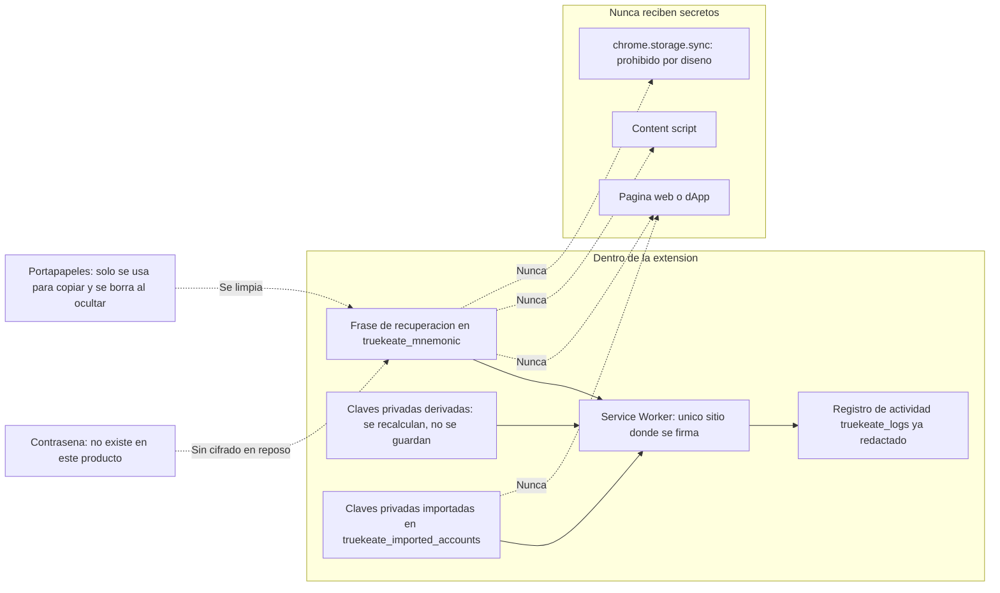
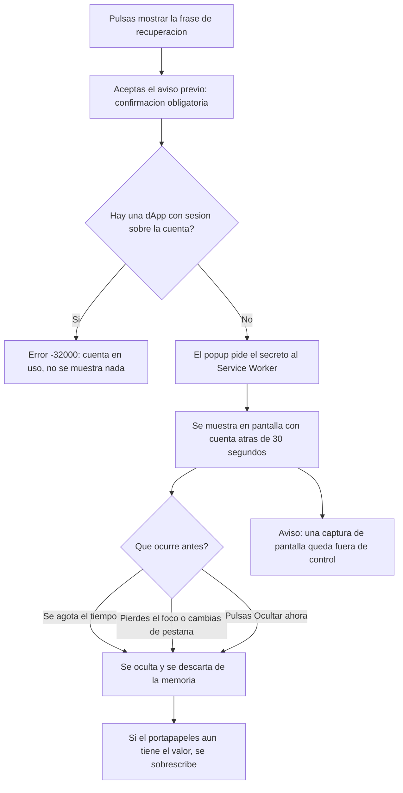

# 04 — Seguridad del monedero

Este manual explica, sin jerga, **qué protege TrueKeate Wallet, de quién se protege y qué cosas quedan deliberadamente sin proteger**. No es un documento de promesas: cada afirmación sale del manual técnico del proyecto o del bloque de datos verificados. Cuando algo no está comprobado, lo verás escrito como «pendiente de confirmar».

Una idea que conviene tener clara desde el principio: esta cartera está pensada para **un entorno de desarrollo con una red local de pruebas**. No maneja fondos reales y no usa contraseña. Eso no la hace insegura para lo que es, pero sí la hace **inadecuada** para guardar dinero de verdad.

## Empezar en 5 minutos

### Qué necesitas

- Un navegador Chrome o Edge, versión 114 o superior.
- La extensión TrueKeate Wallet instalada.
- Un nodo local de pruebas (Anvil) en `http://127.0.0.1:8545`, con `chainId` 31337.
- Una idea clara de que los fondos de Anvil son de mentira: cada cuenta arranca con 10 000 ETH que no valen nada.

### Qué vas a conseguir

- Saber dónde vive cada secreto y qué se hace para que no salga de la extensión.
- Entender por qué un content script no puede leer tu frase de recuperación.
- Conocer los límites anti-abuso: cuántas solicitudes se admiten, cuánto duran y cuánto pesan.
- Saber qué pasa durante los 30 segundos del revelado de la frase.
- Conocer los riesgos que el proyecto **acepta** a propósito, sin adornos.

### Los pasos mínimos

1. Lee el apartado 1 para entender qué es un «activo» (algo que hay que proteger) y quién es un «adversario».
2. Lee el apartado 2 y quédate con una idea: las claves viven en el Service Worker, y el popup solo pinta.
3. Salta al apartado 8 si lo que te preocupa es el revelado de la frase de recuperación.
4. Repasa el apartado 11 para conocer las limitaciones declaradas.
5. Consulta «Problemas frecuentes» cuando algo no funcione como esperabas.

## 1. Modelo de amenaza y activos

### 1.1 Qué protege el sistema

#### 1.1.1 Frase BIP-39

La frase de recuperación (12 palabras, estándar BIP-39) es el activo raíz: de ella salen todas las cuentas. Vive en el almacén local de la extensión, `chrome.storage.local`, bajo la clave `truekeate_mnemonic`.

Dos matices importantes:

- **Puede no existir.** Si la cartera solo tiene cuentas importadas, no hay frase guardada.
- **Nunca sale hacia la página.** No viaja por `window.postMessage` ni por ningún canal que llegue a la web. Solo se puede mostrar en superficies de la propia extensión, mediante el revelado del requisito RF-50.

#### 1.1.2 Claves privadas

Hay dos clases de claves privadas y no se tratan igual:

- Las **derivadas** (las que salen de la frase) no se guardan: se recalculan cuando hacen falta con `derivePrivateKey`.
- Las **importadas** sí se guardan, y se guardan **en claro**, dentro de `truekeate_imported_accounts`. Cada una lleva su dirección, su clave privada y una etiqueta.

La firma ocurre en un único módulo del sistema. Ninguna otra parte toca la clave privada.

#### 1.1.3 Sesiones por origen y cola de aprobaciones

- `truekeate_connected_sites` guarda qué página web está conectada a qué cuenta. La sesión dura **24 horas renovables**. La clave es el origen normalizado (esquema, servidor y puerto: por ejemplo `http://localhost:5174`).
- `truekeate_pending_requests` guarda las solicitudes que esperan tu decisión. Ahí están los datos **originales** que se van a firmar, así que es una pieza sensible. Está protegida por cuatro controles: cardinalidad (cuántas caben), límite de tamaño, plazo de tiempo y anti-repetición.

### 1.2 Activos reales en `chrome.storage.local`

#### 1.2.1 Las 14 claves canónicas

El almacén tiene exactamente **14 claves**, todas con el prefijo `truekeate_`:

| Clave | Qué guarda |
|---|---|
| `truekeate_mnemonic` | La frase BIP-39 de 12 palabras |
| `truekeate_accounts` | Las direcciones derivadas. La posición en la lista **es** el índice BIP-44 |
| `truekeate_imported_accounts` | Dirección, clave privada y etiqueta de cada cuenta importada |
| `truekeate_current_account` | La cuenta activa, con la forma `idx:<n>` o `imp:<dirección>` |
| `truekeate_chain_id` | La red activa. Al empezar, `0x7a69` |
| `truekeate_networks` | Las redes dadas de alta |
| `truekeate_connected_sites` | Las sesiones por origen, de 24 horas renovables |
| `truekeate_pending_requests` | La cola de aprobaciones |
| `truekeate_connect_request` | Las solicitudes de conexión (máximo 1 por origen) |
| `truekeate_approval_window` | La ventana única de confirmación |
| `truekeate_inflight_tx` | La marca de transacción en vuelo por cuenta |
| `truekeate_rate_windows` | La ventana de tasa por origen |
| `truekeate_logs` | El registro de actividad, con retención FIFO |
| `truekeate_settings` | Ajustes, etiquetas y aceptación de avisos |

#### 1.2.2 Controles estructurales

- Existe una clave extra, `truekeate_logs_dropped`, que **no** forma parte de las canónicas y que **sobrevive al reinicio de la cartera**, igual que los registros. Sirve para contar cuántas entradas se han descartado.
- `assertCanonicalStorageKey` lanza un error si alguien intenta usar una clave que no empieza por `truekeate_` o que no está declarada. Así se evita que aparezcan claves «inventadas» por el camino.
- El proyecto **prohíbe** usar `chrome.storage.sync`, porque ese almacén se sincroniza con los servidores de la cuenta del navegador y enviaría allí la frase de recuperación.
- Reiniciar la cartera tiene tres condiciones, en este orden: la cola debe estar vacía, no puede haber ninguna transacción en vuelo y hay que confirmar que la acción es destructiva.

Aquí tienes el mapa completo de dónde vive cada secreto y qué nunca sale de la extensión:

<!-- GENERAR_IMAGEN: seguridad-claves.svg -->

### 1.3 Adversarios considerados

Un «adversario» es simplemente alguien o algo que podría intentar hacer daño. Estos son los que el proyecto estudia.

#### 1.3.1 dApp hostil, iframe hostil y content script ajeno

- **dApp hostil.** Una página web puede llamar a la cartera con cualquier nombre de método y saturar el canal. Se defiende con cuatro cosas: una lista cerrada de métodos, un cubo de fichas (el límite de llamadas por minuto), la decodificación local de los datos de la llamada y la ventana de decisión.
- **Iframe hostil.** Es el vector más delicado. Si el Service Worker dedujera el origen de la página a partir de `sender.tab.url`, esa URL sería la del marco **principal**, y un iframe incrustado heredaría la sesión del anfitrión. Es decir: una web maliciosa dentro de otra web buena podría ver tu cuenta. Esto está cerrado por las reglas descritas en el apartado 3.
- **Content script de otra extensión.** Comparte la página, pero no tiene el mismo identificador de ejecución. Se defiende con la lista de identificadores permitidos y con el nivel de acceso al almacén (apartado 2).

#### 1.3.2 Página que lee `chrome.storage` y fuga por logs

- Una página web **no** tiene la API `chrome.storage` en su propio contexto, así que no puede leer el almacén directamente. El riesgo realista es el content script, que sí vive en un contexto con acceso al almacén. Eso es precisamente lo que cierra la lista de contextos de confianza del apartado 2.
- La **fuga por registros** sí es un riesgo real, porque el registro de actividad se puede exportar en JSON. Se defiende redactando **antes** de escribir cualquier traza, con la política del apartado 5 y con una prueba que prohíbe de forma bloqueante que una entrada contenga un contenido íntegro.

## 2. Aislamiento de claves

### 2.1 `applyStorageAccessLevel`

#### 2.1.1 Implementación y llamada PRIMERA

`src/background/security/accessLevel.ts` (78 líneas) hace una sola cosa, pero muy importante:

1. Declara el literal no configurable `TRUSTED_CONTEXTS`, la lista de contextos de confianza.
2. Comprueba que la API existe. `setAccessLevel` llegó en Chrome 102, y el proyecto exige la versión 114 como mínimo.
3. Aplica `api.storage.local.setAccessLevel({ accessLevel: TRUSTED_CONTEXTS })`.

Detalles que conviene conocer:

- Es **idempotente**: llamarla dos veces no cambia nada.
- **No lanza errores.** Si falta la API o falla, devuelve `false` y avisa por consola, para no interrumpir el arranque.
- El arranque la invoca **antes** de cualquier otra fase, como paso 1. Después vienen el contador de descartes, la migración, la siembra de red, la integridad, la autocarga y la reconciliación.

#### 2.1.2 Por qué un content script no puede leer `truekeate_mnemonic`

Con el nivel de acceso por defecto, un content script inyectado en una página podría leer la frase de recuperación y las claves privadas del almacén. La lista de contextos de confianza deja **fuera de lectura** a los content scripts y mantiene el acceso al Service Worker y a las páginas de la extensión (popup `index.html`, ventana de conexión `connect.html` y ventana de decisión `notification.html`).

Esto **no añade permisos**: el permiso `storage` ya estaba declarado. Solo restringe quién puede leer.

### 2.2 El invariante «el popup no custodia estado» (RNF-14)

Un «invariante» es una regla que se cumple siempre, pase lo que pase.

#### 2.2.1 Todo pasa por `wallet_*` en el router

El popup es **solo interfaz**. No lee ni escribe el almacén, no usa `ethers` y no guarda estado. Todo lo que necesita se lo pide al Service Worker por mensajes internos (`wallet_*`), y el Service Worker decide.

El estado que el popup pinta lo compone el Service Worker a partir de las cuentas, la integridad, las redes y las páginas conectadas.

#### 2.2.2 Verificación en `walletRpc.ts` y `walletState.ts`

- `src/popup/walletRpc.ts` es el **único** punto del popup por el que se habla con el Service Worker, y se declara con «cero criptografía y cero `ethers`».
- `buildWalletMessage` fija el origen como `extension` y deja `tabId` y `frameId` en `null`.
- `callWalletMethod` traduce cualquier fallo de transporte a un error tipado, sin lanzar excepciones sueltas.
- `src/popup/walletState.ts` documenta que sustituye al viejo respaldo que escribía directamente en el almacén: cualquier operación sin método propio sería hoy un defecto de contrato, no un atajo de la interfaz.
- Hasta la consulta previa al reinicio pasa por el Service Worker: `probeResetGuards` llama a `wallet_resetWallet` con `{ confirm: false }` en lugar de leer la cola por su cuenta.

#### 2.2.3 Evidencia de cierre

- Buscar `chrome.storage` dentro de `src/popup` da **0 coincidencias**. Ampliando la búsqueda a `src/popup` y `src/connect`, también **0**.
- La ventana de decisión repite el mismo invariante: «no lee ni escribe el almacén de la extensión».

## 3. Guardas de sender / origen / frame

Aquí «sender» es quien envía un mensaje, «origen» es de qué web viene y «frame» es si viene del marco principal o de uno incrustado.

### 3.1 La guarda principal: `guardSender`

`src/background/security/senderGuard.ts` tiene **335 líneas** e implementa cuatro controles. Es importante entender qué **no** hace: no toca la cola ni abre ventanas. Solo decide si un mensaje puede continuar y hacia dónde vuelve la respuesta.

#### 3.1.1 Allowlist de `sender.id` y de rutas internas

Una «allowlist» es una lista de permitidos: lo que no está, se rechaza.

- Si existe `chrome.runtime.id` y el emisor no coincide, se responde `4100 unauthorizedOrigin`. La misma comprobación se repite después, al decidir por dónde vuelve la respuesta.
- `EXTENSION_ROUTE_ALLOWLIST` es una lista **cerrada** con las tres rutas internas: `index.html` (popup), `connect.html` (conexión) y `notification.html` (decisión).
- Para las respuestas internas, `ROUTE_BY_RESPONSE_TYPE` fija que una respuesta de firma (`SIGN_RESPONSE`) solo puede venir de `notification.html`, y una de conexión (`CONNECT_RESPONSE`) solo de `connect.html`. Cualquier otra ruta responde `4200`.
- Una página de la extensión que no esté en la lista tampoco se considera contexto de confianza.

#### 3.1.2 El origen se calcula SOLO desde `sender.origin`

Esta es la regla más importante de todo el apartado:

- `resolveOrigin` normaliza `sender.origin`. Si el origen es del tipo `chrome-extension://`, se convierte en la clave canónica `extension`. Un origen `http` o `https` se devuelve tal cual.
- La regla dura, escrita en la cabecera del módulo, es: «Nunca se usa `sender.tab.url`».
- Si el mensaje viene de un frame distinto del principal (`sender.frameId !== 0`), **queda prohibido** apoyarse en `sender.tab.url`, porque en un iframe de otro origen esa URL es la del marco principal y el iframe heredaría la sesión del anfitrión.
- El `frameId` que manda es el del **emisor real**, no el que el mensaje declare.
- Un detalle ya corregido: el criterio de «contexto de la extensión» llegó a exigir que `sender.tab` fuera `undefined`. Eso dejaba fuera al popup del botón y a una página de la extensión abierta en una pestaña, que sí llegan con `tab`. Ahora se exige identificador propio y origen de extensión, sin más.
- Una URL u origen de página web **nunca** es contexto de extensión.

#### 3.1.3 Entrega al frame exacto: `deliverToPage` y `ResponseTarget`

- `guardSender` devuelve la marca `respondToFrameOnly`, que es verdadera cuando el frame no es el principal.
- `responseTargetFor` traduce el contexto de confianza a un destino de respuesta: al marco principal se le responde sin opciones; a un iframe se le responde **solo a su frame**.
- La entrega efectiva está en `src/background.ts`: si el destino tiene un `frameId` distinto de `null` y de 0, se llama a `tabs.sendMessage(tabId, message, { frameId })`; si no, se envía al marco principal.
- Si la entrega falla, se ignora: cuando tocaba, la respuesta ya viajó por el canal normal.

### 3.2 El escenario del iframe hostil y el spec `originFrame.spec.ts`

`src/background/originFrame.spec.ts` (293 líneas) está marcado como riesgo **BLOQUEANTE**, es decir, si esta prueba falla no se puede dar el hito por bueno.

La prueba simula dos emisores con el **mismo identificador de pestaña** y la misma URL de pestaña:

- El marco principal: frame 0, origen `http://localhost:5174`.
- El iframe hostil: frame 3, origen `http://127.0.0.1:5199`.

La discrepancia entre el origen y la URL de la pestaña es justo el vector que la prueba debe detectar. Las pruebas usan el router real, siembran la sesión del marco principal y verifican que el iframe recibe una lista vacía mientras el principal recibe su cuenta, y que el iframe tampoco crea una sesión nueva para sí mismo.

### 3.3 Los 8 tipos de mensaje y el contexto confiable

- El contexto de confianza transporta estos datos: identificador de ejecución, origen, si es contexto de extensión, ruta, identificador de pestaña, identificador de frame, si hay que responder solo al frame y el origen **declarado**. Este último se conserva **solo** para detectar discrepancias: el origen que el mensaje declara se ignora y se recalcula.
- El protocolo tiene **8** tipos cerrados: `TRUEKEATE_REQUEST`, `TRUEKEATE_RESPONSE`, `TRUEKEATE_EVENT`, `TRUEKEATE_ANNOUNCE`, `TRUEKEATE_RPC`, `SIGN_RESPONSE`, `CONNECT_RESPONSE` y `RESUME`.
- Cualquier otro tipo no es del protocolo y el router **no responde**.

## 4. Allowlist de métodos internos

### 4.1 La lista cerrada `internalMethods.ts`

`src/background/rpc/internalMethods.ts` tiene **48 líneas** y su única importación es de tipos, que el compilador borra al generar el paquete.

Ese aislamiento corrige un defecto medido: existía un ciclo de importaciones (`catalog` → `sessions` → `senderGuard` → `catalog`) que hacía que la constante se capturara como `undefined` según el orden de evaluación. El resultado era un error `-32603` en el router. Ahora `catalog.ts` importa la lista y la reexporta, de modo que sigue habiendo una sola declaración.

#### 4.1.1 Los 16 métodos internos

La lista literal contiene exactamente estos 16 métodos:

1. `wallet_generateMnemonic`
2. `wallet_importMnemonic`
3. `wallet_deriveAccounts`
4. `wallet_importPrivateKey`
5. `wallet_getNetworks`
6. `wallet_getLogs`
7. `wallet_revealSecret`
8. `wallet_getState`
9. `wallet_setCurrentAccount`
10. `wallet_addDerivedAccount`
11. `wallet_renameAccount`
12. `wallet_setAccountVisible`
13. `wallet_deleteImportedAccount`
14. `wallet_resetWallet`
15. `wallet_acceptDevNotice`
16. `wallet_getConnectRequest`

Notas:

- `eth_sign` **no está ni estará** en la lista.
- `isInternalMethodName` consulta la lista, y `guardSender` la usa: un `wallet_*` que llegue desde un content script se rechaza con el error de «método no permitido en este contexto».

### 4.2 Qué puede invocar una PÁGINA

#### 4.2.1 Las 10 lecturas y los 6 aprobables

**10 lecturas** que una página puede pedir sin que se abra ninguna ventana:

1. `eth_requestAccounts`
2. `eth_accounts`
3. `eth_chainId`
4. `eth_blockNumber`
5. `eth_getBalance`
6. `eth_estimateGas`
7. `eth_gasPrice`
8. `eth_feeHistory`
9. `eth_getTransactionByHash`
10. `eth_getTransactionReceipt`

Todas se marcan como lectura, permitidas en cualquier contexto, y se despachan con el contexto de página.

**6 métodos que piden aprobación**, es decir, que abren la ventana de decisión:

1. `eth_sendTransaction`
2. `eth_signTypedData_v4`
3. `personal_sign`
4. `wallet_switchEthereumChain`
5. `wallet_addEthereumChain`
6. `wallet_revokePermissions`

`eth_sign` queda **fuera** de la lista a propósito.

#### 4.2.2 La unión que cruza la frontera

`WalletMethod = PageMethod | InternalMethod` es la única unión de métodos que puede cruzar la frontera entre el popup y el Service Worker. El catálogo la usa para declarar qué existe realmente.

### 4.3 Qué es solo para contextos de la extensión

- Los 16 métodos internos se declaran como de contexto `extension` y sin aprobación.
- Ningún método interno abre la ventana única. La aprobación del revelado es una **confirmación explícita dentro del propio contexto**, no una solicitud en cola.
- El popup sí puede invocar tres métodos que abren ventana desde una página: `wallet_revokePermissions`, `wallet_switchEthereumChain` y `wallet_addEthereumChain`. La revocación desde el popup no abre ventana porque su confirmación es la propia pantalla de «Sitios conectados»; los dos métodos de red siguen la ruta de aprobación en ambos contextos.
- Además de la lista, el router vuelve a comprobar el contexto antes de despachar: `wallet_revealSecret` desde un contexto no confiable responde `4200` aunque hubiera pasado las guardas anteriores. Es una doble comprobación deliberada.

### 4.4 Método desconocido: códigos reales

| Situación | Código y causa reales |
|---|---|
| El emisor tiene otro identificador de extensión | `4100 unauthorizedOrigin` |
| El origen no se puede usar | `4100 unauthorizedOrigin` |
| La ruta de respuesta no está en la lista | `4200 methodNotAllowedInContext` |
| Un `wallet_*` invocado desde una página | `4200 methodNotAllowedInContext` |
| Un método fuera del catálogo (`eth_sign` o uno inventado) | `4200 unsupportedMethod` |
| Se agotó el límite de tasa | `4001 rateLimitExceeded` |

Textos exactos que puede ver el usuario:

- `4200`: «El método solicitado no está soportado por TrueKeate Wallet.», con la acción sugerida «Usar personal_sign o eth_signTypedData_v4».
- `4200` en contexto: «El método solicitado no está permitido en este contexto.», con la acción «Invocarlo desde el popup».

Y una garantía importante: cualquier excepción no tipada se convierte en `-32603`. **Nunca** escapa un error sin número de código.

## 5. Redacción de logs

### 5.1 Política de redacción (`redaction.ts`)

`src/background/security/redaction.ts` (329 líneas) es la política de limpieza. Su cabecera enumera las reglas «sin excepción».

#### 5.1.1 Campos sensibles y firmas

- La lista de nombres sensibles incluye: `privatekey`, `privkey`, `mnemonic`, `seed`, `passphrase`, `password`, `secret`, `vault`, `keystore`, `entropy` y `phrase`.
- La comparación es por **contención** sobre el nombre normalizado (en minúsculas y sin separadores), no por igualdad exacta. Esto corrige un defecto medido: antes se colaban `privKey` o `seedWords` completos.
- El valor se sustituye por `[redactado]`.
- Para las firmas se reconocen `signature*`, `sig`, `sighex`, `rsv`, `ecdsa` y `ecdsasig`. Una firma hexadecimal se recorta a la forma `0x1234…abcd`. Los alias cortos se comparan por igualdad exacta para no mutilar `signer`, que es una dirección y no una firma.
- Si un objeto es una firma, la condición se **propaga a sus hijos**: `{ signature: { r, s, v } }` no deja `r` ni `s` completos.
- Además, `looksLikeMnemonic` valida 12 palabras contra la lista inglesa y su checksum, y `containsSecretMaterial` recorre la estructura hasta profundidad 6. Gracias a eso, una frase se redacta **aunque su nombre de campo no esté en la lista**.

#### 5.1.2 Calldata: primeros 10 bytes

- El calldata se registra con sus **primeros 10 bytes** y su longitud total.
- **No existe** ninguna variante de 4 bytes. Es una regla única y deliberada.

#### 5.1.3 Redacción específica por método

Cada método guarda cosas distintas:

- `personal_sign`: guarda la dirección, la huella del mensaje y su número de bytes. Corrige un defecto medido: antes elegía el primer parámetro con forma de dirección; ahora toma la **última** posición como dirección.
- `eth_signTypedData_v4`: guarda el tipo principal, el nombre del dominio, su `chainId`, el contrato verificador y la **huella** y longitud del mensaje. Nunca el mensaje completo.
- `eth_sendTransaction`: guarda el emisor, el destino, el importe, el nonce y la vista previa de los datos.
- `wallet_importPrivateKey` y `wallet_generateMnemonic`: solo dejan `{ redacted: true }`.

#### 5.1.4 Umbral `PREVIEW_INLINE_MAX_BYTES = 4096`

- Por encima de 4 096 bytes, el texto se sustituye por su huella, su número de bytes y la marca `truncated: true`.
- La misma regla se aplica a cualquier cadena larga, en cualquier lugar de la estructura.
- Hay una única implementación de «huella + longitud» para el contenido firmado, y una medición del contenido serializado para hacer cumplir el límite de 64 KiB.

### 5.2 Normalización de `sha256` (`hash.ts`)

`src/background/security/hash.ts` (42 líneas) registra una versión propia de `sha256` que **envuelve** la nativa y garantiza que devuelve un `Uint8Array` utilizable.

¿Por qué hace falta? Porque `ethers` v6 delega el cálculo en el entorno, y cuando cae en `node:crypto` devuelve un `Buffer` de otro «reino» que la comprobación interna rechaza con el error «invalid BytesLike value». Envolviéndola se evita ese fallo.

- El registro se ejecuta al importar el módulo.
- En el navegador es idempotente y sin coste apreciable.
- El módulo de redacción lo importa antes de usar `sha256`, y `hashValue` produce el formato `sha256:<hex>`.

### 5.3 Dónde se aplica: `sanitizeLogData`

- El router redacta los parámetros **antes** de cualquier guardado o traza.
- Si la política fallara, registra un aviso y devuelve una lista vacía. La máxima escrita en el código es clara: «mejor perder detalle de traza que filtrar un secreto».
- Después, `sanitizeLogData` se aplica **siempre**, aunque quien llama ya haya redactado. Recorta el calldata de cualquier campo de datos a cualquier profundidad, pasa el resto por la redacción y, si el texto resultante supera 4 096 bytes, devuelve huella, número de bytes y la marca de truncado.
- La garantía **no depende de quien llama**. Es una propiedad del propio registrador.
- El registrador es el **único** que escribe en `truekeate_logs`, escribe exactamente **1 entrada por evento** y exige un evento del catálogo cerrado.
- Retención FIFO: **500 entradas** en total y **200** por origen. «FIFO» significa que cuando se llena, se borra la más antigua.

### 5.4 Specs de la redacción

- `src/background/security/redactionDeep.spec.ts` cubre el hueco que dejaba la comprobación con nombres exactos: variantes de nombre como `privKey`, `accountPrivateKey`, `sig`, `txData` o `inputData`, y firmas anidadas. Afirma sobre el **texto serializado** que acaba en el almacén de registros.
- `src/background/logging/logRedaction.spec.ts` es la prohibición **bloqueante** de que una entrada contenga contenido íntegro, claves privadas, la frase de recuperación o firmas completas.

## 6. Cola de aprobaciones y anti-abuso

### 6.1 Cardinalidad

«Cardinalidad» aquí significa cuántas cosas caben a la vez. Las tres cotas son:

- **8 solicitudes pendientes** en total.
- **1 solicitud pendiente por origen.**
- **6 solicitudes por minuto y origen.**

El alta de una solicitud aplica las comprobaciones en este orden:

1. Identificador duplicado → `-32603`.
2. Cardinalidad global → `4001`.
3. Cardinalidad por origen → `4001`.
4. Ventana de tasa → `4001`.

Cuando se excede un límite, la respuesta es **inmediata**: no se guarda nada, no se abre ninguna ventana y no se cuenta para el aviso numérico del icono.

Textos que puedes ver:

- «Hay demasiadas solicitudes pendientes para este origen…», código `4001`.
- «Se ha superado el límite de llamadas para este origen…», código `4001`.

Dos detalles internos: el contador de pendientes es un índice derivado, y la «ventana única» siempre elige la solicitud pendiente más antigua (con desempate por identificador).

### 6.2 *Token bucket* por origen de TODO el catálogo

Un «token bucket» o cubo de fichas es un límite de ritmo: hay un número de fichas y cada llamada gasta una. Cuando se acaban, hay que esperar a que se rellene.

- El tamaño de la ventana se **deriva** del límite de 6 por minuto, de modo que el cubo y la cardinalidad de aprobables tienen una sola fuente de verdad. Las constantes muertas que contradecían la documentación se eliminaron.
- El estado vive en `truekeate_rate_windows`, así que **sobrevive a la suspensión del Service Worker**. Esto es importante: el navegador puede dormir el proceso de fondo, y el límite no se debe reiniciar solo por eso.
- `consumeRateWindow` es una función **pura** (no tiene efectos secundarios) y `normalizeRateWindow` recarga la ventana al vencer.
- Hay un detalle incómodo ya documentado: la rama de reinicio del reloj no reseteaba el contador de aprobaciones de la ventana, de modo que un origen podía quedar bloqueado hasta la purga por inactividad.
- El cubo cubre **también las lecturas**. Así una dApp hostil no puede saturar `eth_getBalance`, `eth_estimateGas` o `eth_blockNumber`.
- Los contextos de la extensión están **exentos**, porque el sondeo periódico de saldos agotaría el cubo en un ciclo.
- La decisión se aplica en el router antes de despachar y responde `4001` sin llegar a llamar al nodo.
- Las entradas sin uso durante más de **600 000 ms** (10 minutos) se descartan, y las que tengan el reloj en el futuro se reinician.

### 6.3 Cota de payload de 64 KiB

- `MAX_PAYLOAD_BYTES = 65 536` bytes (64 KiB).
- La medición se hace **antes** de crear la entrada en la cola. Si se supera, se devuelve el error de carga demasiado grande sin guardar nada y sin abrir ventana.
- Código y mensaje: `-32602`, «La carga útil de la solicitud supera el límite de 64 KiB.»
- Hay una prueba específica para este límite.

### 6.4 Ventana de vencimiento con `chrome.alarms`

- El vencimiento se calcula como `createdAt + 120 000 ms`, es decir, **2 minutos** desde que la solicitud se **creó**, no desde que se abrió la ventana.
- Para conectar una dApp el plazo es de **60 000 ms** (1 minuto).
- `setTimeout` y `setInterval` están **prohibidos** en este diseño porque no sobreviven a la suspensión del Service Worker. El fichero no contiene ninguno.
- La alarma se llama `truekeate_expire:<approvalId>` y se arma con la hora exacta de vencimiento.
- Al arrancar, `rearmExpiryAlarms` vuelve a armar las alarmas de las solicitudes pendientes usando su vencimiento **guardado**, y retira las huérfanas. `reconcileInflightAlarms` hace lo mismo con las marcas de transacción en vuelo.
- Al vencer: la entrada se marca como `expired`, se entrega a la página el error `4001`, la ventana única pasa a la siguiente solicitud pendiente o se cierra, se purga el aviso del icono y se escribe la traza `approval_expired`.
- Literal que puede ver el usuario: «El usuario no respondió en el plazo establecido (120 s); la solicitud ha caducado.»

### 6.5 Anti-replay de respuestas duplicadas

«Anti-replay» significa que una misma respuesta no se puede aprovechar dos veces.

- Si llega una respuesta duplicada, se devuelve `null` y **se ignora**. La regla escrita es que el Service Worker **nunca firma ni difunde dos veces**.
- Si el plazo ya venció, **prevalece el vencimiento** aunque la decisión hubiera sido aprobar. Es una elección prudente: mejor no firmar que firmar tarde.
- El vencimiento también es idempotente: si la entrada ya no está pendiente, solo se limpia su alarma y no se entrega nada.

### 6.6 La marca `truekeate_inflight_tx`

Esta marca garantiza «máximo 1 transacción en vuelo por cuenta emisora».

- El estado tiene tres valores: libre, `signing` (firmando) y `broadcast` (difundida).
- `beginInflightTx` escribe `signing` **antes** de firmar. Si la cuenta ya estaba bloqueada, responde `-32000 inflightTxInProgress` y la solicitud sigue pendiente.
- `markInflightBroadcast` reescribe la MISMA entrada con el estado `broadcast` y el hash devuelto por el nodo.
- `releaseInflightTx` libera la marca al confirmar, al fallar o al vencer.
- El tiempo de vida de la marca es de **180 000 ms** (3 minutos).
- Una entrada sin vencimiento numérico **no** se considera vigente, para que no bloquee el reinicio de la cartera para siempre.
- La misma marca participa en las guardas del reinicio: si hay cola pendiente o una transacción en vuelo vigente, el reinicio se bloquea con `-32000 resetBlocked`.

## 7. La ventana decide, no firma

Este es uno de los principios de diseño más importantes del producto y merece un apartado propio.

### 7.1 La DECISIÓN es de la UI

- `src/notification/App.tsx` (1 338 líneas) lo declara en su cabecera: «**Decide, no firma**». Solo envía `SIGN_RESPONSE { approvalId, success }`. La firma, la difusión y la escritura de la cola son del Service Worker.
- La ventana tampoco lee ni escribe el almacén, no usa `ethers` y no ejecuta criptografía.
- `deliverSignResponse` usa el canal del runtime y traduce cualquier fallo a un error tipado.
- La función de decisión `decide(success)` comprueba cuatro cosas antes de enviar nada: que hay una solicitud, que no está ocupada, que no se ha decidido ya y que **no quedan avisos bloqueantes sin marcar**.
- Cerrar la ventana con la X equivale a rechazar: envía `SIGN_RESPONSE` con `success: false` y el error `4001`.
- El cuerpo de la solicitud se pide al Service Worker por el puerto de aprobación (`truekeate_approval`) o se recibe por el canal del runtime. La ventana **pinta** lo que le entregan, no lo reconstruye. Esto es clave: no puede inventarse una vista previa más amable que la real.

### 7.2 La FIRMA es del Service Worker

- `src/background/crypto/sign.ts` (719 líneas) es la **única vía de firma** de TrueKeate Wallet. Ninguna otra parte del sistema firma ni toca la clave privada.
- Firma cuatro cosas: transacción EIP-1559 tipo 2, transacción legada EIP-155 con `v = chainId*2 + 35/36`, datos tipados EIP-712 (quitando `EIP712Domain` de los tipos antes de firmar) y mensajes personales con el prefijo `\x19Ethereum Signed Message:\n<longitud>`.
- Un `chainId` que no sea el activo se rechaza con `4901 chainNotRegistered` **sin firmar nada**. La regla es tajante: «nunca se firma una transacción para otra red».
- El módulo declara lo que **no** hace: no difunde, no abre ventanas, no escribe la cola y **no registra** ni los datos íntegros, ni la firma completa, ni la clave.

### 7.3 La orquestación (`dispatch.ts`, M19.b)

`src/background/approvals/dispatch.ts` describe los nueve pasos del orden normativo:

1. Comprobar contexto y red activa. Sin sesión → `4100` sin abrir ventana.
2. Estimar el gas por adelantado.
3. Construir la vista previa.
4. Dar de alta la solicitud en la cola.
5. Armar el plazo.
6. Abrir la ventana única.
7. Esperar la decisión.
8. Aplicar el efecto según el método. En el caso de un envío de transacción: recalcular nonce y comisiones, tomar la marca de «firmando», firmar tipo 2, difundir y pasar la marca a «difundida».
9. Rechazo o vencimiento con `4001`.

El módulo se declara como **orquestación**, no como dueño de la lógica: cada pieza la aporta su módulo correspondiente. Sus importaciones lo confirman: las tres funciones de firma vienen del módulo de criptografía.

El router corrige además un defecto medido: los tres métodos de firma invocados desde el **popup** también recorren la ruta de aprobación. La única exclusión legítima del contexto de extensión es `wallet_revokePermissions`. Así, enviar desde el popup abre la **misma** ventana única y la firma sigue siendo del Service Worker.

## 8. Higiene del revelado (RF-50)

«RF-50» es el requisito que describe cómo se muestra la frase de recuperación cuando el usuario lo pide expresamente.

### 8.1 Política en `secrets.ts`

`src/background/crypto/secrets.ts` (429 líneas) declara cuatro reglas:

1. **Confirmación explícita obligatoria.** Sin ella no se entrega nada: se responde `4001`.
2. **Solo contextos de confianza** y solo con una ruta de la lista permitida.
3. **Guarda de cuenta en uso.** Si la cuenta está siendo usada por una dApp con sesión vigente, se responde `-32000 accountInUseByDapp`.
4. **Higiene del revelado:** oculto por defecto, plazo de **30 segundos**, ocultado también al perder el foco, descarte del valor de la memoria de la interfaz y borrado del portapapeles al ocultar.

Detalles verificados:

- La única ruta permitida para revelar es el popup (`index.html`).
- El valor **jamás** viaja por `window.postMessage`: el canal es el mensaje interno del protocolo.
- Sin `confirmed: true` se responde `4001`.
- La guarda de sesión vigente se aplica a la cuenta revelada y también a cualquiera de las que derive la frase.

Este es el recorrido completo de los 30 segundos:

<!-- GENERAR_IMAGEN: flujo-revelado.svg -->

### 8.2 Sesión de revelado, temporizador y pérdida de foco

- `createRevealSession` guarda el valor en una **clausura** (un espacio privado de la función) y lo anula al ocultar. Así no queda copia en el estado de la interfaz.
- `hide(reason)` hace cuatro cosas: marca «no visible», descarta el valor, cancela el temporizador y aplica la política del portapapeles.
- **El primer disparador gana**: si ya se ocultó por tiempo, perder el foco después no hace nada nuevo. Esto evita comportamientos raros.
- `hideOnFocusLoss()` es el atajo que se llama al perder el foco.

### 8.3 Implementación en la UI (`SecurityView.tsx`)

`src/popup/views/SecurityView.tsx` (576 líneas) enumera su propia higiene:

- Aceptación previa antes de mostrar nada.
- **Oculto por defecto**: cuando está oculto, el nodo del DOM ni siquiera existe. No se esconde con CSS, que sería más frágil.
- Plazo único de 30 segundos, con cuenta atrás y botón «Ocultar ahora».
- Doble disparador: el temporizador **o** la pérdida de foco.
- Descarte del valor al ocultar.
- Prohibición de `window.postMessage`.
- Aviso de captura de pantalla.

Detalles concretos:

- El valor se pide al Service Worker con `wallet_revealSecret`.
- La cuenta atrás se deriva de la constante de 30 000 ms.
- El temporizador compara el tiempo transcurrido y llama a la ocultación con el motivo «timer».
- La pérdida de foco se cubre con **dos** escuchas: `window.blur` y el cambio de visibilidad de la pestaña hacia oculto. Ambas ocultan con el motivo «blur».
- Recuperar el foco **no** vuelve a mostrar el valor. Hay que pulsar otra vez.
- Al ocultar, el valor se descarta del estado y de la referencia interna **antes** de tocar el portapapeles.

### 8.4 Portapapeles

- `CLIPBOARD_CLEAR_ON_HIDE = true`: al ocultarse el valor, si el portapapeles **aún lo contiene**, se sobrescribe con una cadena vacía.
- La comparación se hace con un `sha256` del valor revelado, así que **nunca** se destruye contenido ajeno del portapapeles. Si copiaste otra cosa, se respeta.
- `clearClipboardIfContains` implementa ese borrado condicional. Existe un borrado incondicional de respaldo **solo** si falla la lectura, y se informa siempre: «nunca en silencio».
- En el popup, el borrado inmediato compara el contenido con el valor.
- **Cuando el ocultado ocurre sin foco**, Chrome rechaza leer y escribir el portapapeles con el error `NotAllowedError: Document is not focused`. Por eso se guarda solo la **huella SHA-256** en una referencia interna y el borrado se aplaza hasta recuperar el foco. Entonces se compara la huella y se sobrescribe **solo** si coincide.
- Si no hay huella disponible, se aplica el borrado incondicional de respaldo.
- Un fallo real se pinta con la causa canónica `clipboardFailure` y el código `-32603`.

Hay una diferencia documentada entre las dos capas: el módulo del Service Worker usa comparación **directa** para no meter criptografía en la interfaz, y el popup sí usa `crypto.subtle.digest` cuando necesita conservar la huella sin conservar el valor. Ambas conductas están en el código y explicadas.

### 8.5 Prohibición de revelar por `postMessage` y specs

- RNF-09 exige que la frase de recuperación y las claves privadas **nunca** viajen por `window.postMessage` ni hacia la página web. El valor solo puede salir por el canal interno, y el propio revelado vuelve a validar el contexto.
- `src/background/crypto/revealHygiene.spec.ts` fija ese punto: el valor **nunca** viaja ni por `window.postMessage` ni por `chrome.runtime.sendMessage`. Cubre el plazo de 30 segundos con un temporizador inyectable, el ocultado por pérdida de foco y el descarte de memoria (la lectura posterior devuelve `null`).
- `src/background/crypto/revealClipboard.spec.ts` cubre el criterio de fuga por portapapeles: si aún lo contiene, se sobrescribe con cadena vacía; si no, **no** se destruye contenido ajeno. Usa un portapapeles falso que registra cada escritura.
- La verificación en navegador del doble disparador y del borrado real está en la prueba de extremo a extremo `e2e/25-recuperacion.spec.ts`.

## 9. Integridad de la cartera

### 9.1 Checksum BIP-39 y EIP-55 al arrancar

`src/background/crypto/integrity.ts` (288 líneas) garantiza que una frase con el **checksum BIP-39 roto** o una dirección con el **checksum EIP-55 inválido** dejan el estado como «cartera dañada». La única criptografía que ejecuta es **verificación**: el checksum de la frase, el checksum de las direcciones y el contraste entre una clave privada importada y su dirección.

- `inspectWalletIntegrity` es una función **pura**: no escribe nada.
- Valida la frase, recorre las direcciones derivadas conservando las posiciones, avisa de problemas de forma y de checksum, contrasta cada cuenta importada con su clave y comprueba que la cuenta activa exista.
- Un hueco en la lista de cuentas se representa con una cadena vacía en lugar de eliminarse. El motivo es de peso: la posición de la lista **es** el índice BIP-44, y compactar en silencio entregaría la clave privada de otra cuenta.

### 9.2 El estado `'damaged'`

- Los tres estados posibles son: `absent` (no hay cartera), `ok` (correcta) y `damaged` (dañada).
- La etiqueta visible cuando está dañada es `Wallet dañada`.
- El error asociado es `damagedWallet`, con código `-32603` y el mensaje «La cartera guardada está dañada y no se puede usar: no se derivan cuentas nuevas desde ella.», más la lista de motivos.
- `canDerive` exige dos cosas: que la frase sea válida **y** que no haya daño. Es decir, con la cartera dañada no se pueden crear cuentas nuevas.

### 9.3 El SW NO deriva nada en silencio

- El informe declara `derivations: 0` **siempre**. La regla escrita es: «CERO derivaciones silenciosas».
- Ninguna rutina de arranque puede sustituir una dirección guardada por otra derivada «por si acaso». Esa corrección silenciosa es exactamente lo que prohíbe la norma RNF-22, porque podría estar tapando un problema real.
- En el arranque, si la cartera está dañada, se avisa por consola **sin volcar material sensible** (solo los motivos) y se devuelve la instantánea «dañada» a la interfaz. El Service Worker **sigue operativo**.
- El estado llega al popup por `wallet_getState`, que proyecta el estado, la etiqueta, los problemas, si hay frase, si es válida y si se pueden derivar cuentas.

## 10. Decodificación sin servicios externos

### 10.1 Tabla LOCAL cerrada de selectores (M66)

Un «selector» son los primeros 4 bytes de los datos de una llamada; identifican qué función se está invocando.

`src/background/approvals/calldata.ts` (484 líneas) es la «tabla **LOCAL Y CERRADA** de selectores: la ÚNICA fuente de decodificación». Es el oráculo que evita la firma a ciegas.

- El conjunto de selectores reconocidos es **exactamente** el del cuadro normativo y **no se amplía en tiempo de ejecución**. No hay listas remotas, ni ABIs descargadas, ni servicios de firmas.
- La tabla contiene: `transfer(address,uint256)`, `transferFrom(address,address,uint256)`, `approve(address,uint256)`, `increaseAllowance(address,uint256)`, `setApprovalForAll(address,bool)`, `permit(address,address,uint256,uint256,uint8,bytes32,bytes32)` y `multicall(bytes[])`. Son **7 entradas**.
- La única criptografía que se usa es `keccak256` de `ethers` v6, y sirve para **verificar** que cada selector literal coincide con su firma canónica. El programa nunca amplía la tabla con ese cálculo.
- Los argumentos decodificados se limitan a escalares y direcciones que se pueden guardar: los enteros se devuelven como **cadena decimal** (nunca como `bigint`, que no se puede guardar en el almacén), las direcciones con checksum EIP-55 y los bytes largos recortados a `0x1234…abcd`.
- `multicall(bytes[])` se decodifica **recursivamente** con la misma tabla, de modo que una sub-llamada desconocida sigue marcándose como no reconocida.

### 10.2 Fuera de la tabla: `functionName = null` y aviso bloqueante

El contrato exacto de `decodeCalldata` es:

- Datos vacíos (`0x`): es una transferencia simple.
- Selector **fuera** de la tabla: `functionName = null`, `decodedArgs = null`, `isUnrecognizedContractCall: true` y el aviso estructural `unrecognized`.
- Selector **dentro** de la tabla pero con argumentos que no encajan: se conserva la firma, `decodedArgs = null` y aviso `decode-failed`.

Además:

- El módulo no redacta los textos: la vista previa los convierte en avisos para que los literales vivan en un solo lugar.
- El aviso de «llamada a contrato NO RECONOCIDA» explica que el selector no está en la tabla local cerrada.
- Son **bloqueantes** cuatro avisos: contrato no reconocido, argumentos que no se pueden decodificar, `multicall` con una parte no reconocida y verificador sin contrato. «Bloqueante» significa que la ventana no deja aprobar.
- El motivo declarado es directo: la firma ciega invalida el hito.

### 10.3 Otros avisos obligatorios y prohibición de servicios externos

Además de los bloqueantes, la vista previa avisa de:

- **Allowance ilimitada**: `approve` o `increaseAllowance` con el valor máximo (`2^256-1`). Es decir, permiso sin límite para gastar tus tokens.
- **Aprobación total de NFTs**: `setApprovalForAll(operator, true)`, que entrega la gestión de toda una colección.
- **Firma `permit`**, que autoriza sin necesidad de una transacción previa.
- Destino sin etiqueta (una dirección que no conoces).
- Despliegue de contrato.
- Contenido no legible.
- Mensaje largo.
- `domainChainMismatch`, es decir, el `chainId` del dominio no coincide con la red activa.

Y una regla de origen tajante: «**Prohibido** consultar servicios externos de firmas o de ABIs de contrato (4byte, Etherscan, Sourcify o cualquier API)», porque rompería el requisito RT-03. La tabla de selectores es **código propio**, no una dependencia.

Por último, `computeSelector` permite a la prueba `test/oracle/calldata.spec.ts` recalcular cada selector y fallar si alguno difiere del literal guardado. Es una comprobación contra la deriva silenciosa.

## 11. Riesgos residuales y limitaciones conocidas

Un «riesgo residual» es lo que queda sin cubrir después de aplicar todas las defensas. Esta sección es la más importante para decidir si esta cartera te sirve.

### 11.1 Sin contraseña y sin cifrado en reposo

- `encryptionEnabled` es **SIEMPRE** `false` y `requirePasswordOnOpen` es **SIEMPRE** `false`. Los campos se conservan por compatibilidad y el módulo de ajustes los fuerza aunque el almacén traiga otro valor.
- La decisión está registrada como P-03 / RE-02 y el requisito lo dice sin ambigüedad: el modo sin contraseña **implica que la frase de recuperación queda en claro** en `chrome.storage.local`. Es un riesgo aceptado **solo para entorno de desarrollo**.
- «Cifrado con PBKDF2 y contraseña» figura como decisión descartada, con riesgo aceptado y declarado.
- La prueba de extremo a extremo comprueba que los dos indicadores quedan en `false` tras el alta.
- En la práctica: quien tenga acceso al perfil del navegador puede leer el almacén sin acreditar nada. La única barrera para **mostrar** el secreto en el popup es la confirmación explícita de la interfaz y la guarda `-32000` de sesión de dApp vigente. Y esa guarda **no** actúa si no hay ninguna dApp conectada.
- En resumen: **no hay contraseñas en este producto**. No las busques, porque no existen.

### 11.2 Sin hardware wallet

- No se ha encontrado ninguna referencia a firma con dispositivo externo (Ledger, Trezor o equivalente) ni en el código ni en la documentación. Las búsquedas de `hardware`, `Ledger` y `Trezor` no devuelven coincidencias.
- La consecuencia es clara: la clave privada **siempre** reside en memoria del Service Worker durante la firma.
- Si el proyecto prevé soporte futuro, queda **pendiente de confirmar**: no consta en los requisitos leídos.

### 11.3 Red local Anvil sin fondos reales

- La red por defecto es Anvil local: `chainId` `0x7a69` (31337), `http://127.0.0.1:8545`.
- El propio manifiesto describe el producto como «Monedero Ethereum no custodial para red local Anvil (entorno de desarrollo, **sin fondos reales**)».
- La frase de prueba de Anvil (`test test test test test test test test test test test junk`) se declara **solo** como pista de desarrollo y **nunca** se guarda como cartera del usuario.
- Los permisos de host se limitan a `http://127.0.0.1:8545/*` y `http://localhost:8545/*`. Los demás hosts son **opcionales** y se piden en el momento de dar de alta una red.
- Cuando la red activa no es de pruebas, se emite un aviso no descartable.
- El riesgo residual real es el propio nodo local: si Anvil escucha más allá de `127.0.0.1` o con CORS abierto, cualquiera en esa máquina puede hablar con él. La norma del producto exige una lista de CORS que incluya el identificador estable de la extensión, `oiahebaliobknoeeonhgaacapjcpgblo`.

### 11.4 Superficie de inyección y permisos de portapapeles

- El manifiesto inyecta `content-script.js` en **todas** las URLs y en **todos** los marcos, al inicio del documento, y expone `inject.js` como recurso accesible desde la web.
- La acotación incluye `use_dynamic_url: true`, que evita que un tercero referencie el recurso por una URL estable, y unas exclusiones para no chocar con MetaMask.
- El alcance real está documentado sin adornos: lo único que la inyección expone es el proveedor (`window.truekeate` y su alias `window.codecrypto`), **nunca** claves, frase de recuperación ni el almacén.
- RNF-10 lo dice igual: `inject.js` se expone a todas las páginas, **no solo a páginas autorizadas**. El control real está en el receptor, que valida emisor y origen en cada mensaje, mantiene la lista cerrada de métodos internos y responde con un destino cerrado.
- Por tanto, la superficie amplia es un hecho **aceptado**, y la defensa no es esconderse, sino las guardas de los apartados 2 y 3.
- Sobre el portapapeles: `clipboardRead` y `clipboardWrite` están declarados porque el borrado del portapapeles al ocultar el secreto los necesita, y se usan **solo** desde el popup. El riesgo residual es que la extensión **puede** leer el portapapeles del usuario, ya que el permiso existe a nivel de manifiesto y no se puede limitar por contexto.

### 11.5 Logs, cuota y observabilidad

- `truekeate_logs` guarda los parámetros **ya redactados** y sobrevive al reinicio de la cartera.
- Aunque la redacción es profunda y está verificada por pruebas, el riesgo residual es de **metadatos**: el origen, el método, el instante, las direcciones de destino y los primeros 10 bytes del calldata quedan en disco en claro. Un atacante con acceso al perfil obtiene el **historial de actividad**, no los secretos.
- El proyecto **no** declara `unlimitedStorage` a propósito. La política es reducir el consumo con retención FIFO y hacer el desbordamiento **observable**.
- La cuota objetivo es de 10 485 760 bytes (10 MB), con un aviso no descartable por encima del 90 % y un contador de descartes publicado en la consulta de registros.
- Riesgo residual: bajo presión de cuota se **pierden entradas** de auditoría. De forma visible, pero se pierden.

### 11.6 Otras limitaciones y aspectos pendientes

- Los contextos de la extensión **no** pasan por el cubo de fichas: están exentos porque el sondeo de saldos agotaría el cubo. El riesgo residual es que un popup anómalo, o un XSS en una superficie de la extensión que invocara el canal, **no** encontraría límite de tasa. La mitigación efectiva es que el popup no ejecuta código de la página ni lee el almacén.
- El manifiesto **no** declara `content_security_policy`, así que se aplica la política por defecto de Manifest V3. Queda **pendiente de confirmar** si se considera suficiente o si falta declararla explícitamente.
- El almacén único es `chrome.storage.local`, sin `storage.sync` ni `storage.session`. Por eso la marca en vuelo, la ventana de tasa y la cola **deben** sobrevivir a la suspensión del Service Worker, y su reconciliación al arrancar es obligatoria.
- Dos recuentos de las notas de encargo no coincidían con el fichero actual y quedan corregidos: `senderGuard.ts` tiene **335** líneas (no 307) e `internalMethods.ts` tiene **48** líneas (no 46). El resto de datos verificados coincide exactamente con el código.

## Buenos hábitos y lista de comprobación

Estas recomendaciones se deducen de lo que el manual técnico documenta. No son funciones nuevas del programa.

1. **No uses esta cartera con fondos reales.** No hay contraseña y no hay cifrado en reposo.
2. **Acepta el aviso previo del revelado solo cuando lo necesites.** La frase queda en claro en el almacén y una captura de pantalla queda fuera del control del programa.
3. **Oculta el secreto en cuanto lo hayas copiado.** El botón «Ocultar ahora» hace lo mismo que esperar los 30 segundos.
4. **Revisa los avisos antes de aprobar.** Si aparece un aviso bloqueante, no se puede aprobar: es una protección, no un fallo.
5. **Comprueba la red antes de firmar.** El `chainId` activo debe ser 31337 en el entorno local; un `4901` significa que algo no cuadra.
6. **Mantén Anvil escuchando solo en `127.0.0.1`** y con una lista de CORS que incluya el identificador de la extensión.
7. **No sincronices el perfil del navegador** si te preocupa el historial de actividad: los registros quedan en claro en el almacén.
8. **Recuerda que no hay cartera hardware, ni WalletConnect, ni `eth_sign`.** Si una guía te pide `eth_sign`, esa guía no aplica a este producto.

Nota de confianza verificable: la batería de pruebas del proyecto está en verde, con 1 185 pruebas unitarias (71 ficheros), 84 pruebas de navegador (33 ficheros) y 30 pruebas del contrato Forge, con una cobertura de ramas global del 86,11 %, y `tsc`, el build y la comprobación de código prohibido sin errores.

## Problemas frecuentes

### Alguien me pide la contraseña de la cartera

**Causa.** Es un malentendido habitual: esta cartera **no tiene contraseña** y no existe ninguna pantalla donde introducirla. El modo sin contraseña es una decisión de diseño registrada (P-03 / RE-02), y los indicadores de cifrado y de petición de contraseña están forzados a `false`.

**Solución.** No hay contraseña que dar ni que recuperar. Si alguien te la pide, está intentando conseguir algo que no existe o quiere que instales otra cosa. La única confirmación que verás es un aviso previo antes de mostrar la frase de recuperación.

### La frase de recuperación no se muestra y aparece un error sobre una cuenta en uso

**Causa.** Hay una dApp con sesión vigente sobre esa cuenta (o sobre alguna de las que derivan de la frase). La cartera responde `-32000` con la causa `accountInUseByDapp` para que el secreto no se muestre mientras una web lo está usando.

**Solución.** Desconecta la dApp desde la pantalla de «Sitios conectados» y vuelve a intentarlo. Recuerda que las sesiones duran 24 horas renovables, así que si no la revocas expresamente seguirá activa.

### Copio la frase y, al volver a la ventana, ya no está

**Causa.** Es el comportamiento previsto: la frase se oculta a los 30 segundos o al perder el foco, lo que ocurra antes. Al ocultarse, además, se borra el valor de la memoria de la interfaz y se limpia el portapapeles si todavía lo contenía.

**Solución.** Vuelve a pulsar el botón de revelar y copia de nuevo. Recuerda que el primer disparador gana y que recuperar el foco **no** vuelve a mostrar el valor por sí solo.

### Al ocultar la frase sin foco, el portapapeles se limpia más tarde de lo esperado

**Causa.** Cuando el ocultado ocurre sin foco, Chrome rechaza leer y escribir el portapapeles (`NotAllowedError: Document is not focused`). El programa guarda entonces solo la huella SHA-256 y aplaza el borrado hasta recuperar el foco.

**Solución.** Vuelve a la ventana del popup. Al recuperar el foco, se compara la huella y, solo si coincide, se sobrescribe el portapapeles. Si no coincide, no se toca nada, para no destruir contenido ajeno.

### No puedo aprobar una transacción porque hay un aviso bloqueante

**Causa.** Cuatro avisos impiden aprobar: el contrato no está en la tabla local de selectores, los argumentos no se pueden decodificar, hay un `multicall` con una parte no reconocida o el verificador no tiene contrato en esa dirección.

**Solución.** Revisa a qué contrato estás llamando. La cartera no consulta servicios externos (4byte, Etherscan, Sourcify) y su tabla de selectores es código propio que no se amplía en tiempo de ejecución, así que un contrato nuevo aparecerá siempre como no reconocido.

### La solicitud ha caducado sin que yo tocara nada

**Causa.** El plazo empieza a contar cuando la solicitud se **crea**, no cuando se abre la ventana. Son 120 segundos para una firma y 60 para conectar una dApp. Si la ventana tardó en aparecer o no la viste, el tiempo siguió corriendo.

**Solución.** Repite la operación desde la dApp y decide dentro del plazo. El error visible es `4001` con el mensaje de que no se respondió en el plazo establecido. Además, si el plazo ya venció, el vencimiento **prevalece** aunque hubieras aprobado: no se firma nada.

### Aparece «Wallet dañada» y no puedo añadir cuentas

**Causa.** La comprobación de integridad ha detectado un problema: o la frase no supera el checksum BIP-39, o alguna dirección no supera el checksum EIP-55, o una cuenta importada no cuadra con su clave privada. La cartera responde `-32603` con la causa `damagedWallet`.

**Solución.** Revisa los motivos que muestra la pantalla. La cartera **no** corrige nada por su cuenta ni deriva cuentas en silencio, precisamente para no tapar el problema. Con la cartera dañada, la creación de cuentas nuevas queda deshabilitada.

### El registro de actividad ha perdido entradas

**Causa.** La retención es FIFO: **500 entradas** en total y **200 por origen**. Cuando se llena, se borra la más antigua. Además, si se supera la cuota de 10 MB, el programa descarta entradas y lo cuenta en un contador aparte, que sobrevive al reinicio.

**Solución.** Exporta el registro con más frecuencia si necesitas conservarlo. El objetivo de diseño es que el desbordamiento sea **observable**, no que sea imposible: el contador de descartes se publica junto a la consulta de registros.
