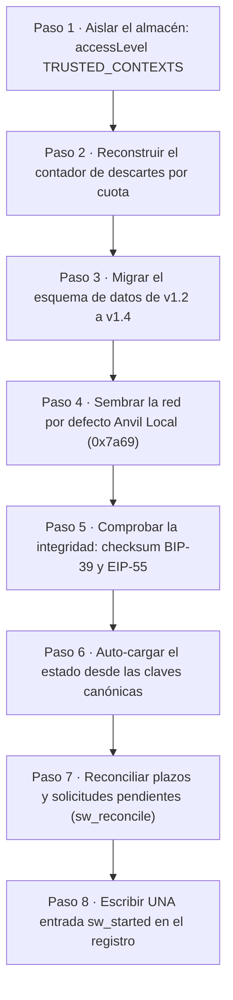

# 01 — Núcleo del Service Worker (arranque, estado, RPC y observabilidad)

Este manual cuenta, en lenguaje llano, qué hace el «cerebro» de **TrueKeate Wallet** cada vez que el
navegador lo despierta. Ese cerebro es el **Service Worker** (el programa de fondo que la extensión
ejecuta sin abrir ninguna ventana; el navegador lo duerme cuando no tiene trabajo y lo vuelve a
despertar cuando llega algo).

Aquí verás el orden exacto del arranque, cómo se atienden los mensajes, cómo se decide qué métodos se
aceptan, cómo se habla con el nodo local, qué códigos de error existen, dónde se guardan los datos y
cómo se registra la actividad. Todo lo que se afirma está tomado del manual técnico del repositorio o
de datos ya confirmados. Lo que no se pudo verificar aparece como «pendiente de confirmar».

Dos aclaraciones de vocabulario que usarás todo el rato:

- **RPC** (llamada a procedimiento remoto): una petición con un nombre de método y unos parámetros, que
  se envía a otro programa y devuelve un resultado o un error.
- **RMW** (lectura-modificación-escritura): el patrón de leer un dato, cambiarlo y volver a guardarlo.
  Si dos operaciones lo hacen a la vez sin orden, una pisa a la otra.

## Empezar en 5 minutos

### Qué necesitas

- Un navegador Chrome o Edge **114 o superior** (es el mínimo que declara la extensión).
- Node.js y npm instalados para compilar el proyecto.
- Foundry instalado, para poder arrancar el nodo local **Anvil**.
- El proyecto descargado en tu equipo.

### Qué vas a conseguir

- La extensión compilada y cargada en el navegador, con identificador estable
  `oiahebaliobknoeeonhgaacapjcpgblo`.
- El nodo Anvil escuchando en `http://127.0.0.1:8545`, con `chainId` 31337 (en hexadecimal, `0x7a69`).
- El Service Worker arrancando, creando su registro de actividad y dejando la red «Anvil Local» lista.

### Los pasos mínimos

1. Instala las dependencias del proyecto con `npm ci`.
2. Compila la extensión con `npm run build`. Esto genera seis entradas en `dist/`: `index.html`,
   `connect.html`, `notification.html`, `background.js`, `content-script.js` e `inject.js`, más
   `dist/manifest.json`.
3. Arranca el nodo local con este comando exacto:

   ```
   anvil --host 127.0.0.1 --port 8545 --chain-id 31337 --allow-origin "chrome-extension://oiahebaliobknoeeonhgaacapjcpgblo,http://localhost:5174,http://127.0.0.1:5174"
   ```

4. Comprueba que el nodo responde: `cast chain-id --rpc-url http://127.0.0.1:8545` debe devolver
   `31337`.
5. Abre el navegador, entra en la página de extensiones y carga la carpeta `dist/` como extensión
   desempaquetada.
6. Abre el popup de la extensión y acepta el aviso de desarrollo. Al hacerlo, el Service Worker se
   despierta, recorre sus ocho pasos de arranque y escribe una entrada `sw_started` en su registro.
7. Si quieres ver saldos reales, crea la cartera e importa la frase de prueba de Anvil
   `test test test test test test test test test test test junk`. Verás 5 cuentas con 10 000 ETH cada
   una (el detalle está en el manual `02-cartera-y-cuentas.md`).

## Arranque (`src/background.ts`, M2)

### Secuencia real de `bootstrap()`

`bootstrap()` es la función que hace de «puesta en marcha». Cada vez que se la invoca, cuenta como un
arranque y escribe **su** entrada `sw_started`. El comentario del propio fichero numera el proceso del
1 al 6 y se salta dos pasos, así que la lista real tiene ocho.

#### Los ochos pasos, con su línea de llamada

<!-- GENERAR_IMAGEN: flujo-arranque.svg -->



Los ocho pasos, en el orden en que ocurren de verdad (el manual técnico los rotula 1, 1.b, 2, 3, 4, 5,
6 y 7; aquí van numerados del 1 al 8 para que la cuenta cuadre):

1. **Aislar el almacén.** Llama a `applyStorageAccessLevel()` y fija
   `accessLevel: 'TRUSTED_CONTEXTS'` lo antes posible. Con esto, ningún content script (el pequeño
   programa que la extensión inyecta dentro de una página web) puede leer la frase de recuperación ni
   las claves privadas.
2. **Diagnóstico del registro.** Llama a `hydrateLogDiagnostics()`. Reconstruye el contador de entradas
   descartadas por falta de espacio, para que ese número siga visible después de una suspensión.
3. **Migraciones de esquema.** Llama a `runMigrationsPhase()`. Actualiza los datos guardados de la
   versión 1.2 a la 1.4 **antes** de leer nada.
4. **Red por defecto.** Llama a `seedDefaultNetworkPhase()`. Siembra la red «Anvil Local» (`0x7a69`,
   marcada como red de pruebas y como predeterminada) y fija el identificador de cadena si falta o no
   es válido.
5. **Integridad.** Llama a `runIntegrityPhase()`. Comprueba la frase (checksum BIP-39) y las
   direcciones (checksum EIP-55). Si algo no cuadra, la cartera queda marcada como «dañada» y no se
   deriva nada en silencio.
6. **Auto-carga del estado.** Llama a `autoLoadStatePhase()`. Con una sola lectura de las claves
   canónicas reconstruye la cuenta activa, la red, las cuentas importadas, las etiquetas y las sesiones.
7. **Reconciliación de plazos.** Llama a `runApprovalReconciliation()`. Vacía la cola de solicitudes,
   responde `4001` a las que se quedaron huérfanas, vuelve a armar las alarmas del navegador,
   reconstruye los datos de transacción en vuelo y de límite de peticiones, restablece la ventana única
   y escribe **una sola** entrada `sw_reconcile`. «Reconciliar» aquí significa poner de acuerdo lo que
   quedó escrito a medias con la realidad actual.
8. **Registro de arranque.** Llama a `writeStartupLog(snapshot)`. Deja **una sola** entrada `sw_started`.

El paso 4 (red por defecto) va después de las migraciones y antes de la integridad, porque la
integridad y la auto-carga ya necesitan una red activa válida. El reloj del arranque se toma antes de
cualquier espera y el tiempo total (`bootMs`) se calcula justo antes de guardar la instantánea en
memoria.

#### Fases normalizadas (tolerantes a fallo)

Cada fase envuelve su módulo en un `try/catch` que **nunca rompe el arranque**. Si algo falla, la fase
devuelve un resultado «degradado» y el arranque continúa:

- Migraciones: si fallan, degrada a un resultado con `ok: false`.
- Integridad: si salta una excepción, degrada a estado «dañado» con el motivo
  `integrity-check-failed`.
- Auto-carga: usa una lectura que nunca lanza; con el almacén vacío devuelve un estado vacío.
- Red por defecto: si falla, avisa por consola y sigue.
- Reconciliación: si falla, degrada a «0 solicitudes procesadas» sin registrarlo.

La idea es simple: un arranque nunca deja la extensión inservible por un fallo parcial.

#### `writeStartupLog` y la entrada `sw_started`

Esta función mide cuánto espacio ocupa el almacén y luego escribe la entrada de arranque con:

- `bytesInUse` (bytes ocupados), `bootMs` (milisegundos que tardó el arranque) y `schemaVersion`.
- El resultado de las migraciones y de la integridad (`ok` y `status`).
- Si se auto-cargó el estado y cuántas solicitudes pendientes se procesaron.

Si la escritura falla, el arranque **no** se rompe: solo avisa por consola. La construcción detallada de
la entrada, la retención y el modo de fallo por cuota pertenecen al módulo de registro (M30).

### Registro SÍNCRONO de los listeners

Los «listeners» son los receptores de avisos: cada uno es una función que se queda escuchando un canal.
El registro corre **sin esperas**, al final del primer ciclo de evaluación. El motivo es concreto: si el
Service Worker se despierta porque alguien se conecta, porque suena una alarma, porque llega un mensaje
o porque se cierra la ventana única, todos los canales deben existir ya. Se registran cuatro:

1. El puerto de aprobaciones, llamado `truekeate_approval`.
2. El escucha de alarmas de vencimiento.
3. Los escuchas de la ventana de decisión única.
4. El escucha de mensajes del Service Worker.

### Disparadores del arranque

Después del registro se enganchan dos avisos del navegador: `onInstalled` (cuando se instala o
actualiza la extensión) y `onStartup` (cuando arranca el navegador). Los dos llaman a `bootstrap()`.
Además hay un **arranque inmediato** al final del fichero, para el caso más común: el Service Worker
despierta por un evento cualquiera, ni por instalación ni por arranque del navegador.

### `BootSnapshot`, `getBootSnapshot` e `isWalletDamaged`

#### Estructura declarada

`BootSnapshot` es la «foto» del arranque. Guarda la hora de inicio, los milisegundos que tardó, la
versión del esquema, el resultado de las migraciones, el de la integridad, el estado auto-cargado y el
de la reconciliación. Esa foto vive en una variable en memoria.

#### Accesores

Hay dos funciones para consultarla:

- `getBootSnapshot()` devuelve la foto, o nada si aún no existe.
- `isWalletDamaged()` devuelve verdadero solo si hay foto **y** la integridad salió mal.

Es decir: mientras no haya foto, la cartera **no** se considera dañada.

#### Qué usa la UI

Estas dos funciones **no tienen ningún consumidor dentro de `src/`**: solo aparecen sus declaraciones, y
tampoco se usan en las pruebas. Son superficie pensada para diagnóstico y pruebas, así que queda
**pendiente de confirmar** si algún consumidor externo (pruebas de navegador o panel) las aprovecha.

La interfaz de usuario **no** lee esa foto: usa el método interno `wallet_getState`. El popup lo llama
y el Service Worker lo atiende recalculando la integridad en ese momento, no leyendo la foto del
arranque. La respuesta incluye si hay cartera, el estado de integridad (con etiqueta, problemas,
presencia y validez de la frase y si se puede derivar), las cuentas, la cuenta activa, las redes, la red
actual, los ajustes y los sitios conectados. Es la vía por la que el popup pinta «wallet dañada» sin
tocar el almacén.

## Registro del listener de mensajes (`registerRpcMessageListener`)

### Discriminante por tipo

Esta función registra el escucha principal de mensajes. Primero obtiene la API del navegador; si no
existe la función para escuchar mensajes, se marcha sin hacer nada. Después decide qué hacer según el
**tipo** del mensaje:

1. **No es del protocolo**: no responde nada y no retiene el canal. Así no deja colgada a otra
   superficie. El protocolo reconoce exactamente **8** tipos cerrados.
2. **`SIGN_RESPONSE`**: es la decisión del usuario en la ventana `notification.html`.
3. **`CONNECT_RESPONSE`**: es la elección del usuario en la ventana `connect.html`.
4. **El resto** (`TRUEKEATE_RPC`, `RESUME`, `TRUEKEATE_REQUEST`, `TRUEKEATE_RESPONSE`, `TRUEKEATE_EVENT`
   y `TRUEKEATE_ANNOUNCE`) cae en el manejador de RPC, que responde `4200` a los tipos del protocolo que
   no sean `TRUEKEATE_RPC`.

### El `return true` asíncrono

Los tres caminos que sí atienden devuelven `true`. En la API de extensiones de Chrome eso significa «la
respuesta llegará más tarde». Es obligatorio, porque el despacho de los métodos internos toca el
almacén. El mensaje que no es del protocolo devuelve vacío y, por tanto, **no** se marca como
asíncrono.

### `deliverToPage`

Esta función entrega una lectura a su pestaña. Reglas reales:

- Sin identificador de pestaña no hay destinatario.
- Sin la API de pestañas tampoco.
- Si el mensaje viene de un frame (un marco dentro de la página) distinto del principal, se entrega
  **solo** a ese frame. Esto es deliberado.
- Si la entrega falla (pestaña cerrada o sin content script), el fallo se ignora y devuelve falso, porque
  la respuesta ya había viajado por el canal normal cuando correspondía.

Cuando quien emite es un content script, la respuesta se entrega **dos veces**: por el canal normal de
respuesta y empujada a la pestaña. Si el enrutador no reconoce el mensaje, se acusa recibo sin cuerpo.

### Orden obligatorio y su motivo real

Aquí hay una regla de orden que costó un defecto:

1. Primero se **responde al emisor**: `sendResponse({ ok: true, outcome })`.
2. Después se hace la pasada de la ventana única: `await refreshApprovalWindowAfterDecision()`.

El motivo es real y medible. Al volver a pintar, el gestor de la ventana empuja a la ventana el cuerpo
de la **siguiente** solicitud. Si ese empuje llegaba **antes** que la respuesta de su propio
`SIGN_RESPONSE`, la ventana marcaba la vista como resuelta —botón «Aprobar» en gris— aunque mostrara la
solicitud correcta, y **la cola se quedaba atascada**. Responder primero y re-empujar después elimina
esa carrera.

Recuerda además que la ventana de decisión **decide, no firma**: firmar y difundir la transacción es
tarea del despacho interno, que espera el desenlace de esa misma entrada.

### Traducción de toda excepción a error EIP-1193

Ninguna excepción escapa del escucha. Cada bloque de captura construye un error interno con un motivo
distinto (`sign-response`, `connect-response` o `rpc-listener`). El último es la red de seguridad:
«jamás un error sin `code` hacia el popup». El resultado es siempre un error con código `-32603` y el
texto «Error interno de la cartera.».

## Router RPC (`src/background/rpc/router.ts`, M3)

### Flujo real de un mensaje `TRUEKEATE_RPC`

El **router** (enrutador) es la pieza que decide qué hacer con cada petición y a quién se la pasa.

#### 1. Redacción de `params` (M22) — `:520-521`

Antes de nada, los parámetros se «redactan»: se tapan los datos sensibles para que no acaben en el
registro. Si la política de redacción falla, se avisa y se devuelve una lista vacía. Es preferible
perder detalle en la traza antes que filtrar un secreto.

#### 2. Guardas de `sender` (M20) — `:529-536`

Se comprueba quién envía el mensaje. El origen **se recalcula solo** a partir del origen real que
entrega el navegador; nunca se cree lo que el mensaje declara. Si la guarda falla, se devuelve el error
sin destinatario.

#### 3. Clasificación del método — `:538-547`

- Un método **fuera del catálogo** responde `4200`. Es el caso real de `eth_sign`, que queda fuera por
  la lista cerrada de tipos y que responde `4200` **sin existir** en el catálogo.
- Un método **declarado pero sin implementación** responde también `4200`, sin lanzar de golpe.

#### 4. Allowlist de contextos — `:549-564`

Una **allowlist** es una lista blanca: solo lo que está en ella se permite. Los métodos internos
`wallet_*` solo se aceptan desde contextos de la extensión. Si llegan desde otro sitio, responden
`4200`. Hay dos excepciones declaradas: la revocación desde el popup y los dos métodos de red.

#### 5. Limitador de tasa (M3.b) — `:566-571`

Se consulta el limitador. Si no se permite, se responde `4001` **sin abrir ventana y sin llamar al
nodo**. Detalles confirmados:

- El limitador es un «cubo de fichas» (*token bucket*): se van gastando fichas y se recargan con el
  tiempo.
- Cubre **todo** el catálogo, también las lecturas.
- Está guardado en el almacén, así que sobrevive a una suspensión.
- Los contextos de la extensión están exentos.
- El límite efectivo es de 6 solicitudes por minuto y por origen.

Justo después hay una defensa extra: si el método es `wallet_revealSecret` y el contexto no es de
confianza, se responde `4200`.

#### 6. Despacho de los aprobables — `:578-609`

Los métodos que requieren aprobación del usuario abren la ventana única. El identificador de petición
viaja de un lado a otro sin interpretarse. Quedan fuera de este paso los métodos de red y la revocación
desde el popup.

#### 7. Despacho de lecturas, red e internos — `:611-660`

- **Lecturas**: se construye el contexto de página y se invocan los manejadores de lectura.
- **Red**: se llama a cambiar de cadena o a añadir cadena, resolviendo antes la cuenta de la sesión.
- **Todo lo demás**: se invoca el método interno correspondiente.

#### Cierre: ninguna excepción sin `code` — `:661-670`

Al final, cualquier fallo se convierte en un error con código. Si ya era un error EIP-1193, se devuelve
tal cual; si no, se construye un error interno.

### Traza de observabilidad

Cada llamada al catálogo deja **exactamente 1 entrada** en el registro:

- `rpc_call` cuando la llamada se resolvió, con los parámetros ya redactados.
- `rpc_error` cuando falló, con el código y el mensaje.

El origen de la traza se recalcula; si la dirección del emisor no se puede interpretar, se usa el origen
`extension`.

### Nombres reales de funciones y líneas

Todo se declara como constantes flecha, así que **no hay ninguna función `async function`** en este
módulo. El manual técnico enumera los nombres y las líneas exactas: `NO_TARGET`, `redactSafely`,
`traceOrigin`, `traceRouteCall`, `dispatchRPCRequest`, `asRecord`, y las factorías internas
`rpcClient`, `sessionsApi`, `eventsApi`, `openConnect`, `networkRunner`, `runNetworkCycle` y
`sessionAccountFor`. Entre las exportadas están `toRpcResponse`, `defaultRouterDeps`, `handleRPCRequest`,
`toEip1193Error`, `handleRpcMessage` y `createCatalogInvoker`.

### `RoutedMessage` y `RpcResponse`

- `RpcResponse` es una unión **excluyente**: o trae `result`, o trae `error`, nunca los dos. El error es
  siempre un objeto EIP-1193 con `code` numérico.
- `RoutedMessage` lleva la respuesta, el destinatario y el contexto del emisor. Si el mensaje no es del
  protocolo, vale vacío; si es del protocolo pero no es `TRUEKEATE_RPC`, trae el error `4200`.

## Catálogo RPC (`src/background/rpc/catalog.ts`, M4)

### Estructura real del catálogo

El catálogo se declara en tres niveles:

1. **Listas de nombres**: las 10 lecturas de página, los 6 métodos que piden aprobación, los 16 métodos
   internos `wallet_*`, los que el popup puede invocar y la lista final con todo junto.
2. **Ficha de cada método**: nombre, tipo (`read`, `approval` o `internal`), contexto permitido
   (`page`, `extension` o `any`), si requiere aprobación, si está implementado y si hay que resolverlo
   como llamada de página.
3. **Mapas de entradas**: un mapa por familia y el mapa final del catálogo.

La validación de parámetros **no** vive en el catálogo genérico: cada manejador comprueba sus propios
parámetros. La única excepción es la guarda de contexto de `wallet_revealSecret`, que está en el router.

### Familias y línea de inicio

El catálogo agrupa los métodos por familias:

- **Cuentas** (internos): generar frase, importar frase, derivar cuentas e importar clave privada.
- **Estado y UI** (internos): desde `wallet_getState` hasta `wallet_acceptDevNotice`.
- **Conexión** (interno): `wallet_getConnectRequest`.
- **Revelado de secretos** (interno): `wallet_revealSecret`.
- **Observabilidad** (interno): `wallet_getLogs`.
- **Revocación**: `handleRevokePermissions`, con su registro para el popup.
- **Cadena y red**: `wallet_getNetworks`, `wallet_switchEthereumChain` y `wallet_addEthereumChain`.
- **Bloque, saldo y gas** (lecturas de nodo): `eth_chainId`, `eth_blockNumber`, `eth_gasPrice`,
  `eth_getBalance`, `eth_feeHistory` y `eth_estimateGas`.
- **Cuentas de página**: `eth_accounts` y `eth_requestAccounts`.
- **Transacciones y firmas** (aprobables): `eth_sendTransaction`, `eth_signTypedData_v4` y
  `personal_sign`. El recibo y la transacción por hash son lecturas.
- **Despacho**: los manejadores internos, los del popup y las dependencias por defecto.

Hay ayudas de consulta para saber si un método es del catálogo, interno, de página, soportado, si
requiere resolución de página, si es invocable desde la extensión, si expone `eth_sign` y para obtener
su ficha.

### Qué queda FUERA del catálogo

- **`eth_sign`**: no está en ninguna lista. La función que lo comprueba debe devolver **siempre** falso y
  el router lo rechaza con `4200`. No existe y nunca se añadirá.
- Las categorías del registro usadas como si fueran nombres de evento (`system`, `call`, `tx`, `sign` y
  `event` son categorías, no eventos).
- Los nombres heredados de almacén, cuyo tratamiento corresponde a las migraciones (M34).

## Métodos internos y de página

### `src/background/rpc/internalMethods.ts` (M4.a)

Este fichero es un **módulo hoja**: su única importación es un tipo, que el compilador borra, así que no
depende de ningún otro módulo en tiempo de ejecución. Eso evita un ciclo de importaciones que hacía
frágil la guarda de emisor.

Declara las **16** entradas internas: `wallet_generateMnemonic`, `wallet_importMnemonic`,
`wallet_deriveAccounts`, `wallet_importPrivateKey`, `wallet_getNetworks`, `wallet_getLogs`,
`wallet_revealSecret`, `wallet_getState`, `wallet_setCurrentAccount`, `wallet_addDerivedAccount`,
`wallet_renameAccount`, `wallet_setAccountVisible`, `wallet_deleteImportedAccount`, `wallet_resetWallet`,
`wallet_acceptDevNotice` y `wallet_getConnectRequest`.

La lista blanca se aplica en la guarda de emisor y en el router: solo se aceptan desde contextos de la
extensión; desde un content script la respuesta es `4200`. `eth_sign` no está ni estará en la lista.

### Unión `InternalMethod` en `src/shared/types.ts` (M55)

El tipo `InternalMethod` enumera los mismos 16 nombres, agrupados por contrato original, por la
ampliación de estado y por la de entrega de la solicitud de conexión. Le acompañan `PageReadMethod` (10
lecturas), `PageMethod` (lecturas más aprobables), `WalletMethod` (todo junto) y `ApprovalMethod` (6).

Como el catálogo declara su lista «atada por tipos», añadir un nombre al tipo sin declararlo en la lista
—o al revés— **no compila**. Es una red de seguridad excelente: el desajuste se detecta al compilar.

### `src/background/rpc/pageMethods.ts` (M4.b)

Registro **cerrado** de las **10 lecturas de página**, congelado para que nadie lo modifique en caliente:
`eth_chainId`, `eth_blockNumber`, `eth_gasPrice`, `eth_getBalance`, `eth_feeHistory`, `eth_estimateGas`,
`eth_getTransactionByHash`, `eth_getTransactionReceipt`, `eth_accounts` y `eth_requestAccounts`.

Detalles reales que conviene conocer:

- `eth_chainId` pregunta al nodo y, si la respuesta no es hexadecimal, cae al valor por defecto.
- `eth_estimateGas` **no** devuelve `4900` ante un rechazo determinista: lo tipa como `-32000` con el
  motivo que da el nodo.
- `eth_accounts` **nunca** abre ventana y renueva la sesión por 24 horas
  (`expiresAt = lastUsedAt + 86400000`), devolviendo la cuenta o una lista vacía.
- `eth_requestAccounts` reutiliza la sesión vigente sin preguntar y emite `connect`; si no hay sesión,
  abre `connect.html` y, si se cancela, lanza `4001`.

## Cliente JSON-RPC (`src/background/rpc/client.ts`, M5)

### Provider único

Aquí «provider» significa el objeto de la librería `ethers` que habla con el nodo. La regla es que hay
**uno solo**, guardado en caché y asociado a la dirección del nodo. Al cambiar de red se destruye el
anterior. La red se declara **estática** para que `ethers` no gaste una llamada extra preguntando el
identificador de cadena. No se usa `fetch` propio ni se crea un proveedor por petición.

### Política CERRADA de reintentos

La política no es ajustable desde la interfaz ni desde los ajustes. Sus valores confirmados:

- `RPC_ATTEMPTS = 4`: cuatro intentos en total.
- `RPC_RETRIES = 3`: tres reintentos.
- `RPC_BACKOFF_MS = [1_000, 2_000, 4_000]`: espera de 1, 2 y 4 segundos antes de cada reintento.
- `RPC_TIMEOUT_MS = 5_000`: cinco segundos de plazo por intento.

El fallo se clasifica como `TIMEOUT`, `ECONNREFUSED`/`ENOTFOUND` o error del propio nodo.

### Rechazo del nodo: no se reintenta

Si el nodo contesta con un error JSON-RPC de servidor, ese error **no se reintenta**: se lanza tal cual.
Se reconoce porque trae un código numérico en el rango de `-32768` a `-32000`. Los códigos propios de la
cartera (4001, 4100, 4200, 4900 y 4901) quedan fuera a propósito, para no confundirlos con errores del
nodo.

### Lecturas tipadas de conveniencia

El módulo ofrece atajos ya listos: `getNetworkInfo`, `getBlockNumber`, `getBalanceWei`, `getGasPrice` y
`estimateGas`. **No existe** aquí una función `getFeeData`, ni
`eth_getTransactionCount(..., 'pending')`, ni `getTransactionReceipt`: esos usos viven fuera de este
módulo y se apoyan en el **mismo** proveedor único, en los ficheros de contrato de transacción, firma y
reconciliación.

### Qué error ve la página al agotarse la política

Cuando se agotan los intentos, el cliente marca el estado como desconectado y lanza un error
`rpcUnavailable` con estos datos: motivo, detalle, método, intentos, reintentos, esperas, plazo y
dirección del nodo.

- Código: **`4900`**.
- Mensaje: «Sin conexión con la red local (Anvil).».
- Acción sugerida: «Arrancar Anvil en 127.0.0.1:8545».

El almacén **no** se toca. La política se verifica en una prueba que sustituye la espera y el plazo
para contar las cuatro llamadas sin aguantar siete segundos reales.

## Catálogo de errores (`src/background/rpc/errors.ts`, M6)

### Tabla real de códigos

El catálogo tiene **8 códigos** y **37 causas**, repartidas en cuatro bloques. Todos los errores que ve
el usuario llevan `code` numérico: está prohibido lanzar un error suelto del tipo «Request timeout».

| Código | Qué significa | Ejemplos de causa |
|---|---|---|
| `4001` | El usuario cancela, la solicitud vence o se rechaza | rechazo explícito; vencimiento del plazo (120 s firma, 60 s conexión); ventana cerrada sin decidir; demasiadas solicitudes pendientes; límite de tasa agotado; permiso de host denegado |
| `4100` | Origen no autorizado | no hay sesión autorizada para ese origen; emisor no autorizado |
| `4200` | Método no soportado o no permitido en ese contexto | método fuera del catálogo (**es el caso de `eth_sign`**); método interno invocado desde un contexto no permitido |
| `4900` | No se pudo hablar con el nodo | la RPC local está caída tras agotar los 4 intentos |
| `4901` | Red no registrada o distinta | la red pedida no está dada de alta; el nodo declara otro identificador de cadena |
| `-32602` | Dato inválido | frase inválida; clave privada inválida; dirección inválida; cuenta duplicada; carga demasiado grande; cuenta desconocida; importe inválido; etiqueta inválida; URL de RPC inválida; definición de red inválida |
| `-32000` | Conflicto de estado o rechazo del nodo | fondos insuficientes; nonce inválido; estimación de gas fallida; cuenta en uso por una dApp; reinicio bloqueado; cartera no creada; transacción en vuelo; difusión rechazada |
| `-32603` | Error interno o de plataforma | error interno; identificador de aprobación duplicado; cuota de almacenamiento superada; difusión interrumpida; cartera dañada; fallo del portapapeles; escritura de migración fallida |

#### Nombres que NO existen en el catálogo real

Una lista de nombres que circula (`userRejected`, `unauthorized`, `unsupportedMethod`, `disconnected`,
`chainDisconnected`, `invalidParams`, `resourceUnavailable`, `expired`) **no** corresponde a este
proyecto. Los nombres reales son los de la tabla, casi todos con el sufijo `Error`. En particular:

- No hay `unauthorized`; el real es `unauthorizedOriginError`.
- No hay `disconnected` ni `chainDisconnected`; el equivalente es `rpcUnavailableError`, código `4900`.
- No hay `invalidParams`; el `-32602` se reparte en causas concretas.
- No hay `resourceUnavailable`; equivale a `rpcUnavailableError`.
- No hay `expired`; el vencimiento es la causa `timeout`, y una solicitud vencida en cola se registra con
  el evento `approval_expired`.

### Construcción y verificación

- `createEip1193Error` construye el objeto con código, mensaje y, si procede, datos.
- Una causa que no esté en el catálogo degrada a error interno.
- `fillMessage` sustituye los huecos de la plantilla: segundos, dirección de la RPC, origen, número y
  motivo.
- `isEip1193Error` valida que el código sea numérico y el mensaje sea texto.
- La tabla se verifica con pruebas propias. Ninguna entrada inventa un mensaje: el fichero transcribe la
  tabla cerrada del diccionario de datos, donde un mismo código admite varios mensajes, uno por causa.

## Estado y esquema (`src/background/state/schema.ts`, M33)

### `STORAGE_KEYS` y `SCHEMA_VERSION`

- La versión vigente del esquema es `1.4`. El recorrido ha sido v1.2 → v1.3 → v1.4.
- La versión se guarda **dentro** de los ajustes, no como clave propia.
- Las claves canónicas son **14**: `mnemonic`, `accounts`, `importedAccounts`, `currentAccount`,
  `chainId`, `networks`, `connectedSites`, `pendingRequests`, `connectRequest`, `approvalWindow`,
  `inflightTx`, `rateWindows`, `logs` y `settings`.
- La clave del contador de entradas descartadas (`truekeate_logs_dropped`) **no** entra en esa lista y
  **sobrevive** al reinicio, como el resto de la observabilidad.

### Verificación de claves canónicas

Todas las claves del almacén empiezan por `truekeate_`. Cualquier clave sin ese prefijo, o con el
prefijo pero no declarada, se rechaza. Hay una función que lo comprueba, otra que lanza un error con el
texto «[truekeate] clave de almacén no canónica» y otra que devuelve un problema tipado
(`-32603`, motivo `non-canonical-key`) en vez de lanzar. Esa última es la que el router reexporta.

### Acceso tipado al almacén

| Función | Qué hace | Si algo va mal |
|---|---|---|
| obtener la API local | Devuelve el almacén local | Devuelve nada si la API no existe |
| leer | Lee las claves que se pidan | **Nunca lanza**: devuelve un objeto vacío |
| escribir | Guarda los datos | **Un reintento inmediato** y después devuelve falso |
| borrar | Elimina claves | La misma política de reintento que escribir |

Que «escribir» devuelva falso es lo que permite al llamador responder `-32603`, o
`-32603 storageQuotaExceeded` si el problema fue la cuota.

### `getStorageQuotaApi` y la cuota observable

- La cuota por defecto es de **10 485 760 bytes** (10 MB), la que aplica Chrome desde la versión 114.
- El aviso salta al 90 % de ocupación.
- Los nombres de error que indican cuota son `QuotaExceededError` y `QUOTA_BYTES`.
- Hay una **fuente única** para detectar la cuota, y el registro la usa para decidir su modo de fallo.
- La lectura de cuota devuelve bytes usados, bytes de cuota, proporción usada, si hay aviso y la clave
  consultada, y **jamás lanza**.

### `resetWallet` y la exclusión de logs

El reinicio de la cartera tiene reglas estrictas:

1. **Los registros de actividad sobreviven** al reinicio. Es intencionado.
2. Hay un complemento con las claves que sí se borran.
3. El orden de las guardas es fijo: cola vacía → sin transacción en vuelo → confirmación destructiva →
   limpieza.
4. Si hay solicitudes pendientes o una transacción en vuelo vigente, el reinicio se bloquea con el error
   `-32000 resetBlocked` y un detalle con el número de pendientes, el de transacciones en vuelo, el paso
   y el motivo `reset-guard`.
5. Sin confirmación explícita, la operación se cancela **sin tocar nada**.
6. La limpieza de plataforma cancela las alarmas de vencimiento y borra la insignia de la extensión sin
   lanzar errores.
7. Si la escritura final falla, termina con un error interno con motivo `reset-write-failed`.

Este módulo **no** escribe en el registro: solo devuelve el evento `reset_wallet` para que otro lo
instrumente.

## Serialización de escrituras (`src/background/state/serialLock.ts`, M33.b)

Un **cerrojo** es un turno: solo una tarea pasa a la vez. Este cerrojo es **FIFO** (el primero que
llega, el primero que pasa) y funciona encadenando promesas: cada tarea se engancha al final de la cola
anterior.

- Es **volátil**: vive en memoria y se reconstruye en cada arranque del Service Worker. **No es fuente de
  verdad**; la verdad está siempre en el almacén.
- Si una tarea falla, **no rompe la cadena**: la siguiente sigue pasando.
- Se usa con un cerrojo por mapa: en la cola de aprobaciones, en las solicitudes de conexión, en las
  sesiones y en el foco de la ventana única.
- El orden de toma importa: el cerrojo de foco se toma **siempre antes** que el de la cola.

El motivo de tener este módulo separado está documentado: una auditoría midió que dos ficheros hacían su
lectura-modificación-escritura **sin cerrojo** y que una solicitud de conexión nunca se purgaba.

## Migraciones (`src/background/state/migrations.ts`, M34)

### Versiones reales que migra

- Versiones soportadas: `1.2`, `1.3` y `1.4`.
- Una instantánea **sin** versión declarada se considera v1.2.
- La versión se lee primero de los ajustes y, si no está, de los nombres heredados
  `schema_version`/`schemaVersion`.

### Qué transforma en cada paso

`planMigration` es **pura**: no escribe ni modifica nada, solo calcula el plan, y es idempotente (hacerla
dos veces da lo mismo). Primero reparte las claves:

- Las canónicas se copian tal cual.
- Las retiradas —hoy solo `truekeate_pending_request`— se eliminan.
- Los nombres heredados se **renombran** a su clave canónica. Si existen las dos, gana la canónica.
- Todo lo demás se acumula en la lista de claves rechazadas.

Después aplica dos pasos:

1. **v1.2 → v1.3**: retira la clave singular; convierte el valor heredado de sitios conectados a su forma
   canónica; rellena el campo `event` de forma determinista a partir de `category` (por ejemplo, `call`
   pasa a ser `rpc_call`, `tx` a `tx_sent`, `sign` a `sign_personal` y `system` a `sw_reconcile`); y
   añade un mapa vacío de etiquetas si falta.
2. **v1.3 → v1.4**: aplica los renombrados acumulados; añade el campo de versión en los ajustes;
   normaliza la cuenta activa de la forma heredada `"0"` a `idx:0`; y escribe la versión.

El indicador de «hubo cambios» se calcula mirando si algún paso renombró, eliminó, añadió o reescribió
algo.

### Cómo rechaza claves no canónicas

- Una versión **desconocida** no se migra hacia atrás, porque eso sí sería perder datos: se informa y no
  se toca nada, con un error interno de motivo `unknown-schema-version`.
- Se **rechaza** toda clave que no sea canónica, no sea un alias heredado migrable y no esté retirada.
  Las rechazadas se informan y **no se tocan ni se copian**.
- Si el plan no aporta cambios, se devuelve el informe tal cual.
- Si la escritura falla, se devuelve un error con motivo `migration-write-failed`.

El nombre con el que el arranque invoca la migración es exactamente `runMigrations`.

## Observabilidad: logger, catálogo de eventos y retención

### `logging/logger.ts` (M30): UNA entrada por evento y firma de `logEvent`

El **logger** (registrador) es quien escribe la actividad. Su función principal recibe la petición de
registro y unas opciones, y solo exige el nombre del evento; además admite nivel, variante, mensaje,
origen, método, datos, hash de transacción y estado de la transacción.

El flujo real:

1. Valida el evento contra el catálogo cerrado.
2. Resuelve la pareja categoría/nivel.
3. Resuelve el mensaje si no se le da uno.
4. Escribe las entradas.

Devuelve la entrada del evento pedido si quedó escrita, y nada si no se guardó (incluido el descarte por
cuota, en cuyo caso lo que se guarda es la entrada de diagnóstico `storage_quota_exceeded`).

Un evento fuera del catálogo lanza un error de programación con el texto «no pertenece al catálogo
cerrado de 24 eventos». **Nunca** se crea una entrada con un evento inventado.

La función que escribe varias entradas hace **una sola lectura y una sola escritura** para todas ellas.
Eso permite que la reconciliación deje su traza y la de cada solicitud huérfana sin pagar un ciclo de
almacén por cada una, y mantiene el arranque por debajo de un segundo.

#### Serialización, saneado y política de cuota

- El logger tiene su **propio cerrojo**. Sin él, dos eventos simultáneos podrían leer la misma lista y la
  segunda escritura pisaría a la primera.
- El saneado de última instancia recorta los datos de llamada a sus **primeros 10 bytes** más el tamaño
  original, y aplica la redacción de datos sensibles.
- Un texto de más de 4096 bytes se sustituye por un resumen con hash, tamaño y marca de recorte.
- Cada entrada se construye con identificador, marca de tiempo, nivel, categoría, evento, mensaje,
  origen normalizado y método.
- La escritura clasifica el fallo en `ok`, `quota`, `error` o `unavailable`.
- Si la escritura se rechaza por **cuota**, se aplica la retención ya calculada y se reintenta **una**
  vez. Si vuelve a fallar por cuota, se incrementa el contador de descartes y se avisa por consola. Nunca
  hay bucle de escritura.

#### `hydrateLogDiagnostics` y el contador de descartes por cuota

Al arrancar el Service Worker se reconstruye el contador de descartes desde su clave propia y se marca
como «ya persistido», para que el descarte siga siendo visible tras una suspensión.

Un detalle medido importante: los contadores **solo se escriben si cambiaron**. El motivo está
documentado: escribir en cada traza costaba dos operaciones de almacén y llevaba la reconstrucción a unos
2 segundos en la prueba de Service Worker suspendido, contra la cota de menos de 1 segundo.

El contador se publica en `wallet_getLogs.dropped`, y el resultado incluye además si la lista viene
recortada.

### `logging/events.ts` (M31): catálogo CERRADO de 24 eventos y 5 categorías

- **5 categorías**: `call`, `event`, `tx`, `sign` y `system`.
- **4 niveles**: `info`, `success`, `warn` y `error`.
- **24 eventos**, entre ellos `rpc_call`, `rpc_error`, `event_emit`, `tx_sent`, `tx_confirmed`,
  `tx_failed`, `tx_reverted`, `sign_personal`, `sign_typed_data`, `approval_created`,
  `approval_resolved`, `approval_expired`, `chain_changed`, `accounts_changed`, `wallet_created`,
  `wallet_imported`, `account_imported`, `account_removed`, `reset_wallet`, `network_added`,
  `permission_revoked`, `sw_started`, `sw_reconcile` y `storage_quota_exceeded`.

`event` y `category` son campos **independientes**: usar una categoría como si fuera un evento es
justamente el defecto que se corrigió, y hay una comprobación que lo impide.

El puente con los eventos del provider traduce `chainChanged` a `chain_changed`, `accountsChanged` a
`accounts_changed`, y `connect`, `disconnect` y `message` a `event_emit`.

### `logging/retention.ts` (M32): retención FIFO `logLimit = 500`, `logMaxPerOrigin = 200`

La **retención** decide qué entradas se conservan cuando hay demasiadas. Los límites normativos son
**500 entradas globales** y **200 por origen**, y se congelan en constantes.

- Si los ajustes aportan límites válidos (enteros positivos), se usan; si no, se cae a los normativos.
  Un ajuste corrupto **nunca** deja la retención sin límite.
- El cálculo es **puro**: ordena por marca de tiempo ascendente, recorta primero por el límite global
  (descartando las más antiguas) y después por origen sobre lo que sobrevivió.
- Una entrada sin marca de tiempo numérica se considera la más antigua.
- Este módulo **no** escribe nada: escribir es tarea del logger, que es el único que toca el almacén.

## Propagación de eventos (`src/background/events.ts`, M27)

### Funciones reales de emisión

El **sobre** del evento lleva el tipo, el nombre del evento y sus datos, y se entrega **sin
transformar**: el content script lo reenvía literalmente a la página, en dos saltos.

Las funciones reales son:

- `emitProviderEvent`: genérica; devuelve cuántas pestañas lo recibieron.
- `emitAccountsChanged`: emite `accountsChanged` con la lista de direcciones, vacía al revocar.
- `emitConnect`: emite `connect` con el identificador de cadena.
- `emitDisconnect`: emite `disconnect` con código y mensaje.
- `emitChainChanged`: emite `chainChanged` con el identificador de cadena **sin envoltorio**, porque
  EIP-1193 lo exige así.
- `emitMessage`: emite `message` con una carga arbitraria. **No se emite** hoy porque ningún método lo
  produce; se publica para dejar el canal cerrado.

`emitChainChanged` se emite a **todas** las pestañas abiertas, porque el cambio puede nacer en el popup
o en una dApp.

### A quién se entregan

- Existe una función que consulta **todas** las pestañas abiertas y filtra las que tienen identificador
  numérico. Si la API falta o falla, devuelve una lista vacía.
- El emisor decide los destinatarios: los que se le indiquen o, si no, todas las pestañas.
- Hay **un único punto** que llama al envío de mensajes a pestañas. Con un frame distinto del principal,
  envía solo a ese frame; en caso contrario, sin opciones.
- La acotación a «sesiones conectadas» no vive aquí, sino en quien llama: por ejemplo, el cambio de
  cuenta activa emite `accountsChanged` **solo** a las pestañas de las sesiones vigentes, con el motivo
  explícito de no publicar la dirección en orígenes sin sesión.
- Omitir los destinatarios emite a **todas** las pestañas, que es lo que ocurre en producción con
  `chainChanged`.

### El reenvío literal por `TRUEKEATE_EVENT`

Un fallo de entrega —pestaña sin content script, cerrada entre la consulta y el envío, o frame
inexistente— **no rompe la propagación**: el error se captura, la función devuelve falso y el resto de
pestañas sigue recibiendo el evento.

Este módulo no usa temporizadores ni escribe en el registro: la instrumentación de estos eventos es del
catálogo y del logger, que traducen el nombre del provider a su evento de registro. El reenvío literal
implica que el sobre viaja tal cual hasta el `window.postMessage` de la capa inyectada.

## Problemas frecuentes

### El botón «Aprobar» de la ventana de decisión aparece en gris y la cola no avanza

**Causa.** Una carrera de tiempos en la ventana única: el re-pintado empujaba la solicitud siguiente
antes de que se hubiera respondido a la anterior, así que la vista se marcaba como resuelta aunque
mostrara la solicitud correcta.

**Solución.** Es un defecto ya corregido: el código responde primero al emisor y **después** hace la
pasada de la ventana. Si lo ves, actualiza la extensión y vuelve a compilar con `npm run build`. Para
comprobar el estado, mira el registro con `wallet_getLogs` y busca las entradas `approval_created` y
`approval_resolved`.

### La página responde «Sin conexión con la red local (Anvil)» con código 4900

**Causa.** El nodo local no responde. La cartera lo ha intentado cuatro veces (con esperas de 1, 2 y 4
segundos y cinco segundos de plazo por intento) y ha agotado la política.

**Solución.** 1) Arranca el nodo con el comando de la sección «Empezar en 5 minutos». 2) Comprueba que
contesta: `cast chain-id --rpc-url http://127.0.0.1:8545` debe devolver `31337`. 3) Recuerda que el
comodín `--allow-origin "*"` es solo para la máquina aislada del arnés de pruebas, no para tu equipo.

### La cartera aparece como «Wallet dañada» y no deja derivar cuentas nuevas

**Causa.** La comprobación de integridad ha encontrado un problema: la frase no supera el checksum
BIP-39, una dirección no supera el checksum EIP-55, una cuenta importada no cuadra con su clave o la
cuenta activa ya no existe. Con la cartera dañada no se deriva nada, a propósito: no se inventan
direcciones.

**Solución.** Abre el popup y lee el motivo que acompaña al estado dañado; el informe trae la lista de
problemas. Recupera la cartera importando de nuevo tu frase buena. No cuenta como daño que no exista
ninguna foto de arranque: sin instantánea, la cartera **no** se considera dañada.

### El registro avisa de que no se pudo guardar por falta de espacio

**Causa.** El almacén local tiene una cuota de 10 MB. La cartera aplica la retención y hace **un solo**
reintento; si vuelve a fallar, descarta la entrada y anota el descarte en el contador.

**Solución.** Es el comportamiento previsto. Puedes reducir el ruido bajando `logLimit` (500 por
defecto) o `logMaxPerOrigin` (200 por defecto) en los ajustes. El contador de descartes se ve en
`wallet_getLogs.dropped` y no se pierde al suspender el Service Worker: se reconstruye al arrancar.

### Un método que esperabas responde 4200 y la aplicación dice que no está soportado

**Causa.** O el método no está en el catálogo, o está declarado pero no implementado, o se está llamando
desde un contexto que no lo permite. `eth_sign` es el caso más claro: **no existe y nunca se añadirá**,
así que responde `4200`.

**Solución.** Comprueba el nombre exacto del método y desde dónde lo llamas. Los métodos `wallet_*` solo
se aceptan desde páginas de la extensión; desde un content script responden `4200`. La extensión no
tiene soporte de cartera hardware (Ledger/Trezor), ni WalletConnect, ni `eth_sign`, ni cifrado con
contraseña: no los busques en el catálogo.

### Demasiadas solicitudes seguidas y la cartera responde 4001 sin llamar al nodo

**Causa.** El limitador de tasa funciona como un cubo de fichas que se recarga con el tiempo. El límite
efectivo es de 6 solicitudes por minuto y por origen, y cubre también las lecturas.

**Solución.** Espera un minuto y vuelve a intentarlo. Los contextos de la extensión (el propio popup y
sus ventanas) están exentos, así que si te pasa desde la interfaz, revisa si hay una dApp insistiendo en
el mismo origen. Ten en cuenta también los topes anti-abuso: 8 solicitudes pendientes en total, 1 por
origen, y 64 KiB de carga máxima por solicitud.

### Tras cerrar y reabrir el navegador, una solicitud que estaba pendiente desaparece

**Causa.** Es la reconciliación de plazos del paso 7 del arranque. Al despertar, el Service Worker vacía
la cola, responde `4001` a las solicitudes huérfanas, vuelve a armar las alarmas y reconstruye los datos
de transacción en vuelo y de límite de peticiones.

**Solución.** Es el comportamiento correcto, y deja una sola entrada `sw_reconcile` en el registro. La
solicitud afectada se cierra con `4001`, que en lenguaje llano significa «cancelada, vencida o
rechazada». El Service Worker se suspende cuando no trabaja: lo hace el navegador por su cuenta, no es un
fallo.
