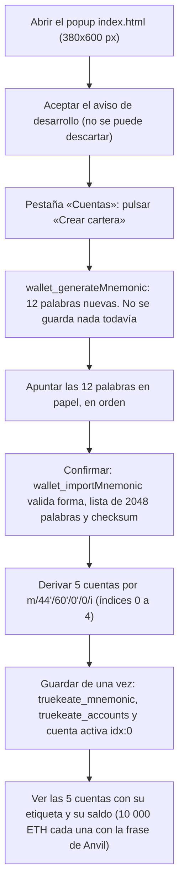

# 02 — Cartera, cuentas y ajustes

Este manual explica, en lenguaje llano, todo el ciclo de vida de la cartera de **TrueKeate Wallet**:
crearla, restaurarla desde una frase, importar una cuenta con su clave privada, gestionar las cuentas
(etiquetas, visibilidad, cuenta activa y bajas), revisar los ajustes, revelar el material de recuperación
y comprobar que la cartera no está dañada.

Antes de empezar, tres términos que aparecerán constantemente:

- **Frase de recuperación** (o frase semilla): 12 palabras en inglés que resumen toda la cartera. Quien
  la tenga, tiene el dinero. La cartera la guarda **en claro** en el almacén local del navegador, sin
  contraseña y sin cifrado en reposo: es una decisión de diseño ya tomada.
- **Derivación**: el proceso matemático que convierte la frase en direcciones, siguiendo una ruta fija.
- **Checksum**: un dígito de control. Sirve para detectar que una frase o una dirección se han copiado
  mal, aunque tengan el aspecto correcto.

Advertencia importante desde el primer minuto: la cartera y sus datos viven **solo** en el almacén local
del navegador, con claves que empiezan por `truekeate_`. Nunca se sincronizan a la nube.

## Empezar en 5 minutos

### Qué necesitas

- La extensión compilada y cargada (ver el manual `01-modulos-background.md`).
- El nodo local Anvil arrancado en `http://127.0.0.1:8545` con identificador de cadena 31337, para ver
  saldos reales.
- Cinco minutos y un sitio físico donde apuntar la frase si vas a crear una cartera nueva.

### Qué vas a conseguir

- Una cartera nueva con la frase de 12 palabras apuntada, o la frase de prueba de Anvil importada.
- **5 cuentas derivadas** por la ruta `m/44'/60'/0'/0/i` (índices 0 a 4), con sus direcciones y sus
  saldos.
- El aviso de desarrollo aceptado, que es obligatorio y no se puede descartar.

### Los pasos mínimos

1. Abre el popup de la extensión (`index.html`). Si es la primera vez, verás el aviso de desarrollo: hay
   que leerlo y aceptarlo. La cartera guarda la fecha de aceptación y no permite borrarla.
2. Ve a la pestaña «Cuentas» y busca la sección «Cartera».
3. Pulsa **«Crear cartera»**. La extensión pedirá al Service Worker una frase nueva de 12 palabras. En
   ese momento no se guarda nada.
4. **Apunta las 12 palabras en papel, en orden.** Es el único momento en que la interfaz te las enseña
   directamente al crear la cartera.
5. Confirma. Ahí sí se valida la frase (forma, lista de 2048 palabras inglesas y checksum) y se guarda.
6. La cartera deriva las 5 primeras cuentas y deja activa la cuenta `idx:0`.
7. Comprueba los saldos. Si quieres ver dinero de prueba, reinicia la cartera e importa la frase de
   prueba de Anvil `test test test test test test test test test test test junk`. Cada una de las 5
   cuentas tendrá 10 000 ETH.

## Alcance y mapa de módulos

### Módulos que intervienen

Cada pieza del ciclo de vida vive en un fichero propio. Esta es la lista real:

| Módulo | Fichero | Para qué sirve |
| --- | --- | --- |
| M8 | `src/background/crypto/mnemonic.ts` | Frases BIP-39 dentro del Service Worker: generarlas y comprobarlas |
| M9 | `src/background/crypto/hd.ts` | Derivar cuentas por la ruta `m/44'/60'/0'/0/i` |
| M10 | `src/background/crypto/importAccount.ts` | Importar una cuenta a partir de su clave privada |
| M12 | `src/background/crypto/secrets.ts` | Revelar y exportar el material de recuperación |
| M13 | `src/background/crypto/integrity.ts` | Comprobar la integridad de la cartera al arrancar |
| M28 | `src/background/accounts.ts` | Cuentas: alta, etiquetas, visibilidad, cuenta activa y baja |
| M29 | `src/background/settings.ts` | Los ajustes: valores por defecto, lectura y escritura |
| M57 | `src/shared/constants.ts` | Fuente única de las constantes del proyecto |
| M58 a M61 | `src/shared/validation/*.ts` | Validación de forma compartida entre popup y Service Worker |
| M62 | `src/shared/format.ts` | Dar formato a importes, direcciones y fechas |
| M4.a | `src/background/rpc/internalMethods.ts` | Lista cerrada de los métodos internos `wallet_*` |

La frontera está clara: la carpeta compartida `src/shared/**` la usa el popup y **no** importa `ethers`,
mientras que el paquete criptográfico vive solo en el Service Worker. Así el popup no arrastra una
librería enorme.

### Claves de `chrome.storage.local` implicadas

Los nombres canónicos de las 14 claves están en `src/background/state/schema.ts`. Las que gobierna este
subsistema son:

- `truekeate_mnemonic`: la frase ya normalizada. Puede no existir si solo hay cuentas importadas.
- `truekeate_accounts`: lista de direcciones. **La posición en la lista ES el índice BIP-44.**
- `truekeate_imported_accounts`: cuentas importadas, con dirección, clave privada, etiqueta, fecha de
  alta y visibilidad.
- `truekeate_current_account`: la cuenta activa, en la forma `idx:<n>` o `imp:<dirección>`.
- `truekeate_settings`: valores por defecto, etiquetas y aceptación de avisos.

La versión del esquema es `1.4` y se declara **dentro** de los ajustes, no como clave propia.

#### Forma de `AccountRef`

Una **referencia de cuenta** admite tres formas: `idx:<número>` para una cuenta derivada, `imp:<dirección>`
para una importada y la forma heredada sin prefijo, solo con el número. La cartera las interpreta al
leerlas.

#### Forma de `ImportedAccount`

El contrato guardado de una cuenta importada es
`{ address, privateKey, label, importedAt, visible }`, con la etiqueta limitada a 32 caracteres.

## Creación de la cartera (onboarding)

<!-- GENERAR_IMAGEN: flujo-onboarding.svg -->

### Generación de la frase BIP-39 (M8)

La generación produce una frase de **12 palabras** a partir de **128 bits** de azar puro del generador
criptográfico del sistema, y devuelve la frase ya con su checksum BIP-39 aplicado. La equivalencia es
exacta: 16 bytes de entropía son 128 bits, y 128 bits producen 12 palabras.

#### Normalización previa obligatoria de la entropía

El generador no usa directamente el resultado del azar: lo envuelve para garantizar que sea del tipo
correcto. El motivo está documentado en el código: la librería `ethers` en su versión 6 puede devolver un
tipo de Node según cómo lo empaquete la herramienta de compilación, y la función de generación lo
rechaza con «invalid BytesLike value». Es un defecto estructural ya cerrado.

#### Lista de palabras y checksum

- La lista BIP-39 inglesa (2048 palabras) es una instancia única del Service Worker.
- El checksum **no** se implementa a mano: lo aporta la librería al generar y al verificar.
- La comprobación completa de una frase se hace en tres pasos y distingue la causa del fallo: forma,
  pertenencia a la lista de 2048 palabras y checksum.
- Los dos últimos producen **el mismo** error del catálogo (`-32602 invalidMnemonic`), porque el texto
  que ve el usuario es único.

### Derivación HD (M9)

La ruta de derivación es **única y obligatoria**: el prefijo es `m/44'/60'/0'/0` y la ruta completa es
`m/44'/60'/0'/0/i`. Aquí `i` es la posición de la cuenta en la lista `truekeate_accounts`.

Las funciones que expone el módulo permiten construir la ruta, validar un índice, derivar una dirección,
derivar una clave privada, derivar una cuenta completa, derivar varias y comprobar que una derivación es
coherente.

#### Cota de índice

El índice máximo admitido es `0x7fffffff` (2 147 483 647). La comprobación exige que sea un número
entero, mayor o igual que cero y menor o igual que ese máximo.

#### Cero derivaciones ante una frase inválida

Si la frase normalizada está vacía, si el índice no es válido o si la librería falla, la derivación
devuelve nada. Y al derivar varias cuentas, en cuanto una falla se devuelve **lista vacía** en lugar de
un resultado a medias: la cartera **nunca inventa direcciones**.

### Cuántas cuentas se derivan y con qué semilla de desarrollo

- Al crear la cartera se derivan **5 cuentas** (índices 0 a 4). El botón «Añadir cuenta» incrementa ese
  número.
- Existe una frase de prueba de Anvil como **pista de desarrollo**:
  `test test test test test test test test test test test junk`.
- Esa frase es **solo** una pista. **Nunca** se guarda como cartera del usuario ni se escribe en el
  registro de actividad.

### Persistencia del alta (M28)

Guardar la cartera a partir de una frase ya validada obedece a seis pasos concretos:

1. Todo ocurre dentro de un **cerrojo compartido** de lectura-modificación-escritura, para que dos
   operaciones simultáneas no se pisen.
2. Se calcula cuántas cuentas hay que derivar: como mínimo 1, redondeando hacia abajo el ajuste
   guardado.
3. Se derivan desde el índice 0. Si el número devuelto no coincide con el pedido, se responde un error
   interno con motivo `derivation-failed`: es un fallo del programa, no un dato mal escrito por el
   usuario.
4. Se **reinician** las etiquetas y la lista de cuentas ocultas, porque la cartera es nueva.
5. Se escribe de una vez: la frase, la lista de cuentas, la cuenta activa `idx:0` y los ajustes.
6. Si el almacén rechaza la escritura, se devuelve `-32603 storageQuotaExceeded`.

La función que crea la cartera genera la frase y delega el guardado, y devuelve además la frase para que
el popup la muestre **una sola vez**. A partir de ahí solo se puede obtener por el revelado de secretos.

### Flujo de UI del alta

- La pestaña «Cuentas» permite listar, ver la cuenta activa, añadir, importar (frase o clave privada),
  renombrar y eliminar.
- El botón de creación vive en la sección «Cartera» y, al terminar, muestra el aviso: «Cartera creada:
  revisa «Seguridad» para guardar tu frase.».

#### Métodos `wallet_*` que invoca el alta

El alta **no** usa un solo método, usa dos encadenados:

1. El popup pide la frase con `wallet_generateMnemonic`. Este método **no persiste nada**.
2. El popup muestra la frase y, cuando el usuario confirma, llama a `wallet_importMnemonic` pasando la
   frase como único parámetro.

Ese encadenado es intencionado: separar «generar» de «guardar» permite al usuario ver y apuntar la frase
antes de que se escriba nada.

## Restauración / importación de frase

Restaurar una cartera recorre el mismo camino de guardado que crearla, pero cambia el origen de la frase
y añade la verificación completa del checksum.

### Validación estructural compartida (M59)

Este validador vive en la capa compartida y lo usa el popup, así que **no** importa `ethers` ni hace
criptografía. Comprueba solo la **forma**:

- 12 palabras.
- Cada palabra, entre 3 y 8 letras.
- Palabras en minúsculas, solo letras, separadas por espacios simples.

#### Normalización NFKD (fuente única)

Antes de validar, el texto se normaliza: se recortan los extremos, se eliminan los acentos con la
normalización NFKD (una forma estándar de descomponer caracteres acentuados), se pasa todo a minúsculas,
se colapsan los espacios repetidos a uno solo y se vuelve a recortar.

El motivo está comentado en el código: se normaliza **antes** de rechazar una palabra acentuada para que
el error sea siempre el mismo (`-32602 invalidMnemonic`) y no dependa del teclado del usuario. La
normalización es **determinista**: dos entradas con espacios o mayúsculas irregulares producen la misma
cadena, y hay una función que compara dos frases con ese criterio.

M8 **reexporta** el número de palabras y el normalizador de este módulo para no duplicar la regla.

#### Qué valida la UI y qué no

La interfaz comprueba forma y alfabeto y devuelve un fallo tipado con tres motivos posibles: `empty`
(vacía), `wordCount` (no son 12 palabras) y `wordFormat` (palabra mal formada).

El **checksum no se comprueba aquí**: es criptografía y vive en el Service Worker. El popup aplica el
normalizador antes de enviar la frase.

### Importación en el Service Worker (M28 + M8)

El método interno que hace el trabajo es `importWalletFromMnemonic`. Ojo: **no existe** una función
llamada `importMnemonic` en los módulos de criptografía; la lista real de funciones exportadas es otra.
El comportamiento es:

1. Se comprueba la frase completa: normalización, pertenencia a la lista y checksum.
2. Si no es válida, se devuelve el error del veredicto o, en su defecto, `-32602 invalidMnemonic`, **sin
   escribir nada**.
3. Si es válida, se guarda con la frase **ya normalizada**.

El resumen del propio código lo dice claro: «normaliza espacios y mayúsculas y comprueba el checksum
BIP-39. Un checksum roto responde `-32602 invalidMnemonic` sin escribir nada».

### Error devuelto con una frase inválida

- Código: **`-32602`**, causa `invalidMnemonic`.
- Mensaje: «La frase de recuperación no es válida: revisa las 12 palabras y su checksum.».
- Acción sugerida: «Revisar la frase».

Esto cubre los **tres** motivos (forma, palabra desconocida y checksum). El código distingue entre
«palabra desconocida» y «checksum inválido» para diagnóstico interno, pero al usuario le llega el mismo
error.

## Importación por clave privada

Importar por clave privada calcula la dirección a partir del número secreto y guarda una entrada propia,
independiente de la derivación por frase.

### Validación estructural y rango secp256k1 (M61)

Este validador comprueba dos cosas sin criptografía:

1. **La forma**: `0x` seguido de exactamente 64 caracteres hexadecimales.
2. **El rango**: el número debe ser mayor que 0 y menor que el orden del grupo de la curva
   **secp256k1** (la curva que usa Ethereum). El orden se declara como una constante hexadecimal larga.

El comentario de la constante explica por qué puede vivir en la capa compartida: comprobar el rango es
**aritmética, no criptografía**, y por eso el popup también puede usarla.

La validación nunca lanza excepciones; describe el fallo con el error tipado del catálogo:

- Código: **`-32602`**, causa `invalidPrivateKey`.
- Mensaje: «La clave privada no es válida: debe ser `0x` + 64 caracteres hexadecimales de la curva
  secp256k1.».

#### Enmascarado para trazas

Existe una función que convierte una clave privada en algo así como `0xac09…ff80` (o `0x…` si la forma
no es válida) para poder citarla en una traza sin exponerla. La clave completa **nunca** se guarda en los
registros.

### `computeAddress` y checksum EIP-55 (M10)

- La dirección se calcula con la función de la librería `ethers` versión 6, que es la **única** vía de
  cálculo.
- La dirección se devuelve **con checksum EIP-55**, que es la forma en que se persiste. EIP-55 mezcla
  mayúsculas y minúsculas de forma calculada para que un error de copia se detecte.
- Si la clave resulta fuera de rango o de longitud inesperada, se descarta sin lanzar: el error tipado lo
  pone el módulo de cuentas.
- Hay otra función que contrasta clave y dirección, y se usa en la comprobación de integridad.

### Cómo se marca una cuenta importada

La operación que guarda la importación sigue este contrato:

1. Valida con M10. Si no hay candidato válido, responde `-32602 invalidPrivateKey`.
2. Detecta duplicados comparando en minúsculas contra **derivadas e importadas**. Si ya existe, responde
   `-32602 duplicateAccount` con el mensaje «Esa cuenta ya está en la cartera.».
3. Valida la etiqueta. Una etiqueta presente pero inválida responde `-32602 invalidLabel` con el motivo.
   Antes solo se miraba que la longitud fuera mayor que cero, y una etiqueta de 33 caracteres se guardaba
   tal cual: es un defecto ya cerrado.
4. Construye la entrada con la etiqueta indicada (o `Importada N` por defecto), la fecha de alta y
   **`visible: true`**.
5. Guarda la lista y devuelve la vista con su referencia canónica `imp:<dirección>`.

El campo que marca la visibilidad es `visible` dentro de la entrada de la cuenta importada, y la etiqueta
vive en esa misma entrada, no en los ajustes.

#### Etiquetas por defecto

- Cuenta importada: `Importada N`.
- Cuenta derivada: `Cuenta N`, donde `N` es el índice más uno.

Los prefijos son constantes: `Importada` y `Cuenta`.

### Specs de la importación

- Un fichero de pruebas cubre la importación por clave privada: `0x` + 64 hexadecimales dentro del rango
  de secp256k1, cálculo de la dirección con checksum EIP-55 y descarte de la clave fuera de rango. La
  detección de duplicados pertenece al módulo de cuentas y se prueba aparte.
- Otro fichero es la regresión de un defecto de orden de importaciones: reproduce el orden que rompía la
  guarda de emisor y falla si alguien vuelve a importar la lista de métodos internos desde el sitio
  equivocado.

## Modelo de cuentas (`src/background/accounts.ts`)

Este módulo gobierna las cuentas. Toca cinco claves: la frase, la lista de derivadas, la lista de
importadas, la cuenta activa y los ajustes.

### Tipos y referencias

- **Tipo de cuenta**: `derived` (derivada) o `imported` (importada).
- **Vista de cuenta**: lo que consume la interfaz: referencia, dirección, tipo, índice (solo derivadas),
  etiqueta, visibilidad, fecha de alta y si es la activa.
- **Resultado de cuentas**: una unión que **nunca lanza**; o trae el valor, o trae el error.
- **Instantánea de la cartera**: la foto tipada del almacén.
- **Constructores de referencia**: uno produce `idx:<n>` y otro produce `imp:<dirección>`.

#### Interpretación estricta de referencias

Al leer una referencia se aceptan la forma heredada sin prefijo y la canónica `idx:`; en **ambas** ramas
se exige que haya dígitos antes de validar el índice. El defecto cerrado está documentado: antes, un
texto vacío se convertía en el número 0, de modo que una referencia mal formada actuaba sobre la primera
cuenta —revelar, renombrar o fijar «ninguna cuenta»—, y un número enorme se aceptaba sin comprobar el
rango.

### Lectura del estado y saneado

- Hay una función **pura** que normaliza la instantánea y otra que la aplica sobre el almacén leído.
- Existe cartera si hay frase, cuentas derivadas o cuentas importadas.

#### Fallo cerrado ante una lista con huecos

El saneado de la lista de direcciones **no compacta**: si alguna entrada no tiene forma de dirección,
devuelve la lista entera como vacía. El motivo es serio: como la posición en la lista **es** el índice
BIP-44, compactar haría que pedir el secreto de la cuenta `idx:2` entregara la clave privada de **otra**
cuenta, etiquetada con la dirección que se muestra en pantalla. Sin cuentas, cualquier referencia `idx:`
responde `-32602 unknownAccount` en lugar de revelar la clave de otra cuenta.

El saneado de las importadas es más tolerante, entrada a entrada: descarta las que no tienen dirección
válida o clave privada de tipo texto, y normaliza etiqueta, fecha de alta y visibilidad.

### Vistas de cuenta y visibilidad

El orden de las cuentas es el de la lista de derivadas (índice BIP-44) y **después** las importadas por
orden de alta. Las ocultas se incluyen con la marca `visible: false`; quien decide si se pintan es una
función aparte.

- Derivadas: la etiqueta sale de los ajustes y la visibilidad de la lista de índices ocultos.
- Importadas: la etiqueta sale de su propia entrada (o `Importada N` si está vacía) y la visibilidad de
  su campo `visible`.

### Clave persistida de cada cosa

| Concepto | Dónde se guarda |
| --- | --- |
| Frase semilla | `truekeate_mnemonic` (texto normalizado) |
| Cuentas derivadas | `truekeate_accounts` (lista de textos; posición = índice BIP-44) |
| Cuentas importadas | `truekeate_imported_accounts` (entrada con clave privada) |
| Cuenta activa | `truekeate_current_account` (`idx:<n>` o `imp:<dirección>`) |
| Etiqueta de derivada | `truekeate_settings.accountLabels[índice]` |
| Etiqueta de importada | el campo `label` de la entrada importada |
| Visibilidad de derivada | `truekeate_settings.hiddenAccounts[]` (lista de índices) |
| Visibilidad de importada | el campo `visible` de la entrada importada |
| Número de derivadas | `truekeate_settings.derivedAccountCount` |

### Alta de una cuenta derivada

La operación deriva la **siguiente** cuenta, con índice igual a la longitud actual de la lista, la guarda
y amplía el contador de derivadas.

- Es idempotente frente a reintentos: si el índice ya existe, no vuelve a escribir.
- Sin frase no se deriva nada: responde `-32000 walletNotCreated` con el mensaje «Todavía no hay ninguna
  cartera: no se puede derivar ninguna cuenta.».
- Si la derivación falla, responde un error interno con motivo `derivation-failed` y el índice.

### Baja de cuenta

La baja solo existe para cuentas importadas y aplica tres guardas **en este orden**:

1. La referencia debe apuntar a una importada existente. Si no, responde `-32602 unknownAccount` o
   `-32602 invalidAddress`.
2. Si una dApp tiene una sesión **vigente** sobre esa dirección, responde `-32000 accountInUseByDapp` y la
   lista de importadas queda intacta.
3. Si la cuenta eliminada era la activa, la activa pasa a `idx:0` cuando existe, o a la primera importada
   restante.

Las cuentas derivadas **no** se pueden eliminar por esta vía: solo se ocultan. Y volver a mostrar una
derivada oculta devuelve **la misma dirección**, porque se recalcula con la misma ruta.

#### Guarda de sesión de dApp

Una sesión se considera vigente si existe, no está marcada como desconectada y no ha vencido (sin fecha
de caducidad significa que no caduca). La comprobación de «esta cuenta está en uso por una dApp» la
**comparten** el revelado de secretos y la baja de una importada. El error real es
`-32000 accountInUseByDapp`.

### Etiquetas

- Renombrar escribe la etiqueta en los ajustes para las derivadas y en la propia entrada para las
  importadas.
- Una etiqueta fuera de 1 a 32 caracteres responde `-32602 invalidLabel`.
- El máximo de 32 caracteres es el mismo para derivadas e importadas.

### Cuenta activa

- La función que devuelve la referencia activa entrega la guardada si sigue existiendo y, si no, **la
  primera cuenta disponible**.
- Otra función resuelve la dirección de esa referencia.
- Fijar la cuenta activa canonicaliza la referencia y responde `-32602 unknownAccount` si no apunta a
  ninguna cuenta existente.

### Diferencia entre cuenta derivada, importada y visible

- **Cuenta derivada**: su dirección se calcula de la frase con `m/44'/60'/0'/0/i`; vive en la lista de
  derivadas y **su posición es su índice BIP-44**. No se elimina, solo se oculta. Su etiqueta va a los
  ajustes.
- **Cuenta importada**: su clave privada se guarda como material propio y **no** se puede volver a
  derivar de la frase. Es la única que se puede **eliminar**, y con la guarda de sesión de dApp. Su
  etiqueta va en su propia entrada.
- **Cuenta visible**: no es un tercer tipo, es una **bandera**. En las derivadas la gobierna la lista de
  índices ocultos; en las importadas, el campo `visible`. Esa bandera es lo que filtra lo que pinta el
  popup.

### Proyección para la UI

Existe una función que prepara la respuesta del método `wallet_getState`: presencia de cartera, cuentas
(incluidas las ocultas, con su bandera), cuenta activa y ajustes. Así el popup deja de leer el almacén
directamente. No duplica reglas: reutiliza la instantánea de cuentas y evita depender del módulo de
integridad para no crear un ciclo de importaciones.

## Ajustes (`src/background/settings.ts`)

Este módulo gobierna `truekeate_settings`: valores por defecto, lectura y escritura tipada, etiquetas y
aceptación de avisos.

### Campos reales y valores por defecto

| Campo | Valor por defecto |
| --- | --- |
| `derivedAccountCount` | 5 |
| `accountLabels` | mapa vacío |
| `balancePollMs` | 5000 |
| `balancePollMaxAccounts` | 10 |
| `logLimit` | 500 |
| `logMaxPerOrigin` | 200 |
| `sessionTtlMs` | 86400000 (24 h) |
| `pendingRequestsMax` | 8 |
| `pendingRequestsMaxPerOrigin` | 1 |
| `pendingRequestsPerMinute` | 6 |
| `language` | `'es'` |
| `encryptionEnabled` | `false`, forzado |
| `requirePasswordOnOpen` | `false`, forzado |
| `schemaVersion` | `'1.4'` |
| `hiddenAccounts` | lista vacía |

El contrato compartido declara los mismos campos más la fecha de aceptación del aviso de desarrollo.

#### Invariantes de P-03

`encryptionEnabled` es **siempre** `false` y `requirePasswordOnOpen` **siempre** `false`. Se conservan por
compatibilidad y el módulo los fuerza aunque el almacén traiga otro valor. En lenguaje llano: la cartera
**no tiene contraseña y no cifra** lo que guarda.

### Lectura y escritura tipada

- El saneado combina lo guardado con los valores por defecto **sin confiar en la forma almacenada** y
  fuerza las invariantes anteriores.
- Hay una versión pura del saneado, pensada para pruebas.
- La lectura **nunca lanza**: ante un fallo devuelve los valores por defecto.
- La escritura sanea y guarda; si el almacén la rechaza, devuelve `-32603 storageQuotaExceeded`.
- Hay una operación que aplica un parche bajo el cerrojo.

#### Cerrojo compartido con M28

El cerrojo de escritura de ajustes es un cerrojo único creado encadenando promesas, sin temporizadores,
apto para el Service Worker. Todas las operaciones de cuentas lo usan, de modo que dos modificaciones
simultáneas no se pisan.

#### Saneado de `hiddenAccounts` y `accountLabels`

- La lista de cuentas ocultas acepta solo enteros no negativos, elimina repeticiones y **ordena**.
- El mapa de etiquetas acepta claves de índice y valores de texto no vacío.

### Etiquetas: validación y prefijos

- Se exige entre 1 y 32 caracteres y se rechazan los caracteres de control.
- Los motivos posibles son `empty` (vacía), `tooLong` (demasiado larga) y `control` (carácter de
  control).
- Al normalizar se recortan los extremos y se colapsan los espacios internos, pero **no** se recorta a 32
  caracteres: eso «sería aceptar en silencio algo que el usuario no pidió».
- La etiqueta de una derivada es la guardada o `Cuenta N`.

### Aceptación de avisos (RNF-23)

El aviso del primer arranque **no es descartable**. La marca es una fecha de aceptación que solo se
registra si es un instante finito y positivo.

La regla dura: la aceptación es **idempotente** y no se puede borrar ni desplazar. La **primera**
aceptación fija el instante y una aceptación posterior no lo mueve.

- Hay una función que comprueba si el aviso ya se aceptó.
- Otra lo registra conservando siempre el instante más antiguo.
- El método interno es `wallet_acceptDevNotice` y su sección se declara como «aviso no descartable».
- En el popup, la aplicación pasa a la fase de aviso si no hay fecha de aceptación y a la fase lista en
  caso contrario. El botón de aceptación llama al método correspondiente.

### Avisos de red: `NON_TESTNET_WARNING` y `ADD_CHAIN_ACTIVATION_NOTE`

Los dos textos viven en el fichero de constantes, porque quien decide **cuándo** aparecen es otro módulo:

- **`NON_TESTNET_WARNING`**: «Atención: no es una red de pruebas. Las operaciones se firman contra una
  red real y pueden comprometer fondos reales.».
- **`ADD_CHAIN_ACTIVATION_NOTE`**: «La red se añadirá a la lista, pero seguirás en la red actual: para
  usarla tendrás que cambiarla con una solicitud aparte.».

#### Dónde se consumen

- El aviso de red real se publica en la vista previa de la red y se pinta en tres puntos de la vista de
  redes.
- La nota de activación viaja en la vista previa del alta y se muestra en la vista de redes.

## Validación de entrada compartida

Los cuatro validadores viven en la carpeta compartida y los usa el popup, así que **ninguno** importa
`ethers`: la criptografía de verificación es tarea del Service Worker.

### Dirección (M58)

- La longitud exigida es de 40 caracteres hexadecimales, con el patrón `0x` seguido de 40 caracteres.
- El estilo de mayúsculas se clasifica en `lowercase`, `uppercase` o `mixed`.
- La validación devuelve la dirección, su estilo de mayúsculas y el campo `checksumVerified`, que es
  **siempre falso**.

#### Por qué el checksum EIP-55 no se verifica aquí

EIP-55 exige una función de resumen criptográfico (`keccak256`), así que la verificación real es del
Service Worker: al importar, al arrancar y al enviar una transacción. El veredicto autoritativo es
siempre el del Service Worker; esta validación solo evita enviar una operación con una dirección
manifiestamente malformada. El campo `checksumVerified` se expone para que la interfaz no dé por buena
una dirección de mayúsculas mezcladas sin advertirlo.

- Código del error: **`-32602`**, causa `invalidAddress`.
- Mensaje: «La dirección no es válida: revisa el formato `0x` + 40 caracteres hexadecimales.».
- La comparación de direcciones no distingue mayúsculas.

### Importe ETH (M60)

- Forma aceptada: dígitos con **punto** decimal opcional. Sin signo, sin notación científica y sin
  separador de millares.
- Decimales aceptados: como máximo **4**. La cota es parametrizable, pero el proyecto fija ETH a 4
  decimales.
- La escala es de **18 decimales** (los wei, la unidad mínima de ETH).
- El máximo del EVM es `2^256 - 1`.

La conversión de ETH a wei se hace con aritmética de enteros grandes **exacta**, sin coma flotante: un
número decimal normal perdería precisión a partir de 2^53 wei. El truncado por debajo del decimal 18 es
deliberado y está documentado como defecto corregido: antes no se recortaba y el valor se reinterpretaba
como una magnitud mayor.

La validación devuelve los wei exactos como texto decimal y la forma normalizada sin ceros sobrantes.
Los motivos posibles son `empty`, `format`, `decimals` y `overflow`.

#### Comprobación de decimales y de saldo suficiente

- El fallo por decimales salta cuando la parte fraccionaria tiene más de 4 dígitos.
- El contraste con el saldo es una comparación exacta en wei.
- Si el saldo no cubre el importe, se devuelve `-32000 insufficientFunds`.

#### Error tipado del importe

Un fallo de formato se describe con `-32602 invalidAmount`, y el motivo interno viaja en los datos del
error.

### Clave privada (M61)

Ya explicada en la sección de importación: forma (`0x` + 64 hexadecimales), rango (mayor que 0 y menor
que el orden de secp256k1) y veredicto tipado. Sus ayudas booleanas permiten preguntar solo por la forma
o por la validez completa.

### Spec que cubre los cuatro

Un único fichero de pruebas cubre la validación en línea de los cuatro formularios —frase, dirección,
importe y clave privada— con magnitudes concretas: cada fallo se describe con su motivo y su código
`-32602`, y cada acierto con el valor normalizado exacto.

## Formato de presentación (`src/shared/format.ts`)

Este módulo da formato a importes, direcciones y fechas para **toda** la interfaz, y **no** importa
`ethers`.

### `formatEthWithSymbol` y la familia de importes

- La función principal devuelve el importe con su símbolo: por ejemplo `1,0000 ETH`.
- Se apoya en dos funciones: una que usa **punto** decimal y otra que usa **coma** decimal, esta última
  para la interfaz en español.
- Ambas **truncan** (nunca redondean hacia arriba: la interfaz no debe mostrar más saldo del que existe).
- El valor por defecto es de 4 decimales.
- Ningún formato usa separador de millares ni notación científica, para que el valor se pueda copiar sin
  ambigüedad.

### Recorte de direcciones y hashes

- El recorte produce algo como `0x1234…abcd`: prefijo de 6 caracteres (contando el `0x`), puntos
  suspensivos y sufijo de 4. Si la entrada es más corta que el recorte, se devuelve tal cual.
- Hay funciones específicas para direcciones y para hashes de transacción, con el mismo criterio.
- Los suspensivos son el carácter `…` (U+2026), **no** tres puntos.

### Marcas de tiempo y utilidades

- Las fechas se formatean como `dd/mm/aaaa hh:mm:ss` en formato español determinista. Está hecho a mano
  y no con la librería de internacionalización, para que la salida sea idéntica en el popup, en los
  registros y en las pruebas.
- Hay una función que alimenta la etiqueta «12/12 palabras» de la interfaz.
- Hay otra que pluraliza: `1 cuenta` / `3 cuentas`.

## Revelado y exportación del material de recuperación

Este módulo implementa la función de revelado de secretos, con una higiene estricta y la guarda de
sesión de dApp activa.

### Contrato del revelado y sus cuatro reglas

1. **Confirmación explícita obligatoria**: sin el campo `confirmed: true` no se entrega nada. Se
   responde `4001`.
2. **Solo contextos de confianza**: contexto de la extensión **y** ruta en la lista blanca (el popup,
   `index.html`). Cualquier otro responde `4200`. La frontera es el **origen**, no la pestaña.
3. **Guarda `-32000`** si hay una sesión vigente en la lista de sitios conectados.
4. **Higiene del revelado**: oculto por defecto, plazo de 30 segundos, ocultado también al perder el
   foco, descarte del valor en memoria y borrado del portapapeles.

Las tres guardas se aplican **en ese orden**: contexto, confirmación y sesión de dApp.

- Sin confirmación se responde `4001` con motivo `reveal-not-confirmed`.
- La lista blanca contiene solo el popup. Para revelar se exige contexto de extensión, una ruta no vacía
  y que esa ruta esté en la lista.

#### `REVEAL_HIDE_MS = 30000`

El plazo de ocultado automático es de **30 segundos**. Es inyectable mediante una variable de entorno
solo para el arnés de pruebas, conservando el valor de producción por defecto.

El secreto devuelto incluye la ventana temporal ya calculada: el instante en que se ocultará y cuántos
milisegundos faltan.

### Ocultado por temporizador y por pérdida de foco

La sesión de revelado implementa los **dos** disparadores y es **idempotente**: el primer disparador
gana y los siguientes no hacen nada.

- **Temporizador**: se arma al crear la sesión e invoca el ocultado con motivo `timer`.
- **Pérdida de foco**: atajo de los eventos de pérdida de foco y de cambio de visibilidad; invoca el
  ocultado con motivo `focus-loss`.

Los motivos posibles son `timer`, `focus-loss`, `manual` y `closed`.

### Descarte del estado

Al ocultar, el valor se anula **antes** de tocar el portapapeles, usando la copia local, que es la última
que existe. Después, la lectura del secreto devuelve nada, porque el valor ya no está. Existe además una
operación de desmontaje que cancela el temporizador y descarta el valor **sin** tocar el portapapeles.

### Borrado del portapapeles al ocultar

La política de borrado al ocultar está activa.

La función de borrado **nunca destruye contenido ajeno**: solo sobrescribe con una cadena vacía cuando el
texto leído **coincide** con el valor revelado. Si la lectura del portapapeles falla, aplica el borrado
incondicional de respaldo y lo informa.

Los desenlaces posibles son `cleared` (borrado), `not-present` (ya no estaba), `unconditional` (borrado a
ciegas) y `unavailable` (no se pudo). El informe marca cuándo hay que avisar al usuario: **nunca en
silencio**.

### Exportación y el hecho de que el material NUNCA viaja por `postMessage`

La exportación de la clave privada de una cuenta concreta resuelve el valor según el tipo de cuenta:

- Para una **derivada**, deriva la clave privada de la frase con su índice.
- Para una **importada**, lee la clave privada guardada.
- Si el valor no está disponible, responde un error interno con motivo `secret-unavailable`.

La frontera de seguridad es explícita: **el valor jamás viaja por el canal de mensajes de la página web**
(`window.postMessage`). El canal es el mensaje interno del protocolo. Además, el router añade defensa en
profundidad: pedir `wallet_revealSecret` desde un contexto que no es de confianza responde `4200`.

#### Nota de empaquetado (RNF-14)

Este módulo resuelve el secreto con `ethers`, así que el popup **no debe importarlo**: arrastraría el
paquete de `ethers` al paquete de la interfaz. La vista de seguridad pide el revelado por el canal RPC
con `wallet_revealSecret` y reproduce el **mecanismo** de ocultado con las constantes compartidas.

### La vista de seguridad (M46)

La pestaña «Seguridad» ofrece el revelado y la exportación, y también el reinicio destructivo. Implementa
una por una las siete reglas de higiene:

1. Aceptación previa y explícita: sin aceptar el diálogo no se pide nada al Service Worker.
2. Oculto por defecto: el nodo del documento **no existe** cuando está oculto (no se esconde con estilos).
3. Plazo único de 30 segundos, con cuenta atrás, barra de progreso que se vacía y botón «Ocultar ahora».
4. Doble disparador: temporizador **o** pérdida de foco. Recuperar el foco **no** vuelve a mostrarlo.
5. Descarte al ocultar y sobrescritura con cadena vacía solo si el portapapeles sigue conteniendo el
   valor.
6. Nunca por el canal de mensajes de la página.
7. Aviso de riesgo de captura de pantalla durante el revelado.

El revelado envía `confirmed: true` y solo se invoca tras la aceptación del usuario; sin ese campo se
responde `4001` y el revelado no llega a producirse.

#### Los tres specs de la higiene

- Un fichero cubre la parte de servicio: confirmación explícita obligatoria, contexto de confianza, plazo
  de 30 segundos y guarda de sesión activa.
- Otro cubre lo que el módulo garantiza por sí mismo: el plazo con temporizador inyectable, la pérdida de
  foco, el descarte en memoria y que el valor **nunca** viaja por los canales de mensajes.
- El tercero cubre el criterio «fuga por el portapapeles»: al ocultarse, si el portapapeles todavía
  contiene el valor se sobrescribe con cadena vacía; si no lo contiene, **no** se destruye contenido
  ajeno.

## Integridad (`src/background/crypto/integrity.ts`)

Este módulo comprueba la integridad de la cartera al arrancar.

### Qué comprueba

La comprobación es una función **pura**: no escribe nada y no deriva nada. Revisa cuatro cosas:

1. **La frase**: si está presente, se comprueba. Un fallo produce el aviso `mnemonic-checksum` o
   `mnemonic-shape` con su mensaje en español.
2. **Las direcciones derivadas**, una por índice: forma (`address-shape`) y checksum EIP-55
   (`address-checksum`).
3. **Las cuentas importadas**: forma, checksum, presencia de una clave utilizable y contraste clave ↔
   dirección; los dos últimos como `imported-key-mismatch`.
4. **La cuenta activa**: si la referencia guardada ya no existe, aviso `current-account-missing`.

Los códigos posibles son `mnemonic-shape`, `mnemonic-checksum`, `address-shape`, `address-checksum`,
`imported-key-mismatch` y `current-account-missing`.

#### La única criptografía es de verificación

Comprobar el checksum de una dirección consiste en recalcular su forma canónica y ver que coincide
exactamente. Una dirección escrita toda en un solo caso no lleva checksum y no se puede verificar: se
considera válida en forma, pero solo se acepta como guardada si al recalcularla sale idéntica, que es el
caso de todo lo que escribe el Service Worker.

#### Huecos conservados a propósito

Al leer la lista de direcciones se **conservan las posiciones**: un hueco se representa con una cadena
vacía en lugar de eliminarse. El defecto cerrado está documentado: al filtrar, el informe decía que todo
estaba bien y los índices de los avisos se desplazaban, con el riesgo de entregar la clave privada de
otra cuenta.

### Cómo marca la cartera «dañada»

- La etiqueta de estado es «Wallet dañada» y no es un literal de la tabla de errores.
- El estado se calcula con esta precedencia: `damaged` si hay algún aviso; si no, `absent` si no hay ni
  frase ni cuentas; si no, `ok`.
- El informe incluye siempre `derivations: 0`: «CERO derivaciones silenciosas».
- Se puede derivar (`canDerive`) solo si la frase es válida **y** la cartera no está dañada.
- La etiqueta «Wallet dañada» va acompañada de un error tipado `-32603 damagedWallet` con el mensaje «La
  cartera guardada está dañada y no se puede usar: no se derivan cuentas nuevas desde ella.» y la lista
  de problemas.

Hay además una versión que lee el almacén, otra que resume el veredicto y otra que extrae las
direcciones afectadas para la interfaz.

### Qué hace la UI con el estado dañado

El arranque del Service Worker ejecuta la integridad como fase 4, antes de la auto-carga del estado, y
resume el informe. Si la comprobación lanza una excepción, el resultado queda como «dañado» con motivo
`integrity-check-failed`.

La foto se guarda en memoria y se puede consultar. Si la cartera está dañada, el arranque **no** falla:
solo registra un aviso con los motivos, sin volcar material sensible.

#### Consumo en la UI

- El popup obtiene la integridad por `wallet_getState`.
- Marca `damaged` cuando el estado es `damaged` y compone el motivo uniendo los problemas con un espacio.
- El tipo de la interfaz declara estado, etiqueta, problemas, presencia y validez de la frase y si se
  puede derivar.
- La aplicación pinta el estado dañado con el motivo o con el error tipado `damagedWallet` y sus
  problemas de integridad.

## Recorrido completo de ejemplo

Este recorrido narra el alta de una cartera nueva con los nombres reales, desde el clic hasta el estado
en la interfaz.

### Paso a paso del alta

1. **El usuario pulsa «Crear cartera»** en la sección «Cartera» de la pestaña «Cuentas». Eso invoca el
   manejador `handleCreate`.
2. **El popup pide la frase al Service Worker**: `handleCreate` llama a `createWallet` de la capa de
   estado del popup.
3. **Primer método interno: `wallet_generateMnemonic`.** El mensaje se envuelve con origen `extension` y
   se envía por el canal interno.
4. **El mensaje entra en el Service Worker** por el escucha de mensajes, que lo enruta tras comprobar
   que es un tipo del protocolo.
5. **El router valida el contexto** —los métodos `wallet_*` internos solo desde páginas de la
   extensión— y despacha al catálogo.
6. **El catálogo ejecuta `handleGenerateMnemonic`**, que llama a la generación de frases.
7. **Se genera la frase**: 16 bytes de azar del generador criptográfico, normalizados, y la lista inglesa
   de 2048 palabras. Devuelve la frase y 12 como número de palabras. **Nada se persiste en este paso.**
8. **El popup recibe la frase y la reenvía**: `createWallet` llama a `importMnemonic` con la frase, que
   emite **`wallet_importMnemonic`** con la frase como único parámetro.
9. **El catálogo ejecuta `handleImportMnemonic`**, que llama a `importWalletFromMnemonic`.
10. **Se valida la frase completa**: forma, pertenencia a la lista de 2048 palabras y checksum BIP-39. Si
    falla, responde `-32602 invalidMnemonic` **sin escribir nada**.
11. **Se persiste la cartera** dentro del cerrojo compartido. Se derivan las cuentas con índice inicial
    0: **5 cuentas**, por la constante `DERIVED_ACCOUNTS = 5`.
12. **Se deriva cada cuenta** por la ruta obligatoria `m/44'/60'/0'/0/i`.
13. **Escritura atómica en el almacén local**: la frase normalizada, la lista con las 5 direcciones en
    formato EIP-55, la cuenta activa `idx:0` y los ajustes con 5 cuentas derivadas, sin etiquetas y sin
    cuentas ocultas. La escritura es «atómica» en el sentido de que se hace de una vez, con una sola
    operación.
14. **Si el almacén rechaza la escritura**, se devuelve `-32603 storageQuotaExceeded`.
15. **Respuesta al popup**: la lista de cuentas, la cuenta activa `idx:0`, el número de derivadas y la
    frase. La frase se devuelve para mostrarla **una vez**; a partir de ahí solo se obtiene por el
    revelado.
16. **El popup refresca su estado** releyendo la instantánea.
17. **Estado en la interfaz**: se emite **`wallet_getState`**. El catálogo lo atiende componiendo las
    cuentas, la integridad, las redes y las sesiones. El popup marca cada cuenta y calcula el estado
    dañado.
18. **Mensaje de confirmación**: «Cartera creada: revisa «Seguridad» para guardar tu frase.», y el
    formulario se cierra.

### Resumen de la cadena

`handleCreate` → `createWallet` del popup → `wallet_generateMnemonic` → el enrutador de mensajes →
`invokeInternalMethod` → `handleGenerateMnemonic` → la generación de frases → **vuelta al popup** →
`wallet_importMnemonic` → `handleImportMnemonic` → `importWalletFromMnemonic` → comprobación de la frase
→ derivación de cuentas → escritura en el almacén → `onChanged` → `wallet_getState` →
`getWalletStateView` → estado en la interfaz.

### Nota sobre eventos

Guardar la cartera **no** emite ningún evento a las dApps. El evento `accountsChanged` se emite al
**cambiar la cuenta activa**, y solo a las pestañas de las sesiones vigentes, porque emitirlo a todas
publicaría la dirección en orígenes sin sesión.

## Métodos internos del subsistema

La lista de métodos internos `wallet_*` es **cerrada** y vive en un módulo hoja cuya única importación es
un tipo. Los que gobiernan este subsistema son:

| Método interno | Qué hace |
| --- | --- |
| `wallet_generateMnemonic` | Genera una frase nueva; no guarda nada |
| `wallet_importMnemonic` | Valida y guarda la cartera a partir de una frase |
| `wallet_deriveAccounts` | Deriva la siguiente cuenta |
| `wallet_importPrivateKey` | Importa una cuenta por clave privada |
| `wallet_getState` | Devuelve el estado completo que consume el popup |
| `wallet_setCurrentAccount` | Fija la cuenta activa |
| `wallet_addDerivedAccount` | Añade una cuenta derivada |
| `wallet_renameAccount` | Cambia la etiqueta de una cuenta |
| `wallet_setAccountVisible` | Muestra u oculta una cuenta |
| `wallet_deleteImportedAccount` | Elimina una cuenta importada |
| `wallet_revealSecret` | Revela la frase o una clave privada, con confirmación |
| `wallet_resetWallet` | Reinicia la cartera (borra todo menos los registros) |
| `wallet_acceptDevNotice` | Registra la aceptación del aviso de desarrollo |

La declaración completa está en el módulo de métodos internos y su tipo correspondiente en los tipos
compartidos; el catálogo la importa y la **reexporta** para no duplicar la declaración.

`eth_sign` **no** está ni estará en la lista: responde `4200`.

## Specs que cubren este subsistema

| Fichero de prueba | Qué garantiza |
| --- | --- |
| `mnemonic.spec.ts` | Generación BIP-39 de 12 palabras con checksum válido y normalización de espacios y mayúsculas, con rechazo del checksum roto con `-32602`; usa vectores reales de BIP-39 y BIP-44 |
| `derivation.spec.ts` | La ruta obligatoria `m/44'/60'/0'/0/i`, las 5 cuentas iniciales (índices 0 a 4) y la sexta al añadir, con vectores reales verificados también contra Anvil |
| `importPrivateKey.spec.ts` | Importación por clave privada: `0x` + 64 hexadecimales dentro del rango, dirección con checksum EIP-55 y descarte fuera de rango |
| `secretsExport.spec.ts` | Confirmación explícita, contexto de confianza, plazo de 30 segundos y guarda de sesión de dApp activa |
| `revealHygiene.spec.ts` | Plazo de 30 segundos con temporizador inyectable, pérdida de foco, descarte en memoria y que el valor **nunca** viaja por los canales de mensajes |
| `revealClipboard.spec.ts` | Sobrescritura con cadena vacía solo si el portapapeles contiene el valor; nunca se destruye contenido ajeno |
| `integrity.spec.ts` | Una frase con checksum roto o una dirección con EIP-55 inválido dejan la cartera en «wallet dañada», con 0 derivaciones y sin poder derivar |
| `integrityHoles.spec.ts` | Huecos de detección: un hueco en la lista, que desplazaba el índice BIP-44, y una cuenta importada sin clave utilizable |
| `accounts.spec.ts` | Sobre un almacén simulado: 5 cuentas al crear y la sexta al añadir, normalización en la importación, ausencia de contraseña, etiqueta persistida, duplicado rechazado y guarda al eliminar una importada |
| `accountsRef.spec.ts` | Forma estricta de las referencias y que la importación aplique la misma cota de 1 a 32 caracteres que el renombrado |
| `setCurrentAccount.spec.ts` | El cambio de cuenta activa desde el popup actualiza la sesión compartida de las dApps vigentes y emite `accountsChanged` con la cuenta nueva |
| `importOrder.spec.ts` | Regresión del defecto de orden de importaciones: la lista de métodos internos vive en un módulo hoja |
| `validation.spec.ts` | Validación en línea de los cuatro formularios con magnitudes concretas |
| `format.spec.ts` | ETH a 4 decimales con truncado hacia abajo, direcciones `0x1234…abcd` con elipsis U+2026, fechas españolas deterministas y ausencia de separador de millares |

### Sobre las pruebas de M29

Los ajustes tienen cobertura **indirecta**: un fichero de pruebas de cuentas importa la lectura de
ajustes y comprueba el número de cuentas derivadas y la ausencia de contraseña. **No** se ha localizado un
fichero de pruebas dedicado a los ajustes en el árbol: queda **pendiente de confirmar** con el inventario
de pruebas del proyecto.

### Cobertura E2E relacionada

- Una prueba de navegador verifica la aceptación del aviso de entorno desde el Service Worker,
  comprobando que la fecha de aceptación está ausente antes y presente después.
- Otra prueba transcribe a propósito el literal del aviso de red real y lo compara con el aviso pintado.

## Problemas frecuentes

### Copio la frase de 12 palabras y la extensión dice que no es válida

**Causa.** La frase no supera alguna de las tres comprobaciones: la forma (12 palabras, minúsculas, 3 a 8
letras cada una), la pertenencia a la lista de 2048 palabras inglesas o el checksum. Los tres casos
devuelven el mismo error `-32602 invalidMnemonic`.

**Solución.** Revisa el orden de las palabras: el checksum depende del orden, no solo del conjunto.
Comprueba que todas las palabras sean inglesas y que no hayas escrito ningún número. Si escribiste una
palabra con acento, la normalización NFKD la convierte antes de validarla, así que vuelve a intentarlo
copiando la frase tal cual la apuntaste. Nada se escribe en el almacén hasta que la frase es válida.

### Creo la cartera y solo aparecen 5 cuentas

**Causa.** Es el comportamiento previsto: al crear la cartera se derivan 5 cuentas (índices 0 a 4), que
es el valor por defecto del ajuste `derivedAccountCount`.

**Solución.** Usa el botón «Añadir cuenta» en la pestaña «Cuentas». Cada pulsación deriva la **siguiente**
cuenta y amplía el contador. Recuerda que la posición en la lista es el índice BIP-44, así que las
cuentas no se reordenan nunca.

### No encuentro la forma de borrar la cuenta derivada número 3

**Causa.** Las cuentas derivadas **no se pueden eliminar**: solo se ocultan.

**Solución.** Oculta la cuenta con `wallet_setAccountVisible`. Si más adelante la vuelves a mostrar,
recuperarás **la misma dirección**, porque se recalcula con la misma ruta y el mismo índice. Solo las
cuentas importadas se pueden eliminar, y con una guarda extra: si una dApp tiene sesión vigente sobre esa
dirección, la operación responde `-32000 accountInUseByDapp` y la lista queda intacta.

### Al importar una clave privada dice «Esa cuenta ya está en la cartera»

**Causa.** La detección de duplicados compara en minúsculas contra las cuentas derivadas **y** las
importadas. Esa dirección ya existe, aunque esté oculta.

**Solución.** Busca la cuenta en la lista (incluidas las ocultas) y muéstrala en lugar de importarla otra
vez. Si de verdad quieres sustituirla, primero elimina la importada existente —si no está en uso por una
dApp— y vuelve a importarla.

### El aviso de desarrollo vuelve a aparecer o no me deja descartarlo

**Causa.** El aviso del primer arranque **no es descartable** por diseño. La aceptación es idempotente:
la primera vez fija la fecha y no se puede borrar ni desplazar.

**Solución.** Acepta el aviso una vez. Si el aviso reaparece, es señal de que el almacén local se ha
vaciado (por ejemplo, al reinstalar la extensión). Recuerda que aquí no hay contraseña ni cifrado en
reposo: la frase queda en claro en el almacén local, y eso es una decisión de diseño (P-03/RE-02).

### El secreto desaparece antes de que me dé tiempo a copiarlo

**Causa.** La higiene del revelado es estricta: el secreto se muestra un máximo de **30 segundos** y
también se oculta al perder el foco de la ventana. La cuenta atrás y la barra de progreso te avisan.

**Solución.** Prepara el papel o el gestor de contraseñas **antes** de revelar. Si el secreto se oculta,
vuelve a solicitarlo: siempre exige una confirmación explícita. Comprueba que no estás cambiando de
ventana mientras se muestra. Ten presente que no hay soporte de cartera hardware (Ledger/Trezor), ni
WalletConnect, ni `eth_sign`, ni cifrado con contraseña: no los busques en esta extensión.

### La cartera aparece como «Wallet dañada» y no puedo añadir cuentas

**Causa.** La comprobación de integridad ha encontrado alguno de estos problemas: la frase no supera el
checksum, una dirección no supera el EIP-55, una cuenta importada no cuadra con su clave, o la cuenta
activa ya no existe. Con la cartera dañada no se deriva nada, a propósito: la cartera nunca inventa
direcciones.

**Solución.** Lee los problemas que acompañan al estado dañado en el popup. Restaura la cartera
importando de nuevo tu frase correcta. Si el problema es una cuenta importada que no cuadra con su clave,
elimínala (si no está en uso) y vuelve a importarla con la clave correcta.

### Un importe con 5 decimales se rechaza

**Causa.** La cartera acepta como máximo **4 decimales** en ETH. El fallo se describe con `-32602
invalidAmount` y el motivo `decimals`. La conversión se hace con aritmética exacta, sin coma flotante,
para no perder precisión.

**Solución.** Redondea hacia abajo a 4 decimales. Ten en cuenta que la interfaz **trunca** los saldos
(nunca muestra más de lo que hay) y que los importes se muestran con coma decimal en español, por
ejemplo `1,0000 ETH`.
