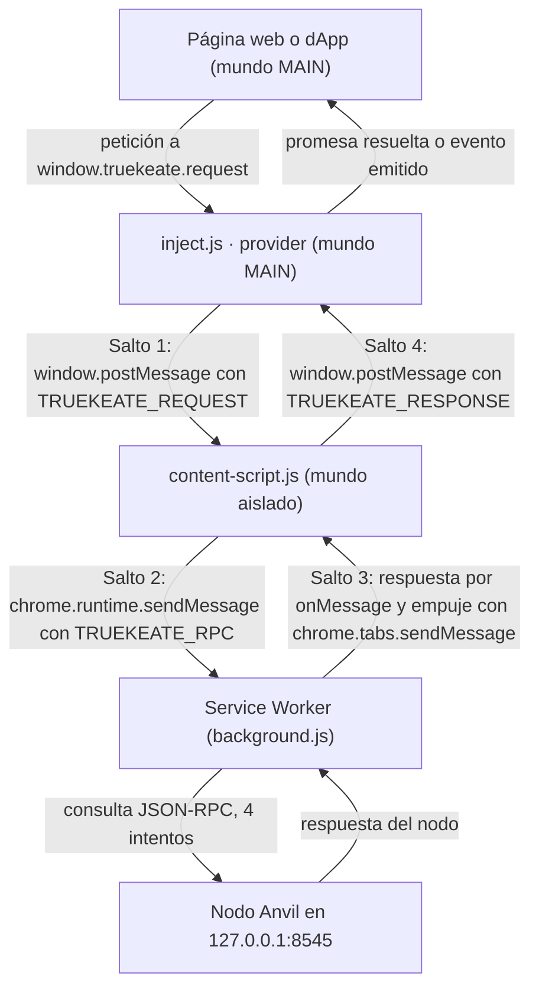
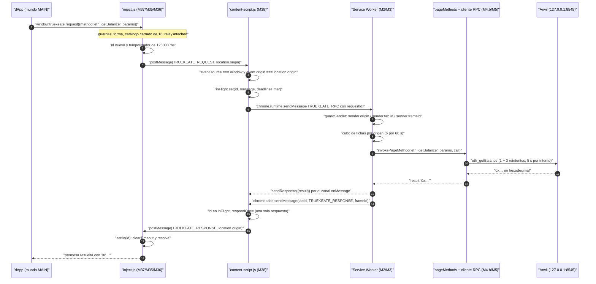

# 03 — Provider inyectado y relay página↔extensión

Este manual explica, en lenguaje llano, cómo una página web habla con TrueKeate Wallet. La pieza clave es
el **provider**: un objeto de JavaScript que la extensión publica dentro de la propia página web, con el
nombre `window.truekeate` y el alias `window.codecrypto` (el mismo objeto, no una copia: la página no
puede reasignarlo ni borrarlo).

Cuatro términos que necesitarás:

- **Content script**: un pequeño programa que la extensión inyecta dentro de la página. Comparte el
  documento con la web, pero vive en un «mundo aislado»: no ve las variables de la página y la página no
  ve las suyas. A cambio, sí puede usar las APIs de la extensión.
- **Service Worker**: el programa de fondo de la extensión, sin ventana. Es el único que puede tocar el
  almacén y las claves.
- **Salto de mensaje**: cada tramo del viaje de una petición de un contexto a otro. Aquí hay **cuatro**.
- **Relay** (relé): el papel del content script, que recibe mensajes de un lado y los reenvía al otro sin
  interpretarlos.

Dos palabras importantes de seguridad, que aparecerán mucho:

- **Mundo MAIN**: el mundo de la página web, donde vive la dApp y donde se publica el provider.
- **Mundo aislado**: el mundo del content script. Comparten el documento, no las variables.

## Empezar en 5 minutos

### Qué necesitas

- La extensión compilada (`npm run build`) y cargada en Chrome o Edge 114 o superior.
- El nodo local Anvil escuchando en `http://127.0.0.1:8545`, con la bandera `--allow-origin` que incluye
  el identificador de la extensión `oiahebaliobknoeeonhgaacapjcpgblo` y el origen `http://localhost:5174`.
- La dApp de pruebas servida en `http://localhost:5174/test.html` (el puerto 5174 es fijo).
- Una pestaña del navegador para abrir esa dApp.

### Qué vas a conseguir

- Ver `window.truekeate` y `window.codecrypto` dentro de la página, apuntando al mismo objeto.
- Conectar la dApp con la cartera y recibir en la página la cuenta activa.
- Hacer una lectura real, por ejemplo `eth_getBalance`, y ver el saldo del nodo Anvil.
- Entender por dónde viaja cada mensaje y por qué hay cuatro saltos.

### Los pasos mínimos

1. Compila la extensión con `npm run build` y cárgala desde la carpeta `dist/` como extensión
   desempaquetada.
2. Arranca el nodo con el comando de la sección «Empezar en 5 minutos» del manual
   `01-modulos-background.md`. Recuerda que `--allow-origin` admite **una sola** lista separada por comas
   y no puede repetirse.
3. Sirve la dApp de pruebas en `http://localhost:5174/test.html`.
4. Abre esa dirección en el navegador. La extensión inyecta su provider **antes** que los scripts de la
   página, así que ya estará disponible.
5. Abre la consola del navegador y comprueba que `window.truekeate` existe y que
   `window.truekeate === window.codecrypto` es verdadero.
6. Pulsa el botón de conectar de la página de pruebas. Se abrirá la ventana de conexión `connect.html`
   (420×650 px) y, al aceptar, la página recibirá la cuenta conectada.
7. Prueba una lectura: pide el saldo con `eth_getBalance`. Si el nodo está bien arrancado, verás el saldo
   en hexadecimal. Si el nodo está caído, la página recibe el error `4900` en lugar de una respuesta
   inventada.

## 1. Por qué hay cuatro saltos

<!-- GENERAR_IMAGEN: flujo-mensajeria.svg -->

### 1.1 El esquema real

Una dApp que llama a `window.truekeate.request({ method: 'eth_getBalance', params: [...] })` **no** habla
directamente con la extensión: habla con un objeto de JavaScript publicado dentro de la página. Ese
objeto no puede usar las APIs `chrome.*`, así que su única salida es el canal de mensajes de la propia
página, que llega al content script. El content script sí puede usar `chrome.runtime` y con eso alcanza al
Service Worker.

Son **cuatro contextos** y **cuatro saltos**:

| # | Contexto | Mundo | Qué APIs puede usar | Fichero |
|---|---|---|---|---|
| 0 | Página o dApp | MAIN | El documento y el canal de mensajes de la página | ninguno (la dApp de pruebas está en `test.html`) |
| 1 | Provider inyectado | MAIN | El documento y el canal de mensajes de la página | `src/inject/index.ts` (M37) |
| 2 | Content script (relé) | Aislado | El documento **y** las APIs de la extensión | `src/content-script.ts` (M38) |
| 3 | Service Worker | Extensión | Todas las APIs `chrome.*` | `src/background.ts` y el router (M2/M3) |

### 1.2 Salto 1: página (MAIN) → content script (aislado)

#### Por qué la página no puede llamar a `chrome.*`

El provider se inyecta con una etiqueta `<script>` creada por el content script, apuntando al recurso
`inject.js` de la extensión. Esa etiqueta se evalúa en el **mundo MAIN** —el mismo de la dApp, y por eso
la página ve `window.truekeate`— y precisamente por eso **`chrome.*` no existe ahí**: la API de
extensiones solo se expone a contextos privilegiados.

Todo el transporte del provider es, en consecuencia, el canal de mensajes de la página.

La cabecera del módulo del provider lo fija: el paquete de `inject.js` **no importa** módulos del Service
Worker y **no accede** a `chrome.*` ni al almacén. La prueba estructural está en la compilación:
`inject.js` es una entrada independiente, y su formato se justifica porque el provider se inyecta como un
script síncrono al principio del documento.

#### Por qué el content script no puede escribir en el `window` de la página

Los content scripts viven en un **mundo aislado**: comparten el documento con la página pero **no** su
objeto global `window`. Un `window.truekeate = provider` ejecutado desde el content script sería invisible
para la dApp.

Por eso la extensión debe **inyectar código** en el mundo MAIN, y este proyecto lo hace **sin el permiso
`scripting`**, que se retiró a propósito. El manifiesto declara los permisos `storage`, `alarms`, `favicon`,
`clipboardRead` y `clipboardWrite`, y declara `inject.js` como recurso accesible desde la web.

El content script crea entonces la etiqueta y la marca. El proceso real es:

1. Crea un elemento `script`.
2. Le pone como `src` la URL del recurso, obtenida con la API de la extensión, nunca una ruta escrita a
   mano. La ruta es `inject.js`.
3. Pone `async = false` para preservar el orden de ejecución respecto del resto de scripts del documento.
4. Le añade la marca de inyección.
5. Lo inserta en `document.head` o, si no hay, en el elemento raíz del documento.

Todo esto va dentro de un bloque de captura de errores: en un marco de solo lectura, el provider no se
puede publicar y el fallo no debe romper la página.

### 1.3 Los otros dos saltos

- **Salto 2 — content script → Service Worker**: se envía un mensaje con el sobre `TRUEKEATE_RPC`. El
  relé **no interpreta** el método ni decide permisos: solo reenvía.
- **Salto 3 — Service Worker → content script**: el Service Worker responde por el canal asíncrono normal
  **y además empuja** la respuesta a la pestaña con la API de pestañas, indicando el marco destinatario
  cuando hace falta.
- **Salto 4 — content script → página**: se publica el mensaje de vuelta al mundo MAIN, donde el escucha
  del provider resuelve la promesa o emite el evento.

### 1.4 La prueba de inyección

El relé marca la etiqueta con el atributo `data-truekeate-inject="1"` y el provider **exige** esa marca,
leyéndola del script que se está ejecutando.

Es la **prueba de inyección**, y sirve para descartar dos cosas: una importación directa del fichero en un
arnés de pruebas, y una copia que la propia página cargue con el mismo `src` para suplantar al provider.

Si no hay marca, no hay relé, y el provider responde `4200` en lugar de dejar la promesa colgada para
siempre. La instalación es idempotente en los dos lados: ni el relé ni el provider se instalan dos veces.

## 2. `src/inject/index.ts` (M37, 247 líneas)

### 2.1 Ejecución SÍNCRONA en `document_start`

Este fichero es la entrada **síncrona** que se ejecuta al principio del documento. Importa por dos motivos
encadenados:

1. El provider debe existir **antes que cualquier script de la página**, porque una dApp que consulte
   EIP-6963 en su arranque vería cero proveedores.
2. El anuncio EIP-6963 debe ser síncrono, así que se invoca sin esperar y su escucha se registra antes
   del primer anuncio.

El manifiesto garantiza el momento: se ejecuta al inicio del documento y en **todos** los marcos.

### 2.2 Publicación del provider y de su ALIAS

#### Las dos claves

- La clave principal es `truekeate`.
- El alias es `codecrypto`.
- El comentario del código lo dice: «el provider y su alias, el MISMO objeto».

#### El MISMO objeto, no una copia

El provider se construye **una sola vez** y el **mismo descriptor** se aplica a las dos claves. El
descriptor fija `writable: false` y `configurable: false`, lo que significa que la página **no puede
reasignarlos ni borrarlos**.

El contrato de cabecera lo dice claro: las dos claves «apuntan al **MISMO objeto**: no hay copia ni
envoltorio». Lo comprueban dos ficheros de pruebas: uno verifica que el alias es idéntico y que el
descriptor está en los dos nombres, y otro comprueba incluso que intentar borrar la clave devuelve falso.

### 2.3 La escucha de `message` y el filtrado por `source`/`origin`

El puerto de entrada es un único escucha cuya **primera** instrucción es la guarda de seguridad. La regla
general del módulo: todo mensaje entrante se valida comprobando **de dónde viene la ventana** y **de qué
origen** procede. Cualquier otro mensaje se descarta sin más.

Solo después se mira el tipo del mensaje:

- **`TRUEKEATE_RESPONSE`**: exige un identificador de tipo texto y resuelve la llamada pendiente. La
  comprobación de error consiste en mirar que el código sea un número y el mensaje sea texto.
- **`TRUEKEATE_EVENT`**: emite el evento si su nombre está en el catálogo cerrado.
- **`TRUEKEATE_ANNOUNCE`**: viaja en sentido contrario, así que aquí no se atiende.

#### Salida: `targetOrigin` siempre cerrado

El **único** punto de escritura hacia el content script usa el origen de la página, **nunca** el comodín
`'*'`. Es una regla de seguridad dura del proyecto: el comodín está prohibido.

### 2.4 Correlación de peticiones y red de seguridad

El provider abre un mapa de llamadas pendientes y resuelve **una sola vez** cada identificador, borrando
la entrada y cancelando su temporizador. El identificador lo genera el propio contexto de la página.

Un aviso de contrato importante: ese identificador **no es la identidad del provider**. La identidad es un
texto congelado, que nunca se genera en tiempo de ejecución.

La **red de seguridad** (un mecanismo que evita que una promesa quede colgada eternamente) se calcula
así: el plazo de espera del provider es el plazo de firma **más un margen** de seguridad.

Con los valores de producción:

- El plazo de firma es de **120 000 ms**.
- El margen es de **5 000 ms**.
- Total: **125 000 ms** (125 segundos).

Es decir, la red del provider vence 5 segundos **después** del plazo del Service Worker, que es el dueño
único del reloj. El error es un `4001` con el texto de vencimiento.

Detalle medible y algo curioso: el **temporizador** dura 125 000 ms, pero el **texto** del error declara
120 segundos. Ocurre porque el número que aparece en el mensaje se calcula sobre el plazo de firma, sin
el margen.

El temporizador se arma antes de publicar el mensaje, y unos parámetros que no se pueden clonar no
escapan como excepción de golpe: se convierten en un error interno `-32603`. El contrato de la capa es
que `request` devuelve **siempre** una promesa y **nunca lanza de forma síncrona**.

## 3. `src/inject/provider.ts` (M35, 354 líneas)

### 3.1 La fábrica y el puente

`createTruekeateProvider(relay?)` es una **fábrica**, no un objeto único de módulo. El motivo está
documentado: así la entrada del provider publica exactamente **una** instancia y su alias apunta a ella.

El **puente** (el objeto que conecta el provider con el relé) tiene dos miembros:

- Si está conectado: responde a la pregunta «¿hay content script al otro lado?».
- Enviar: recibe método y parámetros y devuelve un desenlace. **Nunca lanza y nunca deja la promesa
  colgada.**

El desenlace del puente es una unión excluyente: o trae resultado, o trae error, nunca los dos.

### 3.2 `request({ method, params })`

El orden de las guardas está escrito en el propio método: **forma del argumento → catálogo cerrado local
→ puente disponible → transporte**.

1. **Forma.** Se lee el nombre del método sin lanzar nunca. Si no hay método o no está en el catálogo
   cerrado, se rechaza con `4200` **sin viaje de ida y vuelta**. Los parámetros se normalizan a una lista,
   envolviendo un objeto suelto en una lista de uno.
2. **Puente.** Si no hay puente o no está conectado, se rechaza con `4200`. Es el caso «sin content script
   al otro lado».
3. **Transporte.** Se envía por el puente. Si el desenlace trae error, se lanza ese error; si no, se
   actualizan las cachés con el resultado y se devuelve. Si el puente rechazara por su cuenta, se traduce
   a un error interno como defensa en profundidad.

La lista `PAGE_METHODS` enumera los **16** métodos que una página puede invocar: las 10 lecturas y los 6
aprobables. `eth_sign` **no** figura a propósito: está retirado del catálogo y responde `4200`.

La exhaustividad se verifica **al compilar**: si el tipo de métodos de página gana un método nuevo y esta
lista no lo incorpora, el módulo **no compila**.

### 3.3 `on` / `removeListener` / `emit`

#### Nombres reales

Los únicos métodos de escucha implementados son **`on`** y **`removeListener`**, y los dos son
**encadenables**: devuelven el propio provider.

**No existen** `listenerCount`, `addListener`, `once`, `removeAllListeners`, `send`, `sendAsync` ni
`enable`.

El registro interno es un mapa de nombre de evento a conjunto de escuchas. `on` ignora sin romper
cualquier evento fuera del catálogo cerrado o cualquier escucha que no sea una función.

#### `emit` (uso interno del puente)

`emit` no forma parte de la superficie publicada: lo devuelve la fábrica junto al provider y lo consume la
entrada del provider. Su secuencia real es:

1. Descartar un nombre de evento que no esté en el catálogo cerrado de 5.
2. Actualizar las cachés **antes** de avisar.
3. Recorrer una **copia** de la lista de escuchas, porque una escucha puede darse de baja desde dentro de
   su propia función.
4. Envolver cada llamada en un bloque de captura, porque «una escucha hostil no puede romper el provider
   ni al resto».

### 3.4 El TIPO de error que se rechaza

Todo error hacia la página es un objeto con `code` **numérico**, nunca una cadena ni un error suelto:

| Constante | `code` | Mensaje |
|---|---|---|
| `UNSUPPORTED_METHOD_ERROR` | `4200` | «El método solicitado no está soportado por TrueKeate Wallet.» |
| `pageTimeoutError(segundos)` | `4001` | «El usuario no respondió en el plazo establecido (<n> s); la solicitud ha caducado.» |
| `internalTransportError()` | `-32603` | «Error interno de la cartera.» |

El `4200` es **el mismo literal** que responde el Service Worker, y hay una prueba que compara las dos
versiones para que una divergencia entre capas rompa la batería de pruebas.

La copia que se entrega es **nueva en cada llamada**, para que la página pueda modificar el objeto que
recibe sin estropear el original.

### 3.5 `isConnected` y las propiedades estándar: qué existe realmente

**No existe `isConnected`.** El provider extiende el tipo estándar y añade exactamente tres miembros:
`isTrueKeate`, `chainId` y `selectedAddress`.

| Propiedad | ¿Existe? | Evidencia |
|---|---|---|
| `isTrueKeate` | **Sí**, con el valor literal `true` | Declarada en el tipo, asignada y comprobada en las pruebas |
| `isMetaMask` | **No** | Sin ninguna coincidencia en el código propio |
| `isConnected` | **No** | Ver el párrafo anterior |
| `chainId` | **Sí**, caché que puede ser nula | Refrescada al observar eventos y respuestas |
| `selectedAddress` | **Sí**, caché que puede ser nula | Refrescada al observar eventos y respuestas |
| `request`, `on`, `removeListener` | **Sí** | Los tres métodos de la superficie publicada |

Las cachés se refrescan **siempre**, haya o no escuchas registradas: el identificador de cadena y la
dirección seleccionada son estado del provider, no de las escuchas.

La observación cubre los cinco eventos y también las respuestas de `eth_chainId`, `eth_accounts` y
`eth_requestAccounts`, para que el estado sea coherente antes del primer evento. El evento `disconnect`
limpia **las dos** cachés. Hay una prueba que verifica el detalle importante: después de quitar una
escucha, esa escucha **no** vuelve a invocarse, pero la caché del provider **sí** se actualiza.

### 3.6 Specs de esta capa

- **`src/inject/windowContract.spec.ts` (184 líneas)**: el `4200` llega como promesa y jamás como
  excepción síncrona; publicación con dos nombres sobre el mismo objeto; anuncio con identidad congelada;
  y un doble de las APIs `chrome.*`.
- **`src/inject/inject.spec.ts` (259 líneas)**: manifiesto con todos los marcos y ejecución al inicio del
  documento; alias idéntico; superficie encadenable; imposibilidad de reconfigurar; `4200` sin lanzar; sin
  relé todo responde `4200`; escuchas y cachés; icono PNG real de 96×96 leído de sus cabeceras; e
  identificador congelado y estable.

## 4. `src/inject/eip6963.ts` (M36, 116 líneas)

### 4.1 Los dos eventos del protocolo

Este módulo declara dos nombres de evento estándar: el de **petición** de proveedores y el de
**anuncio**. EIP-6963 es la convención por la que una cartera se presenta a las dApps.

### 4.2 El `detail` real del anuncio

El anuncio se construye creando un `detail` **nuevo en cada vez**: así una dApp que lo modifique no puede
corromper el siguiente anuncio.

El `detail` tiene **exactamente dos campos**: `info` y `provider`. Los cuatro campos de `info` son:

| Campo | Valor real |
|---|---|
| `uuid` | `9f2a4c1e-6b7d-4e0a-8c33-4f5b6d7e8a90` |
| `name` | `TrueKeate` |
| `icon` | Un PNG incrustado en base64, del isologo de 96 px |
| `rdns` | `academy.codecrypto.truekeate` |

Dos contratos que el código hace cumplir:

1. El identificador es **literal y congelado**: nunca se regenera, ni al re-anunciar ni entre versiones.
   Hay una prueba que comprueba que los tres ficheros implicados **no** contienen ninguna llamada a
   generar identificadores aleatorios.
2. El `provider` del anuncio debe ser **el mismo objeto** que `window.truekeate`, así que se lee la clave
   publicada y solo se cae al argumento si la publicación aún no ocurrió.

El anuncio se despacha como un evento personalizado dentro de un bloque tolerante a entornos donde ese
tipo de evento no exista, y después avisa al puente.

### 4.3 Listener síncrono, auto-anuncio y re-anuncio

La instalación del anuncio ejecuta, **en este orden**:

1. **Escucha síncrona** del evento de petición, registrada antes del primer anuncio y sin ninguna espera
   previa. La cabecera avisa: «si se registra tarde, el anuncio se pierde».
2. **Auto-anuncio** al cargarse `inject.js`.
3. **Re-anuncio** cuando el documento termina de cargarse o, si ya había terminado, en el turno
   siguiente.

Además, **cada** petición recibida dispara un anuncio nuevo. La entrada del provider, al instalar el
anuncio, además saluda al relé con un mensaje de anuncio que lleva solo los datos de identidad.

### 4.4 El icono: `src/inject/icon-data.ts` (16 líneas)

El fichero es **generado**: su cabecera dice «ARCHIVO GENERADO — no editar a mano». Contiene **una única
constante exportada** más una exportación por defecto, y nada más: un **data-URI PNG en base64**.

Datos de origen documentados en su cabecera:

- La imagen original es `public/brand/truekeate-mark-96.png` y ocupa **15 246 bytes**.
- La genera el script `scripts/generate-icon-data.mjs`, que se ejecuta antes de compilar.
- El motivo: el código propio no puede usar `fetch` y el anuncio EIP-6963 debe ser síncrono, así que el
  icono se incrusta en el paquete **en tiempo de compilación**.

Contiene por tanto una cadena base64 embebida, **no** una ruta ni un SVG. La ruta de la imagen original es
solo informativa. La función que carga el icono es asíncrona pero devuelve la constante cacheada, así que
no hay ninguna entrada/salida que esperar.

Hay una prueba que decodifica el data-URI y mide los 96×96 reales en las cabeceras del PNG.

Para pruebas y para `test.html` se exporta además un objeto con la identidad: nombre, `rdns` e
identificador.

## 5. `src/content-script.ts` (M38, 603 líneas)

### 5.1 La inyección de `inject.js` y `web_accessible_resources`

El manifiesto declara `inject.js` como recurso accesible desde la web, disponible en todas las
direcciones, con la opción de **URL dinámica** activada.

Esa opción hace que Chrome sirva el recurso bajo una **URL dinámica** derivada del identificador de la
instalación, en vez de la ruta estable. Consecuencias verificables:

1. La etiqueta se crea **siempre** con la API de la extensión, nunca con una ruta absoluta escrita a mano,
   que sería la forma de romperse.
2. La página **no puede deducir** el identificador de la extensión leyendo el `src` del script. Las
   pruebas de navegador comparan esa forma y localizan el script por su atributo, no por su `src`.
3. La identificación entre capas no usa esa cadena, sino la marca de inyección.

El punto de inserción es la cabecera del documento o, si no hay, el elemento raíz, y todo va envuelto en
un bloque de captura por si el documento no admite escritura.

#### El orden importa: primero escuchar, después inyectar

La instalación del relé sigue este orden exacto:

1. Se registra el escucha de mensajes de la página, **antes** de inyectar el provider, para que el saludo
   de identificación y la primera petición encuentren siempre al relé escuchando.
2. Se registra el escucha de mensajes de la extensión, para las respuestas empujadas y los eventos.
3. Se inyecta el paquete del provider.
4. Se abre el puerto de aprobaciones.

Si el orden se invirtiera, el saludo y la primera petición podrían emitirse antes de que existiera el
escucha.

### 5.2 Validación de los mensajes `TRUEKEATE_*` que llegan de la página

La lectura de un mensaje entrante aplica **tres guardas encadenadas**:

1. **Fuente y origen**: se descarta cualquier mensaje que no venga de esta ventana y de este origen.
2. **Forma de objeto**: si el dato no es un objeto reconocible, se descarta.
3. **Tipo dentro de la lista cerrada**: solo **dos** tipos pueden entrar desde la página:
   `TRUEKEATE_REQUEST` y `TRUEKEATE_ANNOUNCE`.

Un mensaje de anuncio se acepta y no se procesa, porque no tiene respuesta. El resto va al manejador de
peticiones de página.

### 5.3 Reenvío de `TRUEKEATE_RPC` con `requestId`

Al construir el sobre que viaja al Service Worker se toman cuatro decisiones de contrato:

1. **El identificador es obligatorio**: sin un identificador de tipo texto no vacío no hay correlación
   posible y el mensaje se descarta.
2. **El método viaja literal**, aunque no exista en el catálogo. El Service Worker responde `4200` con el
   literal oficial, de modo que el error tiene **una sola fuente**.
3. **El origen es el declarado por la página y es un dato no fiable.** No hay que confundirlo con el
   origen real del mensaje, que es el que valida la guarda anterior.
4. **El identificador de pestaña y el de marco van vacíos**, porque el content script no conoce su propia
   pestaña: el Service Worker los sustituye por los del emisor real. El identificador de petición se
   transporta hasta la cola persistida, pero el Service Worker **no lo interpreta**: no decide nada.

Un identificador repetido cierra la llamada anterior con error antes de registrar la nueva.

### 5.4 Entrega de `TRUEKEATE_RESPONSE` / `TRUEKEATE_EVENT` a la página

El conjunto de tipos que se reenvían a la página contiene `TRUEKEATE_RESPONSE` y `TRUEKEATE_EVENT`, y es
**el mismo conjunto cerrado en las dos direcciones de salida**.

La entrega **no reconstruye** el objeto: comprueba que el tipo esté en la lista y, si es una respuesta cuyo
identificador correlaciona con una llamada en vuelo, la entrega **una sola vez** y cierra la llamada. En
cualquier otro caso publica el sobre tal cual, de modo que el nombre del evento, los datos y cualquier
campo extra viajan idénticos.

Los únicos efectos permitidos son de **observación**: si la resolución trae un identificador de aprobación
no vacío, se recuerda para el mensaje de reanudación.

La publicación hacia la página usa el origen de la página, «el único destino permitido; el comodín está
prohibido», y tolera que el resultado del Service Worker no se pueda clonar. La construcción de la
respuesta traduce el desenlace a `{ type, id, result | error }` y, si no llega nada —ni error ni
resultado—, responde un error interno en lugar de dejar la promesa pendiente.

### 5.5 La cota de transporte y el margen de seguridad

- La cota de transporte vale **125 000 ms**, igual que la red del provider: es el plazo de firma más el
  margen de seguridad.
- El motivo está documentado: mientras no se agote la cota **no** se responde un error interno, porque el
  Service Worker puede estar suspendido y volver por la alarma de vencimiento, y su resolución llegará
  empujada hasta aquí.
- Al agotarse, se responde el error interno tipado, como recurso simétrico a la red del provider.
- El reintento de transporte tiene un primer retardo de **250 ms** y un tope de **2000 ms**, con
  temporizadores locales.

La respuesta del Service Worker se clasifica en tres desenlaces:

| Patrón | Qué significa | Decisión |
|---|---|---|
| «could not establish connection» o «receiving end does not exist» | El mensaje no llegó a nadie | **Reintentar es seguro** y además despierta al Service Worker dormido |
| «extension context invalidated» | La extensión se recargó o quedó huérfana | `-32603` de inmediato |
| Cualquier otro | No se sabe si llegó | **No** se reescribe (sería efecto duplicado) y se espera la resolución empujada hasta la cota |

Un caso importante: el mensaje «The message port closed before a response was received.» **no** es fatal
a propósito. Tratarlo como fatal era justamente el defecto que se corrigió.

El retroceso del reintento es local (250, 500, 1000 y 2000 ms, con tope) y el error de la API de extensión
se lee **de forma síncrona** dentro de la llamada de retorno.

### 5.6 El puerto de larga vida `truekeate_approval`

El nombre canónico del puerto es `truekeate_approval`. Es un **canal de transporte y correlación**, no un
mecanismo para mantener vivo el Service Worker: eso está dicho con todas las letras.

La reconexión usa retroceso exponencial: el retardo del siguiente intento es 1, 2, 4, 8, 16 segundos… con
un tope de **30 segundos**.

El puerto se abre con la API de conexión, se engancha el escucha para reenviar respuestas y eventos
**literalmente**, y se engancha la desconexión para programar la reconexión. Si la conexión lanza una
excepción, también acaba en la reconexión, que no duplica temporizadores.

El mensaje de reanudación (`RESUME`) se envía **solo** si ya se observó un identificador de aprobación,
que lo publica una resolución empujada por el Service Worker. El estado del relé documenta el defecto
corregido: antes ese campo estaba declarado y **nunca se asignaba**; ahora lo alimenta la entrega a la
página.

El receptor en el Service Worker descarta puertos de otro nombre y atiende la reanudación. Detalle
importante: el puerto **no** transporta el RPC ordinario. El RPC viaja por el canal de mensajes normal; el
puerto sirve a las respuestas empujadas y a la reanudación de aprobaciones.

## 6. El protocolo de mensajes

### 6.1 La fuente única: `src/shared/protocol.ts` (171 líneas)

El módulo declara que son **ocho** tipos, y avisa de que una tabla heredada de nomenclatura omitía dos de
ellos: `TRUEKEATE_ANNOUNCE` y `RESUME`.

La unión cerrada está en ese fichero, tiene su espejo en tiempo de ejecución y su guardián es una función
que decide si un texto es un tipo del protocolo. Los ocho nombres están fijados por una prueba de
nomenclatura.

### 6.2 Tabla de los ocho tipos

| Tipo | Dirección | Canal | Campos reales |
|---|---|---|---|
| `TRUEKEATE_REQUEST` | inyectado → content script | canal de mensajes de la página | `{ type, id, method, params? }` |
| `TRUEKEATE_RESPONSE` | content script → página (salto 4) y Service Worker → content script (empuje) | canal de la página y canal de pestañas | `{ type, id, result?, error? }` |
| `TRUEKEATE_EVENT` | Service Worker → content script → inyectado → página | canal de pestañas y canal de la página | `{ type, eventName, data }` |
| `TRUEKEATE_ANNOUNCE` | inyectado → content script | canal de la página | **Declarado** con `info` como ficha completa; **emitido** con los cuatro campos de identidad |
| `TRUEKEATE_RPC` | content script → Service Worker | canal de mensajes de la extensión | `{ type, method, params, origin, tabId: null, frameId: null, requestId }` |
| `SIGN_RESPONSE` | `notification.html` → Service Worker | canal de mensajes de la extensión | `{ type, approvalId, success, error? }` |
| `CONNECT_RESPONSE` | `connect.html` → Service Worker | canal de mensajes de la extensión | `{ type, requestId, success, account?, accountIndex?, error? }` |
| `RESUME` | content script → Service Worker (y ventana de decisión) | puerto `truekeate_approval` | `{ type, approvalId }` |

Las agrupaciones son: los cuatro del canal de la página, los cuatro del canal de la extensión o el
puerto, y el conjunto total.

#### Desviación declarada en `TRUEKEATE_ANNOUNCE`

El tipo declara que el campo `info` lleva la ficha **completa** del proveedor, pero el mensaje que
realmente se envía transporta solo los cuatro campos clonables: identificador, nombre, icono y `rdns`.

El motivo está documentado: la ficha completa incluye el `provider`, que contiene funciones, y el canal de
la página clona los datos de forma estructurada, de modo que enviarlo lanzaría un error de clonación. La
ficha **íntegra** se entrega a la página mediante un evento personalizado, que no clona nada. Es una
**desviación declarada**, no un descuido.

### 6.3 Uniones de métodos y de eventos (`src/shared/types.ts`, M55, 550 líneas)

| Unión | Cuántos |
|---|---|
| `PageReadMethod` | **10** lecturas |
| `ApprovalMethod` | **6** aprobables, con `eth_sign` excluido |
| `PageMethod` (lecturas más aprobables) | 16 |
| `InternalMethod` | **16** métodos `wallet_*` |
| `WalletMethod` (todo junto) | 32 |
| `ProviderEventName` | **5** eventos |

El fichero incluye además los tipos de soporte: dirección, identificador de cadena en hexadecimal,
identificador único, escucha del provider, argumentos de petición, error EIP-1193, provider EIP-1193,
provider de la cartera y las fichas de EIP-6963.

### 6.4 Por qué `origin`, `tabId`, `frameId` y `requestId` NO son fiables

Estos cuatro campos los escribe la capa **no privilegiada** —la página, o el content script por
indicación suya—, así que cualquiera podría ser mentira. El diseño los trata como **declaraciones** y
recalcula la verdad a partir del emisor real que entrega el navegador:

- **El origen** se deriva **solo** del origen que informa el navegador. Regla dura: «Nunca se usa la URL
  de la pestaña». El origen declarado se conserva únicamente para detectar discrepancias.
- **El identificador de pestaña y el de marco** se sustituyen por los del emisor real. El marco declarado
  se ignora: manda el del emisor. El destino de la respuesta sale de ahí.
- **El identificador de petición** no decide nada: «NO es identidad ni permiso: solo se persiste con la
  solicitud aprobable para correlacionar la respuesta empujada». El router lo transporta sin
  interpretarlo.

El caso concreto que esto cierra es importante: en un marco incrustado de otro origen, la URL de la
pestaña apunta al **marco principal** mientras el origen apunta al marco incrustado. Deducir el origen de
la URL dejaría al marco incrustado heredar la sesión del anfitrión, que sería un agujero de seguridad
grave.

Una prueba construye exactamente ese emisor —origen del marco incrustado, URL del marco principal— y
comprueba tres cosas: que se resuelve el origen del marco incrustado, que la respuesta vuelve solo a ese
marco y que, sin origen informado, una página recibe `4100` en vez de caer a la URL de la pestaña. La
prueba de navegador equivalente levanta un servidor efímero en `127.0.0.1`, inyecta un marco desde el
principal y comprueba que las cuentas del marco devuelven una lista vacía.

## 7. Recorrido completo de una llamada

### 7.1 `eth_getBalance` paso a paso

| # | Salto | Qué ocurre |
|---|---|---|
| 1 | dApp → provider | La página llama a `request` con el método `eth_getBalance` y sus parámetros |
| 2-4 | El provider valida y normaliza | Forma del argumento, catálogo cerrado, puente conectado y normalización de parámetros |
| 5-6 | El provider arma y publica | Sobre `TRUEKEATE_REQUEST` con identificador; temporizador de 125 000 ms; publicación al origen de la página |
| 7-8 | El content script valida y decide | Fuente y origen, forma de objeto, tipo dentro de la lista → manejador de peticiones |
| 9-10 | El content script construye el sobre | `TRUEKEATE_RPC` con origen, identificadores de pestaña y marco vacíos y el identificador de petición; se registra la llamada en vuelo y su temporizador de vencimiento |
| 11 | Salto 2 | Envío por el canal de mensajes de la extensión |
| 12-13 | El Service Worker recibe y enruta | Comprueba que el tipo es del protocolo y llama al enrutador |
| 14-15 | El router despacha | Declaración del contexto, identificador de petición, despacho y traza |
| 16-18 | Guardas, catálogo y tasa | Redacción de parámetros, guarda de emisor, clasificación del método y cubo de fichas (6 por minuto y origen) |
| 19-20 | Despacho de la lectura | Se invoca el manejador de página correspondiente del registro cerrado |
| 21-23 | Manejador del saldo | Se valida la dirección, se llama al cliente RPC (con 1 + 3 reintentos) y se convierte el resultado a hexadecimal |
| 24-25 | Respuesta y empuje | Se construye `{ result }` y se responde por el canal normal **y** se empuja a la pestaña |
| 26 | Empuje a la pestaña | Sobre `TRUEKEATE_RESPONSE`; si el marco no es el principal, solo a ese marco |
| 27-28 | El content script recibe y correlaciona | El identificador está en la lista de llamadas en vuelo, así que se responde una sola vez |
| 29 | O por el canal normal | Si llega la llamada de retorno del paso 11, se construye la respuesta y se cierra igualmente |
| 30-32 | Publicación y resolución | Se publica al origen de la página; el provider resuelve la promesa tras validar fuente y origen. La observación de `eth_getBalance` no cambia ninguna caché: solo lo hacen `eth_chainId`, `eth_accounts` y `eth_requestAccounts` |

### 7.2 Diagrama de secuencia

### 7.3 Notas sobre el recorrido

- **La respuesta puede llegar por dos caminos** (el canal normal y el empuje). La entrega garantiza que la
  página reciba **una sola** respuesta, y una respuesta tardía se descarta si la petición ya se resolvió
  por la vía empujada.
- **El identificador de petición es lo que hace que se resuelva la promesa correcta.** En los métodos
  aprobables, el Service Worker persiste ese identificador con la solicitud, y la resolución empujada
  vuelve con él, no con el identificador de aprobación. Sin esa correlación, responder con el
  identificador de aprobación dejaría la promesa **colgada** hasta agotar su red de seguridad. El sobre de
  resolución añade además el identificador de aprobación, para el mensaje de reanudación del relé.
- **`eth_getBalance` no es aprobable**: no pasa por la cola ni por la ventana única; su ruta es la de las
  10 lecturas. Si el nodo está caído, la página recibe `4900` en vez de una respuesta inventada. Ese
  código está reservado a «no hubo respuesta».

## 8. Eventos del provider

### 8.1 Los cinco nombres

Son **cinco**, declarados en una lista cerrada: `accountsChanged`, `chainChanged`, `connect`, `disconnect`
y `message`. La unión de tipos los repite, y la comprobación de nombres válidos valida contra esa lista.
`on` ignora cualquier otro nombre sin romper la página.

### 8.2 De `src/background/events.ts` a `provider.emit`

El camino completo es:

1. El emisor construye **un** sobre y lo entrega pestaña a pestaña.
2. El destinatario lo elige la función que es **el único punto** que envía mensajes a pestañas: con un
   marco distinto del principal acota la entrega a ese marco, y al marco principal responde sin
   opciones.
3. Una pestaña sin content script **no rompe la propagación**: el error se captura y el resto sigue
   recibiendo. Hay una prueba con tres pestañas y una caída que comprueba que se entregan dos.
4. El relé lo recibe por el canal de mensajes de la extensión y lo publica **literalmente** al origen de
   la página.
5. En la página, el escucha del provider valida que el nombre sea uno de los cinco y llama a `emit`, que
   refresca las cachés y avisa a las escuchas.

### 8.3 Carga útil de cada evento

| Evento | Carga útil real |
|---|---|
| `accountsChanged` | **Lista de direcciones**; vacía al revocar. El provider toma la primera como dirección seleccionada |
| `chainChanged` | **El propio identificador de cadena** en hexadecimal y **sin envoltorio**, porque EIP-1193 lo exige así y no como un objeto con campo `chainId` |
| `connect` | Objeto `{ chainId }` |
| `disconnect` | Objeto de error `{ code, message }`. El provider **limpia las dos cachés** |
| `message` | Carga arbitraria de la dApp. **No se emite** hoy, porque ningún método lo produce; el provider no hace nada con él |

### 8.4 Quién emite qué, y a quién

- **`accountsChanged`** sale de la revocación y del cambio de cuenta activa. La prueba de navegador
  comprueba que la lista vacía llega **a las dos pestañas conectadas y a ninguna más**, y que el cambio
  desde el popup emite la cuenta nueva.
- **`connect`** se emite al crear la sesión de un origen o al recuperarla tras una recarga; en los dos
  caminos se emite con el identificador de cadena.
- **`chainChanged`** se emite a **todas** las pestañas abiertas, nazca el cambio en el popup o en una
  dApp: «ninguna pestaña debe quedarse con la red vieja».
- **`disconnect`** corresponde a dos situaciones: el nodo dejó de responder (`4900`) o la sesión se
  perdió.
- **La caché actúa como observador:** `emit` actualiza siempre las cachés **antes** de notificar, así que
  el identificador de cadena y la dirección seleccionada quedan al día aunque no haya escuchas. Tras
  quitar una escucha, esa escucha no vuelve a invocarse pero la dirección seleccionada **sí** cambia.

## 9. Modo de fallo

### 9.1 Si el Service Worker está suspendido

El navegador suspende el Service Worker cuando no tiene trabajo. El diseño lo asume en tres puntos:

1. **El Service Worker no usa temporizadores propios.** El vencimiento lo posee el sistema de alarmas del
   navegador, y la reconciliación del arranque vuelve a armar las alarmas desde la fecha de caducidad
   guardada. Nunca se usan los temporizadores de JavaScript, que están prohibidos en el Service Worker
   porque no sobreviven a la suspensión.
2. **El relé reintenta solo lo reintentable.** Un envío que vuelve vacío **no** se traduce en un error
   inmediato: si el error garantiza que el mensaje no llegó a nadie, se reescribe con retroceso de 250 a
   2000 ms, «y es lo que despierta a un Service Worker dormido».
3. **El resto de fallos espera.** Si el canal se cerró con el Service Worker ya trabajando, **no** se
   reescribe —sería efecto duplicado— y se aguarda la resolución empujada hasta agotar los 125 000 ms.

Esto se mide con una prueba de navegador que suspende el Service Worker a mitad de una aprobación usando
el protocolo de depuración de Chrome (no `chrome://serviceworker-internals` ni un método de terminación
forzosa). La prueba comprueba que el estado pasa a «parado», lo despierta, inyecta una alarma de 3
segundos y verifica cuatro cosas: que el código es **4001** con el mensaje de plazo, que el contador de
transacciones no se ha tocado, que la marca de transacción en vuelo queda vacía y que la reconstrucción
tarda **menos de 1 segundo**.

### 9.2 Si la pestaña no tiene content script

| Cómo se detecta | Qué ocurre |
|---|---|
| El paquete se evalúa sin la marca de inyección | No hay relé: **todo** método del catálogo responde `4200` en cuanto se llama, sin colgar la promesa |
| El envío no encuentra receptor | Vuelve vacío con «Could not establish connection» → **reintento** con retroceso; si el patrón es «extension context invalidated» → `-32603` inmediato |
| El Service Worker empuja un evento a una pestaña sin content script | El fallo se captura y se devuelve falso; **el resto de pestañas sigue recibiendo** |

Además, el content script se inyecta en **todos** los marcos, así que un marco incrustado tiene su propio
relé y su propio provider. La prueba de navegador comprueba que el provider existe **dentro** del marco.

### 9.3 Si el mensaje no es del protocolo

- **En el content script**: la lectura devuelve nada y el mensaje se descarta sin más, por fuente u origen
  distinto, por no ser un objeto plano o por llevar un tipo fuera de la lista aceptada.
- **En el provider**: si el dato no es un objeto reconocible, o el tipo no es ni respuesta ni evento, el
  escucha no hace nada. La guarda de fuente y origen filtra antes que nada.
- **En el Service Worker**: si el tipo no pertenece al protocolo, **no se responde ni se retiene el
  canal**, «así no se deja colgada a ninguna otra superficie». El enrutador hace lo mismo; un tipo **del
  protocolo** que no sea `TRUEKEATE_RPC` recibe `4200`.
- **En el puerto de aprobación**: una petición distinta de `RESUME` recibe `4200` por el propio puerto.

### 9.4 Si vence el plazo en la capa inject

La capa del provider es **red de seguridad**, no dueña del plazo. La cadena temporal completa es esta:

| Dueño | Plazo | Qué ve la página |
|---|---|---|
| Service Worker (alarmas del navegador) | 120 s | `4001` con el literal de vencimiento |
| Capa del provider (M37) | 125 s | Promesa rechazada con el error de plazo → **`code: 4001`** |
| Cota de transporte del relé (M38) | 125 s | Si nadie respondió en absoluto, una respuesta con error interno → **`code: -32603`** |

El margen existe para que la red del Service Worker venza **siempre antes** que la de la página y el error
que ve la dApp siga siendo el del dueño único del plazo. Recuerda el detalle ya señalado: el temporizador
del provider dura 125 000 ms, pero el **texto** del error declara 120 segundos.

#### Cobertura de pruebas de este modo de fallo

- `src/inject/windowContract.spec.ts` (184 líneas): `request` rechaza **como promesa** y nunca lanza de
  forma síncrona; el literal `4200` coincide con el del Service Worker; el catálogo de 5 eventos en `on` y
  `removeListener`; y la imposibilidad de reconfigurar o borrar las dos claves.
- `src/inject/inject.spec.ts` (259 líneas): sin relé todo responde `4200` en lugar de colgarse; unos
  argumentos mal formados no lanzan; una escucha hostil no rompe al resto; y el error cruza el canal de la
  página como un objeto clonable.
- `src/background/originFrame.spec.ts` (293 líneas): origen del marco recalculado, aislamiento de sesión
  entre marco principal y marco incrustado, destino por marco y reenvío literal de eventos.
- `test/oracle/ports.spec.ts` (706 líneas): el puerto `truekeate_approval`, la reanudación con la
  solicitud completa y la entrega de la resolución por orden de preferencia (puerto vivo, luego
  pestaña y marco, luego sin destinatario).

### 9.5 E2E que cubren este subsistema

| Fichero | Líneas | Qué cubre |
|---|---|---|
| `e2e/07-provider.spec.ts` | 305 | Que `window.truekeate === window.codecrypto` y la superficie completa; la etiqueta inyectada y la URL dinámica; el identificador de extensión estable; el anuncio EIP-6963 con icono PNG de 96 px; el `4200` sin lanzar de forma síncrona; y lecturas reales contra Anvil |
| `e2e/08-eventos.spec.ts` | 270 | La lista vacía de `accountsChanged` a las dos pestañas conectadas y a ninguna más; el cambio de cuenta desde el popup con la cuenta nueva; y la dirección seleccionada en la dApp |
| `e2e/21-eip6963.spec.ts` | 142 | El anuncio con identidad vinculante e icono incrustado; que el provider del anuncio es `window.truekeate`; el alias congelado; el identificador estable entre anuncios; y el re-anuncio al pedirlo la dApp |
| `e2e/28-iframe-hostil.spec.ts` | 174 | Un marco incrustado de otro origen que recibe una lista vacía y nunca la cuenta del marco principal; el provider presente dentro del marco; y `4001` al cancelar la conexión del marco |
| `e2e/29-sw-suspendido.spec.ts` | 180 | El Service Worker suspendido por el protocolo de depuración y despertado por una alarma: `4001` sin doble difusión y reconstrucción en menos de 1 segundo |

Observación transversal verificada: **ninguno** de estos cinco ficheros comprueba el margen de 5 000 ms ni
menciona la constante del margen. Ese margen se cubre por lectura de código. Los plazos que las pruebas de
navegador inyectan son otros: `VITE_SIGN_TIMEOUT_MS=3000` y `VITE_CONNECT_TIMEOUT_MS=2000`, que afectan
de forma indirecta a dos de los ficheros anteriores.

### 9.6 Fugas de seguridad descartadas

- **Ningún secreto cruza el canal.** El provider no accede a `chrome.*` ni al almacén: solo viajan el
  método, los parámetros y el resultado público.
- **Ningún mensaje a la página usa el comodín**, en los dos extremos del primer salto: se usa siempre el
  origen de la página.
- **La página no puede suplantar al provider:** las dos claves se publican como no escribibles y no
  configurables, y hay dos ficheros de pruebas que intentan reasignar, redefinir y borrar.
- **El origen real nunca se deduce de datos declarados**, y ese riesgo está cubierto por una prueba
  dedicada.
- **El cuerpo de una solicitud de aprobación no se difunde:** el empuje del Service Worker a la ventana de
  decisión usa el canal de páginas de la extensión, y un mensaje emitido por el Service Worker **no** llega
  a los content scripts.

### 9.7 Pendiente de confirmar

- Un comentario de `e2e/21-eip6963.spec.ts` atribuye al clic de un botón de `test.html` el segundo evento
  de petición de proveedores. El envío de ese evento vive en `test.html`, fuera del alcance de este
  manual: **pendiente de confirmar** leyendo `test.html`.
- La comprobación sobre la forma de la URL dinámica se ha leído como «la huella del identificador se
  sustituye por un identificador de host». El detalle literal del algoritmo de Chrome no es verificable
  desde este repositorio: **pendiente de confirmar** contra la documentación de la plataforma.
- La prueba de inyección depende de la referencia al script que se está ejecutando. En un entorno de
  pruebas sin navegador ese valor no existe, y por eso la batería cubre el camino «sin relé»; no se ha
  localizado una prueba unitaria que ejercite el camino **con** relé, que sí cubre la prueba de navegador
  `e2e/07-provider.spec.ts`.

## Problemas frecuentes

### `window.truekeate` no existe en la página

**Causa.** La extensión no ha podido inyectar el provider. Las causas posibles: la extensión no está
cargada, la pestaña se abrió **antes** de instalar o recargar la extensión (los content scripts no se
inyectan retroactivamente en pestañas ya abiertas), o el documento no admite escritura y la inserción
falló.

**Solución.** 1) Comprueba que la extensión está cargada y activa. 2) Recarga la página con F5: al
ejecutarse al principio del documento, el provider se publica antes que los scripts de la web. 3) Verifica
que la pestaña no sea una página interna del navegador, donde las extensiones no se inyectan. 4) Si tienes
la consola abierta, confirma que existe una etiqueta `script` con el atributo
`data-truekeate-inject="1"`: es la marca que prueba que la inyección la hizo el relé de la extensión.

### Todas mis llamadas responden 4200 aunque el provider existe

**Causa.** Hay dos motivos posibles. El primero: el provider se cargó **sin** la marca de inyección —por
ejemplo, la página cargó su propia copia del fichero—, así que no hay relé al otro lado y el provider
responde `4200` en vez de dejar la promesa colgada. El segundo: el método no está en el catálogo cerrado.
Recuerda que `eth_sign` **no existe** y nunca se añadirá.

**Solución.** Comprueba que el script lo inyectó la extensión mirando el atributo de la etiqueta. Revisa
el nombre exacto del método: los 16 que una página puede invocar son las 10 lecturas y los 6 aprobables.
Si es un método `wallet_*`, no lo puedes llamar desde una página web: solo se aceptan desde las páginas de
la extensión.

### La promesa se queda esperando casi dos minutos y luego falla

**Causa.** Es la red de seguridad funcionando. Si nadie responde —Service Worker suspendido que no vuelve,
ventana de decisión que no se cierra, canal roto— el temporizador del provider agota sus **125 000 ms** y
rechaza la promesa con el error de plazo, código `4001`.

**Solución.** No es un cuelgue indefinido: tiene un tope. Cuando veas el `4001`, revisa si la ventana de
decisión (`notification.html`) o la de conexión (`connect.html`) se quedaron abiertas sin resolver. Los
plazos del sistema son de **120 segundos** para aprobar una firma y **60 segundos** para conectar una dApp;
si el usuario no contesta, la solicitud vence. Recuerda que el Service Worker se suspende solo cuando no
trabaja, y que al despertar reconcilia las solicitudes pendientes: las que quedaron huérfanas se cierran
con `4001`.

### Después de recargar la extensión, la página dice «extension context invalidated»

**Causa.** Al recargar o actualizar la extensión, el content script que estaba en la página se queda
huérfano: ya no puede hablar con el Service Worker. El relé detecta ese patrón concreto en el mensaje de
error y responde un error interno `-32603` de inmediato, en lugar de reintentar.

**Solución.** Recarga la página (F5). El reintento automático solo se aplica cuando el error garantiza que
el mensaje **no llegó a nadie** («could not establish connection» o «receiving end does not exist»); en
ese caso el reintento con retroceso de 250 a 2000 ms es seguro y además despierta al Service Worker
dormido. Otros errores no se reescriben, porque reintentar produciría un efecto duplicado.

### Una dApp ve cero proveedores al consultar EIP-6963

**Causa.** El anuncio debe ser **síncrono** y registrarse antes del primer anuncio; si el provider se
instalara tarde, el anuncio se perdería. También puede ocurrir que la dApp haya consultado antes de que el
documento cargara.

**Solución.** Recarga la página y vuelve a consultar. La extensión se auto-anuncia al cargar, se vuelve a
anunciar cuando el documento termina de cargarse y responde con un anuncio **nuevo** a cada petición, así
que una dApp que pregunte tarde recibirá respuesta. Comprueba que el icono y la identidad son los
esperados: nombre `TrueKeate`, `rdns` `academy.codecrypto.truekeate` e identificador
`9f2a4c1e-6b7d-4e0a-8c33-4f5b6d7e8a90`.

### Los eventos llegan a pestañas que nunca se conectaron

**Causa.** Puede ser el comportamiento correcto según el evento. `chainChanged` se emite a **todas** las
pestañas abiertas, porque el cambio de red puede nacer en el popup o en una dApp y «ninguna pestaña debe
quedarse con la red vieja». En cambio, `accountsChanged` se emite **solo** a las pestañas de las sesiones
vigentes.

**Solución.** No hay nada que arreglar en `chainChanged`: es deliberado. Si te preocupa la privacidad,
ten en cuenta que el diseño ya acota `accountsChanged` precisamente para no publicar la dirección en
orígenes sin sesión. Al revocar una sesión, la página recibe `accountsChanged` con una lista **vacía**.

### Un marco incrustado no ve la cuenta del marco principal

**Causa.** Es el comportamiento correcto y esperado por seguridad. El origen se recalcula **solo** desde
el origen real que informa el navegador, nunca desde la URL de la pestaña. En un marco incrustado de otro
origen, la URL apunta al marco principal mientras el origen apunta al marco incrustado; deducir el origen
de la URL dejaría al marco incrustado heredar la sesión del anfitrión.

**Solución.** No hay nada que arreglar. El marco incrustado recibe una lista vacía de cuentas y debe
conectarse por su cuenta: al hacerlo se abre la ventana de conexión, y si el usuario cancela, la página
recibe `4001`. Cada marco tiene su propio proveedor y su propio relé, porque el content script se inyecta
en todos los marcos.

### No entiendo por qué mi petición se responde dos veces

**Causa.** La respuesta del Service Worker viaja por **dos caminos**: el canal normal de respuesta y un
empuje a la pestaña. Es intencionado, porque el Service Worker puede suspenderse o el canal puede
cerrarse.

**Solución.** No tienes que hacer nada: la entrega está protegida por un «responder una sola vez» que
comprueba si el identificador sigue en la lista de llamadas en vuelo, y descarta la respuesta tardía si la
petición ya se resolvió por la otra vía. Si estás escribiendo una dApp, limítate a usar la promesa que
devuelve `request`: recibirás un único resultado.
