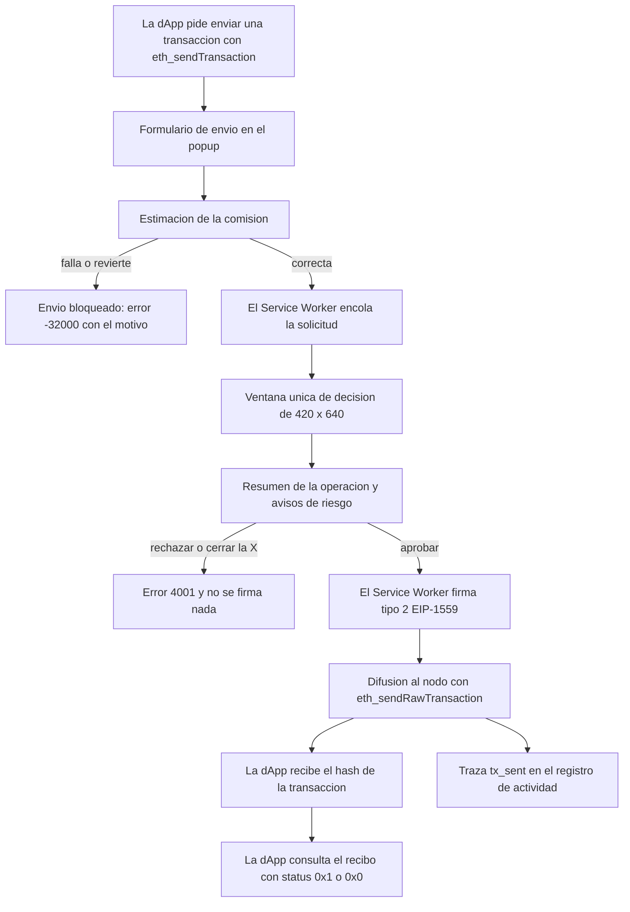

# 04 — Aprobaciones, vista previa y firma

## Empezar en 5 minutos

### Qué necesitas

- TrueKeate Wallet compilada y cargada en Chrome o Edge. Compila con `npm run build` y carga la carpeta `dist/` desde `chrome://extensions`; el fichero que se lee al cargar es `dist/manifest.json`.
- Chrome 114 o superior (es la versión mínima que declara la extensión).
- Un nodo local **Anvil** (la red de pruebas de Foundry) escuchando en `http://127.0.0.1:8545`, con `chainId` 31337 (en hexadecimal, `0x7a69`).
- La dApp de pruebas abierta en `http://localhost:5174/test.html`.
- El identificador de la extensión es estable: `oiahebaliobknoeeonhgaacapjcpgblo`. Lo verás en las direcciones internas `chrome-extension://…`.

### Qué vas a conseguir

- Enviar una transacción desde la dApp y ver, paso a paso, cómo se convierte en una solicitud aprobable.
- Entender qué mira la cartera **antes** de abrir la ventana de decisión y por qué a veces ni la abre.
- Saber qué significa cada aviso de riesgo, cuáles bloquean la aprobación y por qué.
- Comprender qué ocurre al aprobar: quién firma, dónde se firma, cómo se difunde y quién consulta el recibo.
- Reconocer los errores que verás con más frecuencia (4001, `-32000`, `-32602`…) y qué hacer con cada uno.

### Los pasos mínimos

1. Arranca el nodo local desde una terminal:

   ```bash
   anvil --host 127.0.0.1 --port 8545 --chain-id 31337 --allow-origin "chrome-extension://oiahebaliobknoeeonhgaacapjcpgblo,http://localhost:5174,http://127.0.0.1:5174"
   ```

   La bandera `--allow-origin` admite **una sola** lista separada por comas y no puede repetirse. El comodín `--allow-origin "*"` es solo para la máquina aislada del arnés de pruebas.

2. Comprueba que el nodo responde: `cast chain-id --rpc-url http://127.0.0.1:8545` debe devolver `31337`.
3. Levanta la dApp de pruebas con `npm run dev` y abre `http://localhost:5174/test.html`.
4. Carga la extensión ya compilada en el navegador y recarga la pestaña de la dApp.
5. En la dApp, pulsa **Conectar (eth_requestAccounts)** y elige una cuenta. Ese es el permiso que permite que la dApp pida cosas en tu nombre.
6. Pulsa **Enviar transacción (eth_sendTransaction)**. La dApp envía 0,01 ETH a la cuenta #1 de Anvil, `0x70997970C51812dc3A010C7d01b50e0d17dc79C8`.
7. Se abrirá **una sola** ventana de decisión (420 × 640 px). Revisa el resumen, los avisos de riesgo y el plazo de 120 segundos.
8. Pulsa **Aprobar** y verás el hash de la transacción en la página de la dApp. Compruébala con `cast tx <hash> --rpc-url http://127.0.0.1:8545`.
9. Si en lugar de aprobar cierras la ventana con la X, la operación se cancela y la dApp recibe el error 4001.

## 1. Qué es una solicitud aprobable

### 1.1 La marca `requiresApproval` del catálogo

Cada método que la cartera entiende vive en un catálogo interno. Cada entrada del catálogo lleva una marca llamada `requiresApproval` (¿necesita aprobación?). Esa marca es la **única** que decide si una llamada abre la ventana de confirmación: no hay listas paralelas ni comprobaciones sueltas por nombre de método.

#### 1.1.1 Los seis métodos aprobables

Estos seis métodos abren la ventana única de decisión:

| Método | Quién lo puede pedir | ¿Abre ventana? |
|---|---|---|
| `eth_sendTransaction` (enviar una transacción) | la página (dApp) | Sí |
| `eth_signTypedData_v4` (firmar datos con estructura EIP-712) | la página (dApp) | Sí |
| `personal_sign` (firmar un mensaje de texto) | la página (dApp) | Sí |
| `wallet_switchEthereumChain` (cambiar de red) | la página (dApp) | Sí |
| `wallet_addEthereumChain` (dar de alta una red) | cualquiera | Sí |
| `wallet_revokePermissions` (retirar un permiso) | cualquiera | Sí |

El método `eth_sign` **no existe** en TrueKeate Wallet y nunca se añadirá: responde el error `4200` antes de crear nada en la cola de solicitudes. Tampoco aparece en el catálogo de métodos.

#### 1.1.2 Qué métodos NO abren ventana

- Las **10 lecturas de página** (por ejemplo, consultar un saldo o un recibo) no abren ventana: son operaciones de solo lectura.
- Los **16 métodos internos** `wallet_*` (los que usa la propia interfaz de la extensión) tampoco: la regla del catálogo dice que ningún método interno abre la ventana única.
- `eth_requestAccounts` (pedir las cuentas) tampoco usa esta cola: tiene su propia ventana de conexión y su propio plazo de 60 segundos.
- Dos matices: `wallet_switchEthereumChain` **sí** exige aprobación cuando la red de destino no es la activa, y `wallet_addEthereumChain` **siempre** la exige. No hay excepción por contexto para estos dos.

#### 1.1.3 La única excepción de contexto

Hay una sola excepción, y es deliberada: `wallet_revokePermissions` pedido **desde el popup** no abre la ventana única. Su confirmación es la pantalla de «Sitios conectados», que es otra interfaz distinta.

Aquí hubo un defecto ya corregido: en una versión anterior se excluía *todo* contexto de extensión de la ruta aprobable, y el popup acababa respondiendo `4200` sin poder enviar nada. La regla correcta es excluir solo el caso del popup y solo para la revocación.

### 1.2 El tipo `PendingRequest` (M55)

Una solicitud aprobable se guarda con una forma concreta llamada `PendingRequest`. Vive en la clave `truekeate_pending_requests` como un mapa: cada solicitud tiene su identificador y su contenido. **No** guarda un identificador de ventana: la ventana única se persiste aparte, en `truekeate_approval_window`.

#### 1.2.1 Campos reales

| Campo | Qué es |
|---|---|
| `approvalId` | El identificador único de la solicitud. Es la clave del mapa. |
| `method` | Uno de los seis métodos aprobables. |
| `params` | Los argumentos de la llamada, guardados **redactados** (sin secretos). |
| `origin` | El origen de la dApp, normalizado: minúsculas, sin barra final y con el puerto. |
| `tabId` / `frameId` | La pestaña y el marco de donde salió la petición. Si nace en el popup, `tabId` es `null`. |
| `account` | La cuenta que firmará. |
| `chainId` | La red de la solicitud. |
| `createdAt` | El instante en que se creó. Es el reloj de referencia del plazo. |
| `expiresAt` | `createdAt` más el plazo de firma. Va anclado a `createdAt`, no al momento en que se muestra. |
| `status` | `pending` (pendiente), `approved` (aprobada), `rejected` (rechazada) o `expired` (vencida). |
| `resolvedAt` / `errorCode` | Cuándo se resolvió y con qué código de error se avisó a la dApp. |
| `requestId` | El identificador con el que la dApp espera su respuesta. |

#### 1.2.2 Campos de presentación: las tres previews

Los campos de vista previa son **mutuamente excluyentes** según el método:

- `txPreview` — solo para `eth_sendTransaction`.
- `typedDataPreview` — solo para `eth_signTypedData_v4`.
- `signMessagePreview` — solo para `personal_sign`.

#### 1.2.3 Ciclo de vida y correlación

El campo `requestId` guarda el identificador que puso la capa que habla con la página al pedir la operación. Se guarda porque es la **única** forma de que una resolución empujada por el Service Worker (aprobación, rechazo o vencimiento) llegue a la promesa correcta de la dApp cuando el canal directo ya no existe, por ejemplo si el Service Worker se suspendió y despertó después.

Los mapas hermanos de este viven en el mismo sitio: las solicitudes pendientes, las transacciones en vuelo por cuenta, las ventanas de tasa por origen y el estado de la ventana de aprobación.

### 1.3 De la marca al despacho

El enrutador construye el contexto de quien llama, aplica el **token bucket** (un cubo de fichas: cada llamada gasta una ficha y el cubo se rellena con el tiempo; si se agota, la llamada se rechaza) y, si la entrada lleva `requiresApproval`, envía la petición al despacho de aprobaciones.

Dos detalles de orden que conviene retener:

- El token bucket se decide **antes** de saber si el método es aprobable. Por eso una simple lectura que agote el cubo también recibe `4001`.
- La defensa de `wallet_revealSecret` (el método que revela la frase o una clave) se evalúa después del cubo y antes del despacho: desde un contexto no confiable responde `4200`.

## 2. La cola de aprobaciones (M14)

La cola es el módulo que guarda, ordena y resuelve las solicitudes aprobables. Hace cumplir seis reglas, entre ellas que nunca se escriben subclaves y que el orden es siempre el mismo.

### 2.1 Clave persistida y forma real

- La clave es `truekeate_pending_requests`, una de las 14 claves canónicas del almacén. Su valor inicial es un mapa vacío `{}`.
- El formato real es `Record<approvalId, PendingRequest>`: un mapa donde la clave es el identificador de la solicitud.
- La lectura es tolerante y nunca inventa campos. Si a una entrada le falta un plazo utilizable, se conserva como «no vencida», con esta idea de fondo: **nunca se pierde una solicitud por un campo ausente**. Un estado desconocido se degrada a `pending`.
- Solo el estado `pending` **ocupa** la cola.
- Hay un índice derivado llamado `pendingCount` (cuántas hay en espera). No se guarda: se calcula. Alimenta la insignia del icono y el contador «N en espera» de la ventana.
- La solicitud que se muestra es la más antigua por `createdAt`, y si hay empate se desempata por identificador ascendente, para que el orden sea siempre el mismo.

### 2.2 Read-modify-write con `rmwLock` (M33.b)

Varias partes de la cartera leen el almacén, lo modifican y lo vuelven a escribir. Si dos de esas operaciones se solapan, una puede pisar a la otra. Para evitarlo existe un **cerrojo FIFO** (primero en llegar, primero en pasar) llamado `SerialLock`.

- Es un cerrojo **volátil y admisible**: nunca es la fuente de verdad, solo ordena las escrituras.
- Toda mutación de la cola pasa por él.
- La regla de escritura es explícita: **nunca se escriben subclaves**; se escribe la clave completa (leer → modificar una copia → escribir).
- Un fallo no rompe la cadena de espera: el cerrojo sigue atendiendo a los siguientes.

### 2.3 Alta: orden exacto y ciclo de estados

Cuando llega una solicitud, la cola comprueba las cosas en este orden:

| Paso | Qué comprueba | Error si falla |
|---|---|---|
| 0 | Que el tamaño de los argumentos no pase de 64 KiB | `-32602` (`payloadTooLarge`) |
| 1 | Que el identificador no esté repetido | `-32603` (`duplicateApprovalId`) |
| 2 | Que no haya ya 8 solicitudes pendientes en total | `4001` (`global-limit`) |
| 3 | Que ese origen no tenga ya 1 solicitud pendiente | `4001` (`origin-limit`) |
| 4 | Que el origen no haya pedido más de 6 en el último minuto | `4001` (`rate-limit`) |
| 5 | Que la cola y la tasa se puedan escribir en la misma operación | `-32603` (`storageQuotaExceeded`) |

El origen se normaliza siempre. Si la solicitud nace dentro de la extensión, el origen es la clave especial `extension`.

La entrada se guarda como `pending` con `expiresAt = ahora + plazo`. El plazo para los seis métodos aprobables es **siempre** el de firma: 120 segundos.

El ciclo de estados es `pending` → `approved`, `rejected` o `expired`. La aprobación **no** lleva código de error; el rechazo y el vencimiento llevan `4001`. En los cuatro casos la entrada **desaparece** de la cola persistida en la misma operación.

### 2.4 Cardinalidad

Las tres cotas están congeladas en el código, no son ajustes que la interfaz pueda debilitar:

- **8** solicitudes pendientes en total.
- **1** solicitud pendiente por origen (esto también se aplica a la conexión).
- **6** solicitudes por minuto y origen.

Cuando se rechaza por cardinalidad, el rechazo es **inmediato y sin persistir**: no se abre ventana y no cuenta para la insignia. La insignia solo se recalcula tras una escritura real.

### 2.5 Cota de payload de 64 KiB

El límite de una solicitud es **65 536 bytes (64 KiB)**. La medición serializa los argumentos y cuenta bytes UTF-8. Un contenido que **no se puede serializar** se mide como infinito y por tanto se rechaza.

La comprobación es el paso 0: se hace antes de crear la entrada y sin abrir ninguna ventana. El mensaje es «La carga útil de la solicitud supera el límite de 64 KiB.». Consecuencia práctica: un envío rechazado por tamaño no consume cupo ni ventana de tasa, porque no llega a ejecutarse ningún paso posterior.

### 2.6 La ventana de tasa persistida `truekeate_rate_windows`

La clave `truekeate_rate_windows` guarda, por origen, una ventana de tasa con estos seis campos:

- `tokens` — las fichas del token bucket del origen.
- `lastRefillAt` — cuándo se recargó por última vez. Un valor en el futuro delata un reloj movido y provoca un reinicio al reconciliar.
- `approvalWindowStart` — cuándo empezó la ventana de 60 segundos.
- `approvalsInWindow` — cuántas solicitudes aprobables se han pedido en esa ventana. Es el número que se compara con el límite de 6.
- `deniedCount` — contador **diagnóstico** de llamadas denegadas por ese origen. Sube cuando el cubo se agota y no se llega a llamar al nodo.
- `updatedAt` — el último uso. La purga por inactividad lo compara con el tiempo de vida de la ventana.

El token bucket de **todo** el catálogo se deriva del mismo número (6 por minuto) para no tener dos fuentes distintas. La purga por inactividad es de **10 minutos**.

### 2.7 Resolución, purga y marca en vuelo

Al resolver una solicitud se aplican dos reglas duras:

- Si la entrada ya no estaba `pending`, la respuesta se considera **duplicada** y se ignora: la cartera nunca firma ni difunde dos veces.
- Si el plazo ya venció, **prevalece** el vencimiento aunque la decisión fuera aprobar.

La purga separa lo ya resuelto de las pendientes vencidas (las llama «huérfanas») y decide si hay que reescribir. La insignia del icono es derivada: se escribe el número de pendientes o una cadena vacía.

La marca `truekeate_inflight_tx` es un mapa por cuenta que indica si hay una transacción en vuelo:

- `signing` (firmando) **bloquea** la cuenta.
- `broadcast` (ya difundida) **no** la bloquea.
- Tiempo de vida: 3 minutos.
- La marca se escribe **antes** de firmar, nunca después de difundir. Si la cuenta ya tenía una marca `signing` vigente, la operación no firma nada y devuelve `-32000` `inflightTxInProgress` (no es un exceso de cardinalidad).
- Al difundir, la marca pasa a `broadcast` con el hash del nodo y deja de bloquear la cuenta, porque el `nonce` (el número de orden de la transacción en esa cuenta) ya está consumido.
- Una marca sin plazo futuro no bloquea para siempre.

## 3. Plazo y vencimiento (M15)

Este módulo es el dueño del plazo de las solicitudes. Hace cumplir cuatro reglas.

### 3.1 Dueño único del plazo

- El vencimiento es `createdAt + 120 000 ms` (120 segundos) y va **anclado a `createdAt`**. Para la conexión son 60 segundos, pero esa solicitud no vive en esta cola.
- Los seis métodos aprobables, incluidos el cambio y el alta de red, usan 120 segundos.
- Existe una **red de seguridad** de 5 segundos más (125 s en total) que usan las capas de la página y del content script. Nunca es el dueño del plazo: es solo un margen.
- Está **prohibido** usar `setTimeout` o `setInterval` para los plazos: no sobreviven a la suspensión del Service Worker y el plazo nunca dispararía. El dueño real son las alarmas (`chrome.alarms`).
- Matiz: el Service Worker sí usa `setTimeout` como espera entre sondeos del recibo y en los reintentos del cliente RPC. Ninguno de esos usos es un plazo de aprobación.

### 3.2 Nombres reales de alarma

- El prefijo es `truekeate_expire:`.
- El nombre de una alarma de vencimiento es `truekeate_expire:<approvalId>`.
- La alarma que libera una marca `signing` usa el mismo prefijo más la marca `inflight:` y el nombre `truekeate_expire:inflight:<cuenta en minúsculas>`.

El módulo expone cuatro operaciones sobre alarmas: **armar** el vencimiento de una solicitud, **cancelarlo** al resolverla o al vencer, **armar y cancelar** la liberación de una marca en vuelo, y **enumerar y cancelar en bloque** todas las alarmas del prefijo (que es también el paso de limpieza al resetear la cartera).

### 3.3 Armado, rearme y cancelación

- `armAlarm` crea la alarma para un instante concreto. Si el instante ya pasó, Chrome la dispara de inmediato.
- `rearmExpiryAlarms` rearma las pendientes desde su `expiresAt` **persistido** y retira las que ya no corresponden. Una entrada sin plazo numérico se rearma con `ahora + 120 s`, para no dejarla sin plazo.
- `reconcileInflightAlarms` rearma la liberación de cada marca `signing` vigente y retira las alarmas que ya no encajan con ninguna marca.
- El listener de alarmas distingue las dos familias (liberación frente a vencimiento) y se registra de forma **síncrona** al evaluar el Service Worker, porque una alarma puede ser justamente el evento que lo despierte.

### 3.4 Inyección por `VITE_*` para el arnés E2E

Los plazos de firma, conexión y revelado se pueden inyectar desde variables de compilación. Es una facilidad **solo para el arnés de pruebas**, y el valor de producción sigue siendo el valor por defecto:

- `VITE_SIGN_TIMEOUT_MS` → 120 000 ms.
- `VITE_CONNECT_TIMEOUT_MS` → 60 000 ms.
- `VITE_REVEAL_HIDE_MS` → 30 000 ms.

Solo se aceptan cadenas numéricas finitas y mayores que cero; cualquier otra cosa cae al valor de producción. La prueba de navegador del vencimiento usa «3 segundos inyectados» para provocarlo sin esperar dos minutos.

### 3.5 Efecto del vencimiento y código de error

Al vencer, la entrada se marca `expired` con su hora de resolución y el código `4001`. Si la entrada ya no estaba pendiente, solo se limpia su alarma y no se entrega nada: el efecto es **idempotente** (repetirlo no cambia nada).

Si el vencimiento es real, la cartera:

1. Entrega el error de plazo a la dApp.
2. Refresca la ventana única con la siguiente solicitud o la cierra. Un fallo al refrescar **no** impide el `4001` ni la purga.
3. Purga la insignia.
4. Deja **una** traza `approval_expired` con el código, el método y el origen, pero sin los argumentos.

El mensaje que ve el usuario es: «El usuario no respondió en el plazo establecido (120 s); la solicitud ha caducado.».

## 4. Reconciliación al arrancar (M16)

«Reconciliar» es poner de acuerdo lo que hay guardado con lo que hay de verdad cuando el Service Worker arranca. Este módulo ejecuta ocho pasos y está medido: por debajo de **1 segundo** con 50 solicitudes pendientes.

El orden es: una sola lectura del almacén; purga de la cola; `4001` a las huérfanas; rearme de alarmas; reconstrucción de las transacciones en vuelo; reconstrucción de las ventanas de tasa; restablecimiento de la ventana única; y **una** entrada de registro `sw_reconcile` con todo lo ocurrido.

La operación es **idempotente**: repetirla sin cambios no escribe nada salvo su propia entrada de registro.

### 4.1 Purga y `4001` a las huérfanas

La purga retira dos clases de entradas: las que ya no están pendientes (estaban resueltas) y las pendientes cuyo plazo ya pasó.

Las vencidas no se descartan en silencio: reciben su `4001` con el mensaje de vencimiento. Si no hay destinatario, se cuentan como «no entregadas»; en cualquier otro caso, como «entregadas». Cada huérfana deja una traza con su identificador, su código, el modo de entrega y los segundos. La entrada se descarta igualmente, pero **con traza**.

### 4.2 Rearme de alarmas desde `expiresAt`

Se delega en el módulo del plazo: cada solicitud pendiente se rearma en su instante **persistido**, y las alarmas huérfanas se retiran sin dispararlas.

### 4.3 Reconstrucción de `truekeate_inflight_tx`

Aquí se decide qué hacer con cada marca en vuelo. La función que lo planifica **no escribe**: devuelve el mapa resultante, su informe y las trazas, para poder probarla sin almacén.

| Estado leído | Qué se hace |
|---|---|
| `broadcast` con recibo correcto (`0x1`) o fallido (`0x0`) | Se elimina la marca y se registra la confirmación o el fallo. |
| `broadcast` sin recibo y con plazo vivo | Se conserva y se sigue el recibo. |
| `broadcast` sin recibo y con plazo agotado | Se elimina y se registra un `-32603` con el hash. |
| `signing` con plazo agotado | Se libera la cuenta y se registra un `-32603` con la fase y el `nonce`. |
| `signing` con plazo vivo | Se conserva y se rearma la alarma de liberación. |

Dos matices: una marca `signing` con el tiempo agotado **nunca** se reintenta sola (se libera la cuenta y se deja traza), y un fallo al leer el recibo se trata como «sin recibo», aplicando la regla del tiempo de vida.

La liberación por alarma compara la cuenta **sin distinguir mayúsculas**, porque la alarma transporta la cuenta en minúsculas y la clave guardada es una dirección con checksum. Deja traza con el motivo `inflight-ttl`.

### 4.4 Reconstrucción de `truekeate_rate_windows` y ventana única

La tasa se delega en el módulo de límites de peticiones, que purga las ventanas con más de 10 minutos sin uso, **reinicia** las que tienen el reloj en el futuro y conserva el resto. Si la reconstrucción falla, se avisa por consola y no se aborta la reconciliación.

La ventana única se restablece buscando la solicitud pendiente más antigua. Un fallo se avisa sin romper la pasada.

### 4.5 La entrada `sw_reconcile`

El último paso escribe la traza `sw_reconcile`, con **una sola** llamada de escritura. Su nivel es `warn` (aviso) si hubo vencidas, liberaciones o descartes de marca, e `info` (información) si no. Sus datos incluyen cuántas pendientes había antes y después, cuántas se purgaron, cuántas huérfanas se entregaron o no, el rearme de alarmas, el resumen de transacciones en vuelo, las ventanas de tasa y el estado de la ventana.

La insignia se purga con el recuento **posterior** a la purga, para no dejar números viejos.

### 4.6 Pruebas de M16

La suite de este módulo cubre: la purga con `4001` a la huérfana y **una sola** traza, la huérfana sin destinatario, la insignia derivada, el rearme en el instante persistido sin entregar ningún `4001`, la retirada de alarmas huérfanas, la idempotencia de una segunda pasada, la cota de coste con 50 pendientes, la tabla de reconstrucción de transacciones en vuelo, la pureza de la función que planifica, la liberación por alarma sin distinguir mayúsculas, la apertura y el cierre de la ventana al arrancar, la reconstrucción de la tasa y el almacén que rechaza la lectura sin abortar la pasada.

## 5. Puerto de larga vida y `RESUME` (M17)

### 5.1 `chrome.runtime.onConnect` y el nombre del canal

El canal se llama `truekeate_approval`. El listener ignora los puertos que no usan ese nombre y se registra de forma **síncrona** al evaluar el Service Worker: un `onConnect` puede ser justamente el evento que lo despierte, así que el listener debe existir antes de la primera espera del arranque.

Un mensaje del puerto que no sea `RESUME` recibe `4200` por el propio puerto, o se delega si hay un manejador alternativo inyectado.

### 5.2 `portsByApprovalId`: estado volátil admisible

El mapa `portsByApprovalId` relaciona cada solicitud con su puerto abierto. Es, por declaración expresa, **estado volátil admisible**: es solo un índice de transporte, se puede reconstruir, y el Service Worker puede suspenderse y perderlo. Cuando eso pasa, el content script se reconecta con retroceso progresivo y reenvía `RESUME`.

Al desconectarse un puerto se retira **solo** su vínculo, comparando la instancia concreta. El puerto es un canal de transporte y correlación, **no** un mecanismo para mantener vivo el Service Worker.

### 5.3 El mensaje `RESUME`

`RESUME` es un mensaje con la forma `{ type: 'RESUME', approvalId }`, uno de los ocho tipos del protocolo cerrado.

Al atenderlo, la única fuente de verdad es el registro persistido:

- Si la entrada está `pending` y vigente, se vincula el puerto y se responde con la **solicitud completa**.
- Si la entrada está vencida, se responde `4001` calculado a partir de su propio plazo.
- Si la entrada no existe o ya está resuelta, se responde `4001` de rechazo: **nunca se deja a quien llama sin respuesta**.

En los dos casos negativos se desvincula el puerto y se publica un sobre de respuesta con el identificador `RESUME` y el error. Un `RESUME` sin identificador textual responde igual, sin romper el listener.

La respuesta lleva la vista completa: el correlador, el estado `pending`, el método, los argumentos **originales**, el origen, la pestaña, el marco, la cuenta, la red, las tres vistas previas opcionales, las fechas, el contador de pendientes, la solicitud persistida completa y el favicon ya saneado.

### 5.4 Reconexión con backoff

El retroceso progresivo (backoff) va 1, 2, 4, 8, 16 segundos… con un tope de 30 segundos. La implementación del reintento vive en la capa de content script:

- `connectPort()` abre el puerto, reenvía literalmente lo que llega a la página y, al desconectarse, programa la reconexión.
- El `RESUME` solo se envía si antes se **observó** un identificador de aprobación en una resolución empujada por el Service Worker.
- Para no programar dos reconexiones a la vez se guarda el temporizador pendiente.

La correlación de la **respuesta** con la promesa de la dApp no depende de ese estado, sino del identificador persistido en la cola. La ventana de decisión hace lo mismo por su lado: conecta al mismo puerto y publica su `RESUME` con el identificador del correlador.

### 5.5 Entrega de la resolución: puerto vivo o pestaña/frame

La entrega sigue un orden de preferencia estricto:

1. **Puerto vivo** → se envía el mensaje por el puerto y, al terminar, se desvincula y se desconecta, porque la correlación se agota.
2. **Pestaña viva** → se envía por el canal de pestañas, indicando el marco **solo** cuando no es el principal.
3. **Sin destinatario** → se devuelve `none` y decide quien llamó: la reconciliación lo marca y lo registra.

El identificador de correlación del sobre es el `requestId` persistido si existe; si no, el `approvalId`. Sin esa distinción, la promesa de la dApp quedaría colgada hasta su red de seguridad. El sobre incluye además el `approvalId` como campo propio, porque el relay lo observa para su `RESUME` de reconexión.

### 5.6 Empuje del cuerpo a la ventana ya abierta

Aquí hay una medición real del repositorio (Chromium 153 con Playwright 1.63): `chrome.runtime.sendMessage` es **el único canal que alcanza `notification.html`**, porque la ventana es una **página de la extensión**, no un content script.

El envío por pestaña se conserva como respaldo, pero **no** sirve para este caso: la medición devuelve «Could not establish connection. Receiving end does not exist.» para una página `chrome-extension://`, y su identificador de pestaña no se puede resolver sin el permiso `tabs`, que se retiró a propósito.

La seguridad no se resiente: se midió que un `chrome.runtime.sendMessage` emitido por el Service Worker **no** llega a los content scripts, de modo que el cuerpo de la solicitud no se difunde fuera de los contextos confiables de la extensión. El favicon del origen solo admite `http` o `https` y siempre se sirve desde el propio paquete, nunca remoto ni como `data:`.

## 6. Ventana única de decisión (M18)

### 6.1 Apertura con `chrome.windows.create`

Las medidas son **420 × 640**. La apertura real usa una ventana de tipo `popup`, con foco y con una URL que lleva el correlador.

Los cuatro parámetros del contrato de apertura son: la URL con el correlador, el tipo `popup`, las medidas y el foco. La URL es `chrome-extension://<id>/notification.html?approvalId=<id>&origin=<origen>`. Sin ese correlador, la ventana no tiene nada que pedir y declara el hueco.

Si la apertura falla o no devuelve un identificador numérico, la pasada termina con acción `none` y **la solicitud sigue pendiente**.

### 6.2 La clave `truekeate_approval_window`

La clave guarda cuatro datos: `windowId` (el identificador de la ventana), `shownApprovalId` (qué solicitud se está mostrando), `openedAt` (cuándo se abrió) y `updatedAt` (el último cambio).

Su valor inicial es `{ windowId: null, shownApprovalId: null, openedAt: null, updatedAt: 0 }`. La escritura guarda el **objeto completo**.

Este estado es **persistido**, no memoria: sobrevive a la suspensión del Service Worker, y la reconciliación lo contrasta con la lista real de ventanas del navegador.

### 6.3 Reutilización de la ventana existente

Primero se intenta recuperar la ventana guardada. Si sigue viva, se devuelve tal cual. Si se perdió, se buscan todas las ventanas y se filtra por la URL de la ventana única.

El reconocimiento exige el **origen de esta extensión** (`chrome-extension://<id>`), no solo la ruta. Comparar únicamente la ruta hacía que una página de la dApp servida en `/notification.html` se diera por buena y **no se abriera la ventana de verdad**, dejando la solicitud sin mostrar hasta su vencimiento. Ese defecto está corregido.

Se pide además la información de la pestaña, que es el destinatario del empuje del cuerpo. El enfoque de la ventana se hace sin romperse si la API no lo expone.

### 6.4 `showOldestPending`, FIFO y contador de pendientes

`showOldestPending` es la fachada pública y trabaja bajo su propio cerrojo. Devuelve una de estas seis acciones: `opened` (abierta), `re-rendered` (vuelta a pintar), `focused` (enfocada), `closed` (cerrada), `unchanged` (sin cambios) o `none` (nada).

Comportamiento por caso:

- **Sin API de ventanas** → `none`.
- **Sin pendientes y sin ventana conocida** → `none`, y **sin escribir** el estado.
- **Con estado guardado pero sin pendientes** → `unchanged`.
- **Con ventana viva y sin pendientes** → se marca cerrada, se elimina y se purga la insignia (`closed`).
- **Sin ventana viva** → se abre la única (`opened`), se guardan `windowId`, `shownApprovalId` y `openedAt` conservando el `openedAt` previo, y se purga la insignia.
- **Ventana viva mostrando otra solicitud** → se **vuelve a pintar la MISMA** ventana (no se crea ni se cierra otra), se enfoca y se empuja el cuerpo.
- **Ventana redescubierta por URL** → se repara el identificador guardado, se enfoca y se le vuelve a entregar el cuerpo.
- **Ya mostraba la misma** → `unchanged`, salvo que se pida un reenvío explícito del cuerpo.

El motivo del reenvío explícito está documentado: la respuesta de decisión puede llegar a la ventana **después** del empuje de la siguiente solicitud y dejar su vista marcada como resuelta —con el botón «Aprobar» deshabilitado— aunque el cuerpo sea el correcto.

El orden es FIFO: se muestra la pendiente más antigua que sea **presentable**. Una entrada no presentable no abre ventana, porque abrir una ventana en blanco sería peor que esperar a su purga; eso sí, sigue ocupando la cola.

El contador de pendientes es el índice derivado de la cola y viaja a la ventana dentro del sobre.

### 6.5 Cierre con la X equivale a rechazo

El listener de cierre de ventanas se registra de forma **síncrona**, porque el cierre debe marcar el rechazo aunque el Service Worker estuviera dormido.

Reglas:

- Si la ventana cerrada **no** es la guardada, el cierre lo hicimos nosotros (o es ajeno) y **no** hay rechazo que aplicar.
- Si es la nuestra, se limpia el estado **antes** de cualquier otra cosa y se busca la solicitud mostrada.
- Sin solicitud mostrada —o ya resuelta— no hay rechazo, y se pasa a la siguiente.
- Con solicitud pendiente: el estado aplicado es `expired` si el plazo ya venció y `rejected` si no.
- El error entregado es el de plazo en el primer caso, y el de cierre de ventana en el segundo: «La ventana de confirmación se cerró sin respuesta; la solicitud se ha cancelado.», también con código `4001`.
- Después se entrega la resolución, se deja **una** traza, se muestra la siguiente pendiente o se cierra, y se purga la insignia.

Para no confundir el cierre propio con el del usuario, la ventana se marca cerrada en el almacén **antes** de llamar a la orden de cerrar.

### 6.6 Re-detección tras suspensión y prohibición de dos ventanas

Tras una suspensión, el identificador guardado puede apuntar a una ventana que ya no existe mientras la real sigue viva. El redescubrimiento enumera las ventanas, filtra por URL y pestaña y, al encontrarla, **repara** el identificador, la enfoca y le vuelve a entregar el cuerpo.

Que no haya dos ventanas a la vez lo garantizan dos mecanismos:

1. El invariante declarado: como máximo **una** `notification.html` en toda la extensión. Dos solicitudes simultáneas de orígenes distintos producen **una sola** apertura, porque el «leer → decidir → crear» va bajo un cerrojo.
2. Un cerrojo propio e independiente del de la cola, con orden obligatorio: se toma **siempre** el cerrojo de la ventana antes que el de la cola, y nunca se anida dos veces el mismo.

### 6.7 Pruebas de M18

Las suites cubren: que se abre **exactamente una** ventana con la pendiente más antigua y con sus medidas, el contador con dos pendientes, que la siguiente solicitud se **vuelve a pintar en la MISMA** ventana, la pasada que ya mostraba lo mismo, el cierre sin pendientes, el enfoque, el cerrojo serializando dos pasadas simultáneas, la ausencia de la API de ventanas sin romper, la entrada no presentable, el cierre con la X como rechazo `4001`, el vencimiento prevaleciendo al cerrar y el cierre de una ventana ajena. Otras suites cubren el redescubrimiento por URL, la preferencia por el identificador guardado, la reparación del estado y que una `notification.html` con parámetros **no** provoque una segunda ventana. En extremo a extremo se verifica que dos solicitudes simultáneas comparten **una** ventana con contador 2, y que la vista previa decodifica el calldata y la ventana es única y está enfocada.

## 7. Decisiones y respuestas

### 7.1 Espera del desenlace (M14.b)

La cola persistida es la única fuente de verdad, pero la **petición en vuelo** es una espera de proceso: el almacén no puede resolver una promesa. Este módulo es el punto ÚNICO donde esa promesa se resuelve.

- `waitForApprovalResolution` devuelve la decisión y una forma de cancelar la espera.
- Se usa una **lista** de interesados y no un único resolutor, porque una misma solicitud puede ser observada por más de uno y todos deben despertar con el mismo desenlace.
- **No posee ningún plazo**: el dueño es el módulo del plazo.
- Al resolverse, se notifica a todas las esperas y se retiran, en la misma operación en que la entrada sale de la cola, de modo que nadie ve un estado intermedio.
- Es estado **volátil admisible** que nunca se persiste: si el Service Worker se suspende, la cola persistida sigue siendo la verdad y la reconciliación entrega el `4001` de las huérfanas.

### 7.2 `handleSignResponse` (M14.c)

La regla de oro: **la ventana única decide, no firma**. Publica el mensaje `SIGN_RESPONSE` con el identificador y si se aprueba o no. Quien resuelve la cola, firma, difunde y responde a la dApp es el Service Worker.

Al recibir la decisión, se ejecuta este orden:

1. Se comprueba la ruta de quien envía. Fuera de la lista permitida, no se resuelve **nada**: solo `notification.html` puede decidir.
2. Sin identificador textual, no se hace nada.
3. El éxito se evalúa de forma estricta: solo vale `success === true`.
4. Si la resolución devuelve vacío, la respuesta se considera duplicada: **no** se firma, **no** se difunde y **no** se entrega.
5. En la aprobación no se entrega nada aquí, porque la respuesta la produce el despacho (el hash o la firma); solo se registra el desenlace. En rechazo o vencimiento sí se entrega el error correspondiente.
6. El `4001` del rechazo usa el error que envía la ventana si trae uno bien formado y, si no, el literal «Operación cancelada por el usuario.».
7. Se deja **una** traza de resolución con el estado, el código y el modo de entrega. Un fallo del registro se avisa sin romper nada.
8. Se vuelve a pintar la ventana única.

### 7.3 Respuestas duplicadas se ignoran

La regla vive en tres sitios coherentes: en la cola, resolver algo que ya no está pendiente devuelve vacío; en la respuesta, ese vacío se traduce a «ya resuelta» sin firma ni difusión; y en el vencimiento, si la entrada ya no estaba pendiente solo se limpia su alarma. Hay una prueba explícita de que una respuesta duplicada se ignora y no vuelve a resolver.

### 7.4 Orden obligatorio: responder primero, re-renderizar después

Este es el cierre de un defecto real. El orden obligatorio es:

1. Se resuelve la solicitud y se entrega la respuesta.
2. **Después** se ejecuta la pasada de la ventana única.

El motivo: al volver a pintar, la ventana recibe el cuerpo de la siguiente solicitud; si ese empuje llegara antes que la respuesta de su propio `SIGN_RESPONSE`, la ventana marcaría la vista como resuelta —con el botón «Aprobar» deshabilitado— aunque mostrara la solicitud correcta, y la cola se quedaría atascada. Responder primero y volver a empujar después elimina la carrera.

En código: el manejador desactiva la pasada interna, responde primero y **después** refresca la ventana, reenviando el cuerpo si la ventana ya mostraba la misma solicitud.

## 8. Vista previa (M19 y M66)

### 8.1 Los tres tipos de preview

El módulo de vista previa construye las tres vistas y sus avisos de riesgo. La entrada única por método devuelve vacío para los métodos sin vista previa propia: el cambio de red, el alta de red y la revocación de permisos.

Los tres tipos son la vista de transacción, la de datos tipados y la de firma de mensaje. Para los dos últimos hay además campos de **redacción en reposo**: en lugar del contenido íntegro se guardan el hash y el tamaño, por si el mensaje es muy largo.

El contexto que aporta la cola incluye el emisor, la red, el saldo, el límite de gas, las dos comisiones, el precio del gas, un `nonce` informativo, la etiqueta local del destino y si la estimación falló.

### 8.2 `TxPreview`

La vista de una transacción contiene:

| Campo | De dónde sale |
|---|---|
| `from` / `to` | El emisor y el destino; el destino puede ser vacío si es un despliegue de contrato. |
| `toLabel` | La etiqueta local del destino, «Despliegue de contrato» o «desconocido». |
| `valueWei` / `valueEth` | El valor en wei (la unidad más pequeña de ETH) y formateado en ETH. |
| `data` / `dataLength` / `isContractCall` | El **calldata** (los datos adjuntos de la llamada), sus bytes y si es una llamada a contrato. |
| `selector` / `functionName` / `decodedArgs` / `isUnrecognizedContractCall` | Los rellena la tabla local de selectores. |
| `riskWarnings` | La lista de avisos de riesgo. |
| `gasLimit` | El límite de gas; 0 si la estimación falló y 21 000 por defecto si no se aporta. |
| `estimationFailed` | El motivo del fallo de estimación, o vacío. |
| `maxFeePerGas` / `maxPriorityFeePerGas` | Las dos comisiones, siempre mayores que cero. |
| `estimatedFeeEth` | La comisión estimada en ETH. |
| `nonceInformativo` | Solo informativo: el definitivo se recalcula al aprobar. |
| `txType` / `chainId` | Tipo 2 (EIP-1559) y la red activa. |
| `insufficientFunds` | Verdadero si el saldo no cubre el valor más la comisión. |

Esta función es **pura y síncrona**: la estimación de gas, el `nonce` y los precios los aporta quien llama ya resueltos, de modo que la vista previa es determinista y se puede verificar sin red ni reloj. La extracción de los argumentos de la dApp es tolerante: admite tanto la lista canónica como el objeto suelto.

### 8.3 `TypedDataPreview`

La vista de datos tipados muestra el dominio, su nombre, el contrato verificador, los tipos (**sin** el tipo del dominio), el mensaje (o vacío si se redactó), el tipo principal y dos comparaciones: si la red del dominio no coincide y si el contrato verificador no es válido.

Cuatro reglas:

- El tipo del dominio (`EIP712Domain`) se elimina **siempre** de la lista de tipos, y el contrato verificador se normaliza.
- La comprobación de red compara la red declarada con la activa: una red **presente pero ilegible** cuenta como discrepancia (se falla del lado seguro), y una red **ausente** no lo es. Aquí hubo un defecto medido y corregido: la comparación anterior daba «31337 igual a 31337» aunque el `chainId` del dominio fuera basura, y no se emitía ni el aviso ni la doble confirmación obligatoria.
- La comprobación del contrato verificador es verdadera si la dirección es la cero o si el nodo responde `0x` al pedir su código. **Nunca** se compara con nada «declarado» por la propia dApp: esa comparación se retiró por ser circular e incomputable. Sin acceso al nodo, la comprobación queda en falso en lugar de inventarse.
- Si el mensaje supera los 4096 bytes, se guarda su hash y su tamaño en lugar del contenido. El contenido íntegro de firma (hasta 64 KiB) sigue estando en los argumentos persistidos.

### 8.4 `PersonalSignPreview`

La vista de firma de mensaje contiene el texto (o vacío si no es legible), si la carga venía en hexadecimal, su longitud en bytes y los bytes en hexadecimal (estos **solo** para la interfaz: nunca se copian al registro de actividad).

Casos:

- Carga hexadecimal **legible** como UTF-8 (por ejemplo `0x686f6c61` → `hola`): se muestra el texto.
- Carga hexadecimal **no legible**: el texto queda vacío, se marca como hexadecimal y se añade el aviso «contenido no legible» con la longitud.
- Carga de **texto plano**: se muestra tal cual.

La decodificación es UTF-8 estricta, y un texto se considera legible solo si no contiene el carácter de reemplazo ni caracteres de control fuera del tabulador, el salto de línea y el retorno de carro. Por encima de 4096 bytes, el texto es un **extracto** recortado sin partir un carácter multibyte.

El orden de las comprobaciones es estricto y está documentado: primero cadena, después bytes. Comprobar la forma de bytes antes devolvía la cadena a una conversión que lanzaba un error de valor no válido. La extracción del mensaje acepta los dos órdenes de argumentos y devuelve el primer parámetro que **no** sea una dirección.

### 8.5 La tabla LOCAL CERRADA de selectores (M66)

El `selector` es un identificador de cuatro bytes que abre cada llamada a contrato. Esta tabla es «la ÚNICA fuente de decodificación del calldata» y el oráculo contra la **firma ciega** (firmar algo cuyo contenido no entiendes). Tiene **7 entradas**:

| Selector | Firma canónica | Nombre | Argumentos |
|---|---|---|---|
| `0xa9059cbb` | `transfer(address,uint256)` | `transfer` | `to`, `amount` |
| `0x23b872dd` | `transferFrom(address,address,uint256)` | `transferFrom` | `from`, `to`, `amount` |
| `0x095ea7b3` | `approve(address,uint256)` | `approve` | `spender`, `amount` |
| `0x39509351` | `increaseAllowance(address,uint256)` | `increaseAllowance` | `spender`, `addedValue` |
| `0xa22cb465` | `setApprovalForAll(address,bool)` | `setApprovalForAll` | `operator`, `approved` |
| `0xd505accf` | `permit(address,address,uint256,uint256,uint8,bytes32,bytes32)` | `permit` | `owner`, `spender`, `value`, `deadline`, `v`, `r`, `s` |
| `0xac9650d8` | `multicall(bytes[])` | `multicall` | `data` |

Reglas verificadas de la tabla:

- El conjunto de selectores reconocidos es **exactamente** el de la tabla y **no se amplía en tiempo de ejecución**: no hay listas remotas, ni ABI descargados, ni servicios de firmas.
- La única criptografía es un cálculo de `keccak256` para **verificar** que cada selector coincide con su firma canónica. El programa nunca usa ese cálculo para ampliar la tabla.
- Los valores decodificados se limitan a números y direcciones, y son serializables: los enteros van como **cadena decimal** (nunca como un número enorme que el almacén no sabría guardar), las direcciones con checksum y los datos largos truncados a la forma `0x1234…abcd`.
- `multicall` se decodifica **recursivamente por esta misma tabla**, de modo que una sub-llamada desconocida sigue marcándose como no reconocida.

Los avisos estructurales posibles son: allowance ilimitada, aprobación total, permiso EIP-2612, no reconocido, decodificación fallida y multicall con llamada no reconocida. Se derivan así: hay **allowance ilimitada** si `approve` o `increaseAllowance` llegan al máximo de 256 bits; hay **aprobación total** si `setApprovalForAll` es verdadero; y el aviso de **permiso** aparece siempre que la función sea `permit`.

### 8.6 Fuera de la tabla: `functionName = null` con aviso bloqueante

El contrato de fallo de la decodificación es exacto:

- **Calldata vacío (`0x`)**: es una transferencia simple. El selector, el nombre de la función y los argumentos quedan vacíos, y **no** se marca como no reconocida.
- **Selector fuera de la tabla**: el nombre de la función y los argumentos quedan vacíos, se marca como llamada no reconocida y se añade el aviso correspondiente.
- **Selector dentro de la tabla, con cuerpo hexadecimal inválido o argumentos que no encajan**: se **conserva** el nombre de la función (la firma sí se reconoce), los argumentos quedan vacíos y se añade el aviso de decodificación fallida.

En la vista previa, la llamada no reconocida y los argumentos no decodificables se añaden a la lista de avisos **BLOQUEANTES**, con esta justificación: la firma ciega invalida el hito.

### 8.7 `riskWarnings[]` y el catálogo real de avisos

El catálogo tiene **12 entradas**. **Cuatro bloquean** la aprobación:

| Aviso | Resumen del texto | ¿Bloquea? |
|---|---|---|
| `unlimitedAllowance` | «Allowance ILIMITADA: el gastador podrá disponer de todos tus tokens…» | No |
| `approvalForAll` | «Aprobación TOTAL de tus NFTs…» | No |
| `permit` | «Firma de permiso (EIP-2612): revisa el gastador, el importe y la fecha límite…» | No |
| `unrecognizedContract` | «Llamada a contrato NO RECONOCIDA…» | **Sí** |
| `undecodableArguments` | «No se han podido decodificar los argumentos…» | **Sí** |
| `unknownDestination` | «Destino sin etiqueta…» | No |
| `contractDeployment` | «Despliegue de contrato…» | No |
| `multicallWithUnrecognized` | «El multicall contiene una sub-llamada NO RECONOCIDA…» | **Sí** |
| `unreadableContent` | «Contenido no legible: el payload no es texto UTF-8…» | No |
| `longMessage` | «Mensaje demasiado largo: se muestra su hash y su longitud.» | No |
| `domainChainMismatch` | «El dominio EIP-712 declara OTRA red… Doble confirmación obligatoria.» | No, pero exige doble confirmación |
| `verifyingContractMismatch` | «Contrato verificador NO válido…» | **Sí** |

Se añaden además dos avisos: el motivo de una estimación fallida, con el mensaje «La estimación de gas falló: `<motivo>`. El envío se ha bloqueado.», y el de saldo insuficiente, «Saldo insuficiente para cubrir el valor y la comisión estimada.».

Avisos que **bloquean** la aprobación, según el catálogo: contrato no reconocido, argumentos no decodificables, `multicall` con llamada no reconocida y contrato verificador no desplegado. En la interfaz se añade además el saldo insuficiente: son dos clasificaciones con propósitos distintos, porque el catálogo marca los avisos que impiden firmar a ciegas y la interfaz incluye también la imposibilidad material de pagar.

En la interfaz, el panel de avisos es **solo presentación**: no lee el almacén y no firma nada. Sus reglas son: cada aviso lleva el rol de alerta y está visible antes de decidir; un aviso bloqueante **impide aprobar** hasta marcarlo explícitamente con la casilla «He revisado estos avisos y quiero aprobar la solicitud igualmente.»; y un aviso destacado se pinta resaltado pero **no** bloquea. La insignia resume el peor aviso en «Riesgo alto», «Revisar antes de aprobar» o «Sin avisos de riesgo».

### 8.8 Prohibición de consultar ABIs externas

La tabla es **código propio**, no una dependencia, y no se amplía en tiempo de ejecución: ninguna lista remota, ningún ABI descargado, ningún servicio de firmas. El codificador de datos es único y funciona sin red.

La única consulta externa que participa en la vista previa es la petición del código de un contrato a la **red activa**, y su único uso es decidir si el contrato verificador no es válido.

## 9. Despacho y firma (M19.b y M11)

### 9.1 La ventana decide, el Service Worker firma

El despacho es la **orquestación** de esta ruta y **no duplica lógica**: la vista previa la construye un módulo, la cola y la marca en vuelo otro, el plazo otro, la entrega otro, la ventana otro, la firma otro y la difusión y el contrato observable otro.

La separación se formula como regla en dos sitios: la ventana publica su decisión, y quien resuelve la cola, firma, difunde y responde es el Service Worker.

El orden exacto del despacho es: contexto y red activa → estimación bloqueante antes de abrir la ventana → vista previa → alta en la cola → plazo → ventana única → espera de la decisión → efecto según el método.

### 9.2 El ciclo común `runApprovalCycle`

1. Se da de alta la solicitud. Si el alta falla (cardinalidad, tamaño o cuota), se responde de inmediato **sin abrir ventana**.
2. Se arma la alarma de vencimiento.
3. Se registra la espera **antes** de mostrar la ventana, para no perderse un desenlace temprano, y después se espera la decisión.
4. Se traduce el desenlace: sin decisión → error de abandono; aprobada → se continúa; cualquier otro caso → error de vencimiento o de rechazo.
5. En el bloque final se cancela la espera, para no dejar esperas colgadas.

La entrega del `4001` en el rechazo **no** la hace este ciclo, sino la vía que resuelve la entrada, de modo que la respuesta viaja una sola vez y por el canal que ya existe.

Antes del ciclo se resuelve el contexto del origen: la dApp solo conoce la cuenta de su sesión vigente, así que el emisor es **siempre** esa cuenta, y sin sesión se responde `4100` sin abrir ventana. En el popup no hay sesión que consultar y se firma con la cuenta **activa**, validada contra la cartera.

La estimación bloqueante se ejecuta **antes** de construir la vista previa: si falla o la transacción revierte, se devuelve `-32000` con un motivo accionable y no se encola ni se abre nada.

### 9.3 Firma EIP-1559 (tipo 2), vía única de `eth_sendTransaction`

El módulo de firma es la «**ÚNICA VÍA DE FIRMA**» de TrueKeate Wallet: ninguna otra parte del sistema firma ni toca la clave privada. El Service Worker es el único que las maneja.

- La transacción se construye como **tipo 2** (EIP-1559), con la red y las dos comisiones.
- Tras firmar, se **verifica** el tipo observado en la transacción serializada: si no es 2, se lanza un error interno. Es una defensa en profundidad de la regla «`eth_sendTransaction` SIEMPRE difunde tipo 2».
- La red va **dentro** de la firma (EIP-155), de modo que la transacción no se puede replicar en otra red. Cualquier red que no sea la activa se rechaza con `4901` **antes** de tocar la clave.
- El resultado publica la transacción serializada, el hash, el emisor, el destino, el tipo, la red, los valores `v`, `yParity`, `r` y `s` de la firma, el `nonce`, el límite de gas y las dos comisiones.

### 9.4 Firma EIP-155 legada

Existe una firma **legada** (tipo 0) porque EIP-155 —la red dentro de la firma, con `v = chainId * 2 + 35/36`— es un requisito verificable por separado, y porque una dApp puede pedir el tipo 0.

- El precio del gas es **obligatorio** y debe ser mayor que cero; sin él se lanza un error interno.
- La red también es obligatoria: sin ella se firmaría una transacción **pre-EIP-155**, replicable en otra red, y eso está prohibido.
- La fórmula del `v` se expone para que sea verificable sin ambigüedad: con `chainId = 31337`, el `v` solo puede ser `62709` (paridad 0) o `62710` (paridad 1).

Matiz de alcance: hoy la ruta de producción de `eth_sendTransaction` usa **solo** la firma de tipo 2, y la firma legada no tiene quien la llame fuera de las pruebas. Queda **pendiente de confirmar** si se conectará para un tipo 0 explícito.

### 9.5 EIP-712 y `personal_sign`

**EIP-712 (`eth_signTypedData_v4`)** — se limpia el tipo del dominio de la lista de tipos, porque el dominio no es un tipo firmable y la librería lo rechaza si se cuela. El tipo principal se resuelve con el declarado si existe y, si no, con la raíz inferida (el tipo que no aparece como campo de ningún otro; si todos aparecen, se toma el primero declarado). Sin tipos se lanza un error interno.

Se calcula el hash de los datos tipados y se firma. Un fallo al calcular el hash bloquea la firma entera, «nunca a medias». El resultado devuelve la firma (132 caracteres en hexadecimal), el **digest** (el resumen que firma y que el contrato verificador consume), el tipo principal, los tipos ya limpios y el dominio.

**`personal_sign` (EIP-191)** — se aplica el prefijo literal `\x19Ethereum Signed Message:\n<longitud>`, expuesto para poder comprobarlo literalmente. La interpretación de los argumentos es la misma que la de MetaMask: una cadena **hexadecimal** se interpreta como los bytes del mensaje; una cadena que **no** es hexadecimal se codifica en UTF-8; y un array de bytes se toma tal cual. El resultado devuelve la firma, el emisor, el hash del mensaje, el prefijo aplicado y la longitud en bytes.

### 9.6 `nonce` definitivo, `getFeeData` y mínimos de comisión

El `nonce` (el número de orden de la transacción en esa cuenta) y las comisiones se **recalculan al aprobar**; no se confía en el valor informativo de la vista previa.

- El `nonce` definitivo se lee con el estado `pending`, es decir, contando también las transacciones aún no confirmadas.
- Las comisiones se leen del nodo; si el nodo no las soporta, se dejan vacías para que el módulo de firma derive mínimos válidos.
- Un fallo al leer las comisiones para la **vista previa** no impide mostrarla: se avisa por consola y se sigue.
- Los mínimos son **1 gwei** (mil millones de wei) tanto para la comisión de prioridad como para la comisión máxima. Se sustituye un valor nulo o cero del nodo porque una transacción con prioridad 0 no es aceptada por la red y la deja inválida.
- El invariante es que **las dos comisiones sean mayores que cero**. El módulo decide cuál viene del nodo y cuál se deriva, y publica esa procedencia.

### 9.7 Difusión y marca `truekeate_inflight_tx`

El orden real al enviar es:

1. Se normalizan los campos de la transacción.
2. Se recalculan el `nonce` y las comisiones.
3. Se toma la marca en vuelo. Si la cuenta ya tenía una marca `signing` vigente, **no se firma nada** y se propaga el error de conflicto.
4. Se firma. El límite de gas que se prefiere es el que pidió la dApp y, si falta, el estimado.
5. Se difunde con `eth_sendRawTransaction`, que devuelve el hash **al difundir**, sin esperar al recibo. Un rechazo del nodo se traduce a `-32000` `broadcastRejected` con un motivo accionable; una respuesta sin forma de hash lanza un error interno.
6. La marca pasa a `broadcast` con el hash, porque el `nonce` ya está consumido y la cuenta se libera.
7. Se deja la traza `tx_sent` con el estado pendiente, el hash y el método, **sin** los argumentos: la traza no lleva el contenido, solo el hash y el método.
8. Se devuelve el hash, que es el resultado que recibe la dApp.

Ante **cualquier** fallo en la firma, la difusión o la traza, se libera la cuenta: una cuenta bloqueada por un error de firma sería peor que el propio error.

La marca es de **1 transacción en vuelo por cuenta**, con un tiempo de vida de 3 minutos.

Efectos por método: la firma de datos tipados y la firma de mensaje devuelven la firma; la revocación de permisos aplica exactamente la revocación (borrar la sesión, descartar la conexión pendiente y avisar a las pestañas del origen con una lista de cuentas vacía); y el alta de red pide el permiso de acceso al servidor en tiempo de ejecución, cuyo gesto válido es la aprobación del usuario en la ventana única: si se deniega, la red no se guarda y la llamada se resuelve con `4001`.

## 10. Seguimiento del recibo (M7)

### 10.1 Estados observables y eventos

Los estados posibles de una transacción son cuatro:

- `pending` — difundida, sin recibo todavía.
- `confirmed` — el recibo trae estado correcto (`0x1`).
- `reverted` — el recibo trae estado de reversión (`0x0`).
- `failed` — no llegó a confirmarse: difusión rechazada, interrumpida o plazo agotado.

El motivo de una reversión se busca en el recibo, «nunca el contenido íntegro». Cada transición produce una entrada de registro:

| Estado | Evento | Nivel | Mensaje en español |
|---|---|---|---|
| `pending` | `tx_sent` | `info` | «Transacción difundida; pendiente de confirmación.» |
| `confirmed` | `tx_confirmed` | `success` | «Transacción confirmada (recibo con status 0x1).» |
| `reverted` | `tx_reverted` | `error` | «Transacción revertida en la cadena (recibo con status 0x0).» |
| `failed` | `tx_failed` | `error` | «La transacción no se confirmó.» más ` Motivo: <reason>` si lo hay. |

### 10.2 Cadencia y plazos

Tres constantes congeladas en el código:

- **1 000 ms** entre sondeos del recibo.
- **120 000 ms** de plazo máximo de seguimiento.
- **120** sondeos como tope duro, además del plazo, para no sondear sin fin.

Estas cifras **no** son un plazo de aprobación: el vencimiento de la ventana es de otro módulo y usa alarmas; esto es el sondeo del recibo tras difundir.

### 10.3 `followTransaction`

El seguimiento:

1. Valida la forma del hash (`0x` más 64 caracteres hexadecimales). Si no encaja, lanza un error interno.
2. Resuelve las opciones con los valores de producción.
3. Emite la **primera** transición `pending` justo tras difundir.
4. Sondea en un bucle acotado. Si no hay recibo y el reloj pasó el plazo, sale; si no, espera el intervalo.
5. Con recibo, emite la transición del estado (con motivo si hubo reversión) y devuelve el resultado.
6. Si se agota el plazo sin recibo, emite `failed` con el motivo «no se recibió el recibo dentro del plazo de seguimiento»: **nunca una transacción en vuelo sin cierre**.

El consumidor de cada transición se invoca **exactamente una vez por transición**, y un fallo suyo no rompe el seguimiento: solo se avisa por consola. También existe una consulta puntual sin espera.

### 10.4 Qué evento se emite a la dApp

Hay que distinguir dos planos:

- La dApp recibe **el hash al difundir**, no el recibo. `eth_sendTransaction` devuelve el hash (`0x` más 64 hex) **sin esperar al recibo**; el seguimiento se hace después, con `eth_getTransactionReceipt`.
- El recibo lo consulta la propia dApp por el catálogo de lecturas, porque `eth_getTransactionByHash` y `eth_getTransactionReceipt` están entre las 10 lecturas de página y su despacho reenvía al nodo sin transformar el resultado.

Las transiciones se instrumentan en el registro de actividad (`tx_sent`, `tx_confirmed`, `tx_reverted`, `tx_failed`), que es lo que alimenta el panel de actividad y la lectura interna de registros. **No existe** un evento de «transacción confirmada»: el catálogo cerrado de eventos tiene cinco, y son `accountsChanged`, `chainChanged`, `connect`, `disconnect` y `message`.

En el árbol de producción, el seguimiento del recibo está implementado y probado, pero su conexión al despacho —más allá de la traza `tx_sent`— queda **pendiente de confirmar**.

## 11. Diagrama de secuencia de una aprobación de transacción

<!-- GENERAR_IMAGEN: flujo-envio-aprobacion.svg -->



Lectura del diagrama:

- **La decisión y la firma están separadas por diseño.** La decisión solo resuelve la entrada de la cola; la firma ocurre en el Service Worker al despertar el ciclo de aprobación.
- **La estimación precede a la ventana y es bloqueante.** Si falla, no hay ventana ni entrada en la cola.
- **El plazo lo arma el Service Worker, no la ventana.**
- **La ventana no se abre dos veces**: se vuelve a pintar y se le empuja el cuerpo de la siguiente solicitud.
- **El hash viaja a la dApp** por el puerto vivo o por el canal de pestañas con el marco exacto.
- **El recibo no se empuja**: lo consulta la dApp por el catálogo de lecturas.

## 12. Modos de fallo y pruebas

| Escenario | Comportamiento real | Prueba que lo cubre |
|---|---|---|
| **Ventana cerrada con la X** | La solicitud mostrada se resuelve como rechazada con `4001`; si el plazo ya venció, prevalece el vencimiento. Se limpia el estado antes de cerrar, se muestra la siguiente pendiente o se cierra, se purga la insignia y se deja **una** traza. | Suite de la cola de ventanas, cobertura del foco y prueba de navegador de vencimiento y cierre. |
| **Plazo vencido** | La alarma dispara el vencimiento: la entrada queda `expired` con `4001`, se entrega el error, se refresca la ventana, se purga la insignia y se deja traza. Es idempotente. | Suite del plazo y prueba de navegador con 3 s inyectados. |
| **Service Worker suspendido con pendientes** | Al arrancar, la reconciliación purga lo resuelto, entrega `4001` a las vencidas, rearma las alarmas, reconstruye las transacciones en vuelo, reconstruye la tasa, restablece la ventana única y escribe **una** entrada `sw_reconcile`. | Suite de reconciliación y prueba de navegador con el Service Worker suspendido. |
| **Respuesta duplicada** | No se firma, no se difunde y no se entrega: la cola devuelve vacío porque la entrada ya no estaba pendiente. | Suite de la cola, del plazo y de las decisiones. |
| **Cola llena** (8 globales o 1 por origen) | `4001` **inmediato**, sin persistir, sin abrir ventana y sin contar para la insignia; los datos distinguen el límite global del límite por origen. | Suite de la cola. |
| **Payload mayor de 64 KiB** | `-32602` sin persistir, sin abrir ventana y sin consumir cupo, porque la comprobación es el paso 0. Un contenido no serializable se mide como infinito y también se rechaza. | Suite del límite de carga. |
| **RPC caído** | La lectura falla tras la política cerrada de 4 intentos y el almacén no cambia (`4900`). En el despacho, un fallo de **transporte** en la estimación propaga el `4900` sin encolar; un fallo de **nodo** (reversión) se clasifica como `-32000` con motivo accionable. En la reconciliación, un fallo al leer el recibo se trata como «sin recibo». | Prueba de navegador del RPC caído y suites del contrato de transacción. |
| **Cuenta con otra transacción en vuelo** | `-32000` `inflightTxInProgress` con datos de diagnóstico; la solicitud sigue pendiente y **no** se firma ni se difunde. No es un exceso de cardinalidad. | Suites de la cola y del despacho. |
| **Estimación de gas fallida** | `-32000` con motivo accionable y el envío **bloqueado**: no se abre ventana ni se crea entrada. | Suite del despacho y de la vista previa. |
| **Cuenta u origen no autorizado** | `4100` **sin abrir ventana**: si la cuenta pedida no es la de la sesión; en el popup, si no pertenece a la cartera; y sin sesión vigente, sin tocar la cola. Una respuesta desde una ruta no permitida no resuelve nada. | Suites del despacho y de los puertos. |
| **Destino no etiquetado o despliegue** | La etiqueta vale «desconocido» (con su aviso) o «Despliegue de contrato» (con el suyo) cuando el destino es vacío. La etiqueta solo puede venir del catálogo local de la cartera. | Suites de la vista previa y del despacho. |
| **Selector fuera de la tabla local cerrada** | Nombre de función y argumentos vacíos, marca de llamada no reconocida y aviso **bloqueante**; la interfaz exige marcarlo explícitamente antes de habilitar «Aprobar». | Suites de calldata, vista previa y avisos de riesgo. |

## Problemas frecuentes

### La ventana de confirmación no se abre y la solicitud caduca sola

**Causa.** La cartera reconocía la ventana única solo por su ruta. Una página de la dApp servida en `/notification.html` se daba por buena y no se abría la ventana de verdad, así que la solicitud se quedaba sin mostrar hasta su vencimiento.

**Solución.** Actualiza la extensión. La versión corregida exige que la ventana pertenezca al origen de **esta** extensión (`chrome-extension://oiahebaliobknoeeonhgaacapjcpgblo`), no solo que la ruta coincida.

### El botón «Aprobar» se queda deshabilitado aunque la solicitud en pantalla sea la correcta

**Causa.** Una carrera: el cuerpo de la siguiente solicitud llegaba a la ventana **antes** que la respuesta de la decisión anterior, y la ventana marcaba la vista como ya resuelta.

**Solución.** Actualiza la extensión. El orden obligatorio es responder primero al emisor y refrescar la ventana después, reenviando el cuerpo si la ventana ya mostraba la misma solicitud. Si lo ves, cierra la ventana; la solicitud se rechazará con `4001` y podrás volver a pedirla.

### El plazo se cumple antes de tiempo (mucho antes de los 120 segundos)

**Causa.** Un plazo gestionado con temporizadores de JavaScript no sobrevive a la suspensión del Service Worker: el temporizador se pierde y el vencimiento se comporta de forma imprevisible.

**Solución.** Actualiza la extensión. El plazo es propiedad de un único módulo y usa **alarmas del navegador**, ancladas al instante de creación de la solicitud, no al momento en que se muestra. La única excepción son las pruebas automatizadas, que inyectan plazos cortos a propósito (por ejemplo, 3 segundos).

### El popup no puede enviar nada y responde 4200

**Causa.** Un defecto ya corregido: se excluía **todo** contexto de extensión de la ruta aprobable, de modo que el popup no podía iniciar un envío.

**Solución.** Actualiza la extensión. La excepción es ahora única y deliberada: solo `wallet_revokePermissions` desde el popup se gestiona por su propia pantalla de «Sitios conectados» y no por la ventana única.

### El envío se bloquea con `-32000` y no llega a abrirse ninguna ventana

**Causa.** La estimación de gas se hace **antes** de mostrar la solicitud y es bloqueante. Si la transacción revierte o el nodo no puede estimar, el envío se detiene con un motivo accionable.

**Solución.** Lee el motivo que acompaña al error. Comprueba que el saldo cubre el valor más la comisión, que el destino es correcto y que el nodo sigue respondiendo (`cast chain-id --rpc-url http://127.0.0.1:8545` debe devolver `31337`).

### Aparece `-32000` diciendo que ya hay una transacción en vuelo para esa cuenta

**Causa.** Solo se admite **1 transacción en vuelo por cuenta**. Mientras una transacción está en fase de firma, la cuenta queda bloqueada. La marca dura como máximo 3 minutos.

**Solución.** Espera a que la transacción anterior se difunda y reintenta. Si el problema se repite, revisa el registro de actividad: la reconciliación del arranque libera las marcas de firma cuyo plazo ya venció.

### La dApp recibe el hash pero no el recibo de confirmación

**Causa.** Es el comportamiento documentado: `eth_sendTransaction` devuelve **el hash al difundir**, sin esperar al recibo. No existe un evento de «transacción confirmada» entre los cinco eventos estándar.

**Solución.** Que la dApp consulte el recibo por su cuenta con `eth_getTransactionReceipt` (está entre las 10 lecturas de página). Desde la terminal puedes verificar la transacción con `cast tx <hash> --rpc-url http://127.0.0.1:8545`.

### Un envío se rechaza con `-32602` y el mensaje de 64 KiB

**Causa.** Los argumentos de la solicitud superan el límite de **64 KiB**, o no se pueden serializar.

**Solución.** Reduce el tamaño del mensaje o del calldata. El rechazo es inmediato y no consume cupo de la cola ni ventana de tasa, así que puedes reintentar en cuanto lo reduzcas.
