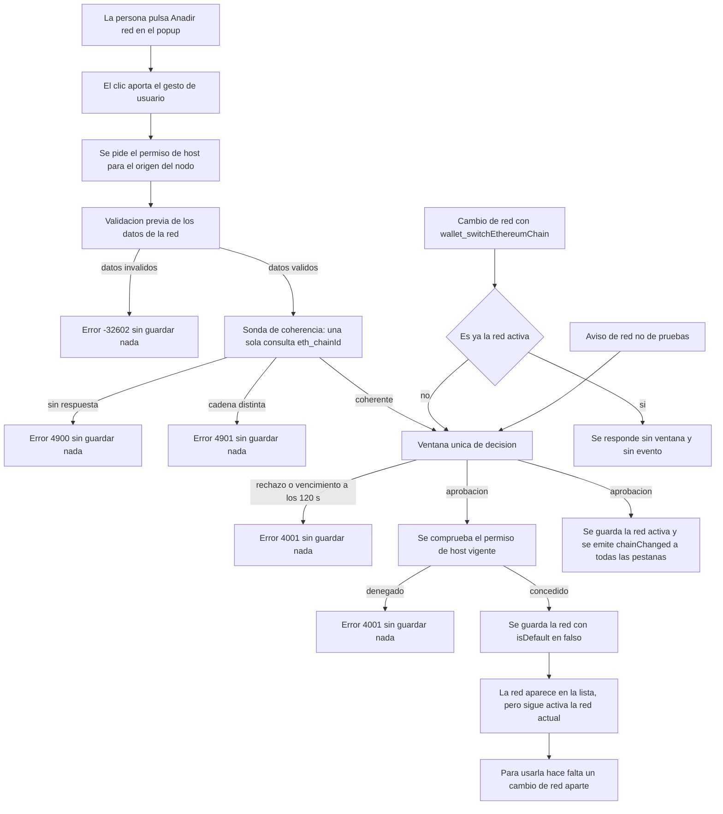

# 05 — Redes, sesiones y observabilidad

## Empezar en 5 minutos

### Qué necesitas

- TrueKeate Wallet compilada con `npm run build` y cargada en Chrome o Edge desde la carpeta `dist/` (Chrome 114 o superior).
- Un nodo local Anvil en `http://127.0.0.1:8545` con `chainId` 31337 (en hexadecimal, `0x7a69`).
- Opcional: la dApp de pruebas en `http://localhost:5174/test.html`, si vas a cambiar de red desde una página.
- El identificador de la extensión es `oiahebaliobknoeeonhgaacapjcpgblo`: lo verás en las direcciones internas `chrome-extension://…`.

### Qué vas a conseguir

- Saber qué redes trae la cartera de fábrica y qué datos guarda de cada una.
- Cambiar de red y dar de alta una red nueva, entendiendo cuándo hace falta una aprobación y cuándo un permiso del navegador.
- Comprender qué es una **sesión** de dApp, cuánto dura y cómo se revoca.
- Entender el registro de actividad: qué se guarda, qué se tacha antes de guardarlo y qué pasa cuando el almacén se llena.
- Saber dónde mirar cuando algo no funciona (insignia de red, «Sitios», «Actividad» y «Acerca de»).

### Los pasos mínimos

1. Arranca el nodo local:

   ```bash
   anvil --host 127.0.0.1 --port 8545 --chain-id 31337 --allow-origin "chrome-extension://oiahebaliobknoeeonhgaacapjcpgblo,http://localhost:5174,http://127.0.0.1:5174"
   ```

2. Comprueba que responde: `cast chain-id --rpc-url http://127.0.0.1:8545` debe devolver `31337`.
3. Abre el popup de la extensión (380 × 600 px). En la cabecera verás la insignia de red con el nombre **Anvil Local**.
4. Entra en la pestaña **Redes**. Verás la red sembrada, sus datos y el botón «Cambiar a esta red» (o «Es la red activa» si ya lo es).
5. Rellena el formulario de alta con los datos de una red nueva (por ejemplo, el Anvil secundario en `127.0.0.1:8546` y `chainId` 31338) y pulsa el botón de añadir. El navegador te pedirá **permiso de acceso** a esa dirección.
6. Acepta el permiso. La red aparecerá en la lista, pero **seguirás en la red actual**: el alta no cambia de red.
7. Cambia a la red nueva con «Cambiar a esta red» y confirma en la ventana de decisión. El cambio se propaga a todas las pestañas conectadas.
8. Entra en la pestaña **Sitios** para ver qué dApps tienen sesión, y en **Actividad** para ver el registro de lo ocurrido. Puedes exportar el registro a JSON con el botón de descarga.

## Catálogo de redes (M23)

El catálogo de redes vive en el Service Worker (el programa de fondo de la extensión, que se suspende cuando no se usa) y custodia la clave `truekeate_networks`. Su única red sembrada es Anvil local: **no hay Sepolia** ni ninguna otra.

### `truekeate_networks`: clave, forma y proyección

#### Campos reales de cada entrada

Cada red guarda **nueve** datos, uno de ellos opcional:

| Campo | Qué es |
|---|---|
| `chainId` | El identificador de la red en hexadecimal, con forma `0x` + dígitos. |
| `chainIdDecimal` | El mismo identificador en decimal, coherente con el anterior. |
| `name` | El nombre de la red (`chainName` de EIP-3085), de 64 caracteres como máximo. |
| `rpcUrl` | La dirección del nodo, ya analizada y normalizada. |
| `symbol` | El símbolo de la moneda nativa; por defecto `ETH`. |
| `decimals` | Los decimales de esa moneda; por defecto 18. |
| `isTestnet` | Marca de **red de pruebas**. |
| `isDefault` | Marca de red por defecto. Un alta nueva siempre la escribe en falso. |
| `explorerUrl` | **Opcional**: la dirección del explorador de bloques. Solo se escribe si existe. |

No hay más campos en el código.

#### Proyección defensiva al leer

Al leer, la cartera descarta cualquier entrada que no sea un objeto plano o cuyo identificador no sea canónico. Los huecos se rellenan con valores seguros: el decimal se deriva del hexadecimal, el nombre cae al identificador, la dirección a cadena vacía, el símbolo y los decimales a los valores por defecto, y las marcas solo son verdaderas si lo son estrictamente.

La lectura pública pasa por el módulo de almacén: nunca se escribe ni se lee una clave `truekeate_*` a mano.

#### Orden y resolución de la red activa

- La lista coloca la red por defecto primero y ordena el resto por su identificador decimal.
- La red activa es la del identificador guardado si está dada de alta; si no, la red por defecto.
- La dirección del nodo nunca se devuelve vacía: sin red utilizable se responde con la dirección por defecto.

### Siembra de Anvil

#### Constantes normativas

La red por defecto se construye con estos valores:

- Identificador: `0x7a69`, que en decimal es `31337`.
- Dirección del nodo: `http://127.0.0.1:8545`.
- Nombre: `Anvil Local`.
- Símbolo: `ETH`; decimales: 18.
- Marcada como red de pruebas: sí.

#### `seedDefaultNetwork`: idempotencia y cerrojo

La siembra inserta Anvil **solo si falta** y fija la red activa a Anvil **solo si** el identificador guardado no apunta a una red registrada. Escribe una única vez y solo si hay algo que escribir, y devuelve la red activa resultante.

La operación de leer-modificar-escribir va dentro de un **cerrojo** (un turno ordenado para que dos operaciones no se pisen). Aquí hubo un defecto medido: la siembra del arranque llegaba a pisar un alta que el usuario acababa de hacer. Está corregido.

### Validación de lo que llega de EIP-3085

EIP-3085 es el estándar con el que una dApp pide dar de alta una red nueva. Sus datos se validan antes de aceptar nada.

#### `chainId`: hexadecimal canónico o decimal coherente

El identificador se acepta de dos formas, las dos que autoriza el estándar:

- **Hexadecimal** canónica (`0x7a6a`), que **manda** sobre el decimal.
- **Decimal** (`"31338"` o `31338`), que se convierte a hexadecimal.

Si llegan las dos y no coinciden, la petición es incoherente y se rechaza con el motivo `mismatch`. Un decimal negativo o fuera del rango seguro se rechaza como `out-of-range`. Un hexadecimal malformado **no** se degrada a decimal. Los motivos posibles son `missing`, `malformed`, `out-of-range` y `mismatch`.

#### `rpcUrl`: esquema y host

La dirección del nodo pasa una validación previa obligatoria:

- Solo se admiten `http` y `https`. Los esquemas `ws:`, `file:` o `chrome-extension:` se rechazan como `unsupported-scheme`.
- El `http` **en claro** solo se admite para los anfitriones locales exentos: `127.0.0.1`, `localhost`, `[::1]` y `::1`.
- Se rechazan siempre los hosts privados y de enlace local, tanto con `http` como con `https`: `10/8`, `172.16/12`, `192.168/16`, `169.254/16`, además de `fe80::/10` y `fc00::/7`.

Nota de implementación: el rechazo de `127.0.0.1` como «privado» está **desactivado a propósito**, porque la lista de exentos se comprueba antes. Es lo que permite que el nodo local del proyecto (`http://127.0.0.1:8545`) sea aceptable.

#### Símbolo, decimales y `isTestnet`

- El símbolo es válido si es texto no vacío de 1 a 8 caracteres imprimibles, y se normaliza a mayúsculas. Si falta o llega vacío se usa `ETH`; si no es utilizable, el alta se rechaza.
- Los decimales son un entero entre 0 y 36, con 18 por defecto.
- La marca de red de pruebas da prioridad al catálogo guardado: una red ya dada de alta conserva su marca. Si no está, se consulta una tabla cerrada de redes principales conocidas (Ethereum, OP Mainnet, BNB, Gnosis, Polygon, Fantom, zkSync Era, Base, Arbitrum One y Avalanche). Por defecto devuelve «es de pruebas»: una red desconocida **no** dispara la advertencia de red real, porque el aviso exige certeza.

### Marca de red por defecto

#### `isDefault` y el alta (`P-22`)

Al proyectar una red nueva, la marca de red por defecto queda fijada en **falso**: **el alta nunca activa la red**. La escritura guarda la clave **completa** `truekeate_networks` (nunca subclaves) dentro del mismo cerrojo. Si la escritura falla por falta de cuota, la operación **aborta** para no dejar el estado a medias.

#### Qué hace que Anvil no desaparezca

Conviene ser preciso: en el código **no existe** ninguna función de borrado de redes ni una guarda explícita de «no borrar la red por defecto». Lo que sostiene la permanencia de Anvil es la combinación de dos hechos:

1. La siembra vuelve a ponerla en cada arranque del Service Worker si falta.
2. La búsqueda de la red por defecto cae a Anvil cuando el catálogo no la contiene.

Es decir: la marca de red por defecto es **reparable**, no inmutable. La afirmación «red por defecto no borrable» como guarda dura queda **pendiente de confirmar**, porque no consta en el módulo.

### Trazabilidad de pruebas

La suite de redes es la especificación de los tres módulos (catálogo, cambio y alta) y fija siete puntos, entre ellos la siembra de Anvil y la segunda red de pruebas —un Anvil secundario en `127.0.0.1:8546` con `isDefault: false`—.

## Cambio de red (M24)

### Contrato de `wallet_switchEthereumChain`

El contrato tiene **cuatro** casos y el despacho los implementa sin excepción. El resultado de éxito es siempre nulo.

#### Caso 1 — ya activa

Si la red pedida ya es la activa, se responde de inmediato sin crear ninguna solicitud, **sin** abrir la ventana de decisión y **sin** emitir el evento de cambio de red.

#### Caso 2 — registrada y distinta

Si la red está dada de alta pero no es la activa, se construye la vista previa del cambio, se resuelve la cuenta de la sesión y se entrega la solicitud al ciclo aprobable. **Al aprobar**, se guarda el identificador nuevo y se propaga el evento.

#### Caso 3 — no registrada

El código de error real es **`4901`**, no `4902`. Se devuelve cuando el identificador no se puede interpretar o cuando no está en el catálogo. El mensaje es «La red solicitada no está dada de alta.», con la acción «Darla de alta con `wallet_addEthereumChain`».

Aviso importante: la búsqueda de `4902` en todo el código **no devuelve ninguna coincidencia**. El `4902` que usan otras carteras no se usa aquí. El `4901` se usa además para el desajuste entre el identificador declarado y el del nodo.

#### Caso 4 — rechazo o vencimiento

Si la aprobación no llega, el despacho devuelve el error que cerró el ciclo —`4001`— y la red activa **no** cambia. Los dos motivos posibles son el rechazo explícito del usuario y el vencimiento del plazo, que es de 120 segundos.

### Decisión `P-19`/`DEC-29`

La regla es explícita: el cambio exige aprobación **siempre que la red de destino no sea la activa**, sin importar quién lo pida (la dApp o el popup). El único caso **sin** aprobación es el caso 1.

### Efecto del cambio: `activateChain`

#### Orden: persistir y después propagar

El cambio guarda **primero** el identificador de red y **después** emite el evento. El orden es deliberado: así, cuando la dApp reciba el evento, la consulta de la red ya devolverá el identificador nuevo. Si la escritura falla, se lanza un error interno.

#### Propagación `chainChanged`

El evento `chainChanged` publica el identificador **sin envoltorio**, como exige EIP-1193 (el estándar de comunicación entre dApps y carteras), y se emite a **todas** las pestañas. El número de pestañas alcanzadas se devuelve como dato del resultado del cambio.

### Superficie pública y pruebas

El cambio reutiliza la misma cola de solicitudes y la misma ventana única que el resto de operaciones aprobables. Existe además una lectura pura del identificador activo, con valor nulo si falta o está malformado. La cobertura de los cuatro casos está en la suite de redes.

## Alta de red (M25)

### Orden exacto del alta

El alta sigue **cinco pasos** en este orden:

1. Validación previa, sin ventana y sin permiso.
2. Coherencia de la red contra el nodo.
3. Aprobación explícita en la ventana única.
4. Permiso de acceso al servidor (host) en tiempo de ejecución, **siempre**.
5. Persistencia, con la marca de red por defecto en falso.

### Validación previa

#### Esquema y host del `rpcUrl`

La validación lee el catálogo y la red activa de **una sola instantánea**. Un problema en la dirección del nodo se traduce a un mensaje concreto y el motivo viaja en los datos, no en el mensaje. El resto de campos usan el error de definición de red con el campo y el problema detectados.

#### Símbolo y `isTestnet`

El símbolo ausente o vacío cae al valor por defecto `ETH`; el no utilizable rechaza el alta. La marca de red de pruebas se resuelve contra el catálogo y la tabla de redes reales, y la vista previa publica un aviso vacío cuando la red **es** de pruebas.

### Coherencia de red contra el nodo

Se emite **una sola** consulta del identificador de red contra la dirección declarada, con **un solo intento y sin reintentos**, porque es una comprobación de coherencia dentro de la propia solicitud y no una lectura de la red activa.

- Si el nodo no responde, se devuelve el error de RPC no disponible, `4900`.
- Si el identificador que responde el nodo es distinto del declarado, se rechaza con `4901` (`chainIdMismatch`).

### Aprobación propia del alta

El alta **tiene su propia aprobación**, distinta de la del cambio: se crea la solicitud con el método `wallet_addEthereumChain` y la vista previa de la red. Si el ciclo cierra sin aprobar, se devuelve el error que lo cerró (`4001`).

La forma de la solicitud se declara como un subconjunto estricto del tipo real de la cola, para que un cambio en la cola rompa la compilación en vez de divergir en silencio.

#### `ADD_CHAIN_ACTIVATION_NOTE`

El aviso de que el alta **no** activa la red es literal: «La red se añadirá a la lista, pero seguirás en la red actual: para usarla tendrás que cambiarla con una solicitud aparte.». El Service Worker lo inyecta en la vista previa, y el contrato lo declara como campo exclusivo del alta.

### Permiso de host en runtime

#### `chrome.permissions.request`

El permiso se pide para el patrón `origen/*` del nodo, que se declara entre los permisos opcionales de host. La política real es:

1. Si la API de permisos no existe, se devuelve «concedido»: no hay nada que conceder en el arnés de pruebas.
2. Si el patrón no se puede formar, se devuelve «denegado».
3. Si la concesión **ya está vigente**, se acepta **sin** llamar a la petición.
4. Si no lo está, se pide el permiso y se exige que la respuesta sea exactamente `true`.
5. Cualquier excepción se trata como denegación.

#### El gesto de usuario: `D-H5-A` y el clic del popup

Aquí está el defecto medido y corregido más importante de este módulo: `chrome.permissions.request` **exige un gesto de usuario en el contexto que llama** (un clic real, en lenguaje llano). Desde el Service Worker, Chrome lo rechaza siempre con «This function must be called during a user gesture», de modo que el alta terminaba **siempre** en `4001` y el requisito era inalcanzable.

La corrección tiene dos partes: aceptar la concesión ya vigente y, si no lo está, intentar la petición tratando la denegación como `4001` sin guardar nada.

El gesto lo aporta la superficie que **tiene** usuario: la vista de redes del popup. Esa vista repite la misma secuencia (comprobar y luego pedir) y su cabecera explica por qué vive ahí y no solo en el Service Worker. Para un alta nacida en una dApp, el gesto tendría que aportarlo la ventana de confirmación; hoy queda reportado como defecto `D-H5-B`, con modo de fallo observable: `4001` sin guardar nada.

Existe además una segunda implementación del permiso en el despacho aprobable, que considera la aprobación en la ventana única como gesto válido.

La denegación del permiso resuelve la llamada con el error de permiso de host denegado, cuyo literal es el `4001` de «permiso de host denegado al dar de alta una red».

### El alta NO activa la red

#### Qué se propaga y qué no

El último paso guarda la red y llama a la escritura del catálogo. Lo que **no** ocurre es igual de importante:

- **No** se escribe el identificador de red activa.
- **No** se emite el evento de cambio de red.
- **No** se encola ningún cambio de red.

La única escritura que cambia de red es la reservada al cambio de red (M24).

En el ciclo aprobable, el efecto del **cambio** sí guarda y propaga; la proyección del **alta** mantiene la marca de red por defecto en falso.

### `NON_TESTNET_WARNING` y quién lo muestra

El aviso literal es: «Atención: no es una red de pruebas. Las operaciones se firman contra una red real y pueden comprometer fondos reales.». El dato que lo dispara lo resuelve el catálogo (la marca de red de pruebas) y el Service Worker lo publica en la vista previa de la red.

Quién lo muestra, verificado:

- La ventana única de confirmación (`notification.html`), destinataria declarada del campo.
- La vista de redes del popup, que lo pinta en la fila de la red cuando la marca de pruebas es falsa, y como banda de aviso en el formulario de alta cuando se desmarca esa marca.
- La marca viaja además como atributo observable `data-testnet` por red.

El mismo texto se repite en «Acerca de» y en el aviso del primer arranque, con el objetivo de que digan exactamente lo mismo en todas las superficies.

### Pruebas

La suite de redes fija la lista completa con la marca de red por defecto en falso y el identificador intacto, y el permiso de host denegado como `4001` sin guardar nada. El contexto de popup usado en esa suite declara que el alta desde ahí pide el permiso igualmente.

## Sesiones por origen (M26 y M26.b)

### `truekeate_connected_sites`

#### Campos reales de `DappSession`

La clave se declara como `truekeate_connected_sites`. Cada sesión guarda **ocho** campos:

| Campo | Qué es |
|---|---|
| `origin` | El origen normalizado (minúsculas, sin barra final y con puerto). Es la clave. |
| `account` | La cuenta **autorizada** al conectar. |
| `chainId` | La red en el momento de la conexión. |
| `tabIds` | Dato interno de propagación; **no** se publica en la interfaz. |
| `connectedAt` | Cuándo se creó la conexión; se conserva al reconectar. |
| `lastUsedAt` | El último uso; es la base del tiempo de caducidad. |
| `expiresAt` | `lastUsedAt` más el tiempo de vida; nulo significa sin caducidad. |
| `connected` | En falso, la sesión queda descalificada. |

No existe ningún campo `accounts` en plural dentro de la sesión: la sesión recuerda **una** cuenta autorizada. La lista de cuentas del flujo de conexión vive en la solicitud, no en la sesión guardada.

La proyección defensiva descarta lo que no tenga cuenta de texto y normaliza cada campo. La lectura pasa por el almacén y toda mutación por un cerrojo propio. Aquí hubo un defecto medido y documentado: dos mutaciones solapadas podían perder una renovación o una revocación.

#### Vigencia y TTL de 24 h

El tiempo de vida es de **86 400 000 ms**, es decir, **24 horas renovables** desde el último uso. Una sesión es válida si existe, no está marcada como desconectada y no ha vencido. Un vencimiento nulo significa «sin caducidad» y la entrada vale.

### Renovación por uso y purga perezosa

La renovación ocurre en cada uso:

- Sin entrada, devuelve vacío sin tocar el almacén.
- Con entrada **vencida**, la **elimina** del mapa y devuelve vacío, sin emitir error: es un cambio de estado silencioso.
- Con entrada vigente, actualiza el último uso, recalcula el vencimiento, marca la sesión como conectada y añade la pestaña si era nueva.

La consulta pura **no** renueva: consultar no es usar. Y la función que devuelve la cuenta autorizada tampoco escribe.

### Creación de la sesión

La creación es **la única vía** por la que un origen consigue sesión: consultar las cuentas nunca la crea.

Al crearla se escriben la cuenta, la red, el alta, el último uso y el vencimiento (último uso más 24 horas). Si la sesión ya era vigente se conserva su fecha de alta, y se marca si es una conexión nueva.

La lectura que alimenta la interfaz devuelve el origen normalizado, la cuenta, la red, el alta, el último uso, la caducidad y si la sesión está vigente. Ordena por origen ascendente, **no purga** nada y **no publica** los identificadores de pestaña ni ningún secreto.

### Revocación por origen

#### Vista `SitesView`

La pestaña «Sitios» lista los orígenes conectados con su cuenta compartida, su último uso y su vigencia, y permite revocar por origen.

- La interfaz **no** lee el almacén: pide la lista al Service Worker y vuelve a leer el estado al montarse y después de cada revocación.
- La revocación se pide con `wallet_revokePermissions`; desde el popup, la confirmación es la propia interfaz y **no** se crea entrada en la cola de aprobaciones.
- La vigencia se lee como **texto**, nunca solo por color, y el origen completo viaja en el atributo de título de la fila.
- La confirmación explica que la dApp recibirá el evento `accountsChanged` con lista vacía y que su consulta de cuentas devolverá una lista vacía.

#### Efecto observable

Al revocar, la fila desaparece de inmediato, se relee el estado real y se publica el mensaje «Permiso revocado para …: la dApp recibe `accountsChanged` con `[]` y su `eth_accounts` pasa a `[]`».

En el Service Worker, la revocación **elimina** el origen del mapa, devuelve las pestañas asociadas para que se emita el evento con lista vacía, es **idempotente** (revocar dos veces no falla) y **no** crea ninguna entrada en la cola. Además se descartan las solicitudes de conexión vivas de ese origen, de modo que una elección tardía en `connect.html` ya no puede conceder sesión.

### Flujo de `eth_requestAccounts`

#### Ventana `connect.html` (M48/M49)

Es la ventana de conexión, de **420 × 650**. Muestra el origen que solicita la conexión, todas las cuentas con su saldo real y su selector, con la cuenta activa preseleccionada. Se navega por teclado: flechas, `Enter` para conectar y `Esc` para rechazar.

La ventana recibe del Service Worker el identificador de la solicitud en la URL y con él pide la solicitud **completa**; nunca lee el almacén de la extensión. Si falta el identificador o la solicitud ya no existe, la ventana **declara el hueco** y deja «Conectar» deshabilitado en vez de inventar la lista. Las filas de cuenta declaran su radio accesible, un área táctil de al menos 44 px, la dirección truncada y el saldo real.

Del lado del Service Worker, la solicitud se guarda **antes** de abrir la ventana, con un vencimiento de `ahora + 60 000 ms` (60 segundos), y la ventana se abre con la URL `connect.html?requestId=…&origin=…`. La verdad vive en el almacén, no en memoria, porque el Service Worker puede suspenderse con la ventana abierta.

#### `CONNECT_RESPONSE`

La ventana responde declarando el identificador de la solicitud, si tuvo éxito, la cuenta y el índice de la cuenta. Al cancelar envía el mismo mensaje con éxito falso y el error `4001` «Operación cancelada por el usuario.».

El índice es la posición de la cuenta elegida en la lista **ofrecida** por el Service Worker, y el Service Worker conserva su respaldo buscando la cuenta en esa lista.

Al aplicar la respuesta, todo se resuelve bajo el mismo cerrojo:

- Solicitud desconocida o ya purgada → `4001` sin crear sesión.
- Solicitud ya resuelta o vencida → `4001` con el motivo correspondiente.
- Éxito distinto de verdadero → `4001` de cancelación.
- Cuenta **fuera** de la lista ofrecida → `4100` (`connect-unknown-account`), sin sesión.
- Cuenta válida → se crea la sesión y se responde con éxito, cuenta e índice.

La función que cierra el ciclo es **el único punto** que resuelve la promesa y descarta el registro, porque borrar la entrada sin resolver dejaría colgada la promesa de `eth_requestAccounts`. Hay además una red de seguridad de proceso que resuelve con `4001`.

#### Máximo 1 `pending` por origen y purga

Solo se admite **una** solicitud de conexión pendiente por origen. Se comprueba y se escribe dentro del mismo tramo crítico, de modo que una segunda alta simultánea responde `4001` sin abrir una segunda ventana.

La purga es perezosa y con **doble motivo**: vencimiento y resolución. Aquí hubo un defecto medido: el mapa nunca se limpiaba y bloqueaba el origen hasta su vencimiento. Está corregido.

### Propagación del cambio de cuenta activa

Al cambiar de cuenta activa, la cartera actualiza la cuenta de cada sesión **vigente** cuyo titular no sea ya la cuenta nueva, y devuelve los orígenes afectados y la unión de pestañas. **No** toca el último uso ni el vencimiento, porque cambiar de cuenta no es un uso de la dApp.

Regla dura: nunca se usa «todas las pestañas» con una cuenta dentro, porque publicaría la dirección a orígenes sin sesión.

### Pruebas

- La suite de sesiones cubre el vencimiento renovable (`último uso + 86 400 000`) y la revocación sin crear nada en la cola, con reloj inyectado.
- La suite de conexiones cubre los dos defectos medidos del registro de solicitudes de conexión: la escritura sin cerrojo y la ausencia de purga.

## Polling de saldos (M47)

«Polling» es preguntar al nodo cada cierto tiempo para refrescar un dato en pantalla.

### Intervalo, tope y método

- Intervalo: **5 000 ms** (5 segundos), tanto en el popup como en `connect.html`.
- Tope: **10 cuentas** por ciclo.
- Método real: **`eth_getBalance`**, emitido con la dirección y la etiqueta `latest`.
- Presupuesto por intento: **5 000 ms**, el mismo plazo por intento de la política general del cliente RPC.

La función que recorta la lista visible al tope es la forma verificable de la regla: su longitud es el número exacto de consultas de saldo que se emiten en cada ciclo.

### Arranque, parada y suspensión

#### Parada

El ciclo arranca con el componente de la vista y se detiene cuando la vista que muestra los saldos está cerrada; en ese caso el estado vuelve a inactivo y **no** se reprograma nada. Al desmontarse, se cancela y se limpia el temporizador pendiente. Un cambio de cuenta activa **reinicia** el ciclo.

En el popup, el ciclo solo está activo con la pestaña «Cuentas» abierta y la fase lista; en `connect.html`, cuando la ventana está lista.

#### Suspensión sin perder datos

Si una lectura falla, el ciclo guarda el error, pasa a **suspendido** y **no** se reprograma, conservando los saldos ya leídos. El estado se etiqueta «Desconectado: sin respuesta del nodo local», y el agotamiento del plazo de 5 segundos se clasifica como `4900`. El botón de refresco reanuda el ciclo a mano tras la suspensión.

### Contadores observables

- `cycleCount`: ciclos completados con éxito.
- `requestCount`: consultas de saldo emitidas.
- `skippedCycles`: ciclos descartados por solapamiento, que debe ser **siempre 0**.

El contador de consultas se incrementa **antes** de cada lectura, dentro del bucle en serie; el guardia contra dos ciclos solapados es defensa en profundidad. El siguiente ciclo se programa **cuando el anterior ha terminado**.

En el popup, los contadores se publican como atributos del panel (`data-polling-requests` y `data-polling-cycles`) para poder comprobarlos sin instrumentar el canal.

### Verificación

La suite de polling mide el contador sobre una instancia **real** del componente, interceptando el canal de mensajes y con temporizadores simulados. Importa la superficie verificable del propio componente: el método, el intervalo, el tope, la etiqueta de estado y la función que recorta la lista.

## Registro de actividad (M30 / M31 / M32)

Hay tres módulos con responsabilidades separadas: el **catálogo cerrado** de eventos, la **retención FIFO** (la entrada más antigua sale cuando la lista se llena) y la **escritura** con política de cuota.

### `truekeate_logs`: la clave y la entrada

La clave `truekeate_logs` **sobrevive** al reseteo de la cartera: forma parte de las claves que se preservan. La única vía por la que el popup la lee es el método interno `wallet_getLogs`; el popup **solo lee**.

#### Forma de `LogEntry`

Cada entrada declara **nueve** campos, dos de ellos opcionales: `id` (identificador único), `ts` (instante), `level` (nivel), `category` (categoría), `event` (evento), `message` (mensaje), `origin` (origen; `extension` para los contextos de la extensión), `method` (método, cadena vacía si no aplica), `data` (**payload redactado**, nunca íntegro) y los opcionales `txHash` y `txStatus`.

La construcción garantiza **una entrada por evento**, y la variante por lotes escribe varias entradas con **una** lectura y **una** escritura.

### Catálogo cerrado de eventos

#### Las 5 categorías y los 4 niveles

- Categorías, en orden canónico: `call` (llamada), `event` (evento), `tx` (transacción), `sign` (firma) y `system` (sistema).
- Niveles, en severidad creciente: `info`, `success`, `warn` y `error`.

El módulo comprueba en compilación que ambas listas son exactamente las del tipo compartido. `event` y `category` son campos **independientes**: los nombres de categoría no son valores válidos de evento.

#### Los 24 eventos, por categoría y nivel

- **Categoría `call` (2)**: `rpc_call` (`info`) y `rpc_error` (`warn`).
- **Categoría `event` (8)**: `event_emit` (`info`), `approval_created` (`info`), `approval_resolved` (`info`), `approval_expired` (`warn`), `chain_changed` (`success`), `accounts_changed` (`info`), `network_added` (`success`) y `permission_revoked` (`info`).
- **Categoría `tx` (4)**: `tx_sent` (`info`), `tx_confirmed` (`success`), `tx_failed` (`error`) y `tx_reverted` (`error`).
- **Categoría `sign` (3)**: `sign_personal` (`success`), `sign_typed_data` (`success`) y `account_imported` (`success`).
- **Categoría `system` (7)**: `wallet_created` (`success`), `wallet_imported` (`success`), `account_removed` (`warn`), `reset_wallet` (`warn`), `sw_started` (`info`), `sw_reconcile` (`info`) y `storage_quota_exceeded` (`error`).

El cómputo cerrado es 2 + 8 + 4 + 3 + 7 = **24** eventos distintos.

#### Eventos con variantes

Tres eventos admiten variantes, que son la vía por la que el mismo nombre ocurre en otro contexto sin inventar eventos nuevos:

- `rpc_error` admite la variante de sistema con nivel de aviso («traza de plataforma: marca en vuelo liberada, difusión interrumpida o reconciliación») y la de cuota con nivel de error. Una clave de situación vacía clasifica como sistema y error.
- `approval_resolved` admite nivel de aviso cuando la resolución **no** es una aprobación: rechazo, vencimiento o cierre de la ventana única.
- `sw_reconcile` admite nivel de aviso cuando la reconciliación encuentra huérfanas, marcas vencidas o difusiones sin recibo.

La función que decide la colocación garantiza que ninguna entrada escrita pueda llevar una categoría o un nivel inventados: el resultado es siempre una pareja declarada.

#### Eventos del catálogo sin emisión verificada

Barrido de emisiones reales en producción:

- **Emiten de forma verificable**: `sw_started`, `event_emit`, `tx_sent`, `rpc_call`, `rpc_error`, `tx_confirmed`, `tx_failed`, `approval_expired`, `sw_reconcile` y `storage_quota_exceeded`.
- **Declarados pero sin punto de emisión conocido**: `network_added` y `permission_revoked`. Su emisión queda **pendiente de confirmar**.
- El puente que traduce eventos del provider a eventos del registro está cubierto por pruebas, pero **no** tiene consumidor en producción. Es decir, la instrumentación del evento de propagación del provider queda **pendiente de confirmar**.

### Retención FIFO

Los dos límites normativos son **500 entradas globales** y **200 por origen**. Si el ajuste llega corrupto, se cae a esos valores, para que un ajuste inválido **nunca** deje la retención sin límite.

El plan de retención ordena por instante ascendente con orden estable, descarta las más antiguas por el límite **global** y después aplica el límite **por origen** sobre lo que sobrevivió. Es una función **pura**: no modifica la lista ni escribe nada. Una entrada sin instante numérico se considera la más antigua, y una entrada sin origen cuenta como `extension`.

### Redacción antes de escribir

La redacción es obligatoria y la aplica el módulo de seguridad, consumido **solo** por el Service Worker. Reglas verificadas:

- Nunca se guarda la frase de recuperación, una clave privada ni una firma completa.
- El **calldata** se trunca a sus **primeros 10 bytes** más la longitud total; no hay ninguna variante de 4 bytes.
- `personal_sign` guarda la dirección y el **hash** del mensaje, nunca el texto.
- `eth_signTypedData_v4` guarda el tipo principal, el nombre y la red del dominio, la dirección del contrato verificador y el hash del mensaje.
- Por encima de 4096 bytes solo se guardan el hash y la longitud.

La lista de claves sensibles se reconoce por **contención**, no por igualdad exacta: con la comparación exacta anterior, claves como `privKey` o `accountPrivateKey` se guardaban íntegras. Ese defecto está corregido. Las firmas se recortan a la forma `0x1234…abcd` y los valores sensibles se sustituyen por su hash con el prefijo `sha256:`.

#### Calldata y payloads

La escritura aplica además un saneado de **última instancia**, aunque quien llama ya haya redactado (defensa en profundidad). El patrón reconoce `data`, `input`, `calldata`, `txdata`, `inputdata`, `rawdata`, `hexdata`, `bytedata`, `calldatahex` y `transactiondata`, y se aplica a **cualquier** entrada y a cualquier profundidad de hasta 6 niveles. El truncado es idempotente y respeta una longitud ya declarada. Un `data` textual de más de 4096 caracteres se sustituye por su hash, su tamaño y la marca de truncado.

### Comportamiento ante cuota agotada

El almacén de la extensión tiene **10 MB** y no se pide el permiso de almacenamiento ilimitado. La política ante cuota agotada está documentada y tiene dos pasos:

1. Se escribe el lote **una sola vez** y se clasifica el fallo como correcto, cuota, error o no disponible.
2. Si el fallo es por **cuota**, se cuenta el reintento y se reintenta **una** vez con la lista ya retenida; nunca hay un bucle de escritura. Si el segundo intento vuelve a fallar por cuota, se cuenta el descarte y se avisa por consola con «storage quota exceeded».

Si el descarte es real, no se devuelven las entradas nuevas y se encadena el diagnóstico de cuota: una entrada `storage_quota_exceeded` de categoría sistema y nivel error, con el mensaje «No se pudo guardar el registro por falta de espacio» y datos que transportan el código `-32603`, la clave afectada, los bytes en uso, si hubo reintento, el evento y el contador de descartes.

#### Contador `dropped` y persistencia diagnóstica

El diagnóstico en memoria lleva tres contadores: descartes, reintentos e intentos. Los intentos cuentan **solo** los intentos de la traza —uno, o dos con reintento— y las escrituras del contador no entran en la cuenta.

El contador de descartes se guarda en la clave `truekeate_logs_dropped` **solo cuando cambia**, con `-1` como marca de «aún no persistido». El defecto medido que motivó esa condición: toda traza costaba dos operaciones de almacén y llevaba la reconstrucción del Service Worker a unos 2 segundos. Al arrancar se reconstruye, de modo que el descarte sigue siendo visible tras una suspensión.

La lectura que alimenta el panel publica las entradas retenidas, si el registro está recortado y cuántas se descartaron. La regla de oro es explícita: **nunca un fallo silencioso**.

### La interfaz «Actividad»

Es la pestaña «Actividad»: un panel de registros con los 24 eventos del catálogo, los errores en **rojo** con su código numérico, las operaciones con su hash o firma y la **exportación JSON** del histórico.

- Su contrato es `wallet_getLogs`, con entradas, marca de recorte y descartes.
- Su única escritura es la descarga del fichero, que se genera en memoria y **no** sale del equipo.
- Las etiquetas en español de nivel y categoría están transcritas en la vista, porque la interfaz **no** importa módulos del Service Worker.
- El nivel y la categoría se leen como texto, nunca solo por color; cada entrada expone atributos observables de nivel, categoría, evento y origen, y el código del error se publica como texto.
- El hash de transacción o la firma se buscan primero en el campo de primer nivel y después en los datos ya redactados.

#### Filtro

Hay dos selectores, «Nivel» y «Categoría», con los valores «sin filtrar» `todos` y `todas`. El resultado exige coincidencia en ambos ejes y alimenta tanto la lista como la exportación.

El panel resume el registro con el número de errores visibles en una insignia y con el contador de cuota como aviso no descartable: «Entradas retenidas: N · descartadas por falta de espacio: N», más el aviso de que el registro está recortado y conviene exportar.

#### Exportación JSON

La función que compone el fichero es pura y añade la fecha de exportación, las entradas **filtradas** en pantalla, el total, los descartes, la marca de recorte y los filtros aplicados, para que el fichero sea interpretable sin la pantalla. El nombre es `truekeate-logs-<fecha>.json`.

La descarga serializa con sangrado, crea el objeto de tipo `application/json`, revoca la dirección de objeto anterior, pulsa un enlace de descarga con `rel="noopener"` y deja el enlace en pantalla para volver a descargarlo. La dirección de objeto se revoca también al desmontar, de modo que nunca queda un objeto vivo.

## Métricas y diagnóstico

### `wallet_getState`

Es un método interno de la lista cerrada y su resultado reúne, sin duplicar lógica: la cartera y las cuentas (con sus marcas de visible y actual), la integridad y la presencia de la frase, las redes dadas de alta con la red activa, y los sitios conectados.

Los campos reales que publica son: si hay cartera, la integridad (estado, etiqueta, problemas, si la frase está presente y es válida, y si se pueden derivar cuentas), las cuentas, la referencia de la cuenta actual, las redes, el identificador de red activo, los ajustes y los sitios conectados.

En la interfaz, el popup lo consume con una función que aplana la respuesta y deriva las marcas de cartera dañada y su motivo. La interfaz del popup **no** toca el almacén: el Service Worker es el único custodio. El canal único es una llamada interna sobre el sobre `TRUEKEATE_RPC`.

### `wallet_getLogs`

Está declarado en la lista de métodos internos y en el mapa de resultados. Su manejador delega en la lectura del registro para **no** reimplementar ni la retención ni el contador, y publica exactamente tres campos: las entradas, la marca de recorte y los descartes. En el panel, los descartes son el aviso visible de que hubo pérdida por cuota.

### `wallet_getNetworks`

Está declarado en la lista de métodos internos y en el mapa de resultados. Devuelve las redes y la red activa leídas de **una sola instantánea** del almacén, con la misma normalización defensiva que el catálogo.

### Dónde se muestran

#### Popup (M39)

El popup mide **380 × 600**. Publica los contadores del polling como atributos del panel de la pestaña activa, y las tres pestañas relevantes para este manual son «Sitios», «Redes» y «Actividad».

El encabezado muestra la insignia de red «Anvil Local» y el botón «Acerca de» está siempre presente, también en el estado vacío. Los estados de carga, error, el aviso no descartable del primer arranque y «Wallet dañada» forman parte del diagnóstico visible.

#### «Acerca de» (M39/M50)

Es la pantalla compartida por el popup y la ventana única de confirmación. Muestra el logotipo, el lema de marca, el aviso de entorno (como texto normal, no como alerta, para no anunciarlo como incidencia), las licencias de los activos empaquetados y la versión. Los literales vienen todos del módulo de textos en español.

### Qué publica el arranque: `bytesInUse` y `bootMs`

La entrada `sw_started` (una sola por arranque) transporta en sus datos las métricas de diagnóstico:

| Dato | De dónde sale |
|---|---|
| `bytesInUse` | Los bytes usados del almacén local; nulo si la consulta falla. |
| `bootMs` | El tiempo de arranque en milisegundos. |
| `schemaVersion` | La versión del esquema de datos. |
| `migrations` | La instantánea de migraciones. |
| `integrity` | Solo el estado y su etiqueta, para no publicar material de la cartera. |
| `autoLoaded` | El resumen del arranque: cuentas, red, redes, importadas, etiquetas y sesiones. |
| `pendingProcessed` | Las entradas procesadas por la reconciliación. |

El resumen del arranque tiene una forma completa en memoria y se expone con su propia función. El campo de versión de esquema vive dentro de los ajustes, no como clave propia.

### Campos no verificados

El campo `integrations` **no existe** en este repositorio: la búsqueda de `integrations` o `integration` en todo el código fuente no devuelve ninguna coincidencia, así que no debe documentarse como si existiera. En cambio, `bootMs`, `schemaVersion` y `dropped` sí están confirmados, y `bytesInUse` aparece con ese nombre exacto tanto en el arranque como en la entrada de cuota. Cualquier otro contador de diagnóstico queda **pendiente de confirmar**.

## i18n y textos

«i18n» es la abreviatura de internacionalización: todo lo relativo a los textos de la interfaz.

### Alcance real: fuente única del literal

El módulo de textos centraliza los textos de interfaz en **español** y los comparten las cuatro superficies del producto: el popup, `connect.html`, `notification.html` y la dApp de pruebas.

Hay que subrayar el alcance: **NO es un motor de internacionalización** con catálogos por idioma, porque el producto se entrega en español y un segundo idioma no forma parte del alcance. Es la **fuente única del literal**, no un sistema de traducción. Un componente puede conservar sus cadenas locales cuando solo las usa él —por ejemplo, «Aprobar» y «Rechazar»— y lo que se garantiza es que **no haya dos literales distintos para el mismo texto** ni ninguna superficie sin cubrir.

El módulo es **hoja**: no importa la librería de criptografía, no habla con el Service Worker y no toca el almacén.

### Contenido del módulo

- Identidad de marca: nombre de marca, nombre de producto, lema con barras y versión.
- «Acerca de»: título, botón, resumen y el aviso de entorno que repite el del primer arranque; licencias empaquetadas de las tres tipografías (Poppins, Inter y JetBrains Mono, con licencia OFL-1.1) y las notas de auditoría, que declaran que no hay dependencia remota en tiempo de ejecución.
- Aviso «antes de la primera firma»: título, cuerpo, advertencia de entorno, etiqueta y el identificador de la casilla de acuse.
- El oráculo observable de ese aviso: los eventos de firma, los métodos que firman y la función que decide si ya se firmó antes. Se apoya en dos señales del registro —eventos de firma directa y resoluciones aprobadas con un método que firma— porque en este repositorio la firma de `personal_sign` se resuelve por el ciclo de aprobaciones y puede no dejar su evento propio. Como el registro sobrevive al reseteo, el aviso no se repite tras reiniciar.
- Formato de datos: el importe de ejemplo (con 4 decimales y coma española) y la dirección de ejemplo.

### Verificación de `CA-RT-10`

La regla de «cero texto visible en inglés» la comprueba una prueba sobre el árbol de sintaxis de TypeScript, y los avisos del módulo quedan dentro de su ámbito porque los consumen los tres directorios de interfaz. Esa comprobación es también la razón por la que el popup usa identificadores de pestaña con separador (`send-tab`, `networks-tab`, `activity-tab`) en vez de la palabra inglesa suelta.

### Divergencia real de identificador de módulo

La cabecera del fichero de textos se autodenomina **M66**, pero el corpus del repositorio asigna **M66** a otro módulo: la tabla local y cerrada de selectores de calldata también se autodenomina M66 en su primera línea. Es una **colisión de identificador** entre los dos ficheros, verificable en ambos encabezados. Resolverla exige decidir cuál conserva la etiqueta, decisión que **no** corresponde a este manual y que queda marcada como incidencia de documentación.

## Diagrama de flujo: alta de una red nueva

### Flujo (Mermaid)

<!-- GENERAR_IMAGEN: flujo-redes.svg -->



### Lectura del diagrama

- El orden de la secuencia es el de las cinco etapas del alta: validación previa, coherencia contra el nodo, aprobación, permiso de host y persistencia.
- El gesto de usuario que exige la petición de permisos lo aporta el clic del popup **antes** de invocar el método, y el Service Worker vuelve a verificar la concesión antes de guardar.
- Las consultas al nodo son de un solo intento: no hay reintentos en la sonda de coherencia.
- El **cambio** de red es lo único que modifica la red activa y emite el evento de cambio; el **alta** solo añade a la lista.
- El aviso de red no de pruebas viaja con la solicitud y lo muestran la ventana de decisión y la vista de redes.
- El permiso de host tiene un caso pendiente: un alta nacida en una dApp depende de que la ventana de confirmación aporte el gesto (defecto `D-H5-B`).

### Puntos de fallo observables

| Punto | Código | Efecto sobre el almacén |
|---|---|---|
| Dirección del nodo con esquema o host no admitidos | Mensaje de dirección no válida, con el motivo en los datos | No se guarda nada |
| Red desconocida al **cambiar** (no al dar de alta) | `4901` | No se guarda nada y no hay ventana |
| Nodo sin respuesta en la sonda | `4900` | No se guarda nada |
| Identificador del nodo distinto del declarado | `4901` | No se guarda nada |
| Aprobación rechazada o vencida (120 s) | `4001` | No se guarda nada |
| Permiso de host denegado | `4001` | No se guarda nada |
| Cuota de almacén agotada al escribir el catálogo | `-32603` | La operación se aborta sin dejar el estado a medias |

En todos los casos de fallo, el alta **no** lanza una excepción: devuelve un resultado con el error EIP-1193 del catálogo, y la red activa permanece intacta.

### Nota final de verificación

Todos los datos de este documento se comprobaron leyendo el fichero citado en el manual técnico. Las cifras de líneas por módulo que aparecían en documentación previa se sustituyen por las medidas reales del árbol actual: `catalog.ts` 580, `switch.ts` 278, `addChain.ts` 518, `sessions.ts` 452, `connections.ts` 735, `SitesView.tsx` 312, `useBalancePolling.ts` 279, `events.ts` 403, `logger.ts` 759, `retention.ts` 148, `redaction.ts` 329, `LogsView.tsx` 437, `i18n.ts` 211, `popup/App.tsx` 432 y `AboutDialog.tsx` 112.

## Problemas frecuentes

### Doy de alta una red desde una dApp y siempre termina en `4001` sin guardarse

**Causa.** El permiso de acceso al servidor (host) exige un gesto de usuario en el contexto que llama. El Service Worker no tiene ese gesto, así que el navegador rechaza la petición y el alta termina en `4001`.

**Solución.** Da de alta la red desde la vista **Redes** del popup: allí el clic del botón aporta el gesto que el navegador exige. El comportamiento de un alta pedida por una dApp queda **pendiente de confirmar** mientras no se resuelva el defecto `D-H5-B`.

### Añado una red nueva y la cartera sigue en la red de antes

**Causa.** Es el comportamiento por diseño: el alta **no activa** la red. La propia interfaz lo avisa: «La red se añadirá a la lista, pero seguirás en la red actual: para usarla tendrás que cambiarla con una solicitud aparte.».

**Solución.** Pulsa «Cambiar a esta red» y confirma en la ventana de decisión.

### Al cambiar de red aparece `4901`

**Causa.** La red pedida no está dada de alta (o el identificador no se puede interpretar). El código real es `4901`, no el `4902` que usan otras carteras.

**Solución.** Da de alta esa red primero con `wallet_addEthereumChain` desde la pestaña **Redes** del popup y después cámbiala.

### Al cambiar de red no cambia nada y no aparece ninguna ventana

**Causa.** Estás pidiendo la red que ya está activa. Ese es el único caso que no exige aprobación: se responde al momento, sin abrir la ventana y sin emitir el evento de cambio.

**Solución.** No hay nada que arreglar. Si lo que quieres es comprobar que el cambio funciona, elige otra red distinta de la activa.

### Una operación se queda a medias y se pierde una renovación o una revocación de sesión

**Causa.** Dos operaciones de lectura-modificación-escritura sobre la misma clave pueden solaparse y una pisa a la otra. Es un defecto medido en la gestión de sesiones.

**Solución.** Actualiza la extensión. Las mutaciones de sesión y de conexión pasan por un cerrojo que las ordena, y la escritura del catálogo de redes va dentro de su propio cerrojo.

### El popup dice «Desconectado: sin respuesta del nodo local» y los saldos se congelan

**Causa.** Una lectura de saldo ha fallado (por ejemplo, porque el nodo no está arrancado). El ciclo se suspende a propósito y **conserva** los últimos saldos leídos en lugar de vaciarlos. El error asociado es `4900`.

**Solución.** Arranca Anvil en `127.0.0.1:8545` y comprueba con `cast chain-id --rpc-url http://127.0.0.1:8545` que devuelve `31337`. Después usa el botón de refresco para reanudar el ciclo.

### El registro de actividad pierde entradas o avisa de entradas descartadas

**Causa.** Dos motivos posibles. Uno, la **retención**: se conservan 500 entradas globales y 200 por origen, y las más antiguas salen. Dos, la **cuota**: el almacén tiene 10 MB y no se pide espacio ilimitado, así que una escritura puede fallar y la entrada se descarta.

**Solución.** Exporta el registro a JSON con el botón de descarga (el fichero se genera en tu equipo y no sale de él) y después límpialo. El panel muestra siempre el contador de descartes; nunca hay fallo silencioso.

### Una dApp revocada sigue teniendo sesión

**Causa.** Puede quedar una solicitud de conexión viva del mismo origen que conceda la sesión tarde. Ese caso está contemplado: al revocar se descartan las solicitudes de conexión pendientes de ese origen.

**Solución.** Vuelve a entrar en **Sitios**, revoca el origen y comprueba que la lista se ha releído del Service Worker (la fila desaparece y el mensaje confirma que la dApp recibe `accountsChanged` con lista vacía).
