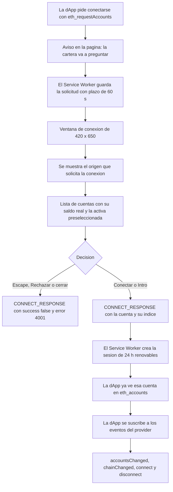
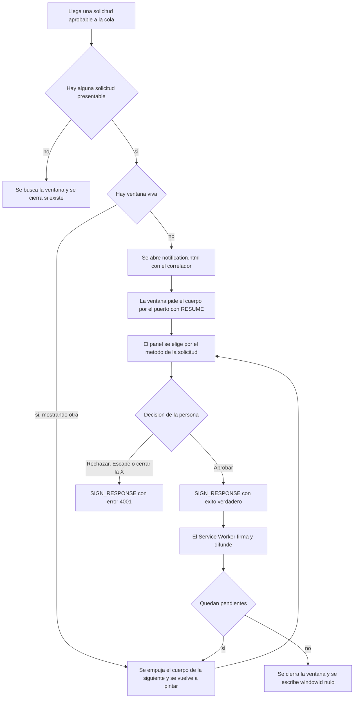

# 06 — Interfaz: popup, conexión y notificación

## Empezar en 5 minutos

### Qué necesitas

- TrueKeate Wallet compilada con `npm run build` y cargada en Chrome o Edge desde la carpeta `dist/` (Chrome 114 o superior).
- Un nodo local Anvil en `http://127.0.0.1:8545` con `chainId` 31337, si vas a ver saldos y a enviar transacciones.
- Ganas de probar las tres pantallas: el popup, la ventana de conexión y la ventana de decisión.
- Recuerda: el identificador estable de la extensión es `oiahebaliobknoeeonhgaacapjcpgblo`.

### Qué vas a conseguir

- Conocer las **tres superficies** de la cartera y para qué sirve cada una:
  - el **popup** (`index.html`, 380 × 600 px), que es el panel de la cartera;
  - la **ventana de conexión** (`connect.html`, 420 × 650 px), que aparece cuando una dApp pide conectarse;
  - la **ventana de decisión** (`notification.html`, 420 × 640 px), que aparece cuando una dApp pide firmar o enviar. Solo hay **una** a la vez.
- Saber qué hace cada pestaña del popup y cada botón.
- Entender por qué ninguna de las tres pantallas toca directamente los datos guardados (y por qué eso te protege).
- Saber interpretar los mensajes de error: todos llevan código, explicación y acción sugerida.

### Los pasos mínimos

1. Carga `dist/` en `chrome://extensions` y fija la extensión en la barra del navegador.
2. Pulsa el icono: se abre el popup. Verás las siete pestañas: **Cuentas**, **Recibir**, **Enviar**, **Sitios**, **Seguridad**, **Redes** y **Actividad**.
3. La primera vez aparece un aviso de entorno **no descartable**: solo se cierra pulsando «He entendido, continuar». Es deliberado.
4. En **Cuentas**, crea una cartera nueva o importa una frase de recuperación. La frase de la red de pruebas de Anvil, que es solo una pista de desarrollo y nunca se guarda como cartera tuya, es:
   `test test test test test test test test test test test junk`
5. En **Recibir**, copia tu dirección o enseña el código QR. La dirección que se muestra, la que se copia y la del QR son **la misma cadena**.
6. Levanta la dApp de pruebas con `npm run dev` y abre `http://localhost:5174/test.html`. Pulsa «Conectar (eth_requestAccounts)»: aparecerá la **ventana de conexión**. Elige una cuenta y confirma.
7. Vuelve al popup, entra en **Sitios** y verás esa dApp con su cuenta, su último uso y su vigencia (24 horas renovables).
8. Desde la dApp, pulsa «Enviar transacción». Aparecerá la **ventana de decisión** con el resumen, los avisos de riesgo y un plazo de 120 segundos. Aprueba o rechaza; cerrar con la X equivale a rechazar.

## Regla de oro: la UI no toca el almacén (RNF-14)

Ninguna de las tres pantallas lee ni escribe directamente el almacén de la extensión. Todo pasa por mensajes al **Service Worker** (el programa de fondo, que se suspende cuando no se usa). Eso garantiza que la criptografía y los secretos viven en un solo sitio.

### El canal único de mensajería

#### `src/popup/runtimeChannel.ts` — una sola referencia al API real

El popup no habla con el Service Worker por ningún camino propio: hay **un único** punto del popup que nombra el API real del navegador (`chrome.runtime.sendMessage`).

- Si `chrome` no existe, o el canal no está disponible, devuelve vacío en lugar de fallar.
- La cabecera del módulo deja constancia de un defecto histórico ya cerrado: en versiones anteriores se intentaba usar `chrome.runtime.postMessage`, que **no existe** en Manifest V3, y se construía el nombre del API a trozos para esquivar una comprobación de textos. Hoy eso está resuelto.

#### `src/popup/walletRpc.ts` — el sobre `TRUEKEATE_RPC`

Toda petición viaja en un sobre con esta forma: tipo `TRUEKEATE_RPC`, el método, los parámetros, el origen fijado a `extension`, y pestaña y marco nulos (porque la petición nace dentro de la extensión).

El resultado de una llamada **nunca lanza una excepción**: es un objeto que dice si fue bien (con el resultado) o mal (con el error).

- Si no hay canal, devuelve el error de transporte «No hay canal con el Service Worker.».
- Si la respuesta trae un error EIP-1193 bien formado, se convierte al formato de la interfaz.
- Si el transporte falla (el Service Worker está suspendido o ausente), se clasifica como error interno con motivo `transport`.

### Invocación de un método interno `wallet_*`

#### `callInternal` frente a `callWalletMethod`

- `callWalletMethod` acepta cualquier método de la lista cerrada: lecturas de página, métodos que piden aprobación y métodos internos.
- `callInternal` es el atajo restringido a los métodos internos `wallet_*`.

Un comentario del código dice «los 15 internos», y esa cifra está **desactualizada**: el tipo compartido declara **16** métodos internos, el último de ellos `wallet_getConnectRequest`. Un método fuera de la lista responde `4200`.

#### `src/popup/walletState.ts` — estado y operaciones, siempre por método interno

Es la capa de operaciones del popup: no lee ni escribe el almacén, no importa la librería de criptografía y no custodia estado. Sus funciones, todas construidas sobre `callInternal`, son:

- `readSnapshot()` → `wallet_getState`, y normaliza la respuesta al formato de la interfaz.
- `createWallet()` → generar frase e importarla en un solo paso.
- `importMnemonic()`, `deriveNextAccount()` → `wallet_addDerivedAccount`, `importPrivateKey()`, `setCurrentAccount()`, `renameAccount()`, `setAccountVisibility()` y `removeImportedAccount()` → `wallet_deleteImportedAccount`.
- `probeResetGuards()` y `resetWallet()`, ambos sobre `wallet_resetWallet`: el primero con `{ confirm: false }` y el código `4001` como señal de «guardas en verde»; el segundo con `{ confirm: true }`.
- `acceptDevNotice()` → `wallet_acceptDevNotice`.

Los **secretos** no pasan por aquí: los pide directamente la vista de seguridad con `wallet_revealSecret`.

### Comprobación real: ausencia de `chrome.storage` y de `ethers`

#### Resultado del grep (ejecutado sobre el árbol actual)

- `chrome.storage` en el código del popup: **0 coincidencias**. La regla se cumple literalmente.
- `ethers` (la librería de criptografía) en el código del popup: **0 importaciones**. Las únicas apariciones de la palabra son **comentarios** que declaran la prohibición.
- En las otras dos superficies tampoco hay acceso al almacén: `chrome.storage` solo aparece en comentarios, y `ethers` también solo en comentarios.

## Popup (`src/popup/App.tsx`, M39)

### Contenedor y pestañas reales

#### Literales del array de pestañas

El tipo de pestaña es una lista cerrada de siete identificadores. El array de pestañas declara los textos que ve el usuario, en este orden:

| Identificador | Texto visible |
|---|---|
| `accounts` | `Cuentas` |
| `receive` | `Recibir` |
| `send-tab` | `Enviar` |
| `sites` | `Sitios` |
| `security` | `Seguridad` |
| `networks-tab` | `Redes` |
| `activity-tab` | `Actividad` |

Los identificadores con separador (`send-tab`, `networks-tab`, `activity-tab`) existen a propósito: la prueba de «cero texto visible en inglés» revisa los literales de cadena y una palabra inglesa suelta se marcaría como texto visible, mientras que un identificador con guiones queda exento por su forma. La pestaña del registro es «Actividad», no «Logs».

#### Enrutado entre vistas

No hay enrutador: el contenedor guarda la pestaña activa en su estado y pinta **una** vista dentro de un panel con el rol de panel de pestañas. Cada pestaña es un botón con su rol, su marca de selección y su referencia de control; al cambiar de pestaña, la vista activa se desplaza a la zona visible.

#### Estados de pantalla

Las fases son cuatro: `loading` (cargando), `notice` (aviso), `error` y `ready` (lista). Se deciden según si el aviso de desarrollo ya está aceptado.

- **Carga**: con la marca de ocupado y «Cargando la cartera…».
- **Error**: con el componente de estado.
- **Aviso modal no descartable**.
- **Listo**, con dos estados propios: **wallet dañada** (con su motivo) y **sin cartera** (en cuyo caso se monta la vista de cuentas para crear o importar).

### Carga del estado con `wallet_getState`

#### Auto-carga y restauración

Al montarse, un efecto pide el estado y, con la respuesta, fija la instantánea y decide la fase; un guardia evita escribir estado si el popup se cierra antes. El refresco es reutilizable y se entrega a las vistas que modifican el estado. La cuenta activa se resuelve contra la instantánea, con reserva a la primera cuenta.

#### Polling de saldos (M47)

El sondeo de saldos se habilita **solo** con la pestaña «Cuentas» abierta y la fase lista, recibe las cuentas visibles y publica sus contadores como atributos del panel.

- Ciclo de **5 segundos**.
- Tope de **10 cuentas**.
- **Una** consulta de saldo por cuenta visible y ciclo.
- Suspensión sin perder datos si el nodo no responde, con la etiqueta «Desconectado: sin respuesta del nodo local».

### El popup NO se suscribe a eventos

#### Hallazgo verificado

No hay ninguna llamada a escuchar mensajes ni a abrir un canal en todo el código del popup (**0 coincidencias**). El popup **no** escucha eventos del protocolo: se actualiza por **refresco explícito**, después de cada operación.

Las únicas superficies que sí escuchan el canal son la ventana de decisión (que recibe el empuje de la siguiente solicitud) y las vistas que releen al montarse.

### Manejo global de errores (`src/popup/popupErrors.ts`)

#### Mapeo código → mensaje real

El catálogo transcribe la tabla cerrada de códigos de error. Cada fila se publica como un objeto con `code` (código), `message` (mensaje), `action` (acción sugerida) y un detalle opcional. Algunos ejemplos reales:

| Causa | Código | Mensaje | Acción |
|---|---|---|---|
| `userRejected` | `4001` | «El usuario ha anulado la operación.» | Volver a solicitarla desde la dApp |
| `invalidMnemonic` | `-32602` | «La frase de recuperación no es válida: revisa las 12 palabras y su checksum.» | Revisar la frase |
| `payloadTooLarge` | `-32602` | «La carga útil de la solicitud supera el límite de 64 KiB.» | Reducir el tamaño del mensaje o del calldata |
| `rpcUnavailable` | `4900` | «Sin conexión con la red local (Anvil).» | Arrancar Anvil en 127.0.0.1:8545 |
| `chainNotRegistered` | `4901` | «La red solicitada no está dada de alta.» | Darla de alta con wallet_addEthereumChain |
| `internalError` | `-32603` | «Error interno de la cartera.» | Exportar los logs en JSON y reportarlo |
| `damagedWallet` | `-32603` | «La cartera guardada está dañada y no se puede usar: no se derivan cuentas nuevas desde ella.» | Restaurar desde la frase o resetear |
| `storageQuotaExceeded` | `-32603` | «No hay espacio de almacenamiento en la extensión: la operación no se ha guardado.» | Exportar y borrar los logs |
| `hostPermissionDenied` | `4001` | «No se concedió el permiso de acceso a `<rpcUrl>`; la red no se ha añadido.» | Repetir el alta y aceptar el permiso |
| `inflightTxInProgress` | `-32000` | «Ya hay una transacción de esta cuenta en vuelo; espera a que se difunda antes de firmar otra.» | Esperar y reintentar |

#### Construcción y adaptación

- La construcción del error rellena los marcadores `<x>` del mensaje con los valores reales.
- Al adaptar un error recibido del Service Worker, la acción se busca **primero por la plantilla del mensaje** (varias causas comparten `-32602` y `-32603`) y solo después por el código. Si el código no está en el catálogo, se degrada a «Error interno de la cartera» conservando el código original en el detalle.
- La validación de la forma del error se hace sin usar tipos comodín.

#### Pintado único

El componente de estado es el **único** del popup que pinta errores, para que la regla «todo error lleva código» no se relaje:

- Con error, pinta una alerta con el código, el mensaje y la acción.
- Sin error, pinta un mensaje de estado con el tono indicado (información, correcto o aviso).

## Vistas del popup

### Cuentas — `src/popup/views/AccountsView.tsx` (M40)

#### Responsabilidad y estados

Cubre alta, derivación, importación (por frase o por clave privada), renombrar, ocultar y eliminar. El formulario abierto puede ser ninguno, importar frase o importar clave, y el estado local guarda los borradores, si se muestran las ocultas, el renombrado en curso, la eliminación, el error y el estado de ocupado.

#### Operaciones reales

Un envoltorio común concentra el manejo de errores y el refresco. Sobre él: crear cartera, importar frase (con normalización previa), importar clave privada, derivar la siguiente cuenta, seleccionar la cuenta actual, renombrar, cambiar la visibilidad y eliminar una cuenta importada, que avisa al contenedor si se eliminó la cuenta activa.

La validación es previa al envío y el error se pasa al campo correspondiente para que se pinte junto a él.

#### Componentes hijos

- La tarjeta de cuenta pinta la etiqueta, el tipo (`importada` o `derivada`), el saldo formateado si lo hay, la dirección truncada y tres acciones: **Renombrar**, **Ocultar**/**Mostrar** y **Eliminar**. La acción de eliminar solo existe en las importadas; las derivadas solo se pueden ocultar.
- El selector de cuenta es un desplegable **nativo** dentro de la estructura de campo, con el texto de opción «etiqueta · tipo · dirección recortada» y su error en línea.
- El borrado de una cuenta importada se confirma con un diálogo de decisión titulado «Eliminar cuenta importada», con los botones «Eliminar» y «Volver».

### Envío — `src/popup/views/SendView.tsx` (M42)

#### Formulario y modos de destino

La vista transfiere a una dirección externa o entre cuentas propias. Los dos modos son «Dirección externa» y «Cuenta propia de la cartera».

El formulario se compone del selector de cuenta de origen, el grupo de opciones para el modo, el selector de cuenta de destino o el campo de dirección según el modo, el campo de importe y los botones **Calcular comisión** y **Enviar**.

#### Validación inline

El módulo de validación comprueba **solo forma y longitud**, sin criptografía:

- Frase: 12 palabras, minúsculas, de 3 a 8 letras.
- Dirección: `0x` más 40 caracteres hexadecimales.
- Clave privada: `0x` más 64 caracteres hexadecimales.
- Importe: número decimal positivo de hasta 18 decimales.
- Etiqueta: entre 1 y 32 caracteres.

En el envío, el importe se convierte con aritmética exacta de enteros grandes antes de decidir si el error es de forma o de valor.

#### Estimación de comisión

La estimación valida destino e importe y después pide **en paralelo** tres lecturas por el canal del Service Worker: la estimación de gas, el precio del gas y el saldo.

Con ellas calcula la comisión y comprueba si el saldo cubre el valor más la comisión, y publica un resumen que la vista pinta como «Comisión estimada», «Total», «Saldo disponible» y «Límite de gas estimado». La comisión y el total se muestran con 8 decimales, y el saldo con 4.

- Si la estimación de gas falla, se muestra **su motivo** y el envío queda **bloqueado**: no se llama a `eth_sendTransaction` y por tanto **no se abre** la ventana de decisión.
- Si el saldo no cubre, se fija el error de saldo insuficiente y el botón «Enviar» queda deshabilitado.

#### Envío y confirmación humana

El envío exige una estimación vigente y con saldo suficiente, y solo entonces llama a `eth_sendTransaction`, que es aprobable: el Service Worker crea la solicitud persistida, abre la ventana única y responde con el hash al difundir. La vista no firma ni difunde, y el hash recibido se pinta como evidencia.

#### Sobre el diálogo de decisión en esta vista

El diálogo de decisión es un modal de confirmación **previa y explícita**, con rol de diálogo, foco en el primer botón al abrirse y `Escape` que anula. **No lo usa la vista de envío**: la confirmación de una transacción ocurre en `notification.html`.

Sus consumidores reales son la vista de cuentas (borrado de una importada), la de seguridad (revelado y reseteo) y la de sitios (revocación).

### Recibir — `src/popup/views/ReceiveView.tsx` (M41)

#### Dirección, copia y QR

Invariante del requisito: la dirección **mostrada**, la del **portapapeles** y la del **QR** son la MISMA cadena, todas derivadas del único valor de la vista.

El texto completo se pinta en tipografía monoespaciada y el botón alterna entre «Copiar» y «Copiado». El fallo del portapapeles se pinta con el error correspondiente. Sin cuenta activa se muestra el aviso «Selecciona una cuenta en la pestaña «Cuentas» para recibir.».

#### Codificador QR local y componente de pintado

El módulo de QR es un codificador **local**: modelo 2, modo byte, corrección Reed-Solomon, colocación en zigzag y evaluación de las 8 máscaras, todo con aritmética de enteros. Sin red, sin librería de criptografía y sin literales de color.

- Alcance: versiones 1 a 4 con niveles de corrección `L` y `M`, suficiente para la dirección (42 caracteres) y para el URI `ethereum:`.
- Una carga que no quepa **no se dibuja**: devuelve un fallo con su motivo.

El componente de pintado dibuja la rejilla de módulos (168 px por defecto) dentro de una figura con etiqueta accesible que incluye la dirección completa y un pie de figura visible; si el codificador falla, avisa: «No se pudo generar el código QR de esta dirección; usa el botón «Copiar» para obtenerla.».

### Redes — `src/popup/views/NetworksView.tsx` (M43)

#### Listado y cambio de red

La lista llega del estado del contenedor, no del almacén. Cada entrada pinta el nombre, la insignia «Activa», la etiqueta «Red de pruebas» o «Red real», la marca «Predeterminada», el identificador y la dirección del nodo, y la moneda nativa, con anclas observables por red (`data-chain-id`, `data-active` y `data-testnet`).

El cambio llama a `wallet_switchEthereumChain` con el botón «Cambiar a esta red» o, si ya es la activa, deshabilitado y con el texto «Es la red activa». El mensaje de éxito explica que el evento de cambio se propagó a todas las pestañas conectadas.

#### Alta con permiso de host

El borrador de red vacío y su validación son un espejo puro de la del Service Worker. El manejador del alta hace **primero** el permiso de host **dentro del gesto del usuario**, porque la petición de permisos exige gesto del contexto que llama y el Service Worker no lo tiene (defecto `D-H5-A`).

1. Se comprueba si la concesión ya está vigente y, si no, se pide para el patrón `origen/*`.
2. Si se deniega, se pinta el error de permiso denegado con la dirección del nodo y la red **no** se guarda.
3. Solo después se llama a `wallet_addEthereumChain` con los parámetros de EIP-3085.
4. El mensaje de éxito recalca que el alta **no activa** la red.

Los avisos de red no de pruebas y de activación son literales compartidos, pintados en la lista y en el formulario.

### Sitios — `src/popup/views/SitesView.tsx` (M44)

#### Lista de sitios conectados

La lista la publica el Service Worker dentro del estado general y la vista la relee al montarse y tras cada revocación. Cada fila muestra el origen (con el valor completo en el atributo de título), la cuenta compartida con su etiqueta, la red, el último uso, el alta y la **vigencia en texto**, con literales como «Vigente, sin caducidad», «Vigente hasta el `<fecha>`» o «Vencida el `<fecha>`: la dApp tendrá que pedir la conexión otra vez».

La vista tiene además un campo para revocar **por origen** escrito a mano, con normalización al pulsar.

#### Revocación

El botón real por fila es «Revocar permiso» y llama a `wallet_revokePermissions`. El manejador confirma antes con el diálogo de decisión, quita la fila de inmediato (la operación es idempotente), relee el estado para pintar la lista real del Service Worker y recuerda que la dApp recibe `accountsChanged` con lista vacía.

### Actividad — `src/popup/views/LogsView.tsx` (M45)

#### Registro y filtros

La lectura es **siempre** `wallet_getLogs`, que devuelve las entradas, la marca de recorte y los descartes. El popup **solo lee** y no purga nada.

Las etiquetas en español de nivel son «Información», «Correcto», «Aviso» y «Error», y las de categoría «Llamada», «Evento», «Transacción», «Firma» y «Sistema». Los filtros «sin filtrar» son `todos` y `todas`.

Cada entrada pinta el nivel, el evento, la hora, el mensaje, la categoría, el origen, el método RPC y —si lo hay— el código en texto y el hash o la firma, con atributos observables de nivel, categoría, evento y origen.

#### Exportación JSON local

La exportación construye el contenido en memoria con una función pura, lo serializa a JSON con sangrado, crea el objeto de descarga, genera una dirección de objeto y lanza un enlace de descarga con el nombre `truekeate-logs-<fecha>.json`.

**No hay ninguna petición de red** y la dirección de objeto se revoca al desmontar o al reexportar. El enlace queda en pantalla para volver a descargar y el estado informa de las entradas y los bytes.

### Seguridad — `src/popup/views/SecurityView.tsx` (M46)

#### Revelado oculto por defecto y plazo de 30 s

Es la vista más delicada: implementa las siete reglas de higiene del revelado.

- El valor **no existe** en el popup hasta la aceptación explícita: el revelado solo se invoca desde el diálogo de confirmación y envía `confirmed: true`. Sin ese campo, el Service Worker responde `4001` y el revelado no ocurre.
- El plazo único es de **30 segundos**, con cuenta atrás de 200 ms, barra de progreso y botón «Ocultar ahora».
- El doble disparador para ocultar es el temporizador **o** la pérdida de foco (incluido el cambio de pestaña). Recuperar el foco **no** vuelve a mostrar el secreto.

#### Borrado del portapapeles

Al ocultar, el valor se descarta del estado y del DOM **antes** de tocar el portapapeles, salvo para comparar:

- Si el valor se había copiado, se lee el portapapeles y **solo** se sobrescribe con cadena vacía si coincide.
- Si el documento no tiene foco, el navegador rechaza leer o escribir, así que se guarda **solo la huella SHA-256** y el borrado se resuelve al recuperar el foco comparando de nuevo la huella.
- Nunca se borra a ciegas y el error de portapapeles se pinta con su código y su acción.

El aviso de captura de pantalla es visible durante todo el revelado.

#### Reset destructivo

El reseteo consulta primero las guardas (el Service Worker evalúa `wallet_resetWallet { confirm: false }` porque el popup no puede leer la cola de pendientes ni la transacción en vuelo) y **solo** abre el diálogo si no hay bloqueo.

Al ejecutarlo, entrega el aviso de éxito al contenedor **antes** de recargar (la vista se desmonta al quedar la cartera vacía) y después refresca. El diálogo enumera las cuentas importadas que se pierden, con su dirección, y recuerda que el registro de actividad se conserva.

## Ventana de conexión (`src/connect/App.tsx`, M48)

<!-- GENERAR_IMAGEN: flujo-conexion-dapp.svg -->

### Obtención de la solicitud

#### Arranque desde la URL y método interno

La ventana mide **420 × 650** y solo recibe del Service Worker el **correlador** en la URL: `connect.html?requestId=…`. Con ese identificador pide la solicitud **completa** al Service Worker con el método interno `wallet_getConnectRequest`.

Las **etiquetas** de cuenta se obtienen con `wallet_getState` y los **saldos** con `eth_getBalance`; las dos lecturas van por el mismo canal y en paralelo. Si la solicitud ya no está pendiente, el Service Worker responde `4001` y la ventana pinta el error con «Conectar» apagado.

#### Hueco declarado

Sin identificador, o con la solicitud desconocida, resuelta o vencida, la ventana **declara el hueco** y deja «Conectar» deshabilitado en lugar de inventar la lista.

### Lista de cuentas y preselección

- Las cuentas **ofrecidas por el Service Worker** se emparejan con las filas del estado para reutilizar etiqueta y tipo. Una cuenta ofrecida que ya no esté en el estado se pinta igualmente con su dirección.
- El orden y el espacio de índices son los de la lista ofrecida, no los del estado.
- La preselección la fija el Service Worker y, si falta, la cuenta activa del estado, y si no, la primera.
- Las cuentas ocultas **no** se esconden: se marcan con «· oculta» en la fila.

### Selección accesible por teclado

#### Roles ARIA reales

ARIA es el conjunto de etiquetas que hacen que una interfaz sea comprensible para lectores de pantalla. El grupo de cuentas es un contenedor con rol de grupo de opciones, etiquetado y descrito, y con el manejador de teclado en el propio grupo. Dentro hay una lista. Cada fila es un botón de opción dentro de una etiqueta que envuelve toda la fila, de modo que el nombre accesible es «etiqueta · dirección · saldo», con un solo elemento alcanzable por tabulador (el seleccionado).

#### Navegación con flechas, Home/End y Enter

- `ArrowDown` y `ArrowRight` avanzan con envoltura.
- `ArrowUp` y `ArrowLeft` retroceden.
- `Home` va a la primera y `End` a la última.
- `Enter` conecta.
- Después de moverse, se actualiza la selección y se enfoca el botón de opción correspondiente.
- `Escape` rechaza, salvo con «Acerca de» abierto.

La ayuda visible dice: «Muévete con las flechas, conecta con Intro y rechaza con Escape.». Las acciones reales son «Rechazar» y «Conectar» y, tras decidir, «Cerrar ventana».

### Envío de `CONNECT_RESPONSE` y rechazo

#### Campos del mensaje

Al confirmar, se calcula el índice como la **posición** de la cuenta elegida en la lista ofrecida y se entrega el mensaje con el tipo `CONNECT_RESPONSE`, el identificador de la solicitud, éxito verdadero, la cuenta y el índice.

La forma está confirmada en el protocolo: el mensaje lleva el identificador, si tuvo éxito, la cuenta, el índice y un error opcional. El envío usa el canal del runtime y convierte un error de la respuesta en error tipado, y un fallo de transporte en «error interno». Con éxito se marca el desenlace y se cierra la ventana.

#### Rechazo

El rechazo envía el MISMO mensaje con éxito falso y el error literal `USER_REJECTED_ERROR`, que es `{ code: 4001, message: 'Operación cancelada por el usuario.' }`, de modo que a la dApp le llega la cancelación del catálogo. Sin solicitud pendiente no hay nada que rechazar: simplemente se cierra la ventana.

### Plazo de 60 s y polling de saldos

El plazo de la solicitud de conexión es de **60 000 ms** y **el Service Worker es quien lo aplica**: el vencimiento se define como la hora de creación más 60 segundos y, superado, la solicitud ya no se entrega. La ventana **no** implementa temporizador propio: solo pinta el error del Service Worker cuando la entrega falla.

El sondeo de saldos de esta ventana arranca al quedar lista y para al cerrarla o al cambiar de cuenta, con el símbolo de la red. Su etiqueta de estado se pinta siempre y, si el sondeo está suspendido, se añade el mensaje de estado con el último error.

## Ventana de decisión (`src/notification/App.tsx`, M50)

### Naturaleza y contrato

#### Decide, no firma

La ventana es **global única** (420 × 640) y solo envía la decisión; la firma, la difusión y la escritura de la cola son del Service Worker. No lee ni escribe el almacén, no importa la librería de criptografía y no ejecuta criptografía.

Mantiene siempre visibles el origen y su **favicon** (el iconito del sitio), la insignia de riesgo, el contador de pendientes y el resumen.

#### Entrega de la solicitud: puerto `RESUME` y empuje

El correlador llega en la URL (`notification.html?approvalId=…&origin=…`). El **cuerpo** se pide por dos canales que ya existen:

- El **puerto de larga vida** `truekeate_approval`, con el mensaje `RESUME` que lleva el identificador. La ventana conecta, escucha y cierra con éxito si reconoce una solicitud, con error si llega un error EIP-1193, y con un error de hueco si vence el plazo de entrega de **3 000 ms**. Un identificador nulo pide la pendiente más antigua.
- El canal de mensajes del runtime, por si el Service Worker **empuja** la siguiente solicitud a la ventana ya abierta.

Mientras ninguno responda, la ventana declara el hueco y deja «Aprobar» deshabilitado en lugar de inventar datos.

#### Normalización estricta de la entrega

La validación es estricta: exige un identificador no vacío, un método aprobable, el origen, la cuenta, la red y los dos anclajes numéricos (creación y vencimiento), sobre los 6 métodos aprobables.

La normalización completa la vista parcial que responde al `RESUME` con los valores por defecto del contrato, y la lectura de la entrega admite tanto la solicitud completa como la vista envuelta en distintas claves, leyendo el contador de pendientes y saneando el favicon. El favicon solo acepta recursos del propio paquete (nunca `data:` ni remotos) y, si no lo hay, se cae al servicio de favicons del navegador.

### Secuencia de arranque y contador de pendientes

#### Carga inicial

La aplicación arranca en fase de carga y, al montarse, hace dos cosas: suscribirse al empuje y, en paralelo, pedir la solicitud pendiente y leer la instantánea del estado.

- La instantánea solo aporta **contexto de presentación**: etiquetas de cuenta, nombre, símbolo y red activa. Si falla, la ventana sigue operable con un contexto vacío.
- Con el resultado se fija la entrega o el hueco y se pasa a lista.
- El contador de pendientes sale de la entrega y por defecto es 1. Se pinta con pluralización real: «solicitud en espera» o «solicitudes en espera».

#### Re-consulta al recibir el foco

Hay una función que vuelve a pedir la solicitud pendiente y rearma la vista (limpia el acuse, el desenlace y el error). Su disparador documentado es el **foco de la ventana**: el Service Worker señala el cambio de solicitud enfocando la ventana y anotando qué solicitud se muestra, sin empujar el cuerpo, de modo que la ventana vuelve a preguntar al recibir el foco. Esa es la mitad de interfaz de la corrección de la carrera descrita en el manual de aprobaciones.

### Los tres modos de vista y su discriminación real

#### Discriminante: `request.method`

El panel decide por el **método** de la solicitud:

- Si es `eth_sendTransaction` y hay vista previa de transacción, pinta el panel de transacción con etiqueta de cuenta, red, símbolo y vencimiento.
- Si es `eth_signTypedData_v4` y hay vista previa de datos tipados, pinta el panel correspondiente con el nombre de red y la red activa.
- Si es `personal_sign` y hay vista previa de mensaje, pinta el panel de firma de mensaje.
- Para los tres métodos de red y permisos (cambio de red, alta de red y revocación) muestra un aviso que declara que el detalle llega con la ampliación de H5.

Si falta la vista previa, cada rama declara el hueco con su propio aviso.

#### Cabecera, origen y favicon

La cabecera pinta el nombre del producto, el contador con clase `tk-header__badge` (ancla estable de las pruebas), el botón «Acerca de» y el isologo.

La sección de origen pinta el favicon, el título de la operación (o «Solicitud pendiente») y la URL en tipografía monoespaciada con su atributo de título, más la insignia de riesgo. Debajo, la línea de contexto con el identificador recortado a 8 caracteres, la fecha de recepción y el vencimiento.

### Botones, marca de «decidido» y `SIGN_RESPONSE`

#### Estado de decisión

- `decided` es verdadero si el desenlace ya es aprobado o rechazado.
- `resolved` es verdadero si la solicitud ya no está pendiente.
- `canDecide` es verdadero si hay solicitud y no está resuelta.

Los botones reales son **Rechazar** (en tono de peligro y con foco automático) y **Aprobar**:

- «Rechazar» se deshabilita con la operación en curso, si no se puede decidir o si ya se decidió.
- «Aprobar» añade dos bloqueos más: los avisos de riesgo bloqueantes sin marcar y el aviso de primera firma sin acusar.

Si la solicitud ya está resuelta se avisa de que la ventana pasará a la siguiente o se cerrará. Hay dos notas de estado que explican por qué «Aprobar» está apagado.

#### Envío de la decisión

La función de decisión evita decidir dos veces y, si es aprobación, exige que no haya avisos bloqueantes sin marcar. Construye el mensaje `SIGN_RESPONSE` con el identificador y el éxito, o el mismo con el error `USER_REJECTED_ERROR` en caso de rechazo, y lo entrega por el canal del runtime. La forma está confirmada en el protocolo.

Con éxito fija el desenlace y **programa** el cierre con un margen de **1 500 ms**, para dar tiempo al Service Worker a volver a pintar la ventana; si el Service Worker entrega la siguiente solicitud, ese cierre se anula. El comentario del código es explícito: la ventana **no** se cierra aquí.

#### Marca de «decidido»

La marca de decidido se fija justo después de entregar el mensaje y bloquea tres cosas: una segunda pulsación, el rechazo por cierre de ventana y la re-consulta por foco. Es el estado que deshabilita el botón junto con el desenlace.

### Escape, cierre con la X y hueco

#### `Escape` = rechazar

El manejador global comprueba si la tecla es `Escape` y si la pantalla «Acerca de» **no** está abierta, y entonces rechaza. Con «Acerca de» abierta **no** se rechaza, porque allí `Escape` cierra la pantalla informativa.

La nota visible al usuario lo dice: «Pulse Escape para rechazar. Cerrar esta ventana también equivale a rechazar la solicitud: la dApp recibirá el error 4001.».

#### Cierre con la X

El evento de descarga de la página entrega un rechazo si nadie ha decidido: si hay solicitud y la marca de decidido es falsa, se marca y se envía la decisión con éxito falso y el error de cancelación.

Del lado del Service Worker, el cierre de la ventana resuelve la solicitud mostrada como rechazada o, si el plazo ya venció, como vencida.

#### Estado de carga y hueco

Mientras está cargando y no hay solicitud, la ventana pinta una cabecera mínima y «Cargando la solicitud…». Si la entrega falló, pinta el literal del hueco seguido del mensaje de estado con el error tipado, y el resultado de la decisión se anuncia con sus etiquetas.

### Aviso de primera firma

#### `firstSignature.ts`

El oráculo es el **registro de actividad**, no el almacén: la interfaz tiene prohibido leer el almacén y la lectura interna de registros está admitida desde cualquier página de la extensión, incluida `notification.html`.

- La lectura llama a `wallet_getLogs` y devuelve verdadero, falso o nulo (éxito, registro limpio o lectura fallida).
- El predicado real acepta los eventos directos de firma (`sign_personal`, `sign_typed_data` y `tx_sent`) o una resolución aprobada con un método que firma.
- El estado solo bloquea cuando el registro **se leyó y estaba vacío**. Un fallo de lectura **no** bloquea la firma.

#### `FirstSignatureNotice.tsx`

Es un componente presentacional: recibe si está acusado y la función de acuse, y pinta una sección con la marca `data-first-signature="true"`, el título y dos párrafos, más la casilla de acuse con el identificador `tk-primera-firma-ack`.

En la aplicación, el aviso se rearma con cada solicitud y se reevalúa contra el registro. Su acuse es un bloqueo **independiente** del de los avisos de riesgo.

### `src/notification/Notification.tsx` — esqueleto de H1

#### Qué es realmente

Es el **esqueleto de H1**: una ventana única de 420 × 640 con encabezado de marca, medidas e insignia «Solicitud pendiente», sin paneles ni lógica. Su propio texto declara que queda «Pendiente de implementar (H4)» y que la cola persistida y los mensajes de respuesta llegan en H4.

**No es lo que se publica en el paquete**: el punto de entrada real monta la aplicación M50, y lo deja dicho en su cabecera. Es decir, este fichero es documentación histórica del hito H1, no la ventana en uso.

## Paneles de la ventana de decisión

### `TxPreviewPanel.tsx` (M51)

#### Campos exactos que pinta

Fila a fila, el resumen siempre visible:

| Fila | Qué muestra |
|---|---|
| Cuenta | La etiqueta del estado o «Cuenta de la cartera», y el emisor recortado. |
| Destino | La etiqueta del destino y su dirección, o «Despliegue de contrato» si no hay destino. |
| Valor | El importe con el símbolo, con reserva ante un dato malformado. |
| Red | El nombre de la red o «Red activa», y su identificador. |
| Comisión estimada | La comisión en ETH o «Sin estimar: el envío está bloqueado» si la estimación falló. |
| Tipo de transacción | «2 (EIP-1559) · límite `<gasLimit>`». |
| Plazo | La fecha de vencimiento, si el Service Worker la entregó. |

Después se pintan dos bandas de peligro: el motivo del fallo de estimación y el saldo insuficiente.

#### Calldata decodificado

- Si **no** es llamada a contrato, declara: «Transferencia simple: la transacción no lleva datos adjuntos que decodificar.».
- Si lo es, pinta el selector (o «sin selector»), la función (o «no reconocida») y los datos con su longitud y el calldata recortado. Después, **un parámetro por fila** a partir de los argumentos decodificados, con su descripción como texto y en el atributo de título.
- Si el nombre de la función es nulo, añade la nota de que el selector no figura en la tabla local de funciones conocidas.

### `RiskWarnings.tsx` (M52)

#### Insignia, avisos y acuse

Cada aviso tiene identificador, gravedad (`highlight`, destacado, o `blocking`, bloqueante), título y detalle.

- La insignia resume en una palabra el peor aviso: «Riesgo alto», «Revisar antes de aprobar» o «Sin avisos de riesgo».
- Si no hay avisos, no se pinta nada. Si los hay, cada uno es un bloque con rol de alerta y una clase por gravedad, con título y detalle.
- Cuando hay algún aviso **bloqueante**, se muestra la casilla de acuse con el literal «He revisado estos avisos y quiero aprobar la solicitud igualmente.».

#### De dónde salen los avisos

Los deriva la propia ventana de decisión:

- **Bloqueantes**: llamada a contrato no reconocida, estimación de gas fallida, saldo insuficiente, red del dominio EIP-712 distinta, contrato verificador no válido y contenido no legible de `personal_sign`.
- **Destacados**: allowance ilimitada (permiso de gasto sin tope), `setApprovalForAll` (aprobación total de tus tokens), destino sin etiqueta, mensaje EIP-712 redactado, contenido truncado y los avisos que publica el propio Service Worker, reetiquetados como «Aviso del Service Worker».

Los huecos de entrega (cuando falta la vista previa) se destacan pero **no** bloquean, porque el bloqueo se reserva al riesgo del selector fuera de la tabla local.

### `TypedDataPanel.tsx` (M53)

#### domain, types y message

Pinta siempre:

- El nombre del dominio o «Sin nombre de dominio».
- La «Red del dominio», junto al identificador del dominio o «sin declarar» y el activo si se conoce.
- El «Contrato verificador» **en claro y completo** (no recortado, con el mismo valor en el atributo de título) o «Sin contrato verificador».
- El «Tipo principal».

Los avisos usan literales exportados: el de red del dominio distinta y el de contrato verificador no válido, este último con banda de peligro. Los tipos se aplanan a filas «Tipo.campo → tipo» bajo el título «Campos que se firman», o bien «El dominio no declara tipos adicionales.».

#### Mensaje y redacción

Bajo «Contenido del mensaje»:

- Si hay mensaje, se pinta como bloque preformateado con etiqueta accesible y una línea «clave: valor» por entrada.
- Si el mensaje es nulo —porque la vista previa se guardó **redactada** al superar 4 KiB—, muestra la banda de «mensaje largo» y las filas de redacción «Hash del mensaje» y «Longitud del mensaje», o «Contenido: no disponible (mensaje redactado)».

La utilidad compartida de descripción de valores convierte nulo en `'null'`, indefinido en `—`, los enteros grandes en decimal, los hexadecimales largos recortados, los arrays unidos por comas y los objetos como «clave: valor · …».

### `PersonalSignPanel.tsx` (M54)

#### Texto UTF-8 y contenido no legible

- Si hay texto legible, se muestra el aviso de que la firma no mueve fondos pero puede autorizar acciones, el aviso de extracto si está truncado, y el contenido íntegro en un bloque preformateado con etiqueta accesible «Mensaje que se va a firmar».
- Si no es legible, pinta la banda de peligro «El contenido no es legible como texto UTF-8.» y un resumen con la longitud en bytes y el contenido recortado, con el valor completo en el atributo de título.

Cierra siempre con la longitud del mensaje en bytes. El panel no registra nada: los bytes solo se pintan.

## Componentes compartidos y estilos

### `Field.tsx` — contrato de errores inline

El campo recibe su identificador, su etiqueta, su valor, la función de cambio y los datos opcionales de sugerencia, error, multilínea, filas, tipografía monoespaciada, deshabilitado y acción.

- La etiqueta es siempre visible, el error se asocia al campo y el campo se marca como inválido.
- El contrato de pintado es siempre el mismo y con tres piezas: el código, el mensaje y la acción sugerida, dentro de un rol de alerta.
- Si hay error, la sugerencia **no** se pinta.
- El control es un área de texto si es multilínea, o un campo de texto simple; en ambos casos con la corrección ortográfica desactivada y el autorrelleno apagado.

El selector de cuenta replica esta misma estructura para su desplegable, incluido el error con código, mensaje y acción.

### `StatusMessage.tsx` — mensaje de estado

Es el único punto de pintado de errores del popup y de las ventanas:

- Con error, devuelve una alerta con código, mensaje y acción.
- Sin error y con texto, devuelve un mensaje de estado con el tono (información, correcto o aviso).
- Sin nada, no pinta nada.

Se usa en el popup, en la ventana de conexión y en la de decisión.

### `AboutDialog.tsx` — pantalla «Acerca de»

#### Qué literales muestra

Es la pantalla compartida por el popup y la ventana de decisión. Pinta el logotipo horizontal, el lema exacto `PRODUCTOS | SERVICIOS | CRIPTOACTIVOS TOKENIZADOS`, el título «Acerca de TrueKeate Wallet», el resumen «Monedero Ethereum no custodial para la red local de pruebas (Anvil). …», el aviso de entorno en banda de aviso, la sección «Licencias y avisos legales» con sus tres notas reales y «Versión 1.0.0». El botón de cierre dice «Cerrar».

#### Comportamiento

Es modal y **descartable**: se cierra con el botón, con `Escape` y pulsando el fondo, y el foco inicial va al botón de cierre. El fondo solo cierra si la pulsación empieza y termina en él. A diferencia del aviso del primer arranque, **no** bloquea ninguna operación de cartera.

### Estilos y tokens

Las tres superficies importan los mismos dos ficheros de estilo: los **tokens** (las variables de diseño) y la base. Los colores salen **solo** de los tokens: ninguna vista escribe un color literal. Las clases nuevas viven en la base. El código QR, en particular, no emite literales de color.

El aviso del primer arranque del popup es la única capa **no descartable**: no se cierra con `Escape`, ni pulsando el fondo, ni con botón de cierre; solo con la aceptación explícita, que queda registrada. Su botón dice «He entendido, continuar».

## i18n y accesibilidad

### `src/shared/i18n.ts` — fuente única del literal

#### Alcance real

El módulo centraliza en español los textos que **cruzan más de un fichero** o que la suite comprueba literalmente. **No** es un motor de internacionalización con catálogos por idioma: el producto se entrega en español y un segundo idioma no forma parte del alcance.

Un componente puede conservar cadenas locales si solo las usa él («Aprobar», «Rechazar»…); lo garantizado es que no haya dos literales distintos para el mismo texto. Es un módulo **hoja** de la interfaz: no importa la librería de criptografía, no habla con el Service Worker y no toca el almacén.

#### Estructura real

Cuatro bloques:

1. Identidad de marca: nombre de marca, nombre de producto, lema y versión.
2. «Acerca de»: título, botón, resumen, aviso, licencias empaquetadas, título de licencias, notas de licencias y versión.
3. Aviso de primera firma y su oráculo: los textos del aviso, los eventos de firma, los métodos que firman, el tipo de entrada y el predicado que decide si ya se firmó antes.
4. Formato de datos: el importe de ejemplo y la dirección de ejemplo.

### `CA-RT-10` — cero texto visible en inglés

#### Regla y verificación

La regla vigente es: *ninguna cadena VISIBLE para el usuario del popup, de la ventana de conexión ni de la de decisión puede contener las palabras inglesas `send`, `cancel`, `copy`, `confirm` o `settings`*, con límites de palabra para no marcar «Confirmación», «Cancelar» ni «Configuración».

«Visible» se decide con el **árbol de sintaxis de TypeScript**, no con una búsqueda de texto: nodos de texto de la interfaz, atributos literales (`aria-label`, `title`, `placeholder`) y plantillas con interpolación, más literales de cadena. Quedan exentos los identificadores que no son texto: importaciones, nombres de propiedad, accesos al API, tipos literales, argumentos de llamadas internas y cualquier literal con prefijo canónico (`wallet_`, `eth_`, `TRUEKEATE_`…).

La cabecera documenta por qué se abandonó la búsqueda de texto original: marcaba `chrome.runtime.sendMessage`, `{ confirm: true }` y la palabra española «confirmación», y empujó a ofuscar el API real, que no existe en Manifest V3.

Los casos reales de la prueba son: un control **positivo** (un texto en inglés se marca con su palabra, línea y columna), un control de **no regresión** de los identificadores con separador y la comprobación efectiva sobre los tres directorios de interfaz con 0 coincidencias. En el navegador lo replica una prueba de extremo a extremo que comprueba formato de importes y direcciones y que las cuatro superficies declaran español y no muestran texto de interfaz en inglés.

### Contraste y `axe`

#### Contraste por cálculo

`axe` es una herramienta automática de auditoría de accesibilidad. La prueba de contraste lee el fichero de tokens —única fuente de color— y **recalcula** la matriz cerrada de la identidad visual con la fórmula WCAG 2.1 real, en los dos modos (claro y oscuro).

Falla si un par baja de su umbral (4,5:1 para texto normal; 3:1 para texto grande, componentes de interfaz, bordes y foco), si el ratio calculado no coincide con el publicado (tolerancia 0,02) o si un token cambia de valor respecto al medido. Se ejecuta sin navegador.

#### Verificación `axe` y teclado

La prueba de extremo a extremo de accesibilidad exige **0 violaciones A/AA** en el popup, `connect.html`, `notification.html` y `test.html`, con análisis WCAG 2.1 A + AA y reglas de contraste, y un resumen por superficie que enumera los hallazgos.

Las tres superficies cumplen además requisitos propios de teclado: foco visible global, textos de vigencia legibles sin depender del color, nivel y categoría del registro como texto, y un solo elemento alcanzable por tabulador en la lista de cuentas de la ventana de conexión.

## Diagrama Mermaid del ciclo de vida de la ventana de decisión

### Secuencia

### Funciones reales del lado del SW

| Paso del ciclo | Función real |
|---|---|
| Leer el estado guardado de la ventana | `readApprovalWindow` / `readApprovalWindowFromSnapshot` |
| Elegir la pendiente de menor antigüedad | `oldestPresentable` → `oldestPending` |
| Contador de pendientes e insignia | `pendingCount` (con `purgeBadge` al abrir y cerrar) |
| Localizar o redescubrir la ventana | `resolveNotificationWindow` / `findNotificationWindow` |
| Abrir la ventana única con correlador | `notificationWindowUrl` + `windows.create` |
| Empujar el cuerpo de la siguiente solicitud | `pushApprovalRequest` |
| Pasada completa (idempotente, con cerrojo) | `showOldestPending` / `runShowOldestPending` |
| Cerrar cuando no quedan pendientes | `closeApprovalWindow` / `windows.remove` |
| Cierre con la X = rechazo `4001` (o vencido) | `handleApprovalWindowRemoved` / `runWindowRemoved` |
| Registro del desenlace | `resolveApprovalRequest` + la traza de resolución |
| Re-entrega idempotente del cuerpo | opción `repush` |
| Listener del cierre (registro síncrono) | `registerApprovalWindowListeners` |

### Lectura del diagrama

1. La solicitud llega y el Service Worker **reconcilia** la ventana única: como máximo una `notification.html` mostrando la pendiente más antigua, con el contador derivado de la cola. El «leer → decidir → crear» va bajo un cerrojo, de modo que dos solicitudes simultáneas no crean dos ventanas.
2. La ventana **pide** el cuerpo por el puerto con `RESUME` y **escucha** el empuje por el canal del runtime; si ninguna ruta responde, declara el hueco y deja «Aprobar» deshabilitado, sin leer el almacén.
3. La decisión viaja en **un solo mensaje**; la ventana solo pinta el resultado y espera el margen de 1,5 s para que el Service Worker muestre la siguiente o la cierre.
4. La solicitud mostrada es siempre la pendiente de menor antigüedad; cuando deja de estar pendiente, la MISMA ventana pasa a la siguiente y, si no queda ninguna, se cierra y se escribe el identificador de ventana como nulo.
5. Cerrar con la X equivale a **rechazo `4001`**, salvo que el plazo ya haya vencido, en cuyo caso prevalece el vencimiento; para no confundir ese cierre con los internos, el estado se marca cerrado **antes** de cerrar la ventana de verdad.

### Pendiente de confirmar

- El empuje de la siguiente solicitud a la ventana ya abierta depende de `pushApprovalRequest`, que **no se ha leído** en el manual técnico: su forma exacta de mensaje queda **pendiente de confirmar**. Lo verificado es que la ventana lo interpreta con `deliveryFrom`.
- La ruta `wallet_getConnectRequest` se cita por su declaración en los tipos compartidos y por su consumo en la ventana de conexión; su implementación en el Service Worker **no** se ha leído y queda fuera del alcance de este documento.
- Los literales de `NON_TESTNET_WARNING` y `ADD_CHAIN_ACTIVATION_NOTE` no se transcriben en el manual técnico: se citan por su línea de declaración.

## Problemas frecuentes

### El popup no se actualiza solo: los saldos y la lista de sitios se quedan viejos

**Causa.** Es el comportamiento por diseño, y está verificado: el popup **no** se suscribe a ningún evento del protocolo. Se actualiza por refresco explícito después de cada operación.

**Solución.** Cambia de pestaña y vuelve, o realiza la operación de nuevo: cada vista relee el estado al montarse. No esperes a que se actualice solo.

### Un error aparece sin explicación o con el mensaje genérico «Error interno de la cartera»

**Causa.** El código de error recibido del Service Worker no está en el catálogo de la interfaz, así que se degrada al mensaje genérico conservando el código original en el detalle.

**Solución.** Mira el código: sigue presente aunque el mensaje sea genérico. Exporta el registro en JSON desde la pestaña **Actividad** para conservar el detalle técnico, y usa ese fichero para reportar el problema.

### El botón «Aprobar» está apagado y no responde

**Causa.** Hay dos bloqueos posibles, y son **independientes**: un aviso de riesgo bloqueante sin marcar (por ejemplo, una llamada a contrato no reconocida) o el aviso de primera firma sin acusar. También se apaga si la solicitud ya está resuelta.

**Solución.** Revisa el panel de avisos y marca la casilla «He revisado estos avisos y quiero aprobar la solicitud igualmente.» si estás de acuerdo. Si lo que falta es el acuse de la primera firma, marca su casilla. Si la solicitud ya está resuelta, la ventana mostrará la siguiente o se cerrará.

### La ventana de conexión no muestra las cuentas y «Conectar» está deshabilitado

**Causa.** Falta el identificador de la solicitud en la dirección, o la solicitud ya no está pendiente (se resolvió o venció). En ese caso la ventana **declara el hueco** en lugar de inventar la lista. El plazo de la solicitud de conexión es de 60 segundos y lo aplica el Service Worker.

**Solución.** Vuelve a pedir la conexión desde la dApp. La ventana que se abra llevará un identificador nuevo y mostrará las cuentas con su saldo real.

### Pulso `Escape` en la ventana de decisión y no rechaza

**Causa.** La pantalla «Acerca de» está abierta. Con esa pantalla visible, `Escape` cierra la información, no la solicitud.

**Solución.** Cierra primero «Acerca de» y vuelve a pulsar `Escape`, o usa el botón «Rechazar». Recuerda que cerrar la ventana con la X también equivale a rechazar y que la dApp recibirá el error `4001`.

### La vista de seguridad avisa de que no se pudo usar el portapapeles

**Causa.** El navegador rechaza leer o escribir en el portapapeles cuando el documento no tiene el foco, y el borrado del valor copiado depende de poder compararlo.

**Solución.** Vuelve a dar el foco a la ventana del popup. El borrado pendiente se resuelve al recuperar el foco comparando la huella del valor. Si el aviso persiste, borra el portapapeles a mano.

### Aparece «No se pudo generar el código QR de esta dirección»

**Causa.** El codificador QR es local y tiene un alcance limitado: versiones 1 a 4 con niveles de corrección `L` y `M`. Una carga que no quepa **no se dibuja**, y devuelve el motivo en lugar de pintar un código incorrecto.

**Solución.** Usa el botón **Copiar** para obtener la dirección. Si necesitas el QR, comprueba que estás en la pestaña **Recibir** con una cuenta activa seleccionada.

### Veo texto en inglés en alguna pantalla

**Causa.** Sería un incumplimiento de la regla `CA-RT-10`, que prohíbe ciertas palabras inglesas en texto visible y se comprueba de forma automática sobre el árbol de sintaxis de las tres superficies de interfaz.

**Solución.** Actualiza la extensión y, si el texto persiste, anótalo con la pantalla y el texto exacto: es un defecto de literal, no un ajuste que puedas cambiar desde la interfaz.
