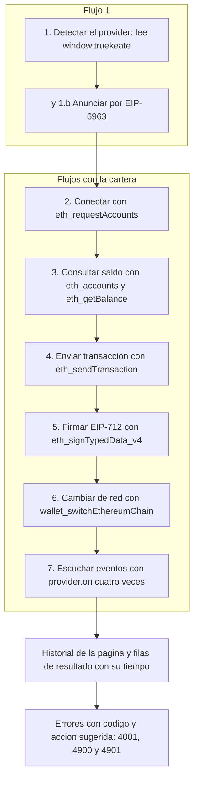

# 07 — dApp de pruebas y contrato auxiliar

## Empezar en 5 minutos

### Qué necesitas

- TrueKeate Wallet compilada con `npm run build` y cargada en Chrome o Edge desde la carpeta `dist/` (Chrome 114 o superior). El identificador de la extensión es `oiahebaliobknoeeonhgaacapjcpgblo`.
- Un nodo local Anvil en `127.0.0.1:8545`, con `chainId` 31337.
- El servidor de la dApp de pruebas, que se levanta con `npm run dev` y sirve la página en el puerto **5174** fijo: `http://localhost:5174/test.html`.
- Opcional, solo si vas a tocar los contratos: la herramienta **Foundry** instalada (aporta `forge` y `cast`).

### Qué vas a conseguir

- Ejecutar, uno por uno y desde el navegador, los **siete flujos** que ejercita la página de pruebas.
- Entender qué método EIP-1193 usa cada flujo y qué debe responder.
- Saber leer los resultados y los errores que pinta la propia página, con su código y la acción sugerida.
- Entender qué es el proyecto de contratos Foundry, para qué sirve y por qué **no** está conectado a la página de pruebas.

### Los pasos mínimos

1. Levanta el nodo local:

   ```bash
   anvil --host 127.0.0.1 --port 8545 --chain-id 31337 --allow-origin "chrome-extension://oiahebaliobknoeeonhgaacapjcpgblo,http://localhost:5174,http://127.0.0.1:5174"
   ```

   El comodín `--allow-origin "*"` es solo para la máquina aislada del arnés de pruebas.

2. Comprueba que responde: `cast chain-id --rpc-url http://127.0.0.1:8545` debe devolver `31337`.
3. Levanta la dApp con `npm run dev` y abre `http://localhost:5174/test.html`.
4. Pulsa **Volver a detectar**. Debe aparecer, en verde, «provider detectado: TrueKeate». Si no, el problema es que la extensión no está cargada.
5. Pulsa **Anunciar por EIP-6963** y verás la lista de anuncios con el nombre, el identificador y su identificador único.
6. Pulsa **Conectar (eth_requestAccounts)**, elige una cuenta y confirma. La página guardará esa cuenta como la seleccionada.
7. Encadena el resto: **Consultar saldo**, **Enviar transacción**, **Firmar EIP-712**, **Cambiar de red** y **Escuchar eventos**. Cada botón pinta su fila de resultado con el tiempo que ha tardado.
8. Revisa el historial de la página al final: anota cada paso y cada evento recibido. Todos los flujos tienen un plazo de referencia de **5 000 ms** (5 segundos).

## La dApp de pruebas `test.html`

### Estructura real del fichero (990 líneas)

#### Mapa de bloques, paneles y estilos

| Bloque | Líneas | Contenido |
|---|---|---|
| Cabecera | 1-8 | Tipo de documento, idioma español, juego de caracteres, ventana gráfica, esquema de color y título. |
| Estilos | 9-339 | Un único bloque de estilos con los tokens de marca y todas las clases. |
| Cuerpo | 341-442 | Encabezado de marca y cuerpo principal con 4 paneles. |
| Script | 444-988 | Un único bloque de script con una función autoejecutable en modo estricto. |
| Cierre | 989-990 | Cierre de cuerpo y de documento. |

- El título es `TrueKeate Wallet — dApp de pruebas` y el icono de la pestaña apunta a `brand/truekeate-logo.ico`.
- La página se declara **autocontenida** y se sirve en `http://localhost:5174/test.html`.
- El encabezado de la página lleva el lema `PRODUCTOS | SERVICIOS | CRIPTOACTIVOS TOKENIZADOS`.
- Los paneles son: el encabezado de marca; el encabezado «Flujos de la dApp» con el plazo de 5 000 ms; el **flujo 1** con estado, detalle, botones y la lista EIP-6963; los **flujos 2 a 7** con seis botones, el campo `red-destino` y la zona de resultados; la **tabla de errores** (`4001`, `4900` y `4901`); y el **historial**, que es un bloque preformateado con rol de estado.
- Los estilos repiten los tokens medidos porque la página vive fuera del código de la extensión y se sirve suelta. Gobiernan el comportamiento observable: el punto verde o rojo del estado, los tres estados de fila (correcto, error y pendiente), sus partes, el campo del formulario, la tabla de errores y el historial.

#### Bloques del script

| Zona | Qué contiene |
|---|---|
| Constantes de plazo | `LIMITE_MS = 5000` y el aviso en curso a 3 500 ms. |
| Estado | El historial de líneas, las cuentas y la cuenta seleccionada. |
| Utilidades de pintado | Anotar en el historial, texto de estado, mostrar detalle, obtener el proveedor, describirlo y serializar a JSON. |
| Catálogo de errores | La acción sugerida por código y la descripción del error. |
| Filas de resultado | Crear la fila y pintarla con estado, cuerpo, milisegundos y código. |
| Ejecutor de flujos | El envoltorio común con temporizador y medida de tiempo. |
| Flujo 1 · detectar | La detección con reintento acotado a 4 segundos. |
| Flujo 1.b · EIP-6963 | Los anuncios, su pintado y la petición del anuncio. |
| Flujos 2 a 7 | Conectar, consultar saldo, enviar, firmar EIP-712, cambiar de red y escuchar eventos. |
| Arranque | El listener de EIP-6963, los 8 manejadores de clic y la ejecución inicial. |

### Descubrimiento del provider

«Provider» es el objeto que la extensión publica en la página para que la dApp pueda pedirle cosas.

#### La detección usa `window.truekeate`, no EIP-6963

La detección comprueba **exclusivamente** `window.truekeate`: que sea un objeto y que no sea nulo. Conclusión verificada: **todos** los flujos EIP-1193 se envían a `window.truekeate`.

El provider recibido por EIP-6963 **nunca** se usa para invocar métodos: el anuncio solo se recoge y se pinta. El provider real lo publica la extensión con dos definiciones de propiedad sobre las claves `truekeate` y su alias `codecrypto`, con descriptor **no configurable**. Que el alias sea el **mismo objeto** es lo que la página comprueba.

#### EIP-6963: solo anuncio, con `eip6963:requestProvider`

EIP-6963 es el estándar por el que una cartera se anuncia en la página para que varias carteras puedan convivir.

- El listener del anuncio se registra **antes** de pedirlo.
- La petición de anuncios emite el evento `eip6963:requestProvider` y lo anota con su tiempo. Al cargar la página se ejecutan la detección y la petición de anuncios.
- El anuncio se pinta como `name · rdns · uuid`. Sin anuncios, el literal es «EIP-6963: sin anuncios todavía.».

#### Mensajes cuando el provider no está

| Situación | Literal pintado |
|---|---|
| Detección fallida (flujo 1) | `no se ha detectado el provider (¿está cargada la extensión?)` |
| Instrucción añadida al detalle | `Carga dist/ en chrome://extensions, recarga esta página y vuelve a intentarlo.` |
| Cualquier flujo sin provider | `No hay provider: carga dist/ en chrome://extensions.` |

El reintento está acotado: si han pasado menos de 4 000 ms desde el primer intento, se reprograma la detección cada 100 ms.

#### Criterio de «provider detectado»

Hay cuatro estados posibles:

1. `truekeate` no es nulo, es el mismo objeto que el alias y no es configurable → «provider detectado: TrueKeate», en verde.
2. El alias no está congelado → «provider detectado, pero el alias no está congelado».
3. El alias apunta a otro objeto → «el alias window.codecrypto no apunta al mismo objeto».
4. Es nulo → el mensaje de ausencia.

El detalle visible publica la igualdad `truekeate === codecrypto`, si la propiedad es no configurable, si es TrueKeate y qué métodos existen de `request`, `on` y `removeListener`. El historial anota además el estado de las dos claves y el número de intento.

### Inventario de controles y flujos reales

<!-- GENERAR_IMAGEN: flujo-dapp-pruebas.svg -->



#### Controles de la página

Todas las líneas de la columna «Línea» son de `test.html`.

| Control | Texto visible | Línea | Ejecuta | Métodos EIP-1193 reales |
|---|---|---|---|---|
| `btn-detectar` | Volver a detectar | 383 | Detección | Ninguno (introspección de `window`) |
| `btn-eip6963` | Anunciar por EIP-6963 | 384 | Pedir anuncios | Ninguno (`dispatchEvent`) |
| `btn-conectar` | Conectar (eth_requestAccounts) | 392 | Conectar | `eth_requestAccounts` |
| `btn-saldo` | Consultar saldo (eth_getBalance) | 393 | Consultar saldo | `eth_accounts` + `eth_getBalance` |
| `btn-enviar` | Enviar transacción (eth_sendTransaction) | 394 | Enviar | `eth_accounts` + `eth_sendTransaction` |
| `btn-eip712` | Firmar EIP-712 (eth_signTypedData_v4) | 395 | Firmar EIP-712 | `eth_signTypedData_v4` |
| `btn-cambiar-red` | Cambiar de red (wallet_switchEthereumChain) | 396 | Cambiar de red | `wallet_switchEthereumChain` |
| `btn-eventos` | Escuchar eventos (accountsChanged, chainChanged) | 397-399 | Escuchar eventos | Ninguno: `provider.on(...)` cuatro veces |
| `red-destino` (campo de entrada) | chainId de destino para el cambio de red | 403 | Lo lee el cambio de red | — |

Salidas de la página: el estado y su texto, el detalle, la lista EIP-6963, la zona de resultados, el cuerpo de la tabla de errores y el historial.

Las filas de resultado reales son `resultado-conectar`, `resultado-saldo`, `resultado-enviar`, `resultado-eip712`, `resultado-cambiar-red` y `resultado-eventos`.

#### Cómo se pinta el resultado y el error

El ejecutor común:

1. Sin provider, pinta un error inmediato.
2. Con la opción de pendiente, pinta ya «Solicitud enviada a la ventana de confirmación; esperando la decisión del usuario…».
3. Programa un aviso a los 3 500 ms: «La operación sigue en curso: no ha respondido en 5000 ms. …».
4. Al resolver, pinta el resultado correcto con el JSON del valor, o el error con su descripción, y escribe en el historial.
5. Publica en la fila los atributos de tiempo, tiempo final y código, que es lo que consumen las pruebas automatizadas.

**Sí pinta el código y el mensaje.** La descripción del error devuelve `Error <code>: <message>` y, si existe, añade los datos del error en JSON. La tabla de acciones traduce el código a una acción concreta y la antepone con el literal «Acción sugerida: ».

Hay acción explícita para `4001`, `4100`, `4200`, `4900`, `4901`, `-32602`, `-32000` y `-32603`; cualquier otro código cae en «Reintentar la operación». La tabla estática del panel documenta solo `4001`, `4900` y `4901`.

#### Flujo 1 · Detectar el provider

Métodos EIP-1193: ninguno. Pinta el estado, el detalle y cuatro líneas de historial, más el tiempo del flujo.

La ausencia de provider se pinta como estado no correcto con punto rojo, **no** como error EIP-1193.

#### Flujo 1.b · Anunciar por EIP-6963

Métodos EIP-1193: ninguno. El parámetro real es un evento `eip6963:requestProvider` sin datos adjuntos. Pinta el texto de la lista de anuncios y una línea de historial con el tiempo del envío del evento.

#### Flujo 2 · `eth_requestAccounts`

Se llama a `eth_requestAccounts` sin parámetros. La página guarda el array de cuentas y la primera dirección como seleccionada, y pinta el JSON del array.

Este flujo lleva la marca de **pendiente**, de modo que un rechazo `4001` se pinta con su código y su acción. La etiqueta del historial es `eth_requestAccounts`.

#### Flujo 3 · `eth_getBalance` (con `eth_accounts` previo)

- Se consulta `eth_accounts` **solo si** no hay cuenta seleccionada. El comentario del código aclara que esa consulta no abre ventana.
- Después se consulta `eth_getBalance` con los parámetros `[cuenta, 'latest']`.
- No se pinta el JSON crudo, sino un texto con la cuenta, el saldo en wei y el saldo formateado.
- Sin cuenta autorizada, se lanza un error propio con código `4100` y el mensaje «No hay ninguna cuenta autorizada: usa antes «Conectar».».
- Va **sin** la marca de pendiente, para que el `4900` real de un nodo caído llegue cuando llegue.

#### Flujo 4 · `eth_sendTransaction` (envío simple)

Primero se consulta `eth_accounts` y después se envía la transacción:

| Campo | Valor real |
|---|---|
| `from` | La cuenta seleccionada (la primera autorizada). |
| `to` | `0x70997970C51812dc3A010C7d01b50e0d17dc79C8`, la **cuenta #1 de Anvil**. |
| `value` | `'0x2386F26FC10000'`, que son 10 000 000 000 000 000 wei, es decir, **0,01 ETH**. |

Es un **envío simple** (transferencia de valor, sin datos adjuntos), no una llamada a contrato. Pinta el JSON del hash, y una prueba automatizada exige que tenga la forma `0x` más 64 caracteres hexadecimales.

Lleva la marca de pendiente y devuelve `4100` propio si no hay cuenta.

#### Flujo 5 · `eth_signTypedData_v4` (EIP-712)

Se llama a `eth_signTypedData_v4` con los parámetros `[from, JSON.stringify(typedData)]`: los datos tipados viajan **serializados como cadena** en la segunda posición.

| Campo | Valor real |
|---|---|
| `domain.name` · `version` · `chainId` | `'TrueKeate'` · `'1'` · `31337` (número, no hexadecimal). |
| `types.SignMessage` | `account: address`, `message: string`. |
| `primaryType` | `'SignMessage'`. |
| `message.account` | La cuenta seleccionada o, si no la hay, el destino. |
| `message.message` | `'Firma de prueba de la dApp de TrueKeate'`. |
| `from` (primer argumento) | La cuenta seleccionada o, si no la hay, el destino. |

Pinta el JSON de la firma, y una prueba automatizada exige la forma `0x` más 130 caracteres hexadecimales. Lleva la marca de pendiente y el rechazo deja `4001` con su acción.

> **Hallazgo verificado (dominio distinto).** El manual técnico registra que este flujo firma el dominio `{ name: 'TrueKeate', version: '1', chainId: 31337 }` **sin contrato verificador**, y el tipo `SignMessage(address account, string message)`. Los fixtures y las pruebas de Forge usan **otro** dominio —el proyecto lo llama `TrueKeate Test App`, con `chainId` 31337 y con contrato verificador— y **otro** tipo: `SignMessage(string content, uint256 nonce, uint256 deadline)`. No hay correspondencia: **el flujo 5 de la dApp no es el que verifica el contrato**. Queda **pendiente de confirmar** si los dos dominios se unificarán.

#### Flujo 6 · `wallet_switchEthereumChain`

Se llama a `wallet_switchEthereumChain` con `params: [{ chainId }]`. El identificador se lee del campo `#red-destino`, cuyo valor inicial es `0x7a6a` (31338, el Anvil secundario), con respaldo `'0x7a6a'` si faltara.

Pinta `'wallet_switchEthereumChain(' + chainId + ') → ' + json(resultado)`. Lleva la marca de pendiente, y el `4901` de una red no dada de alta se pinta con su acción.

#### Flujo 7 · Escuchar eventos

No invoca ningún método de petición: usa `provider.on` **cuatro veces**.

- La fila lleva el atributo `data-suscrito`; si ya está en verdadero, responde «La suscripción ya estaba activa; se mantiene.» sin volver a suscribirse.
- Pinta «Suscripción activa a accountsChanged y chainChanged. Los eventos recibidos se añaden al historial de la página.» más una línea de historial.
- Todo va envuelto en un bloque de captura de errores con su descripción.

#### Flujos que NO existen en `test.html`

Verificado por búsqueda literal: **no aparecen** ni como llamadas ni como controles. Se listan para que no se supongan:

| Flujo esperado | Estado real |
|---|---|
| `eth_accounts` | **Sí existe, como paso interno** de los flujos 3 y 4, sin botón propio. |
| `eth_chainId` | **NO existe** ninguna llamada. |
| `personal_sign` | **NO existe**. Solo aparece como texto de acción del código `4200`. |
| `wallet_addEthereumChain` | **NO existe** ninguna llamada. Solo aparece en la tabla de errores y en la tabla de acciones. |
| `wallet_watchAsset` | **NO existe**. |
| `eth_getTransactionReceipt` y seguimiento | **NO existe**: el flujo 4 devuelve el hash y no hace seguimiento. |
| `eth_call` | **NO existe**. |
| `eth_estimateGas` | **NO existe** en la página: lo hace el Service Worker antes de la ventana. |
| `eth_blockNumber` | **NO existe**. |

El encabezado de la página declara su alcance: «Siete flujos operativos: detectar el provider, conectar, consultar saldo, enviar una transacción, firmar datos EIP-712, cambiar de red y escuchar eventos».

### Eventos

#### Suscripción real: cuatro de los cinco

La página se suscribe a **cuatro** eventos:

- `accountsChanged` → cambia la lista de cuentas.
- `chainChanged` → cambia la red.
- `connect` → conexión establecida.
- `disconnect` → conexión perdida.

Los cuatro manejadores **solo escriben en el historial** (`evento <nombre> → <json>`); no tocan filas ni estado. El texto de éxito menciona solo dos eventos, igual que el propio botón, aunque el código se suscriba a cuatro.

#### El quinto evento: `message`

El evento `message` **existe** en el Service Worker, pero su propio comentario declara que **no se emite** en el hito H3, porque no hay ningún método que lo produzca. La dApp **no se suscribe** y ningún flujo lo dispara: la escucha es de **4 de 5**.

Los eventos llegan por el canal del provider: el content script reenvía el sobre del evento y la capa de inyección lo emite con el nombre y los datos. El evento de cambio de red viaja **sin envoltorio**: sus datos son el identificador hexadecimal de la red.

### Formularios y validación en la dApp

#### Inputs reales: solo uno

La página tiene **un único control de entrada**: el campo de texto `#red-destino`, con valor `0x7a6a`, autorrelleno apagado y corrección ortográfica desactivada, etiquetado como «chainId de destino para el cambio de red».

**No existen** campos de dirección de destino, importe, mensaje a firmar ni JSON EIP-712. Esos datos son constantes del script: la dirección de destino es la cuenta #1 de Anvil, el importe es un literal hexadecimal, el mensaje es un literal y el JSON EIP-712 un objeto literal.

#### Construcción del `value` en wei

**No se usa la función de conversión a wei** ni la librería de criptografía: la página no importa ninguna biblioteca (no hay importaciones, ni etiquetas de script externas, ni requerimientos). El importe se envía ya en wei como literal hexadecimal, `'0x2386F26FC10000'`.

La única aritmética de wei es de **presentación**: la función de formateo convierte con enteros grandes, calcula 10 elevado a 18, toma el resto, lo rellena a 18 dígitos y muestra los **4 primeros decimales** con el formato `<entero>,<4 decimales> ETH`. Si el valor no es convertible, devuelve «no se pudo formatear el saldo».

#### El `chainId` que usa la página

| Uso | Valor |
|---|---|
| Red del dominio EIP-712 | `31337` (número decimal). |
| Red de destino del cambio de red | `0x7a6a` por defecto, editable en el formulario. |
| Cualquier otra lectura de red | No hay: la página **no llama** a `eth_chainId`. |

El `31337` coincide con el Anvil principal y con los fixtures de Forge, pero el **dominio** no (véase el hallazgo del flujo 5).

### Contrato de prueba desde la dApp

**La dApp no despliega ni llama a ningún contrato.** Verificado en el fichero:

- No hay llamadas a `eth_call` ni envíos con datos adjuntos.
- No aparece ninguna dirección de `contracts/`: la única dirección literal es `0x70997970C51812dc3A010C7d01b50e0d17dc79C8`, que es una **cuenta** de Anvil usada como destinatario de una transferencia simple.
- No hay ABI ni artefacto JSON.
- El contrato verificador no aparece en los datos tipados.

Conclusión: **la dApp y `contracts/` no se comunican**. El contrato es un instrumento que funciona fuera de línea y verifica firmas producidas por la cartera contra fixtures versionados.

## El proyecto Foundry `contracts/`

### Árbol real de `contracts/`

Ficheros **propios** (excluida la dependencia vendorizada y los artefactos de compilación):

| Fichero | Papel |
|---|---|
| `contracts/foundry.toml` | Configuración de Foundry. |
| `contracts/src/EIP712Verifier.sol` | Contrato verificador EIP-712. |
| `contracts/test/EIP712Verifier.t.sol` | Los 5 casos obligatorios, más dominio y cartera. |
| `contracts/test/EIP712VerifierFase4.t.sol` | Batería adversaria de la Fase 4. |
| `contracts/test/fixtures/eip712-signature.json` | Fixture generado con `cast`. |
| `contracts/test/fixtures/eip712-wallet-signature.json` | Fixture producido por la cartera. |
| `contracts/scripts/generar-fixture-wallet.mjs` | Regenerador del fixture de la cartera. |
| `contracts/scripts/typed-data-wallet.json` | Entrada para firmar con `cast wallet sign`. |
| `contracts/README.md` | Documentación del instrumento. |

La carpeta `contracts/lib/forge-std/**` es la librería `forge-std` vendorizada (instalada con `forge install foundry-rs/forge-std --no-git`).

### `contracts/foundry.toml`

| Clave | Valor real |
|---|---|
| `solc` | `"0.8.24"` (fijado, no rango: reproducibilidad). |
| `evm_version` | `"cancun"`. |
| `optimizer` | `false`. |
| `src` / `test` / `out` / `libs` | `"src"`, `"test"`, `"out"`, `["lib"]`. |
| `fs_permissions` | Lectura de `./test/fixtures`. |
| `verbosity` | `2`. |

La cabecera sitúa el proyecto: «Configuración de Foundry para el instrumento de prueba RT-11 (contrato verificador EIP-712). No forma parte del producto». El permiso de lectura es explícito porque el fixture se lee desde el contrato de prueba.

### `contracts/src/EIP712Verifier.sol`

#### Propósito, licencia y versión de solc

| Aspecto | Valor real |
|---|---|
| Licencia | `MIT`. |
| Versión de Solidity | `0.8.24`, exacta. |
| Contrato | `EIP712Verifier`. |
| Naturaleza | Instrumento RT-11 / P-07: **no** es producto, no tiene estado y no custodia fondos. |
| API principal | `verify(address signer, bytes32 digest, bytes calldata signature)`, que devuelve un valor lógico. |

Es **sin estado** (solo constantes). La función de recuperación replica las guardas habituales de la firma (longitud 65, valores de `v` permitidos, `s` bajo EIP-2, `r` y `s` no nulos, dirección no nula) y **nunca revierte**; llama al precompilado de recuperación desde ensamblador. Se declara como función de solo lectura y no como función pura, con la desviación documentada: el compilador 0.8.24 prohíbe cualquier lectura de entorno —incluida esa llamada— dentro de una función pura.

#### El `domain` y los `types` reales

El contrato **no fija valores de dominio**: calcula el separador desde los cuatro campos que recibe y verifica un resumen ya calculado.

| Elemento | Forma real |
|---|---|
| Tipo del dominio | `EIP712Domain(string name,string version,uint256 chainId,address verifyingContract)`. |
| Separador del dominio | Se calcula codificando el tipo, el hash del nombre, el hash de la versión, la red y el contrato verificador. |
| Sobrecarga con estructura | Delega en la anterior. |
| Estructura de dominio | `{ string name; string version; uint256 chainId; address verifyingContract; }`. |
| Hash de datos tipados | Se compone con el prefijo `1901`, el separador y el hash de la estructura. |
| Tipo firmado del fixture | `SignMessage(string content,uint256 nonce,uint256 deadline)`. |

El contrato **no conoce** el tipo `SignMessage`: lo aporta quien llama.

#### Correspondencia con lo que firma la wallet (`src/background/crypto/sign.ts`)

La correspondencia está declarada en el código de la cartera: la firma de datos tipados devuelve además el **digest** (el resumen), que es justo lo que consume `EIP712Verifier.verify(signer, digest, signature)`.

- El cálculo real es el hash de los datos tipados con el dominio, los tipos limpios y el mensaje.
- La firma resultante es `0x` más 130 caracteres hexadecimales, exactamente lo que exige el parámetro de firma del contrato.
- La vuelta también existe: hay funciones para recuperar el firmante y para calcular el resumen.

Quién produce y quién verifica: la **cartera produce** la firma; el **contrato verifica**; y la prueba `test_WalletSignatureVerifiesOnChain` une ambos extremos.

#### El `verifyingContract`

El contrato **no lo fija**: recibe el resumen ya calculado. El valor de los dos fixtures es `0x8464135c8F25Da09e49BC8782676a84730C318bC`.

Según la documentación del instrumento, es la dirección determinista del despliegue desde la cuenta #0 de Anvil con nonce 0, comprobada con `cast compute-address`. **Nota de verificación:** el texto dice «cuenta #0» pero la dirección citada es la **cuenta #1** (`0x7099…79C8`, la misma del firmante). La inconsistencia **no se resuelve aquí** porque el comando no se ha ejecutado: queda **pendiente de confirmar**.

### Tests Forge

#### `contracts/test/EIP712Verifier.t.sol` (10 pruebas)

- La preparación de cada prueba instancia el verificador, carga el fixture y **rechaza un fixture incoherente**: comprueba que el resumen esperado coincide con el calculado y que el resumen derivado del dominio también.

Las diez pruebas reales verifican:

1. Que las dos sobrecargas del separador de dominio coinciden y que el resumen recompuesto en cadena es el del fixture; además que el nombre es `TrueKeate Test App` y la red `31337`.
2. Que una firma válida devuelve verdadero, tanto por el resumen guardado como por el recalculado.
3. Que la verificación desde datos tipados devuelve verdadero con el hash de estructura del fixture y falso con otro.
4. Que un firmante ajeno (otra dirección y la cuenta #2 de Anvil) devuelve falso.
5. Que un dominio alterado (`chainId + 1` o el contrato verificador cambiado) devuelve falso.
6. Que una firma malformada devuelve falso **sin revertir**: longitudes 64, 66 y 0, valores de `v` fuera de rango, `s` alto, `s = 0` y `r = 0`.
7. Que un solo byte alterado de `r`, de `s` o del resumen devuelve falso.
8. Que la firma de la cartera verifica en cadena, que el resumen recompuesto es idéntico, que el firmante es la cuenta #1 de Anvil y que los dos fixtures **comparten** el separador de dominio y **no** comparten el resumen.
9. Que un byte alterado del contenido, un `nonce` o una fecha límite desplazados en ±1 y un bit cambiado del resumen devuelven falso.
10. Que la firma de la cartera no vale con otro firmante ni con otro dominio.

El total coincide con lo que declara la documentación del instrumento: **10 pruebas**, que incluyen los 3 casos de correspondencia cartera ↔ contrato.

#### `contracts/test/EIP712VerifierFase4.t.sol` (20 pruebas)

**Todas** las funciones empiezan por `testF4_`, para poder aislarlas. Las 20 pruebas se agrupan en cinco frentes:

| Frente | Qué cubre |
|---|---|
| ECDSA y EIP-2 | Longitudes distintas de 65, cola añadida, valores de `v` fuera de rango, fronteras de `s`, firma maleable con `s` alto, `r` y `s` en cero, firmante ajeno y firmante cero, la recuperación ante firma inválida, que nunca se devuelve la dirección cero y que ninguna firma malformada revierte. |
| Dominio | Dominio alterado, red ajena y contrato verificador en cero, y equivalencia entre el tipo de dominio y la verificación desde datos tipados. |
| Mensaje | Que la firma solo vale para el mensaje exacto (con datos aleatorios), que un bit alterado del resumen invalida y los casos de contenido vacío y contenido largo. |
| Correspondencia cartera ↔ contrato | La correspondencia bidireccional y que un bit alterado de la firma de la cartera devuelve falso. |
| Gas y estado | El gas determinista y estable, y que el contrato no tiene estado. |

Son **20 pruebas**, como declara la documentación. **Ningún caso revierte**: el contrato devuelve falso en todos y las pruebas pasan por eso.

#### Fixtures

Un **fixture** es un fichero con datos de prueba fijos, versionados en el repositorio, para que las pruebas no dependan de la red ni de claves aleatorias.

**`contracts/test/fixtures/eip712-signature.json`** (51 líneas). Es el fixture del enunciado, generado **una sola vez con `cast`** y versionado:

| Campo | Valor |
|---|---|
| Dominio | `TrueKeate Test App` / `1` / `31337` / `0x8464135c8F25Da09e49BC8782676a84730C318bC`. |
| Tipos y tipo principal | `SignMessage` con `content: string`, `nonce: uint256` y `deadline: uint256`. |
| Contenido del mensaje | `EIP-712 demo de TrueKeate: la cartera firma datos tipados y el contrato verificador los valida on-chain.` |
| `nonce` / `deadline` | `"0"` / `"1000000000"`. |
| Resumen esperado | `0xc39ddf1d66417c1a9ab929a18e122e9f5fff57a60c44c7565c75bd92a8d8b84b`. |
| Firmante | `0x70997970C51812dc3A010C7d01b50e0d17dc79C8`. |
| Firma | 65 bytes (`r ‖ s ‖ v`). |
| Generado con | `cast 1.7.2-dev`: `cast keccak`, `cast abi-encode` y `cast wallet sign --data --from-file`. |

La clave privada es la de la **cuenta #1 de Anvil**, con el aviso de que es dato de prueba y nunca debe usarse con fondos reales.

**`contracts/test/fixtures/eip712-wallet-signature.json`** (42 líneas). Es el fixture de la **correspondencia cartera ↔ contrato**; **no** se generó con `cast`: lo produjo la propia cartera, por la misma vía que `eth_signTypedData_v4`.

| Campo | Valor |
|---|---|
| Dominio | `TrueKeate Test App` / `1` / `31337` / `0x8464135c8F25Da09e49BC8782676a84730C318bC`. |
| Tipos y tipo principal | `SignMessage(content: string, nonce: uint256, deadline: uint256)`. |
| Contenido del mensaje | `TrueKeate H4: firma EIP-712 generada por el Service Worker (M11) y verificada on-chain.` |
| `nonce` / `deadline` | `"1"` / `"1700000000"`. |
| Resumen esperado | `0x617f47605752a33464938912ead84ac2283bca6d2e20eae51a5ca22b2348f52f`. |
| Firmante | `0x70997970C51812dc3A010C7d01b50e0d17dc79C8`. |
| Firma | (v = 27). |
| Generado con | La función de firma de datos tipados de la cartera (librería `ethers` v6, `TypedDataEncoder`). |

Diferencias verificadas por la prueba 8: **comparten el separador de dominio** (mismo dominio) y **no comparten el resumen** (cada mensaje tiene el suyo).

### Ejecución: `package.json:17`

El script de npm es:

```json
"forge:test": "forge test --root contracts --match-contract EIP712VerifierTest"
```

Ejecuta **solo** la clase `EIP712VerifierTest`, es decir las **10 pruebas** de `EIP712Verifier.t.sol`; **no** ejecuta la batería de Fase 4 (`EIP712VerifierFase4Test`), que se invoca aparte.

Otros comandos documentados: `forge build`, `forge test --root contracts -vv`, `forge test --root contracts --match-contract EIP712VerifierTest -vv`, `forge test --root contracts --match-test testF4_ -vv` y `forge test --root contracts --gas-report`.

Estado declarado de la batería: **30 pruebas del contrato Forge en verde** (las 10 de la clase base más las 20 de Fase 4).

### Relación con la wallet

| Extremo | Módulo | Qué hace |
|---|---|---|
| **Produce la firma** | `src/background/crypto/sign.ts` — `signTypedData` | Calcula el resumen y la firma con el codificador de datos tipados. |
| **Transporta la petición** | `src/background/approvals/dispatch.ts` | Tras la aprobación, ejecuta la firma de datos tipados. |
| **Verifica en cadena** | `contracts/src/EIP712Verifier.sol` — `verify` | Compara la dirección recuperada con el firmante y exige que no sea la dirección cero. |
| **Demuestra la correspondencia** | `contracts/test/EIP712Verifier.t.sol` — `test_WalletSignatureVerifiesOnChain` | Recompone el resumen en cadena y exige que coincida con el de la cartera. |

**La cartera firma, el contrato verifica**, y el fixture de la firma de la cartera es el eslabón versionado que une ambos extremos sin depender de la red. El instrumento se declara fuera del producto.

### Cómo se conecta la dApp con el contrato

**No están conectados entre sí** (véase «Contrato de prueba desde la dApp»).

Lo que sí está documentado es el **despliegue manual opcional en Anvil**:

| Dato | Valor real |
|---|---|
| Comentario | «Anvil en marcha (chainId 31337) en 127.0.0.1:8545». |
| Comando | `forge create --root contracts --rpc-url http://127.0.0.1:8545 --private-key 0x59c6… --broadcast src/EIP712Verifier.sol:EIP712Verifier`. |
| Dirección esperada | `0x8464135c8F25Da09e49BC8782676a84730C318bC`, la misma del fixture (nonce 0). |
| Verificación | `cast call` a la función `verify` devolviendo `true`. |

Parámetros de red reales, verificados en los documentos del repositorio:

| Elemento | Valor real |
|---|---|
| Nodo principal | `127.0.0.1:8545`, `chainId` 31337, con lista de orígenes permitidos. |
| Comando del arnés de pruebas | `anvil --host 127.0.0.1 --port 8545 --chain-id 31337 --allow-origin "*"`, **sin** `--silent`. |
| Banderas inválidas medidas | `--http.corsdomain` no existe en la versión 1.7.2-dev; `--silent` puede morir con código de salida 1. |
| Nodo secundario | `anvil --port 8546 --chain-id 31338`. |
| Servidor de la dApp | `npm run dev`, puerto **5174** fijo. |
| Arranque rápido | Anvil más `npm run dev`, y abrir `http://localhost:5174/test.html`. |
| El arnés levanta la dApp | El servidor de pruebas se configura con `npm run dev` y la URL `http://localhost:5174/test.html`. |

**Pendiente de confirmar:** que el despliegue de `contracts/` en Anvil se haya ejecutado y que la dirección resultante sea `0x8464135c8F25Da09e49BC8782676a84730C318bC`. Ningún script de npm lo despliega (el script `forge:test` solo ejecuta pruebas), no forma parte de la suite de extremo a extremo y esta documentación **no ha ejecutado el comando**; el único sostén del valor es el literal de la documentación del instrumento.

## Cierre

### Tabla resumen: flujo → métodos EIP-1193 → módulo del SW → prueba

| Flujo de `test.html` | Control | Métodos EIP-1193 | Módulo del Service Worker | Prueba que lo cubre |
|---|---|---|---|---|
| Detectar el provider | `#btn-detectar` | Ninguno: lee `window.truekeate` | Inyección del provider y constantes compartidas | Prueba del provider |
| Anunciar por EIP-6963 | `#btn-eip6963` | Ninguno: `eip6963:requestProvider` | Módulo de anuncio EIP-6963 | Prueba de EIP-6963 |
| Conectar | `#btn-conectar` | `eth_requestAccounts` | `pageMethods.ts` | Pruebas de la dApp y de conexión |
| Consultar saldo | `#btn-saldo` | `eth_accounts` + `eth_getBalance` | `pageMethods.ts` | Prueba de la dApp |
| Enviar transacción | `#btn-enviar` | `eth_accounts` + `eth_sendTransaction` | Despacho de aprobaciones, tras la estimación de gas | Pruebas de la dApp y de aprobación de transacción |
| Firmar EIP-712 | `#btn-eip712` | `eth_signTypedData_v4` | Despacho de aprobaciones → firma | Pruebas de la dApp y de firma EIP-712 |
| Cambiar de red | `#btn-cambiar-red` + `#red-destino` | `wallet_switchEthereumChain` | Despacho de aprobaciones → cambio de red | Pruebas de la dApp y de redes |
| Escuchar eventos | `#btn-eventos` | `provider.on` cuatro veces: `accountsChanged`, `chainChanged`, `connect` y `disconnect` | Módulo de eventos | Pruebas de la dApp y de eventos |
| Errores con acción sugerida (`4001`, `4900`, `4901`) | Filas de resultado | Los anteriores | Tabla de acciones de la propia dApp más los códigos del catálogo de errores | Pruebas de la dApp |

Las líneas de la columna «Control» son de `test.html`. La prueba específica de la dApp es **`e2e/22-dapp.spec.ts`** (444 líneas, 5 pruebas), agrupada bajo el título «22 · dApp de pruebas: los siete flujos». Mide el plazo de 5 000 ms y contrasta el tiempo que publica la propia página. **No existe** ningún fichero `e2e/22-dapp-*.spec.ts`.

### Límites de esta documentación

- No se han ejecutado compilaciones, pruebas, `forge`, `cast` ni Anvil: todo es lectura de ficheros.
- El despliegue de `contracts/` en Anvil y la dirección `0x8464135c…18bC` quedan **pendientes de confirmar**, igual que la incoherencia entre «cuenta #0» y la cuenta #1 en la documentación del instrumento.
- Los datos tipados del flujo 5 de `test.html` (nombre de dominio `TrueKeate`, sin contrato verificador, tipo `SignMessage(address,string)`) **no** son los de los fixtures de `contracts/`: se documenta como diferencia verificada, no como error, porque el contrato no está conectado a la dApp.

## Problemas frecuentes

### La página dice «no se ha detectado el provider (¿está cargada la extensión?)»

**Causa.** El objeto `window.truekeate` no existe en la página. La extensión no está cargada, está deshabilitada o la página se abrió antes de cargarla. La propia instrucción lo dice: «Carga dist/ en chrome://extensions, recarga esta página y vuelve a intentarlo.».

**Solución.** Compila con `npm run build`, carga la carpeta `dist/` en `chrome://extensions` y recarga la pestaña de la dApp. El flujo 1 reintenta solo durante 4 segundos, en intervalos de 100 ms; si se agota, pulsa «Volver a detectar».

### El flujo 1 avisa de que el alias no apunta al mismo objeto

**Causa.** La página comprueba que `window.truekeate` y su alias `window.codecrypto` sean el **mismo objeto** y que la propiedad no sea configurable. Si otra extensión o un script de la página ha sobrescrito el alias, el criterio falla.

**Solución.** Deshabilita otras carteras del navegador que puedan estar escribiendo ese alias y recarga la página. Si persiste, anota el mensaje exacto del detalle: es un defecto de la publicación del provider, no de la página.

### El anuncio EIP-6963 no aparece: «sin anuncios todavía»

**Causa.** El listener del anuncio se registra antes de pedirlo, así que el orden no es el problema. La causa habitual es que el Service Worker esté suspendido o que la extensión no haya inyectado la capa que emite el anuncio.

**Solución.** Pulsa «Anunciar por EIP-6963» otra vez; la petición se vuelve a emitir y el tiempo queda anotado en el historial. Si sigue sin haber anuncios, recarga la página con la extensión ya cargada.

### Conectar devuelve `4100` y la página no tiene ninguna cuenta autorizada

**Causa.** El flujo de saldo y el de envío usan la cuenta seleccionada; si no hay ninguna, la propia página lanza un error con código `4100` y el mensaje «No hay ninguna cuenta autorizada: usa antes «Conectar».». El `4100` es el código de «origen no autorizado».

**Solución.** Ejecuta primero el flujo 2, «Conectar (eth_requestAccounts)». También puede aparecer `4100` si revocaste el permiso de esa dApp desde la pestaña **Sitios**: en ese caso vuelve a conectar.

### Envío una transacción, recibo el hash, pero la página nunca muestra el recibo

**Causa.** Es el comportamiento documentado: el flujo 4 devuelve el hash y **no** hace seguimiento. El método de consulta del recibo **no existe** en la página de pruebas y **no hay** ningún evento de «transacción confirmada» entre los cinco eventos estándar.

**Solución.** Consulta el recibo desde la terminal: `cast tx <hash> --rpc-url http://127.0.0.1:8545`. Si lo que quieres es ver el ciclo completo en la cartera, mira la pestaña **Actividad** del popup, que registra `tx_sent` y las transiciones de la transacción.

### El flujo 5 firma correctamente, pero el contrato no valida esa firma

**Causa.** Diferencia verificada y documentada: la página firma un dominio con nombre `TrueKeate`, sin contrato verificador, y un tipo `SignMessage(address account, string message)`. Los fixtures y las pruebas de Forge usan el dominio `TrueKeate Test App` con contrato verificador y el tipo `SignMessage(string content, uint256 nonce, uint256 deadline)`. No hay correspondencia.

**Solución.** No es un fallo de la cartera. Para comprobar la correspondencia cartera ↔ contrato, usa el fixture producido por la cartera (`contracts/test/fixtures/eip712-wallet-signature.json`) y las pruebas de Forge. Queda **pendiente de confirmar** si los dos dominios se unificarán.

### El saldo se muestra con muy pocos decimales

**Causa.** Es la presentación de la propia página de pruebas: formatea el saldo mostrando solo los **4 primeros decimales**, con coma como separador. El valor íntegro en wei sí se muestra junto al formateado.

**Solución.** No hay nada que arreglar en la cartera. Si necesitas el valor exacto, usa el número en wei que la fila también pinta, o consulta el saldo con `cast balance <dirección> --rpc-url http://127.0.0.1:8545`.

### Al cambiar de red con `0x89` aparece `4901`

**Causa.** La red `0x89` (Polygon) no está dada de alta en la cartera, y el cambio de red a una red no registrada responde `4901`. La página reconoce ese código y pinta su acción sugerida.

**Solución.** Da de alta primero la red desde la pestaña **Redes** del popup y después repite el cambio. Recuerda que el alta **no** activa la red: hay que cambiarla con una solicitud aparte.

### `npm run forge:test` no ejecuta las 20 pruebas de Fase 4

**Causa.** Es el comportamiento del script: `forge:test` filtra por la clase `EIP712VerifierTest`, que contiene las **10** pruebas de la clase base. La batería de Fase 4 vive en otra clase y se invoca aparte.

**Solución.** Ejecuta la batería adversaria con `forge test --root contracts --match-test testF4_ -vv`. Para ver el informe de gas, `forge test --root contracts --gas-report`.
