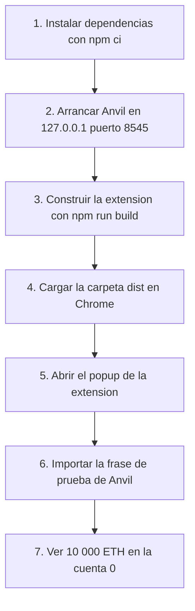

# Entornos y comandos de TrueKeate Wallet

Este manual explica, en lenguaje llano, qué hace falta tener instalado, qué comando se ejecuta para cada tarea y en qué puerto y red local se trabaja.

## Empezar en 5 minutos

### Qué necesitas

- **Node.js 20 o superior** y **npm 10 o superior**. El proyecto se ha probado con Node v24.16.0 y npm 11.13.0.
- **Foundry** (`anvil`, `forge`, `cast`) instalado aparte, en la versión `1.0.0` o posterior, pero anterior a `2.0.0`. El proyecto se ha probado con `1.7.2-dev`.
- **Chrome o Edge versión 114 o superior** para cargar la extensión.
- Windows con PowerShell es el entorno verificado. En Linux y macOS el proyecto **no** está verificado todavía.

### Qué vas a conseguir

- Una extensión cargada en el navegador, con la red local de pruebas conectada.
- El popup abierto mostrando **10 000 ETH** en la primera cuenta de Anvil.
- Saber qué comando lanzar para cada cosa sin tener que adivinar.

### Los pasos mínimos

1. Instala las dependencias exactas del proyecto:

```powershell
npm ci
```

2. Arranca el nodo local en una terminal y déjala abierta:

```powershell
anvil --host 127.0.0.1 --port 8545 --chain-id 31337 --allow-origin "chrome-extension://oiahebaliobknoeeonhgaacapjcpgblo,http://localhost:5174,http://127.0.0.1:5174"
```

3. En otra terminal, construye la extensión:

```powershell
npm run build
```

4. Carga la carpeta `dist/` en el navegador:

   1. Abre `chrome://extensions` (o `edge://extensions`).
   2. Activa el **Modo de desarrollador**.
   3. Pulsa **Cargar descomprimida**.
   4. Elige la carpeta **`dist/`** del repositorio (no `src/`, no la raíz).
   5. Comprueba que aparece **TrueKeate Wallet** con el ID `oiahebaliobknoeeonhgaacapjcpgblo` y sin errores.

5. Abre el popup, importa la frase de prueba de Anvil y mira el saldo.

```text
test test test test test test test test test test test junk
```

> Esa frase es **solo una pista de desarrollo**. Nunca se guarda como la cartera del usuario: sirve para ver los 10 000 ETH que Anvil regala a cada cuenta de prueba.

6. Comprueba que el nodo responde:

```powershell
cast chain-id --rpc-url http://127.0.0.1:8545
```

La respuesta debe ser `31337`.

<!-- GENERAR_IMAGEN: onboarding.svg -->



## Requisitos previos

### Sistema operativo y máquina de referencia

#### Entorno verificado

El sistema de referencia es **Windows con PowerShell**. La documentación del proyecto escribe los comandos para PowerShell y, cuando aplica, también para bash. El directorio de referencia es `C:\Users\lucci\MasterCodeCripto\GitLab\chrome-wallet`.

El proyecto **no** está verificado en Linux: no es una decisión de diseño, sino que faltaba el medio para probarlo. Para cerrarlo haría falta WSL2 o un flujo de integración continua en `ubuntu-latest`. Mientras no exista ninguno de los dos, ese requisito queda como «verificado solo en Windows; **pendiente de confirmar** en Linux».

#### Trazas de plataforma en el propio repositorio

Hay dos detalles que dependen de Windows:

- El guion `scripts/generate-icons.ps1` necesita la librería `System.Drawing` de .NET, disponible en Windows PowerShell 5.1. Si algún día se compila en Linux, la solución prevista es generar los iconos una sola vez y guardar los PNG resultantes en `public/icons/`.
- El arnés de pruebas de extremo a extremo usa `tasklist` y `taskkill` para detener Anvil y `where` para localizar el programa. Es material de pruebas, no del producto.

### Node.js y npm

#### Versiones declaradas

| Elemento | Valor detectado |
|---|---|
| Node.js | `v24.16.0` |
| npm | `11.13.0` |

El mínimo probado es **Node.js 20 o superior** (probado con la 24) y **npm 10 o superior**. Compruébalo así:

```powershell
node -v
npm -v
```

La versión importa porque Vite 7 necesita un Node moderno.

#### Gestor de paquetes e instalación reproducible

El proyecto está declarado como paquete de módulos modernos (`"type": "module"`), así que los ficheros de configuración y los guiones se escriben en ese formato.

La instalación reproducible es **`npm ci`**, que lee `package-lock.json` (guardado en el repositorio) e instala exactamente esas versiones. El texto único de «construcción limpia» en todo el proyecto es:

```powershell
npm ci && npm run build
```

Si prefieres `npm install`, el resultado suele ser equivalente, pero la puerta de calidad usa `npm ci`.

### Foundry (`anvil`, `forge`, `cast`)

#### Versión instalada y rango soportado

La versión detectada es **1.7.2-dev**, con los programas en `C:\Users\lucci\.cargo\bin\`. El rango admitido es **`>=1.0.0 <2.0.0`**. Ojo: la versión detectada es una compilación de desarrollo (`-dev`), así que otro equipo puede comportarse de forma algo distinta.

Instalación:

```powershell
curl -L https://foundry.paradigm.xyz | bash
foundryup
anvil --version
```

En Windows, la carpeta `%USERPROFILE%\.cargo\bin` debe estar en el `PATH`.

#### Verificación previa a los E2E

Antes de lanzar las pruebas de extremo a extremo hay que comprobar que Foundry está en rango y que Anvil responde:

```powershell
anvil --version
cast chain-id --rpc-url http://127.0.0.1:8545
cast block-number --rpc-url http://127.0.0.1:8545
```

El segundo comando debe devolver `31337`. Si Anvil no responde o la versión está fuera de rango, la suite de navegador **no se ejecuta** y se marca como **no verificada**, nunca como satisfactoria.

### Navegador Chrome o Edge ≥ 114

#### Requisito

El manifiesto de la extensión exige **`minimum_chrome_version: 114`**. Es la fuente de verdad del requisito: en versiones anteriores el paquete **no carga**.

Puedes comprobar tu versión en `chrome://version`.

#### Nota sobre el binario del navegador

En la máquina verificada no se encontró el programa `chrome` en el `PATH`, y no pasa nada: la extensión se carga **a mano** desde `chrome://extensions`. Para las pruebas automatizadas no se usa ese navegador, sino el canal **chromium** de Playwright.

### Herramientas opcionales y fuera de alcance

#### Git, CLIs de forja y GCP

- **Git** es opcional, aunque está inicializado con las ramas `main` y `chrome-wallet-DSH` (esta última es la rama de trabajo activa).
- Las herramientas `gh` y `glab` **no** están instaladas, y no hay token de GitHub ni de GitLab. Crear un repositorio remoto se hace desde la web o aportando un token.
- **GCP no aplica**: el alcance es 100 % local y no se necesita ninguna credencial de nube.

El despliegue real de este producto **es copiar la carpeta `dist/` y cargarla en el navegador**. No hay servidor ni publicación remota.

## Catálogo completo de scripts npm

### Tabla de los scripts declarados

`package.json` declara **exactamente diez** guiones:

| Guion | Orden real | Qué hace |
|---|---|---|
| `dev` | `vite` | Arranca el servidor de desarrollo y sirve la dApp de pruebas en `http://localhost:5174/test.html` |
| `build` | `tsc -b && vite build` | Revisa los tipos y construye la extensión: 6 entradas y `dist/manifest.json` |
| `test` | `vitest run` | Todas las pruebas unitarias en una sola pasada |
| `test:watch` | `vitest` | Las pruebas unitarias en modo vigilancia, mientras desarrollas |
| `coverage` | `vitest run --coverage` | Pruebas con medición de cobertura; **falla** si no se alcanzan los mínimos |
| `test:e2e` | `playwright test` | Pruebas de extremo a extremo en Chromium con la extensión cargada desde `dist/` |
| `lint:prohibited` | `node scripts/lint-prohibited.mjs` | Busca cosas prohibidas dentro del código y del paquete |
| `check:mermaid` | `node scripts/check-mermaid.mjs RepoTecnico` | Valida los diagramas de la documentación técnica |
| `typecheck` | `tsc -b` | Solo revisión de tipos, sin generar ficheros |
| `forge:test` | `forge test --root contracts --match-contract EIP712VerifierTest` | Pruebas del contrato auxiliar |

### Detalle script por script

#### `npm run dev`

Arranca el servidor de desarrollo de Vite con la raíz en el repositorio (no en `src/`) y escucha en `127.0.0.1`, puerto **5174**, con el puerto **fijado**. La dApp queda en `http://localhost:5174/test.html`.

Este mismo guion es el que Playwright lanza por su cuenta durante las pruebas de navegador, así que **no** hace falta arrancarlo a mano para los E2E.

#### `npm run build`

Encadena dos herramientas: primero revisa los tipos y después construye con Vite. El efecto es una carpeta `dist/` con las **6 entradas**, las **3 páginas HTML** y el fichero `manifest.json`. La construcción archivada en la evidencia tardó unos **22 s**.

#### `test`, `test:watch`, `coverage` y `test:e2e`

- `test` y `test:watch` ejecutan Vitest con el entorno de navegador simulado.
- `coverage` añade la medición de cobertura con **umbrales bloqueantes**: 70 % de ramas en global y 80 % en las zonas de criptografía, aprobaciones y validación. Si no se alcanzan, el comando **falla**.
- `test:e2e` ejecuta Playwright. Antes de empezar, prepara la corrida y **aborta si Anvil no responde**. Y una regla importante: **no ejecutes Vitest y Playwright a la vez**, porque comparten ficheros temporales y el vigilante de Vite puede tumbar el servidor de la dApp.

#### `lint:prohibited`, `check:mermaid`, `typecheck` y `forge:test`

- `lint:prohibited` revisa `src/` y, si existe, `dist/`. El resultado esperado es **0 hallazgos**.
- `check:mermaid` valida los bloques de diagramas de `RepoTecnico`.
- `typecheck` es la primera mitad de `build`, por separado. El criterio es 0 errores y 0 avisos.
- `forge:test` ejecuta las pruebas del contrato. El texto `--root contracts` es obligatorio: sin él, `forge test` da un **falso verde** («Nothing to compile», 0 pruebas, código de salida 0).

### Scripts que NO existen (y una discrepancia declarada)

#### Ausencia de `prebuild`

La cabecera del guion `scripts/generate-icon-data.mjs` dice que también se ejecuta en `prebuild`. Sin embargo, `package.json` **no declara ningún guion `prebuild`**, así que npm no lo ejecuta al construir: regenerar `src/inject/icon-data.ts` es una tarea **manual**, y el fichero está guardado en el repositorio para que la revisión de tipos funcione en un clon limpio. Es una discrepancia de documentación que **no rompe la construcción**.

#### Scripts citados por la documentación que no son npm

`scripts/generate-icons.ps1` y `node contracts/scripts/generar-fixture-wallet.mjs` se citan en la documentación, pero **no** aparecen en `package.json`: se invocan a mano.

## Anvil: la red local de pruebas

### El comando normativo del producto (allowlist de CORS)

#### Literal con allowlist

La configuración recomendada para el producto usa una **lista de orígenes permitidos** (allowlist). En lugar del marcador `<ID>`, se escribe el ID estable de la extensión:

```powershell
anvil --host 127.0.0.1 --port 8545 --chain-id 31337 `
      --allow-origin "chrome-extension://oiahebaliobknoeeonhgaacapjcpgblo,http://localhost:5174,http://127.0.0.1:5174"
```

Dos reglas operativas que hay que respetar:

- `--allow-origin` admite **una sola lista separada por comas** y **no puede repetirse**. Si la escribes dos veces, Anvil se queja: «the argument '--allow-origin <ALLOW_ORIGIN>' cannot be used multiple times».
- **Nunca** se publica el puerto 8545 fuera de `127.0.0.1`. Un comodín permitiría a cualquier web visitada llamar al nodo local. Nada de `--host 0.0.0.0`.

#### Allowlist con el ID real de la extensión

El ID estable de la extensión es `oiahebaliobknoeeonhgaacapjcpgblo`, derivado de la clave pública fija del manifiesto. Es el mismo en cualquier equipo. Ese valor es el que consumen tanto la lista de orígenes de Anvil como las pruebas automatizadas.

La línea del apartado anterior ya lleva el ID sustituido; ten en cuenta que el repositorio la documenta con el marcador `<ID>`, así que esa línea es la sustitución del marcador por el valor real, no una cita literal.

### El comando verificado del arnés E2E

#### Literal

El arnés de pruebas usa el comodín:

```powershell
anvil --host 127.0.0.1 --port 8545 --chain-id 31337 --allow-origin "*"
```

Este comodín está **acotado a la máquina aislada del arnés** y **nunca** se usa como configuración del producto. La extensión tiene origen propio, y por eso el comodín es necesario en ese entorno de pruebas.

### Los dos errores medidos (y por qué importan)

#### `--http.corsdomain` no existe

En la versión de Anvil usada (1.7.2-dev) esa opción **no existe**. El proceso muere con el mensaje `error: unexpected argument '--http.corsdomain' found`, y a partir de ahí toda la suite falla con errores de conexión rechazada. La opción equivalente y correcta es `--allow-origin`.

#### `--silent` es frágil con redirección

`--silent` **no aparece** en la ayuda de Anvil y, cuando el arnés lo lanza con la salida redirigida a un fichero, el proceso puede morir con código 1. De ahí la regla: **el comando del arnés no lleva `--silent`**.

> **Matiz importante.** `--silent` **sí funciona** cuando se lanza como proceso desacoplado, sin capturar su salida, que es lo que hace un ayudante del arnés para restaurar el nodo tras una prueba. La prohibición afecta al arranque manual con redirección de salida.

### Puerto, red y verificación

#### Puertos y `chainId`

| Elemento | Valor |
|---|---|
| Puerto del nodo principal | **8545** |
| Host | `127.0.0.1` |
| `chainId` en decimal | **31337** |
| `chainId` en hexadecimal | **`0x7a69`** |
| Frase por defecto | `test test test test test test test test test test test junk` |
| Saldo por cuenta | 10 000 ETH |
| Dirección de la cuenta 0 | `0xf39Fd6e51aad88F6F4ce6aB8827279cffFb92266` |

El producto usa estos valores por defecto: `DEFAULT_RPC_URL = http://127.0.0.1:8545` y `DEFAULT_CHAIN_NAME = Anvil Local`.

#### Comandos de verificación y consulta

```powershell
cast block-number --rpc-url http://127.0.0.1:8545
cast chain-id     --rpc-url http://127.0.0.1:8545
cast balance 0xf39Fd6e51aad88F6F4ce6aB8827279cffFb92266 --rpc-url http://127.0.0.1:8545
cast tx <hash> --rpc-url http://127.0.0.1:8545
anvil --version
```

El segundo comando debe devolver `31337`.

#### Segunda red local (8546 / 31338)

Anvil es la **única** red del proyecto: Sepolia no se incluye. Para practicar el cambio y el alta de redes se levanta una **segunda red local** en otro puerto:

```powershell
anvil --host 127.0.0.1 --port 8546 --chain-id 31338 --allow-origin "*"
```

## Carga de `dist/` en el navegador

### Pasos numerados

#### Secuencia canónica

1. Abre `chrome://extensions/` (o `edge://extensions/`).
2. Activa el **Modo de desarrollador**.
3. Pulsa **Cargar descomprimida** y selecciona la carpeta **`dist/`** (no `src/`, no la raíz del repositorio).
4. Tras cada `npm run build`, pulsa **Recargar** (el botón ↻) en la tarjeta de la extensión.
5. Para ver la consola del **Service Worker** (el programa de fondo de la extensión), pulsa **Service worker** en la tarjeta.

Comprobación de éxito: aparece una tarjeta **TrueKeate Wallet** con el ID `oiahebaliobknoeeonhgaacapjcpgblo`, **sin** botón «Errores» ni avisos amarillos.

Un truco de comodidad: fija la extensión a la barra de herramientas (icono de pieza → chincheta) para tenerla siempre a mano.

#### Ensayo de instalación cronometrado

El proyecto guardó un ensayo de instalación cronometrado. El camino crítico de máquina se midió en **55 s** (33 s de instalación y 22 s de construcción). Al terminar, la carpeta `dist/` contiene **16 ficheros**.

El ensayo lo ejecutó el propio autor del proyecto y está declarado como **parcialmente verificado**: no se ha medido con una persona sin conocimiento previo, así que ese extremo queda **pendiente de confirmar**.

### El ID esperado y cómo comprobarlo

#### Valor, derivación y comprobación automática

| Dónde se lee | Valor |
|---|---|
| Tarjeta de `chrome://extensions` | `oiahebaliobknoeeonhgaacapjcpgblo` |
| Constante del código | `EXTENSION_ID` |

El ID **no se escribe a mano** en las pruebas: se calcula a partir de la clave pública del manifiesto. El algoritmo es el mismo que usa Chrome: se lee la clave del manifiesto, se calcula su huella SHA-256 y se toman los primeros 16 bytes, convertidos a letras de la `a` a la `p`. Si el manifiesto no declarara la clave, el cálculo falla con un error explícito. En la suite, el ID se descubre desde el propio Service Worker, nunca desde una constante escrita a mano.

### Tras cada cambio de código

#### Recarga manual y recarga en la suite

Si cambias el código, repite la carga: `chrome://extensions` → botón **↻** de la tarjeta. En la suite automatizada no hay recarga manual: el arnés reconstruye `dist/` y carga la extensión desde esa carpeta.

## Puertos y arranque de la dApp

### Tabla de puertos

| Puerto | Servicio | Host |
|---|---|---|
| **5174** | Servidor de desarrollo de Vite (sirve `test.html`) | `127.0.0.1` |
| **8545** | Anvil, red principal (`chainId` 31337) | `127.0.0.1` |
| **8546** | Anvil secundario (`chainId` 31338), solo para cambio y alta de red | `127.0.0.1` |

No hay ningún otro puerto en uso por el producto.

### `npm run dev` y la URL de la dApp

#### Comando y URL

El arranque típico usa dos terminales:

```bash
# Terminal 1: el nodo local. NO uses --silent
anvil --host 127.0.0.1 --port 8545 --chain-id 31337 --allow-origin "*"

# Terminal 2: la dApp de pruebas
npm run dev
```

La dApp queda en **`http://localhost:5174/test.html`**. La raíz del servidor es la del repositorio justamente para que esa dirección funcione y para que la carpeta `public/` se copie a `dist/` sin configuración extra.

### `strictPort` y host `127.0.0.1`

#### Por qué el puerto está fijado

El puerto está fijado para que el **origen** (la dirección desde la que se conecta la dApp) sea siempre el mismo y coincida con la clave de sesión que se guarda en la extensión. Si el puerto estuviera ocupado, el arranque **falla** en lugar de cambiarse a otro, porque un cambio de puerto rompería la sesión guardada.

La clave de sesión por origen se normaliza sin barra final y en minúsculas, por ejemplo `http://localhost:5174`.

#### Por qué el host es explícito

El host `127.0.0.1` no es un adorno: se añadió para corregir un defecto medido. Una prueba necesitaba **dos orígenes del mismo servidor** (`localhost` y `127.0.0.1`), pero el servidor solo escuchaba en la dirección IPv6 porque no se declaraba el host, y el valor por defecto resolvía a `::1` en ese equipo. La corrección fijó `host: '127.0.0.1'` tanto en el servidor de desarrollo como en el de vista previa.

### El `webServer` de Playwright

#### Declaración

La configuración de Playwright declara el servidor de la dApp con el comando `npm run dev`, la dirección `http://localhost:5174/test.html`, la reutilización del servidor si ya está levantado y un tiempo máximo de 120 s.

#### Por qué es obligatorio declararlo

Las pruebas que abren la dApp fallaban con `net::ERR_CONNECTION_REFUSED` en cuanto el servidor no estaba levantado. Eso era un fallo del arnés, no del producto. Tras la corrección, la suite pasó de **26 correctas y 11 fallidas** a **37 correctas y 0 fallidas**. La lección es que **la suite no debe depender de que alguien arranque la dApp a mano**.

Consecuencia práctica: al ejecutar `npm run test:e2e` **no** hace falta arrancar `npm run dev` tú mismo.

## Variables de entorno

### Variables de tooling (`.env.local`, no versionado)

#### Tabla declarada

El proyecto prevé estas variables para las herramientas, todas con estado «pendiente de crear»:

| Variable | Para qué sirve |
|---|---|
| `ANVIL_RPC_URL` | Dirección del nodo para las pruebas de integración |
| `ANVIL_MNEMONIC` | Frase que usan las pruebas |
| `ANVIL_CHAIN_ID` | `31337` |
| `E2E_HEADLESS` | `true` o `false` para Playwright |

La extensión **no usa** ficheros `.env` en tiempo de ejecución: no tiene servidor, y su configuración vive en el almacén local del navegador (`chrome.storage.local`) y en constantes de construcción.

### Variables que sí consume el arnés hoy

#### `E2E_HEADLESS` y los plazos inyectados

La configuración lee `E2E_HEADLESS`: cualquier valor distinto de `false`, o su ausencia, significa **sin ventana visible**. Usa `E2E_HEADLESS=false` para ver el navegador mientras depuras.

Además, la preparación de la suite inyecta **solo para las pruebas** unos plazos más cortos (3 s para firmar y 2 s para conectar), para que el vencimiento se observe en pocos segundos. Los valores de producción (120 000, 60 000 y 30 000 milisegundos) deben seguir siendo los del producto, y la suite lo comprueba de forma bloqueante.

#### Variables de control del arnés

| Variable | Efecto |
|---|---|
| `TK_EVIDENCE_PHASE` | Cambia la carpeta donde se guarda la evidencia (por defecto `H1`) |
| `TK_E2E_SKIP_BUILD=1` | Omite la reconstrucción de `dist/` durante la iteración local |
| `TK_DIST_DIR` | Sustituye la carpeta `dist/` (para depurar el propio arnés) |
| `TK_DAPP_URL` | Cambia la dirección de la dApp de pruebas |
| `CI` | Activa la prohibición de dejar pruebas marcadas como «solo esta» |
| `TK_MERMAID_STRUCTURAL=1` | Fuerza el modo estructural del validador de diagramas |

## Solución de problemas

### Lo que el repositorio documenta

#### Tabla de problemas frecuentes

| Síntoma | Causa y solución |
|---|---|
| La tarjeta de `chrome://extensions` muestra «Errores» | Algún fichero de `dist/` está incompleto: vuelve a construir (`npm run build`) y pulsa ↻ |
| El popup abre pero no muestra saldos, aparece «desconectado» | Anvil no está en marcha: arráncalo con el comando de este manual. **No uses `--silent`** |
| Toda la suite E2E falla con `ERR_CONNECTION_REFUSED` | Es lo mismo: comprueba primero si Anvil responde con `cast chain-id --rpc-url http://127.0.0.1:8545` (debe dar `31337`) |
| `http://localhost:5174/test.html` no responde | El servidor se arranca con `npm run dev` (puerto 5174). Si lanzaste Vitest a la vez, reinícialo |

Un comportamiento que sorprende pero es correcto: **la extensión ya funciona sin Anvil**. Puedes crear o importar una cartera y verás «desconectado» o «sin red» sin errores. El nodo solo hace falta para consultar saldos, enviar, firmar y cambiar de red.

#### Puerto ocupado

El repositorio no documenta un mensaje de error concreto para el caso «puerto 5174 ocupado». Lo que sí se deduce de la configuración es que, al estar el puerto fijado, Vite **falla** en lugar de buscarse otro. La solución implícita es liberar el puerto. El texto exacto del error queda **pendiente de confirmar**.

### WSL2 no disponible: RNF-15 pendiente

#### El hecho medido

Hay archivada una comprobación de WSL2 que responde: «Subsistema de Windows para Linux no tiene distribuciones instaladas», con código de error. El proyecto registra el resultado como **no ejecutable** y concluye que ese requisito **solo está verificado en Windows** y sigue **pendiente** en Linux.

#### Qué haría falta para cerrarlo

Dos vías: instalar WSL2 y ejecutar allí la instalación, la construcción y las pruebas, o montar un flujo de integración continua en `ubuntu-latest` con esos mismos tres pasos. Mientras no exista ninguno de los dos, **no se declara cumplido**.

### No escribir ficheros durante la suite E2E

#### La regla operativa

- **Síntoma:** 37 fallos con `net::ERR_CONNECTION_REFUSED` cuando el servidor de la dApp muere a mitad de la suite.
- **Error exacto:** `Error: EBUSY: resource busy or locked, watch …`.
- **Regla:** **no se escribe ningún fichero del repositorio mientras la suite E2E corre** (ni editores automáticos, ni `git`, ni otra herramienta). Con el árbol quieto, la suite termina en **84 correctas y 0 fallidas**.

#### Por qué importa para el despliegue

Es un límite del **arnés de pruebas**, no del producto: las mismas pruebas pasan cuando nadie escribe. Quien automatice la puerta de calidad debe **serializar** los comandos pesados (Vitest, Playwright y la construcción) y no tocar el árbol durante la corrida.

### Lo NO documentado (declaración honesta)

#### Casos sin texto en el repositorio

- **Nodo caído durante el desarrollo manual:** el proyecto documenta qué hace la cartera (estado «desconectado», error `4900` y reintentos acotados) y lo prueba en la suite, pero **no** describe un procedimiento manual de recuperación. En la práctica, basta con volver a arrancar Anvil con el comando de este manual.
- **Conflictos de versión de Node:** no hay una tabla de versiones soportadas más allá de «20 o superior» y del valor verificado v24.16.0.
- **Mensajes de error de Vite con el puerto ocupado y de Chrome al recargar la extensión:** no están archivados; **pendiente de confirmar**.

#### Lo que este manual NO afirma

No afirma que una persona sin conocimiento previo instale todo en 15 minutos: ese ensayo está declarado **no verificado**. No afirma que la construcción funcione en Linux: sigue **pendiente**. Y no afirma ningún recuento de pruebas medido en esta sesión: las cifras del proyecto son **declaradas** y se citan con su fuente en el manual de pruebas.

## Problemas frecuentes

### Anvil se cierra nada más arrancarlo y dice que `--http.corsdomain` no existe

**Causa.** En la versión de Anvil usada (1.7.2-dev) esa opción no existe. El proceso muere al leerla y, después, todas las pruebas fallan con errores de conexión rechazada.

**Solución.** Cambia la opción por la correcta, que es `--allow-origin`:

```powershell
anvil --host 127.0.0.1 --port 8545 --chain-id 31337 --allow-origin "chrome-extension://oiahebaliobknoeeonhgaacapjcpgblo,http://localhost:5174,http://127.0.0.1:5174"
```

### Añado `--silent` para no ver tanto texto y el nodo muere

**Causa.** `--silent` no aparece en la ayuda de Anvil y, lanzado con la salida redirigida a un fichero, el proceso puede terminar con código 1.

**Solución.** No lo uses al arrancar el nodo a mano. Si solo te molesta el texto en pantalla, abre Anvil en su propia terminal y déjala abierta.

### Todo falla con `net::ERR_CONNECTION_REFUSED` en `http://localhost:5174/test.html`

**Causa.** El servidor de la dApp no está levantado, o murió a mitad de la suite porque alguien escribió ficheros en el repositorio durante la corrida.

**Solución.** Comprueba primero si Anvil responde con `cast chain-id --rpc-url http://127.0.0.1:8545`. Después, asegúrate de que nadie escribe ficheros mientras corre la suite y vuelve a lanzarla. Recuerda que **no** hace falta arrancar `npm run dev` a mano: Playwright lo hace solo.

### El puerto 5174 ya está ocupado y no arranca el servidor

**Causa.** El puerto está fijado a propósito para que el origen de la dApp no cambie. Si otro programa lo ocupa, Vite falla en lugar de buscar otro puerto.

**Solución.** Cierra el proceso que lo ocupa y vuelve a lanzar `npm run dev`. El texto exacto del mensaje de error queda **pendiente de confirmar**; lo que sí está verificado es que el arranque falla en vez de cambiar de puerto.

### El popup abre pero aparece «desconectado» y sin saldos

**Causa.** La extensión funciona sin nodo, pero no puede leer saldos si Anvil no está en marcha. También puede ocurrir que el origen de la extensión no esté en la lista de Anvil.

**Solución.** Arranca Anvil con el comando de este manual, comprueba que responde con `cast chain-id --rpc-url http://127.0.0.1:8545` y confirma que el ID de tu extensión coincide con `oiahebaliobknoeeonhgaacapjcpgblo`.

### La tarjeta de la extensión muestra «Errores»

**Causa.** Algún fichero de `dist/` está incompleto, normalmente porque se cargó la carpeta antes de terminar una construcción.

**Solución.** Vuelve a construir y recarga:

```powershell
npm run build
```

Después, en `chrome://extensions`, pulsa el botón ↻ de la tarjeta.

### Cargo la carpeta equivocada en el navegador y no funciona

**Causa.** Solo la carpeta `dist/` es un paquete cargable. `src/` y la raíz del repositorio contienen código fuente y no tienen manifiesto listo para el navegador.

**Solución.** En «Cargar descomprimida», selecciona siempre la carpeta **`dist/`** del repositorio.

### Las pruebas de contrato dicen «Nothing to compile» y no ejecutan nada

**Causa.** El comando `forge test` sin `--root contracts` busca los contratos en el sitio equivocado y termina con un falso verde: 0 pruebas y código de salida 0.

**Solución.** Usa el comando declarado en el proyecto:

```powershell
npm run forge:test
```
