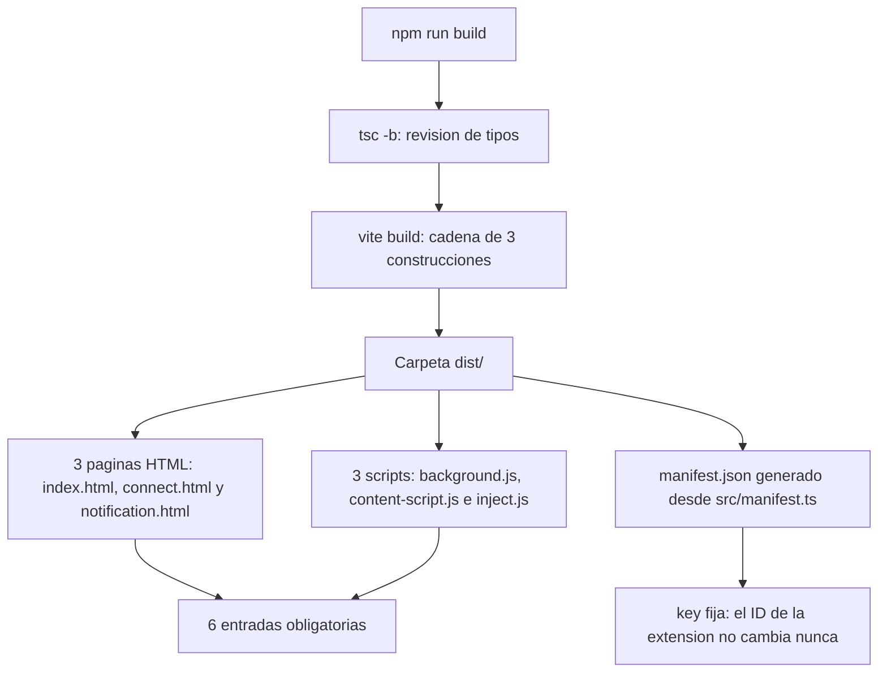

# Build y manifest de TrueKeate Wallet

Este manual explica en lenguaje llano qué ocurre cuando ejecutas `npm run build`: qué ficheros se generan, dónde acaban, por qué unos se empaquetan de una forma y otros de otra, y de dónde sale el fichero `manifest.json` que lee el navegador.

El **build** (o construcción) es el proceso que convierte el código fuente, escrito para personas, en ficheros que el navegador entiende. El **manifest** (`manifest.json`) es la ficha de identidad de la extensión: dice cómo se llama, qué versión tiene, qué permisos pide y qué ficheros debe abrir.

## Empezar en 5 minutos

### Qué necesitas

- Haber instalado las dependencias con `npm ci`.
- Node.js 20 o superior y npm 10 o superior.
- Nada más. No hace falta el navegador ni el nodo local para construir.

### Qué vas a conseguir

- Una carpeta `dist/` preparada para cargarse en Chrome o Edge.
- Las **6 entradas obligatorias** y el fichero `manifest.json`, generados con un solo comando.
- Entender por qué el identificador de la extensión es siempre el mismo en cualquier equipo.

### Los pasos mínimos

1. Construye:

```powershell
npm run build
```

2. Comprueba que están las 6 entradas y el manifiesto:

```powershell
Get-ChildItem dist
```

Debes encontrar `index.html`, `connect.html`, `notification.html`, `background.js`, `content-script.js`, `inject.js` y `manifest.json`.

3. Si algo falta, el propio build **habrá fallado** con un mensaje que nombra el fichero que falta. Vuelve a leer la salida.

4. Abre `chrome://extensions`, activa el **Modo de desarrollador**, pulsa **Cargar descomprimida** y elige `dist/`.

5. Tras cada cambio de código, repite el paso 1 y pulsa el botón ↻ de la tarjeta de la extensión.

## Panorama del pipeline

### Un solo comando, tres builds

#### Qué lanza `npm run build`

El guion `build` ejecuta dos cosas seguidas:

```powershell
tsc -b && vite build
```

- `tsc -b` revisa los tipos (busca errores de programación antes de empaquetar).
- `vite build` construye de verdad y aplica **tres construcciones encadenadas**.

El resultado es siempre el mismo: **las 6 entradas** dentro de `dist/` y el fichero `dist/manifest.json`.

#### La cadena, en una frase

| Construcción | Formato | Qué produce |
|---|---|---|
| **1** | `es` | Las tres páginas HTML, sus ficheros de código y el Service Worker |
| **2** | `iife` | `content-script.js` |
| **3** | `iife` | `inject.js` y, además, el manifiesto |

El **Service Worker** es el programa de fondo de la extensión: no tiene ventana, vive mientras el navegador lo necesita y es quien habla con la red.

<!-- GENERAR_IMAGEN: flujo-build.svg -->



### Ficheros implicados

#### Fuentes

| Fichero | Papel |
|---|---|
| `vite.config.ts` | Configuración de la construcción, las tres fases y los dos complementos propios |
| `src/manifest.ts` | **Fuente única** del manifiesto: se escribe en TypeScript, no en JSON a mano |
| `src/index.html`, `src/connect.html`, `src/notification.html` | Las tres páginas de entrada |
| `src/background.ts`, `src/content-script.ts`, `src/inject/index.ts` | Las tres entradas de código |
| `src/manifest/manifest.spec.ts` | Prueba que audita el manifiesto declarado y el artefacto generado |

#### Evidencia archivada del build

Hay un registro real de una construcción guardado en el proyecto. Su parte final es la mejor prueba de lo que hace la cadena: primero aparecen las tres páginas emitidas dentro de `dist/src/`, después los paquetes de página y, por último, el aviso de que se ha generado `dist/manifest.json` con la versión 1.0.0.

## Las seis entradas y su formato

### Tabla de entradas

#### Declaración literal

| Nombre final en `dist/` | Fichero de origen | Formato | Para qué es |
|---|---|---|---|
| `index.html` | `src/index.html` | `es` | El popup de la extensión |
| `connect.html` | `src/connect.html` | `es` | La ventana de conexión de una dApp |
| `notification.html` | `src/notification.html` | `es` | La ventana de decisión |
| `background.js` | `src/background.ts` | `es` | El Service Worker |
| `content-script.js` | `src/content-script.ts` | `iife` | El guion que se ejecuta dentro de las páginas web |
| `inject.js` | `src/inject/index.ts` | `iife` | El proveedor que se inyecta en la página |

### Por qué `es` en las páginas y en el Service Worker

#### El motivo declarado

El formato de cada entrada es obligatorio y está fijado por entrada. El formato **`es`** son módulos modernos de JavaScript, que permiten usar `import`. Es el que corresponde a las tres páginas y al Service Worker por dos motivos:

- Las tres páginas son documentos de la extensión, y sus etiquetas `<script>` están declaradas como módulos.
- El manifiesto declara el Service Worker como módulo, que es exactamente lo que produce la primera construcción.

### Por qué `iife` en `content-script` e `inject`

Un **content script** es el guion que la extensión mete dentro de las páginas web que visitas. Ese guion **no admite `import`**, así que debe ir empaquetado de una pieza. Ese empaquetado se llama **`iife`** (una función que se ejecuta sola y no deja nada suelto).

#### Una sola entrada por build IIFE

El formato `iife` con las importaciones incluidas exige **una sola entrada por construcción**, porque la herramienta no admite dividir el código en trozos. Por eso hay tres construcciones: una para las páginas y el Service Worker, otra para el content script y otra para el proveedor inyectado.

#### Configuración IIFE autocontenida

La configuración de las construcciones `iife` hace cuatro cosas concretas:

- Prohíbe dividir el código en trozos y obliga a una única entrada.
- Desactiva la limpieza de la carpeta de salida, para **conservar** lo escrito por las construcciones anteriores.
- Desactiva la copia de recursos, para no recopiar `public/` en cada paso de la cadena.
- Baja el nivel de detalle de los mensajes, para no inundar la pantalla con dos construcciones adicionales.

#### Por qué el content script no admite `import`

El content script se declara para ejecutarse **al principio de la carga** (`document_start`) y en **todos los marcos** de la página. El proveedor se publica como recurso accesible desde la web. Por eso el content script tiene que ser un bloque cerrado de código: no puede pedir módulos externos en ese momento.

### Las entradas HTML y la raíz del proyecto

#### `root` es la raíz del repositorio

La raíz de Vite es la del **repositorio**, no la de `src/`. Eso se decidió por dos motivos: que la dApp de pruebas se sirva en `http://localhost:5174/test.html` y que la carpeta `public/` se copie a `dist/` sin configuración extra.

La consecuencia es que Vite emite cada página HTML **en su ruta relativa a la raíz**, es decir, dentro de `dist/src/`. Eso se corrige más adelante, como se explica en este mismo manual.

## La cadena de tres builds

### Build 1: páginas y Service Worker (formato `es`)

#### Entradas y salidas

La primera construcción declara como entradas las tres páginas y el Service Worker, y como salida la carpeta `dist` con limpieza previa. Eso significa que **la primera construcción vacía la carpeta** y las dos siguientes **añaden** sin borrar.

#### Qué produce, según la evidencia

El registro archivado de una construcción real muestra, en esta fase:

- Las tres páginas HTML dentro de `dist/src/`.
- El fichero de estilos, de unos 25 kB.
- Dos trozos de código compartido (`useBalancePolling` y `format`).
- Los tres paquetes de página: `connect.js` (unos 8 kB), `notification.js` (unos 29 kB) e `index.js` (unos 57 kB).
- Un trozo grande de código común de unos 234 kB y `background.js` de unos 466 kB.
- El cierre `✓ built in 7.93s`.

### Builds 2 y 3: `content-script` e `inject` (formato `iife`)

#### Quién los lanza

No los lanza una persona: los lanza un complemento propio de la configuración. Cuando la primera construcción termina de escribir sus ficheros, ese complemento llama a la herramienta de construcción otras dos veces, una para el content script y otra para el proveedor inyectado.

Tres detalles que importan:

- Se ejecuta en el momento en que la primera construcción ya ha escrito todo.
- Usa la interfaz de programación de Vite, no la línea de comandos.
- Un guardián interno evita lanzar la cadena **más de una vez** si la herramienta llama al complemento repetidamente.
- La **última** construcción incorpora el complemento que genera el manifiesto, y así lo encuentra con las **6 entradas ya en el disco**.

### Desviaciones documentadas respecto al documento técnico

#### Las tres desviaciones

La configuración declara **tres desviaciones** respecto al documento técnico. Lo importante es que el efecto final no cambia:

| # | Qué pedía el documento | Por qué no se puede cumplir al pie de la letra | Qué se hizo |
|---|---|---|---|
| 1 | Dos construcciones en un array | Vite 7 no admite que el fichero de configuración exporte un array | La segunda se lanza desde el código, al terminar la primera |
| 2 | Una sola construcción para las entradas `iife` | El formato `iife` exige una única entrada por construcción | Una construcción por entrada: tres en total |
| 3 | Las páginas en la raíz de `dist/` | Vite las coloca en su ruta relativa y la raíz debe ser la del repositorio | Un complemento las **reubica** en la raíz de `dist/` |

#### Por qué la tercera desviación no rompe nada

Las páginas generadas referencian sus recursos con rutas absolutas (`/index.js`, `/assets/...`). Por eso mover los ficheros de sitio **no rompe ninguna referencia**.

## Opciones comunes de build

### `SHARED_OUTPUT`: nombres estables

#### Declaración

La salida compartida por las tres construcciones fija tres reglas de nombres: las entradas se llaman **igual que su nombre lógico** (`[name].js`), los trozos compartidos llevan una huella (`chunks/[name]-[hash].js`) y los recursos también (`assets/[name]-[hash][extname]`).

#### Consecuencia

Que las entradas conserven su nombre es lo que garantiza que el Service Worker se llame **`background.js`** y no `background-<algo>.js`. El manifiesto está escrito a mano y referencia nombres **fijos**: si una entrada cambiara de nombre, el paquete quedaría roto.

Los trozos y los recursos **sí** llevan huella, para que el navegador no confunda versiones antiguas con nuevas.

### `target`, `sourcemap`, `emptyOutDir` y `publicDir`

#### Tabla

| Opción | Valor | Para qué |
|---|---|---|
| `target` | `chrome114` | Solo se genera código compatible con Chrome 114 o superior |
| `sourcemap` | activado | Se generan mapas para depurar en el navegador |
| `emptyOutDir` | activado en la construcción 1 | La primera construcción parte de una carpeta limpia |
| `emptyOutDir` | desactivado en las construcciones 2 y 3 | Se conserva lo escrito antes |
| `outDir` | `dist` | Es la carpeta que se carga en el navegador |
| `publicDir` | desactivado en las construcciones 2 y 3 | Se evita recopiar `public/` en cada paso |
| `logLevel` | `warn` en las construcciones 2 y 3 | Se silencia el ruido de las construcciones internas |

#### El `publicDir` del build principal

La primera construcción **sí** copia la carpeta `public/` a `dist/`. La evidencia lo confirma: al terminar, dentro de `dist/` aparecen las tipografías, los iconos y los recursos de marca.

### `htmlRootOutputPlugin`: de `dist/src/` a la raíz

#### Qué hace

Es un complemento propio que, después de escribir la construcción, recorre los ficheros generados y, cada vez que encuentra uno que empieza por `src/` y termina en `.html`, lo **mueve** a su ruta sin el prefijo. Después intenta borrar la carpeta `dist/src/` vacía. Si esa carpeta no existe o no está vacía, **no es un error de la construcción**.

#### Por qué

Como la raíz de Vite es la del repositorio, las páginas salen en `dist/src/`. El documento técnico exige que estén en la raíz de `dist/`. Este complemento hace ese traslado.

#### Efecto verificable

El contraste entre dos evidencias demuestra el traslado: el registro de construcción **muestra** `dist/src/*.html` (lo que produce Vite) y el inventario final **no tiene** ninguna carpeta `src/`. Además, el generador del manifiesto falla si `index.html` no está en la raíz de `dist/`, así que un fallo del traslado sería una construcción rota, no un paquete incompleto.

## Generación y validación del manifest

### `manifestPlugin`

#### Qué hace y cuándo

Es el complemento que genera `dist/manifest.json` a partir de `src/manifest.ts`. Además, **rompe la construcción** en tres casos:

- Si falta alguna de las **6 entradas** en `dist/`.
- Si falta la **`key`** (la clave pública que fija el identificador).
- Si `notifications` aparece en la lista de permisos principales.

Y **bloquea** los permisos retirados: `tabs`, `activeTab` y `scripting`.

Se ejecuta en la **última** construcción de la cadena, cuando las 6 entradas ya están en el disco.

#### La escritura y el guardia

Si la construcción falló antes, el complemento **no comprueba nada**: así una queja sobre el manifiesto no puede ocultar el error real. Cuando todo va bien, escribe el fichero con formato legible y avisa por consola: `[manifest] dist/manifest.json generado (version …)`.

### Validación de las seis entradas

#### `REQUIRED_ENTRIES`

La lista de entradas obligatorias es cerrada: `index.html`, `connect.html` y `notification.html` por un lado; `background.js`, `content-script.js` e `inject.js` por otro.

Cada nombre se comprueba contra el disco. Si falta alguno, la construcción se detiene con un mensaje que cita el documento normativo.

#### La misma lista, por duplicado

La misma lista aparece **también** en la prueba `src/manifest/manifest.spec.ts`. No es un descuido: es una comprobación **independiente** del artefacto generado.

### Exigencia de la `key` y permisos prohibidos

#### Las cuatro comprobaciones bloqueantes

| Comprobación | Cuándo falla | Qué dice |
|---|---|---|
| Entradas presentes | Falta alguna de las 6 en `dist/` | «faltan entradas obligatorias en dist/» |
| `key` presente | La clave no es un texto no vacío | «falta la 'key': sin ella el ID de la extension no es estable» |
| `notifications` fuera de `permissions` | `notifications` está entre los permisos principales | «pertenece a 'optional_permissions'» |
| Permisos retirados | Aparece `tabs`, `activeTab` o `scripting` | «permisos retirados en H-36 presentes en 'permissions'» |

Además hay una comprobación **no bloqueante**: si `notifications` **no** está entre los permisos opcionales, se emite un aviso por consola.

#### El conjunto de permisos que se valida

Los permisos realmente declarados son:

- **Principales:** `storage`, `alarms`, `favicon`, `clipboardRead` y `clipboardWrite`.
- **Opcionales:** `notifications`.
- **Permisos de host locales:** `http://127.0.0.1:8545/*` y `http://localhost:8545/*`.

### Qué garantiza `src/manifest/manifest.spec.ts`

#### Dos grupos, uno de ellos opcional

La prueba se organiza en **dos grupos**:

1. **«Manifest declarado en la fuente»** — se ejecuta **siempre**, porque no necesita `dist/`. Comprueba que los permisos son exactamente los cerrados y que `notifications` no se cuela; que no aparecen los permisos retirados; que el Service Worker es de tipo módulo; que el popup es `index.html`; que la versión mínima es la 114; que la clave fija da el identificador esperado; y que el content script arranca al principio de la carga y que `inject.js` está publicado como recurso web.
2. **«Artefacto `dist/`»** — necesita una carpeta `dist/` construida y se **salta con el motivo escrito** si falta el manifiesto. Comprueba que el manifiesto del artefacto es **igual** al de la fuente única, que las 6 entradas existen, que la clave está y que los permisos son los correctos.

#### Qué garantiza en una frase

Es una **doble comprobación**: la construcción **impide** generar un paquete inválido, y la prueba **audita** tanto la fuente como el resultado. Nada de lo que declare `src/manifest.ts` puede separarse de `dist/manifest.json` sin que la suite lo diga.

## La `key` fija y el ID estable

### `MANIFEST_KEY`

#### Qué es

Es la **clave pública** de un par de firma del desarrollador, codificada en un texto largo (RSA-2048). Está congelada a propósito: fija el identificador de la extensión en cualquier equipo y en cualquier instalación, lo que hace repetible la lista de orígenes permitidos de Anvil y las pruebas automatizadas.

#### Solo la clave pública

Lo único que se conserva es la clave **pública**. La privada no forma parte del repositorio ni del paquete. No hay ningún fichero de clave privada ni en `public/` ni en `dist/`.

### `EXTENSION_ID`: de dónde sale

#### El algoritmo

El identificador se calcula con el mismo método que usa Chrome: se toma la huella SHA-256 de la clave, se conservan los **primeros 16 bytes** y cada mitad de byte se convierte en una letra, de la `a` a la `p`. El resultado es:

```text
oiahebaliobknoeeonhgaacapjcpgblo
```

Lo usan tres cosas: la lista de orígenes permitidos de Anvil, el servicio de iconos del navegador y la suite de pruebas de extremo a extremo.

#### La implementación independiente en el arnés

El arnés de pruebas vuelve a implementar el mismo cálculo, precisamente para **no escribir nunca el identificador a mano**. Tener dos implementaciones del mismo algoritmo es una garantía: si la clave cambiara, el identificador esperado cambiaría igual en los dos sitios.

### Por qué está congelada

#### Los tres consumidores del ID

| Quién lo usa | Por qué necesita que no cambie |
|---|---|
| Lista de orígenes de Anvil | El origen de la extensión debe estar permitido para que el Service Worker pueda hablar con el nodo local |
| Suite de pruebas E2E | Descubre el identificador desde el Service Worker y abre páginas internas por su dirección |
| Iconos del origen solicitante | El servicio de iconos se consulta con una dirección que incluye el identificador |

#### El coste de cambiarla

Si la clave cambiara, cambiaría el identificador, y con él la lista de orígenes de Anvil (habría que reescribir el comando de arranque del nodo), la constante del código y las expectativas de la suite. Por eso la decisión está resumida así en el proyecto: «`dist/` con `key` fija implica ID de extensión estable», lo que hace repetible tanto la lista de Anvil como las pruebas.

## Tamaños de ventana y activos copiados

### Los tres tamaños declarados

#### En los HTML y en los tokens

| Ventana | Tamaño declarado |
|---|---|
| Popup (`index.html`) | **380 × 600** píxeles |
| Conexión (`connect.html`) | **420 × 650** píxeles |
| Confirmación (`notification.html`) | **420 × 640** píxeles |

Cada página lleva su medida en un comentario, y los estilos la declaran como variable de diseño. Esos valores se aplican con reglas de tamaño mínimo.

#### Dónde se aplican

Los estilos base describen el ámbito de las tres ventanas de la extensión y de la dApp de pruebas. Las tres medidas se aplican con reglas que se activan a partir de un ancho y un alto mínimos.

> **Matiz.** El tamaño **real** de la ventana de conexión y de la de decisión lo decide el Service Worker al crearla. Los valores de los estilos son la **referencia de diseño**. La comprobación del tamaño efectivo en el arnés **no está documentada**: queda **pendiente de confirmar**.

### `public/` copiado a `dist/`

#### Contenido real de `public/`

| Ruta | Contenido |
|---|---|
| `public/icons/icon-16.png`, `icon-32.png`, `icon-48.png`, `icon-128.png` | Los iconos de la extensión |
| `public/brand/` | El logotipo, el título de marca y la marca pequeña, en varios formatos |
| `public/fonts/*.woff2` | Las tipografías guardadas dentro del proyecto (Poppins, Inter y JetBrains Mono) |
| `public/fonts/LICENSE-*.txt` | Los textos de licencia OFL-1.1 de esas tipografías |

Cada página declara su icono con una ruta relativa a `public/`.

#### Cómo llega a `dist/`

La copia la hace Vite en la **primera** construcción, que es la única con la copia de recursos activada. Las construcciones 2 y 3 la desactivan para no repetir el trabajo.

#### Cuántos ficheros revisa el lint en `dist/`

El revisor de cosas prohibidas solo mira extensiones de texto. Por eso informa de **14 ficheros revisados** en `dist/`, mientras que el contenido total de la carpeta es de **16 ficheros**: las tipografías `.woff2` y las imágenes `.png` quedan fuera del recuento por su extensión, no porque estén excluidas a propósito.

## Tabla final: qué hay en `dist/` y quién lo carga

### Inventario de `dist/`

#### Ruta → entrada de origen → formato → quién la carga

| Ruta en `dist/` | De dónde sale | Formato | Quién la carga |
|---|---|---|---|
| `manifest.json` | Generado desde `src/manifest.ts` | JSON | El navegador, al cargar la carpeta |
| `index.html` | `src/index.html` | `es` | El navegador, como popup |
| `connect.html` | `src/connect.html` | `es` | El Service Worker, al abrir la ventana de conexión |
| `notification.html` | `src/notification.html` | `es` | El Service Worker, al abrir la ventana de decisión |
| `background.js` | `src/background.ts` | `es` (módulo) | El navegador, como Service Worker |
| `content-script.js` | `src/content-script.ts` | `iife` | El navegador, dentro de las páginas web |
| `inject.js` | `src/inject/index.ts` | `iife` | Lo inyecta el content script en la página |
| `index.js`, `connect.js`, `notification.js` | Entradas de página | `es` | Los propios HTML |
| `chunks/*.js` | Código compartido | `es` | Los paquetes de página |
| `assets/*.css` | Estilos agrupados | — | Los HTML |
| `*.js.map` | Mapas de origen | — | Las herramientas de depuración del navegador |
| `icons/*.png` | `public/icons/` | — | El manifiesto |
| `brand/*`, `fonts/*` | `public/brand/`, `public/fonts/` | — | Los HTML y el CSS |

La clave que va dentro de `manifest.json` es la que hace que el navegador derive **siempre el mismo identificador**.

#### Contrastado con la evidencia

Los nombres y tamaños de los paquetes aparecen literalmente en el registro archivado: `index.js` (unos 57 kB), `connect.js` (unos 8 kB), `notification.js` (unos 29 kB), `background.js` (unos 466 kB), el trozo común de unos 234 kB y el fichero de estilos de unos 25 kB.

### Comprobaciones manuales después de un build

#### Qué mirar

1. **Las 6 entradas están**: `dist/index.html`, `dist/connect.html`, `dist/notification.html`, `dist/background.js`, `dist/content-script.js` y `dist/inject.js`. Si falta alguna, la construcción **habrá fallado** con su mensaje, no habrá terminado en verde.
2. **`manifest.json` existe y declara la clave**: sin ella el complemento habría lanzado un error.
3. **No hay carpeta `dist/src/`**: el complemento de reubicación la elimina. Si quedara, el manifiesto no encontraría `index.html` en la raíz.
4. **La extensión carga sin errores** desde `chrome://extensions`.

#### Qué NO hay que hacer

**No** escribas `manifest.json` a mano. La cabecera de `src/manifest.ts` lo prohíbe expresamente: el manifiesto lo genera el complemento a partir de ese módulo. Cualquier edición manual de `dist/manifest.json` se pierde en la siguiente construcción y, mientras tanto, **hace fallar la suite** de pruebas.

## Problemas frecuentes

### Dentro de `dist/` aparece una carpeta `src/` con las páginas HTML

**Causa.** Vite coloca las páginas en su ruta relativa a la raíz del repositorio, es decir, en `dist/src/`. Un complemento propio las mueve a la raíz después.

**Solución.** No muevas los ficheros a mano. Si la carpeta `src/` persiste, la construcción no terminó bien: vuelve a lanzarla y lee la salida. El generador del manifiesto falla si `index.html` no está en la raíz, así que un fallo del traslado no pasa desapercibido.

### La construcción se detiene diciendo que faltan entradas obligatorias en `dist/`

**Causa.** Alguna de las 6 entradas no se ha generado. Normalmente porque una de las tres construcciones encadenadas falló antes.

**Solución.** Busca en la salida el error real (el que aparece **antes** del aviso del manifiesto). Revisa que el fichero de origen correspondiente existe y vuelve a construir:

```powershell
npm run build
```

### La construcción se queja de que falta la `key`

**Causa.** La clave pública fija no está declarada en `src/manifest.ts`. Sin ella, el identificador de la extensión dejaría de ser estable.

**Solución.** No inventes una clave nueva. Restaura el valor de `MANIFEST_KEY` en `src/manifest.ts`: ese valor es el que fija el ID `oiahebaliobknoeeonhgaacapjcpgblo` que esperan el nodo local y la suite.

### El build se niega a aceptar `notifications` entre los permisos

**Causa.** `notifications` pertenece a los permisos **opcionales**, no a los principales. Además, los permisos `tabs`, `activeTab` y `scripting` están retirados y su presencia bloquea la construcción.

**Solución.** Deja `notifications` en `optional_permissions` y no añadas los permisos retirados. La construcción y la prueba del manifiesto lo comprueban por ti.

### Modifiqué `dist/manifest.json` a mano y ahora las pruebas fallan

**Causa.** El manifiesto se genera automáticamente desde `src/manifest.ts`, y hay una prueba que compara el artefacto con la fuente. Cualquier edición manual provoca una diferencia.

**Solución.** No edites el fichero generado. Haz el cambio en `src/manifest.ts` y vuelve a construir. La siguiente construcción sobrescribe `dist/manifest.json` de todos modos.

### Esperaba encontrar `background.js` y veo un nombre con números y letras

**Causa.** Las entradas deben conservar su nombre lógico (`[name].js`). Solo los trozos compartidos y los recursos llevan una huella para evitar versiones antiguas en caché.

**Solución.** Revisa la configuración de nombres de salida. El manifiesto referencia nombres **fijos**, así que un nombre con huella en una entrada rompería el paquete.

### El Service Worker no se ejecuta y no veo por qué

**Causa.** El Service Worker se declara como módulo, y esa es la forma que produce la primera construcción. Si el formato no coincidiera, el navegador no lo cargaría.

**Solución.** Comprueba que el manifiesto declara `background.service_worker` con tipo `module` y abre la consola del Service Worker desde la tarjeta de `chrome://extensions` para leer el error concreto.

### No veo los iconos ni las tipografías dentro de `dist/`

**Causa.** La copia de la carpeta `public/` a `dist/` la hace solo la **primera** construcción. Las otras dos la desactivan a propósito para no repetir el trabajo.

**Solución.** No toques esa opción. Si los recursos no aparecen, es que la primera construcción no llegó a completarse: vuelve a lanzar `npm run build` y revisa la salida desde el principio.
