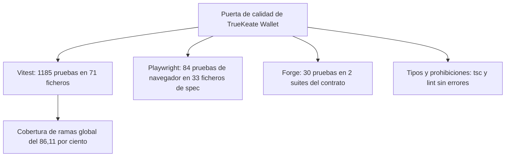

# Pruebas de TrueKeate Wallet

Este manual explica en lenguaje llano qué pruebas tiene el proyecto, qué comprueba cada una, cómo se lanzan y cómo se leen los resultados guardados.

Una **prueba** es un pequeño programa que comprueba que otra parte del proyecto hace lo que debe. Si algo se rompe, la prueba falla y nos avisa antes de que el problema llegue al usuario.

## Empezar en 5 minutos

### Qué necesitas

- Las dependencias instaladas con `npm ci`.
- Para las pruebas unitarias, nada más: funcionan en un navegador simulado.
- Para las pruebas de navegador, **Anvil en marcha** en `127.0.0.1:8545` con `chainId` 31337.
- Para las pruebas del contrato, **Foundry** instalado, en la versión `1.0.0` o posterior pero anterior a `2.0.0`.

### Qué vas a conseguir

- Las cuatro puertas de calidad en verde, que son la garantía de que el producto funciona.
- Saber cuál es el comando de cada suite y en qué orden conviene lanzarlas.
- Entender por qué nunca deben ejecutarse dos suites pesadas a la vez.

### Los pasos mínimos

1. Lanza las pruebas unitarias:

```powershell
npm run test
```

2. Comprueba la cobertura y sus mínimos:

```powershell
npm run coverage
```

3. Arranca el nodo local en una terminal aparte y déjala abierta:

```powershell
anvil --host 127.0.0.1 --port 8545 --chain-id 31337 --allow-origin "*"
```

4. Lanza las pruebas de navegador (Playwright levanta la dApp por su cuenta, no hace falta `npm run dev`):

```powershell
npm run test:e2e
```

5. Lanza las pruebas del contrato y las guardas del código:

```powershell
npm run forge:test
npm run lint:prohibited
```

Recuerda: **una suite pesada a la vez**. No solapes Vitest con Playwright.

## Panorama de las cuatro suites

### Suites, comandos y cifras declaradas

#### Tabla de suites

| Suite | Comando | Qué necesita para funcionar |
|---|---|---|
| **Vitest** (pruebas unitarias y de integración) | `npm run test` | Nada: navegador simulado en memoria |
| **Playwright** (pruebas de navegador) | `npm run test:e2e` | **Anvil en marcha** en `127.0.0.1:8545` con `chainId` 31337 |
| **Forge** (pruebas del contrato EIP-712) | `npm run forge:test` | Foundry `>=1.0.0 <2.0.0` |
| **Guardas del corpus** | `npm run lint:prohibited` | Nada |

<!-- GENERAR_IMAGEN: flujo-pruebas.svg -->



#### Qué cubre cada frente

- **Vitest** cubre la criptografía (generación y validación de frases, direcciones), la derivación de cuentas, la cola de aprobaciones, el ocultado de datos sensibles en los registros, la validación de formularios, el contrato interno del Service Worker y la cabecera de documentación de cada módulo.
- **Playwright** cubre la carga de `dist/` sin errores y los flujos de usuario completos, hasta la accesibilidad y la identidad visual.
- **Forge** comprueba que la firma EIP-712 que produce la cartera se puede verificar dentro del contrato.
- **Las guardas** comprueban que no haya llamadas de red propias ni recursos externos, que no se use el almacén sincronizado del navegador, que no haya colores escritos fuera de su sitio, que no quede nomenclatura heredada y que `ethers` no se importe desde el popup.

#### Cifras declaradas (no medidas aquí)

| Magnitud | Valor declarado |
|---|---|
| Vitest | **1185 pruebas correctas en 71 ficheros, 0 fallidas** |
| Playwright | **84 correctas, 0 fallidas, 0 inestables, en 33 ficheros de spec** |
| Forge | **30 correctas en 2 suites** |
| Cobertura de ramas | Global **86,11 %**; criptografía **86,98 %**; aprobaciones **95,60 %**; validación **93,13 %** |
| Puerta de cierre | `tsc`, construcción, `lint:prohibited` y `coverage` sin errores |

#### Lo que esta lectura sí ha verificado (conteo estático)

Contando ficheros a mano: hay **60 ficheros de prueba bajo `src/`** y **11 bajo `test/oracle/`**, que suman exactamente los **71 ficheros** declarados.

Los bloques de prueba contados a mano son **994**, por debajo de las 1185 declaradas. La diferencia es normal: algunas pruebas se escriben como plantillas que se expanden en varias, y hay un fichero que genera una prueba por cada módulo auditado. Por eso el conteo manual es un **límite inferior**, no un error.

## Vitest

### Configuración

#### Una sola fuente de verdad

La configuración de Vitest vive en un solo sitio y **no duplica valores**. El fichero `vitest.config.ts` recoge el bloque ya definido en la configuración de Vite y lo reutiliza, porque cuando existe `vitest.config.ts`, Vitest ya no lee `vite.config.ts`.

Los valores efectivos son: entorno de navegador simulado (`jsdom`), un fichero de preparación que carga el doble de `chrome`, y dos ubicaciones de pruebas (`src/**` y `test/oracle/**`).

#### Entorno `jsdom` y tipos

El entorno `jsdom` proporciona un navegador simulado para que las pruebas tengan `document` y `window`. Además, el proyecto declara los tipos que necesita el compilador, incluidos los globales de Vitest, porque las pruebas usan funciones globales.

### El stub de `chrome.*`

#### Superficie que simula

Un **stub** es un sustituto de mentira que imita el comportamiento real para poder probar sin navegador. El proyecto carga, una vez por fichero de prueba y antes de los casos, un doble en memoria que imita estas partes de la API de extensiones:

| Superficie | Qué ofrece |
|---|---|
| `chrome.storage.local` | Un almacén en memoria, con avisos de cuota, historial de escrituras y una forma de simular que la cuota se agota |
| `chrome.alarms` | Un reloj propio y determinista, con temporizadores que se pueden disparar a mano |
| `chrome.runtime`, `chrome.windows` y `chrome.tabs` | Mensajes, canales de comunicación, ventanas y pestañas simuladas |
| `chrome.permissions`, `chrome.action` y `chrome.notifications` | Permisos que se pueden conceder o denegar a voluntad, distintivos e notificaciones creadas |

El doble **no implementa a propósito** tres cosas: el almacén sincronizado del navegador (prohibido por el proyecto), la red real (el Service Worker sale por su propio proveedor) y los límites reales de cuota (se simulan a mano).

#### Reloj inyectable y aislamiento entre pruebas

- **Reloj propio:** el doble tiene su propio origen de tiempo, así que los temporizadores no dependen del reloj del sistema. Se puede avanzar el tiempo desde la prueba para ver qué pasa «dentro de un rato» sin esperar de verdad.
- **Aislamiento total:** antes de cada prueba se limpia todo: almacén vacío, cero temporizadores, cero escuchadores, cero ventanas, cero permisos concedidos y el reloj de nuevo en su origen.
- **Identificador sintético:** el doble usa un identificador de extensión **distinto** del real, a propósito. El identificador de verdad solo se usa en las pruebas de navegador, donde se descubre del propio Service Worker.

### Universo de specs y corpus

#### `include` y las dos ubicaciones

Las pruebas se buscan en dos sitios:

- **Junto al módulo**, que es la convención mayoritaria: por ejemplo, la prueba de la frase semilla vive al lado del fichero que la implementa.
- **En `test/oracle/`**, que son pruebas adicionales que **no** viven junto al módulo por un motivo práctico: cerrar la cobertura de la zona de aprobaciones sin tocar el código de `src/background/`.

### Cobertura V8 y umbrales

#### Configuración declarada

La cobertura se mide con el proveedor `v8`, genera informes en varios formatos (texto, resumen JSON, JSON y HTML), guarda el resultado en la carpeta `coverage/` y declara mínimos: **70 % de ramas** en global y **80 %** en las zonas de criptografía, aprobaciones y validación.

#### Por qué ramas y por qué bloqueantes

La métrica elegida es la **cobertura de ramas** (qué caminos alternativos del código se han recorrido, por ejemplo los dos lados de un `if`), no la de líneas.

Los mínimos están declarados en la configuración, y no comprobados a mano, para que `npm run coverage` **falle** si un cambio baja del umbral. La clave sin patrón es el mínimo global; cada clave con patrón es un mínimo de esa carpeta concreta. El informe HTML queda en `coverage/`.

### Exclusiones declaradas y por qué

#### Las tres exclusiones

Se excluyen de la cobertura tres cosas:

- Las propias pruebas (`*.spec.ts`), que no son código de producto.
- El fichero del manifiesto, que son datos congelados y se verifican contra el JSON generado.
- Los ficheros de declaración de tipos (`*.d.ts`), que no son código ejecutable.

La configuración lo cierra con una frase clara: **no se excluye ningún módulo funcional**.

#### Un límite declarado (no una exclusión)

Las vistas del popup, la ventana de conexión y la ventana de decisión presentan **0 % de líneas** en Vitest. No es porque estén excluidas, sino porque **se prueban en el navegador con Playwright**.

La consecuencia se dice sin maquillar: la cobertura global de líneas es baja y **no** es una medida útil del proyecto; el requisito se evalúa sobre **ramas** de la lógica. La lógica que se extrajo de la interfaz (validación, mensajes de error, comunicación con la cartera y el sondeo de saldos) **sí** tiene pruebas.

### Comandos de la suite

#### Los tres comandos y la regla de no solapar

- `npm run test`: todas las pruebas en una sola pasada.
- `npm run coverage`: aplica y **exige** los umbrales de cobertura.
- `npm run test:watch`: se queda vigilando y repite las pruebas al guardar.

La regla más importante: **no ejecutes Vitest y Playwright a la vez**. Vitest escribe ficheros temporales y el vigilante de Vite puede reiniciarse y tumbar el servidor de la dApp, lo que provoca fallos que no tienen nada que ver con el producto.

### Inventario de `test/oracle/**`

#### Los 11 ficheros y qué cubren

| Fichero | Qué cubre |
|---|---|
| `calldata.spec.ts` | La tabla cerrada de selectores de funciones |
| `dispatch-coverage.spec.ts` | El contexto de la sesión del origen |
| `focus-coverage.spec.ts` | La localización de la API y de la ventana única |
| `ports.spec.ts` | El índice volátil de canales de comunicación |
| `preview.spec.ts` | La extracción tolerante de los datos que envía la dApp |
| `queue-coverage.spec.ts` | El cerrojo que serializa las escrituras |
| `reconcile-coverage.spec.ts` | El plan de reconstrucción de operaciones en curso |
| `responses.spec.ts` | La lista blanca de rutas y la repetición segura de respuestas |
| `timeout.spec.ts` | Los plazos normativos |
| `crypto-numeric.spec.ts` | Qué valores numéricos se pueden convertir y cuáles no |
| `decisions.spec.ts` | La espera y el desenlace de una decisión |

#### Cómo se lee este inventario

- Los nombres con la palabra «coverage» delatan su origen: se crearon para cerrar la cobertura de módulos que no admitían una prueba junto a ellos sin tocar `src/background/`.
- Los **dos últimos** son pruebas funcionales de la Fase 4, no de cobertura: cinco pruebas cada uno.
- Los conteos de bloques son **estáticos** y, por tanto, un **límite inferior** de las pruebas que producen.

## Playwright

### Configuración

#### Reglas de la cabecera

La configuración de Playwright fija cinco reglas:

- Las pruebas viven en la carpeta `e2e/` y hay una preparación previa que reconstruye `dist/` con plazos más cortos.
- **Un solo trabajador** a la vez, porque la extensión vive en un contexto compartido con un identificador estable.
- **Cero reutilización de perfiles**: cada prueba usa un perfil nuevo y lo borra al terminar.
- Se ejecuta sin ventana visible, y eso se puede cambiar con una variable de entorno.
- La evidencia se guarda por fase y por fecha.

#### Valores efectivos

| Ajuste | Valor |
|---|---|
| Carpeta de pruebas | `e2e` |
| Preparación previa | `e2e/global-setup.ts` |
| Servidor de la dApp | `npm run dev`, en `http://localhost:5174/test.html`, con reutilización y 120 s de margen |
| Paralelismo | Desactivado; **un** trabajador |
| Reintentos | 0 |
| Plazos | 60 s por prueba y 10 s por comprobación |
| Salida de resultados | `test-results` |
| Traza y captura | Solo cuando algo falla |
| Grabación de vídeo | Desactivada |

#### Proyecto y *reporter*

Se declara **un único proyecto** que usa el canal **chromium** del sistema, no el Chromium empaquetado por Playwright, porque ese canal sí admite las API de extensión.

El informe tiene tres destinos: la lista por consola, un fichero JSON con la fecha y un informe HTML en `playwright-report/` que no se abre solo.

### `globalSetup`: qué prepara

#### Los pasos, con su línea

La preparación previa hace siete cosas **antes** de la primera prueba:

| # | Qué hace |
|---|---|
| 1 | Crea la carpeta de evidencia de la fase |
| 2 | **Comprueba los plazos de producción** y se detiene si no son los valores por defecto |
| 3 | **Reconstruye `dist/`** con plazos cortos inyectados; si falla, intenta una construcción alternativa y registra los dos fallos |
| 4 | Comprueba si hay un artefacto cargable y lo avisa |
| 5 | Comprueba el **Anvil principal** y **aborta la suite** si no responde o si el `chainId` no es 31337 |
| 6 | Arranca el **Anvil secundario** (8546 / 31338) si falta; si no lo consigue, **no** aborta: las pruebas que lo necesiten quedan no verificadas |
| 7 | Escribe el registro de la preparación y muestra el resumen |

#### Por qué el aborto por Anvil es un requisito

Las pruebas de navegador dependen del nodo local. Si Anvil no responde, los flujos con red fallan más tarde de forma confusa. Por eso la preparación **aborta** en lugar de dejar que la suite falle de manera incomprensible.

El mensaje de aborto incluye **el comando exacto** que arranca el nodo y el aviso de no añadir `--silent`.

#### El registro que se archiva

La preparación escribe un fichero JSON con la fase, la fecha, el repositorio, el estado de `dist/`, si el manifiesto está disponible, los plazos inyectados, los plazos de producción, el resultado de la construcción (comando, código de salida y si fue bien), el estado de Anvil y del Anvil secundario, y las advertencias.

### Fixtures del arnés

#### Qué expone `e2e/fixtures/extension.ts`

Un **fixture** es una pieza que el arnés prepara antes de cada prueba y deja lista para usar. Este fichero define tres:

- `context`: el contexto de navegador persistente con la extensión cargada desde `dist/`, con perfil nuevo por prueba y borrado al terminar.
- `extensionId`: el identificador de la extensión, **descubierto** desde el Service Worker.
- `background`: el propio Service Worker.

Además ofrece ayudas para: fallar con un mensaje útil si falta `dist/`, calcular el identificador esperado, abrir el popup aceptando el aviso no descartable, provocar una pérdida de foco real, suspender el Service Worker y observar si se despierta, conectar una dApp, iniciar una firma y resolver la ventana de decisión, leer y sembrar el almacén local desde el Service Worker, archivar la evidencia y detener o arrancar Anvil.

Dos ayudas viven en ficheros propios: una con la frase y las direcciones reales de Anvil, y otra con el descriptor del código QR.

#### Desviaciones del arnés documentadas

Dos desviaciones explican por qué el código no coincide con el bloque del documento técnico:

- El documento usa una forma de calcular rutas que **no existe** en un paquete de módulos modernos, así que la raíz se calcula de otra manera.
- El fichero documenta **tres** mecanismos de suspensión del Service Worker que **no** funcionan, frente al que sí funciona: usar el dominio de depuración sobre una página de la extensión.

### Inventario de los specs E2E (33 de producto + 1 sonda)

#### Cómo se ha elaborado

Se listaron **34 ficheros de prueba** en `e2e/`, además de la preparación y tres ficheros de ayudas, y se leyó la primera prueba de cada uno.

#### Reconciliación del recuento (divergencia real, verificada)

La documentación declara «84 correctas y 33 ficheros de spec». El conteo real da **34 ficheros** y **84 bloques de prueba**:

| Conjunto | Ficheros | Bloques de prueba |
|---|---|---|
| Pruebas de producto | 33 | 83 |
| `90-sonda.spec.ts` (material de diagnóstico) | 1 | 1 |
| **Total** | **34** | **84** |

Es decir: la cifra de pruebas (84) cuenta el fichero de sonda y la de ficheros (33) no. Las dos son ciertas por separado, pero no describen el mismo conjunto. Estos recuentos son **estáticos**: **pendiente de confirmar** con una ejecución real.

Los 33 ficheros de producto cubren, en orden: la carga de la extensión desde `dist/`; las cuentas y su creación; recibir y el código QR; enviar; la persistencia; el reinicio; el proveedor; los eventos; la conexión de orígenes; la aprobación de transacciones; la firma EIP-712 y de mensajes; las redes; la revocación; el sondeo de saldos; el registro de actividad; la validación; el formato de los números; la concurrencia; el anuncio del proveedor; los flujos de la dApp; la marca; la accesibilidad; la recuperación de la frase; los avisos; el nodo caído; los marcos hostiles; el Service Worker suspendido; la visibilidad de cuentas; la persistencia al cerrar el navegador; el vencimiento de una aprobación; el envío desde el popup; y el plazo de revelado de 30 s.

#### Notas sobre el inventario

- Los prefijos numéricos **no** son consecutivos: faltan algunos números porque se reservaron a otros hitos. **No** hay pruebas borradas.
- El fichero de sonda es **material de diagnóstico**, no una prueba del producto. Su propia cabecera dice que se elimina al cerrar un hito, pero sigue en el árbol.
- Varias pruebas no son uno a uno con su nombre: una recorre los siete flujos de la dApp y otra recorre cuatro superficies.
- De las pruebas de navegador, **10** son nuevas de la Fase 4, y las **74** anteriores siguen en verde: 84 − 10 = 74.

### Cómo se lanzan

#### Comando, requisitos y depuración

El comando es:

```powershell
npm run test:e2e
```

Antes de la primera prueba, **Anvil debe estar en marcha** en `127.0.0.1:8545` con `chainId` 31337; si no, la preparación aborta. **No** hace falta arrancar `npm run dev` a mano, porque lo levanta el propio arnés.

Con `E2E_HEADLESS=false` se abre el navegador a la vista. Como no hay reintentos y las trazas se guardan solo al fallar, un fallo deja la traza y la captura en `test-results/`, y el informe HTML en `playwright-report/`.

## Forge

### Comando y configuración

#### El literal normativo y su trampa

El comando declarado en el proyecto es:

```powershell
forge test --root contracts --match-contract EIP712VerifierTest
```

La trampa está documentada: `forge test` **sin** `--root contracts` da un **falso verde** («Nothing to compile», 0 pruebas y código de salida 0). Parece que todo va bien cuando en realidad no se ha ejecutado nada.

#### Configuración de Foundry

La configuración del contrato fija la versión del compilador (`0.8.24`) para que el resultado sea reproducible, la versión de la máquina virtual (`cancun`), desactiva el optimizador, define las carpetas de código, pruebas, salida y librerías, concede permiso de lectura a la carpeta de datos de prueba (porque el fichero de ejemplo se lee desde el contrato) y sube el nivel de detalle de los mensajes.

### Qué verifica

#### La API del contrato

El contrato expone una única función pública: `verify`, que recibe un firmante, un resumen ya calculado y una firma de 65 bytes, y devuelve verdadero **solo** si la dirección recuperada coincide con el firmante.

Si la firma está mal formada (longitud incorrecta, valor de recuperación fuera de rango, valores a cero o en la mitad alta), devuelve **falso sin revertir**. Es decir, no lanza un error: responde que no.

#### Los cinco casos obligatorios

1. Firma válida del fichero de ejemplo: verdadero.
2. Firmante incorrecto: falso.
3. Dominio alterado (por `chainId` o por contrato verificador): falso.
4. Firma mal formada: falso, sin revertir.
5. Un byte alterado de la firma (y del mensaje): falso.

#### Las dos mitades del fixture

Un **fixture** es un fichero de datos de ejemplo guardado en el repositorio para que las pruebas no dependan de la red ni de claves aleatorias. Hay dos:

- `eip712-signature.json`, generado una sola vez con la herramienta `cast` y guardado.
- `eip712-wallet-signature.json`, que **no** se generó con `cast`, sino con la **propia cartera**, por la misma vía que usa la firma de datos tipados.

Ese segundo fichero es el que convierte la suite en una comprobación de **correspondencia entre la cartera y el contrato**. La carpeta `contracts/` es un instrumento de prueba: **no forma parte del producto**, no tiene estado y no contiene lógica de producción.

### Suites y cuántos tests hay

#### Conteo declarado

| Suite | Pruebas | Qué contiene |
|---|---|---|
| `EIP712VerifierTest` | **10** | Los 5 casos obligatorios, la correspondencia del fixture, la firma de la cartera y la firma de `cast` |
| `EIP712VerifierFase4Test` | **20** | Batería adversaria: longitudes, valores fuera de rango, valores a cero y altos, firma maleable, firmante ajeno, dominio y mensaje alterados, pruebas con datos aleatorios y ausencia de estado |
| **Total** | **30** | — |

#### Verificación parcial en esta lectura

Hay un registro archivado del cierre de la suite de 10, con el texto «Suite result: ok. 10 passed; 0 failed; 0 skipped». Ese registro corresponde a un hito **anterior** a la batería adversaria, así que el total de 30 es una **cifra declarada**, no re-ejecutada en la lectura del manual técnico.

#### Cobertura de la batería adversaria

La batería cubre: longitudes de 0 a 70, valores de recuperación fuera de `{27, 28}`, valores nulos, fronteras del valor `s` (incluido el límite exacto), firma maleable, firmante ajeno y a cero, dominio y mensaje alterados, pruebas con datos aleatorios (**256** vueltas por defecto y **512** con semilla fija) y ausencia total de estado (**0 escrituras, 0 lecturas, 0 delegaciones y 0 autodestrucciones**).

Con una precisión importante: **ningún caso revierte**. El contrato devuelve falso en todos ellos, y las pruebas **pasan** justamente por eso.

## Puertas de calidad

### `npm run typecheck`

#### Qué hace y qué cubre

Revisa los tipos de todo el proyecto sin generar ficheros, con el criterio de **0 errores y 0 avisos**.

Cubre dos conjuntos: el de la aplicación (código, pruebas y arnés de navegador) y el de la configuración (los ficheros de configuración, el manifiesto y `package.json`). El segundo conjunto existe porque la configuración importa el manifiesto, y un proyecto de este tipo exige listar todos sus ficheros.

### `npm run lint:prohibited`: qué literales prohíbe

#### Las siete comprobaciones

| # | Qué prohíbe |
|---|---|
| 1 | Dependencias no permitidas en los `import`: `viem`, `@scure/bip39`, `@metamask/*` y `axios` |
| 2 | Llamadas **propias** a `fetch` (la función que pide datos por red) |
| 3 | El almacén sincronizado del navegador (`chrome.storage.sync`) |
| 4 | El prefijo heredado `codecrypto_` |
| 5 | Colores escritos fuera de `src/styles/tokens.css`: valores hexadecimales, `rgb()`, `hsl()` y degradados |
| 6 | `ethers` importado desde el árbol del popup |
| 7 | Recursos remotos dentro de `dist/`: etiquetas con `http…`, importaciones remotas y una lista cerrada de **11** servidores de contenido conocidos |

La lista cerrada de servidores incluye, entre otros, `unpkg.com`, `cdn.jsdelivr.net`, `cdnjs.cloudflare.com`, `esm.sh`, `fonts.googleapis.com` y `fonts.gstatic.com`.

#### Detalles que importan al interpretar la salida

- **Solo revisa ficheros de texto**, así que las tipografías `.woff2` y las imágenes `.png` no cuentan en el recuento.
- El **único fichero exento** de la regla de color es `src/styles/tokens.css`, porque es la única fuente de color y degradados del proyecto.
- **`fetch` sí está permitido en el arnés de pruebas**: el escáner solo recorre `src/`.
- Si hay algún hallazgo, el comando termina con código de error y lista `ruta:línea: mensaje`.
- En el registro de un hito real: «src/: 150 ficheros revisados», «dist/: 14 ficheros revisados» y el cierre «OK: sin dependencias prohibidas, sin fetch propio, sin chrome.storage.sync, sin prefijo codecrypto_, sin colores fuera de tokens.css y sin ethers en el popup».

### `npm run check:mermaid`

#### Los dos modos y las reglas permanentes

Este comando valida los bloques de diagramas del directorio que recibe por argumento, que en el proyecto es `RepoTecnico`.

- **Modo real:** se analiza cada bloque con la librería de diagramas y un navegador simulado que aporta el DOM. Si un bloque no se puede interpretar, el comando falla.
- **Modo estructural (respaldo):** solo se usa si la librería no se puede inicializar. Comprueba que los bloques abren y cierran bien, que el tipo de diagrama está declarado y reconocido, que los participantes de un diagrama de secuencia se declaran antes de usarse y que no hay ciertos caracteres conflictivos.

Reglas siempre activas: un punto y coma dentro del texto de un mensaje de un diagrama de secuencia es **error en los dos modos**, un bloque sin cerrar es error inmediato y un tipo de diagrama desconocido es error.

En el registro de un hito real: «OK: 27/27 bloques válidos».

### El gate documental `src/docs.spec.ts`

#### Qué audita

Es una **prueba de Vitest** (no un guion) que audita el árbol de `src/`. Su contrato es: **todo módulo** debe abrir con un bloque de documentación que declare dos cosas:

- Su identificador de módulo, con la forma `M` seguida de un número, dentro del rango **M1..M66**.
- Al menos una referencia real a un requisito del proyecto (`RF-xx`, `RNF-xx` o `RT-xx`).

#### Las reglas de forma

«Abrir con un bloque de documentación» significa **antes de la primera instrucción**, admitiendo delante comentarios sueltos y líneas en blanco. Un identificador inventado, como `M99`, **no pasa**. El universo son **todos** los ficheros de código de `src/`, a cualquier profundidad, incluidos los propios ficheros de prueba.

#### Cuántos ficheros y cuántas comprobaciones

La estructura produce **una prueba por fichero más tres pruebas agregadas**. El registro archivado de un hito registra el resultado real: **148 comprobaciones correctas**, es decir, 145 ficheros auditados más 3 agregadas.

Nota de la lectura técnica: hoy `src/` contiene **154 ficheros**, así que una ejecución actual produciría **157** comprobaciones. Es un conteo **estático**: **pendiente de confirmar** con una ejecución.

#### Qué se rompe si el gate falla

La prueba es **falsable y nombra el fichero**: si un módulo entra sin cabecera de documentación, o si alguien borra el identificador o la referencia al requisito, la prueba falla indicando `fichero: problemas`. Es el mecanismo que sostiene la trazabilidad de cada fichero hasta los documentos de requisitos.

## Cómo se interpreta la evidencia

### Estructura de `RepoTecnico/evidencia/`

#### Carpetas y qué contienen

Toda la evidencia de ejecución se archiva por hito, con el registro de cada comando, el informe JSON de Playwright, capturas, volcados de cobertura y un **acta** con la tabla de comandos y su resultado real. Hay carpetas `H1` a `H6` y una carpeta `Fase4`.

| Carpeta | Contenido |
|---|---|
| `H1` | Andamiaje, construcción MV3 y arnés de pruebas |
| `H2` … `H5` | Cartera, cuentas, recepción, reinicio, proveedor, conexión, firma, transacciones, redes y registro |
| `H6` | Identidad visual, accesibilidad y entrega: ensayo de instalación, construcción, instalación, cobertura documental y cierre |
| `Fase4` | Cierre de pruebas: cobertura, pruebas de navegador, pruebas unitarias, pruebas del contrato y los diagnósticos de defectos |

#### Qué se busca en cada tipo de fichero

| Sufijo | Qué es | Qué se busca |
|---|---|---|
| `*.log` | La salida literal de un comando | El resumen de la herramienta: «Tests N passed», «Suite result: ok», «✓ built in», «OK: …» |
| `*.json` | Un registro estructurado | Los datos del entorno, el estado de cada prueba y los contadores de cobertura |
| `*.png`, `ACTA_H*.md` y `*.txt` | Capturas, actas y notas | La evidencia visual, la tabla de comandos y el síntoma medido antes de corregir un defecto |

### Ficheros concretos que conviene leer

#### Tres lecturas recomendadas

1. **El registro de construcción de un hito**: lista las páginas emitidas, los paquetes de página con su tamaño, el Service Worker y el cierre con el aviso del manifiesto generado.
2. **El registro del gate documental**: recoge «148 pruebas» y los 148 casos correctos; es la evidencia que fija el par 145 ficheros y 148 comprobaciones.
3. **El informe de cobertura de cierre de la Fase 4**: en su parte final se leen las filas de validación (ramas 93,13) y las de las vistas del popup con 0 % de líneas.

#### Dos más, si se busca el entorno de la corrida

- **El registro de la preparación de Playwright**: es el primer fichero que hay que abrir cuando una corrida de navegador «falla raro».
- **El registro de WSL2 no disponible**: está en codificación UTF-16 y recoge la salida del comando, con el mensaje «Subsistema de Windows para Linux no tiene distribuciones instaladas». Para leerlo en PowerShell hace falta indicar `-Encoding Unicode`.

### Reglas de honestidad al interpretar la evidencia

#### Lo que el proyecto declara

- Las cifras de cierre provienen de **ventanas limpias** y con cifras reales, no inventadas.
- Se **conservan** dos fallos intermitentes medidos, en lugar de borrarlos.
- **Está prohibido desactivar, saltar o relajar pruebas.** Los únicos casos que se saltan son los que necesitan la extensión compilada, cuando falta `dist/`.
- **No se escribe en el repositorio mientras la suite de navegador corre.** Es la regla que separa «84 correctas» de «37 fallos por conexión rechazada».
- **Una suite pesada a la vez**: Vitest y Playwright no se solapan porque comparten la carpeta `dist/`, los resultados y la carpeta de evidencia.

#### Lo que NO debe deducirse

No debe deducirse que **todo** esté verificado. Siguen abiertos:

- La verificación en **Linux**, que solo está hecha en Windows (no hay WSL2 ni integración continua en el equipo).
- El **ensayo con una persona sin conocimiento previo**, porque un ensayo válido exige un sujeto externo.
- El **aviso nativo de permisos de host** de Chrome, que **no es verificable sin ventana visible**, de modo que el alta de red iniciada desde el popup queda **no verificada**.

## Trazabilidad de las cifras

### Tabla consolidada (cifras declaradas por el proyecto)

| Suite o puerta | Cifra declarada | Evidencia citada |
|---|---|---|
| Vitest (`npm run test`) | **1185 correctas en 71 ficheros** | Informe de cobertura de cierre de la Fase 4 |
| Cobertura (`npm run coverage`) | Global **86,11 %**; criptografía **86,98 %**; aprobaciones **95,60 %**; validación **93,13 %** | Informe de cobertura y resumen JSON |
| Playwright (`npm run test:e2e`) | **84 correctas, 0 fallidas, 0 inestables, 33 ficheros de spec** | Registro de cierre de la Fase 4 e informe JSON |
| Forge (`forge test --root contracts`) | **30 correctas, 0 fallidas, 2 suites** | Registro de pruebas del contrato |
| `tsc`, `npm run build` y `npm run lint:prohibited` | Sin errores; 6 entradas y manifiesto; 0 hallazgos | Salida de la puerta de cierre |

### Qué ha verificado esta lectura y qué no

#### Verificado leyendo ficheros (conteo estático)

- Que existen **71 ficheros de prueba** (60 en `src/` y 11 en `test/oracle/`).
- Que el árbol `e2e/` tiene **34 ficheros de prueba** con **84 bloques**, es decir, 33 de producto con 83 pruebas más el fichero de sonda con 1. La cifra de pruebas (84) es exacta, pero la de ficheros (33) excluye la sonda.
- Que los registros archivados **leídos** dicen lo que este manual dice de ellos: el gate documental con 148 pruebas, el revisor con 150 ficheros de `src/` y 14 de `dist/`, el validador de diagramas con 27/27 bloques, el contrato con 10 correctas en un hito, Vitest con 1076 correctas en 63 ficheros en ese mismo hito, y la construcción con las seis entradas.
- Que los umbrales declarados son **70 %** global y **80 %** en las tres zonas protegidas.

#### NO verificado

- **No se ha ejecutado ninguna suite** durante la elaboración del manual técnico: los totales de 1185, 84 y 30, y las coberturas de cierre, son **cifras declaradas** por la documentación del proyecto, no medidas allí.
- Los registros del hito H6 corresponden a un momento **anterior** al cierre de la Fase 4: por eso marcan 1076 pruebas en 63 ficheros y no 1185 en 71.
- El detalle del informe JSON de Playwright de la Fase 4, con una entrada por prueba, **no se abrió** en la lectura técnica.

## Problemas frecuentes

### Lanzo las pruebas de navegador y todas fallan con «connection refused»

**Causa.** Casi siempre es que Anvil no está en marcha. La preparación de la suite lo comprueba y aborta si el nodo no responde, pero si el nodo se cae a mitad de la corrida los fallos aparecen de forma confusa.

**Solución.** Comprueba primero el nodo:

```powershell
cast chain-id --rpc-url http://127.0.0.1:8545
```

Debe devolver `31337`. Si no responde, arranca Anvil con el comando del manual de entornos y repite la suite.

### La suite de navegador empieza bien y de pronto falla en masa

**Causa.** Alguien escribió ficheros en el repositorio mientras la suite corría (un editor que guarda solo, `git` u otra herramienta). El vigilante de Vite se reinicia y tumba el servidor de la dApp.

**Solución.** No escribas nada en el repositorio mientras la suite corre. Con el árbol quieto, la suite termina en 84 correctas y 0 fallidas. Cierra editores automáticos y no lances `git` a la vez.

### Ejecuto Vitest y Playwright a la vez y todo se rompe

**Causa.** Las dos suites comparten la carpeta `dist/`, los resultados y la carpeta de evidencia. Además, Vitest escribe ficheros temporales y el vigilante de Vite puede reiniciar el servidor de la dApp.

**Solución.** Lánzalas **de una en una**. Espera a que termine una antes de empezar la otra.

### Las pruebas del contrato dicen «Nothing to compile» y pasan sin ejecutar nada

**Causa.** `forge test` sin `--root contracts` busca los contratos en el sitio equivocado: responde «Nothing to compile», ejecuta 0 pruebas y termina con código 0. Es un falso verde.

**Solución.** Usa el comando declarado en el proyecto:

```powershell
npm run forge:test
```

### Cambio un módulo y empieza a fallar la prueba de documentación

**Causa.** Todo módulo de `src/` debe abrir con un bloque de documentación que declare su identificador (`M` más un número, dentro del rango permitido) y al menos una referencia a un requisito.

**Solución.** Añade la cabecera antes de la primera instrucción del fichero. La prueba te dirá exactamente qué fichero falla y qué le falta.

### Cambio un color y falla la revisión de cosas prohibidas

**Causa.** Los colores solo pueden declararse en `src/styles/tokens.css`, que es la única fuente de color y degradados del proyecto.

**Solución.** Declara el color como variable en `src/styles/tokens.css` y úsala desde el resto del código. No escribas valores hexadecimales ni degradados en otros ficheros.

### La cobertura baja y el comando `coverage` falla

**Causa.** Los umbrales son **bloqueantes**: 70 % de ramas en global y 80 % en criptografía, aprobaciones y validación. Si un cambio deja caminos sin probar, el comando falla a propósito.

**Solución.** Añade pruebas para las ramas nuevas. Recuerda que la métrica es de **ramas**, no de líneas: las vistas de la interfaz aparecen con 0 % de líneas porque se prueban en el navegador, y eso no es un problema.

### El validador de diagramas se queja de un bloque que he añadido

**Causa.** El bloque no se puede interpretar: falta cerrarlo, el tipo de diagrama no está reconocido o hay un carácter conflictivo, como un punto y coma dentro del texto de un mensaje de un diagrama de secuencia.

**Solución.** Revisa el bloque señalado, corrige el carácter o cierra el bloque. El comando termina con error y no deja pasar un diagrama inválido.
