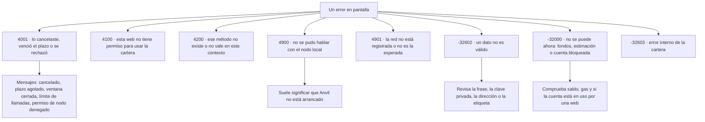

# Entidades compuestas y protocolo de TrueKeate Wallet

Este manual explica **qué información maneja la cartera por dentro** (las «entidades»: cuentas, redes, solicitudes, sesiones, registros…), **cómo se hablan entre sí las piezas del programa** (el «protocolo»: los mensajes que se envían) y **qué significan los errores** que puedes ver en pantalla.

Tres palabras que aparecerán mucho:

- **Entidad.** Un tipo de información con campos concretos. Por ejemplo, una «cuenta importada» tiene dirección, clave privada, etiqueta, fecha y visibilidad.
- **Protocolo.** El conjunto cerrado de mensajes que las piezas usan para pedirse cosas. «Cerrado» significa que no se admiten mensajes inventados.
- **EIP-1193.** El estándar que usan las páginas web para hablar con carteras como esta. Define, entre otras cosas, que todo error debe llevar un número.

> Aviso de honestidad: todo lo que se afirma aquí procede de leer el repositorio. Lo que no se ha podido verificar se marca como «pendiente de confirmar».

## Empezar en 5 minutos

### Qué necesitas

- Un navegador Chrome o Edge, versión **114 o superior**.
- Node.js instalado, para compilar la extensión y arrancar la página de pruebas.
- El proyecto descargado en tu equipo y, si quieres trastear, Foundry con **Anvil** (el nodo de blockchain local que trae Foundry).

### Qué vas a conseguir

Una cartera que funciona **solo contra tu red local de pruebas**: sin dinero real, sin conexión a internet y sin riesgo. Verás la red «Anvil Local» (`http://127.0.0.1:8545`, `chainId` 31337) y podrás conectar una página de pruebas desde `http://localhost:5174/test.html`.

### Los pasos mínimos

1. Instala las dependencias del proyecto con `npm ci`.
2. Arranca el nodo local con
   `anvil --host 127.0.0.1 --port 8545 --chain-id 31337 --allow-origin "chrome-extension://oiahebaliobknoeeonhgaacapjcpgblo,http://localhost:5174,http://127.0.0.1:5174"`.
3. Compila la extensión con `npm run build`.
4. Carga la carpeta generada como extensión descomprimida en tu navegador (modo desarrollador) y fíjate en que su identificador es `oiahebaliobknoeeonhgaacapjcpgblo`.
5. Arranca la página de pruebas con `npm run dev` y abre `http://localhost:5174/test.html`.
6. Pulsa «Conectar» en la página de pruebas: se abrirá la ventana de conexión de la cartera (420 × 650 píxeles) y tendrás **60 segundos** para decidir.
7. Aprueba con la cuenta número 0 de Anvil (`0xf39Fd6e51aad88F6F4ce6aB8827279cffFb92266`), que empieza con 10 000 ETH de prueba.

> La frase de prueba de Anvil (`test test test test test test test test test test test junk`) es solo una pista de desarrollo. **Nunca** se guarda como cartera del usuario.

## Entidades compuestas

Las entidades viven todas en un mismo fichero de tipos. Hay 45 en total: 21 son alias o listas cerradas de valores y 24 son fichas con campos. Aquí se explican las que importan para entender el día a día.

### Alias de dominio — `types.ts:22-43`

Un **alias** es un nombre corto para un tipo de dato que se repite mucho. Estos son los básicos:

| Alias | Qué significa en lenguaje llano |
|---|---|
| `Address` | Una dirección de Ethereum, con su forma de escribirse que detecta erratas (checksum EIP-55) |
| `Hex` | Una cadena de caracteres en hexadecimal, siempre empezando por `0x` |
| `WeiString` | Una cantidad de dinero en la unidad más pequeña (wei), guardada **como texto** para no perder precisión |
| `ChainIdHex` | El identificador de una red, en hexadecimal (`0x7a69` es Anvil) |
| `Uuid` | Un identificador único, del tipo que se usa para no confundir dos solicitudes |
| `AccountRef` | La forma de referirse a una cuenta: `idx:<n>` para una derivada, `imp:<dirección>` para una importada. Existe una tercera forma antigua (un número suelto) que las migraciones convierten |
| `PendingRequestsMap`, `DappSessionsByOrigin`, `InflightTxByAccount`, `RateWindowsByOrigin` | Los cuatro mapas completos que corresponden a la cola de solicitudes, las sesiones de webs, las marcas de transacción en vuelo y los contadores de llamadas |

### Uniones cerradas — `types.ts:50-129`

Una **unión cerrada** es una lista de valores permitidos. Si un valor no está en la lista, no vale.

| Lista | Valores permitidos | Cuántos |
|---|---|---|
| `ApprovalStatus` | `pending` (pendiente), `approved` (aprobada), `rejected` (rechazada), `expired` (caducada) | 4 |
| `ApprovalMethod` | Los 6 métodos que piden aprobación: `eth_sendTransaction`, `eth_signTypedData_v4`, `personal_sign`, `wallet_switchEthereumChain`, `wallet_addEthereumChain` y `wallet_revokePermissions` | 6 |
| `InternalMethod` | Los 16 métodos internos que empiezan por `wallet_` | 16 |
| `PageReadMethod` | Los 10 métodos de solo lectura que puede pedir una página | 10 |
| `PageMethod` | Lecturas + aprobables | 16 |
| `WalletMethod` | Todo lo que atiende la cartera | 32 |
| `ProviderEventName` | Los 5 avisos que la cartera envía a la página: `accountsChanged`, `chainChanged`, `connect`, `disconnect` y `message` | 5 |
| `LogCategory` | Las 5 familias del registro: `call`, `event`, `tx`, `sign`, `system` | 5 |
| `LogLevel` | Los 4 niveles de una entrada: `info`, `success`, `warn`, `error` | 4 |
| `LogEventName` | El catálogo cerrado de 24 eventos que se pueden registrar | 24 |

**`eth_sign` no está en ninguna lista y nunca se añadirá.** Ese método permitía firmar datos opacos, sin que el usuario supiera qué firmaba. Si una página lo pide, la respuesta es el error `4200`. Existe una comprobación interna que debe devolver siempre `false`; si algún día devolviera `true`, sería un defecto.

### La solicitud aprobable

Una **solicitud aprobable** es una petición que necesita tu permiso antes de ejecutarse: firmar un mensaje, enviar una transacción, cambiar de red.

#### `PendingRequest` — entrada de la cola · destino: `truekeate_pending_requests` · `types.ts:258-296`

Es la ficha de una solicitud esperando tu decisión.

| Campo | Qué es | ¿Obligatorio? |
|---|---|---|
| `approvalId` | El identificador de la solicitud | Sí |
| `method` | Qué se pide (uno de los 6 métodos aprobables) | Sí |
| `params` | Los datos de la firma, guardados **ya redactados** y con un tope de 64 KiB | Sí |
| `origin` | La web que lo pide, en formato normalizado (minúsculas, sin barra final, con puerto) | Sí |
| `tabId` / `frameId` | La pestaña y el marco que lo piden | Sí |
| `account` | La cuenta que firmará | Sí |
| `chainId` | La red activa al crear la solicitud | Sí |
| `txPreview` | Resumen de la transacción (solo si es `eth_sendTransaction`) | No |
| `typedDataPreview` | Resumen de los datos firmados (solo `eth_signTypedData_v4`) | No |
| `signMessagePreview` | Resumen del mensaje (solo `personal_sign`) | No |
| `createdAt` / `expiresAt` | Cuándo llegó y cuándo caduca: 120 segundos | Sí |
| `status` | Estado de la solicitud | Sí |
| `resolvedAt` / `errorCode` / `requestId` | Cuándo se resolvió, con qué error y con qué identificador de petición | No |

#### `TxPreview` — resumen de transacción · destino: `PendingRequest.txPreview` · `types.ts:184-213`

Es el **resumen legible** que ves antes de enviar una transacción. Su misión es que nunca firmes a ciegas.

| Campo | Qué es |
|---|---|
| `from` | La cuenta que firma |
| `to` / `toLabel` | El destino y su nombre; `null` significa «despliegue de un contrato nuevo»; si no se conoce, la etiqueta lo dice |
| `valueWei` / `valueEth` | El importe en wei y en ETH, ya formateado |
| `data` / `dataLength` / `selector` | Los datos de la llamada, su tamaño y sus primeros 4 bytes (el «selector», que identifica qué función se llama) |
| `isContractCall` | Si es una llamada a contrato (hay datos) o un simple envío |
| `functionName` / `decodedArgs` | El nombre de la función y sus argumentos, si están en la tabla local; `null` si no |
| `isUnrecognizedContractCall` | `true` cuando el selector no está en la tabla local: la cartera avisa de que no lo reconoce |
| `riskWarnings` | Avisos en español (permiso ilimitado, contrato no reconocido…) |
| `gasLimit` / `estimatedFeeEth` | El gas estimado y la comisión estimada, ya formateada |
| `estimationFailed` | Si la estimación falló, aquí va el motivo. Es un bloqueo: no se envía |
| `maxFeePerGas` / `maxPriorityFeePerGas` | Las dos tarifas del formato moderno EIP-1559 |
| `nonceInformativo` | Solo informativo: el definitivo se recalcula al aprobar |
| `txType` | El tipo de transacción, siempre `2` (EIP-1559) |
| `chainId` | La red |
| `insufficientFunds` | `true` si el valor más la comisión superan tu saldo |

#### Previews de firma — `types.ts:216-252`

Cuando firmas datos o un mensaje, la cartera construye un resumen para que veas qué estás firmando.

- **Firma de datos (`typedDataPreview`).** Incluye el `domain` (el «dominio», que declara a qué aplicación, versión y contrato corresponde la firma), el nombre del dominio, el contrato verificador, los tipos, el mensaje y el tipo principal. Dos avisos importantes: `domainChainMismatch` (la red que declara la web no es la activa) y `verifyingContractMismatch` (el contrato no existe o es la dirección cero). Si el mensaje es muy grande (más de 4096 bytes), el resumen no incluye el contenido.
- **Firma de mensaje (`signMessagePreview`).** Incluye el texto decodificado (`text`, o `null` si no es legible), si venía en hexadecimal (`isHexPayload`), cuántos bytes ocupa y el contenido original (`bytesHex`), que se usa solo para la pantalla y **nunca** se guarda en el registro de actividad.

### La conexión de dApp

Cuando una página pide conectarse, se crea una **solicitud de conexión**.

| Entidad | Campo | Qué es |
|---|---|---|
| `ConnectRequest` | `requestId` | El identificador de la petición |
| `ConnectRequest` | `origin` | La web que pide conectarse |
| `ConnectRequest` | `favicon` | El icono de la web; si no hay, el campo no está |
| `ConnectRequest` | `accounts` | Las cuentas que se te ofrecen, en orden |
| `ConnectRequest` | `currentAccountIndex` | Cuál viene preseleccionada |
| `ConnectRequest` | `chainId` | La red en el momento de la petición |
| `ConnectRequest` | `tabId` / `frameId` | La pestaña y el marco que la pidieron |
| `ConnectRequest` | `createdAt` / `expiresAt` | Cuándo se creó y cuándo caduca (60 segundos) |
| `ConnectRequest` | `status` | Estado de la petición |
| `ConnectRequestView` | `requestId`, `origin`, `accounts`, `currentAccountIndex`, `chainId`, `expiresAt` | La versión que ve la ventana de conexión. Es más corta: no incluye datos internos |

### Ventana única y observabilidad

- **`ApprovalWindow`** (la ventana única de confirmación) guarda cuatro datos: `windowId` (la ventana abierta, o `null`), `shownApprovalId` (la solicitud que se muestra), `openedAt` (cuándo se abrió) y `updatedAt` (cuándo se escribió). Su valor inicial es `{ windowId: null, shownApprovalId: null, openedAt: null, updatedAt: 0 }`.
- **`LogEntry`** (una entrada del registro de actividad) la escribe **siempre** el motor de la extensión. Guarda: `id`, `ts` (fecha), `level`, `category`, `event`, `message`, `origin`, `method`, `data` (redactado), y opcionalmente `txHash` y `txStatus`. Tiene retención FIFO (se descartan las más antiguas) y es la única clave que sobrevive al reset.

### Cartera, ajustes y redes

#### `TruekeateSettings` — ajustes persistidos · destino: `truekeate_settings` · `types.ts:402-425`

Es la ficha de ajustes: cuántas cuentas derivadas hay, sus etiquetas, cuáles están ocultas y todos los límites de la cartera (cola, sesiones, registro, idioma).

| Campo | Qué es |
|---|---|
| `derivedAccountCount` | Cuántas cuentas derivadas hay cargadas |
| `accountLabels` | Las etiquetas de las derivadas, con el índice de derivación como clave |
| `hiddenAccounts` | Los índices de las derivadas ocultas: una derivada nunca se borra, solo se oculta |
| `balancePollMs` / `balancePollMaxAccounts` | Cada cuánto se consultan los saldos y cuántas cuentas por ciclo |
| `logLimit` / `logMaxPerOrigin` | Cuántas entradas guarda el registro en total y por web |
| `sessionTtlMs` | Cuánto dura una sesión de web |
| `pendingRequestsMax` / `pendingRequestsMaxPerOrigin` / `pendingRequestsPerMinute` | Los tres límites de la cola |
| `language` | El idioma de la interfaz |
| `encryptionEnabled` / `requirePasswordOnOpen` | Cifrado y contraseña. Se descartaron por decisión de diseño y el valor queda fijado en `false` |
| `devNoticeAcceptedAt` | Cuándo aceptaste el aviso de entorno de desarrollo. No se puede borrar ni mover |

#### Cartera y redes — `types.ts:428-452` y `:547-550`

- **`ImportedAccount`** (cuenta importada): `address`, `privateKey`, `label` (máximo 32 caracteres), `importedAt` y `visible`.
- **`StoredNetwork`** (red guardada): `chainId`, `chainIdDecimal`, `name`, `rpcUrl` (la dirección del nodo), `symbol`, `decimals`, `isTestnet`, `isDefault` (red del primer arranque; dar de alta una red **nunca** la activa) y, si la red lo declara, `explorerUrl`.
- **`StoredWallet`** (la cartera, como vista): la frase de recuperación y la referencia de la cuenta activa.

#### `NetworkPreview` — vista de red · canal: preview de `wallet_switchEthereumChain` y `wallet_addEthereumChain` · `types.ts:459-477`

Es el resumen que ves al cambiar o añadir una red: si es un cambio o un alta (`kind`), el identificador de la red, su nombre, su nodo, su moneda, sus decimales, si es de pruebas y, si no lo es, un **aviso literal** (`warning`). También indica cuál era la red activa y, en un alta, si la red ya existía (`alreadyRegistered`) y la nota de que añadir **no** activa (`activationNote`).

### Sesiones, exclusión mutua y tasa

Aquí se reúnen tres entidades que trabajan juntas para controlar quién puede hacer qué.

| Entidad | Campo | Qué es |
|---|---|---|
| `DappSession` | `origin`, `account`, `chainId` | La web conectada, la cuenta compartida y la red de la conexión |
| `DappSession` | `tabIds` | Las pestañas asociadas. Es un dato interno: **no** se muestra en pantalla |
| `DappSession` | `connectedAt`, `lastUsedAt`, `expiresAt` | Cuándo se conectó, cuándo se usó por última vez y cuándo caduca (`null` = sin caducidad) |
| `DappSession` | `connected` | Si la sesión está viva. `false` la invalida aunque no haya caducado |
| `ConnectedSiteView` | Los campos anteriores más `current` | La versión que ve la pantalla de sitios conectados; `current` indica si la sesión está vigente ahora |
| `InflightTx` | `account`, `approvalId`, `phase` | La cuenta marcada, la solicitud que lo originó y la fase: `signing` (firmando, **bloquea** la cuenta) o `broadcast` (ya difundida, no bloquea) |
| `InflightTx` | `nonce`, `txHash`, `startedAt`, `expiresAt` | El número de orden, la huella de la transacción (`null` mientras firma), cuándo empezó y cuándo caduca (3 minutos) |
| `RateWindow` | `tokens`, `lastRefillAt`, `approvalWindowStart`, `approvalsInWindow`, `deniedCount`, `updatedAt` | El contador de llamadas por web: fichas disponibles, recargas, la ventana de 60 segundos, cuántas solicitudes aprobables se han contado, cuántas se han rechazado y cuándo se escribió |

### Superficies EIP-1193, EIP-6963 e integridad

Estas entidades **no se guardan**: viven solo mientras la página está abierta.

- **`RequestArguments`**: lo que pide una web, con su `method` y sus `params`.
- **`Eip1193Error`**: un error con `code` (número), `message` (texto en español) y `data` (información de diagnóstico opcional).
- **`Eip1193Provider`**: el objeto con el que la web llama a la cartera: `request`, `on` (suscribirse a avisos) y `removeListener` (darse de baja).
- **`TruekeateProvider`**: la identidad de la cartera dentro de la página: `isTrueKeate` (siempre `true`), la red cacheada y la cuenta activa cacheada.
- **`Eip6963ProviderInfo`**: cómo se presenta la cartera a la página: un identificador que **nunca** se regenera, el nombre corto `TrueKeate`, el icono y el identificador inverso de dominio `academy.codecrypto.truekeate`.
- **`Eip6963ProviderDetail`**: la pareja formada por la identidad y el objeto provider.
- **`WalletIntegrityView`**: el informe de salud de la cartera. Su estado puede ser `absent` (no hay cartera), `ok` (todo bien) o `damaged` (dañada). Incluye la etiqueta «Wallet dañada» cuando procede, la lista de problemas en español, si hay frase guardada, si la frase es válida y si se puede derivar sin dañar nada. Nunca incluye material de la cartera.

### Nombres del encargo que no existen literalmente en el código

Algunos nombres que se usan en la documentación son traducciones, no nombres reales:

- `NetworkEntry` es en realidad `StoredNetwork`.
- `ConnectedSite` corresponde a `DappSession` cuando es la sesión guardada y a `ConnectedSiteView` cuando es la versión de pantalla.
- `AccountLabels` es el campo `accountLabels` de los ajustes, no una entidad propia.
- `Settings` es `TruekeateSettings`.
- Sí existen con esos nombres: `PersonalSignPreview`, `InternalMethod`, `PageMethod`, `ApprovalMethod` y `Uuid`.

## Los 8 tipos de mensaje

Las piezas del programa se hablan con **8 tipos de mensaje**, ni uno más. Cada uno tiene un canal (por dónde viaja) y una guarda (la comprobación que impide que lo use quien no debe).

| Mensaje | Quién lo envía y a quién | Por dónde viaja | Qué lleva |
|---|---|---|---|
| `TRUEKEATE_REQUEST` | De la página al script de contenido | Mensaje de ventana | Identificador, método y parámetros |
| `TRUEKEATE_RESPONSE` | Del script de contenido a la página | Mensaje de ventana | Identificador, resultado o error |
| `TRUEKEATE_EVENT` | Del motor a la página | Canal interno y luego mensaje de ventana | Nombre del evento y datos. Se reenvía **literal**: no se transforma ni se filtra |
| `TRUEKEATE_ANNOUNCE` | De la página a su propia ventana | Mensaje de ventana y evento personalizado | La identidad de la cartera (EIP-6963) |
| `TRUEKEATE_RPC` | Del script de contenido o el popup al motor | Canal interno de la extensión | Método, parámetros, origen, pestaña, marco e identificador de petición |
| `SIGN_RESPONSE` | De la ventana de decisión al motor | Canal interno | Qué solicitud, si se aprobó y, si no, el error |
| `CONNECT_RESPONSE` | De la ventana de conexión al motor | Canal interno | Qué petición, si se aprobó, qué cuenta y con qué posición |
| `RESUME` | Del script de contenido o el popup al motor | Canal de larga duración | Qué aprobación se está esperando |

Las guardas que protegen estos mensajes son tres: que el emisor pertenezca a la propia extensión (si no, error `4100`), que el origen se recalcule siempre en el motor (no se cree lo que dice la página) y que los métodos internos solo se admitan en contextos de la extensión (si no, error `4200`).

### Campos que son dato NO fiable

Cuatro campos llegan desde fuera y **no** se pueden creer. Esto es importante para entender por qué la cartera hace comprobaciones que parecen redundantes:

| Campo | Por qué no se puede creer | Qué hace la cartera |
|---|---|---|
| `origin` | Lo declara el script de contenido, y una página puede mentir | Lo **recalcula** a partir del emisor real y lo normaliza |
| `tabId` | Puede no corresponder al emisor real | Lo toma del emisor del mensaje, no de lo que venga en el contenido |
| `frameId` | Si no es el marco principal, el respaldo por dirección de pestaña daría la dirección equivocada | Lo guarda en la solicitud y entrega la respuesta **solo** a ese marco |
| `requestId` | Es un identificador puesto por la página | El motor **no lo interpreta**: solo lo guarda para poder devolver la respuesta con el identificador que la página espera |

## Catálogo RPC

El **catálogo** es la lista cerrada de todo lo que la cartera atiende. Para cada método se declara qué tipo es, desde dónde se puede invocar, si requiere aprobación y si está implementado.

### Lecturas de página (no aprobables, `context: 'any'`)

Estos 10 métodos se pueden pedir sin abrir ninguna ventana, porque solo leen información:

| Método | Qué hace |
|---|---|
| `eth_requestAccounts` | Pide conectarse. No crea una solicitud de firma, pero **abre la ventana de conexión** |
| `eth_accounts` | Devuelve las cuentas ya autorizadas. Nunca abre ventana |
| `eth_chainId` | Devuelve la red activa |
| `eth_blockNumber` | Devuelve el número del último bloque |
| `eth_getBalance` | Consulta el saldo de una cuenta |
| `eth_estimateGas` | Estima el gas de una operación |
| `eth_gasPrice` | Consulta el precio del gas |
| `eth_feeHistory` | Consulta el histórico de comisiones |
| `eth_getTransactionByHash` | Busca una transacción por su huella |
| `eth_getTransactionReceipt` | Busca el recibo de una transacción |

### Aprobables (crean `PendingRequest` y abren `notification.html`)

Estos 6 métodos **siempre** pasan por tu decisión (o casi siempre, según el caso):

| Método | Cuándo pide aprobación |
|---|---|
| `eth_sendTransaction` | Siempre: es el envío de una transacción |
| `eth_signTypedData_v4` | Siempre: es una firma de datos estructurados |
| `personal_sign` | Siempre: es la firma de un mensaje |
| `wallet_switchEthereumChain` | Cuando la red de destino no es la activa |
| `wallet_addEthereumChain` | Siempre, y además pide permiso de acceso a la dirección del nodo |
| `wallet_revokePermissions` | Desde una página sí; desde el popup del propio cartera es revocación directa, sin ventana |

### Internos `wallet_*` (solo contextos de la extensión)

Son **16 métodos internos**. Solo se pueden invocar desde las páginas de la propia cartera, nunca desde una web:

| Método | Para qué sirve |
|---|---|
| `wallet_generateMnemonic` | Genera una frase de recuperación. No guarda nada |
| `wallet_importMnemonic` | Crea o restaura la cartera desde una frase |
| `wallet_deriveAccounts` | Deriva cuentas nuevas |
| `wallet_importPrivateKey` | Importa una cuenta con su clave privada |
| `wallet_getNetworks` | Consulta el catálogo de redes |
| `wallet_getLogs` | Consulta el registro de actividad |
| `wallet_revealSecret` | Revela un secreto, con confirmación explícita |
| `wallet_getState` | Pide el estado completo de la cartera |
| `wallet_setCurrentAccount` | Cambia la cuenta activa |
| `wallet_addDerivedAccount` | Añade una cuenta derivada |
| `wallet_renameAccount` | Cambia la etiqueta de una cuenta |
| `wallet_setAccountVisible` | Muestra u oculta una cuenta |
| `wallet_deleteImportedAccount` | Borra una cuenta importada |
| `wallet_resetWallet` | Resetea la cartera, con confirmación destructiva |
| `wallet_acceptDevNotice` | Acepta el aviso de entorno de desarrollo |
| `wallet_getConnectRequest` | Consulta una solicitud de conexión (lo usa la ventana de conexión) |

### Métodos que NO están en el catálogo

- **`eth_sign` no existe.** No está en ninguna lista y nunca se añadirá. Si se pide, la respuesta es `4200 unsupportedMethod`, **sin** crear nada en la cola y **sin** abrir ventana.
- **Cualquier otro método desconocido** recibe la misma respuesta.
- **Un método interno pedido desde una página** se rechaza con `4200 methodNotAllowedInContext`.

## Errores EIP-1193

La cartera usa una tabla cerrada de **8 códigos de error** y **37 causas**. Un mismo código puede corresponder a varias causas, cada una con su mensaje propio; el mensaje por defecto de un código es el de su primera causa.

Esta es la traducción a lenguaje llano de los 8 códigos que puede ver el usuario:

| Código | Qué significa | Cuándo lo ves |
|---|---|---|
| `4001` | Cancelado: tú rechazaste, se cerró la ventana o se agotó el tiempo | Al rechazar una solicitud, cerrar la ventana de decisión sin responder, superar el plazo (120 s para firmar, 60 s para conectar), pasarse del límite de llamadas, no dar permiso de acceso a un nodo o tener demasiadas solicitudes pendientes |
| `4100` | Esta web no tiene permiso para usar la cartera | Cuando una página sin sesión autorizada pide algo, o el emisor del mensaje no es de fiar |
| `4200` | Ese método no existe o no vale aquí | Con `eth_sign`, con cualquier método desconocido y con un método interno pedido desde una página |
| `4900` | No se pudo hablar con el nodo | Cuando el nodo local (Anvil) está caído, después de agotar los reintentos |
| `4901` | La red no está registrada, o no es la que se esperaba | Cuando la red pedida no está dada de alta o no coincide con la activa; también si el nodo declara una red distinta |
| `-32602` | Un dato no es válido | Frase incorrecta, clave privada inválida, dirección mal formada, cuenta repetida, carga de más de 64 KiB, cuenta desconocida, importe mal formado, etiqueta fuera de 1..32 caracteres, dirección de nodo no válida o datos de red inutilizables |
| `-32000` | La operación no se puede hacer ahora | Fondos insuficientes, número de orden rechazado, estimación de gas fallida, cuenta en uso por una web conectada, reset bloqueado, transacción ya en vuelo o red que rechaza la transacción |
| `-32603` | Error interno de la cartera | Fallo no clasificado, identificador repetido, falta de espacio en el almacén, difusión interrumpida, cartera dañada, fallo del portapapeles o fallo de escritura de una migración |

<!-- GENERAR_IMAGEN: mapa-errores.svg -->

### Códigos que NO existen

**`4902` no está en el fichero de errores.** Los códigos reales son ocho: `4001`, `4100`, `4200`, `4900`, `4901`, `-32000`, `-32602` y `-32603`. Si aparece un `4902` (un código del estándar EIP-3085 para redes no reconocidas), la cartera responde **`4901`**.

### Invariantes del catálogo de errores

- **Todo error que ve el usuario lleva un `code` numérico.** Es una comprobación del propio código.
- **Un código admite varias causas**, una por mensaje.
- **Ningún mensaje se inventa fuera de la tabla.** Si se pide el mensaje de una causa desconocida, se degrada a `-32603`.

## Estados y transiciones

Una **transición** es un cambio de estado: una solicitud pasa de pendiente a aprobada, una transacción pasa de difundida a confirmada, etc. Los estados están cerrados: no hay valores intermedios inventados.

### Ciclo de vida de una solicitud de la cola

Los estados posibles de una solicitud son **`pending`**, **`approved`**, **`rejected`** y **`expired`**.

| Transición | Qué la provoca |
|---|---|
| (nada) → `pending` | Llega la solicitud; se le pone un plazo de 120 segundos |
| `pending` → `approved` | Tú apruebas |
| `pending` → `rejected` | Tú rechazas, cierras la ventana o desaparece la pestaña |
| `pending` → `expired` | Se agota el plazo. **Manda `expired`**, aunque hubiera otra decisión en curso |
| Resuelta → fuera de la lista | Al limpiar, desaparece. Si no hubo aprobación, se anota el código `4001` |

### Ciclo de vida de una transacción

Los estados internos de una transacción son **`pending`**, **`confirmed`**, **`reverted`** y **`failed`**.

| Transición | Qué la provoca |
|---|---|
| → `pending` | Se difundió y empieza el seguimiento |
| → `confirmed` | El recibo dice que fue bien |
| → `reverted` | El recibo dice que la operación se deshizo |
| → `failed` | La difusión se rechazó o se agotó el plazo de seguimiento |

Ojo con un detalle: el estado que se **guarda en el registro de actividad** solo admite **3** valores, porque «deshecha» y «fallida» se agrupan en `failed`.

### Ciclo de vida de la marca «transacción en vuelo»

La marca admite dos fases: **`signing`** (firmando) y **`broadcast`** (ya difundida). De cara a la cuenta, el estado se resume en **`free`** (libre), **`signing`** o **`broadcast`**.

- Pasa a `signing` **antes** de firmar: mientras tanto, la cuenta queda bloqueada.
- Pasa a `broadcast` cuando llega la huella del nodo.
- Se elimina al confirmarse, al fallar, al deshacerse o al caducar (3 minutos).
- Se reconstruye al arrancar el motor.

### Estado de integridad de la cartera

El informe de salud admite tres valores: **`absent`** (no hay cartera), **`ok`** (todo correcto) y **`damaged`** (dañada). Cuando algo no cuadra, la etiqueta visible es «Wallet dañada».

Los avisos posibles son: forma de la frase incorrecta, suma de control de la frase incorrecta, forma de dirección incorrecta, suma de control de dirección incorrecta, clave importada que no corresponde y cuenta activa que no existe. La cartera publica además si se puede usar sin riesgo.

### Estado de la ventana única de aprobación

Solo puede haber **una** ventana de decisión abierta. Los estados y sus reglas:

| Situación | Regla que se cumple |
|---|---|
| No hay ventana | El identificador guardado es `null` |
| Hay ventana | Hay exactamente una ventana de decisión, de 420 × 640 píxeles |
| Qué se muestra | Siempre la solicitud pendiente **más antigua** |
| La mostrada se resuelve | Se pinta la siguiente en la **misma** ventana |
| No queda ninguna pendiente | Se cierra la ventana y el identificador vuelve a `null` |
| La cierras tú | Se decide el desenlace: si no ha vencido el plazo, equivale a rechazar |
| Arranque del motor | La ventana se localiza de nuevo por su dirección y se restablece la regla |

### Otros estados con literales cerrados

- **Reset:** `done` (hecho), `blocked` (bloqueado), `cancelled` (cancelado) y `failed` (falló). El orden de guardas es estricto: cola vacía, sin transacción en vuelo, confirmación destructiva y limpieza.
- **Ventana de tasa:** se reinicia si el reloj va hacia atrás o si han pasado 60 segundos. Si no quedan fichas, se rechaza **sin ejecutar** la llamada. Las peticiones nacidas dentro de la propia cartera no consumen fichas.
- **Alarmas:** cada solicitud pendiente tiene una alarma de vencimiento, y cada transacción en vuelo también. Se rearman al arrancar y se cancelan al resetear.

## Divergencias

Se han detectado diferencias entre el diccionario del proyecto (la norma escrita) y el código. Se documentan las dos versiones; ninguna se ha «corregido» desde este manual.

| Aspecto | Dice la norma | Dice el código |
|---|---|---|
| Resumen de firma de datos | Incluye huella, tamaño y marca de redacción | Esos campos viven en un tipo ampliado, no en el tipo principal |
| Resumen de firma de mensaje | Incluye huella y marca de recorte | Igual: viven en el tipo ampliado |
| `PendingRequest.requestId` | No aparece en la tabla | Es un campo opcional de correlación |
| `DappSession` | No declara `tabIds` ni `connected` | El código los exige |
| `ConnectRequest.favicon` | Texto o nulo, obligatorio | Opcional: se omite si no hay icono |
| Ajustes | No declara `devNoticeAcceptedAt` | El campo existe y se escribe |
| Alarmas en memoria | Un mapa en memoria | **No existe** ese mapa: las alarmas viven en el navegador y se rearman por nombre |
| Orden por cuenta | Un mapa de esperas | **No existe** con ese nombre; el orden real está en otras estructuras |
| Cerrojo de escritura | Un tipo de promesa | Es un objeto con dos operaciones |
| Mensaje de evento | Listado como mensaje interno | Se modela como mensaje de página (aunque viaje por el canal interno en el primer salto) |
| Métodos internos | La norma enumera menos de los que hay | El código declara **16** |
| Causa «nodo rechazó» | Registrada como causa propia | **No tiene fila propia**: se entrega con el mensaje de «estimación fallida» |
| Clave no oficial | Sin causa registrada | Se clasifica como `-32603` con el motivo `non-canonical-key` |
| Claves del almacén | 14 canónicas | 14 canónicas, más `truekeate_schema_version` y `truekeate_logs_dropped` fuera de la lista |

### Pendiente de confirmar

- Si la ventana de aprobación pinta un indicador distinto del contador de solicitudes pendientes. El cálculo existe, pero su pintado pertenece a la pantalla y no se ha leído aquí.
- La versión exacta del manifiesto y su versión mínima de Chrome: no se ha leído el fichero del manifiesto. (El dato confirmado del producto es: Manifest V3 y `minimum_chrome_version` 114.)

## Problemas frecuentes

### La página de pruebas dice que no hay ninguna cartera instalada

**Causa.** El identificador de la extensión importa. La página de pruebas solo reconoce la cartera si el identificador coincide, y el nodo local solo acepta peticiones de ese identificador y de los dos orígenes locales.

**Solución.** Comprueba que la extensión cargada tiene el identificador `oiahebaliobknoeeonhgaacapjcpgblo` y que arrancaste Anvil con el parámetro `--allow-origin` que incluye ese identificador y `http://localhost:5174`. Si recargas la extensión y cambia el identificador, vuelve a arrancar el nodo con el valor nuevo.

### Todo falla con «no se pudo hablar con el nodo» (`4900`)

**Causa.** El nodo local no está en marcha. Es el error más habitual al empezar: la cartera está bien, pero no hay nadie al otro lado.

**Solución.** Arranca Anvil en `127.0.0.1:8545` con `chainId` 31337. Si ya estaba arrancado, mira que no se haya cerrado la ventana donde corre. La cartera reintenta varias veces antes de dar este error, así que si aparece es que el nodo lleva un rato sin responder.

### La web se queja de que no tiene permiso (`4100`)

**Causa.** La página no tiene sesión autorizada para esa cuenta, o el mensaje no viene de un emisor de confianza. La cartera no se cree el origen que declara la página: lo recalcula.

**Solución.** Vuelve a conectar la web desde `eth_requestAccounts` y elige una cuenta que esté realmente en la lista ofrecida. Si intentas usar una cuenta que no se ofreció, la respuesta será `4100` y no se creará sesión.

### La página pide `eth_sign` y no funciona

**Causa.** Es intencionado. `eth_sign` permitía firmar datos opacos, sin mostrar al usuario qué se firmaba. Por eso **no existe** en esta cartera y nunca se añadirá.

**Solución.** No hay nada que arreglar: la página debe usar un método que muestre el contenido, como `personal_sign` o `eth_signTypedData_v4`. La cartera responde `4200` para dejar claro que el método no está soportado.

### Aparece «hay demasiadas solicitudes pendientes»

**Causa.** Se ha superado algún límite de la cola: 8 solicitudes en total, 1 por web o 6 por minuto y web.

**Solución.** Atiende lo que está pendiente en la ventana de decisión (aprueba o rechaza) o espera unos segundos a que se renueve el minuto. El límite existe para que una web no pueda inundar la cartera con peticiones.

### Un aviso de firma no se cierra y luego da error de plazo

**Causa.** La ventana de decisión tiene un plazo de 120 segundos para firmar y de 60 segundos para conectar. Si el plazo se agota, la solicitud caduca y prevalece el estado «caducada», aunque estuvieras decidiendo en ese momento.

**Solución.** Decide dentro del plazo. Si se agota, vuelve a lanzar la operación desde la página: es más rápido que esperar a que la cartera recupere una solicitud ya caducada.

### El resumen de la transacción dice «contrato no reconocido»

**Causa.** El selector de la llamada no está en la tabla local de funciones conocidas. La cartera no puede traducir qué se va a ejecutar, así que lo dice claramente en lugar de fingir que lo entiende.

**Solución.** No es un error del programa, es información útil: revisa el destino y los datos, o desconfía si no esperabas esa llamada. Si además aparece un aviso de permiso ilimitado, piensa dos veces antes de aprobar.

### El informe dice «Wallet dañada» y no puedo usar la cartera

**Causa.** La comprobación de integridad ha encontrado una incoherencia, por ejemplo en la lista de cuentas derivadas. La cartera prefiere bloquear antes que arriesgarse a firmar con la cuenta equivocada.

**Solución.** Es una protección. Restaura la cartera desde su frase de recuperación (o desde la clave privada de la cuenta importada) y, si el problema se reproduce, anota el aviso exacto que aparece en el informe antes de resetear.
