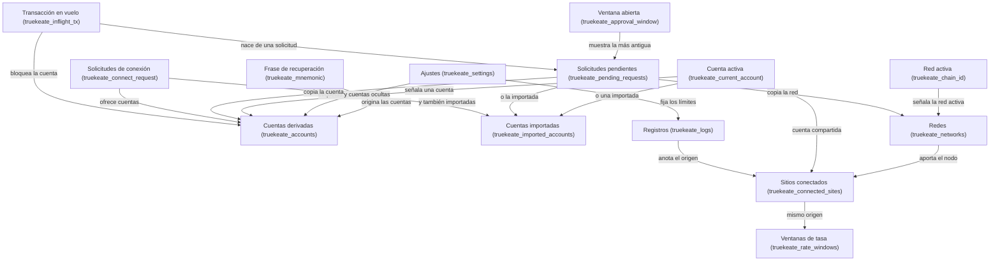

# Modelo de datos y diagrama relacional de TrueKeate Wallet

Este manual explica, sin tecnicismos, **qué información guarda la cartera** y **cómo se relacionan esas piezas entre sí**: qué depende de qué, qué apunta a qué y qué se puede quedar sin pareja.

Conviene tener claras tres palabras:

- **Modelo de datos.** El mapa de todo lo que se guarda y de las uniones entre las piezas.
- **Relación.** Un vínculo entre dos piezas. Por ejemplo: «una cuenta tiene, como mucho, una etiqueta».
- **Cardinalidad.** Cuántas piezas pueden participar en una relación: una (`1`), ninguna o una (`0..1`), muchas (`N`).

La cartera **no usa una base de datos**: guarda todo en el almacén del navegador (`chrome.storage.local`), en forma de mapas y listas. Este manual traduce ese almacén a un mapa mental fácil de seguir.

> Aviso de honestidad: todo lo que aquí se afirma procede de leer el repositorio. Lo que no se ha podido verificar se marca como «pendiente de confirmar».

## Descripción textual del modelo

El almacén tiene **14 claves oficiales**, todas con el prefijo `truekeate_`, más **dos nombres fuera de esa lista**: `truekeate_schema_version` (una constante documental para las pruebas de migración) y `truekeate_logs_dropped` (el contador de entradas descartadas por falta de espacio, que sobrevive al reseteo).

El **único que escribe** en el almacén es el motor de la extensión (el Service Worker). El popup y las otras ventanas solo leen o piden datos por mensaje. Esto es importante: evita que una pantalla lea un mapa a medio escribir.

### Cuentas, derivación, etiquetas y visibilidad

La **frase de recuperación** es el origen de las **cuentas derivadas**. La relación entre ambas es de uno a muchos, y con un detalle peculiar: **la posición en la lista es el número de cuenta**. La cuenta número 2 es siempre la tercera de la lista; no hay un campo que lo diga, lo dice el orden.

Las **cuentas importadas** son distintas: cada una es una ficha independiente con su clave privada y su etiqueta, y **no** usan el mapa de etiquetas de las derivadas.

Además:

- Las **etiquetas de las derivadas** viven en los ajustes, con el número de cuenta como clave. Si no hay etiqueta, se usa una por defecto.
- La **visibilidad** de una derivada se guarda como una lista de números ocultos. Ocultar **no** borra la dirección: una derivada nunca se elimina.
- La **cuenta activa** es un único dato que apunta a una derivada **o** a una importada, nunca a las dos. Si el dato guardado ya no existe, se resuelve a la primera cuenta disponible sin reescribir el almacén.

| Relación | Cardinalidad | Dónde se guarda |
|---|---|---|
| Frase → cuentas derivadas | Una frase, muchas cuentas | `truekeate_accounts` (la posición es el número de cuenta) |
| Cuenta derivada ↔ etiqueta | Una cuenta, cero o una etiqueta | `accountLabels` de los ajustes |
| Cuenta derivada ↔ ocultación | Una cuenta, cero o una marca de oculta | `hiddenAccounts` de los ajustes |
| Cuenta importada ↔ su clave y su etiqueta | Uno a uno | `truekeate_imported_accounts` |
| Cuenta activa → una derivada o una importada | Una, o ninguna | `truekeate_current_account` |

### Origen ↔ sesión ↔ cuenta autorizada

Una **sesión** es el permiso que una página web tiene para ver tu cuenta. Se guarda en un mapa donde la clave es el **origen** de la web (su dirección normalizada).

Reglas del modelo:

- **Una sesión por web.** Exactamente una entrada por origen.
- **Una cuenta por sesión**, que puede ser derivada o importada.
- La sesión nace cuando tú eliges la cuenta en la ventana de conexión y se **renueva con cada uso**.
- La sesión se considera caducada si ha pasado su plazo o si está marcada como desconectada. La limpieza es **perezosa**: se hace al consultar, no por un temporizador.
- Cada sesión guarda las **pestañas** que la han usado (relación interna que no se muestra en pantalla) y la **red** que había al conectar. Esa red es una referencia histórica, no un enlace vivo.
- Las **ventanas de tasa** (el contador de llamadas por minuto) usan la misma clave de origen: una ventana por web. Puede existir una ventana sin sesión, porque el contador cubre todo lo que la web puede pedir.
- Cuando cambias de cuenta activa, la cuenta de **todas** las sesiones vigentes se actualiza sin borrarlas.

| Relación | Cardinalidad | Dónde |
|---|---|---|
| Web ↔ sesión | Una a una | `truekeate_connected_sites[origen]` |
| Sesión → cuenta autorizada | Muchas sesiones, una cuenta | Campo `account` de la sesión |
| Sesión ↔ pestañas | Una sesión, muchas pestañas | Campo `tabIds` |
| Web ↔ ventana de tasa | Una a una | `truekeate_rate_windows[origen]` |
| Cuenta activa → sesiones vigentes | Una cuenta, muchas sesiones | Se actualizan al cambiar de cuenta |

### Solicitud aprobable ↔ cola ↔ ventana única ↔ marca en vuelo

Una **solicitud aprobable** es una petición que espera tu decisión. Se guarda en una cola con un identificador por entrada.

- **Una solicitud, un resumen.** Según el método, la solicitud lleva **uno solo** de sus tres resúmenes: transacción, datos firmados o mensaje.
- **Copia, no enlace.** La solicitud guarda una **copia** de la cuenta y de la red. Si luego ocultas la cuenta o borras la red, la solicitud conserva su copia y sigue siendo comprensible.
- **La ventana única** es un único dato que apunta, como mucho, a **una** solicitud pendiente: siempre la más antigua. Sobre muchas solicitudes en espera, solo una se muestra.
- **La marca de «transacción en vuelo»** es un mapa por cuenta: como máximo una entrada por dirección. Nace de la solicitud que la originó (muchas marcas pueden apuntar a solicitudes distintas, pero cada una a una sola).
- Cada solicitud pendiente tiene su **alarma de vencimiento**, que vive en el navegador y se rearma al arrancar.
- Las **solicitudes de conexión** siguen el mismo patrón: un mapa por identificador, con **muchas cuentas ofrecidas** (de ahí su cardinalidad de muchos a muchos), una sola red y su propia ventana.

| Relación | Cardinalidad | Dónde |
|---|---|---|
| Identificador ↔ entrada de cola | Uno a uno | `truekeate_pending_requests[approvalId]` |
| Solicitud ↔ resumen | Una solicitud, cero o un resumen (según el método) | `txPreview`, `typedDataPreview` o `signMessagePreview` |
| Solicitud → cuenta y red | Muchas solicitudes, una cuenta y una red | Copia de `account` y `chainId` |
| Ventana única ↔ solicitud mostrada | Una ventana, cero o una solicitud | `shownApprovalId` |
| Cola ↔ ventana única | Muchas solicitudes, **una sola ventana** | `truekeate_approval_window` |
| Cuenta ↔ marca en vuelo | Uno a uno | `truekeate_inflight_tx[address]` |
| Marca → solicitud que la originó | Muchas marcas, una solicitud cada una | `InflightTx.approvalId` |
| Solicitud pendiente ↔ alarma | Uno a uno | Alarma `truekeate_expire:<approvalId>` |
| Identificador ↔ solicitud de conexión | Uno a uno | `truekeate_connect_request[requestId]` |
| Solicitud de conexión ↔ cuentas ofrecidas | Muchos a muchos | `ConnectRequest.accounts` |

### Red por defecto ↔ redes añadidas ↔ permisos de host

El **catálogo de redes** es un mapa: la clave es el identificador de la red y el valor, su ficha (nombre, nodo, moneda…).

- **Una entrada por red** y **exactamente una** marcada como red por defecto: «Anvil Local».
- La **red activa** es un único dato que debe existir en el catálogo. Si no existe, se cae a la red por defecto. Por eso la relación es «una red o ninguna, con vuelta al valor por defecto».
- El **permiso de acceso a un nodo** no es una pieza aparte: la concesión se registra **por red** y la propia ficha guardada es la prueba de que la red está autorizada. Al añadir una red se pide el permiso al navegador y, si se deniega, **no se guarda nada** y la respuesta es `4001`.
- **Añadir una red nunca la activa.** La relación «añadir → activar» no existe por diseño: son dos acciones distintas.

| Relación | Cardinalidad | Dónde |
|---|---|---|
| Red activa → red guardada | Una o ninguna | `truekeate_chain_id` → `truekeate_networks[chainId]` |
| Red ↔ permiso de nodo | Uno a uno | La ficha de la red da fe de la concesión |
| Red por defecto | Una de todas | Campo `isDefault` |
| Alta de red → red activa | Ninguna (a propósito) | El alta no escribe el dato de red activa |

### Logs ↔ origen y ajustes ↔ avisos aceptados

El **registro de actividad** es una lista ordenada por fecha. Cada entrada lleva el origen de la web o la palabra `extension`.

- La relación con las sesiones es de muchas entradas a una web. Cuando el origen es `extension`, no hay sesión: por eso esa relación es «cero o una».
- El registro lo escribe **solo** el motor, con retención FIFO (se descartan las entradas más antiguas) acotada por dos límites: uno global y otro por web.
- Los **ajustes** son únicos (una cartera, unos ajustes) y fijan los límites de la cola, de las sesiones y del registro.
- La **aceptación del aviso de entorno** es un dato que no se puede borrar ni desplazar: la primera aceptación fija el momento.
- `truekeate_schema_version` es una constante documental sin relación con nada.

| Relación | Cardinalidad | Dónde |
|---|---|---|
| Entrada de registro → web (sesión) | Muchas a una (o ninguna si es `extension`) | Campo `origin` |
| Ajustes ↔ cartera | Uno a uno | `truekeate_settings` |
| Ajustes ↔ retención del registro | Uno a uno | `logLimit`, `logMaxPerOrigin` |
| Ajustes ↔ aviso aceptado | Uno, cero o uno | `devNoticeAcceptedAt` |
| Versión de esquema | Sin relación | Constante documental |

### Relaciones que NO existen (y por qué)

Es tan importante saber qué hay como saber qué **no** hay. Cuatro ausencias deliberadas:

- **No hay enlace entre solicitud y ventana.** La solicitud ya no guarda qué ventana la muestra; el vínculo se deduce del dato «solicitud mostrada» de la ventana única.
- **No hay una clave suelta de solicitud pendiente.** Antes existía en singular; ahora manda el mapa con identificadores.
- **No hay historial de solicitudes resueltas.** Al resolverlas se limpian: la cartera no guarda un archivo de peticiones antiguas.
- **No hay una pieza de permisos por web ni por nodo.** El permiso de red se prueba con la ficha de la red y el de una web, con su sesión.

## Diagrama entidad-relación

Este es el mapa de las **14 cajas de información** que la cartera guarda y de las uniones principales entre ellas. Las flechas se leen como «de aquí sale» o «esto apunta a aquello».

<!-- GENERAR_IMAGEN: mapa-datos.svg -->

El modelo completo que usa el proyecto tiene más piezas (los tres tipos de resumen de firma, el dominio de una firma de datos, las alarmas de vencimiento y el contador de descartes), pero las **14 cajas** de arriba son las que se guardan de verdad en el almacén y las que explican el día a día de la cartera.

Dos consecuencias prácticas de este mapa:

- Los vínculos «cero o uno» reflejan uniones por **valor copiado** o por **origen compartido**, que pueden quedarse sin pareja después de una limpieza. Nadie falla por eso: quien lee degrada a «sin sesión» o «sin red».
- La cuenta activa y la red activa son **punteros**: si apuntan a algo que ya no existe, la cartera resuelve con un valor por defecto en lugar de dar un error.

## Diagrama de clases de los tipos del protocolo

Aquí no hay base de datos, pero sí hay **composiciones**: fichas que contienen otras fichas. Estas son las que importan:

- **`PendingRequest` es la raíz de composición de los tres resúmenes**, y **solo uno** se rellena por solicitud: resumen de transacción, resumen de datos firmados o resumen de mensaje.
- **`TypedDataPreview` contiene un `TypedDataDomain`**: el dominio (aplicación, versión, red y contrato verificador) forma parte del resumen de una firma de datos.
- **`Eip6963ProviderDetail` contiene dos cosas**: la identidad de la cartera (`Eip6963ProviderInfo`) y el objeto con el que la página llama (`TruekeateProvider`).
- **`TruekeateProvider` es un `Eip1193Provider`**: hereda el contrato estándar y le añade su identidad propia.
- **Las vistas son subconjuntos**: `ConnectRequestView` es una versión reducida de `ConnectRequest`; `ConnectedSiteView` es una proyección de `DappSession`; `NetworkPreview` es una vista de `StoredNetwork`; y `StoredWallet` es una proyección de la frase y la cuenta activa.
- **Las relaciones por dependencia** (marcadas con línea discontinua en los diagramas técnicos) indican «usa estos valores»: `PendingRequest` usa los estados y los métodos aprobables, `InflightTx` y `ApprovalWindow` usan el identificador de una solicitud, y `LogEntry` usa los límites de retención de los ajustes.
- **Los tipos ampliados** de los resúmenes (`TypedDataPreviewResult` y `PersonalSignPreviewResult`) añaden los campos de redacción (huella, tamaño y marca de recorte) que **no** están en los tipos principales.
- **`WalletIntegrityView`** (el informe de salud) se declara en el catálogo, no en los tipos compartidos.

## Equivalencias con el modelo documental

La documentación del proyecto usa a veces otro nombre para la misma pieza. Esta tabla sirve de traductor:

| Pieza del código | Cómo se llama en el diccionario del proyecto | Dónde se guarda o por dónde viaja |
|---|---|---|
| `PendingRequest` | «cola persistida de solicitudes» | `truekeate_pending_requests` |
| `ConnectRequest` | «solicitudes de conexión» | `truekeate_connect_request` |
| `ConnectRequestView` | Sin correspondencia (es una vista de pantalla) | Respuesta de `wallet_getConnectRequest` |
| `ApprovalWindow` | «ventana única de confirmación» | `truekeate_approval_window` |
| `TxPreview` | Resumen de transacción | Dentro de la solicitud |
| `TypedDataDomain` | El «dominio» de una firma de datos | Dentro del resumen de datos |
| `TypedDataPreview` | Resumen de firma de datos | Dentro de la solicitud |
| `PersonalSignPreview` | Resumen de firma de mensaje | Dentro de la solicitud |
| `DappSession` | «sesión de dApp» | `truekeate_connected_sites` |
| `ConnectedSiteView` | La forma canónica para la pantalla | Respuesta de `wallet_getState` |
| `ImportedAccount` | Cuenta importada | `truekeate_imported_accounts` |
| `TruekeateSettings` | Ajustes | `truekeate_settings` |
| `LogEntry` | Entrada del registro | `truekeate_logs` |
| `InflightTx` | «marca de transacción en vuelo» | `truekeate_inflight_tx` |
| `RateWindow` | «ventana de tasa persistida» | `truekeate_rate_windows` |
| `StoredNetwork` | La documentación la llama `NetworkEntry` | `truekeate_networks` |
| `NetworkPreview` | Vista previa de una red, no una clave propia | Respuesta de los métodos de red |
| `StoredWallet` | Proyección de la cartera, no una clave propia | Frase + cuenta activa |
| `WalletIntegrityView` | El informe de integridad | Respuesta de `wallet_getState` |
| `Eip1193Error`, `RequestArguments`, `Eip1193Provider`, `TruekeateProvider` | El contrato EIP-1193 | Canal de mensajes y objeto de página |
| `Eip6963ProviderInfo`, `Eip6963ProviderDetail` | El contrato EIP-6963 | Mensaje de anuncio |
| `Address`, `Hex`, `WeiString`, `ChainIdHex`, `Uuid`, `AccountRef` | «Convenciones» y tipos base | Tipos base |

**Lo que la documentación menciona y el código no tiene:** las estructuras en memoria de alarmas y de orden por cuenta no existen con esos nombres (las alarmas viven en el navegador y se rearman por nombre); la estructura de ventanas por solicitud está retirada; los campos de redacción viven en tipos ampliados, no en los principales; y la documentación enumera menos métodos internos que los **16** reales.

## Integridad referencial

La **integridad referencial** es la garantía de que los datos no se contradicen entre sí: que no haya una cuenta activa que no existe, ni una sesión que apunte a una web inexistente.

### El Service Worker como único custodio

La verdad vive en el almacén del navegador y la escribe **solo** el motor de la extensión. Todas las lecturas y escrituras pasan por las mismas tres funciones, que aplican un reintento inmediato; si el fallo persiste, informan de que no se pudo para que quien llamó avise con un error ordenado (`-32603` o `-32603 storageQuotaExceeded`).

Además:

- Las claves no oficiales se rechazan con `-32603` y el motivo `non-canonical-key`.
- El popup y las ventanas **no** leen el almacén: reciben vistas ya montadas (`wallet_getState`, `wallet_getConnectRequest`). Así nunca se lee un mapa a medio escribir.

### Serialización de la lectura-modificación-escritura

El almacén del navegador **no tiene transacciones** (no se puede hacer «lee, cambia y guarda» como una sola operación indivisible). Por eso cada mapa se protege con un **cerrojo FIFO**: una cola de turnos que garantiza que dos operaciones no lean la misma foto a la vez.

Hay un cerrojo por mapa, no uno global:

| Cerrojo | Qué mapa protege |
|---|---|
| Cerrojo de la cola | `truekeate_pending_requests` y `truekeate_inflight_tx` |
| Cerrojo de sesiones | `truekeate_connected_sites` |
| Cerrojo de conexiones | `truekeate_connect_request` |
| Cerrojo de la ventana | `truekeate_approval_window` |
| Cerrojo de ajustes | `truekeate_settings` |
| Cerrojo de redes | `truekeate_networks` |
| Cerrojo del registro | `truekeate_logs` |

Todos son **temporales y reconstruibles**: no guardan verdad, solo impiden que dos operaciones simultáneas pisen la escritura de la otra.

### Reconciliación al arrancar el Service Worker

Cuando el motor se despierta, hace una pasada de **reconciliación** (poner en orden lo que quedó a medias) con estos pasos:

1. Una sola lectura de la cola, la marca en vuelo, las ventanas de tasa y la ventana única.
2. Limpieza de las solicitudes ya resueltas y de las caducadas.
3. Aviso con `4001` a las solicitudes que se quedaron huérfanas (sin canal o sin pestaña).
4. Rearme de las alarmas de vencimiento a partir de la fecha de caducidad.
5. Reconstrucción de las marcas de «transacción en vuelo».
6. Reconstrucción de las ventanas de tasa.
7. Restablecimiento de la ventana única.
8. **Una** entrada en el registro que deja constancia de la pasada.

### Purga perezosa y cierres

«Purga perezosa» significa que los datos caducados **no** se borran con un temporizador, sino en el momento de consultarlos. Así se ahorra trabajo y no se depende de que el motor esté despierto.

- **Sesiones caducadas:** se eliminan al consultarlas y se devuelve «ninguna».
- **Solicitudes de conexión:** se limpian por caducidad y al resolverse.
- **Cola de aprobaciones:** se limpian las resueltas y las caducadas.
- **Pestaña cerrada:** se decide el desenlace y se limpia el distintivo.
- **Reset:** se aplica el orden estricto (cola vacía, sin transacción en vuelo, confirmación destructiva y limpieza), con cancelación de alarmas.
- **Integridad de la cartera:** no se deriva nada en silencio; se publica `absent`, `ok` o `damaged`.

## Datos efímeros (no persistidos)

No todo lo que la cartera maneja se guarda. Hay estructuras **temporales** que desaparecen al dormirse el motor y se reconstruyen solas. Ninguna es fuente de verdad: su pérdida no cambia ninguna decisión.

| Estructura temporal | Para qué sirve | Por qué se puede reconstruir |
|---|---|---|
| Mapa de canales por solicitud | Índice de transporte: por dónde devolver la respuesta | La respuesta se relee del registro guardado; el script de contenido reconecta |
| Mapa de esperas por solicitud | Las promesas que están esperando en memoria | El fallo se entrega por canal o por pestaña |
| Mapa de conexiones en curso | Las peticiones de conexión vivas | La verdad está en `truekeate_connect_request` |
| Cerrojo de la cola | Evitar choques al leer y escribir | Se recrea vacío al arrancar |
| Cerrojos de sesiones, conexiones y ventana | Lo mismo, para otros mapas | Mismo patrón, sin datos propios |
| Cerrojos de ajustes, registro y redes | Colas de turnos para serializar escrituras | No guardan datos |
| Alarmas de vencimiento | Avisar cuando caduca una solicitud | Viven en el navegador y se rearman desde la fecha de caducidad |
| Proveedor cacheado y estado de conexión | Hablar con el nodo sin recrear el cliente; indicar «desconectado» | El proveedor se recrea desde la red activa |
| Contadores de diagnóstico del registro | Contar descartes y reintentos | Se reconstruyen desde `truekeate_logs_dropped` |
| Estructura de alarmas que menciona la documentación | **No existe** como mapa en memoria | La equivalencia real es el navegador más el rearme por nombre |

**Regla común:** ninguno es fuente de verdad; todos se derivan del almacén o de la plataforma, y perderlos no cambia ninguna decisión. La única estructura temporal con valor de contrato es la pareja «identificador de solicitud / identificador de petición», y **esa sí se guarda**.

### Pendiente de confirmar

- El estado de la ventana del navegador no se guarda más allá de su identificador: si se pierde, la ventana se localiza de nuevo por su dirección. **Pendiente de confirmar** los permisos declarados en el manifiesto que necesitan estas piezas (alarmas y favicon), porque el fichero del manifiesto no se ha leído.

## Problemas frecuentes

### Una página sigue «conectada» aunque ya caducó

**Causa.** La limpieza de sesiones es perezosa: la entrada caducada no se borra hasta que alguien la consulta. Mientras nadie pregunte, el dato sigue en el almacén aunque ya no valga.

**Solución.** Es el comportamiento previsto. Si quieres cortar el permiso ya, revoca la sesión desde la lista de sitios conectados: eso sí borra la entrada en el momento. La fecha de caducidad se renueva con cada uso, así que una web que usas a menudo no caduca.

### He cambiado de cuenta y una web sigue viendo la anterior

**Causa.** Puede ocurrir si la sesión estaba marcada como no vigente: la actualización de la cuenta al cambiar de cuenta activa solo alcanza a las **sesiones vigentes**.

**Solución.** Vuelve a conectar esa web desde la lista de sitios conectados. Como regla general, la sesión viva comparte la cuenta activa: el cambio de cuenta se propaga sola a las sesiones vigentes, sin borrarlas.

### No encuentro una solicitud que rechacé hace un rato

**Causa.** No hay historial de solicitudes resueltas: al resolverlas, se limpian. La cartera no guarda un archivo de peticiones antiguas.

**Solución.** Es por diseño. Lo que sí queda es la **entrada en el registro de actividad** con lo que ocurrió. Consulta el registro si necesitas reconstruir la secuencia.

### La cuenta activa apunta a una cuenta que ya no está

**Causa.** El dato de cuenta activa guarda una referencia (`idx:<n>` o `imp:<dirección>`). Si borras una cuenta importada o el dato queda descolgado, la referencia deja de resolver.

**Solución.** La cartera lo resuelve sola: usa la primera cuenta disponible **sin** reescribir el almacén, así que no verás un error. Si lo que quieres es fijar otra cuenta como activa, elígela en el popup.

### Hay dos operaciones a la vez y una parece perderse

**Causa.** El almacén del navegador no tiene transacciones: si dos flujos leen la misma foto y ambos escriben, el segundo pisa al primero. Para evitarlo, cada mapa tiene un cerrojo que da turnos.

**Solución.** El diseño ya lo cubre: cada mapa tiene su propio cerrojo y las escrituras se hacen sobre el tramo crítico completo (leer, comprobar y escribir). Si detectas una pérdida real de datos, anota qué dos acciones coincidieron: es la información que hace falta para reproducirlo.

### El nodo local no aparece en el catálogo de redes

**Causa.** El catálogo se siembra en el arranque del motor y la siembra es asíncrona: justo después de cargar la extensión puede tardar un instante en aparecer. Si el dato de red activa no existe en el catálogo, la cartera cae a la red por defecto.

**Solución.** Espera un momento y vuelve a abrir el popup. Si sigue sin aparecer, comprueba que el motor ha arrancado (el registro de actividad tiene una entrada de arranque).

### Al añadir una red, ¿se activa sola?

**Causa.** No. Dar de alta una red **nunca** escribe la red activa: son dos acciones separadas a propósito, para que no te cambien de red sin querer.

**Solución.** Después de añadirla, cámbiala tú desde el selector de red. Además, el alta pide permiso de acceso al nodo: si lo deniegas, la red no se guarda y la respuesta es `4001`.

### «No se pudo usar el almacén» o «clave no oficial»

**Causa.** Dos motivos posibles: que la escritura no quepa (falta de espacio) o que algo haya intentado escribir una clave con un nombre que no está en el catálogo oficial. Solo el motor escribe, y solo con nombres oficiales.

**Solución.** Si es falta de espacio, resuelve las solicitudes pendientes para vaciar la cola y vuelve a intentarlo: las operaciones críticas nunca dejan estado a medias. Si es una clave no oficial, hay una pieza del programa escribiendo donde no debe: anota el motivo `non-canonical-key` que acompañe al error.
