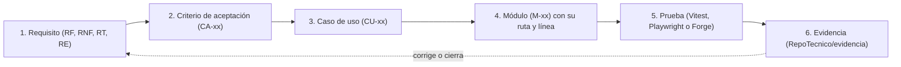

# Manual de trazabilidad de TrueKeate Wallet

La **trazabilidad** es la capacidad de responder a una pregunta muy concreta: *«esto que promete el proyecto, ¿dónde está hecho y con qué se ha comprobado?»* Este manual explica cómo se responde esa pregunta en TrueKeate Wallet, eslabón a eslabón, con los nombres reales de los ficheros.

Vocabulario mínimo para seguirlo:

- **Requisito.** Lo que el producto promete hacer. Se etiqueta con `RF` (funcional), `RNF` (no funcional: rendimiento, seguridad…), `RT` (restricción técnica) o `RE` (restricción de proceso).
- **Criterio de aceptación.** La prueba de que un requisito se cumple, escrita de forma que se pueda decir «sí» o «no». Se etiqueta con `CA`.
- **Caso de uso.** Una situación de uso contada desde el punto de vista de quien la vive. Se etiqueta con `CU`.
- **Módulo.** Una pieza de código con una responsabilidad única. Se etiqueta con `M` y un número.
- **Evidencia.** El fichero que queda como prueba: un registro de comando, una captura, un JSON con el resultado.

> Aviso de honestidad: todo se ha extraído **leyendo** el repositorio. Las cifras de suites y de cobertura se reproducen **tal y como las declara la documentación del proyecto**; este manual no las ha vuelto a ejecutar.

## Empezar en 5 minutos

### Qué necesitas

- El proyecto descargado.
- Un editor de textos con búsqueda por ficheros (para seguir las etiquetas `RF-`, `CA-`, `CU-` y `M-`).
- Ganas de comprobar cosas: la trazabilidad se sigue leyendo, no adivinando.

### Qué vas a conseguir

Saber seguir cualquier promesa del proyecto desde el requisito hasta el fichero que la demuestra, y saber seguir el camino contrario: partiendo de una prueba concreta, averiguar qué requisito cubre. También sabrás qué instrumentos automáticos vigilan esta cadena y qué huecos quedan abiertos.

### Los pasos mínimos

1. Elige un requisito, por ejemplo `RF-19` (enviar una transacción con vista previa legible), y búscalo en `RepoTecnico/requerimientos.md`.
2. Localiza su criterio de aceptación: el bloque `#### CA-RF-19` en el anexo de criterios del mismo documento.
3. Busca qué casos de uso lo cubren en `RepoTecnico/casos_uso/casos_uso.md`; para `RF-19` son `CU-11`, `CU-12` y `CU-13`.
4. Averigua qué módulos lo implementan en la matriz del documento técnico; para `RF-19` son los módulos `M7`, `M11`, `M19`, `M51` y `M42`.
5. Abre uno de esos ficheros y mira su **primera línea de comentario de contrato**: ahí está declarado su identificador de módulo.
6. Termina en la evidencia: busca en `RepoTecnico/evidencia/` el fichero con el nombre del caso y su fecha.
7. Para el camino inverso, abre cualquier fichero de prueba (`*.spec.ts`): su cabecera declara qué módulo ejercita y qué criterios demuestra.

## La cadena de trazabilidad

### Los seis eslabones

La trazabilidad de este proyecto es una **cadena de custodia de seis eslabones**. Cada salto tiene un fichero dueño y un formato propio: nadie puede «saltarse» un eslabón sin que se note.

#### Eslabón 1 — El requisito (`RF`/`RNF`/`RT`/`RE`)

Vive en `RepoTecnico/requerimientos.md`. El proyecto declara **50 requisitos funcionales** (40 obligatorios y 10 deseables), **25 no funcionales**, **13 restricciones técnicas** y **4 restricciones de proceso**.

Cada requisito funcional tiene su fila en la tabla del documento, con un criterio abreviado y su evidencia. Los no funcionales y las restricciones tienen sus propias secciones.

#### Eslabón 2 — El criterio de aceptación (`CA-xx`)

Es el **Anexo A** del mismo documento: `CA-RF-01` a `CA-RF-50` escritos en **Gherkin** (el formato «Dado… Cuando… Entonces…», que describe una situación en lenguaje casi natural) y `CA-RT-01` a `CA-RT-13` escritos en **EARS** (una plantilla más rígida, pensada para requisitos de sistema).

Cada criterio termina con una línea de **Evidencia** que nombra los ficheros que lo demuestran.

#### Eslabón 3 — El caso de uso (`CU-xx`)

Vive en `RepoTecnico/casos_uso/casos_uso.md`: **36 casos de uso** con ficha completa. Cada ficha incluye quién actúa, qué quiere conseguir, qué hace falta antes, qué queda después, qué datos intervienen, el flujo principal, los flujos alternativos y de excepción, sus criterios y su **evidencia**.

La regla declarada es: **«la ficha declara, la matriz agrega»**. Es decir, si un caso de uso añade un requisito, se edita su ficha y la tabla resumen se recalcula; nunca al revés.

#### Eslabón 4 — El módulo (`M-xx` con `ruta:línea`)

Vive en el código, dentro de `src/`. El documento técnico fija **66 módulos (M1 a M66)** con su responsabilidad única.

La unión entre «módulo» y «fichero» se materializa en la **cabecera de contrato**, siempre en la **línea 2** del fichero: por ejemplo, el fichero de revelado de secretos declara `M12` y la vista de seguridad del popup declara `M46` en su segunda línea. Por eso las referencias se escriben como `ruta:línea`.

#### Eslabón 5 — La prueba

Hay tres frentes de prueba, cada uno con su convención:

- **Vitest** (pruebas unitarias) en los ficheros `*.spec.ts` dentro de `src/` y en `test/oracle/`.
- **Playwright** (pruebas de navegador) en los ficheros `e2e/*.spec.ts`.
- **Forge** (pruebas del contrato inteligente) en `contracts/test/`.

Cada frente tiene su comando real: `npm run test`, `npm run test:e2e` y `npm run forge:test`.

#### Eslabón 6 — La evidencia

Vive en `RepoTecnico/evidencia/`, en dos carpetas con propósitos distintos:

- **Por hito** (`H1/` a `H6/`): actas, registros de comando, JSON y capturas.
- **Por fase de pruebas** (`Fase4/`): la evidencia de la fase de pruebas completa.

### La cadena en un diagrama

Así se encadenan los seis eslabones. La flecha de vuelta significa que una evidencia puede obligar a corregir el requisito o cerrar un fleco pendiente.

<!-- GENERAR_IMAGEN: flujo-trazabilidad.svg -->

### Las cuatro reglas que la sostienen

1. **Doble dirección por construcción.** Una matriz lista, para cada módulo, todos los casos de uso y requisitos que toca; otra lista, para cada requisito obligatorio, **solo sus módulos principales** (los que lo implementan, no los que lo consumen). El resultado se puede comprobar: cada módulo principal aparece con ese mismo requisito en la primera matriz, y todo módulo aparece al menos una vez. **Ninguno queda huérfano.** Esta comprobación se ejecuta como prueba documental con `npm run test`.
2. **La ficha declara, la matriz agrega.** Las tablas resumen se recalculan desde las fichas, nunca al contrario.
3. **Cuatro formas canónicas de evidencia.** Solo se admiten estas: `Vitest: <fichero> — <qué demuestra>`, `E2E: <fichero> — <flujo>`, `Comando: …` e `Inspección: …`. Se prohíben las formas vagas del tipo «Revisión:» y las pruebas de navegador sin nombrar su fichero.
4. **Ningún salto sin fichero.** Cada prueba declara en su cabecera el módulo que ejercita y los criterios que demuestra, y una prueba documental falla si esa declaración desaparece.

## Dónde vive cada eslabón

### Tabla de localización

| Eslabón | Fichero | Formato | Cómo se localiza |
|---|---|---|---|
| `RF-xx` | `RepoTecnico/requerimientos.md` (sección 1) | Tabla | Buscando `RF-19` |
| `RNF-xx` | `requerimientos.md` (sección 2) | Tabla | Buscando `RNF-09` |
| `RT-xx` / `RE-xx` | `requerimientos.md` (sección 3) | Tabla | Buscando `RT-04` |
| `CA-RF-xx` | `requerimientos.md` (anexo, Gherkin) | Bloque con encabezado `#### CA-RF-xx` | Buscando `^#### CA-RF-19` |
| `CA-RT-xx` | `requerimientos.md` (anexo, EARS) | Bloque con encabezado `#### CA-RT-xx` | Buscando `^#### CA-RT-04` |
| `CU-xx` | `casos_uso/casos_uso.md` | Bloque con encabezado `### CU-xx` | Buscando `^### CU-13` |
| Matriz requisito → caso de uso | `casos_uso/casos_uso.md` | Tabla | Buscando la sección de matriz |
| Módulo `M-xx` | `src/**`, línea 2 | Comentario de contrato | Buscando `M12 —` en `src/` |
| Matriz módulo → caso de uso → requisito | `documento_tecnico.md` (sección 6.1) | Tabla | Buscando el encabezado de la sección |
| Matriz requisito obligatorio → módulo | `documento_tecnico.md` (sección 6.2) | Tabla | Buscando el encabezado de la sección |
| Prueba unitaria | `src/**/*.spec.ts`, `test/oracle/**/*.spec.ts` | Bloque de pruebas | Buscando `CA-RF-50` en `src/` y `test/` |
| Prueba de navegador | `e2e/*.spec.ts` | Bloque de pruebas | Buscando `CA-RF-19` en `e2e/` |
| Prueba del contrato | `contracts/test/**` | Contrato de pruebas en Solidity | Buscando las funciones de prueba |
| Evidencia | `RepoTecnico/evidencia/{H1..H6,Fase4}/` | Logs, JSON, PNG y actas | Buscando `CA-RF-19` en la carpeta de evidencias |

### Citas reales de los eslabones 3 y 4

Un par de ejemplos que enseñan cómo se lee la cadena:

- **Caso de uso `CU-13`** (aprobar con vista previa decodificada): su línea de trazabilidad declara que cubre los requisitos `RF-19`, `RF-35` y `RF-41`, los no funcionales `RNF-05`, `RNF-12` y `RNF-21`, y los criterios `CA-RF-19`, `CA-RF-35` y `CA-RF-41`.
- **Caso de uso `CU-07`** (revelar el material de recuperación): declara los requisitos `RF-50`, los no funcionales `RNF-09` y `RNF-22`, y el criterio `CA-RF-50`.
- **Fila inversa de `RF-19`:** dice que es obligatorio, que lo cubren `CU-11`, `CU-12` y `CU-13`, que **sí** tiene prueba de navegador, y que su criterio es `CA-RF-19`.
- **Fila inversa de `RF-50`:** obligatorio, cubierto por `CU-07`, sin prueba de navegador en la tabla de requisitos, con el criterio `CA-RF-50`. Es un caso que se añadió al alcance mínimo por decisión de producto.
- **Módulos de `RF-19`:** `M7`, `M11`, `M19`, `M51` y `M42`.
- **Módulos de `RF-50`:** `M12`, `M46`, `M3`, `M22` y `M57`.

## Trazabilidad directa: un ejemplo completo

Aquí se recorre la cadena entera con dos requisitos reales. Es la mejor forma de entender cómo funciona.

### RF-19 — `eth_sendTransaction` con vista previa decodificada

#### Salto 1 — El requisito

**Qué promete.** Cuando una página pide enviar una transacción, la cartera debe pedirte aprobación y, antes de firmar, mostrarte un resumen que **traduzca** los datos de la llamada: qué función se llama, con qué parámetros y a qué destino, etiquetando el destino aunque no lo reconozca.

Es un requisito **obligatorio**.

#### Salto 2 — El criterio de aceptación

**Cómo se comprueba.** `CA-RF-19` describe un caso concreto: un permiso ilimitado hacia un contrato desconocido. La vista previa debe mostrar el selector, el nombre de la función y los parámetros legibles, etiquetar el destino como «contrato no reconocido» y mostrar un aviso destacado. Al aprobar, la página recibe la huella de la transacción y esta se difunde.

La evidencia declarada son dos ficheros: la prueba de navegador de aprobación de transacción y la prueba unitaria de decodificación de llamadas.

#### Salto 3 — Los casos de uso

Tres casos de uso dan forma a este requisito:

- **`CU-11`:** enviar ETH a una dirección externa.
- **`CU-12`:** transferir entre cuentas propias.
- **`CU-13`:** aprobar con vista previa decodificada (el caso central).

#### Salto 4 — Los módulos

Cinco módulos principales, con su papel:

| Módulo | Fichero real | Papel en el requisito |
|---|---|---|
| `M7` | `src/background/rpc/txContract.ts` | El contrato observable: devuelve la huella; la estimación ocurre antes de abrir la ventana |
| `M11` | `src/background/crypto/sign.ts` | La única vía de firma |
| `M19` | `src/background/approvals/preview.ts` | Construye el resumen y los avisos; **no** decodifica aquí |
| `M51` | `src/notification/TxPreviewPanel.tsx` | Pinta el resumen y los datos decodificados |
| `M42` | `src/popup/views/SendView.tsx` | El formulario de envío y su validación |

Además existe un módulo **`M66`** (`src/background/approvals/calldata.ts`): la tabla local cerrada de selectores que decodifica de verdad. Es el oráculo que impide «firmar a ciegas».

#### Salto 5 — Las pruebas

| Tipo | Fichero real | Qué demuestra |
|---|---|---|
| Unitaria | `test/oracle/calldata.spec.ts` | Que un selector fuera de la tabla se marca como no reconocido; que unos argumentos que no encajan dan error de decodificación; y que selectores y firmas son coherentes |
| Unitaria | `src/background/rpc/txContract.spec.ts` | El contrato del módulo `M7`: huella al difundir y estimación que bloquea el envío |
| Navegador | `e2e/10-aprobar-tx.spec.ts` | `CA-RF-19` y `CA-RF-35` sobre la extensión real |

La cabecera de la prueba de navegador declara literalmente los dos criterios que cubre y usa datos reales: la cuenta número 0 de Anvil, un contrato ficticio y un permiso con el valor máximo posible.

#### Salto 6 — La evidencia

Los ficheros de evidencia del hito de firma (un JSON y una captura por caso) y la captura de la fase de pruebas. Además hay una prueba de extremo a extremo con huella y recibo correcto.

### RF-50 — Revelado y exportación con temporizador

#### Salto 1 — El requisito

**Qué promete.** Poder revelar y exportar la frase de recuperación y las claves privadas, pero **con confirmación explícita**, con advertencia de riesgo y con los valores ocultos por defecto. El revelado dura **30 segundos** en pantalla y se oculta también si la ventana pierde el foco. El portapapeles tiene su propia política: se puede copiar, y al ocultar se borra **si todavía contiene la semilla**. Y esos secretos **nunca** pueden salir por el canal de mensajes de la página.

Es un requisito **obligatorio**, añadido al alcance mínimo por decisión de producto.

#### Salto 2 — El criterio de aceptación

**Cómo se comprueba.** `CA-RF-50` tiene **dos bloques Gherkin** (la higiene normal y la guarda cuando hay una web conectada con sesión vigente) más un párrafo EARS. La evidencia es triple y el párrafo EARS cierra además los flecos de seguridad y privacidad asociados.

#### Salto 3 — El caso de uso

**`CU-07`**, «revelar o exportar el material de recuperación». Su postcondición de éxito exige **exactamente una** entrada en el registro de actividad, con el evento de aprobación resuelta y origen `extension`, y **sin el valor revelado**. La ficha añade cinco condiciones propias que no estaban en el texto original del requisito.

La evidencia la forman cinco ficheros de prueba unitaria: higiene del revelado, portapapeles, exportación de secretos, redacción del registro y contrato del proveedor.

#### Salto 4 — Los módulos

| Módulo | Fichero real | Papel en el requisito |
|---|---|---|
| `M12` | `src/background/crypto/secrets.ts` | El servicio de revelado: confirmación obligatoria, contexto de confianza, 30 segundos y guarda `-32000` |
| `M46` | `src/popup/views/SecurityView.tsx` | El diálogo destructivo; cuando está oculto, el valor no existe en pantalla; descarta el estado al ocultar |
| `M3` | `src/background/rpc/router.ts` | El despacho del método interno con guarda del emisor |
| `M22` | `src/background/security/redaction.ts` | Impide que el valor acabe en el registro de actividad |
| `M57` | `src/shared/constants.ts` | La fuente única de los 30 segundos y de la regla del portapapeles |

El módulo de guarda del emisor participa en la lista blanca de rutas permitidas.

#### Salto 5 — Las pruebas

| Tipo | Fichero real | Qué demuestra |
|---|---|---|
| Unitaria | `src/background/crypto/secretsExport.spec.ts` | Confirmación, contexto de confianza, los 30 segundos y la guarda `-32000` |
| Unitaria | `src/background/crypto/revealHygiene.spec.ts` | Que la pantalla descarta el valor al ocultarse (14 pruebas) |
| Unitaria | `src/background/crypto/revealClipboard.spec.ts` | El portapapeles con huella SHA-256 y sin destruir contenido ajeno (14 pruebas) |
| Unitaria | `src/background/logging/logRedaction.spec.ts` | Cero coincidencias del valor revelado en el registro |
| Navegador | `e2e/25-recuperacion.spec.ts` | Confirmación, 30 segundos, ocultado al perder el foco, portapapeles vacío y bloqueo `-32000` |
| Navegador | `e2e/34-revelado-plazo-30s.spec.ts` | Que el revelado se oculta solo a los 30 segundos |

La cabecera de la prueba de recuperación enumera los cinco criterios y remite a su captura.

#### Salto 6 — La evidencia

El acta del hito de cartera y cuentas, el JSON de la prueba del plazo de 30 segundos y su captura en la carpeta de la fase de pruebas.

### Lectura del recorrido

Los dos ejemplos tienen la misma forma: **un** requisito → **un** criterio de aceptación → **uno o varios** casos de uso → **una lista corta y con nombre** de módulos con su ruta y su línea → **ficheros de prueba con nombre exacto** → **evidencias con fecha**.

En ningún salto se apoya en un «se probó» sin fichero.

## Trazabilidad inversa: de una prueba al requisito

El camino contrario también funciona, y es el que se usa cuando algo falla: empiezas por la prueba roja y subes hasta saber qué promesa del producto está en juego.

### Desde un spec de `src/background/approvals/`

#### La cabecera del spec

La prueba de la cola persistida es el ejemplo perfecto. Su cabecera declara:

- El **módulo** que ejercita: `M14`.
- Las **tareas** del plan de desarrollo que cubre.
- Los **criterios** que demuestra: `CA-RF-37` (dos solicitudes simultáneas conviven sin sobrescribirse; el cerrojo serializa la lectura-modificación-escritura) y `CA-RF-41` (al resolver, la entrada desaparece y una respuesta duplicada se ignora).
- Otros **oráculos propios**: los límites de cardinalidad (8 globales, 1 por web, 6 por minuto) que responden `4001` de inmediato sin guardar nada y sin abrir ventana, y la serialización por cuenta con la marca de transacción en vuelo.

#### La subida hasta el RF y el CU

| Paso | Dato | De dónde sale |
|---|---|---|
| La prueba | `src/background/approvals/queue.spec.ts` | El propio fichero |
| El módulo | `M14`, la cola de aprobaciones | La matriz del documento técnico |
| Los casos de uso | `CU-11` a `CU-16`, `CU-19`, `CU-24`, `CU-25`, `CU-27` y `CU-28` | La matriz del documento técnico |
| Los requisitos | `RF-22`, `RF-23`, `RF-26`, `RF-37` y `RF-41` | La matriz del documento técnico |
| Los criterios | `CA-RF-37` y `CA-RF-41` | El anexo de criterios |
| Los módulos que implementan `RF-37` | `M14`, `M17`, `M16`, `M15` y `M2` | La matriz de requisitos obligatorios |

El caso de uso central es **`CU-16`** («atender dos solicitudes simultáneas y serializar por cuenta»), y su oráculo evita depender del distintivo de la extensión: se apoya en «2 entradas pendientes en la cola + 1 transacción en vuelo por cuenta».

### Desde un spec de `e2e/`

#### La cabecera del spec

La prueba de aprobación de transacción declara:

- Su **propósito**: aprobación con foco, origen y ventana única.
- El **hito y la tarea** del plan a los que pertenece.
- Los **criterios**: `CA-RF-19` y `CA-RF-35`.
- La **evidencia que produce**: una captura con fecha en la carpeta del hito.

#### La subida hasta el RF y el CU

| Paso | Dato | De dónde sale |
|---|---|---|
| La prueba | `e2e/10-aprobar-tx.spec.ts` | El propio fichero |
| Los criterios | `CA-RF-19` y `CA-RF-35` | El anexo de criterios |
| Los requisitos | `RF-19` y `RF-35` | La matriz de requisitos obligatorios |
| Los casos de uso | `CU-11`, `CU-12` y `CU-13` (para `RF-19`); `CU-13` y `CU-14` (para `RF-35`) | La matriz módulo → caso de uso → requisito |
| La fila inversa | `RF-19`, obligatorio, cubierto por `CU-11`, `CU-12` y `CU-13`, con criterio `CA-RF-19` | La matriz requisito → caso de uso |
| La ficha del caso | `CU-13`, «aprobar una transacción con vista previa decodificada» | El documento de casos de uso |

### Por qué las cabeceras son el mecanismo

La trazabilidad inversa **no depende de una tabla externa**: cada prueba declara en su cabecera el módulo que ejercita y los criterios que demuestra, y una prueba documental **falla** si esa cabecera desaparece o pierde su referencia de requisito.

Eso convierte la trazabilidad en una propiedad del propio repositorio, no en una buena intención. La contrapartida —que la referencia tenga la forma correcta pero apunte a un requisito que no existe— se trata en la sección de huecos y límites.

## Cobertura de la matriz

### Cifras declaradas

**Todo lo de esta sección está declarado en la documentación del proyecto.** Este manual no ha vuelto a ejecutar ninguna comprobación.

| Afirmación | Valor | Dónde se declara |
|---|---|---|
| Casos de uso con al menos un módulo asignado | **36 de 36** | Documento técnico |
| Requisitos obligatorios con módulo principal (y sin él) | **40 de 40 · 0** | Documento técnico |
| Cobertura de requisitos del alcance mínimo | **25 de 25 no funcionales · 13 de 13 técnicas · 4 de 4 de proceso** | Documento técnico |
| Requisitos totales con módulo y caso de uso | **50 de 50** | Documento técnico |
| Requisitos con criterio y evidencia declarada | **50 de 50** | Documento de requisitos |
| Restricciones técnicas y no funcionales con criterio | **13 de 13 · 25 de 25** | Documento de requisitos |
| Requisitos con al menos un caso de uso (y huérfanos) | **50 de 50 · 0** | Documento de casos de uso |
| Criterios del alcance mínimo cubiertos en la fase de pruebas | **50** | Informe de pruebas de la fase 4 |

### Matriz módulo → CU → RF (documento técnico §6.1)

Esta tabla responde: *«este módulo, ¿para qué sirve y a quién sirve?»*. Sus columnas son: módulo, casos de uso que implementa, requisitos que satisface y las restricciones o no funcionales relacionados.

Cubre desde `M1` (el manifiesto) hasta `M66` (la tabla de decodificación de llamadas) y **continúa con filas que no son módulos del código**: la página de pruebas, el contrato inteligente, la configuración de compilación, los ficheros de dependencias, los dos scripts de comprobación, la suite de pruebas de navegador y la propia carpeta de evidencias.

Dos filas más declaran requisitos **sin módulo**: dos restricciones de proceso que se verifican por inspección.

### Matriz RF Must → módulo (documento técnico §6.2)

Esta tabla responde a la pregunta contraria: *«este requisito obligatorio, ¿dónde está implementado?»*. Sus columnas son: requisito, qué se implementa, módulos principales y los casos de uso y criterios asociados.

Recorre los **40 requisitos obligatorios** uno a uno. La regla de la columna de módulos es estricta: se listan **solo los que implementan**, no los que consumen o pintan.

### Lo que estas cifras significan y lo que no

- **Sí significan** que existe una fila para cada caso de uso y cada requisito obligatorio, con módulos nominados y relación en las dos direcciones; que hay evidencia declarada para los 50 criterios funcionales; y que las restricciones y los no funcionales también están anclados (por ejemplo, el requisito no funcional de cobertura se verifica con `npm run coverage`, y las dos restricciones de proceso, por inspección).
- **No significan** que cada línea del proyecto esté probada, ni que las cifras se puedan reproducir sin ejecutar nada: los recuentos se pueden **leer** (son tablas), pero la comprobación en las dos direcciones la hace una prueba documental que este manual no ha ejecutado.

## Instrumentos automáticos de trazabilidad

La cadena no se sostiene solo con buena voluntad: hay **cuatro instrumentos automáticos** que avisan cuando algo se rompe.

### `src/docs.spec.ts` — la puerta documental por módulo

**Qué comprueba.** Revisa **todos** los ficheros de código de `src/`, a cualquier profundidad (incluidas las propias pruebas). Para cada uno exige tres cosas:

1. Que **abra con un bloque de comentario de contrato** antes de la primera instrucción.
2. Que ese bloque declare un **identificador de módulo** con la forma `M` más un número, dentro del rango **M1 a M66**. Un identificador inventado, como `M99`, **no pasa**.
3. Que referencie **al menos un requisito** (`RF`, `RNF` o `RT`).

**Qué declara.** El registro guardado del hito declara 1 fichero de prueba, **148 comprobaciones, todas en verde**. Como hay 3 comprobaciones fijas más una por fichero, eso implica **145 ficheros** en esa fecha.

> **Comprobación de quien escribe este manual (solo lectura):** hoy `src/` contiene 154 ficheros de código, de los cuales 60 son pruebas. La cifra del registro es una **foto de aquel hito**, no el estado actual: **pendiente de confirmar** volviendo a ejecutar la puerta.

**Qué se rompería.** Si un fichero nuevo entra sin cabecera, o si alguien borra de una cabecera el identificador de módulo o la referencia de requisito, la prueba **falla nombrando el fichero**, con un informe de «fichero: problemas».

### `RepoTecnico/evidencia/H6/auditoria-rf-evidencia.mjs` — la auditoría RF → evidencia

**Qué audita.** Lee el documento de requisitos, extrae los bloques de criterio, se queda con los **40 requisitos obligatorios** y, del texto de la línea de **Evidencia** de cada uno, saca los nombres de fichero que se mencionan y comprueba que **existen de verdad**, buscando en las carpetas de código, pruebas, contratos y evidencias.

**Cómo se ejecuta.** Es un programa de Node sin dependencias, que se lanza a mano indicando su ruta. **No** hay un comando de proyecto declarado para él.

**Qué declaró.** El registro cierra con «total de criterios en el anexo: 50 · obligatorios auditados: 40 · con hueco: 2». Los dos huecos son dos citas con el nombre de fichero desactualizado (`RF-08` y `RF-37`). Ambos están declarados como **deriva documental, no falta de evidencia**: los dos ficheros citados existen con otro nombre y están en verde.

### `npm run check:mermaid` — la puerta de los diagramas

**Qué hace.** Recorre **todos** los ficheros Markdown de la carpeta técnica, extrae los bloques de diagrama y comprueba que se pueden dibujar. Detecta además los bloques sin cerrar.

Tiene **dos modos**: el modo real (que usa la propia librería de diagramas para intentar dibujarlos) y un modo de respaldo estructural, para cuando la librería no carga. En ambos modos comprueba siempre que no haya punto y coma dentro del texto de un mensaje de un diagrama de secuencia.

**Qué declaró.** El registro del hito declara **23 ficheros Markdown y 27 bloques de diagrama** en la carpeta técnica, con modo real activo, **4 avisos** y cierre correcto: **27 de 27 bloques válidos**.

### `npm run lint:prohibited` — la puerta de prohibiciones

**Qué comprueba.** Siete reglas:

1. Cero dependencias prohibidas en los imports (entre ellas, librerías de otras carteras y bibliotecas criptográficas alternativas, porque solo se admite una librería criptográfica).
2. Cero llamadas propias a `fetch(`.
3. Cero uso de `chrome.storage.sync`.
4. Cero apariciones del prefijo heredado `codecrypto_`.
5. Cero literales de color fuera del fichero de tokens de estilo (los colores deben salir de un único sitio).
6. Cero importaciones de la librería criptográfica desde el popup.
7. Sobre la carpeta compilada: cero recursos remotos y cero servidores de una lista cerrada de once CDN.

**Qué declaró.** El registro del hito declara «150 ficheros revisados» en el código y «14 ficheros revisados» en la carpeta compilada, con cierre correcto y **0 hallazgos**.

### Qué se rompería en cada caso

| Escenario | Instrumento que lo detecta | Efecto |
|---|---|---|
| Un módulo nuevo sin cabecera de contrato | La puerta documental | Prueba en rojo nombrando el fichero |
| Una cabecera con módulo pero sin referencia de requisito | La puerta documental | Aviso: «el bloque no referencia ningún RF/RNF/RT» |
| Un identificador de módulo fuera del rango permitido | La puerta documental | Aviso: «fuera del rango M1..M66» |
| Un criterio que cita un fichero que no existe | La auditoría de requisitos | Fila marcada como «FALTA» y contada como hueco |
| Un diagrama que no se puede dibujar | La puerta de diagramas | Salida con error, indicando el bloque y la línea |
| Un punto y coma dentro de un mensaje de secuencia | La puerta de diagramas | Error **en los dos modos** |
| Una dependencia o un color prohibido | La puerta de prohibiciones | Salida con error, indicando fichero y línea |

Lo que **ningún** instrumento detecta por sí solo es un requisito **sin prueba**: la puerta documental no exige que exista un fichero de prueba por módulo, y la auditoría comprueba que el fichero citado exista, no que la prueba **sea la correcta** ni que **cubra** el criterio.

## Huecos y límites de la trazabilidad

Esta sección es la más importante para no llevarse a engaño: explica qué **no** garantiza la cadena.

### Lo que no se puede verificar mecánicamente

#### La corrección semántica de la referencia

La puerta documental valida la **forma** de la referencia, no su **existencia**: acepta cualquier número de uno o dos dígitos sin contrastarlo con el catálogo real.

Consecuencia comprobada por lectura: una prueba del oráculo cita un requisito no funcional que **no existe** en el catálogo (que solo llega hasta el 25), así que esa referencia está colgando. Además, ese fichero vive en una carpeta que queda **fuera** del universo que audita la puerta, de modo que ni siquiera se revisaría. **Pendiente de confirmar** cuál era la referencia pretendida.

#### La unicidad del identificador de módulo

La puerta comprueba que el número esté en rango, **no** que sea único.

Consecuencia comprobada por lectura: dos ficheros distintos declaran el mismo identificador de módulo, mientras el documento técnico reserva ese número para uno de ellos. Los pares «módulo + su prueba» (una prueba declara qué módulo ejercita) son legítimos, pero esta colisión **no** lo es. **Pendiente de confirmar** si el segundo fichero debía recibir un identificador fuera del rango: en tal caso, la puerta tendría que ampliarse a la vez.

#### Las fronteras del universo auditado

La puerta documental audita **solo el código de `src/`**. Quedan **fuera**: los ficheros de prueba del oráculo (14), las pruebas de navegador (33), las pruebas del contrato inteligente, los scripts de comprobación y la página de pruebas.

Todos ellos sí están dentro del universo de la auditoría de requisitos, pero esa auditoría solo comprueba que los ficheros existan.

#### La cobertura real de un criterio por una prueba concreta

Nadie comprueba que el criterio citado en una cabecera esté **realmente** aseverado en el cuerpo de la prueba: una prueba podría declarar un criterio y no comprobar ninguno de sus pasos.

Es un límite de diseño, no un defecto del instrumento. Cerrarlo exigiría asociar cada paso de un criterio a una comprobación concreta, y ningún ejecutor de pruebas del proyecto lo hace hoy. **Pendiente de confirmar** como decisión de alcance.

### Los RF Should fuera del MVP

El alcance mínimo del proyecto son **40 requisitos obligatorios**. Los **10 deseables** quedan para un ciclo posterior. Su estado real declarado es:

| Requisito deseable | Materia | Estado real |
|---|---|---|
| `RF-06` | Borrar una cuenta importada | **Implementado y verificado** en la fase de pruebas |
| `RF-12` | Pista de la frase de Anvil | **No ejecutado** |
| `RF-32` | Historial persistente | **Parcial**: los registros sobreviven al reset; falta el cierre formal |
| `RF-34` | Idiomas y formatos | **No ejecutado**; el formateo ya está probado |
| `RF-38` | Distintivo de la extensión | **No promocionado** |
| `RF-39` | Notificaciones del navegador | **No ejecutado** |
| `RF-40` | Plazo de espera | **Mecanismo construido y verificado**; cierre formal en el ciclo posterior |
| `RF-44` | Anuncio completo del proveedor | **Parcial**: se anuncia y se verifica; falta el reanuncio en todos los marcos |
| `RF-47` | Historial de la página | **No ejecutado** como unidad |
| `RF-48` | «Acerca de» | **Parcial**: existe porque lo exige un requisito no funcional, pero sigue siendo deseable |

Además, hay una decisión de producto que fija que el alcance mínimo **no depende del distintivo** de la extensión: el oráculo del caso de uso de dos solicitudes simultáneas se apoya en la cola y en la marca de transacción en vuelo. El orden de recorte declarado, si se agotara el presupuesto, es el de los tres últimos ciclos de menor prioridad.

**Consecuencia para la trazabilidad:** estos 10 requisitos **sí** tienen caso de uso, criterio y módulo, y **sí** aparecen en las matrices. Lo que no tienen es **evidencia de cierre** en el alcance mínimo: su evidencia es parcial, aunque varios estén implementados de hecho.

### Comprobaciones que arrojan un resultado distinto del declarado

Estas diferencias se han **observado al leer el repositorio** y se marcan como **pendiente de confirmar**, porque pueden ser correcciones ya en curso.

#### Citas de evidencia desactualizadas en `requerimientos.md` §9.2

Dos requisitos obligatorios citan ficheros de prueba con un nombre que ya no existe: los reales son `txContract.spec.ts` y `queue.spec.ts`. La auditoría mecánica lo registró como **2 huecos de 40**. La desviación se declaró «para la pasada de consistencia» y el documento sigue sin actualizarse: **estado actual pendiente de confirmar**.

#### Metadatos del propio corpus divergentes entre la cabecera y la tabla §2

Algunos documentos declaran una versión en su cabecera y otra distinta en la tabla que los describe:

- La memoria del proyecto declara una versión en su cabecera, pero su propia tabla se describe con una versión anterior y con un rango de decisiones más corto del que realmente contiene.
- El diccionario de datos declara una versión en su cabecera y la memoria lo describe con otra.
- El plan de desarrollo declara una versión en su cabecera, la memoria lo describe con otra anterior, y el propio plan ya incluye una fila de historial posterior.

Es el mismo tipo de residuo que la revisión de la fase 2 ya cerró dos veces. **Pendiente de confirmar** si se corrige en la fase de manuales.

#### Diferencia entre la puerta documental y el árbol actual

Ya señalada: el registro del hito declara **145 ficheros y 148 comprobaciones**, y hoy el código tiene **154** ficheros. No es un defecto, es una **foto con fecha**; conviene saber que las cifras que se citan en la memoria y en el plan corresponden al cierre de aquel hito.

### Afirmaciones del corpus no comprobables desde el código

- **Trazabilidad por inspección.** Dos restricciones de proceso **no tienen módulo**: se verifican por inspección de la configuración y del historial de comandos. No son trazables a una prueba automática; son trazables a una **revisión**.
- **Evidencias que son capturas.** Varias evidencias son imágenes. Una búsqueda de texto no valida su contenido: la auditoría comprueba que el **fichero exista**, no lo que muestra. Afirmaciones como «la vista previa muestra el selector y el nombre de la función» se apoyan en una prueba que lo comprueba, no en la captura.
- **Cifras de suites y cobertura.** Los números finales —**1185 pruebas unitarias** en 71 ficheros, **84 pruebas de navegador** en 33 ficheros, **30 pruebas del contrato** en 2 suites, total **1299**— y la cobertura de ramas global del **86,11 %** (con 86,98 % en criptografía, 95,60 % en aprobaciones y 93,13 % en validación) son **declaraciones con su registro archivado**. Este manual **no las ha vuelto a ejecutar** y por tanto no las certifica: las reproduce como parte de la cadena documental.
- **Dos salvedades heredadas, declaradas y no cumplidas.** Sigue abierto que la compilación limpia en Linux esté **verificada solo en Windows** (no había entorno Linux ni integración continua en el equipo), y que el ensayo del perfil de usuario externo **no se haya verificado de forma independiente** (solo hay una simulación cronometrada del propio autor).
- **Condiciones de validez de la evidencia.** El informe declara dos medidas que no son defectos del producto pero afectan a la reproducibilidad: un fallo intermitente de una prueba de conexión por carga de la máquina, y 37 fallos por conexión rechazada cuando el servidor de la página de pruebas se cayó a mitad de suite. De ahí sale una regla operativa: **no escribir ficheros del repositorio mientras la suite de navegador está corriendo**.

## Problemas frecuentes

### No encuentro la prueba que demuestra un requisito

**Causa.** Puede ser un requisito deseable (los 10 que quedan fuera del alcance mínimo): tienen caso de uso, criterio y módulo, pero su evidencia de cierre es parcial o inexistente.

**Solución.** Comprueba primero si el requisito es obligatorio o deseable. Si es obligatorio, busca su línea de **Evidencia** en el anexo de criterios y verifica que el fichero citado existe. Si el nombre no coincide con ningún fichero real, es una de las dos derivas documentales conocidas: busca por el nombre parecido.

### La puerta documental falla y me dice que un fichero no tiene cabecera

**Causa.** Todo fichero de código de `src/` debe abrir con un bloque de comentario que declare su identificador de módulo y al menos un requisito. Es una regla del proyecto, no un capricho: es lo que permite seguir la cadena.

**Solución.** Añade el bloque al principio del fichero, antes de la primera instrucción. El identificador debe estar dentro del rango M1..M66 y debe incluir una referencia del tipo `RF-xx`, `RNF-xx` o `RT-xx`.

### Un diagrama no se puede dibujar y la comprobación da error

**Causa.** El diagrama tiene un error de sintaxis, o contiene un punto y coma dentro del texto de un mensaje (ese caso es error en los dos modos de la comprobación).

**Solución.** Revisa el bloque que indica el error, empezando por la línea señalada. Si el texto de un mensaje lleva un punto y coma, sepáralo en dos frases.

### La auditoría de requisitos dice que falta un fichero de evidencia

**Causa.** El nombre citado en el requisito no coincide con ningún fichero real: normalmente porque el fichero se renombró y la cita no se actualizó.

**Solución.** Localiza el fichero real por su nombre aproximado (por ejemplo, buscando por el nombre del caso) y corrige la cita en el documento de requisitos. Mientras no se corrija, cuenta como hueco en la auditoría aunque la prueba exista y esté en verde.

### Un requisito cita un número que no existe en el catálogo

**Causa.** La puerta documental valida la forma de la referencia, no que el requisito exista. Es un límite conocido del instrumento, no un fallo de la comprobación.

**Solución.** Contrasta el número con el catálogo real de requisitos: si no está, la referencia está colgando. Corrige la cabecera de la prueba con el número correcto. Ten presente que los ficheros fuera de `src/` ni siquiera pasan por esta puerta.

### Dos ficheros declaran el mismo identificador de módulo

**Causa.** La puerta comprueba que el número esté en rango, pero **no** que sea único. Es un hueco conocido.

**Solución.** Revisa el documento técnico para ver a qué fichero pertenece ese identificador y asigna otro al segundo, dentro del rango permitido. Si el identificador correcto queda fuera del rango, hay que ampliar el rango en la puerta al mismo tiempo.

### Las cifras de pruebas no coinciden con lo que veo al ejecutarlas

**Causa.** Las cifras que se citan son **fotos con fecha** de un hito concreto, no el estado actual del código. Desde entonces han entrado ficheros nuevos.

**Solución.** Ejecuta los comandos del proyecto (`npm run test`, `npm run test:e2e`, `npm run coverage`, `npm run forge:test`) para obtener las cifras de hoy, y cita siempre la fecha de la medición. Una cifra sin fecha no es trazable.

### Una prueba de navegador falla solo a veces

**Causa.** Puede ser carga de la máquina o contaminación entre suites. El propio informe declara un caso intermitente por carga y otro por ejecutar dos suites a la vez sobre la misma carpeta de resultados.

**Solución.** No escribas ficheros del repositorio mientras corre la suite, y no solapes dos ejecuciones de pruebas de navegador. Si el fallo se repite, anota el mensaje exacto: el proyecto tiene por norma buscar la causa raíz con fichero y línea antes de dar algo por «problema de entorno».
