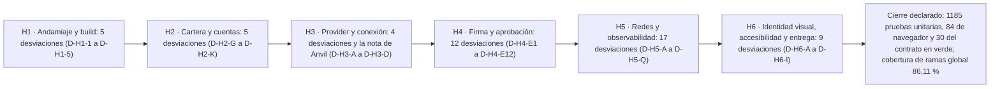

# Manual de defectos corregidos de TrueKeate Wallet

Este manual deja constancia, en lenguaje corriente, de **qué falló**, **por qué falló**, **cómo se corrigió** y **con qué prueba quedó fijado** durante el desarrollo de TrueKeate Wallet. No es una lista de culpas: es un registro para aprender.

Tres palabras que se repiten:

- **Defecto.** Algo que el programa hace mal. Un fallo, un descuido, una suposición equivocada.
- **Causa raíz.** El motivo de fondo, no el síntoma. Siempre se anota con el fichero y la línea exactos.
- **Prueba de regresión.** La prueba que se añade para que ese fallo concreto no pueda volver sin que salte una alarma.

> Aviso de honestidad: todo se ha extraído **leyendo** la documentación del proyecto. Las cifras finales de pruebas y cobertura se citan **tal y como están declaradas**, no re-verificadas aquí. Cuando un dato no aparece en las fuentes se escribe «**pendiente de confirmar**» en lugar de rellenarlo.

## Empezar en 5 minutos

### Qué necesitas

- El proyecto descargado.
- Los documentos de calidad: el informe de pruebas de la fase 4, el veredicto de la fase 2 y el plan de desarrollo.
- La carpeta de evidencias, donde están los registros, las capturas y hasta los intentos fallidos.

### Qué vas a conseguir

Entender cómo se registró y se corrigió cada defecto, saber buscar uno concreto por su etiqueta (`D-01`, `C-3`, `R-07`, `D-H5-P`…) y reconocer los **patrones de error** que se repitieron, que son la parte reutilizable de todo esto.

### Los pasos mínimos

1. Abre el informe de pruebas de la fase 4 y busca la sección de defectos.
2. Elige uno, por ejemplo `D-07` (el revelado que entregaba la clave de otra cuenta).
3. Lee sus cuatro partes en orden: síntoma, causa raíz con fichero y línea, solución aplicada y prueba que lo reveló.
4. Localiza la prueba que lo fija en el código y comprueba que existe.
5. Busca su etiqueta en la carpeta de evidencias para ver el registro o la captura.
6. Repite con un defecto de concurrencia (`C-1` a `C-4`) y con una desviación de hito (`D-H5-P`) para ver los tres tipos de problema.
7. Termina leyendo la sección de **patrones**: agrupa los 19 defectos por causa raíz y resume qué hacer para no repetirlos.

## Cómo se registraron los defectos

### El ciclo real de una pasada de pruebas

El proceso no fue «probar y arreglar», sino un ciclo documental de **cinco pasos** repetido en cada fase y cada hito:

1. **Batería de comandos**, anotando el resultado real de cada uno y guardando el registro.
2. **Informe de pruebas** con un formato obligatorio.
3. **Acta por hito**, que resume lo ocurrido.
4. **Corrección con prueba de regresión**: el arreglo no se da por bueno sin su prueba.
5. **Evidencia archivada**, incluidos los intentos fallidos.

### La regla de la batería en rojo/verde

La regla es tajante: **ningún fallo se resolvió declarándolo «problema de entorno»**. Se buscaba la causa raíz con su fichero y su línea, se corregía y se añadía la prueba de regresión.

El patrón «primero rojo, después verde» está medido y archivado en varios casos:

- La primera pasada de la puerta de prohibiciones salió con error y **33 hallazgos**.
- La primera batería de pruebas de navegador del cierre de hito terminó con **68 correctas y 8 fallidas** por contaminación entre ejecuciones simultáneas, y ese intento se conservó.
- El defecto crítico del popup se archivó **antes** de corregirlo, con la sonda en crudo que lo demostraba.

### El informe de pruebas y el acta por hito

El **informe de pruebas** es el documento consolidado: resumen global, metodología, resultados por suite, los defectos, los casos adversarios del contrato inteligente, la trazabilidad por criterio y las limitaciones declaradas.

El formato de cada defecto es fijo y tiene cuatro partes:

- **(a) Síntoma:** qué se veía mal.
- **(b) Causa raíz**, con fichero y línea.
- **(c) Solución aplicada.**
- **(d) Prueba que lo reveló.**

Las **actas por hito** viven en la carpeta de evidencias, una por hito.

### La evidencia por defecto

| Tipo de evidencia | Ejemplo real | Para qué sirve |
|---|---|---|
| Texto en crudo | La sonda del defecto del popup | La salida literal que reveló el fallo |
| Registro de comando | Los registros de cobertura, unitarias, navegador y contrato | Las cifras de la batería de cierre |
| JSON y captura por caso | La captura de aprobación de transacción o el JSON del plazo de 30 segundos | El resultado observable de un flujo |
| Resumen de fase | El resumen de las pruebas de navegador | La síntesis del frente con sus defectos |
| Intento fallido conservado | El registro de la ejecución contaminada | La prueba del estado previo, **no borrada** |

La sonda del defecto del popup contenía, literalmente, «ventana: NINGUNA», «ventanas de decisión: 0», «cola persistida: {}», «pendientes: 0» y la entrada de error con el código `4200`.

### La corrección con spec de regresión, y lo que nunca se hizo

Cada defecto cierra con la prueba que lo fija. Algunos ejemplos: la máscara del código QR, la ventana de tasa, las referencias de cuenta, los huecos de integridad, la redacción profunda, el envío desde el popup y la accesibilidad.

Y se declararon **tres prohibiciones**:

- **No** desactivar, saltar ni relajar pruebas. Las únicas pruebas omitidas son las de un guardián previo y estándar.
- **No** «arreglar» cambiando la prueba hacia lo que hace el código. Cuando lo escrito y el código discrepaban, se alineó **el código**; y si la prueba afirmaba lo contrario, se corrigió la prueba **en la dirección de lo documentado**, dejando el motivo escrito.
- **No** inventar mensajes de error: toda causa nueva se registró en el diccionario de datos y se transcribió al fichero de errores.

## Defectos de la Fase 4

El informe declara **15 defectos** en la lista oficial, etiquetados `D-01` a `D-14` más `D-15a` y `D-15b` (que **cuentan como uno solo**). Además hay **4 defectos** de concurrencia y retención (`C-1` a `C-4`) que el informe declara aparte. En total, el expediente recoge **19 defectos medidos y corregidos**.

### Los 12 defectos de las pruebas unitarias (`D-01`..`D-12`)

#### D-01 — La máscara QR no acumulaba la regla 1 de ISO/IEC 18004

**Qué pasaba.** El código QR se seguía leyendo, pero la máscara elegida no era la que manda el estándar. Medido: una matriz de 21 × 21 toda oscura daba una penalización de **1300** donde el estándar exige **2098**.

**Por qué.** Las dos pasadas que calculan la penalización descartaban el valor devuelto en lugar de sumarlo.

**Cómo se corrigió.** Las dos pasadas ahora **acumulan** el resultado.

**Con qué se fija.** Una prueba que reimplementa las cuatro reglas del estándar de forma independiente al codificador y compara con el mínimo calculado fuera del módulo. Son 7 pruebas.

#### D-02 — `padEnd(18)` sin truncar en `validation/amount.ts`

**Qué pasaba.** Con un límite de 19 decimales configurado, `0.0000000000000000009` se convertía en **9 wei** (lo correcto era **0**) y `1.0000000000000000001` devolvía un valor con un wei de más.

**Por qué.** La parte decimal se rellenaba con ceros sin recortarla antes, y la conversión a número entero de precisión arbitraria interpretaba la fracción como una cantidad muchísimo mayor.

**Cómo se corrigió.** Se recorta hacia abajo a 18 decimales y se aplica el límite de decimales **antes** de convertir.

**Con qué se fija.** Una prueba con tres magnitudes de frontera: un límite mayor que los decimales reales **trunca**, no reescala.

#### D-03 — `normalizeRateWindow` no reiniciaba `approvalsInWindow`

**Qué pasaba.** La **primera** solicitud aprobable de una ventana nueva se rechazaba con `4001`, y ese origen quedaba bloqueado hasta la limpieza por inactividad, **10 minutos** después.

**Por qué.** Al vencer la ventana se reiniciaban las fichas disponibles y el inicio de la ventana, pero **no** el contador de solicitudes aprobables, que se quedaba en 6 para siempre.

**Cómo se corrigió.** El reinicio deja también ese contador a cero, como exige el diccionario de datos.

**Con qué se fija.** Una prueba específica de la ventana de tasa, con 8 pruebas.

#### D-04 — El contador de aprobables se incrementaba dos veces

**Qué pasaba.** El límite efectivo era de **3 aprobaciones por minuto** en lugar de 6, y cualquier lectura previa lo agotaba.

**Por qué.** La función que consume fichas incrementaba el contador en **toda** llamada permitida (incluidas las lecturas) y, además, la misma llamada aprobable lo incrementaba otra vez al encolarse.

**Cómo se corrigió.** El contador pertenece a la **cola**: la función de consumo ya no lo toca, y solo se reinicia al vencer la ventana.

**Con qué se fija.** La misma prueba de la ventana de tasa.

#### D-05 — `parseAccountRef` no validaba la forma

**Qué pasaba.** Una referencia vacía (`idx:`) resolvía a la **cuenta 0** y `idx:1e1` a la **cuenta 10**. Además, un número suelto muy largo se aceptaba mientras la misma cifra con prefijo `idx:` se rechazaba.

**Por qué.** El valor se convertía con la función numérica de JavaScript, que no valida la forma: una cadena vacía da 0, una notación científica da su número y un hexadecimal da el suyo.

**Cómo se corrigió.** Ambas ramas exigen dígitos y comprueban que el índice derivado es válido. Cualquier otra forma devuelve «nada» y la respuesta es `-32602 unknownAccount`.

**Con qué se fija.** La prueba de referencias de cuenta.

#### D-06 — La importación persistía etiquetas que `renameAccount` rechaza

**Qué pasaba.** Una etiqueta de 33 caracteres se **guardaba** al importar una cuenta, pero al renombrarla la misma etiqueta se rechazaba con `-32602 invalidLabel`. Dos caminos con la misma regla y distinto resultado.

**Por qué.** La importación solo miraba que la etiqueta no estuviera vacía, sin comprobar que fuera válida.

**Cómo se corrigió.** Se aplica la **misma** función de validación que en el renombrado. Una etiqueta ausente o vacía sigue significando «usa la de por defecto».

**Con qué se fija.** La prueba de referencias de cuenta.

#### D-07 — 🔴 Hueco no-cadena en `truekeate_accounts`: el revelado entregaba la clave de OTRA cuenta

> El informe lo marca como **el defecto más grave de la fase**.

**Qué pasaba.** Con una lista de cuentas del estilo `[A0, A1, hueco, A3]`, al pedir la clave privada de la posición 2 la cartera entregaba la **clave privada de la cuenta 2** bajo la **dirección de la cuenta 3**: el usuario veía una dirección y copiaba la clave de otra.

**Por qué.** Dos capas del mismo error. Al limpiar la lista se descartaba el hueco y se **compactaba**, así que la cuenta 3 pasaba a ocupar la posición 2; y la comprobación de integridad **filtraba** los huecos, con lo que el informe no los veía y los índices de los avisos se desplazaban.

**Cómo se corrigió.** Con un criterio deliberadamente incómodo: una lista con hueco se trata como **cartera dañada** (la limpieza devuelve una lista vacía y la integridad la marca como dañada) y la comprobación **conserva las posiciones**, representando el hueco con una cadena vacía. Sin cuentas válidas, toda referencia de cuenta responde `-32602 unknownAccount` en lugar de revelar la clave de otra.

**Con qué se fija.** Una prueba específica de huecos de integridad (6 pruebas) y la prueba de referencias de cuenta.

#### D-08 — El informe de integridad decía `ok` con una importada ya descartada

**Qué pasaba.** Una cuenta importada con la clave privada no utilizable desaparecía de la cartera —no se listaba, no firmaba, no se podía borrar— y el informe seguía diciendo que todo estaba bien.

**Por qué.** La rama que comprobaba la clave privada **se saltaba en silencio** el caso malo, mientras el saneado descartaba la ficha.

**Cómo se corrigió.** Se emite el aviso «clave importada que no corresponde», con su mensaje y su dirección, de modo que el informe **refleja** la corrupción.

**Con qué se fija.** La prueba de huecos de integridad.

#### D-09 — `toChainIdNumber` truncaba y emitía `'0x-5'`

**Qué pasaba.** `'1.5'` daba 1, `'31337abc'` daba 31337 y `'-5'` daba −5; este último producía además la forma hexadecimal `'0x-5'`, que **no es un hexadecimal válido**.

**Por qué.** La rama de texto usaba la función de conversión sin comprobar la forma, mientras la propia especificación del módulo ya exigía lo contrario para los números.

**Cómo se corrigió.** El texto debe ser un entero decimal o hexadecimal **completo**; lo demás cae al identificador de red por defecto (31337) y la conversión a hexadecimal nunca emite una forma inválida.

**Con qué se fija.** La prueba de firma y la prueba de compatibilidad con el formato antiguo de transacciones.

#### D-10 — `domainChainMismatch` no se activaba con un `chainId` ininterpretable

**Qué pasaba.** Con la red declarada por la página hecha un lío (texto sin sentido, vacío, `0x`) y la red por defecto activa, **no** se emitía el aviso destacado ni se exigía la doble confirmación.

**Por qué.** La comparación usaba en ambos lados una función que, ante un valor ininterpretable, cae al identificador por defecto: los dos lados valían 31337 y el resultado era «coinciden».

**Cómo se corrigió.** Se comparan los dos lados con una función estricta que devuelve «nada» ante una forma inválida, y un identificador declarado pero ininterpretable **cuenta como discrepancia** (se falla seguro). Un identificador ausente sigue sin considerarse discrepancia.

**Con qué se fija.** La prueba de despacho de aprobaciones y la de cableado de producción.

#### D-11 — `localLabelFor` buscaba una dirección en el mapa de índices BIP-44

**Qué pasaba.** La etiqueta del destino valía **«desconocido»** incluso para una cuenta propia y etiquetada, y la vista previa añadía el aviso «Destino sin etiqueta».

**Por qué.** Se buscaba la etiqueta por **dirección**, pero el mapa de etiquetas tiene el **número de cuenta** como clave: esa búsqueda **nunca** encontraba nada.

**Cómo se corrigió.** Se resuelve la etiqueta efectiva con el mismo mapa dirección → etiqueta que usa la ventana de decisión.

**Con qué se fija.** La prueba de despacho de aprobaciones.

#### D-12 — 🔒 Privacidad: firma completa persistida, `privKey`/`seedWords` sin redactar y calldata sin truncar

**Qué pasaba.** Tres manifestaciones del mismo hueco, agrupadas como **un solo defecto**: se guardaba una firma con sus dos componentes completos; las claves `privKey` o `accountPrivateKey` no encajaban con la palabra «privatekey» y la clave privada acababa **íntegra** en el registro de actividad (exportable); y los datos de la llamada se guardaban **completos**.

**Por qué.** Al revisar un objeto solo se miraba la clave hija, sin arrastrar el contexto de firma del padre; la lista de palabras sensibles se consultaba por **igualdad exacta** en vez de por contención; y la lista de claves de datos de llamada también era de igualdad exacta.

**Cómo se corrigió.** Se propaga el contexto de firma a los hijos; la lista de palabras sensibles se consulta por **contención**; y para los datos de llamada se usa un patrón cerrado pero realista, sin llegar a «cualquier clave que termine en `data`» (porque `metadata` no es una llamada).

**Con qué se fija.** Cuatro pruebas: redacción profunda (21), redacción del registro (8), higiene del revelado (14) y exportación de secretos.

### El defecto de producto y el de arnés del extremo a extremo

#### D-13 — 🔴 El popup no podía enviar nada (`4200`, sin ventana, cola vacía)

**Qué pasaba.** Al pulsar «Enviar» en el popup, la petición respondía **`4200`**, **no se abría la ventana única** y la cola quedaba **vacía**.

**Por qué.** Dos capas, ambas necesarias. El enrutador **saltaba la ruta de aprobación para todo contexto de la extensión**; y la resolución del origen exigía una **sesión de página web**, que el popup no tiene.

**Cómo se corrigió.** El contexto de la extensión también pasa por la ruta de aprobación, **salvo** el método de revocar permisos (cuya confirmación es la pantalla de sitios conectados); y el popup firma con la **cuenta activa**, exigiendo que la cuenta pedida **pertenezca a la cartera**.

**Con qué se fija.** La prueba de navegador de envío desde el popup (3 pruebas): el recibo del nodo es correcto tanto a una dirección externa como entre cuentas propias.

#### D-14 — Aserción de zoom intermitente en el arnés de accesibilidad

**Qué pasaba.** La comprobación «el zoom no puede vaciar la pantalla» fallaba de forma intermitente: esperaba 93 y recibía 98.

**Por qué.** Las dos medidas se tomaban en **dos ejecuciones separadas**, así que un repintado del popup (el sondeo de saldos) se colaba entre ambas.

**Cómo se corrigió.** Las dos medidas se toman dentro de **un único bloque síncrono**. **La comprobación es la misma: no se relajó.**

**Con qué se fija.** La propia prueba de accesibilidad.

### Los dos defectos documentales del contrato Forge

#### D-15a — El `README` citaba un `recoverSigner` inexistente

**Qué pasaba.** La documentación del contrato describía una función que **no existe**: una búsqueda de ese nombre solo devolvía el propio documento.

**Por qué.** El documento se escribió describiendo una versión **previa** del contrato y no se actualizó cuando se renombró la función.

**Cómo se corrigió.** El documento cita ahora la función real y anota expresamente la corrección. El impacto en seguridad se declaró **nulo** (ninguna llamada en código a ese nombre); el impacto real era de **trazabilidad**.

**Con qué se fija.** La ejecución de las pruebas del contrato más una inspección del texto.

#### D-15b — El comentario de `s` era impreciso respecto de `s > n/2`

**Qué pasaba.** El comentario decía que un valor debía ser «estrictamente menor», pero la comprobación real admite también el valor exacto de la frontera.

**Por qué.** Imprecisión del comentario y del documento, **no del código**: el estándar y la librería usan «mayor que», no «mayor o igual».

**Cómo se corrigió.** Se añadió una nota de «frontera» al documento del contrato con el valor exacto.

**Con qué se fija.** Una prueba de fronteras del contrato.

### Los 4 defectos de concurrencia y retención

No estaban en la lista de 15, pero son defectos medidos y corregidos en la misma pasada, cada uno con su prueba:

| N.º | Qué pasaba | Por qué | Cómo se corrigió | Con qué se fija |
|---|---|---|---|---|
| `C-1` | Dos renovaciones simultáneas de sesiones distintas **perdían** una (y con ella una pestaña o una revocación) | El «leer, cambiar y guardar» no tenía cerrojo: dos flujos partían de la misma foto | Un cerrojo de turnos aplicado a renovar, conectar, revocar, recordar pestaña y propagar la cuenta activa | La prueba de sesiones (4 pruebas nuevas) |
| `C-2` | Dos altas simultáneas de la **misma web** creaban **dos** solicitudes y dos ventanas; la segunda escritura **borraba** el mapa de la primera | El «leer, cambiar y guardar» no tenía cerrojo al abrir la conexión ni al responder | Un cerrojo con el tramo crítico **completo**: leer, comprobar «una pendiente por web» y escribir | La prueba de conexiones (2 pruebas) |
| `C-3` | Las solicitudes de conexión **nunca** se limpiaban: toda petición sin decidir se quedaba para siempre, con su web y su lista de cuentas | Solo se borraba la entrada que se resolvía | **Doble motivo de limpieza**: por vencimiento y al resolverse | La prueba de conexiones (5 pruebas) |
| `C-4` | Comprobar «máximo una pendiente por web» **fuera** del cerrojo no bastaba: el cerrojo serializaba las escrituras, no la **decisión** | La comprobación y el alta eran dos tramos críticos distintos | Un **único** tramo crítico que lee, limpia, comprueba y escribe; la segunda alta responde `4001` sin abrir ventana | La prueba de conexiones |

Además, el cerrojo de turnos se extrajo a un módulo reutilizable para que los tres sitios que lo necesitaban usaran **la misma** implementación en vez de tres copias, sin cambiar ningún nombre.

### Recuento real de lo encontrado

- **15 defectos** en la lista oficial (`D-01` a `D-14`, con `D-15a` y `D-15b` contando como uno).
- **4 defectos adicionales** de concurrencia y retención (`C-1` a `C-4`), declarados aparte.
- **Total: 19** defectos medidos, cada uno con síntoma, causa raíz con fichero y línea, solución y prueba.
- **0 pruebas** desactivadas, saltadas o relajadas para llegar a verde.
- **3** son de **arnés o entorno** y se declaran como tales, no como defectos del producto: el de la aserción de zoom y los dos fallos intermitentes del informe (el clic de una prueba de conexión bajo carga y los 37 fallos por conexión rechazada cuando el servidor de la página de pruebas se cayó a mitad de suite).

## Hallazgos residuales de la Fase 2

La fuente es el **veredicto de la fase de auditoría**. Es un **documento de cierre**, no un registro histórico: unas secciones describen el estado **anterior** a la ejecución y otras, el **posterior**.

### Los 12 residuales `R-01..R-12`

Los **residuales** son hallazgos que quedaron pendientes tras una revisión. Sus severidades declaradas fueron **3 altas, 8 medias y 1 baja**. Todos se cerraron.

| ID | Sev. | Qué se detectó | Estado real | Cómo se cerró |
|---|---|---|---|---|
| `R-01` | ALTA | Dos modelos de tabla de errores (uno por código, otro por causa) y 28 citas apuntando al modelo equivocado | Cerrado | La tabla de códigos remite a la de causas como **fuente única**; las 28 citas se redirigieron |
| `R-02` | ALTA | El catálogo de eventos es de 24, pero quedaban restos de «23» y faltaba un evento en el listado | Cerrado | Se listan los 24 en los dos sitios y los casos de uso citan «24 eventos» |
| `R-03` | ALTA | Afirmar que el canal de larga duración «mantiene vivo» el motor es **falso** (y no se podía comprobar) | Cerrado | Se sustituye por una afirmación comprobable (una reanudación responde en menos de 200 ms tras 30 s) y se aclara que el canal **no** garantiza la vida del motor |
| `R-04` | MEDIA | Seguía diciéndose «una sola ventana **por origen**» en vez de ventana única global | Cerrado | Los diagramas y el documento técnico dibujan la ventana única global |
| `R-05` | MEDIA | La memoria declaraba versiones desactualizadas de **6 artefactos** | Cerrado | La tabla se sincronizó y se corrigieron los recuentos de módulos y diagramas |
| `R-06` | MEDIA | La tabla de evidencias usaba formas **no canónicas** (del tipo «Revisión:») | Cerrado | Las **33** evidencias afectadas se reescribieron como comando o inspección |
| `R-07` | MEDIA | Criterios con oráculo tautológico o sin magnitud (el «Entonces» repetía el «Dado») | Cerrado | Varios casos de uso y criterios ganaron magnitud, método y evidencia |
| `R-08` | MEDIA | Los criterios abreviados declaraban magnitud **sin método** ni evidencia concreta | Cerrado | Barrido completo: la evidencia pasa a la forma canónica |
| `R-09` | MEDIA | Dos causas de error citadas por los casos de uso **no existían** | Cerrado con decisión de producto | El diccionario ganó dos filas de causa con su código y se añadieron dos secciones nuevas |
| `R-10` | MEDIA | Las cabeceras de tres documentos citaban versiones obsoletas de sus fuentes | Cerrado | Los tres bloques de fuentes se actualizaron |
| `R-11` | MEDIA | La memoria no reflejaba la reevaluación: un paso y un criterio figuraban como pendientes | Cerrado | La memoria registra el veredicto y actualiza el estado |
| `R-12` | BAJA | Los historiales mezclaban el recuento viejo y el nuevo de eventos en la misma celda | Cerrado | Se separa el conteo histórico del valor vigente |

**Balance declarado: 12 cerrados, 0 pendientes.**

### Las 18 contradicciones residuales

Son discrepancias entre dos documentos que decían cosas distintas del mismo asunto. Se listaron completas, con los dos lados citados por fichero y línea. El balance declarado fue **17 resueltas por edición y 1 por declaración de residuo**; el estado final, **18 de 18 resueltas y 0 abiertas**.

| N.º | Materia | Qué se contradecía | Estado |
|---|---|---|---|
| `C-01` | Fuente de los mensajes de error | «un mensaje por código» frente a «un mensaje por causa» | Resuelta |
| `C-02` | Citas de la tabla de errores | 28 citas de casos de uso y 2 del técnico apuntaban al sitio equivocado | Resuelta |
| `C-03` | Ventana de confirmación | «una ventana global» frente a «una ventana por origen» | Resuelta |
| `C-04` | Vida del motor | «el canal lo mantiene vivo» frente a «no lo mantiene» | Resuelta |
| `C-05` | Vida del motor | Dos documentos decían lo contrario | Resuelta |
| `C-06` | Vida del motor (diagrama) | El diagrama decía lo contrario que el técnico | Resuelta |
| `C-07` | Vida del motor (otra figura) | Otra figura repetía la afirmación falsa | Resuelta |
| `C-08` | Catálogo de eventos | 23 eventos sin el de cuota frente a 24 | Resuelta |
| `C-09` | Recuento de eventos | «23 nombres» frente a «24 valores» | Resuelta |
| `C-10` | Recuento de eventos | «23 nombres» frente a 24 listados | Resuelta |
| `C-11` | Recuento de eventos | 23 nombres frente a 24 eventos | Resuelta |
| `C-12` | Recuento en el historial | Mezcla del conteo antiguo y el nuevo | Resuelta |
| `C-13` | Recuento en la auditoría | Un registro histórico conserva el «23» | **Resuelta por declaración de residuo**: el registro histórico se conserva como prueba del cambio |
| `C-14` | Versión del diccionario | La memoria y la cabecera no coincidían | Resuelta |
| `C-15` | Versión de entornos | Ídem | Resuelta |
| `C-16` | Versión de casos de uso y técnico | Ídem | Resuelta |
| `C-17` | Fuentes del técnico | El bloque de fuentes estaba desactualizado | Resuelta |
| `C-18` | Fuentes de casos de uso y diagramas | Ídem | Resuelta |

### Los 4 bloqueantes estructurales y los 10 defectos `VR-*`

El veredicto declara que la reevaluación **no reabrió ningún bloqueante estructural** y que los cuatro que impedían el cierre quedaron cerrados y verificados:

- **B-1:** compilación y empaquetado de la extensión ejecutables.
- **B-2:** entorno real para ejecutar las pruebas de navegador.
- **B-3:** cola de aprobaciones guardada, con un único dueño del plazo.
- **B-4:** protección contra la firma a ciegas.

Además se documentaron **10 defectos `VR-01` a `VR-10`** (2 altos, 5 medios y 3 bajos), todos ellos **cierres incompletos de arreglos anteriores**, **ninguno de diseño**. Los más relevantes: los permisos del manifiesto, que se fijaron como un conjunto cerrado, y tres restos del recuento antiguo de eventos. Los tres últimos eran de nomenclatura y metadatos: una clave no oficial, un recuento de diagramas equivocado y un texto corrupto.

### Estado final que declara el veredicto

El veredicto cierra con un mensaje rotundo: **corpus consistente y apto para autorizar la siguiente fase**, con **0 hallazgos abiertos**, **27 cerrados**, **8 parciales**, **0 residuales abiertos** (12 de 12), **0 contradicciones** (18 de 18 resueltas), **0 defectos de consistencia pendientes** (10 de 10) y la fase cerrada.

La verificación final declaró, entre otros datos: **0** apariciones del conteo antiguo fuera de los registros históricos, **0** estructuras retiradas, **0** claves con el nombre antiguo, **0** formas de evidencia prohibidas, **0** caracteres corruptos en los nueve documentos, conjunto de permisos idéntico en los cuatro sitios donde se declara, y documentos fuente y registros históricos **intactos**.

## Desviaciones de los hitos

Una **desviación** es un cambio respecto a lo planificado. La regla común declarada en cada tabla es tajante: **ninguna desviación rebaja un criterio de aceptación**; el efecto observable exigido se mantiene.

El proyecto se cerró en **6 hitos**: H1 andamiaje y build, H2 cartera y cuentas, H3 provider y conexión, H4 firma y aprobación, H5 redes y observabilidad, y H6 identidad visual, accesibilidad y entrega.

<!-- GENERAR_IMAGEN: linea-tiempo-defectos.svg -->

### H1 — Andamiaje, build MV3 y arnés

| N.º | Desviación | Por qué | Efecto observable |
|---|---|---|---|
| `D-H1-1` | Se incluía un patrón de exclusión `chrome-extension://*/*` | No es un patrón válido: el navegador **rechaza el manifiesto completo** y la extensión **no carga** | Se elimina el patrón; la extensión carga con 0 errores |
| `D-H1-2` | Se esperaba «un array de dos compilaciones» en la configuración | La herramienta de compilación **no admite** que la configuración exporte un array, y el formato elegido exige una entrada por compilación | **3 compilaciones encadenadas**; un solo comando de build sigue produciendo las **6 entradas** |
| `D-H1-3` | Se medía la altura de las tres ventanas con una unidad relativa | El cuerpo medía **720 px** en lugar de 600 y el popup se abría con la altura por defecto | Ancho y alto **explícitos**; el popup queda a 380 × 600 |
| `D-H1-4` | Se daba por hecho que la tipografía era variable | **No es variable**: tiene pesos discretos | Tres ficheros de fuente con una regla por peso y sus licencias versionadas |
| `D-H1-5` | El comando de pruebas del contrato se citaba sin indicar la raíz del proyecto | **Falso verde**: sin esa indicación la herramienta responde «nada que compilar», ejecuta **0 pruebas** y sale con éxito | El comando pasa a incluir la raíz y el filtro de contrato: ejecuta las 7 pruebas |

### H2 — Cartera, cuentas y recuperación

| N.º | Desviación | Por qué | Efecto observable |
|---|---|---|---|
| `D-H2-G` | El revelado se autorizaba exigiendo que el emisor **no** tuviera pestaña | El popup **sí** llega con pestaña: la operación respondía **`4200` SIEMPRE** y el requisito era inalcanzable desde la pantalla | Se elimina esa condición y se autoriza por **origen y ruta permitida** |
| `D-H2-H` | Orden de guardas del reset y consulta previa desde el popup | El popup comprobaba la confirmación **antes** que las guardas, invirtiendo el orden previsto y dejando el error `-32000` inalcanzable; además abría el diálogo sin consultar | El orden se aplica en el módulo; el popup consulta antes y pinta el `-32000` con el número exacto de pendientes **sin** abrir diálogo |
| `D-H2-I` | El aviso de éxito del reset no sobrevivía al desmontaje de la pantalla | Tras el reset la cartera queda vacía y la vista desaparece | El aviso se eleva al componente principal, con tono de éxito |
| `D-H2-J` | El borrado del portapapeles se aplazaba cuando la ventana perdía el foco | Medido con navegador real: escribir en el portapapeles sin foco da error, y el método alternativo devuelve «hecho» **sin** modificar nada | Se guarda solo la **huella** del contenido y el borrado se ejecuta al recuperar el foco, comparando por huella: **nunca** se borra a ciegas lo ajeno |
| `D-H2-K` | Correcciones del **arnés de pruebas**, no del producto | Cuatro causas: un sembrado incoherente que la comprobación de integridad clasificaba como cartera dañada; un selector que resolvía a dos elementos; una segunda pestaña que en modo sin interfaz no quita el foco; y el reset, que borra los ajustes | Sembrado coherente, selector acotado, nueva utilidad para perder el foco y aceptación previa del aviso |

### H3 — Provider, conexión y lectura

| N.º | Desviación | Por qué | Efecto observable |
|---|---|---|---|
| `D-H3-A` | Cambiar de cuenta activa desde el popup **no** avisaba a las páginas | No había ningún emisor de producción ligado al cambio de cuenta | El cambio emite el aviso con la cuenta nueva: el criterio afectado pasa a **cumplido** |
| `D-H3-B` | No estaba claro si la sesión por web sigue a la cuenta activa | Ambigüedad de contrato que hacía indecidible el criterio | Se adopta la opción de referencia: la sesión viva comparte la **cuenta activa** y el cambio **actualiza** las sesiones vigentes sin borrarlas |
| `D-H3-C` | Un módulo capturaba la lista de métodos internos al evaluarse | Cadena circular de importación: error de tipo y **`-32603` en cualquier petición** | La lista se extrae a un módulo hoja y una prueba de orden de importación lo fija |
| `D-H3-D` | **Defecto del arnés:** 11 pruebas de navegador fallaban por conexión rechazada | El servidor de la página de pruebas se arrancaba **a mano** | Se añade el servidor a la configuración de pruebas: de **26 bien y 11 mal** a **37 bien y 0 mal** |
| Nota de Anvil | Un parámetro de CORS y otro de silencio en el comando del nodo | El primero **no existe** en esa versión (el proceso muere) y el segundo no aparece en la ayuda | Comando verificado, sin el parámetro de silencio |

### H4 — Firma, aprobación y transacciones

| N.º | Desviación | Por qué | Efecto observable |
|---|---|---|---|
| `D-H4-E1` | **Bloqueante:** ningún método aprobable se encolaba y la ventana **nunca se abría** | Era un problema de **metadatos del catálogo**, no del enrutador: los métodos seguían marcados como no implementados y fuera de la lista de soportados, así que se respondía `4200` antes de despachar | Los 6 aprobables pasan a estar implementados y la lista de soportados los incluye |
| `D-H4-E3` | **Defecto del arnés:** un parámetro inexistente en el comando del nodo | El proceso moría y toda la suite posterior se quedaba sin nodo | Comando corregido y documentado con los dos errores |
| `D-H4-E9` | Una prueba de concurrencia en rojo: el servidor de la página escuchaba **solo en IPv6** | La configuración declaraba el puerto pero no la interfaz, y el valor por defecto resolvía a la dirección IPv6 | Se añade la interfaz `127.0.0.1`; la prueba abre sus **dos orígenes** contra el MISMO servidor |
| `D-H4-E10` | Una prueba de motor suspendido en rojo: la página recibía `-32603` en lugar de `4001` | Dos capas: el script de contenido resolvía con `-32603` al cerrarse el canal, y el `4001` se empujaba con un identificador que **no correlacionaba** con el que esperaba la página | El script espera la resolución empujada; la correlación viaja y se **guarda** con la solicitud |
| `D-H4-E11` | El cuerpo de la SIGUIENTE solicitud **nunca** llegaba a la ventana única | El envío usaba un canal que no alcanza las páginas de la extensión | El envío usa el canal que sí las alcanza, con el anterior como respaldo |
| `D-H4-E12` | Carrera de orden: la ventana mostraba la siguiente solicitud, pero «Aprobar» quedaba **deshabilitado** | Se repintaba y se empujaba la siguiente solicitud **dentro** del mismo ciclo que la respuesta, así que el empuje llegaba antes de procesarla | Se responde primero y se refresca la ventana después, con reentrega repetible |

Ya corregidos y fijados por pruebas antes del cierre: dos defectos menores de comparación de direcciones y de relleno de la huella en la traza. Otro se declaró **no reproducible como defecto de producción**: el síntoma correspondía a un plazo inyectado por el propio arnés.

### H5 — Redes y observabilidad

| N.º | Desviación | Por qué | Efecto observable |
|---|---|---|---|
| `D-H5-A` | Dar de alta una red era **imposible**: el permiso no se puede pedir desde el motor | El navegador responde que la función debe llamarse durante un gesto del usuario, incluso con el origen ya concedido | Se consulta si el permiso ya está; si no, **el clic del usuario** en el popup lo pide antes de invocar el alta |
| `D-H5-B` | Cambiar o añadir red desde el popup respondía `4100` | El ejecutor de los métodos de red se construía sobre el despacho que exige **sesión de página** | El ciclo de red usa otro camino, sin exigir sesión y sin duplicar la cola ni el plazo |
| `D-H5-C` | **Reportado, no corregido en H5:** la vista previa tardaba **7 segundos** con el nodo caído | Se usaba la política completa de reintentos del cliente para un dato meramente informativo | Estaba fuera del terreno de ese hito; con el nodo en marcha los 5 casos pasan en unos 200 ms |
| `D-H5-D` | **Un criterio no era verificable**: el enrutador no escribía ninguna traza por llamada | La observabilidad estaba implementada pero **sin conectar** al camino real de las llamadas | Se envuelve el despacho y se escribe **una entrada por llamada**; la respuesta no depende de esa escritura |
| `D-H5-E` | El descarte por falta de espacio **volvía a guardar** el lote descartado | La función de diagnóstico recibía la lista que incluía las entradas recién rechazadas | Se guarda el histórico más la entrada de diagnóstico |
| `D-H5-H` | Defectos del **arnés de pruebas** (ventana única perdida, cupo de tasa, suspensión del motor, almacén intacto) | Cinco causas: registrar la espera después del clic; ventana reutilizada sin evento; 7 flujos encadenados superando el cupo de 6 por minuto; el sondeo manteniendo despierto el motor; y trazas escritas por diseño con el nodo caído | Se corrige cada una: utilidad de espera, reparto en dos pruebas con perfil nuevo, salida de la sección antes de suspender y exclusión de las claves de observabilidad conservando la comprobación |
| `D-H5-N` | **Reportado:** el alta nacida en una página no puede aportar el gesto del permiso | El gesto tendría que aportarlo la ventana de confirmación, fuera del terreno de ese hito | Modo de fallo observable: aprobación, permiso sin gesto, **`4001`** y red **no guardada** |
| `D-H5-O` | **NO VERIFICADO:** el alta de una red **nueva** desde el popup | Exige responder al aviso **nativo** del navegador: imposible en modo sin interfaz | **No se marca como superado**: se cubre por vías alternativas |
| `D-H5-P` | **Pérdida de un alta de red por concurrencia** (defecto de PRODUCTO) | El catálogo se escribe con «leer, cambiar y guardar» y el sembrado del arranque no estaba serializado con el alta | Cerrojo por encadenamiento de promesas que envuelve lectura **y** escritura |
| `D-H5-Q` | Una prueba de proveedor en rojo intermitente: el catálogo de redes aún no existía | La prueba leía en cuanto existía el motor, pero el sembrado del catálogo es **asíncrono** | Se espera la **condición observable**, con 10 segundos de margen; el oráculo no cambia |

### H6 — Identidad visual, accesibilidad y entrega

| N.º | Desviación | Por qué | Efecto observable |
|---|---|---|---|
| `D-H6-A` | La puerta de cobertura destapó que la carpeta de aprobaciones estaba por debajo del umbral | Medido: **473 de 732 = 64,62 %** de ramas frente al 80 % exigido | **245 pruebas nuevas** elevan la carpeta a **1233 de 1295 = 95,21 %**, **sin tocar el código** |
| `D-H6-B` | La puerta de colores marcaba los literales de las propias pruebas de contraste | La primera pasada salió con error y **33 hallazgos**, todos en dos pruebas: el código de **producto** nunca tuvo literales | Cerrada en el mismo turno: las dos pruebas **leen la paleta** del fichero de tokens; 0 hallazgos |
| `D-H6-C` | Dos citas de evidencia con nombre de fichero desactualizado | Los ficheros se renombraron y la cita no se actualizó | **Deriva documental, no falta de evidencia**: ambos ficheros existen y están en verde |
| `D-H6-D` | **Un requisito no es verificable en Linux** en el equipo | No había distribución Linux instalada ni integración continua | Se marca «verificado solo en Windows; pendiente en Linux», **nunca «cumplido»** |
| `D-H6-E` | El ensayo con usuario externo **no es independiente** | Lo ejecutó el autor del proyecto y de los documentos | **Declarado NO VERIFICADO** en su parte de sujeto; queda la simulación cronometrada de **55 segundos** |
| `D-H6-F` | El diálogo «Acerca de» existe porque lo exige un requisito no funcional | Al implementarlo muestra además logotipo y lema | **El alcance no cambia**: el requisito sigue siendo deseable y no se promociona |
| `D-H6-G` | Una búsqueda de `http` en la carpeta compilada **no** daba 0 apariciones | Devuelve **34 coincidencias**, y **ninguna es de CDN**: permisos locales, espacios de nombres de los gráficos, la licencia de la tipografía y trozos de código comprimido | El criterio se lee como «**0 URLs de CDN**», que es lo que comprueba la puerta de prohibiciones |
| `D-H6-H` | **35 ficheros** del código sin la cabecera de contrato completa | Faltaba la referencia de requisito o el identificador de módulo | Se añade la línea en 34 ficheros y se convierte el bloque de uno más: **solo comentarios**, 0 líneas de lógica modificadas |
| `D-H6-I` | La primera batería de pruebas de navegador se **contaminó** por concurrencia | Dos ejecuciones a la vez sobre la misma carpeta compilada y los mismos resultados: **68 bien y 8 mal**, con ficheros sonda borrados a mitad | Se conserva el intento contaminado y se repite en ventana limpia; regla nueva: dos suites **no pueden solaparse** |

### Las desviaciones del build MV3

Están documentadas **en el propio código**, en la cabecera de la configuración de compilación, con este epígrafe: «DESVIACIONES DOCUMENTADAS (el efecto observable exigido no cambia: un solo comando de build produce las 6 entradas con su formato y su manifiesto)».

1. Se pedía «un array de dos compilaciones», pero la herramienta **no admite** que el fichero de configuración exporte un array; la segunda compilación se lanza con la API programática desde el gancho de cierre de la primera.
2. El formato elegido y la inclusión de importaciones dinámicas exigen **una sola entrada por compilación**: compilación 1 para páginas y motor, compilación 2 para el script de contenido y compilación 3 para el script inyectado, que además genera y valida el manifiesto.
3. La herramienta emite las páginas en una ruta relativa, así que un complemento las reubica en la raíz de la carpeta compilada, tal y como exige la especificación.

Correspondencia con el registro: es la desviación **`D-H1-2`**.

### Las desviaciones de las constantes de tasa

Documentadas también **en el código**, en el fichero de constantes compartidas. El bloque declara una **desviación cerrada en la fase de pruebas**: el diccionario declaraba un cupo de 20 con recarga lineal de 5 por segundo, dos constantes **muertas** (ningún módulo las importaba) que contradecían la fuente autoritativa (6 solicitudes por 60 segundos y por origen).

Se eliminaron las dos constantes muertas y la ventana quedó con **una sola fuente**, sin debilitar la defensa: el límite efectivo sigue siendo el **más estricto** de los dos.

### Tabla resumen de las desviaciones

| Hito | Etiquetas | Registro | Naturaleza |
|---|---|---|---|
| H1 | `D-H1-1` a `D-H1-5` | DEC-47 a DEC-51 | 2 de compilación y plataforma, 1 de manifiesto, 1 de tipografía, 1 de literal de comando |
| H2 | `D-H2-G` a `D-H2-K` | DEC-52 a DEC-56 | 1 de contexto de autorización, 1 de orden de guardas, 1 de pantalla, 1 de portapapeles, 1 de arnés |
| H3 | `D-H3-A` a `D-H3-D` más la nota de Anvil | DEC-57 a DEC-61 | 2 defectos de producto, 1 ambigüedad de contrato, 1 defecto de arnés, 1 nota operativa |
| H4 | `D-H4-E1` a `D-H4-E12` | DEC-62 a DEC-68 | 1 bloqueante de catálogo, 1 defecto de concurrencia, 4 de arnés, 2 de pantalla, 2 ya corregidos |
| H5 | `D-H5-A` a `D-H5-Q` | DEC-69 a DEC-78 | 1 defecto de producto (el cerrojo de redes), 3 corregidos, 2 **reportados**, 1 **NO VERIFICADO**, 5 de arnés |
| H6 | `D-H6-A` a `D-H6-I` | DEC-79 a DEC-87 | 1 de cobertura, 2 documentales, 2 salvedades **declaradas no cumplidas**, 1 de alcance, 1 de criterio de búsqueda, 1 de cabeceras, 1 de concurrencia de suites |

**Regla de esfuerzo declarada:** si un hito consume más de **1,3 veces** su estimación, se activa el recorte del ciclo posterior. El plan declara que **no se activó**: la única desviación de esfuerzo observable es la de **`D-H6-A`** (las 245 pruebas nuevas no previstas), absorbida dentro del hito.

## Lecciones y patrones de defecto

Esta es la parte reutilizable del manual: los 19 defectos, los 12 residuales, los 10 `VR-*` y las desviaciones de los hitos, agrupados por **causa raíz**. Diez patrones y un contra-patrón.

### Patrón 1 — Lectura-modificación-escritura sin cerrojo

El más repetido y el más peligroso, porque **pierde datos en silencio**. Aparece en cuatro sitios distintos y la forma es siempre la misma: dos flujos leen la misma foto, ambos cambian y el segundo escribe encima del primero.

La agravante de uno de ellos es sutil: el cerrojo serializaba las **escrituras** pero no la **decisión**. Comprobar «máximo una solicitud pendiente por web» fuera del cerrojo no basta.

**Antídoto adoptado:** un cerrojo de turnos **reutilizable** y la regla de envolver el **tramo crítico completo** —leer, comprobar y escribir—, con la prueba de concurrencia como parte del cierre de cada caso.

### Patrón 2 — Contrato de mensaje incompleto (correlación perdida)

Dos defectos del hito de firma. El más instructivo: la reconciliación **sí** empujaba el aviso de cancelación, pero con un identificador que **no correlacionaba** con el que esperaba la página; el sobre no transportaba esa correlación, y una variable declarada para ello **nunca se asignaba**. El segundo es de **canal**: se usaba un canal que no alcanza las páginas de la extensión.

**Antídoto adoptado:** la correlación viaja en el sobre y se **guarda** con la solicitud, de modo que sobrevive a la suspensión del motor; y el canal se elige por **tipo de receptor**. Lección general: **verificar la identidad de un mensaje asíncrono no es lo mismo que verificar su entrega**.

### Patrón 3 — Constante muerta o duplicada

Dos variantes. Una constante que **nadie importa** no es inocua: documenta un límite que no rige y desplaza la fuente de verdad. Y una constante que **se incrementa en dos sitios** duplica el efecto real (3 aprobaciones por minuto en vez de 6).

**Antídoto adoptado:** una **sola fuente** por constante, derivar en vez de repetir y eliminar la constante muerta en lugar de dejarla «por si acaso».

### Patrón 4 — Nomenclatura divergente (la clave del mapa equivocado)

El caso canónico: el mapa de etiquetas tiene el **número de cuenta** como clave, pero el código lo buscaba por **dirección**, así que la búsqueda **nunca** encontraba nada y la etiqueta salía como «desconocido» para una cuenta propia.

La misma enfermedad, en la capa de privacidad: la lista de palabras sensibles se consultaba por **igualdad exacta**, y `privKey` o `accountKey` no encajaban con «privatekey»; la lista de claves de datos de llamada solo reconocía tres nombres.

**Antídoto adoptado:** resolver siempre por la **forma canónica** del almacén y, en privacidad, consultar **por contención** sobre la clave normalizada, con un patrón cerrado y realista —sin caer en «cualquier clave que termine en `data`», porque `metadata` no es una llamada—.

### Patrón 5 — Entrega o autorización al contexto equivocado

Cuatro variantes del mismo malentendido sobre **quién llama**:

- El revelado exigía que el emisor no tuviera pestaña, pero el popup **sí** la tiene: respondía `4200` **siempre**.
- El enrutador saltaba la ruta de aprobación para **todo** contexto de la extensión y la resolución del origen exigía sesión de página al popup.
- El ejecutor de los métodos de red exigía sesión de página al popup (`4100`).
- El orden de importación podía evaluar un módulo antes que su dependencia (`-32603` en cualquier petición).

**Antídoto adoptado:** autorizar por **origen y ruta** (lista blanca explícita) en lugar de por una propiedad frágil del emisor; separar el ciclo de aprobación de red del ciclo de firma; y extraer las listas compartidas a **módulos hoja**.

Lección general: **una guarda de contexto demasiado estricta no falla seguro, falla cerrado y deja el requisito inalcanzable** — y eso no lo detecta una prueba unitaria, lo detecta una prueba sobre el programa real.

### Patrón 6 — La suposición «una ventana por origen»

La decisión de producto fija **una sola** ventana de decisión global, con cola y contador, y el código y varios diagramas conservaban la regla antigua.

Consecuencias: carreras de orden al empujar la siguiente solicitud, ventanas reutilizadas **sin** emitir el evento que el arnés esperaba, y documentos contradiciéndose entre sí.

**Antídoto adoptado:** la ventana única es una **regla verificada** con pruebas propias, el empuje es repetible y el corpus se sincronizó en los cuatro documentos que la describían.

### Patrón 7 — Cuota de almacenamiento y retención

Tres casos: el descarte por falta de espacio **volvía a guardar** el lote descartado (lo contrario de lo que promete el módulo); las solicitudes de conexión **nunca** se limpiaban; y el contador de descartes se reescribía en **cada** traza, lo que alargó el arranque del motor de menos de 1 segundo a entre 1,3 y 1,9 segundos y hacía fallar la medición de rendimiento.

También el conteo del catálogo de eventos (de 23 a 24, al añadir el evento de cuota) generó cinco contradicciones documentales.

**Antídoto adoptado:** **doble motivo de limpieza** (por vencimiento y al resolver), escritura **solo cuando el valor cambia** y una entrada de diagnóstico que **nunca** arrastra las entradas rechazadas. Lección general: en almacenamiento acotado, la limpieza y el descarte son **funcionalidad**, no aseo.

### Patrón 8 — Validación de forma sustituida por coerción

Cuatro casos: la conversión numérica de JavaScript aceptaba como válidas formas que no lo son (cadena vacía, notación científica, hexadecimal); el identificador de red se truncaba y llegaba a producir un hexadecimal inválido; la función que caía al valor por defecto hacía que un dato basura **coincidiera** con el activo y **desactivara** el aviso; y el relleno sin recorte reescalaba la magnitud en vez de truncarla.

**Antídoto adoptado:** toda entrada pasa por un **analizador explícito** que devuelve «nada» ante una forma inválida, y **ante un valor ininterpretable se falla seguro** (se cuenta como discrepancia) en lugar de caer a un valor por defecto silencioso. Corolario: **dos caminos con la misma regla tienen que usar la misma función** de validación.

### Patrón 9 — El spec que codifica el defecto

Uno de los hallazgos metodológicamente más valiosos: existían pruebas que **afirmaban el comportamiento defectuoso**. El registro de decisiones lo dice literalmente: «se alinean **2 aserciones** de la prueba de exportación de secretos (la prueba codificaba el defecto)».

La regla de desempate está escrita: cuando lo documentado y el código discrepaban se alineó **el código** y, si la prueba afirmaba lo contrario, se corrigió la prueba **en la dirección de lo documentado**, dejando el motivo escrito. Las dos únicas pruebas tocadas en el cierre del hito de firma fueron precisamente las que codificaban la afirmación antigua que ese hito **debía** sustituir.

**Antídoto adoptado:** una prueba que falla **no** se «arregla» moviéndola hacia el código; y todo cambio de una prueba en dirección contraria a lo documentado exige una línea escrita de justificación.

### Patrón 10 — El «fallo cerrado» silencioso

Dos caras del mismo vicio: al limpiar una lista con huecos se **compactaba**, de modo que la posición dejó de coincidir con el número de cuenta y el revelado entregaba la clave privada de **otra** cuenta; y el informe de integridad **seguía diciendo que todo estaba bien** con una cuenta importada ya descartada.

La corrección declarada es deliberadamente incómoda: una lista con hueco se trata como **cartera dañada** y el hueco se **conserva** en el informe.

Es la misma filosofía de otros casos: lo no verificado se declara **NO VERIFICADO**, nunca «cumplido».

**Antídoto adoptado:** **fallar abierto y visible** antes que fallar cerrado y silencioso: una corrupción se reporta, un secreto ambiguo se bloquea con `-32000` y una salvedad de entorno se escribe con su motivo y con lo que haría falta para cerrarla.

### Contra-patrón: el defecto que se declara «entorno»

El informe lo prohíbe explícitamente: ningún fallo se resuelve declarándolo «problema de entorno». Y sin embargo el proyecto conserva **tres** casos legítimos de defecto **de arnés**, más otros cinco en distintos hitos.

La diferencia entre un defecto de arnés legítimo y una excusa es el **expediente**: en todos los casos hay causa raíz medida, corrección aplicada y evidencia conservada —incluidos los **intentos fallidos**, que no se borran—.

### Qué hacer con estos patrones

1. **Antes de añadir cualquier lectura-modificación-escritura**, envuelve el tramo crítico completo con un cerrojo y escribe la prueba de concurrencia.
2. **Antes de tocar una guarda de contexto**, comprueba con una prueba real que el camino queda **alcanzable** desde el emisor verdadero.
3. **Antes de documentar una constante**, comprueba que alguien la importa; si nadie lo hace, se borra.
4. **Antes de indexar un mapa del almacén**, lee la forma canónica de su clave en el diccionario de datos.
5. **Antes de dar por bueno un valor por defecto**, pregúntate qué pasa con una entrada basura: si el resultado es «coincide», hay un aviso desactivado.
6. **Ante un fallo, no toques la comprobación**: busca la causa raíz con su fichero y su línea y corrige el código.

## Estado final declarado

**Todo lo de esta sección está declarado en la documentación del proyecto. Este manual no ha vuelto a ejecutar ninguna de estas cifras.**

### Cifras finales

| Frente | Declarado |
|---|---|
| Pruebas unitarias (Vitest) | **1185 correctas en 71 ficheros · 0 fallidas** |
| Pruebas de navegador (Playwright) | **84 correctas · 0 fallidas · 0 intermitentes · 0 omitidas · 33 ficheros** |
| Pruebas del contrato (Forge) | **30 correctas en 2 suites** (10 + 20) |
| Total | **1299 pruebas en 106 ficheros y suites · 0 fallidas · 0 intermitentes · 0 omitidas** |
| Cobertura de ramas | global **86,11 %** · criptografía **86,98 %** · aprobaciones **95,60 %** · validación **93,13 %** |

La variación respecto de la pasada de auditoría está declarada y explicada, sin maquillar: la cobertura global de ramas **baja** de 86,51 % a 86,11 % porque el código nuevo añade líneas y ramas defensivas que no todas quedan ejercitadas mientras el denominador crece, y **«ninguna rama que ya estaba cubierta dejó de estarlo»**.

### Puertas de calidad

| Comprobación | Resultado declarado |
|---|---|
| Comprobación de tipos estricta | **Sin errores** (`strict`, 0 errores) |
| Compilación (`npm run build`) | **Correcta**: 6 entradas más el manifiesto |
| Puerta de prohibiciones (`npm run lint:prohibited`) | **Correcta · 0 hallazgos** |
| Cobertura (`npm run coverage`) | **Correcta**, con los cuatro umbrales de cobertura cumplidos |

> **Matiz de nomenclatura, verificado por lectura:** el proyecto declara el comando `lint:prohibited` pero **no** un comando `lint` a secas. Las citas que dicen «lint correcto» se refieren a **`npm run lint:prohibited`**. **Pendiente de confirmar** si existe además una configuración de análisis de estilo ejecutada por otra vía: el repositorio incluye las dependencias y un fichero de configuración, pero **ningún comando del proyecto lo invoca**.

### Defectos y residuales

| Bloque | Cifra declarada |
|---|---|
| Defectos de la fase de pruebas | **15** (más 4 de concurrencia y retención) |
| Defectos con prueba de regresión | **19 de 19** |
| Pruebas desactivadas o relajadas | **0** |
| Residuales de la fase de auditoría | **12 de 12 cerrados · 0 abiertos** |
| Contradicciones de la fase de auditoría | **18 de 18 resueltas · 0 abiertas** |
| Defectos `VR-01` a `VR-10` | **10 de 10 cerrados · 0 abiertos** |
| Bloqueantes estructurales de la fase de auditoría | **4 de 4 cerrados** |
| Trazabilidad del alcance mínimo | **40 de 40 requisitos obligatorios · 25 de 25 no funcionales · 13 de 13 técnicas · 4 de 4 de proceso** |
| Criterios de cierre de la fase de pruebas | **10 de 12 cumplidos** (los números 11 y 12, declarados no cumplidos) |

### Las dos salvedades que siguen abiertas

El informe deja **dos** criterios sin cumplir, con su motivo, y **no** los declara superados:

1. **Compilación y ejecución en Linux o integración continua:** verificado **solo en Windows**; no había entorno Linux ni integración continua en el equipo. La instalación y la compilación están verificadas en Windows (33 s y 22 s, sin errores); **no** se declara cumplido en Linux.
2. **Ensayo con un sujeto externo:** **no verificado de forma independiente**; la simulación del propio autor midió **55 segundos**, pero un ensayo válido exige una persona de fuera que siga solo la documentación de arranque.

### Limitaciones declaradas que afectan a la lectura de los defectos

- **Los avisos nativos del navegador no se pueden verificar en modo sin interfaz:** el alta de una red nueva desde el popup queda **NO VERIFICADA**, y el frente se cubre por sus dos caminos verificables.
- **La interfaz no tiene cobertura de líneas por pruebas unitarias:** las pantallas se prueban **en el navegador** con Playwright, y la cobertura de líneas (61,04 %) **no** es una medida útil porque el umbral se evalúa sobre **ramas**.
- **Ramas defensivas inalcanzables:** varios respaldos por tipos imposibles, capturas de API ausente e índices con reloj movido hacia atrás están **escritos a propósito** y **sin cubrir**; no se añadieron pruebas artificiales para inflar la cifra.
- **Conflictos de especificación abiertos:** el único que sigue abierto es la convivencia entre los plazos inyectados por el arnés y los de producción. Se declara cosmético para el producto y se recomienda unificarlo en una pasada posterior.
- **Los 10 requisitos deseables siguen fuera del alcance mínimo**, con su estado real medido unidad por unidad y un orden de recorte declarado para el caso de que se agote el presupuesto.

### Lo que este manual no certifica

Este manual es un **resumen veraz de lo declarado**, no una re-verificación. Quedan fuera de su alcance: volver a ejecutar los tres frentes de prueba, volver a medir la cobertura, comprobar que las capturas muestran lo que sus pruebas afirman, y validar los recuentos de las matrices del documento técnico más allá de su lectura.

Los puntos marcados como «pendiente de confirmar» en el manual de trazabilidad —una referencia de requisito que no existe, un identificador de módulo duplicado, la desincronización de versiones entre cabeceras y tablas, y las dos citas de evidencia desactualizadas— se resuelven con una pasada de consistencia: exactamente el tipo de trabajo que los residuales y los defectos de la fase de auditoría ya requirieron dos veces.

## Problemas frecuentes

### He vuelto a ver un fallo que ya se había corregido

**Causa.** Puede que la corrección esté y que la prueba de regresión no cubra ese camino concreto. El proyecto no relaja comprobaciones para llegar a verde, así que un fallo reabierto suele significar que el arreglo se aplicó en un sitio y no en su hermano (por ejemplo, en un camino de la pantalla pero no en el del mensaje).

**Solución.** Localiza el defecto por su etiqueta en el informe y comprueba qué prueba lo fija. Si el síntoma aparece por otro camino, busca el patrón 4 («la clave del mapa equivocado») o el patrón 5 («contexto equivocado»): son los dos que se repiten en sitios distintos.

### El popup no envía nada y la respuesta es `4200`

**Causa.** Ya ocurrió y está corregido: el enrutador saltaba la ruta de aprobación para todo contexto de la extensión y, además, la resolución del origen exigía una sesión de página que el popup no tiene. Si reaparece, es que ha vuelto a introducirse una guarda de contexto demasiado estricta.

**Solución.** Comprueba que el envío desde el popup sigue pasando por la ruta de aprobación (con la única excepción de revocar permisos) y que la cuenta pedida pertenece a la cartera. La prueba de navegador de envío desde el popup existe exactamente para detectar esto: ejecútala.

### Se pierden datos cuando hago dos cosas a la vez

**Causa.** El almacén del navegador no tiene transacciones. Si dos operaciones leen la misma foto y ambas escriben, la segunda pisa a la primera. Este patrón aparece cuatro veces en el historial.

**Solución.** Cada mapa debe tener su cerrojo y el tramo crítico debe envolver **leer, comprobar y escribir** completo, no solo la escritura. Si detectas una pérdida, anota qué dos acciones coincidieron: es lo que permite reproducirlo.

### Aparece «la cartera guardada está dañada»

**Causa.** La comprobación de integridad ha encontrado una incoherencia (por ejemplo, un hueco en la lista de cuentas). Corregir esto fue el defecto más grave de la fase: antes, un hueco hacía que el revelado entregara la clave privada de **otra** cuenta.

**Solución.** No es un fallo nuevo, es la protección funcionando. La cartera no borra nada y no deriva cuentas nuevas desde ahí. Restaura desde la frase de recuperación o desde la clave privada, y anota el aviso exacto del informe antes de resetear.

### El registro de actividad guarda menos de lo que esperaba

**Causa.** Dos motivos posibles: la retención (500 entradas en total, 200 por web) o un descarte por falta de espacio. Hubo un defecto en el que el descarte **volvía a guardar** el lote rechazado.

**Solución.** El comportamiento actual es: se descartan las más antiguas, se reintenta una vez y, si aun así no cabe, se guarda una entrada de diagnóstico con lo descartado, **sin** colar las entradas rechazadas. Si ves el aviso de cuota, resuelve las solicitudes pendientes para liberar espacio.

### Me piden un requisito y no hay ninguna prueba que lo demuestre

**Causa.** Es uno de los 10 requisitos **deseables** que quedaron fuera del alcance mínimo: tienen caso de uso, criterio y módulo, pero su evidencia de cierre es parcial o inexistente. También puede tratarse de un requisito **reportado** o **NO VERIFICADO** en un hito.

**Solución.** Consulta el estado real declarado de cada requisito deseable y, si es de los no cerrados, no lo des por hecho: la documentación lo declara abiertamente y ofrece el orden de recorte previsto. Para los casos marcados como **NO VERIFICADO** (por ejemplo, el alta de una red nueva desde el popup), no existe una solución técnica pendiente: hace falta un entorno con interfaz gráfica para comprobarlo.

### Una prueba de navegador falla solo a veces

**Causa.** Las causas medidas fueron la carga de la máquina, la contaminación entre dos suites simultáneas y un servidor de pruebas que se cayó a mitad. También hubo un caso de aserción intermitente porque las dos medidas se tomaban en ejecuciones separadas.

**Solución.** No ejecutes dos suites de navegador a la vez ni escribas ficheros del repositorio mientras corre una. Y ante una medición doble, tómala dentro de un único bloque síncrono en lugar de relajar la comprobación.
